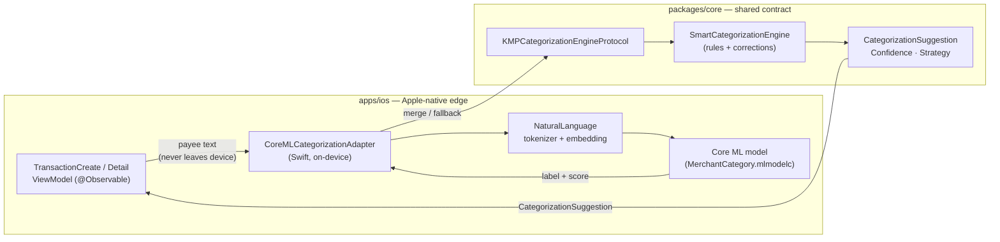
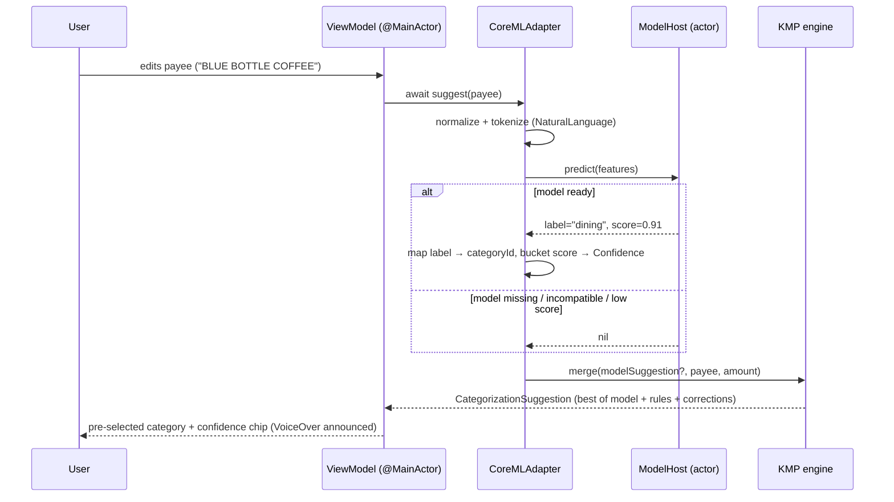

# iOS Core ML Categorization Adapter — Design

> **Status:** Design only (no native build) · **Issue:** [#2613](https://github.com/jrmoulckers/finance/issues/2613) · **Epic:** [#2382](https://github.com/jrmoulckers/finance/issues/2382)
> **Platforms:** iOS 17+ (SwiftUI) · shared contract in KMP `packages/core`
> **Privacy posture:** On-device only. No raw transaction text leaves the device — ever.

This document designs the **iOS-native edge** that turns a transaction's
merchant text into a category suggestion using Apple's on-device machine
learning (Core ML + the Natural Language framework), while keeping the
business contract and rule-based fallback in the shared Kotlin Multiplatform
(KMP) core. It is a **design only**: no Swift is built or signed here, because
native delivery is gated behind Apple Developer enrollment
([#1239](https://github.com/jrmoulckers/finance/issues/1239)). Everything
described is implementable today against a free Personal Team — see
[Implementation readiness](#implementation-readiness).

Companion docs in this cluster:

- [iOS category suggestion review & correction UX](./ios-category-suggestion-review-ux.md) (#2614)
- [Privacy-preserving categorization telemetry & tests](./ios-categorization-privacy-telemetry.md) (#2615)

---

## Table of Contents

1. [Goals & non-goals](#goals--non-goals)
2. [Where this fits: the KMP boundary](#where-this-fits-the-kmp-boundary)
3. [Adapter architecture](#adapter-architecture)
4. [Inference flow](#inference-flow)
5. [Model packaging & versioning](#model-packaging--versioning)
6. [Confidence, thresholds & fallback to shared rules](#confidence-thresholds--fallback-to-shared-rules)
7. [Privacy boundary (no remote data)](#privacy-boundary-no-remote-data)
8. [Accessibility](#accessibility)
9. [State matrix: stale, error, empty & low-confidence](#state-matrix-stale-error-empty--low-confidence)
10. [Affected iOS surfaces & shared dependencies](#affected-ios-surfaces--shared-dependencies)
11. [Smallest test plan](#smallest-test-plan)
12. [Implementation readiness](#implementation-readiness)
13. [Open questions](#open-questions)

---

## Goals & non-goals

**Goals**

- Define a Swift adapter that maps `payee` (merchant text) → a category
  suggestion with a confidence level, **fully on-device**.
- Reuse the existing shared categorization contract instead of inventing a
  parallel one. The shared engine already expresses
  `CategorizationSuggestion`, `Confidence`, and `CategorizationStrategy` in
  [`SmartCategorizationEngine.kt`](../../packages/core/src/commonMain/kotlin/com/finance/core/categorization/SmartCategorizationEngine.kt).
- Specify model packaging, versioning, and a deterministic fallback to the
  shared rule engine when the model is missing, stale, or low-confidence.
- Keep the design conflict-free with concurrent platform work: this is a
  **new doc**, no shared code is modified.

**Non-goals**

- Training pipelines, server-side model hosting, or any cloud inference.
- Implementing Swift code (gated by [#1239](https://github.com/jrmoulckers/finance/issues/1239)).
- Changing the KMP contract in this PR. Any new shared enum case (e.g. an
  `ON_DEVICE_MODEL` strategy) is **proposed via ADR** and owned by
  @native-app-engineer — see [Open questions](#open-questions).

---

## Where this fits: the KMP boundary

The categorization contract is shared and platform-neutral. The Core ML
adapter is a thin, Apple-specific **strategy provider** that feeds a
suggestion into the same shape the rest of the app already consumes.

| Concern                               | Home            | Rationale                                         |
| ------------------------------------- | --------------- | ------------------------------------------------- |
| Suggestion contract & confidence enum | `packages/core` | One vocabulary for iOS, Android, Web, Windows.    |
| Rule-based fallback engine            | `packages/core` | Deterministic, testable, already exists.          |
| User-correction learning store        | `packages/core` | Corrections must sync across devices (see #2614). |
| Core ML / NaturalLanguage inference   | `apps/ios`      | Apple framework; cannot live in `commonMain`.     |
| SwiftUI presentation & VoiceOver      | `apps/ios`      | Platform accessibility semantics.                 |

Today the iOS layer already talks to the shared engine through
`KMPCategorizationEngineProtocol` (used by
[`TransactionCreateViewModel.swift`](../../apps/ios/Finance/ViewModels/TransactionCreateViewModel.swift)).
The Core ML adapter slots **in front of** that bridge as an additional,
higher-recall signal — never replacing user corrections, which always win.



**Boundary rule:** the adapter consumes a `String` payee and produces a value
that conforms to the shared `CategorizationSuggestion` shape. It does not
expand the public KMP surface; it only supplies an additional strategy result
that the shared merge logic ranks against corrections, payee history, keyword
rules, and amount ranges.

---

## Adapter architecture

The adapter is a `Sendable` value type with a single, narrow async entry
point. Inference is CPU/Neural-Engine bound and isolated off the main actor;
only the final `@Observable` state update returns to `@MainActor`.

```swift
// Conceptual — NOT compiled here (native build gated by #1239).
struct CoreMLCategorizationAdapter: Sendable {
    enum ModelState: Sendable {
        case ready(version: ModelVersion)
        case missing            // bundle absent → fall back to rules
        case incompatible       // schema/label-set mismatch → fall back
    }

    /// Returns a suggestion or nil. Nil means "defer to shared rules".
    func suggest(payee: String) async -> RawModelSuggestion?
}

struct RawModelSuggestion: Sendable {
    let categoryId: String      // mapped from model label → SyncId
    let score: Double           // 0.0...1.0 softmax probability
}
```

Key decisions:

- **Actor isolation:** the Core ML `MLModel` handle is wrapped by an
  `actor ModelHost` so the non-`Sendable` model is never shared across tasks.
  No `DispatchQueue` is used; `SWIFT_STRICT_CONCURRENCY = complete` must pass.
- **Label → category mapping:** the model emits abstract labels (e.g.
  `groceries`, `dining`, `transport`). A bundled, versioned
  `LabelCategoryMap` translates labels to the household's `Category.id`
  ([`Category.kt`](../../packages/models/src/commonMain/kotlin/com/finance/models/Category.kt)).
  Unknown labels are dropped (return `nil`), never guessed.
- **Logging:** `os.Logger(subsystem: "com.finance", category: "categorization")`.
  We log model **version, state, latency, and confidence bucket** — never the
  payee string or amount. See
  [privacy telemetry doc](./ios-categorization-privacy-telemetry.md).

---

## Inference flow



Normalization (all on-device, deterministic):

1. Trim, fold case, collapse whitespace, strip obvious processor noise
   (`SQ *`, `TST*`, trailing store numbers) using a bundled regex table.
2. Tokenize with `NLTokenizer`; optionally embed with the bundled word
   embedding for OOV robustness.
3. Predict; take top-1 label + probability.
4. Bucket probability into the shared `Confidence` enum (next section).
5. Hand off to the shared merge so **user corrections always override**.

---

## Model packaging & versioning

- **Format:** a compiled `MerchantCategory.mlmodelc` plus a sidecar
  `model-manifest.json` (semantic `modelVersion`, label set hash,
  `minOSVersion`, training-data cutoff date). Both ship inside the app bundle
  — no download at runtime, no remote fetch.
- **Versioning:** `ModelVersion` is `MAJOR.MINOR.PATCH`.
  - **MAJOR** = label set changed → requires a new `LabelCategoryMap`; old
    suggestions are invalidated.
  - **MINOR** = weights improved, label set stable.
  - **PATCH** = packaging/metadata only.
- **Compatibility gate:** at launch the adapter compares the manifest's label
  set hash to the bundled `LabelCategoryMap` hash. Mismatch ⇒ `ModelState`
  `.incompatible` ⇒ silent fallback to shared rules (logged as a health
  event, never user-facing noise).
- **Staleness:** if `now − trainingCutoff > 12 months`, the model is flagged
  **stale**. It still runs, but confidence is capped at `MEDIUM` and a health
  metric is emitted so we can schedule a model refresh in a future app
  release. Staleness never blocks categorization.
- **Size budget:** target < 5 MB compiled so the App Clip
  (`apps/ios/FinanceClip`) can optionally embed a trimmed variant within its
  15 MB ceiling; the full app has no practical concern.

---

## Confidence, thresholds & fallback to shared rules

The model's softmax score maps to the shared `Confidence` enum so the UI and
telemetry speak one language across platforms:

| Model score `s`   | Mapped `Confidence` | Behavior                                                 |
| ----------------- | ------------------- | -------------------------------------------------------- |
| `s ≥ 0.85`        | `HIGH`              | Pre-select category; show confidence chip.               |
| `0.60 ≤ s < 0.85` | `MEDIUM`            | Pre-select, but emphasize it is a guess; easy to change. |
| `0.40 ≤ s < 0.60` | `LOW`               | Offer as a hint only; do **not** auto-apply.             |
| `s < 0.40`        | — (drop)            | Return `nil`; defer entirely to shared rules.            |

The shared merge then ranks signals (highest wins):

1. **User correction** (`USER_CORRECTION`) — always authoritative.
2. **On-device model** (proposed `ON_DEVICE_MODEL`) at `HIGH`.
3. **Payee frequency** (`PAYEE_FREQUENCY`) at `HIGH`.
4. On-device model at `MEDIUM` vs keyword rules at `HIGH` — tie broken toward
   the deterministic rule for explainability.
5. Remaining rule strategies, then amount range.

If the model is `.missing` or `.incompatible`, the adapter returns `nil` for
**every** transaction and the app behaves exactly like today's rule engine.
This makes the model a strictly additive, fail-safe enhancement.

---

## Privacy boundary (no remote data)

This is a financial app; we default to the most private option.

- **On-device only.** Inference uses bundled Core ML / NaturalLanguage. There
  is no network call in the categorization path. The merchant string is read
  from in-memory transaction state and discarded after prediction.
- **No raw text off device.** Payee strings, amounts, notes, and predicted
  categories are never transmitted. Telemetry is aggregate-only (see
  [#2615](https://github.com/jrmoulckers/finance/issues/2615)).
- **No payee persistence by the adapter.** The adapter is stateless; learning
  is owned by the shared correction store, which syncs only opaque
  `payee → categoryId` mappings already covered by existing sync privacy
  rules.
- **Logging discipline.** Per `os.Logger` privacy rules, financial fields are
  `.private` by redaction (we simply never log them). Only model version,
  state, latency, and confidence bucket are logged `.public`.
- **Regulatory alignment.** Because no personal/transaction data leaves the
  device, GDPR/CCPA exposure for this feature is minimal: there is no new
  processor, no new cross-border transfer, and the user's
  [opt-in telemetry](./ios-categorization-privacy-telemetry.md) is the only
  outbound signal — itself content-free and revocable.

---

## Accessibility

All suggestion surfaces must be fully usable with VoiceOver, Dynamic Type,
Switch Control, and Reduce Motion. Detailed component patterns live in
[accessibility-patterns.md](./accessibility-patterns.md) and
[cognitive-accessibility.md](./cognitive-accessibility.md); the adapter's
obligations are:

- **VoiceOver:** when a suggestion is applied, the category control announces
  label + confidence, e.g. `"Suggested category, Dining, medium confidence,
double-tap to change"`. Confidence is conveyed in **text**, never by color
  alone.
- **Dynamic Type:** confidence chips and the suggestion banner use
  `String(localized:)` text with semantic fonts (`.footnote`, `.body`); no
  hardcoded sizes; layout reflows to accessibility sizes without truncation.
- **Reduce Motion:** any "thinking…" affordance during async inference is a
  static placeholder when Reduce Motion is on (no spinner pulse).
- **Color independence:** confidence uses a CVD-safe encoding (icon + text +
  position), per [data-visualization.md](./data-visualization.md#2-color-system).
- **Non-judgmental copy:** suggestion wording follows
  [content-language-guidelines.md](./content-language-guidelines.md) — "We
  guessed Dining" not "You forgot to categorize this."

---

## State matrix: stale, error, empty & low-confidence

| State              | Trigger                                | Adapter behavior                         | User-facing result                                             |
| ------------------ | -------------------------------------- | ---------------------------------------- | -------------------------------------------------------------- |
| **Empty**          | Payee blank / too short (< 2 chars)    | Return `nil` immediately                 | No suggestion; manual category picker, no error.               |
| **Loading**        | Inference in flight                    | Async task pending                       | Category field shows neutral placeholder; never blocks typing. |
| **Low-confidence** | `0.40 ≤ s < 0.60`                      | Return `LOW`, do not auto-apply          | Dismissible hint ("Maybe: Dining?"); manual choice unchanged.  |
| **Stale model**    | Training cutoff > 12 months            | Run, cap confidence at `MEDIUM`          | Normal suggestions; health metric emitted; no user banner.     |
| **Missing model**  | Bundle resource absent                 | `.missing` → `nil` for all               | Identical to today's rule-only behavior.                       |
| **Incompatible**   | Label-set hash mismatch                | `.incompatible` → `nil` for all          | Rule-only behavior; health event logged.                       |
| **Error**          | Core ML throws (OOM, corrupt resource) | Catch, log code-only, `.missing` for run | Rule fallback; no crash; no data exposed.                      |

The cardinal rule: **a model problem is never a user problem.** Every failure
path degrades gracefully to the deterministic shared engine.

---

## Affected iOS surfaces & shared dependencies

**iOS surfaces (read-only references; not modified in this design):**

- [`TransactionCreateViewModel.swift`](../../apps/ios/Finance/ViewModels/TransactionCreateViewModel.swift)
  — already calls `categorizationEngine.suggest(payee:)`; the adapter becomes
  an upstream signal here.
- `apps/ios/Finance/Screens/TransactionCreateView.swift`,
  `TransactionEditView.swift`, `TransactionDetailView.swift` — render the
  suggestion + confidence (UX in [#2614](https://github.com/jrmoulckers/finance/issues/2614)).
- `apps/ios/Finance/Components/TransactionRowView.swift` — optional inline
  "uncategorized" affordance for batch review.
- `apps/ios/FinanceClip` — optional trimmed model variant for quick capture.

**Shared dependencies (KMP, owned by @native-app-engineer):**

- [`SmartCategorizationEngine.kt`](../../packages/core/src/commonMain/kotlin/com/finance/core/categorization/SmartCategorizationEngine.kt)
  — merge + confidence enum source of truth.
- [`CategorizationEngine.kt`](../../packages/core/src/commonMain/kotlin/com/finance/core/categorization/CategorizationEngine.kt)
  — simpler rule path used via the bridge protocol.
- [`Category.kt`](../../packages/models/src/commonMain/kotlin/com/finance/models/Category.kt)
  — `Category.id` is the suggestion target.

---

## Smallest test plan

Goal: the smallest deterministic suite that must be green **before**
implementation is accepted. Fixtures are committed, fixed-seed, and contain no
real user data.

**Shared (KMP, `commonTest`)**

1. `mergePrefersUserCorrectionOverModel` — given a model `HIGH` + a recorded
   correction, the correction wins.
2. `modelSuggestionRanksBetweenCorrectionAndAmountRange` — ordering invariant.
3. `nilModelSuggestionMatchesRuleOnlyBaseline` — with model `nil`, output is
   byte-identical to the existing rule engine.

**iOS adapter (XCTest, runs on a free Personal Team — buildable now)**

4. `scoreBucketing` — table test mapping scores `{0.39, 0.40, 0.59, 0.60, 0.84, 0.85}`
   to `{nil, LOW, LOW, MEDIUM, MEDIUM, HIGH}`.
5. `payeeNormalizationIsDeterministic` — `"SQ *BLUE BOTTLE #42"` →
   stable normalized token stream across runs.
6. `unknownLabelReturnsNil` — a label absent from `LabelCategoryMap` yields
   `nil`, never a wrong category.
7. `incompatibleManifestFallsBack` — mismatched label-set hash ⇒ `.incompatible`
   ⇒ `nil` for all inputs.
8. `staleModelCapsConfidence` — cutoff > 12 months caps at `MEDIUM`.

**Privacy assertions (shared with [#2615](https://github.com/jrmoulckers/finance/issues/2615))**

9. `noPayeeInLogs` — capture `os.Logger` output for a prediction; assert the
   payee fixture string never appears.
10. `noNetworkInCategorizationPath` — adapter under test with a failing URL
    protocol stub records **zero** outbound requests.

See the full privacy/telemetry suite in
[ios-categorization-privacy-telemetry.md](./ios-categorization-privacy-telemetry.md#smallest-test-plan).

---

## Implementation readiness

Native implementation is split by what a free Apple **Personal Team** can do
versus the distribution tail gated by Apple Developer Program enrollment
([#1239](https://github.com/jrmoulckers/finance/issues/1239)). See the shared
checklist in
[../ops/human-gated-prerequisites.md](../ops/human-gated-prerequisites.md).

**Buildable now (no paid account, no human-gated signing):**

- Author `CoreMLCategorizationAdapter`, `ModelHost` actor, normalization,
  and label mapping in `apps/ios`.
- Bundle `MerchantCategory.mlmodelc` + manifest; run **on-device inference**
  on a simulator or a personally-provisioned device (free Personal Team).
- Run the full XCTest adapter suite and KMP `commonTest` suite locally and in
  CI (`ci-ios`, `ci-shared`).
- Propose the shared `ON_DEVICE_MODEL` strategy via ADR to @native-app-engineer.

**Distribution tail — gated by [#1239](https://github.com/jrmoulckers/finance/issues/1239) (human-gated):**

- App Store / TestFlight distribution of the model-bearing build.
- App Group + Keychain access-group entitlements for sharing a model variant
  with widgets/App Clip across processes (entitlements need a paid team).
- Background model-refresh entitlements, if later added.

No provisioning profiles, certificates, or store submissions are created by
this work. Those remain human-gated.

---

## Open questions

- **ADR for `ON_DEVICE_MODEL`:** add a new `CategorizationStrategy` case vs.
  reuse `KEYWORD_MATCH` semantics? Owned by @native-app-engineer; this doc assumes a
  new additive case.
- **Model provenance:** how is `MerchantCategory.mlmodelc` produced and
  audited (training data must itself be privacy-clean)? Tracked separately;
  not in scope for the iOS edge.
- **App Clip variant:** ship a trimmed model or skip on-device ML in the Clip
  and rely on rules only? Leaning rules-only to protect the 15 MB budget.
