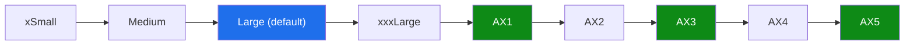
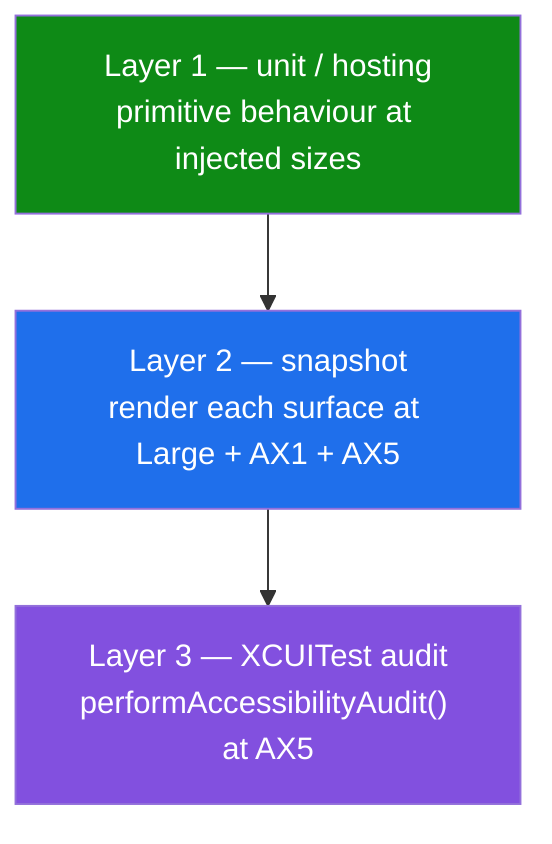

# Accessibility-Size Layout Tests for iOS Dynamic Type — Design

> **Status:** PROPOSED — design only (no native build performed)
> **Issue:** [#2550](https://github.com/jrmoulckers/finance/issues/2550) · Part of [#2119](https://github.com/jrmoulckers/finance/issues/2119)
> **Platform:** iOS / iPadOS (SwiftUI) · Deployment target iOS 17.0
> **Owner:** @ios-engineer
> **Last updated:** 2026-06-22

This document specifies the **automated test harness** that proves core finance
surfaces stay readable and uncut at the largest Dynamic Type (accessibility)
sizes — and catches regressions when they don't. It is the test counterpart to
the layout work in the
[Dynamic Type Reflow Audit](./ios-dynamic-type-reflow-audit.md): that doc says
_what_ to reflow; this doc says _how we prove it stays reflowed_. It is
design-only — the distribution tail is gated by Apple Developer enrollment
([#1239](https://github.com/jrmoulckers/finance/issues/1239)); local build and
test need no paid account.

---

## Table of Contents

1. [Why this matters](#1-why-this-matters)
2. [Scope — surfaces under test](#2-scope--surfaces-under-test)
3. [The AX1–AX5 size matrix](#3-the-ax1ax5-size-matrix)
4. [What "passing" means (assertions)](#4-what-passing-means-assertions)
5. [Test layers](#5-test-layers)
6. [Snapshot harness at AX sizes](#6-snapshot-harness-at-ax-sizes)
7. [XCTest accessibility audits](#7-xctest-accessibility-audits)
8. [Unit tests for the Dynamic Type primitives](#8-unit-tests-for-the-dynamic-type-primitives)
9. [Privacy, balance hiding, and redaction under reflow](#9-privacy-balance-hiding-and-redaction-under-reflow)
10. [Stale, error, and empty states](#10-stale-error-and-empty-states)
11. [Shared dependencies and the KMP boundary](#11-shared-dependencies-and-the-kmp-boundary)
12. [Smallest tests plan](#12-smallest-tests-plan)
13. [CI integration](#13-ci-integration)
14. [Implementation readiness](#14-implementation-readiness)
15. [References](#15-references)

---

## 1. Why this matters

A user who raises Larger Text to AX5
(`accessibilityExtraExtraExtraLarge`) must still see the **whole** amount, payee,
category, and chart summary — not "$1,2…" or a number shrunk below legibility.
Clipping or auto-shrinking financial figures is both an accessibility failure
(WCAG 2.2 — 1.4.4 Resize Text, 1.4.10 Reflow) and a correctness hazard: a
truncated balance can be misread.

The reflow fixes themselves are specified in
[ios-dynamic-type-reflow-audit.md](./ios-dynamic-type-reflow-audit.md). The gap
this doc closes is **durable, automated coverage**: today nothing fails CI when a
new `lineLimit(1)` or hardcoded font sneaks back in. This design adds an
AX-size snapshot matrix plus accessibility audits so a regression is caught
before merge, not by a user at AX5.

---

## 2. Scope — surfaces under test

The five surface clusters named in [#2550](https://github.com/jrmoulckers/finance/issues/2550),
mapped to real files in `apps/ios/`:

| Cluster                  | Primary view(s)                                                                                                                                                                                                                                                            | Why it is risk-prone at AX                        |
| ------------------------ | -------------------------------------------------------------------------------------------------------------------------------------------------------------------------------------------------------------------------------------------------------------------------- | ------------------------------------------------- |
| **Dashboard**            | [`DashboardView.swift`](../../apps/ios/Finance/Screens/DashboardView.swift)                                                                                                                                                                                                | net-worth hero, 3-column summary, recent rows     |
| **Transactions**         | [`TransactionsView.swift`](../../apps/ios/Finance/Screens/TransactionsView.swift) · [`TransactionRowView.swift`](../../apps/ios/Finance/Components/TransactionRowView.swift) · [`TransactionDetailView.swift`](../../apps/ios/Finance/Screens/TransactionDetailView.swift) | payee/category/amount collision in one row        |
| **Analytics / Insights** | [`AnalyticsView.swift`](../../apps/ios/Finance/Screens/AnalyticsView.swift) · [`InsightsView.swift`](../../apps/ios/Finance/Screens/InsightsView.swift)                                                                                                                    | metric cards (`lineLimit(1)`), chart legends/axes |
| **Reports**              | [`ReportBuilderView.swift`](../../apps/ios/Finance/Screens/ReportBuilderView.swift) · [`ReportResultView.swift`](../../apps/ios/Finance/Screens/ReportResultView.swift)                                                                                                    | grouped numeric tables, summary totals            |
| **Investment detail**    | [`InvestmentDetailView.swift`](../../apps/ios/Finance/Screens/InvestmentDetailView.swift) · [`InvestmentPortfolioView.swift`](../../apps/ios/Finance/Screens/InvestmentPortfolioView.swift)                                                                                | metric grid, holding rows, performance chart      |

Supporting components exercised through these surfaces — and therefore covered
transitively — include
[`CurrencyLabel.swift`](../../apps/ios/Finance/Components/CurrencyLabel.swift),
[`ProgressRing.swift`](../../apps/ios/Finance/Components/ProgressRing.swift),
[`BudgetProgressChart.swift`](../../apps/ios/Finance/Charts/BudgetProgressChart.swift),
[`EmptyStateView.swift`](../../apps/ios/Finance/Components/EmptyStateView.swift),
[`ErrorStateView.swift`](../../apps/ios/Finance/Components/ErrorStateView.swift),
and [`OfflineBanner.swift`](../../apps/ios/Finance/Components/OfflineBanner.swift).

---

## 3. The AX1–AX5 size matrix

SwiftUI exposes the size via `@Environment(\.dynamicTypeSize)` and the
`dynamicTypeSize.isAccessibilitySize` flag. Tests drive the size either by
injecting `.dynamicTypeSize(_:)` into a hosting view (unit/snapshot) or via the
launch environment for UI tests:

```swift
app.launchEnvironment["UIPreferredContentSizeCategory"] =
    "UICTContentSizeCategoryAccessibilityExtraExtraExtraLarge" // AX5
```



The **size sampling strategy** keeps the suite fast while covering the failure
boundary:

| Tier           | Sizes run              | Where                                   | Rationale                                                      |
| -------------- | ---------------------- | --------------------------------------- | -------------------------------------------------------------- |
| **Boundary**   | `Large`, `AX5`         | every surface, every PR (required gate) | the default and the worst case catch ~all clipping regressions |
| **Pivot**      | `xxxLarge`, `AX1`      | every surface, every PR                 | `AX1` is where `HStack → VStack` reflow first triggers         |
| **Full sweep** | `AX1`–`AX5` (all five) | nightly / label `run-full-a11y`         | confirms monotonic behaviour across the accessibility band     |

`AX1` and `AX5` are the two non-negotiable assertions: `AX1` is the reflow
trip-point (`isAccessibilitySize` becomes true) and `AX5` is the maximum stress.

---

## 4. What "passing" means (assertions)

A surface **passes** at a given size when all of the following hold:

1. **No clipping / truncation of financial figures.** No amount renders with a
   trailing ellipsis or is cut by its container. Text labels (payee, category,
   insight, legend, security name) **wrap**; they do not truncate.
2. **Pairs are stacked at AX.** Any `label ↔ value` row (summary columns, metric
   cards, holding rows) is laid out vertically once `isAccessibilitySize` is
   true — verified through the
   [`AdaptiveFinanceStack`](../../apps/ios/Finance/Accessibility/DynamicTypeSupport.swift)
   primitive choosing `VStack`.
3. **Amounts shrink to a readable floor, never below.**
   [`SizeConstrainedCurrencyText`](../../apps/ios/Finance/Accessibility/DynamicTypeSupport.swift)
   clamps via `ClampedScaledMetric(min:max:)` rather than an open-ended
   `minimumScaleFactor`.
4. **Tap targets stay ≥ 44 pt** (scaled) per
   [accessibility-patterns.md §8](./accessibility-patterns.md#8-touch-target-sizing).
5. **The accessibility tree is unchanged by reflow.** The spoken label/value for
   a row is identical at `Large` and `AX5` — layout changes, meaning does not
   (the [#2544 contract](./ios-transaction-row-voiceover-labels.md#5-voiceover-label--value--trait-composition)).
6. **`performAccessibilityAudit()` reports zero issues** of type `.textClipped`
   / `.dynamicType` (see [§7](#7-xctest-accessibility-audits)).

---

## 5. Test layers

Three layers, cheapest first — mirroring the pyramid in
[ios-transaction-accessibility-regression.md §3](./ios-transaction-accessibility-regression.md#3-test-pyramid-for-accessibility):



- **Layer 1 (most tests):** pure/hosting tests of the Dynamic Type primitives —
  fast, deterministic, no rendering of full screens ([§8](#8-unit-tests-for-the-dynamic-type-primitives)).
- **Layer 2 (the core gate):** deterministic snapshots of each surface at a fixed
  device size × the size tiers ([§6](#6-snapshot-harness-at-ax-sizes)).
- **Layer 3 (semantic safety net):** running-app audits that flag clipped text
  and missing semantics the snapshot eye might miss ([§7](#7-xctest-accessibility-audits)).

---

## 6. Snapshot harness at AX sizes

Snapshots are the primary regression gate. Each surface is rendered from a
**fixed fixture view model** (no network, no clock dependency) into a hosting
controller, at a fixed device width, across the size tiers.

```swift
// Conceptual — render a surface deterministically at a chosen size.
@MainActor
func snapshot(_ view: some View, size: DynamicTypeSize, device: SnapshotDevice) -> UIImage {
    let host = UIHostingController(
        rootView: view
            .environment(\.dynamicTypeSize, size)
            .frame(width: device.width)
    )
    return host.renderImage() // deterministic; no animations
}

func testDashboardReflowAcrossSizes() {
    let vm = DashboardViewModel.fixture(.populated) // stable fixture
    for size in [.large, .accessibility1, .accessibility5] {
        assertSnapshot(of: DashboardView(viewModel: vm), size: size, device: .iPhoneSE) // narrowest
        assertSnapshot(of: DashboardView(viewModel: vm), size: size, device: .iPhone15Pro)
    }
}
```

Harness rules:

- **Determinism first.** Fixtures are frozen — fixed amounts, fixed dates, fixed
  category names, a fixed currency (`USD`) plus one long-name locale case
  (e.g. a German payee) to exercise wrapping. No live data, no `Date()`.
- **Narrowest device is mandatory.** iPhone SE (compact width) is the hardest
  reflow case; every surface snapshots there at `AX5`.
- **Tolerance is near-zero** for layout pixels but allows sub-pixel
  antialiasing; reference images live beside the tests and are reviewed on diff.
- **One image per (surface × size × device)** keeps failures legible — a diff
  points to exactly which combination regressed.
- **Previews mirror the snapshots.** Each reflowed view ships a
  `.dynamicTypeSize(.accessibility5)` Xcode preview so authors see the worst case
  while editing.

> Snapshot tests need no paid signing — they run on the iOS Simulator. Where the
> team prefers not to vendor reference images, the same fixtures feed the Layer 3
> audit (which asserts _behaviour_, not pixels) as the required gate, with
> snapshots as an advisory check.

---

## 7. XCTest accessibility audits

`XCUIApplication.performAccessibilityAudit()` (Xcode 15+, iOS 17) is the
semantic safety net. It surfaces `.textClipped`, `.dynamicType`,
`.contrast`, `.hitRegion`, and `.elementDetection` issues automatically.

```swift
func testTransactionsNoClippingAtAX5() throws {
    let app = XCUIApplication()
    app.launchEnvironment["UIPreferredContentSizeCategory"] =
        "UICTContentSizeCategoryAccessibilityExtraExtraExtraLarge"
    app.launchEnvironment["FINANCE_FIXTURE"] = "transactions.populated"
    app.launch()
    app.tabBars.buttons["tab_transactions"].tap()

    try app.performAccessibilityAudit(for: [.textClipped, .dynamicType, .hitRegion]) { issue in
        // Allow nothing for text clipping on money surfaces.
        return false // do not suppress — every reported issue fails the test
    }
}
```

- Run the audit for **Dashboard, Transactions, Analytics, Insights, Reports,
  Investment detail** at `AX5` (the boundary tier).
- The audit complements snapshots: snapshots catch _visual_ reflow, the audit
  catches _semantic_ clipping and sub-minimum hit regions a static image can hide.
- Audits reuse the same fixtures as the snapshots via `launchEnvironment`, so the
  two layers test the same frozen data.

---

## 8. Unit tests for the Dynamic Type primitives

The primitives that make reflow cheap already exist in
[`DynamicTypeSupport.swift`](../../apps/ios/Finance/Accessibility/DynamicTypeSupport.swift).
Lock their behaviour with fast, pure tests so the snapshot layer can trust them:

1. **`ClampedScaledMetricTests`** — the wrapped value never drops below `min`
   nor exceeds `max` across `xSmall → AX5`; the base value is returned at
   `Large`.
2. **`AdaptiveFinanceStackTests`** — host the view with an injected
   `dynamicTypeSize`; assert it chooses `VStack` when `isAccessibilitySize`
   (`AX1`–`AX5`) and `HStack` otherwise (`xSmall`–`xxxLarge`). The `AX1` boundary
   is the critical assertion.
3. **`SizeConstrainedCurrencyTextTests`** — the rendered font size is clamped at
   the `min: 14, max: 52` bounds; the amount string is never altered (only its
   size), and its `.accessibilityLabel` equals the formatted amount.
4. **`FinanceTextStyleTests`** — every `FinanceTextStyle` resolves to a
   Dynamic-Type-aware `Font.TextStyle` (no `.system(size:)` literal escapes the
   enum).

These are the **smallest** tests and the first to run; a primitive regression
fails here before any screen is rendered.

---

## 9. Privacy, balance hiding, and redaction under reflow

Layout tests must not weaken the privacy contract:

- **Redaction placeholders reflow identically.** When amounts are hidden
  (privacy mode / `.privacySensitive()`), the snapshot at `AX5` must show the
  redaction placeholder occupying the **same reflowed slot** the real amount
  would — no layout "jump" on reveal. A dedicated fixture
  (`dashboard.privacyHidden`) snapshots the hidden state at `Large` and `AX5`.
- **Hidden on screen ⇒ "Amount hidden" to VoiceOver.** The audit asserts that a
  redacted figure is never re-exposed by reflow, upholding
  [#2544 §9](./ios-transaction-row-voiceover-labels.md#9-privacy--balance-hiding).
- **No financial values in test logs.** Snapshot/audit failures report the
  surface, size, and device — never a balance. Test logging stays `.public`
  metadata only, consistent with the `os.Logger` privacy rules.

---

## 10. Stale, error, and empty states

Each surface has non-happy states that also reflow and must be covered:

| State         | Fixture     | Assertion at AX5                                                                                                                    |
| ------------- | ----------- | ----------------------------------------------------------------------------------------------------------------------------------- |
| Empty         | `*.empty`   | [`EmptyStateView`](../../apps/ios/Finance/Components/EmptyStateView.swift) title/message wrap, centered; CTA grows and stays ≥44pt. |
| Error         | `*.error`   | [`ErrorStateView`](../../apps/ios/Finance/Components/ErrorStateView.swift) message wraps; Retry stays full-width, tappable.         |
| Stale/offline | `*.offline` | [`OfflineBanner`](../../apps/ios/Finance/Components/OfflineBanner.swift) text wraps to two lines, not truncated.                    |
| Loading       | `*.loading` | skeleton/`ProgressView` respects size; no fixed-height row clips its label.                                                         |

Empty/error/offline fixtures snapshot at `Large` and `AX5` for at least the
Dashboard and Transactions surfaces (the most-seen non-happy paths).

---

## 11. Shared dependencies and the KMP boundary

- **All layout and test code is `apps/ios`-only.** No `packages/` change is
  required or proposed; this is presentation-layer testing.
- **Fixtures map from shared models.** Test view models hydrate from
  `TransactionItem` / portfolio / report types that mirror `packages/models`
  via the [Swift Export bridge](../../apps/ios/Finance/KMP/SwiftExportBridge.swift);
  tests use the in-repo `Stub`/`Mock` repositories
  ([`Repositories/Mocks`](../../apps/ios/Finance/Repositories/Mocks/)) so no
  network or live KMP runtime is needed.
- **Numeric/currency formatting stays shared**; only the _presentation_ is under
  test here. Any shared-package change would go through an ADR with `@architect`.

---

## 12. Smallest tests plan

The minimum acceptance gate, in dependency order:

1. **Unit (Layer 1):** `ClampedScaledMetricTests`, `AdaptiveFinanceStackTests`
   (the `AX1` boundary), `SizeConstrainedCurrencyTextTests` — fast, pure.
2. **Audit (Layer 3):** `performAccessibilityAudit(for: [.textClipped,
.dynamicType])` at `AX5` on the four highest-traffic surfaces — Dashboard,
   Transactions, Analytics, Investment detail — **zero** reported issues.
3. **Snapshot (Layer 2):** Dashboard + Transactions at `Large` and `AX5` on
   iPhone SE (narrowest) — the two surfaces most prone to row collision.

Reports and Insights join the snapshot/audit set in the same PR but the gate is
green once (1)–(3) pass. The full `AX1`–`AX5` sweep runs nightly.

---

## 13. CI integration

- Wire the unit + audit suites into the existing iOS test job invoked by
  `node tools/agent-scripts/pre-push-check.js --fix`; they run on the Simulator
  with `SWIFT_STRICT_CONCURRENCY = complete`.
- The **required** PR gate is the boundary tier (`Large` + `AX5`) audits plus the
  primitive unit tests — fast enough for every push.
- The **full sweep** (`AX1`–`AX5`, multi-device snapshots) runs on a nightly
  schedule and on PRs carrying a `run-full-a11y` label, keeping per-PR time low.
- A failing snapshot/audit blocks merge; reference-image updates are an explicit,
  reviewed diff (never auto-accepted).

---

## 14. Implementation readiness

See [`docs/ops/human-gated-prerequisites.md`](../ops/human-gated-prerequisites.md)
(§2 — implementation vs. distribution decoupling).

**Buildable now (no human gate):**

- The entire test harness — primitive unit tests, AX-size snapshots, and
  `performAccessibilityAudit()` runs — is implementable today on the iOS
  Simulator and a personal device using **free Personal Team** signing. No paid
  enrollment is needed to write or run accessibility tests.

**Gated by [#1239](https://github.com/jrmoulckers/finance/issues/1239):**

- Only a **paid physical-device test matrix** under a distribution team, and
  TestFlight/App Store delivery of the verified build, sit behind enrollment. The
  test design and its local execution need none of these.

No human-gated operation is required to implement or verify this test plan.

---

## 15. References

- Companion design: [Dynamic Type Reflow Audit (#2548)](./ios-dynamic-type-reflow-audit.md)
  — the layout changes these tests defend.
- Sibling coverage: [Transaction Accessibility Regression (#2546)](./ios-transaction-accessibility-regression.md)
  · [Transaction Row VoiceOver Labels (#2544)](./ios-transaction-row-voiceover-labels.md)
- Related: [Semantic Non-Color Financial State Cues (#2552)](./ios-noncolor-financial-state-cues.md)
  · [Apply Redundant Financial State Cues (#2554)](./ios-redundant-financial-state-cues.md)
- Repo primitives: [`DynamicTypeSupport.swift`](../../apps/ios/Finance/Accessibility/DynamicTypeSupport.swift)
  · [`AccessibilityModifiers.swift`](../../apps/ios/Finance/Accessibility/AccessibilityModifiers.swift)
- Cross-platform: [Accessibility Patterns Library](./accessibility-patterns.md) — §5 Color & Contrast, §8 Touch Target Sizing
  · [Cognitive Accessibility Mode](./cognitive-accessibility.md) · [Responsive Breakpoints](./responsive-breakpoints.md)
- Standards: Apple HIG — Typography, Dynamic Type · WCAG 2.2 — 1.4.4 Resize Text, 1.4.10 Reflow
