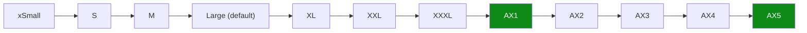
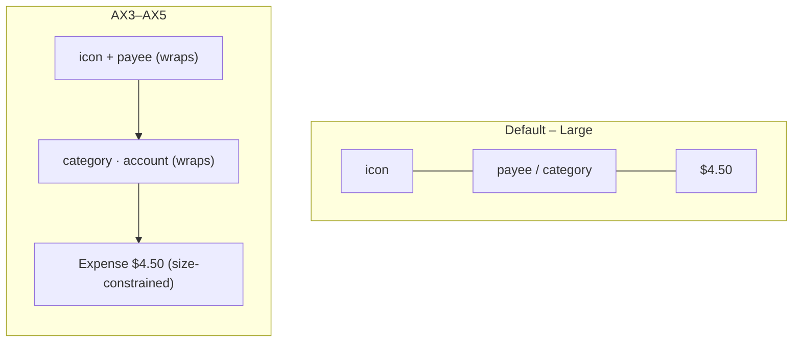

# Dynamic Type Reflow Audit — Core iOS Finance Surfaces — Design

> **Status:** PROPOSED — pending human review
> **Issue:** [#2548](https://github.com/jrmoulckers/finance/issues/2548) · Part of [#2119](https://github.com/jrmoulckers/finance/issues/2119)
> **Platform:** iOS / iPadOS (SwiftUI) · Deployment target iOS 17.0
> **Labels:** `platform:ios` · `accessibility` · `priority:high` · `effort:m`
> **Author:** iOS engineer (design only — no native build performed)

This document audits where core finance surfaces clip, shrink, or truncate text
at large Dynamic Type sizes and specifies how to replace one-line
truncation / `minimumScaleFactor` patterns with **wrapping** and
**accessibility-size vertical stacks**. It is design-only; the distribution tail
is gated by Apple Developer enrollment
([#1239](https://github.com/jrmoulckers/finance/issues/1239)).

---

## Table of Contents

1. [Why this matters](#1-why-this-matters)
2. [The anti-pattern](#2-the-anti-pattern)
3. [Dynamic Type sizes and the AX threshold](#3-dynamic-type-sizes-and-the-ax-threshold)
4. [Reflow strategy toolkit](#4-reflow-strategy-toolkit)
5. [Surface-by-surface audit](#5-surface-by-surface-audit)
6. [Transaction row reflow (worked example)](#6-transaction-row-reflow-worked-example)
7. [Charts, legends, and axis labels](#7-charts-legends-and-axis-labels)
8. [Redundant non-color cues and contrast](#8-redundant-non-color-cues-and-contrast)
9. [Privacy — balance hiding under reflow](#9-privacy--balance-hiding-under-reflow)
10. [Stale, error, and empty states](#10-stale-error-and-empty-states)
11. [Shared dependencies and the KMP boundary](#11-shared-dependencies-and-the-kmp-boundary)
12. [Smallest tests plan](#12-smallest-tests-plan)
13. [Implementation readiness](#13-implementation-readiness)
14. [References](#14-references)

## 1. Why this matters

Money has to stay readable at every text size. A user who sets Larger Text to
AX5 (`accessibilityExtraExtraExtraLarge`) needs the _whole_ amount, payee, and
category — not "$1,2…" or a font shrunk below legibility. Truncating or
auto-shrinking financial figures is both an accessibility failure (WCAG 1.4.4
Resize Text, 1.4.10 Reflow) and a correctness hazard: a clipped balance can be
misread.

## 2. The anti-pattern

The recurring pattern across the codebase is "force one line, then shrink":

```swift
Text(value)
    .font(.title3)
    .lineLimit(1)            // refuse to wrap
    .minimumScaleFactor(0.7) // shrink up to 30% instead
```

At AX sizes this either clips (when shrink hits its floor) or renders amounts
markedly smaller than surrounding text — defeating the user's size preference.
The fix is to **let text wrap** and, at accessibility sizes, **stack
horizontally-paired labels vertically** so each gets the full width.

Confirmed occurrences (non-exhaustive) found by scanning
`apps/ios/Finance/Screens` and `Components` for `minimumScaleFactor` /
`lineLimit(1)`:

| File                                                                                            | Where                                                          |
| ----------------------------------------------------------------------------------------------- | -------------------------------------------------------------- |
| [`AnalyticsView.swift`](../../apps/ios/Finance/Screens/AnalyticsView.swift)                     | metric card value (`lineLimit(1)` + `minimumScaleFactor(0.7)`) |
| [`InvestmentDetailView.swift`](../../apps/ios/Finance/Screens/InvestmentDetailView.swift)       | metric values                                                  |
| [`InvestmentPortfolioView.swift`](../../apps/ios/Finance/Screens/InvestmentPortfolioView.swift) | holding row text                                               |
| [`TransactionRowView.swift`](../../apps/ios/Finance/Components/TransactionRowView.swift)        | payee / category `lineLimit(1)`                                |
| [`TransactionsView.swift`](../../apps/ios/Finance/Screens/TransactionsView.swift)               | inline row payee / category                                    |
| [`DashboardView.swift`](../../apps/ios/Finance/Screens/DashboardView.swift)                     | recent-row payee, summary columns                              |
| [`InsightsView.swift`](../../apps/ios/Finance/Screens/InsightsView.swift)                       | insight text                                                   |
| [`ProgressRing.swift`](../../apps/ios/Finance/Components/ProgressRing.swift)                    | centered percentage                                            |
| [`NlpInputView.swift`](../../apps/ios/Finance/Screens/NlpInputView.swift)                       | parsed field text                                              |

## 3. Dynamic Type sizes and the AX threshold



The five **accessibility** sizes (AX1–AX5) are the design pivot. SwiftUI exposes
this via `@Environment(\.dynamicTypeSize)` and `dynamicTypeSize.isAccessibilitySize`.
The repo already ships the right primitive — `AdaptiveFinanceStack` in
[`DynamicTypeSupport.swift`](../../apps/ios/Finance/Accessibility/DynamicTypeSupport.swift)
switches `HStack → VStack` at accessibility sizes — but it is **not yet adopted
by any screen**. This audit is largely "adopt the primitives we already have".

## 4. Reflow strategy toolkit

| Tool                                                  | Use it for                                                         | Replaces                        |
| ----------------------------------------------------- | ------------------------------------------------------------------ | ------------------------------- |
| `AdaptiveFinanceStack`                                | label↔value pairs that should stack vertically at AX               | rigid `HStack` rows             |
| `ViewThatFits`                                        | "horizontal if it fits, else vertical" without a manual size check | `minimumScaleFactor`            |
| Remove `lineLimit(1)` / allow wrapping                | payee, category, insight text                                      | one-line truncation             |
| `SizeConstrainedCurrencyText` + `ClampedScaledMetric` | prominent amounts that must scale but never below a floor          | `minimumScaleFactor(0.7)`       |
| `@ScaledMetric`                                       | icon sizes, padding, tap targets that must grow with text          | hardcoded point dimensions      |
| `allowsTightening(true)` (sparingly)                  | a single short label where a 1–2% squeeze avoids a wrap            | aggressive `minimumScaleFactor` |

Rules of thumb:

1. **Amounts may shrink to a readable floor, never clip.** Use
   `SizeConstrainedCurrencyText` (already in the repo) which clamps via
   `ClampedScaledMetric(min:max:)` instead of an open-ended 0.7 factor.
2. **Text labels wrap, they do not truncate.** Drop `lineLimit(1)` on payee,
   category, insight, and legend text; give them the full width by stacking.
3. **Pairs stack at AX.** Any `label — value` row (summary columns, metric
   cards, holding rows) becomes vertical at `isAccessibilitySize`.

## 5. Surface-by-surface audit

| Surface                       | Symptom at AX3–AX5                                | Reflow fix                                                                                        |
| ----------------------------- | ------------------------------------------------- | ------------------------------------------------------------------------------------------------- |
| Transactions list rows        | payee + amount collide; amount squeezed right     | `AdaptiveFinanceStack`: payee/category over amount; wrap payee; amount uses size-constrained text |
| Dashboard recent rows         | same collision; "See All" header crowds title     | adopt the consolidated `TransactionRowView`; wrap header, stack at AX                             |
| Dashboard summary columns     | 3-column `HStack` (Income/Expenses/Net) overflows | switch to vertical list of label/value pairs at AX; drop fixed `Divider` heights                  |
| Dashboard net-worth card      | `largeTitle` amount can clip on narrow devices    | `SizeConstrainedCurrencyText`; allow two lines; keep `combine` label                              |
| Analytics metric cards        | `lineLimit(1)` + `minimumScaleFactor(0.7)` clips  | remove forced single line; stack icon/title/value; size-constrained value                         |
| Analytics chart legends       | legend chips truncate / wrap mid-word             | use `FlowLayout` (already in repo) so chips wrap as units; never truncate a series name           |
| Investment portfolio holdings | symbol + name + value cram into one row           | stack at AX; wrap the security name                                                               |
| Investment detail metrics     | metric grid shrinks numbers                       | same metric-card fix; remove `minimumScaleFactor`                                                 |
| Insights cards                | insight sentence truncates to one line            | allow multi-line wrapping; no `lineLimit(1)`                                                      |
| Progress ring percentage      | centered number overflows the ring                | move the precise value to an adjacent wrapping label at AX; ring shows coarse fill only           |

Existing repo assets that make these cheap: `AdaptiveFinanceStack`,
`SizeConstrainedCurrencyText`, `ClampedScaledMetric`, `DynamicTypeMetrics`
([`DynamicTypeSupport.swift`](../../apps/ios/Finance/Accessibility/DynamicTypeSupport.swift)),
and [`FlowLayout`](../../apps/ios/Finance/Components/FlowLayout.swift) for legends/chips.

## 6. Transaction row reflow (worked example)



```swift
// Conceptual — horizontal by default, vertical at accessibility sizes.
AdaptiveFinanceStack {
    IconView(transaction.type.iconToken, size: iconSize)   // @ScaledMetric icon
        .accessibilityHidden(true)
    VStack(alignment: .leading) {
        Text(transaction.payee)                            // no lineLimit(1) → wraps
        Text("\(transaction.category) · \(transaction.accountName)")
            .font(.caption).foregroundStyle(.secondary)    // wraps
    }
    SizeConstrainedCurrencyText(amount: formatted)         // clamps, never clips
}
// One combined label/value per row stays intact — see #2544.
```

The **accessibility label is unchanged by reflow** (the #2544 contract): the
spoken content must be identical at Large and at AX5. Layout changes; meaning
does not.

## 7. Charts, legends, and axis labels

[`AnalyticsView`](../../apps/ios/Finance/Screens/AnalyticsView.swift) and
[`InvestmentPortfolioView`](../../apps/ios/Finance/Screens/InvestmentPortfolioView.swift)
use Swift Charts with the CVD-safe palette. At large sizes:

- **Legends** must wrap as whole chips (`FlowLayout`); a series name is never
  truncated. Provide an `.accessibilityLabel` per legend entry pairing the
  series name with its color-independent role.
- **Axis labels** should thin out (fewer ticks) rather than overlap; prefer
  abbreviated, locale-aware number formatting on the axis while the
  `AccessibilityChartDescriptor` / per-mark `.accessibilityLabel` carries the
  full value for VoiceOver.
- The **chart itself** keeps a summary `.accessibilityLabel` (already present,
  e.g. "Portfolio performance line chart") and exposes data points via Audio
  Graphs where practical.

## 8. Redundant non-color cues and contrast

Reflow must not remove non-color cues. When chips/legends wrap, keep the textual
label next to each swatch; when amounts move below payee, keep the `+`/`−` sign
and the income/expense icon. Verify the reflowed layouts under Increase
Contrast, Smart Invert, and Bold Text. This aligns with
[Accessibility Patterns §5 Color & Contrast](./accessibility-patterns.md#5-color--contrast)
and the larger-target guidance in
[Cognitive Accessibility Mode](./cognitive-accessibility.md#7-touch-target-requirements).

## 9. Privacy — balance hiding under reflow

If amounts are hidden (privacy mode or `.privacySensitive()` redaction), the
reflowed layout must reserve space for the redaction placeholder so the row does
not visually "jump" when balances are revealed, and the placeholder must wrap /
size identically. The VoiceOver redaction rule from
[#2544 §9](./ios-transaction-row-voiceover-labels.md#9-privacy--balance-hiding)
still applies: hidden on screen ⇒ "Amount hidden" to VoiceOver. Reflow never
re-exposes a hidden figure.

## 10. Stale, error, and empty states

| State         | Reflow consideration                                                                                                                                                 |
| ------------- | -------------------------------------------------------------------------------------------------------------------------------------------------------------------- |
| Empty         | [`EmptyStateView`](../../apps/ios/Finance/Components/EmptyStateView.swift) title/message must wrap and remain centered at AX; CTA button grows with `@ScaledMetric`. |
| Error         | [`ErrorStateView`](../../apps/ios/Finance/Components/ErrorStateView.swift) message wraps; Retry button stays full-width and tappable (≥44pt scaled).                 |
| Stale/offline | [`OfflineBanner`](../../apps/ios/Finance/Components/OfflineBanner.swift) text wraps to two lines rather than truncating at AX.                                       |
| Loading       | `ProgressView` label unaffected; ensure surrounding skeleton respects size.                                                                                          |

## 11. Shared dependencies and the KMP boundary

- All reflow work is **SwiftUI layout** in `apps/ios` — no `packages/` change.
- Amount/locale formatting comes from
  [`CurrencyLabel`](../../apps/ios/Finance/Components/CurrencyLabel.swift) (apps/ios),
  fed by `TransactionItem` mapped from `packages/models` via the
  [Swift Export bridge](../../apps/ios/Finance/KMP/SwiftExportBridge.swift). The
  numeric/currency rules stay shared; the _presentation_ stays native.
- Any shared-package change goes through an ADR with `@architect`.

## 12. Smallest tests plan

- **Snapshot at AX sizes (primary):** render each audited surface at Large and
  AX5 via `app.launchEnvironment["UIPreferredContentSizeCategory"]`; assert no
  clipping and that label↔value pairs are stacked. Pairs with the snapshot layer
  in [#2546 §6](./ios-transaction-accessibility-regression.md#6-layer-3--snapshot-at-ax-text-sizes).
- **XCUITest accessibility audit:** `app.performAccessibilityAudit()` reports a
  `.textClipped` / `.dynamicType` issue when text truncates — run for
  Transactions, Dashboard, Analytics, Investments at AX5.
- **Unit:** assert `ClampedScaledMetric` floors/ceilings and that
  `AdaptiveFinanceStack` chooses `VStack` when `isAccessibilitySize` is true
  (inject the trait via environment in a hosting controller).
- **Preview coverage:** add `.dynamicTypeSize(.accessibility5)` previews for each
  reflowed view so regressions are visible in Xcode previews.

The smallest acceptance gate: the four primary surfaces pass
`performAccessibilityAudit()` at AX5 with zero text-clipping issues.

## 13. Implementation readiness

See [`docs/ops/human-gated-prerequisites.md`](../ops/human-gated-prerequisites.md).

**Buildable now (no human gate):**

- All reflow refactors and their snapshot/audit tests are implementable today on
  the iOS Simulator and a personal device using **free Personal Team** signing.
  No paid enrollment is needed to change layouts, adopt the existing Dynamic Type
  primitives, or run accessibility audits at AX sizes.

**Gated by [#1239](https://github.com/jrmoulckers/finance/issues/1239):**

- TestFlight / App Store distribution of the reflowed build, and any
  physical-device test matrix run under a paid team. The layout work itself
  needs none of these.

No human-gated operation is required to implement or verify this audit.

## 14. References

- Sibling designs: [transaction-row VoiceOver labels (#2544)](./ios-transaction-row-voiceover-labels.md) ·
  [accessibility regression coverage (#2546)](./ios-transaction-accessibility-regression.md)
- Repo primitives: [`DynamicTypeSupport.swift`](../../apps/ios/Finance/Accessibility/DynamicTypeSupport.swift) ·
  [`FlowLayout.swift`](../../apps/ios/Finance/Components/FlowLayout.swift)
- [Accessibility Patterns Library](./accessibility-patterns.md) — §5 Color & Contrast, §8 Touch Target Sizing
- [Cognitive Accessibility Mode](./cognitive-accessibility.md) — typography & spacing changes
- [Responsive Breakpoints](./responsive-breakpoints.md) — cross-platform reflow philosophy
- Apple HIG — Typography, Dynamic Type · WCAG 2.2 — 1.4.4 Resize Text, 1.4.10 Reflow
