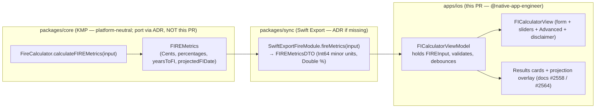

# iOS Financial-Independence (FI/FIRE) Calculator — Flow & Surface Design

> Native SwiftUI flow for a Financial-Independence / Retire-Early (FIRE)
> calculator on iPhone and iPad: sensible **default assumptions**, a progressive
> **Advanced** disclosure for the levers that matter, live **sensitivity
> controls** (safe-withdrawal rate and expected return), and explicit
> **validation states** — feeding the results + goal-integration surface
> designed in
> [ios-fire-results-goal-integration.md](./ios-fire-results-goal-integration.md).

**Status:** PROPOSED — design only (implementation gated where noted)
**Issue:** [#2556](https://github.com/jrmoulckers/finance/issues/2556) — Part of [#2114](https://github.com/jrmoulckers/finance/issues/2114)
**Platform:** iOS / iPadOS (SwiftUI, iOS 17+)
**Owner:** @native-app-engineer
**Related design:** [ios-fire-results-goal-integration.md](./ios-fire-results-goal-integration.md) · [ios-net-worth-projection-overlay.md](./ios-net-worth-projection-overlay.md) · [ios-net-worth-trend-chart.md](./ios-net-worth-trend-chart.md) · [data-visualization.md](./data-visualization.md) · [accessibility-patterns.md](./accessibility-patterns.md) · [content-language-guidelines.md](./content-language-guidelines.md) · [ux-principles.md](./ux-principles.md) · [Human-Gated Prerequisites](../ops/human-gated-prerequisites.md)

---

## Table of Contents

1. [Goal & Scope](#1-goal--scope)
2. [Placement & Navigation](#2-placement--navigation)
3. [Inputs & Default Assumptions](#3-inputs--default-assumptions)
4. [Advanced Section (Progressive Disclosure)](#4-advanced-section-progressive-disclosure)
5. [Sensitivity Controls (SWR & Expected Return)](#5-sensitivity-controls-swr--expected-return)
6. [Validation States](#6-validation-states)
7. [Financial-Advice Safety: Estimates, Assumptions, Disclaimers](#7-financial-advice-safety-estimates-assumptions-disclaimers)
8. [Accessibility](#8-accessibility)
9. [Dynamic Type](#9-dynamic-type)
10. [Privacy: Balance Hiding](#10-privacy-balance-hiding)
11. [States: Empty, Loading, Stale & Error](#11-states-empty-loading-stale--error)
12. [Affected Surfaces & Shared Dependencies](#12-affected-surfaces--shared-dependencies)
13. [Native ↔ Shared Boundary](#13-native--shared-boundary)
14. [Test Plan](#14-test-plan)
15. [Implementation Readiness](#15-implementation-readiness)
16. [Open Questions](#16-open-questions)

---

## 1. Goal & Scope

Answer a single motivating question — **"How close am I to financial
independence, and what changes the answer?"** — with a calm, single-screen
SwiftUI flow that works for a first-time user (sensible defaults, one number to
enter) _and_ a power user (every assumption is editable and its effect is
visible immediately).

This document covers the **input/flow half** of the FIRE feature. The numeric
**outputs** (FI number, years-to-FI, Coast FI, projected FI date, SWR
sensitivity) and their **goal-linking summary cards** live in the companion
[ios-fire-results-goal-integration.md](./ios-fire-results-goal-integration.md);
the **net-worth projection overlay** that visualizes the contribution-paced path
toward those targets lives in
[ios-net-worth-projection-overlay.md](./ios-net-worth-projection-overlay.md).
The three are intentionally separable surfaces around one shared computation.

**In scope (this design):**

- A `FICalculatorView` SwiftUI screen with a form of FIRE inputs.
- A small set of **default assumptions** so the screen is useful with the
  fewest possible taps.
- An **Advanced** disclosure group for the less-common levers (expected return,
  ages, income) so the default surface stays uncluttered.
- Live **sensitivity controls** (safe-withdrawal-rate and expected-return
  sliders/steppers) that re-derive results without leaving the screen.
- **Validation** for every field with inline, non-blocking error states.
- Empty / loading / **stale** / error states and a privacy (balance-hiding)
  mode.

**Out of scope (deliberately deferred):**

- The results presentation and goal cards — see
  [ios-fire-results-goal-integration.md](./ios-fire-results-goal-integration.md).
- The projection chart overlay — see
  [ios-net-worth-projection-overlay.md](./ios-net-worth-projection-overlay.md).
- Monte-Carlo / sequence-of-returns simulation, tax modeling, Social Security,
  and healthcare bridges (the web reference has scaffolding for these under
  `apps/web/src/lib/investment/`; they are follow-on issues under #2114, not part
  of the v1 deterministic calculator).
- watchOS, widgets, and App Clip variants.

> **Why a single screen, not a wizard:** per
> [ux-principles](./ux-principles.md) (_"respect the user's time; progressive
> disclosure over multi-step gates"_) the common case is one field (annual
> expenses) on top of prefilled defaults. A multi-step wizard would add friction
> for a calculation users want to re-run and tweak repeatedly.

---

## 2. Placement & Navigation

- **Entry point:** a "Financial Independence" row in the existing
  [`InsightsView`](../../apps/ios/Finance/Screens/InsightsView.swift) (planning
  section) and a deep link from the FIRE results cards. It is a pushed
  destination on a `NavigationStack`, not a new tab — consistent with the
  list-first information architecture used by
  [`AnalyticsView`](../../apps/ios/Finance/Screens/AnalyticsView.swift) and
  [`HealthScoreView`](../../apps/ios/Finance/Screens/HealthScoreView.swift).
- **Type-safe routing:** add an `FICalculator` case to the app's
  `NavigationPath` route enum so the screen is reachable from Insights and from
  the results surface without untyped string routes.
- **Prefill on open:** current portfolio (investable net worth) and an annual
  expense estimate are **prefilled from already-computed aggregates** (the same
  Swift Export aggregator the dashboard uses), so a returning user sees a
  meaningful result immediately and only edits what they want to change.
- **Results handoff:** the screen owns the inputs; tapping "See results" (or
  scrolling to the inline results section) renders the cards from
  [ios-fire-results-goal-integration.md](./ios-fire-results-goal-integration.md).
  v1 keeps inputs and results on **one scrollable screen** (form on top, result
  cards below) so sensitivity changes are visible without navigation.

```
┌──────────────────────────────────────────────┐
│  ‹ Insights        Financial Independence      │  ← nav title
│                                                │
│  Annual spending                     $42,000 › │  ← the one field most edit
│  Current investments                $310,000 › │  ← prefilled from aggregates
│                                                │
│  Safe withdrawal rate          4.0%  ◉────────│  ← sensitivity slider
│  Expected real return          5.0%  ────◉────│  ← sensitivity slider
│                                                │
│  ▸ Advanced (ages, income, savings)            │  ← DisclosureGroup, collapsed
│                                                │
│  ┌── Estimate ──────────────────────────────┐ │
│  │ FI number      $1,050,000                 │ │  ← results (doc #2558)
│  │ Years to FI    ~12 years (est.)           │ │
│  └───────────────────────────────────────────┘ │
│  These are estimates based on your assumptions.│  ← disclaimer (always visible)
└──────────────────────────────────────────────┘
```

---

## 3. Inputs & Default Assumptions

The calculator binds to the shared `FIREInput` contract (see
[§13](#13-native--shared-boundary)). Fields, defaults, and rationale:

| Field                     | Control                     | Default                                 | Rationale / source                                                              |
| ------------------------- | --------------------------- | --------------------------------------- | ------------------------------------------------------------------------------- |
| **Annual spending**       | Currency `TextField`        | Derived from trailing-12-month expenses | The single most-important input; prefilled from aggregates, always editable.    |
| **Current investments**   | Currency `TextField`        | Investable net worth from aggregator    | Prefilled; user can override (e.g., exclude home equity).                       |
| **Safe withdrawal rate**  | `Slider` + stepper (§5)     | **4.0%**                                | The "4% rule" baseline; the default the whole field is anchored on.             |
| **Expected real return**  | `Slider` + stepper (§5)     | **5.0%** (real, inflation-adjusted)     | Conservative long-run real equity/bond blend; clearly labeled "real".           |
| **Annual savings**        | Currency `TextField` (adv.) | Derived from trailing income − expenses | Drives years-to-FI; prefilled, editable in Advanced.                            |
| **Annual income**         | Currency `TextField` (adv.) | Derived from trailing income            | Used only for the savings-rate readout; optional.                               |
| **Current age**           | Stepper / `Picker` (adv.)   | Empty (optional)                        | Needed for Coast FI; if blank, Coast FI is shown as "Add your age to see this". |
| **Target retirement age** | Stepper / `Picker` (adv.)   | 65 (used only when current age is set)  | Coast FI horizon; never assumed without an explicit current age.                |

**Default-assumption rules**

- **Defaults are labeled, not hidden.** Every default value is visible in its
  control (the SWR slider reads "4.0%", not a blank), so the user always knows
  what assumption produced the estimate. This is a financial-advice-safety
  requirement, not just polish (see [§7](#7-financial-advice-safety-estimates-assumptions-disclaimers)).
- **Defaults are conservative and documented.** 4% SWR and 5% real return are
  the conventional FIRE-community baselines; a one-line "Why these defaults?"
  info row (a `.popover`/`.sheet` with plain-language explanations and the
  not-advice disclaimer) explains them without cluttering the form.
- **Currency & locale come from the shared formatter**, never hardcoded — the
  same module the dashboard and [`CurrencyLabel`](../../apps/ios/Finance/Components/CurrencyLabel.swift)
  use — so symbols, grouping, and minor units are correct per locale. All
  amounts are integer **minor units** (`Int64`) across the bridge, matching
  [`GoalItem`](../../apps/ios/Finance/Models/GoalItem.swift)'s `…MinorUnits`
  convention.
- **Reset to defaults** is always one tap away (toolbar overflow → "Reset
  assumptions"), so experimentation is reversible.

---

## 4. Advanced Section (Progressive Disclosure)

The less-common levers live in a `DisclosureGroup` labeled **"Advanced (ages,
income, savings)"**, collapsed by default.

- **Contents:** annual savings, annual income, current age, target retirement
  age, and a per-field "Why this matters" hint.
- **Expansion persists** via `@AppStorage` (`fiCalculator.advancedExpanded`) — a
  non-secret UI preference, so `UserDefaults` is appropriate (no financial data
  is persisted there; only the open/closed flag).
- **No recompute penalty:** changing Advanced fields re-derives results from the
  same already-bound input struct; there is no separate "apply" step.
- **Coast FI gating:** Coast FI (in the results surface) is only meaningful with
  a current age + target retirement age. When those are blank, the Advanced
  section shows an inline prompt ("Add your age to estimate Coast FI") rather
  than fabricating an age — never silently assume a personal attribute.
- **Accessibility:** the `DisclosureGroup` header is a real button with
  `.accessibilityHint("Shows additional assumptions")` and an
  `.accessibilityValue` of "expanded"/"collapsed"; expanding moves VoiceOver
  focus to the first revealed field.

---

## 5. Sensitivity Controls (SWR & Expected Return)

Two assumptions dominate the result and are surfaced **on the main form** (not
buried in Advanced) as live sensitivity controls:

| Control                  | Range     | Step | Default | Notes                                                                  |
| ------------------------ | --------- | ---- | ------- | ---------------------------------------------------------------------- |
| **Safe withdrawal rate** | 2.5%–6.0% | 0.1% | 4.0%    | Lower = larger FI number (more conservative).                          |
| **Expected real return** | 0%–10%    | 0.5% | 5.0%    | Higher = fewer years to FI; clearly labeled **real** (post-inflation). |

**Behavioral rules**

- **Live, debounced recompute.** Each control is a `Slider` paired with a
  `Stepper` and a numeric readout. Dragging recomputes on a short debounce
  (~150 ms) so the result cards and the projection overlay update smoothly
  without thrashing the bridge (compute is cheap and deterministic — see
  [§13](#13-native--shared-boundary)).
- **Bounded inputs prevent nonsense.** The ranges above are enforced by the
  control so the user cannot enter a 0% or 50% withdrawal rate; the math's own
  guards (e.g., `withdrawalRate <= 0 → FI number 0`) remain a backstop.
- **Sensitivity is the point.** A small caption under each slider states the
  directional effect in plain language ("A lower withdrawal rate means a bigger
  target and a safer plan"), reinforcing that the output is assumption-driven.
  The dedicated **SWR sensitivity strip** (4.0% / 3.5% / 3.0% side-by-side) is
  rendered in the results surface — see
  [ios-fire-results-goal-integration.md §SWR sensitivity](./ios-fire-results-goal-integration.md).
- **Reduce Motion.** Result figures crossfade on change; when
  `accessibilityReduceMotion` is on, values swap instantly (no number-rolling
  animation), consistent with
  [data-visualization §8](./data-visualization.md).
- **Touch targets.** Sliders and steppers meet the 44×44 pt minimum; the stepper
  gives a precise, VoiceOver-friendly alternative to dragging.

---

## 6. Validation States

Validation is **inline, non-blocking, and plain-language** — the screen never
hard-errors; it guides. Logic lives in the `@Observable` view model as derived
state.

| Field / condition                               | State       | Presentation                                                                                                        |
| ----------------------------------------------- | ----------- | ------------------------------------------------------------------------------------------------------------------- |
| Annual spending empty                           | **Prompt**  | Result section shows an empty state ("Enter your annual spending to see your FI number"); not an error.             |
| Annual spending ≤ 0 or non-numeric              | **Invalid** | Inline caption "Enter an amount greater than zero"; field tinted with a warning, results suppressed for that field. |
| Current investments < 0                         | **Invalid** | "Investments can't be negative."                                                                                    |
| Target retirement age ≤ current age             | **Invalid** | "Retirement age must be after your current age." Coast FI suppressed until fixed.                                   |
| SWR / return outside slider range               | **Clamped** | Control prevents it; no error needed (defensive only).                                                              |
| Savings = 0 **and** return = 0 (FI unreachable) | **Warning** | Years-to-FI reads "Not reachable with these assumptions" (the math returns `maxYears`); non-judgmental, factual.    |
| All required inputs valid                       | **Valid**   | Results + projection render; disclaimer remains visible.                                                            |

**Rules**

- **Validation messages are guidance, not scolding** — phrased per
  [content-language-guidelines](./content-language-guidelines.md) (factual,
  non-judgmental, no exclamation/blame). "Not reachable with these assumptions"
  is framed as information about the _assumptions_, never about the person.
- **Errors are field-scoped.** One invalid field suppresses only the results it
  affects; the rest of the screen stays usable (mirrors the card-scoped error
  philosophy in [ios-net-worth-trend-chart.md §8](./ios-net-worth-trend-chart.md)).
- **VoiceOver parity.** An invalid field exposes its message via
  `.accessibilityValue`/`.accessibilityHint` (e.g., "Invalid. Enter an amount
  greater than zero") so the guidance is not visual-only; focus is **not** stolen
  on every keystroke (announce on commit / focus loss to avoid VoiceOver spam).

---

## 7. Financial-Advice Safety: Estimates, Assumptions, Disclaimers

This is a planning calculator, **not financial advice**, and the design must make
that unmistakable.

- **Always-visible disclaimer.** A persistent footer below the results reads:
  _"These are estimates based on the assumptions above, not financial advice.
  Real returns vary and are not guaranteed."_ It is real text (Dynamic Type,
  selectable), not an image, and is included in the VoiceOver reading order.
- **Every output is labeled an estimate.** Derived numbers carry an "est." or
  "estimated" qualifier (e.g., "~12 years (est.)"), and projected dates use
  "around"/"by about" phrasing — never a falsely precise single date. The
  results-surface copy in
  [ios-fire-results-goal-integration.md §Estimate labeling](./ios-fire-results-goal-integration.md)
  owns the per-card wording; this screen guarantees the disclaimer is present
  wherever inputs are edited.
- **Assumptions travel with the result.** Because the SWR and return are on the
  same screen as the output, the user can never see an FI number without seeing
  the assumptions that produced it. A "Why these defaults?" info affordance
  explains each in plain language.
- **No guarantees, no targets framed as promises.** Copy avoids "you will retire
  at…"; it uses "with these assumptions, you'd reach your target around…".
- **Deterministic, transparent math.** v1 uses the deterministic shared
  functions (no hidden Monte-Carlo), so the relationship between inputs and
  outputs is explainable; future probabilistic modeling is a separate, clearly
  labeled feature.

---

## 8. Accessibility

Per [accessibility-patterns](./accessibility-patterns.md) and the app's existing
VoiceOver conventions (see
[`ConfidenceIndicatorView`](../../apps/ios/Finance/Components/ConfidenceIndicatorView.swift)
and [`PredictionChart`](../../apps/ios/Finance/Charts/PredictionChart.swift)):

- **Every control is labeled.** Currency fields, sliders, steppers, and the
  Advanced disclosure each have a `String(localized:)` `.accessibilityLabel`,
  a `.accessibilityValue` reflecting the current value (e.g., the SWR slider
  reads "4.0 percent"), and a `.accessibilityHint` for directional effect.
- **Sliders use adjustable semantics.** The SWR/return sliders are inherently
  `.adjustable` to VoiceOver (swipe up/down to change), and the paired stepper
  gives a discrete, predictable alternative for users who find continuous
  sliders hard to target — a non-gesture path to the same value.
- **Plain-language explanations of estimates.** The disclaimer, the "Why these
  defaults?" content, and per-field hints are all spoken; VoiceOver users hear
  _why_ a number is an estimate, not just the number (a core requirement of this
  batch).
- **Switch Control / Full Keyboard Access.** Every field, slider, stepper, and
  disclosure is a real focusable control with a label; no value is reachable only
  by drag.
- **Contrast.** Warning tints, captions, and result text meet ≥ 4.5:1 in light,
  dark, and high-contrast themes; validation never relies on color alone — it is
  always accompanied by an icon + text (per
  [data-visualization §2.4 "Never Color Alone"](./data-visualization.md)).
- **Focus management.** Expanding Advanced or revealing a validation message moves
  or announces focus deliberately; results updates use
  `.accessibilityRespondsToUserInteraction` so live recomputation is discoverable
  but not interruptive.

---

## 9. Dynamic Type

- **No hardcoded font sizes.** Field labels use `.body`, the result figures reuse
  `CurrencyLabel` (already Dynamic-Type aware), slider readouts use `.callout`,
  captions/disclaimer use `.footnote`/`.caption`. All scale through AX1–AX5.
- **Layout reflow at large sizes.** Two-column rows (label + value) collapse to
  stacked label-over-value at `accessibility1`+ via
  `@Environment(\.dynamicTypeSize)` and `ViewThatFits`, so nothing truncates. The
  SWR/return controls stack their readout above the slider at large sizes.
- **Disclaimer never clips.** The financial-advice disclaimer wraps to as many
  lines as needed; it is verified visible (not truncated) at AX5 in
  [§14](#14-test-plan).

---

## 10. Privacy: Balance Hiding

The screen honors the app-wide balance-hiding / privacy mode (the same posture as
[`PrivacySettingsView`](../../apps/ios/Finance/Screens/PrivacySettingsView.swift)
and the net-worth surfaces):

- When privacy mode is active, **prefilled and entered amounts** (current
  investments, savings, income, FI number, result figures) are masked
  ("•••••"); the **assumption controls** (SWR %, return %, ages) remain visible
  because they reveal no balance.
- **Accessibility parity:** masked figures are also masked to VoiceOver ("hidden")
  — never speak an amount that is visually hidden.
- **Privacy-screen on backgrounding:** the screen participates in the existing
  app-switcher snapshot redaction; no special exemption.
- **Logging:** per the `os.Logger` rules, amounts are `.private` and never
  logged. Log only non-sensitive events ("FI calculator opened", "assumptions
  reset", "SWR changed") at `.public` — counts and which control changed, never
  a value. This matches the logging discipline in
  [`GoalsViewModel`](../../apps/ios/Finance/ViewModels/GoalsViewModel.swift).

---

## 11. States: Empty, Loading, Stale & Error

| State       | Trigger                                        | Presentation                                                                                                                                                               |
| ----------- | ---------------------------------------------- | -------------------------------------------------------------------------------------------------------------------------------------------------------------------------- |
| **Loading** | Prefill aggregates not yet resolved            | Form renders with skeleton placeholders in prefilled fields; assumption controls are usable immediately. Respects Reduce Motion (static placeholder).                      |
| **Empty**   | No spending data to prefill (new user)         | Fields blank with prompts; results section shows `EmptyStateView` ("Enter your spending to estimate your FI number"). No fabricated defaults for personal amounts.         |
| **Stale**   | Prefill derived from a cached/offline snapshot | Render prefilled values + a subtle "Based on data as of {relative time}" caption; reuse [`OfflineBanner`](../../apps/ios/Finance/Components/OfflineBanner.swift) offline.  |
| **Error**   | Prefill aggregate load fails                   | Inline, non-modal: fields fall back to blank/editable + a compact "Couldn't load your latest figures — enter them manually" with Retry. The calculator stays fully usable. |

Design rationale:

- **A failed prefill is never a dead end.** The calculator works entirely on
  manually entered values; a prefill failure degrades to manual entry, it does
  not block the feature (mirrors the card-scoped, non-fatal error pattern in
  [ios-net-worth-trend-chart.md §8](./ios-net-worth-trend-chart.md)).
- **Stale is informational, not alarming.** The app is local-first; showing
  slightly old prefill with an "as of" stamp is correct.
- **Empty prompts, never assumes.** The screen will not invent a spending figure;
  it asks. Only impersonal assumptions (SWR, return) have defaults.

---

## 12. Affected Surfaces & Shared Dependencies

### 12.1 iOS surfaces (all in `apps/ios/`, owned by @native-app-engineer)

| Surface                                                        | Change                                                                                               |
| -------------------------------------------------------------- | ---------------------------------------------------------------------------------------------------- |
| `Finance/Screens/FICalculatorView.swift` **(new)**             | The form: inputs, defaults, Advanced disclosure, sensitivity controls, validation, disclaimer.       |
| `Finance/ViewModels/FICalculatorViewModel.swift` **(new)**     | `@Observable` VM: holds `FIREInput`, derives results via the bridge, owns validation + states.       |
| `Finance/Models/FIREInputUI.swift` **(new)**                   | Swift-native input/value types (minor-unit `Int64`, percentages) mapped to/from the bridge contract. |
| `Finance/Screens/InsightsView.swift` **(modify)**              | Add a "Financial Independence" entry row + `NavigationPath` route.                                   |
| `Finance/KMP/SwiftExportBridge.swift` + protocols **(modify)** | Expose an `fireMetrics(input:)` bridge call (see [§13](#13-native--shared-boundary)).                |
| `Finance/KMP/StubSwiftExportBridge.swift` **(modify)**         | Stub `fireMetrics` for previews/tests, so the UI is independently developable.                       |
| `Finance/Resources/*.lproj/Localizable.strings` **(modify)**   | New localized strings (field labels, defaults rationale, validation, disclaimer, masks).             |

### 12.2 Shared dependencies (KMP — **not edited by this design**)

- **FIRE math** — `calculateFINumber`, `calculateFIPercent`, `calculateCoastFI`,
  `calculateSavingsRate`, `calculateYearsToFI`, and the aggregate
  `calculateFIREMetrics(input)` currently exist as a **canonical TypeScript
  reference** in
  [`apps/web/src/lib/investment/fire-calculator.ts`](../../apps/web/src/lib/investment/fire-calculator.ts)
  with tests in `fire-calculator.test.ts`. Their **platform-neutral home is
  `packages/core`** (alongside the existing analytics models such as
  [`NetWorthSnapshot`](../../packages/core/src/commonMain/kotlin/com/finance/core/analytics/NetWorthSnapshot.kt)),
  re-exported via the FinanceSync Swift Export bridge.
- **Money/locale formatting** — the shared currency formatter module already used
  by the dashboard / `CurrencyLabel`.

> **The shared FIRE engine is not yet in `packages/core` (KMP).** Porting it from
> the web reference — preserving parity with `fire-calculator.test.ts` — is a
> `packages/` change **owned by @native-app-engineer and proposed via ADR** (per
> ownership rules); iOS must not implement the math or edit `packages/`. The iOS
> surface binds to a Swift-native `FIPlanningBridge` protocol with a stub, so this
> screen is fully buildable/testable before the Kotlin port lands (see
> [§13](#13-native--shared-boundary) and [§15](#15-implementation-readiness)).

---

## 13. Native ↔ Shared Boundary

ViewModels talk to a Swift-native bridge **protocol**, never to KMP types
directly — the same pattern as `DashboardViewModel` and the trend-chart design.



**Responsibilities**

| Concern                                                              | Layer                         |
| -------------------------------------------------------------------- | ----------------------------- |
| FI number, FI %, Coast FI, savings rate, years-to-FI, projected date | `packages/core` (shared)      |
| Compound-growth / growing-annuity iteration, SWR math                | `packages/core` (shared)      |
| Type mapping (`Cents`→`Int64`, percentage→`Double`, date→`Date`)     | Swift Export bridge           |
| Input collection, defaults, prefill from aggregates                  | iOS (`FICalculatorViewModel`) |
| **Validation** + clamping + debounce                                 | iOS                           |
| Estimate labeling, disclaimer copy, "Why these defaults?"            | iOS (a11y/content semantics)  |
| Sensitivity slider UX, Reduce Motion, Dynamic Type                   | iOS                           |

- **iOS does not re-implement the math.** It assembles a validated `FIREInput`
  and renders the returned metrics. If iOS finds itself computing FI numbers, the
  boundary has been crossed.
- **Determinism enables instant sensitivity.** Because `calculateFIREMetrics` is
  pure and cheap, sliders can recompute live with a tiny debounce and no bridge
  round-trip concerns (the call is synchronous-fast; still invoked off the main
  actor with results applied on `@MainActor`).
- **Parity guard.** The shared port must match the web reference's documented
  behaviors (e.g., `withdrawalRate ≤ 0 → FI number 0`, unreachable →
  `maxYears`), so the iOS validation copy in [§6](#6-validation-states) aligns
  with the math's guards rather than duplicating them.

---

## 14. Test Plan

Smallest set that must pass before implementation is accepted. Names are
illustrative targets in existing locations.

### 14.1 Shared (KMP) — verify/port parity, not re-implement here

- The ported `FireCalculatorTest` (KMP) must mirror the web
  `fire-calculator.test.ts` cases: FI number at 4% = expenses × 25; FI % including
  over-100%; Coast FI discounting; savings rate; years-to-FI iteration including
  the **unreachable → maxYears** and **already-FI → 0** edges; projected-FI-date
  derivation. Adding/porting these is **@native-app-engineer via ADR**, not this PR.

### 14.2 Bridge

- `SwiftExportBridgeTests`: `fireMetrics(input:)` maps `Cents → Int64` minor
  units and percentages → `Double` correctly, round-trips a zero/edge input, and
  returns the same fields the UI binds.

### 14.3 iOS unit (XCTest, `apps/ios/Tests/`)

1. **`FICalculatorViewModelTests`**
   - Prefill: aggregates populate spending/investments; failure → blank +
     `.error` (manual-entry fallback), not a crash (spy bridge).
   - Validation: spending ≤ 0 → invalid + results suppressed; retirement age ≤
     current age → Coast FI suppressed; savings = 0 & return = 0 → "not reachable"
     state.
   - Sensitivity: changing SWR/return re-derives metrics; debounce coalesces rapid
     changes (assert recompute call count on a spy bridge).
   - Defaults: SWR 4.0% / return 5.0% applied on first open; "Reset assumptions"
     restores them.
2. **`FIREInputMappingTests`** (pure, no UI)
   - UI input ↔ bridge DTO mapping is lossless for minor units and percentages;
     clamping keeps SWR/return within range.

### 14.4 iOS UI / a11y (`apps/ios/Tests/UITests/`)

3. **`FICalculatorUITests`**
   - The screen shows `fi_calculator_form`; editing spending updates the result
     section; the disclaimer is present.
   - **VoiceOver:** SWR slider exposes an adjustable value ("4.0 percent") and a
     directional hint; the disclaimer is in the reading order.
   - **Dynamic Type:** at AX5 no label/disclaimer is truncated and sliders remain
     operable (reflowed).
   - **Privacy mode:** balance-hiding masks amounts and result figures but leaves
     assumption percentages visible.
   - **Reduce Motion:** result figures swap without animation.

### 14.5 Gate

`node tools/agent-scripts/pre-push-check.js --fix` (lint + strict-concurrency)
plus the suites above. `SWIFT_STRICT_CONCURRENCY = complete` must pass: the bridge
DTO and input types are `Sendable`; UI state is `@MainActor`.

---

## 15. Implementation Readiness

Per the [Human-Gated Prerequisites runbook](../ops/human-gated-prerequisites.md)
(§2, _Implementation vs. Distribution decoupling_), the Apple Developer enrollment
blocker [#1239](https://github.com/jrmoulckers/finance/issues/1239) gates
**distribution only** — not implementation. This design and its implementation are
**buildable and testable now**.

### Buildable now (no enrollment, no secrets)

- ✅ **This design doc** — fully unblocked, no Apple account required.
- ✅ The `FICalculatorView`, `@Observable` view model, sensitivity sliders,
  Advanced disclosure, validation, and disclaimer — all SwiftUI + Swift
  concurrency.
- ✅ All unit + UI/a11y tests in [§14](#14-test-plan), run in the iOS Simulator.
- ✅ On-device verification via **free Personal Team signing** (a free Apple ID in
  Xcode): 7-day app expiry, max 3 apps/device, no TestFlight/push — all acceptable
  for verifying this feature.
- ✅ Against the `StubSwiftExportBridge` `fireMetrics`, the entire screen is
  developable and testable **before** the Kotlin port lands.

### Distribution tail — gated by #1239 (human, not this PR)

- 🔒 App Store / TestFlight builds, release signing, and CI release
  (`release-ios.yml`) require Apple Developer Program enrollment ($99/yr), signing
  material, an App Store Connect API key, and GitHub secrets. These are
  **human-gated** (runbook §3.2) and **out of scope** here.

### Dependency note (process gate, not human-gated)

The shared **FIRE engine must be ported to `packages/core`** from the web
reference (parity with `fire-calculator.test.ts`) and **re-exported** through the
`packages/sync` Swift Export bridge. That is a `packages/` change **owned by
@native-app-engineer and proposed via ADR** — not implemented in this iOS PR. Until it
lands, the UI builds against the stub bridge, so the iOS surface is independently
developable; only the live numbers depend on the shared port.

### Needs Human Action

- None for design **or** iOS implementation up to the distribution boundary. The
  only human-gated step is shipping to TestFlight/App Store, tracked by
  [#1239](https://github.com/jrmoulckers/finance/issues/1239); see
  [runbook §3.2](../ops/human-gated-prerequisites.md#32-ios-distribution--apple-developer-1239).

---

## 16. Open Questions

1. **Shared engine location:** new `packages/core/.../planning/FireCalculator.kt`
   vs. extending the existing `analytics` package? (ADR decision with
   @native-app-engineer.)
2. **Real vs. nominal return:** default to **real** (proposed, simpler — no
   separate inflation input) vs. nominal + an inflation field in Advanced?
3. **Inline vs. pushed results:** v1 keeps inputs + results on one scroll
   (proposed) — confirm vs. a separate results screen on small devices.
4. **Prefill source for "investable" net worth:** total net worth vs. excluding
   illiquid assets (home equity) by default? (Affects FI realism.)
5. **Sensitivity ranges:** are SWR 2.5–6.0% and return 0–10% the right bounds, or
   should they be configurable/locale-aware?
