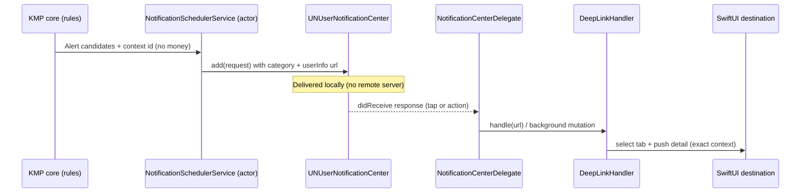
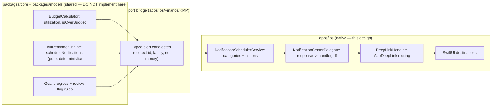

# Actionable iOS Finance Alerts — Rules & Deep-Link Design

> A design for **actionable** local notifications: the budget-threshold, bill,
> goal, and transaction-review alert families, the `UNNotificationCategory`
> actions attached to each, and the deep links that land the user on the _exact_
> context — the over-budget category, the due bill, the reached goal, the
> transaction needing review — in one tap.

**Status:** PROPOSED — design only (native implementation buildable now; store distribution gated)
**Issue:** [#2597](https://github.com/jrmoulckers/finance/issues/2597) — Part of [#2163](https://github.com/jrmoulckers/finance/issues/2163)
**Platform:** iOS / iPadOS (SwiftUI, `UserNotifications`, iOS 17+)
**Owner:** @native-app-engineer
**Related:** [ios-notification-center-navigation.md](./ios-notification-center-navigation.md) · [ios-smart-notification-timing.md](./ios-smart-notification-timing.md) · [content-language-guidelines.md](./content-language-guidelines.md) · [accessibility-patterns.md](./accessibility-patterns.md) · [ios-noncolor-financial-state-cues.md](./ios-noncolor-financial-state-cues.md) · [Human-Gated Prerequisites](../ops/human-gated-prerequisites.md)

---

## Table of Contents

1. [Goal & Scope](#1-goal--scope)
2. [Current State](#2-current-state)
3. [Alert Families & Rules](#3-alert-families--rules)
4. [Actionable Categories & Actions](#4-actionable-categories--actions)
5. [Deep-Link Routing](#5-deep-link-routing)
6. [End-to-End Flow](#6-end-to-end-flow)
7. [Privacy & Balance Hiding in Previews](#7-privacy--balance-hiding-in-previews)
8. [Empty, Stale & Error States](#8-empty-stale--error-states)
9. [Accessibility](#9-accessibility)
10. [Native ↔ KMP Boundary](#10-native--kmp-boundary)
11. [Affected Surfaces & Shared Dependencies](#11-affected-surfaces--shared-dependencies)
12. [Test Plan (Smallest Tests First)](#12-test-plan-smallest-tests-first)
13. [Implementation Readiness](#13-implementation-readiness)
14. [Open Questions](#14-open-questions)

---

## 1. Goal & Scope

A finance alert that says "your Groceries budget needs attention" but drops the
user on a generic Home screen wastes the moment of intent. This design specifies
**actionable** local notifications: each alert family carries the right
`UNNotificationAction`s and a deep link that opens the precise context, so the
user can act (review, snooze, mark paid) without hunting.

**In scope:**

- The four alert families — **budget threshold**, **bill**, **goal milestone**,
  **transaction review** — and the rule inputs that produce them.
- The `UNNotificationCategory` + `UNNotificationAction` set per family.
- The deep-link routes (additive to the existing `AppDeepLink`) and the
  notification-response → navigation handoff.
- Privacy of the delivered preview, accessibility, and failure handling.

**Out of scope:**

- The summary surface / IA — see
  [ios-notification-center-navigation.md](./ios-notification-center-navigation.md).
- _When_ each alert fires — see
  [ios-smart-notification-timing.md](./ios-smart-notification-timing.md).
- The rule **arithmetic** (budget utilization, due-date math), which is shared
  KMP work ([§10](#10-native--kmp-boundary)).

---

## 2. Current State

Grounded in the repository:

- [`NotificationSchedulerService`](../../apps/ios/Finance/Services/NotificationSchedulerService.swift)
  already sets `content.categoryIdentifier` from
  `NotificationType.categoryIdentifier` (`finance.<rawValue>`) and a
  `threadIdentifier`, but registers **no** `UNNotificationCategory`/actions and
  attaches **no** deep link — so notifications are currently inert taps.
- [`SmartAlert`](../../apps/ios/Finance/Models/NotificationModels.swift) already
  carries an optional `actionURL: String?` — the hook this design fills in.
- [`DeepLinkHandler`](../../apps/ios/Finance/Navigation/DeepLinkHandler.swift)
  is a mature `@Observable` router with an `AppDeepLink` enum, custom-scheme
  (`finance://`) + Universal Link parsing, per-tab routing, and consume/clear
  semantics. It already handles `account`, `transaction`, `budgetCategory`,
  `quickEntry`, and `clipExpense`.
- [`FinanceWidgetDeepLinks`](../../apps/ios/Shared/WidgetPrivacy.swift) shows the
  established pattern: **deep links carry identifiers only, never money.**
- The app wires `.onOpenURL { deepLinkHandler.handle(url) }` in
  [`FinanceApp`](../../apps/ios/Finance/FinanceApp.swift).

**Conclusion:** the router, the URL convention, and the `actionURL` slot all
exist. This design adds the **categories/actions**, the **new routes**, and the
**`UNUserNotificationCenterDelegate` handoff** — reusing the router verbatim.

---

## 3. Alert Families & Rules

Each family is produced by a shared rule (KMP) and rendered/scheduled natively.
The _rule inputs_ below describe intent; the exact thresholds are owned by
`packages/core`.

| Family                 | `NotificationType` | Fires when (rule, shared)                                      | Lands on (deep link)       |
| ---------------------- | ------------------ | -------------------------------------------------------------- | -------------------------- |
| **Budget threshold**   | `.budgetAlert`     | Category utilization crosses 75% / 90% / 100% of period budget | The budget category detail |
| **Bill reminder**      | `.billReminder`    | `dueDate − offsetDays` reached for a confirmed recurring rule  | The bill detail            |
| **Goal milestone**     | `.goalMilestone`   | Goal progress crosses 50% / 75% / 100%                         | The goal detail            |
| **Transaction review** | `.unusualSpending` | A transaction is uncategorized / large / flagged for review    | The transaction detail     |

- Thresholds mirror what
  [`generateSmartAlerts`](../../apps/ios/Finance/Services/NotificationSchedulerService.swift)
  encodes today (budget 75/90/100, goal 50/75/100), and the bill offset mirrors
  KMP [`BillReminder.offsetDays`](../../packages/core/src/commonMain/kotlin/com/finance/core/recurring/BillReminder.kt).
- Copy for every family follows
  [content-language-guidelines.md](./content-language-guidelines.md#bills-and-recurring-payments):
  non-judgmental, action-first, no shaming.

---

## 4. Actionable Categories & Actions

Register one `UNNotificationCategory` per family at launch, with a small,
predictable action set. Actions are **identifiers only** — they trigger an
in-app deep link or a background mutation; they never embed money.

| Category (`categoryIdentifier`) | Actions                                               | Notes                                           |
| ------------------------------- | ----------------------------------------------------- | ----------------------------------------------- |
| `finance.budgetAlert`           | **Review** (foreground) · **Snooze** (background)     | Review → budget category deep link              |
| `finance.billReminder`          | **Mark paid** (background) · **View** (foreground)    | Mark paid records via repository; View → bill   |
| `finance.goalMilestone`         | **View** (foreground)                                 | Celebration; minimal actions                    |
| `finance.unusualSpending`       | **Review** (foreground) · **Looks fine** (background) | Review → transaction; dismiss confirms expected |

Rules for actions:

- **Default tap** (no action chosen) always deep-links to the family's context.
- **Foreground actions** (`.foreground` option) open the app and route via the
  deep-link handler. **Background actions** mutate via a repository call inside
  the scheduler actor and then refresh — no UI thrash.
- **Destructive/auth:** any action that changes money state (e.g. "Mark paid")
  uses `.authenticationRequired` so it respects the device lock; we never bypass
  biometric/lock for convenience.
- Actions register once via `center.setNotificationCategories(...)`; titles use
  `String(localized:)`.

---

## 5. Deep-Link Routing

Extend the existing `AppDeepLink`/`DeepLinkHandler` **additively** with the
four destinations. The `budgetCategory` and `transaction` routes already exist;
the bill and goal routes are new. All identifiers are percent-encoded exactly as
[`FinanceWidgetDeepLinks`](../../apps/ios/Shared/WidgetPrivacy.swift) does.

```swift
// Additive cases proposed for AppDeepLink (implemented in a follow-up PR,
// in apps/ios — not modified by this design doc).
case bill(id: String)            // finance://bill/{id}
case goal(id: String)            // finance://goal/{id}
// Reused as-is:
//   budgetCategory(id:)  finance://budget/category/{id}
//   transaction(id:)     finance://transaction/{id}
```

| Family             | URL (custom scheme)              | Universal Link                             | Tab                  |
| ------------------ | -------------------------------- | ------------------------------------------ | -------------------- |
| Budget threshold   | `finance://budget/category/{id}` | `https://finance.app/budget/category/{id}` | Budgets              |
| Bill reminder      | `finance://bill/{id}`            | `https://finance.app/bill/{id}`            | Transactions / Bills |
| Goal milestone     | `finance://goal/{id}`            | `https://finance.app/goal/{id}`            | Goals                |
| Transaction review | `finance://transaction/{id}`     | `https://finance.app/transaction/{id}`     | Transactions         |

Routing rules:

- The scheduler stamps each `UNNotificationRequest` `userInfo` with its deep-link
  URL string (identifier only) and the alert `id` for dedup.
- A `UNUserNotificationCenterDelegate` reads `response.notification.request`,
  resolves the action, and calls `deepLinkHandler.handle(url)` — the **same**
  entry point used by `.onOpenURL`, so notification taps and in-app taps converge.
- Unknown/legacy payloads fall through to `AppDeepLink.unknown`, which the
  handler already logs and ignores safely.

---

## 6. End-to-End Flow



The path is entirely **local**: rules compute candidates, the actor schedules a
local notification, iOS delivers it on-device, and the delegate routes the
response through the existing handler. No remote push service is involved.

---

## 7. Privacy & Balance Hiding in Previews

The delivered notification preview is visible on a **locked** screen, so it is
the most privacy-sensitive surface in this design.

- **No sensitive amounts in previews by default.** Bodies use amount-free,
  context-first copy — "Groceries is over budget", "Rent is due in 3 days",
  "You reached your Emergency Fund goal" — per
  [content-language-guidelines.md](./content-language-guidelines.md#account-balance-notifications).
- **Deep links carry identifiers only, never money**, matching the
  [`FinanceWidgetDeepLinks`](../../apps/ios/Shared/WidgetPrivacy.swift) rule;
  `userInfo` holds an opaque id and a URL string, not a balance.
- If a user opts into showing detail, in-app screens (post-unlock) may reveal
  numbers via [`WidgetMoneyFormatter`](../../apps/ios/Shared/WidgetPrivacy.swift)
  masking modes — never the locked-screen preview.
- **Logging:** `os.Logger` records the family/`categoryIdentifier`
  (`privacy: .public`) and routes ids with `.private`, mirroring the existing
  `DeepLinkHandler` logging — never amounts or payees.

---

## 8. Empty, Stale & Error States

| Condition   | Behavior                                                                                                                                                                                                                                 |
| ----------- | ---------------------------------------------------------------------------------------------------------------------------------------------------------------------------------------------------------------------------------------- |
| **Empty**   | No candidates → nothing is scheduled; this is a normal, silent state, not an error.                                                                                                                                                      |
| **Stale**   | If the underlying entity changed after scheduling (budget edited, bill paid), the delegate re-validates on tap and, if the context is gone, routes to the parent list with a gentle "this no longer applies" note instead of a dead end. |
| **Offline** | Scheduling and delivery are fully local, so alerts work offline. A "Mark paid" mutation queues in the offline-first repository and reconciles on sync.                                                                                   |
| **Error**   | A failed `center.add(...)` is logged (`.public` reason) and surfaced only in the settings flow, never as a user-facing crash. A failed background action keeps the notification actionable for retry.                                    |

---

## 9. Accessibility

- **VoiceOver:** notification actions are labeled by the system from their
  `title`; we provide clear `String(localized:)` titles ("Review", "Mark paid").
  In-app destinations reuse their screens' existing VoiceOver labels.
- **Color independence:** priority/urgency in any in-app representation pairs
  color with text + glyph, per
  [accessibility-patterns.md](./accessibility-patterns.md#53-never-convey-information-by-color-alone)
  and [ios-noncolor-financial-state-cues.md](./ios-noncolor-financial-state-cues.md).
- **Dynamic Type:** any in-app action sheet/confirmation uses semantic fonts and
  reflows at accessibility sizes
  ([accessibility-patterns.md](./accessibility-patterns.md#92-ios-swiftui)).
- **Reduce Motion:** the deep-link landing avoids decorative transitions and
  honors [Reduced Motion](./accessibility-patterns.md#61-reduced-motion-support).
- **Touch targets:** confirmation controls meet 44×44 pt
  ([accessibility-patterns.md](./accessibility-patterns.md#8-touch-target-sizing)).
- **Plain language & error recovery:** copy and the "no longer applies" fallback
  follow [cognitive-accessibility.md](./cognitive-accessibility.md#error-prevention--recovery).

---

## 10. Native ↔ KMP Boundary



- **Rule evaluation is shared.** Budget utilization lives in
  [`BudgetCalculator`](../../packages/core/src/commonMain/kotlin/com/finance/core/budget/BudgetCalculator.kt);
  bill scheduling lives in
  [`BillReminderEngine`](../../packages/core/src/commonMain/kotlin/com/finance/core/recurring/BillReminderEngine.kt),
  whose own docs state it is "pure and deterministic… Platform notification
  scheduling (actual OS-level alarms) is the caller's responsibility." That is
  exactly this boundary.
- **iOS owns** category/action registration, the
  `UNUserNotificationCenterDelegate`, the additive `AppDeepLink` cases, and the
  SwiftUI destinations. No shared package is edited by this design; consolidating
  iOS-native `generateSmartAlerts` into shared rules is proposed to
  @native-app-engineer via ADR.

---

## 11. Affected Surfaces & Shared Dependencies

**New (this design, implemented in follow-up iOS PRs):**

- `apps/ios/Finance/Services/NotificationCategories.swift` — category/action
  registration.
- `apps/ios/Finance/Services/NotificationCenterDelegate.swift` —
  `UNUserNotificationCenterDelegate` response handling.
- Additive `AppDeepLink.bill` / `.goal` cases + parsing in `DeepLinkHandler`.

**Touched (additively):**

- `NotificationSchedulerService.scheduleNotification` stamps `userInfo` with the
  deep-link URL and registers categories.
- `FinanceApp` sets the notification-center delegate at launch.

**Reused unchanged:** `DeepLinkHandler` routing, `AppDeepLink.transaction` /
`.budgetCategory`, `FinanceWidgetDeepLinks` URL convention, `WidgetMoneyFormatter`.

**Shared dependency:** `BudgetCalculator`, `BillReminderEngine`, goal/review
rules in KMP `packages/core` via the Swift Export bridge ([§10](#10-native--kmp-boundary)).

---

## 12. Test Plan (Smallest Tests First)

1. **Category registration (Swift unit):** assert exactly one category per family
   with the expected action identifiers and options (`.foreground`,
   `.authenticationRequired` on money-mutating actions).
2. **Deep-link parsing (Swift unit):** extend the existing
   [`DeepLinkHandlerTests`](../../apps/ios/Tests/DeepLinkHandlerTests.swift)
   pattern — assert `finance://bill/{id}` and `finance://goal/{id}` parse to the
   new cases and route to the correct tab; malformed → `.unknown`.
3. **Response handoff (Swift unit):** given a stub `UNNotificationResponse` with
   a `userInfo` URL, assert the delegate calls `handle(url)` and the handler sets
   the expected pending id + tab.
4. **Privacy (Swift unit):** assert generated bodies for each family contain no
   currency substring by default, and `userInfo` contains an id + URL but no
   amount key.
5. **Action mapping (Swift unit):** for each action identifier, assert it maps to
   the intended outcome (foreground deep link vs background mutation), using a
   fake repository to verify "Mark paid" records once.
6. **Stale context (Swift unit):** with a deleted/edited entity and a **fixed
   reference `Date`**, assert the delegate falls back to the parent list.
7. **Shared (KMP, owned by @native-app-engineer):** `BudgetCalculator` thresholds and
   `BillReminderEngine.scheduleNotifications` are tested in `packages/core`.

---

## 13. Implementation Readiness

See [Human-Gated Prerequisites](../ops/human-gated-prerequisites.md).

**Buildable now (no paid enrollment) — free Personal Team signing:**

- `UNNotificationCategory`/`UNNotificationAction` registration, the
  `UNUserNotificationCenterDelegate`, local scheduling, and the deep-link handoff
  all run on a device under a **free Apple ID** (Personal Team). Local
  notifications need **no** paid entitlement, and the custom `finance://` scheme
  works without Associated Domains.
- Every test in [§12](#12-test-plan-smallest-tests-first) runs without
  enrollment. (Universal Link verification via Associated Domains is the only
  piece that benefits from a real team — the custom scheme covers local testing.)

**Distribution tail — gated by [#1239](https://github.com/jrmoulckers/finance/issues/1239):**

- App Store / TestFlight distribution **and** verified Associated-Domains
  Universal Links require the paid program. The custom-scheme path is fully
  testable now; only the `https://finance.app/...` verification is gated.
- On the implementation PR, add a `## Needs Human Action` note pointing at
  [§3.2 of the prerequisites runbook](../ops/human-gated-prerequisites.md#32-ios-distribution--apple-developer-1239)
  for the Universal-Link + distribution criteria only.

---

## 14. Open Questions

1. **"Mark paid" semantics:** does a bill reminder's background action record a
   transaction immediately, or open a confirm sheet? Default: confirm sheet
   (foreground) when `.authenticationRequired` is needed; silent record only for
   already-unlocked sessions.
2. **Bill tab home:** do bills route to the Transactions tab's bill detail or a
   dedicated Bills surface? Resolve with the IA in
   [ios-notification-center-navigation.md](./ios-notification-center-navigation.md).
3. **Snooze granularity:** fixed (e.g. "tomorrow morning") or user-chosen? The
   timing of a snooze is owned by
   [ios-smart-notification-timing.md](./ios-smart-notification-timing.md).
4. **Shared candidate model:** confirm with @native-app-engineer the exact Swift Export
   shape of an "alert candidate" so iOS never re-derives money.
