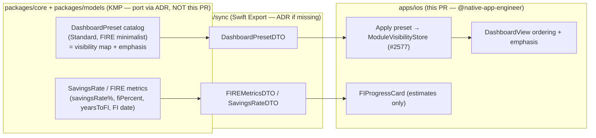

# iOS FIRE Minimalist Preset (Dashboard & Navigation)

> Design specification for a **named, opt-in "FIRE minimalist" preset** that re-tunes the
> iOS dashboard and navigation around the four numbers a financial-independence-minded user
> actually watches — **savings rate, net worth, investments, and FI progress** — with
> **safe defaults**, a **clear reset to Standard**, and **estimates labelled as estimates,
> not advice**.

**Status:** PROPOSED — design only (native implementation gated, see
[Implementation readiness](#12-implementation-readiness))
**Issue:** [#2580](https://github.com/jrmoulckers/finance/issues/2580) — _Part of
[#2122](https://github.com/jrmoulckers/finance/issues/2122)_
**Platform:** iOS / iPadOS (SwiftUI · Swift Concurrency, iOS 17+)
**Owner:** @native-app-engineer
**Last updated:** 2026-06-22
**Related design docs:** [ux-principles.md](./ux-principles.md) ·
[information-architecture.md](./information-architecture.md) ·
[cognitive-accessibility.md](./cognitive-accessibility.md) ·
[accessibility-patterns.md](./accessibility-patterns.md) ·
[content-language-guidelines.md](./content-language-guidelines.md) ·
[data-visualization.md](./data-visualization.md)
**Builds on:**
[ios-module-visibility-preferences.md](./ios-module-visibility-preferences.md) (the
preference store this preset writes through)
**Consumes (FI/FIRE math, already designed):**
[ios-fi-calculator-flow.md](./ios-fi-calculator-flow.md) ·
[ios-fire-results-goal-integration.md](./ios-fire-results-goal-integration.md) ·
[ios-portfolio-metrics-projections.md](./ios-portfolio-metrics-projections.md)

---

## Table of Contents

1. [Problem & Goal](#1-problem--goal)
2. [Affected iOS Surfaces](#2-affected-ios-surfaces)
3. [What the Preset Does](#3-what-the-preset-does)
4. [Preset Model & the iOS / KMP Boundary](#4-preset-model--the-ios--kmp-boundary)
5. [Applying & Reverting the Preset](#5-applying--reverting-the-preset)
6. [Projections-as-Estimates Safety](#6-projections-as-estimates-safety)
7. [Accessibility](#7-accessibility)
8. [Dynamic Type](#8-dynamic-type)
9. [Privacy & Balance Hiding](#9-privacy--balance-hiding)
10. [Empty, Stale & Error States](#10-empty-stale--error-states)
11. [Test Plan](#11-test-plan--smallest-tests-first)
12. [Implementation readiness](#12-implementation-readiness)
13. [Open Questions](#13-open-questions)

---

## 1. Problem & Goal

A FIRE-minded user does not want the full general-purpose surface; they want a calm
dashboard that answers "**am I getting closer to financial independence?**". Today's
[`DashboardView.swift`](../../apps/ios/Finance/Screens/DashboardView.swift) leads with net
worth and monthly spending and offers a broad "More" grid; the FI numbers are designed in
[ios-fi-calculator-flow.md](./ios-fi-calculator-flow.md) /
[ios-fire-results-goal-integration.md](./ios-fire-results-goal-integration.md), and the
module-hiding mechanism is designed in
[ios-module-visibility-preferences.md](./ios-module-visibility-preferences.md). What is
missing is a **one-tap way to compose those into a coherent minimalist mode**.

**Goal:** specify a **"FIRE minimalist" preset** — a named bundle of
visibility + emphasis defaults applied through the
[module-visibility store (#2577)](./ios-module-visibility-preferences.md) — that:

1. Foregrounds **savings rate, net worth, investments, and FI progress**, and quietens
   modules that aren't part of the FI loop.
2. Applies via **safe, non-destructive defaults** (hides nothing irreversibly, deletes
   nothing) and offers a **clear "Reset to Standard"** path at any time.
3. Treats every forward-looking number (FI progress, projected FI date, savings-rate trend)
   as a **clearly-labelled estimate, never advice** — reusing the safety patterns already
   established for FIRE results.

**Non-goals:** new FIRE math (it is consumed, not invented — see
[ios-portfolio-metrics-projections.md](./ios-portfolio-metrics-projections.md)), a separate
"FIRE app mode" with its own navigation stack, and any new shared schema beyond the preset
definition.

---

## 2. Affected iOS Surfaces

All under `apps/ios/` (owned by @native-app-engineer).

| Surface                                                                                  | Change                                                                                                              |
| ---------------------------------------------------------------------------------------- | ------------------------------------------------------------------------------------------------------------------- |
| `Screens/PresetPickerView.swift` **(new)**                                               | Choose a dashboard preset: **Standard** (default) · **FIRE minimalist**; shows what each changes before applying.   |
| `Models/DashboardPreset.swift` **(new)**                                                 | iOS view-model of the shared preset: id, display name, the visibility map + emphasis it applies.                    |
| `ViewModels/DashboardViewModel.swift` _(modify)_ / `ModuleVisibilityViewModel` _(reuse)_ | Apply a preset by writing the visibility store (#2577) and exposing a "FI summary" emphasis flag.                   |
| `Components/FIProgressCard.swift` **(new)**                                              | Calm FI-progress card (FI %, savings rate, "~years to FI (est.)") reusing `ProgressRing` + `CurrencyLabel`.         |
| [`Screens/DashboardView.swift`](../../apps/ios/Finance/Screens/DashboardView.swift)      | **Modify:** when the FIRE preset is active, order/emphasise net worth → savings rate → FI progress → investments.   |
| [`Screens/SettingsView.swift`](../../apps/ios/Finance/Screens/SettingsView.swift)        | **Modify (light):** add a "Dashboard preset" row → `PresetPickerView`.                                              |
| `Resources/*.lproj/Localizable.strings`                                                  | **Modify:** preset names/descriptions, FI card copy, estimate/disclaimer, reset confirmation. No hardcoded strings. |

The preset **does not** introduce a parallel navigation system — it composes existing
surfaces and the visibility store, keeping a single source of truth.

---

## 3. What the Preset Does

The **FIRE minimalist** preset is a declarative bundle (data, not code paths):

**Foregrounds (shown + emphasised, in this order):**

1. **Net worth** — the existing hero card stays at the top.
2. **Savings rate** — a calm percentage with a short trend, framed as an estimate.
3. **FI progress** — `FIProgressCard`: FI % toward the FI number + "~N years to FI (est.)",
   consuming the FIRE metrics designed in
   [ios-fire-results-goal-integration.md](./ios-fire-results-goal-integration.md).
4. **Investments** — quick access to the portfolio / allocation
   ([ios-low-noise-etf-allocation.md](./ios-low-noise-etf-allocation.md)).

**Quietens (hidden by default under this preset, reversibly):**

- Bills, Reports, and mood tags quick actions on the dashboard; the recent-transactions card
  is demoted (kept, but below FI progress) rather than removed — spending still matters to a
  savings rate.

**Keeps (never hidden):** the core tabs (Dashboard / Accounts / Transactions), Settings, and
the net-worth hero — the same invariants as
[#2577 §3](./ios-module-visibility-preferences.md). The preset can only toggle modules that
the catalog says are hideable; it can never violate those invariants.

This realises [ux-principles.md §1 "Clarity Over Completeness"](./ux-principles.md): one
hero number, the FI loop front-and-centre, density kept under the 5–7 item limit.

---

## 4. Preset Model & the iOS / KMP Boundary

A preset is **data** (a named set of visibility + emphasis defaults) plus **math it
consumes** (savings rate, FI %, years-to-FI). Both belong in KMP; iOS applies and renders.

**Responsibilities**

| Concern                                                                 | Layer                                 |
| ----------------------------------------------------------------------- | ------------------------------------- |
| Preset catalog (which modules each preset shows/hides + emphasis order) | `packages/core` / `packages/models`   |
| Savings-rate and all FIRE numbers (FI %, years-to-FI, FI date)          | `packages/core` (shared math)         |
| Type mapping (ids `String`, %/`Double`, `Cents`→`Int64`, date→`Date`)   | Swift Export bridge (`packages/sync`) |
| Applying a preset by **writing the visibility store (#2577)**           | iOS                                   |
| Dashboard ordering/emphasis, FI card layout, estimate copy, reset UX    | iOS                                   |
| VoiceOver explanations, Dynamic Type, privacy, Reduce Motion            | iOS                                   |

- **iOS composes, it does not compute.** The preset is a shared definition; iOS applies it by
  writing the same visibility flags from
  [#2577](./ios-module-visibility-preferences.md), so there is **one** visibility source of
  truth and no divergent logic. FI/savings numbers arrive as DTOs (already designed in
  [ios-portfolio-metrics-projections.md](./ios-portfolio-metrics-projections.md)).
- **No new shared schema beyond the preset definition.** The preset reuses the module catalog
  from #2577 and the FIRE engine from #2556/#2558; landing the preset catalog in
  `packages/models` is **@native-app-engineer via ADR**. iOS binds `StubSwiftExportBridge` (preset
  fixture + `fireMetrics` stub) so the surface is buildable now.

---

## 5. Applying & Reverting the Preset

- **Preview before apply.** `PresetPickerView` shows a plain-language summary of exactly what
  the FIRE preset will show/hide/emphasise **before** the user commits — no silent surprises.
- **Apply = write visibility flags.** Selecting "FIRE minimalist" writes the preset's map
  through the [#2577 store](./ios-module-visibility-preferences.md); the dashboard re-renders
  on next pass (no app restart) via the `@Observable` view model.
- **Non-destructive, always.** Applying or switching presets **never deletes data**; hidden
  modules keep their data and reappear on revert (framed "Hidden", per
  [content-language-guidelines.md](./content-language-guidelines.md)).
- **Clear reset path.** A prominent **"Reset to Standard"** restores the default
  (all-visible) preset; it is reversible work, not destruction, and is reachable from both
  `PresetPickerView` and the #2577 module screen.
- **Post-apply, still customisable.** After applying the FIRE preset a user can still
  individually toggle any module in the #2577 screen; the preset is a starting point, not a
  lock. Manual edits "detune" the preset to a "FIRE minimalist (modified)" label so the user
  knows they've diverged.

---

## 6. Projections-as-Estimates Safety

Because this preset **foregrounds forward-looking numbers**, the not-advice discipline from
[ios-fire-results-goal-integration.md §6](./ios-fire-results-goal-integration.md) and
[ios-portfolio-metrics-projections.md §8](./ios-portfolio-metrics-projections.md) is
mandatory here:

- **Every derived/forward number is labelled an estimate** at the point of display: FI
  progress is "~{n}% (est.)" where modelled, years-to-FI is "~N years (est.)", the FI date is
  "around {Month Year}", savings-rate trend is "(est.)". Only the user's own
  entered/aggregated balances appear without "est.".
- **Persistent, selectable disclaimer** on the FI card: _"These are estimates based on your
  assumptions, not financial advice. Real returns vary and aren't guaranteed."_ Present in the
  VoiceOver reading order.
- **Assumptions stay co-present.** The FI card links to the FIRE inputs
  ([ios-fi-calculator-flow.md](./ios-fi-calculator-flow.md)) so no FI figure is shown without
  a path to the assumptions that produced it.
- **No promissory or shaming language.** "with these assumptions, you'd reach…", never "you
  will retire at…"; savings rate is reported, never graded — non-judgemental framing per
  [ux-principles.md §3](./ux-principles.md).

---

## 7. Accessibility

Per [accessibility-patterns.md](./accessibility-patterns.md) and
[cognitive-accessibility.md](./cognitive-accessibility.md):

- **Explanatory, combined labels.** `FIProgressCard` is
  `.accessibilityElement(children: .combine)` →
  _"FI progress, about 34 percent, estimated. Savings rate about 41 percent this year,
  estimated. Around 11 years to financial independence with your current assumptions."_ —
  explanation, not a bare number.
- **Preset picker is clear to VoiceOver.** Each preset row has a label + a hint summarising
  what it changes ("Shows savings rate, net worth, investments, and FI progress; hides bills
  and reports. Reversible."). The selected preset is announced.
- **Reset is explained:** _"Reset to Standard. Shows all modules again. Does not delete any
  data."_
- **Switch Control / Full Keyboard Access:** preset rows, the FI card's links, and the reset
  button are real focusable controls; nothing is gesture-only.
- **Estimate words are spoken** — "estimated", "around", "not guaranteed" are part of the
  label text, never visual-only.

---

## 8. Dynamic Type

- **No hardcoded font sizes** — card titles `.headline`, figures reuse `CurrencyLabel`,
  explainers `.footnote`/`.secondary`, disclaimer `.caption`. All scale AX1–AX5.
- **Reflow over truncation.** Under the FIRE preset the dashboard remains a single scrolling
  column; at `accessibility1`+ the FI card's metric pair stacks vertically and the
  explainer/disclaimer wrap fully. Verified at AX5 in [§11](#11-test-plan--smallest-tests-first).
- **Explainers never truncate** — they are the teaching content.

---

## 9. Privacy & Balance Hiding

- **Preset choice is non-sensitive UI state** — stored through the #2577 App-Group store,
  **never Keychain**. It contains no balances or PII.
- **Balance hiding parity.** On the FI card, **monetary figures** (net worth, FI number) are
  masked ("•••••") when balance-hiding is active; **percentages, the savings rate, and
  explainer text remain visible** (they reveal no balance) — consistent with
  [ios-fire-results-goal-integration.md §9](./ios-fire-results-goal-integration.md). Masked
  amounts read "hidden" to VoiceOver.
- **App-switcher redaction** is inherited (no exemption).
- **Logging is privacy-aware.** Log only `.public` events via `os.Logger` — "preset applied:
  fire-minimalist", "preset reset" — never an amount or rate value. Never `print()`.

---

## 10. Empty, Stale & Error States

| State           | Trigger                                           | Presentation                                                                                                                                        |
| --------------- | ------------------------------------------------- | --------------------------------------------------------------------------------------------------------------------------------------------------- |
| **No FI input** | FIRE assumptions not yet entered                  | FI card shows a prompt ("Set up FI to see your progress") linking to the FIRE inputs — **no fabricated FI %**. Preset still applies.                |
| **Loading**     | Metrics not yet derived                           | FI card skeleton with title + explainer visible; static under Reduce Motion. `.accessibilityLabel("Calculating your FI estimate")`.                 |
| **Stale**       | Derived from cached/offline aggregates            | Card renders + "based on data as of {relative time}"; show [`OfflineBanner`](../../apps/ios/Finance/Components/OfflineBanner.swift) offline.        |
| **Error**       | Preset apply or metric derivation fails           | Apply failure → fall back to **Standard** (fail safe, never hide content); metric failure → section-scoped `ErrorStateView` + Retry; log `.public`. |
| **Modified**    | User hand-edits modules after applying the preset | Label becomes "FIRE minimalist (modified)"; "Reset to Standard" remains available. No data change.                                                  |

- **Fail safe = Standard.** Any preset-apply error resolves to the full, all-visible Standard
  preset; a preset can never strand a user in a broken minimal view.
- **Stale is first-class, not an error** (local-first) — old figures with an "as of" stamp are
  correct.
- **Empty is a prompt** — the FI card points to the one missing input rather than showing a
  guessed number.

---

## 11. Test Plan — Smallest Tests First

### 11.1 Shared (KMP) — verify/port parity, not re-implemented here

- `DashboardPresetTest` (KMP, **@native-app-engineer via ADR**): the FIRE preset's visibility map
  shows exactly {net worth, savings rate, FI progress, investments} foregrounded and quietens
  bills/reports/mood; it **respects the #2577 non-hideable invariants** (never hides core
  tabs/Settings/net-worth hero); Standard = all visible.
- Savings-rate and FIRE-metric parity are already covered by the #2556/#2570 KMP suites
  (reused, not duplicated).

### 11.2 Bridge

- `SwiftExportBridgeTests`: `DashboardPresetDTO` round-trips id + map + emphasis order;
  `FIREMetricsDTO` / savings-rate DTO map as in
  [ios-portfolio-metrics-projections.md](./ios-portfolio-metrics-projections.md).

### 11.3 iOS unit (XCTest, `apps/ios/Tests/`)

1. **`PresetApplyTests`** — applying "FIRE minimalist" writes the expected flags to the
   #2577 store (spy) and never violates invariants; "Reset to Standard" restores all-visible;
   an apply error falls back to Standard.
2. **`FIProgressCardTests`** — maps FI %/savings rate/years from DTOs; **no FI input → prompt,
   not a number**; estimate words present; masked (privacy) labels contain no amount.
3. **`PresetModifiedStateTests`** — a manual module toggle after applying flips the label to
   "(modified)" and keeps reset available.

### 11.4 iOS UI / a11y (`apps/ios/Tests/UITests/`)

4. **`FIREPresetUITests`** — selecting the preset reorders the dashboard (net worth → savings
   rate → FI progress → investments) and hides bills/reports; **VoiceOver** reads the FI
   card's explanation (not number-only) and the disclaimer; **Dynamic Type** at AX5 stacks the
   FI metrics untruncated; **Privacy** masks amounts but not percentages; **Reduce Motion**
   applies the preset without animated reshuffle; **Reset** returns to Standard.

### 11.5 Gate

`node tools/agent-scripts/pre-push-check.js --fix` (lint + strict concurrency) plus the
suites above. `SWIFT_STRICT_CONCURRENCY = complete`: preset/metric DTOs `Sendable`, store an
`actor`, UI state `@MainActor`.

---

## 12. Implementation readiness

Per the [Human-Gated Prerequisites runbook](../ops/human-gated-prerequisites.md) (§2),
Apple Developer enrollment
[#1239](https://github.com/jrmoulckers/finance/issues/1239) gates **distribution only** —
not implementation. This design and its iOS code are **buildable and testable now**.

### Buildable now (no enrollment, no secrets)

- ✅ **This design doc** — fully unblocked.
- ✅ `PresetPickerView`, `DashboardPreset`, `FIProgressCard`, and the `DashboardView`
  ordering/emphasis — SwiftUI + `@Observable`, reusing `ProgressRing` / `CurrencyLabel` /
  `EmptyStateView` / `ErrorStateView` / `OfflineBanner` and the
  [#2577 visibility store](./ios-module-visibility-preferences.md).
- ✅ All unit + UI/a11y tests in [§11](#11-test-plan--smallest-tests-first) in the iOS Simulator.
- ✅ On-device verification via **free Personal Team signing** (free Apple ID) — see
  [ios-setup.md](../guides/ios-setup.md).
- ✅ Against `StubSwiftExportBridge` (preset fixture + `fireMetrics`/savings stub), the entire
  preset surface is developable **before** the Kotlin ports land.

### Distribution tail — gated by #1239 (human, not this PR)

- 🔒 App Store / TestFlight builds, release signing, and CI release secrets are
  **human-gated** (runbook
  [§3.2](../ops/human-gated-prerequisites.md#32-ios-distribution--apple-developer-1239)) and
  out of scope here.

### Dependency note (process gate, not human-gated)

The **preset catalog** belongs in `packages/models` (reusing the #2577 module catalog) and
the **savings-rate / FIRE math** in `packages/core`, re-exported via `packages/sync` —
**@native-app-engineer via ADR**, not this iOS PR. Until then iOS binds the stub bridge. This preset
**depends on** [#2577](./ios-module-visibility-preferences.md) (the visibility store) and the
FIRE engine from #2556/#2558.

### Needs Human Action

- None for design **or** iOS implementation up to the distribution boundary. Only
  TestFlight/App Store shipping is human-gated ([#1239](https://github.com/jrmoulckers/finance/issues/1239)).

---

## 13. Open Questions

1. **Preset count for v1:** ship just Standard + FIRE minimalist (proposed), or seed a third
   (e.g. "Budget-focused") to validate the preset abstraction?
2. **Emphasis vs. reorder:** does the FIRE preset literally reorder dashboard sections, or
   only emphasise (size/weight) while keeping order? (Proposed: a small, fixed reorder.)
3. **"Modified" persistence:** should a modified preset be saved as a user preset, or just
   labelled until reset? (Proposed: labelled-until-reset for v1.)
4. **Savings-rate window:** trailing 12 months vs. year-to-date vs. user-selectable as the FI
   card's default? (Defer to the FIRE inputs design.)
5. **Onboarding hook:** offer the FIRE preset during onboarding for users who self-identify as
   FI-focused, or keep it Settings-only in v1? (Proposed: Settings-only first.)
