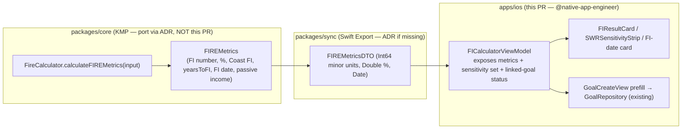

# iOS FIRE Results & Goal Integration — Surface Design

> Native SwiftUI presentation of Financial-Independence results — **FI number**,
> **years-to-FI**, **Coast FI**, **SWR sensitivity**, and a **projected FI
> date** — as a set of summary cards with plain-language, VoiceOver-friendly
> explanations, plus a path to **link FI as a goal** alongside the existing Goals
> feature. Consumes the inputs from
> [ios-fi-calculator-flow.md](./ios-fi-calculator-flow.md) and shares the
> projection visual with
> [ios-net-worth-projection-overlay.md](./ios-net-worth-projection-overlay.md).

**Status:** PROPOSED — design only (implementation gated where noted)
**Issue:** [#2558](https://github.com/jrmoulckers/finance/issues/2558) — Part of [#2114](https://github.com/jrmoulckers/finance/issues/2114)
**Platform:** iOS / iPadOS (SwiftUI, iOS 17+)
**Owner:** @native-app-engineer
**Related design:** [ios-fi-calculator-flow.md](./ios-fi-calculator-flow.md) · [ios-net-worth-projection-overlay.md](./ios-net-worth-projection-overlay.md) · [ios-net-worth-trend-chart.md](./ios-net-worth-trend-chart.md) · [data-visualization.md](./data-visualization.md) · [accessibility-patterns.md](./accessibility-patterns.md) · [content-language-guidelines.md](./content-language-guidelines.md) · [ux-principles.md](./ux-principles.md) · [Human-Gated Prerequisites](../ops/human-gated-prerequisites.md)

---

## Table of Contents

1. [Goal & Scope](#1-goal--scope)
2. [The Result Cards](#2-the-result-cards)
3. [SWR Sensitivity Strip](#3-swr-sensitivity-strip)
4. [Projected FI Date](#4-projected-fi-date)
5. [Goal-Linking Integration](#5-goal-linking-integration)
6. [Financial-Advice Safety: Estimate Labeling & Disclaimers](#6-financial-advice-safety-estimate-labeling--disclaimers)
7. [Accessibility — VoiceOver-Friendly Explanations](#7-accessibility--voiceover-friendly-explanations)
8. [Dynamic Type](#8-dynamic-type)
9. [Privacy: Balance Hiding](#9-privacy-balance-hiding)
10. [States: Empty, Loading, Stale & Error](#10-states-empty-loading-stale--error)
11. [Affected Surfaces & Shared Dependencies](#11-affected-surfaces--shared-dependencies)
12. [Native ↔ Shared Boundary](#12-native--shared-boundary)
13. [Test Plan](#13-test-plan)
14. [Implementation Readiness](#14-implementation-readiness)
15. [Open Questions](#15-open-questions)

---

## 1. Goal & Scope

Turn the FIRE inputs into an **at-a-glance, understandable answer**: "Here's your
number, here's roughly when you'd reach it, and here's what changes it." Each
metric is a calm summary card whose VoiceOver description **explains the metric in
plain language**, not just reads a figure — a core requirement of this batch.

This document is the **results half** of the FIRE feature; the **input/flow half**
(defaults, Advanced disclosure, sensitivity sliders, validation) is
[ios-fi-calculator-flow.md](./ios-fi-calculator-flow.md), and the **chart that
visualizes the path** to these targets is
[ios-net-worth-projection-overlay.md](./ios-net-worth-projection-overlay.md). All
three consume one shared, deterministic computation.

**In scope (this design):**

- Summary cards for **FI number**, **FI progress (%)**, **years-to-FI**, **Coast
  FI** (with reached/not-reached state), and **current passive income**.
- An **SWR sensitivity strip** showing the FI number at 4.0% / 3.5% / 3.0% so the
  user sees how conservative assumptions enlarge the target.
- A **projected FI date** card framed as an estimate ("around {month year}").
- **Goal-linking**: create/track an FI (or Coast-FI) target as a first-class goal
  using the existing Goals surface, with a clear summary on both sides.
- VoiceOver explanations, Dynamic Type, privacy, and empty/loading/stale/error
  states.

**Out of scope (deliberately deferred):**

- Input collection and validation — see
  [ios-fi-calculator-flow.md](./ios-fi-calculator-flow.md).
- The projection line/area chart — see
  [ios-net-worth-projection-overlay.md](./ios-net-worth-projection-overlay.md).
- Editing the underlying Goals model, schema, or repository contract (owned by
  the Goals feature / shared packages); this design **reuses** them.
- Monte-Carlo confidence bands, tax/withdrawal sequencing, and Social Security
  (follow-on under #2114).

> **Why cards, not a dense dashboard:** per
> [data-visualization](./data-visualization.md) (_"Clarity Over Completeness"_)
> and [ux-principles](./ux-principles.md), each FIRE concept gets its own card
> with a one-line explanation, so a user new to FIRE can learn the vocabulary
> while reading their own numbers.

---

## 2. The Result Cards

Cards render below the inputs on the same scroll (per the flow design) and update
live as the sensitivity sliders move. Each is a reusable `FIResultCard` with a
title, a primary figure, a one-line plain-language explainer, and a combined
VoiceOver label.

| Card               | Primary figure                         | Plain-language explainer (visible + spoken)                                                         | Source field (`FIREMetrics`) |
| ------------------ | -------------------------------------- | --------------------------------------------------------------------------------------------------- | ---------------------------- |
| **FI number**      | e.g. `$1,050,000`                      | "The amount that could cover your spending at your withdrawal rate."                                | `fiNumberCents`              |
| **FI progress**    | e.g. `30%` + `ProgressRing`            | "How far your investments have come toward your FI number."                                         | `fiPercent`                  |
| **Years to FI**    | e.g. `~12 years (est.)`                | "About how long at your current saving and assumed returns." Shows "Not reachable…" when unbounded. | `yearsToFI`                  |
| **Coast FI**       | e.g. `Reached` / `$420,000 needed now` | "Enough invested now to coast to retirement with no more contributions." Gated on age.              | `coastFICents`, `isCoastFI`  |
| **Passive income** | e.g. `$12,400 / yr (est.)`             | "What your investments could generate now at your withdrawal rate."                                 | `currentPassiveIncomeCents`  |

**Rules**

- **One concept per card.** No card combines two metrics; the explainer line is
  always present (it is the teaching surface), styled `.footnote`/`.secondary`.
- **Progress uses an existing component.** FI progress reuses
  [`ProgressRing`](../../apps/ios/Finance/Components/ProgressRing.swift) (already
  Dynamic-Type + VoiceOver aware), with over-100% handled gracefully ("FI
  reached" when `fiPercent ≥ 100`).
- **Direction is never color-only.** Where a card uses a semantic tint (e.g.,
  Coast FI reached = green), it is always paired with a glyph + text ("✓
  Reached"), per
  [data-visualization §2.4 "Never Color Alone"](./data-visualization.md). Declines
  / shortfalls use amber, never red, per the non-judgmental rule.
- **Live updates.** Cards bind to the `@Observable` view model; when the SWR or
  return slider changes (flow design §5), figures crossfade (instant under Reduce
  Motion).
- **No fabricated precision.** Years-to-FI is "~N years (est.)"; Coast-FI without
  an age shows a prompt ("Add your age in Advanced to estimate Coast FI"), never a
  guessed number.

```
┌──────────────────┐  ┌──────────────────┐
│ FI number        │  │ FI progress      │
│ $1,050,000       │  │   ◍ 30%          │
│ Covers spending  │  │ Toward your FI   │
│ at 4.0% (est.)   │  │ number           │
└──────────────────┘  └──────────────────┘
┌──────────────────┐  ┌──────────────────┐
│ Years to FI      │  │ Coast FI         │
│ ~12 years (est.) │  │ ✓ Reached        │
│ At current saving│  │ No more needed   │
└──────────────────┘  └──────────────────┘
These are estimates based on your assumptions — not financial advice.
```

---

## 3. SWR Sensitivity Strip

A horizontal strip beneath the FI-number card makes the single biggest assumption
**legible**: the FI number at three withdrawal rates.

| Column   | Withdrawal rate | Figure                  | Note                                      |
| -------- | --------------- | ----------------------- | ----------------------------------------- |
| **4.0%** | baseline        | FI number at 4%         | The conventional baseline (highlighted).  |
| **3.5%** | more cautious   | FI number at 3.5%       | Larger target.                            |
| **3.0%** | most cautious   | FI number at 3% (≈ ×33) | Largest target; for sequence-risk-averse. |

- **Purpose:** show that "your number" is a function of an assumption, reinforcing
  the financial-advice-safety stance ([§6](#6-financial-advice-safety-estimate-labeling--disclaimers)).
  The three figures come from the **same shared `calculateFINumber`** evaluated at
  three rates — iOS does not invent the math, it requests/derives from the shared
  result set (see [§12](#12-native--shared-boundary)).
- **Reflects the live SWR.** Whichever rate the slider is on is highlighted; the
  other two are reference points. Tapping a column sets the slider to that rate
  (a convenient shortcut, not a separate state).
- **Accessibility:** the strip is one container with a combined label —
  _"Your FI number ranges from {3% value} at a 3 percent withdrawal rate to
  {4% value} at 4 percent. Lower rates mean a larger, safer target."_ — so the
  relationship, not just three numbers, is spoken. Each column is also
  individually focusable.
- **Dynamic Type / reflow:** at large sizes the three columns stack vertically
  (label-over-value) via `ViewThatFits`; the strip never truncates a currency
  figure.

---

## 4. Projected FI Date

A dedicated card converts years-to-FI into a human date, **explicitly hedged**.

- **Copy:** "Estimated FI date: **around {Month Year}**", with a `.footnote`
  qualifier "based on your current saving and a {return}% assumed real return —
  actual timing will vary." Derived from `projectedFIDate`/`yearsToFI` in the
  shared metrics.
- **Never a hard date.** Uses "around"/"by about" framing — never "you will be FI
  on March 2038". When years-to-FI is unbounded (the math returns `maxYears`), the
  card reads "Not reachable with these assumptions — try increasing savings or
  adjusting the return" (factual, non-judgmental).
- **Relationship to the projection chart.** This card is the textual summary; the
  visual path to the date is the
  [net-worth projection overlay](./ios-net-worth-projection-overlay.md). Tapping
  the card scrolls to / opens that overlay with the FI target line shown.
- **Accessibility:** VoiceOver reads the full hedged sentence (estimate + the
  assumption that produced it), satisfying the "explain the projection" rule.

---

## 5. Goal-Linking Integration

FI is, fundamentally, a savings goal — so the design **links it into the existing
Goals feature** rather than building a parallel tracker.

### 5.1 Create / link an FI goal

- A "Track this as a goal" button on the FI-number card (and Coast-FI card) opens
  the existing
  [`GoalCreateView`](../../apps/ios/Finance/Screens/GoalCreateView.swift)
  **prefilled**: name "Financial Independence", `targetMinorUnits` = FI number,
  `currentMinorUnits` = current investable portfolio, an `infinity`/`target` icon,
  and (if the user set ages) the projected FI date as the goal `targetDate`.
- The goal is created through the **existing `GoalRepository`** contract — no
  schema change. It appears in
  [`GoalsView`](../../apps/ios/Finance/Screens/GoalsView.swift) like any other
  goal, with the same progress ring and status.
- A **Coast-FI** variant can be linked separately (target = Coast-FI amount), so a
  user can track both "fully FI" and the nearer "Coast FI" milestone.

### 5.2 Two-way summary

- **On the FIRE surface:** if an FI goal already exists, the FI-number card shows
  a small "Linked goal" chip with current progress, deep-linking to the goal
  detail. Re-running the calculator with new assumptions offers "Update linked
  goal target?" (explicit, never silent), since the FI number is assumption-driven.
- **On the Goals surface:** the linked goal is an ordinary
  [`GoalItem`](../../apps/ios/Finance/Models/GoalItem.swift); the FIRE-specific
  explanation ("This target is your FI number at a {rate}% withdrawal rate, an
  estimate") is carried in the goal `notes`, so the assumption travels with the
  goal and the not-advice framing is preserved wherever the goal is viewed.

### 5.3 Boundaries

- This design **reuses** the Goals model/repository as-is; it does **not** modify
  `GoalItem`, `GoalRepository`, or the shared goal schema. If a first-class
  "goal kind = FI" field were ever wanted (vs. encoding via name/notes), that is a
  shared-package change via ADR with @native-app-engineer — out of scope here.
- Linking is **opt-in**. The calculator is fully usable without ever creating a
  goal; goal-linking is an offered convenience, not a gate.

---

## 6. Financial-Advice Safety: Estimate Labeling & Disclaimers

Mirrors and reinforces
[ios-fi-calculator-flow.md §7](./ios-fi-calculator-flow.md); the results surface
is where most numbers appear, so labeling is strictest here.

- **Every derived number is labeled an estimate** at the point of display:
  years-to-FI is "~N years (est.)", the FI date is "around {Month Year}", passive
  income is "(est.)". Only the user's own entered/aggregated balances are shown
  without "est.".
- **Persistent disclaimer** below the cards: _"These are estimates based on the
  assumptions above, not financial advice. Real returns vary and are not
  guaranteed."_ Real, selectable text; in the VoiceOver reading order.
- **Assumptions are always co-present.** The SWR sensitivity strip and the
  return/SWR readouts ensure no FI number is ever shown without the assumptions
  that produced it.
- **No promissory language.** Copy uses "with these assumptions, you'd reach…",
  never "you will retire at…". The "Not reachable" state is framed as information
  about the _assumptions_, never the person, per
  [content-language-guidelines](./content-language-guidelines.md).
- **Goal notes carry the caveat.** A linked FI goal records the rate/assumption in
  its notes so the estimate framing survives outside this screen.

---

## 7. Accessibility — VoiceOver-Friendly Explanations

The defining a11y requirement of this surface: **VoiceOver users hear an
explanation of each metric, not just a number.** Patterns follow
[accessibility-patterns](./accessibility-patterns.md),
[`ConfidenceIndicatorView`](../../apps/ios/Finance/Components/ConfidenceIndicatorView.swift),
and [`ProgressRing`](../../apps/ios/Finance/Components/ProgressRing.swift).

- **Combined, explanatory labels.** Each `FIResultCard` is
  `.accessibilityElement(children: .combine)` with a label that includes the
  explainer, e.g.:
  - FI number → _"FI number, one million fifty thousand dollars. The amount that
    could cover your spending at a 4 percent withdrawal rate. This is an
    estimate."_
  - Years to FI → _"Years to financial independence, about 12 years, estimated,
    based on your current saving and a 5 percent assumed real return."_
  - Coast FI (reached) → _"Coast FI, reached. You have enough invested to coast to
    retirement with no further contributions, based on your assumptions."_
- **Progress semantics.** The FI-progress ring exposes `.accessibilityValue` as a
  percentage and a hint ("30 percent of your FI number"); over-100% reads "FI
  reached".
- **Sensitivity strip** speaks the _range and relationship_, not three bare
  numbers ([§3](#3-swr-sensitivity-strip)).
- **Estimate words are spoken.** "estimated", "around", "not guaranteed" are part
  of the label text, so the financial-advice framing is never visual-only.
- **Switch Control / Full Keyboard Access.** Cards, the "Track as goal" button,
  sensitivity columns, and the linked-goal chip are all real focusable controls
  with labels and hints; nothing is reachable only by gesture.
- **Contrast & color.** All figures/explainers meet ≥ 4.5:1 across light, dark,
  and high-contrast; reached/not-reached never relies on color alone (glyph +
  text).

---

## 8. Dynamic Type

- **No hardcoded font sizes.** Card titles `.headline`, figures reuse
  `CurrencyLabel`, explainers `.footnote`/`.secondary`, disclaimer `.caption`.
  All scale through AX1–AX5.
- **Grid reflow.** The two-up card grid (`LazyVGrid`) collapses to a single
  column at `accessibility1`+ via `@Environment(\.dynamicTypeSize)`; the SWR strip
  stacks (§3). Verified at AX5 in [§13](#13-test-plan).
- **Explainers wrap, never truncate** — they are the teaching content and must
  remain fully readable at the largest sizes.

---

## 9. Privacy: Balance Hiding

- When balance-hiding is active, **monetary figures** (FI number, passive income,
  sensitivity-strip amounts, linked-goal progress amount) are masked ("•••••");
  **percentages and the explainer text** remain visible (they reveal no balance).
  Years-to-FI and the FI date are not balances and remain visible.
- **Accessibility parity:** masked amounts are masked to VoiceOver too ("hidden")
  — never speak a hidden balance; the explainer still reads.
- **App-switcher redaction:** participates in the existing privacy-screen snapshot
  behavior; no exemption.
- **Logging:** amounts are `.private` and never logged. Log only `.public`
  events — "FIRE results viewed", "FI goal linked" — counts/flags, never an
  amount (same discipline as
  [`GoalsViewModel`](../../apps/ios/Finance/ViewModels/GoalsViewModel.swift)).

---

## 10. States: Empty, Loading, Stale & Error

| State       | Trigger                                                    | Presentation                                                                                                                                                          |
| ----------- | ---------------------------------------------------------- | --------------------------------------------------------------------------------------------------------------------------------------------------------------------- |
| **Loading** | Metrics not yet derived (first compute / awaiting prefill) | Cards show skeleton figures with titles + explainers visible; respects Reduce Motion (static placeholder). `.accessibilityLabel("Calculating your FI estimate")`.     |
| **Empty**   | Required input missing (e.g., no spending)                 | Cards replaced by an `EmptyStateView`: "Enter your spending to see your FI estimate", deep-linking back to the inputs. No fabricated numbers.                         |
| **Stale**   | Derived from cached/offline aggregates                     | Cards render + a subtle "Based on data as of {relative time}" caption; reuse [`OfflineBanner`](../../apps/ios/Finance/Components/OfflineBanner.swift) when offline.   |
| **Error**   | Metric derivation fails (bridge error)                     | Inline, non-modal `ErrorStateView` scoped to the results section + Retry; inputs and the rest of the screen stay usable. Logs `error.localizedDescription` `.public`. |

- **Stale is first-class, not an error** — local-first; old inputs with an "as of"
  stamp are correct (consistent with
  [ios-net-worth-trend-chart.md §8](./ios-net-worth-trend-chart.md)).
- **Errors are section-scoped** — a failed compute never hides the inputs or the
  rest of the screen; the user can adjust assumptions and retry.
- **Empty is a prompt, not a blank** — it points back to the one missing input.

---

## 11. Affected Surfaces & Shared Dependencies

### 11.1 iOS surfaces (all in `apps/ios/`, owned by @native-app-engineer)

| Surface                                                       | Change                                                                                                           |
| ------------------------------------------------------------- | ---------------------------------------------------------------------------------------------------------------- |
| `Finance/Screens/FIResultsSection.swift` **(new)**            | The results cards container (FI number, progress, years, Coast FI, passive income) + disclaimer.                 |
| `Finance/Components/FIResultCard.swift` **(new)**             | Reusable card: title + figure + explainer + combined a11y label.                                                 |
| `Finance/Components/SWRSensitivityStrip.swift` **(new)**      | The 4.0/3.5/3.0% strip with combined a11y description.                                                           |
| `Finance/ViewModels/FICalculatorViewModel.swift` **(modify)** | Extend the flow VM (shared with #2556) to expose derived `FIREMetrics`, sensitivity set, and linked-goal status. |
| `Finance/Screens/GoalCreateView.swift` **(modify)**           | Accept a prefill seed (name/target/current/icon/notes/date) for the "Track as goal" path.                        |
| `Finance/Screens/GoalsView.swift` **(modify, light)**         | Show the FI goal like any other goal (no schema change); optional "Linked from FI" affordance.                   |
| `Finance/Resources/*.lproj/Localizable.strings` **(modify)**  | New localized strings (card titles, explainers, disclaimer, sensitivity, goal-link copy, masks).                 |

### 11.2 Shared dependencies (KMP — **not edited by this design**)

- **FIRE math / `FIREMetrics`** — `fiNumberCents`, `fiPercent`, `coastFICents`,
  `isCoastFI`, `yearsToFI`, `projectedFIDate`, `currentPassiveIncomeCents`,
  `savingsRatePercent`. Canonical TypeScript reference today in
  [`apps/web/src/lib/investment/fire-calculator.ts`](../../apps/web/src/lib/investment/fire-calculator.ts);
  **target home `packages/core`**, re-exported via the Swift Export bridge (see
  [ios-fi-calculator-flow.md §12](./ios-fi-calculator-flow.md)).
- **Goals model/repository** — `GoalItem` / `GoalRepository` (existing); reused,
  not modified.
- **Money/locale formatting** — the shared currency formatter module.

> **Same dependency posture as the flow design:** the shared FIRE engine is **not
> yet in `packages/core`**; porting it from the web reference (parity with
> `fire-calculator.test.ts`) is **@native-app-engineer via ADR**. iOS binds to the
> Swift-native `FIPlanningBridge` stub so these cards are buildable/testable now.

---

## 12. Native ↔ Shared Boundary



**Responsibilities**

| Concern                                                      | Layer                              |
| ------------------------------------------------------------ | ---------------------------------- |
| All FIRE numbers (FI, %, Coast FI, years, FI date, passive)  | `packages/core` (shared)           |
| FI number at 3.0/3.5/4.0% (sensitivity set)                  | `packages/core` (re-evaluate math) |
| Type mapping (`Cents`→`Int64`, %→`Double`, date→`Date`)      | Swift Export bridge                |
| Card layout, explainer copy, estimate labeling, disclaimer   | iOS                                |
| Goal prefill + linking via existing `GoalRepository`         | iOS (reuses shared contract)       |
| VoiceOver explanations, Dynamic Type, privacy, Reduce Motion | iOS                                |

- **iOS renders, it does not compute.** The sensitivity strip's three figures come
  from the shared math evaluated at three rates (a small DTO list), not from an
  iOS-side formula.
- **Goal-linking crosses no new boundary.** It reuses the existing `GoalRepository`
  exactly as the Goals feature does; the FI specifics live in name/notes, so no
  shared schema change is required for v1.

---

## 13. Test Plan

### 13.1 Shared (KMP) — verify/port parity, not re-implement here

- The ported `FireCalculatorTest` (KMP) covers FI number / % / Coast FI /
  years-to-FI / projected date / passive income parity with the web
  `fire-calculator.test.ts`, including over-100% progress, unreachable →
  `maxYears`, already-FI → 0. **@native-app-engineer via ADR**, not this PR.

### 13.2 Bridge

- `SwiftExportBridgeTests`: `FIREMetricsDTO` round-trips all fields; the
  sensitivity set (FI number at 3.0/3.5/4.0%) maps correctly and is monotonic
  (lower rate → larger FI number).

### 13.3 iOS unit (XCTest, `apps/ios/Tests/`)

1. **`FIResultsViewModelTests`**
   - Card values map from `FIREMetrics`; `fiPercent ≥ 100` → "FI reached"; missing
     age → Coast-FI prompt (not a number); `yearsToFI == maxYears` → "Not
     reachable" copy.
   - Sensitivity set has three rates, highlighted column tracks the live SWR, and
     tapping a column updates the SWR.
   - Linked-goal status: detects an existing FI goal; "Update target?" offered (not
     auto-applied) when assumptions change.
2. **`FIGoalLinkTests`**
   - "Track as goal" builds a `GoalItem` prefill with correct target/current/notes
     (assumption recorded) and calls the existing repository (spy) — no schema
     mutation.
3. **`FIResultCardA11yTests`** (pure where possible)
   - Combined VoiceOver labels include the explainer + estimate wording; masked
     (privacy) labels contain no amount.

### 13.4 iOS UI / a11y (`apps/ios/Tests/UITests/`)

4. **`FIResultsUITests`**
   - `fi_results_section` shows all cards; the disclaimer is present; "Track as
     goal" reaches `GoalCreateView` prefilled.
   - **VoiceOver:** each card exposes an explanatory (not number-only) label; the
     sensitivity strip speaks the range/relationship.
   - **Dynamic Type:** at AX5 the grid is single-column, explainers/disclaimer
     untruncated, strip stacked.
   - **Privacy mode:** amounts masked, percentages/explainers visible.
   - **Reduce Motion:** figures swap without animation when assumptions change.

### 13.5 Gate

`node tools/agent-scripts/pre-push-check.js --fix` (lint + strict-concurrency)
plus the suites above. `SWIFT_STRICT_CONCURRENCY = complete`: DTOs `Sendable`, UI
state `@MainActor`.

---

## 14. Implementation Readiness

Per the [Human-Gated Prerequisites runbook](../ops/human-gated-prerequisites.md)
(§2), Apple Developer enrollment
[#1239](https://github.com/jrmoulckers/finance/issues/1239) gates **distribution
only** — not implementation. This design and its implementation are **buildable
and testable now**.

### Buildable now (no enrollment, no secrets)

- ✅ **This design doc** — fully unblocked.
- ✅ The result cards, sensitivity strip, FI-date card, and goal-linking UI — all
  SwiftUI + `@Observable` + Swift concurrency, reusing existing `ProgressRing` /
  `CurrencyLabel` / `GoalCreateView`.
- ✅ All unit + UI/a11y tests in [§13](#13-test-plan) in the iOS Simulator.
- ✅ On-device verification via **free Personal Team signing** (free Apple ID):
  7-day expiry, ≤ 3 apps/device, no TestFlight/push — fine for verifying this
  feature.
- ✅ Against the `StubSwiftExportBridge` `fireMetrics`, the entire results surface
  is developable **before** the Kotlin port lands.

### Distribution tail — gated by #1239 (human, not this PR)

- 🔒 App Store / TestFlight builds, release signing, App Store Connect API key,
  and CI release secrets are **human-gated** (runbook §3.2) and out of scope.

### Dependency note (process gate, not human-gated)

The shared FIRE engine must be ported to `packages/core` and re-exported via the
`packages/sync` Swift Export bridge — **@native-app-engineer via ADR**, not this iOS PR
(shared with the flow design). Until then, cards bind to the stub bridge. The
Goals model/repository are reused unchanged; a first-class "FI goal kind" (if ever
desired) would be a separate ADR.

### Needs Human Action

- None for design **or** iOS implementation up to the distribution boundary. Only
  TestFlight/App Store shipping is human-gated, tracked by
  [#1239](https://github.com/jrmoulckers/finance/issues/1239); see
  [runbook §3.2](../ops/human-gated-prerequisites.md#32-ios-distribution--apple-developer-1239).

---

## 15. Open Questions

1. **Goal kind encoding:** v1 encodes "this is an FI goal" via name/notes
   (proposed, no schema change) vs. a first-class `goalKind` field (ADR with
   @native-app-engineer). Confirm.
2. **Coast-FI as a separate goal:** offer linking Coast FI and full FI as two
   goals (proposed) vs. a single goal with a milestone?
3. **Sensitivity rates:** fixed 4.0/3.5/3.0% (proposed) vs. user-selectable
   comparison rates?
4. **"Update linked goal" UX:** prompt on every assumption change vs. only on
   explicit "recalculate"? (Avoid nagging; favor explicit.)
5. **Passive-income card:** include in v1 (proposed) or defer to reduce card count
   for first-time users?
