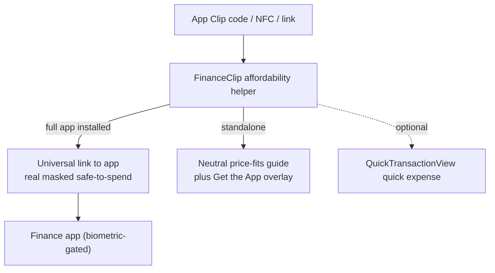
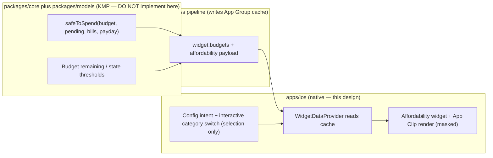

# Grocery Affordability Quick Check — Widget & App Clip — iOS

> An in-store, one-glance answer to _"can I still afford this in my grocery
> budget right now?"_ — surfaced as a **Home/Lock Screen widget** and a
> lightweight **App Clip** entry point, with privacy masking on by default,
> honest stale-data states, and **one-thumb category switching** so the same
> check works for dining or transport without opening the full app.

**Status:** PROPOSED — design only (native implementation buildable now; store distribution gated)
**Issue:** [#2611](https://github.com/jrmoulckers/finance/issues/2611) — Part of [#2199](https://github.com/jrmoulckers/finance/issues/2199)
**Platform:** iOS / iPadOS (WidgetKit + App Clip + SwiftUI, iOS 17+)
**Owner:** @ios-engineer
**Related:** [ios-grocery-safe-to-spend-card.md](./ios-grocery-safe-to-spend-card.md) · [ios-widget-freshness-pipeline.md](./ios-widget-freshness-pipeline.md) · [ios-today-spend-funmoney-widget.md](./ios-today-spend-funmoney-widget.md) · [ios-appclip-widget-quickentry-presets.md](./ios-appclip-widget-quickentry-presets.md) · [ios-noncolor-financial-state-cues.md](./ios-noncolor-financial-state-cues.md) · [data-visualization.md](./data-visualization.md) · [accessibility-patterns.md](./accessibility-patterns.md) · [cognitive-accessibility.md](./cognitive-accessibility.md) · [content-language-guidelines.md](./content-language-guidelines.md) · [Human-Gated Prerequisites](../ops/human-gated-prerequisites.md)

---

## Table of Contents

1. [Goal & Scope](#1-goal--scope)
2. [Current State](#2-current-state)
3. [The Widget (Home & Lock Screen)](#3-the-widget-home--lock-screen)
4. [The App Clip Entry Point](#4-the-app-clip-entry-point)
5. [One-Thumb Category Switching](#5-one-thumb-category-switching)
6. [Privacy & Balance Masking](#6-privacy--balance-masking)
7. [Accessibility & Dynamic Type](#7-accessibility--dynamic-type)
8. [States: Empty, Stale & Error](#8-states-empty-stale--error)
9. [Native ↔ KMP Boundary](#9-native--kmp-boundary)
10. [Affected Surfaces & Shared Dependencies](#10-affected-surfaces--shared-dependencies)
11. [Test Plan (Smallest Tests First)](#11-test-plan-smallest-tests-first)
12. [Implementation Readiness](#12-implementation-readiness)
13. [Open Questions](#13-open-questions)

---

## 1. Goal & Scope

Standing in the grocery aisle, the question is small and urgent: _"do I have
room left in groceries this period?"_ The in-app **safe-to-spend card**
([ios-grocery-safe-to-spend-card.md](./ios-grocery-safe-to-spend-card.md),
[#2610](https://github.com/jrmoulckers/finance/issues/2610)) answers it once the
app is open. This design pushes the same answer **out to the glanceable layer** —
a widget you can pin and an App Clip you can open from a code — so the check
needs zero navigation and respects the same masking-by-default privacy posture.

**In scope:**

- A **Home Screen** (small/medium) and **Lock Screen** (accessory) **affordability
  widget** showing grocery remaining / safe-to-spend, masked by default, reading
  only the App Group cache.
- A minimal **App Clip** affordability surface for in-store use, reusing the
  existing App Clip shell and keeping to App Clip **minimal-data** rules.
- **One-thumb category switching** (groceries ↔ dining ↔ transport) via the
  widget's configuration intent and an interactive in-widget control where
  supported.
- Privacy masking, stale-data honesty, and full accessibility/state coverage.

**Out of scope:**

- The **safe-to-spend math** — it stays in KMP `packages/core`, exactly as
  [ios-grocery-safe-to-spend-card.md](./ios-grocery-safe-to-spend-card.md)
  specifies; this design **renders** a cached value, it does not compute it
  ([§9](#9-native--kmp-boundary)).
- The **freshness pipeline** that writes the cache — owned by
  [ios-widget-freshness-pipeline.md](./ios-widget-freshness-pipeline.md); this
  design consumes its output (`widget.budgets`) and adds a small affordability
  payload, but does not change when/how the cache is rebuilt.
- Quick **expense entry** itself — that is the quick-entry presets work
  ([ios-appclip-widget-quickentry-presets.md](./ios-appclip-widget-quickentry-presets.md));
  this widget/App Clip is a **read** check that can hand off to it.

> **Read-first, by design:** the primary job is a trustworthy "how much room is
> left" glance. Logging the purchase is a secondary, optional handoff — so the
> surface stays calm and never blocks the affordability answer behind a form.

---

## 2. Current State

- The widget data layer already models budgets for exactly this:
  [`WidgetBudget`](../../apps/ios/FinanceWidget/WidgetDataProvider.swift) exposes
  `spentMinorUnits`, `limitMinorUnits`, `remainingMinorUnits`, `progress`, and
  `isOverBudget`; `WidgetDataProvider.readBudgets()` / `budgetRollup()` read them
  from the App Group cache **only** (never the network).
- Privacy masking is shared and **defaults to Bucketed**:
  [`WidgetMoneyFormatter`](../../apps/ios/Shared/WidgetPrivacy.swift) +
  `WidgetPrivacySettings.defaultMode = .bucketed`, with `.percent` and `.dots`
  modes — the affordability surface reuses this verbatim.
- A working **App Clip** already proves the amount-first, single-screen pattern
  and App Store handoff: [`QuickTransactionView`](../../apps/ios/FinanceClip/QuickTransactionView.swift)
  - [`FinanceClipApp`](../../apps/ios/FinanceClip/FinanceClipApp.swift) (URL
    prefill via `/clip/expense`).
- Deep links are **identifier-only**:
  [`FinanceWidgetDeepLinks.budgetCategoryURL(categoryId:)`](../../apps/ios/Shared/WidgetPrivacy.swift)
  → [`DeepLinkHandler.budgetCategory(id:)`](../../apps/ios/Finance/Navigation/DeepLinkHandler.swift)
  → Budgets tab, so a tap can open the full grocery budget with no money in the
  URL.
- **Missing:** a dedicated affordability presentation (safe-to-spend framing, not
  raw spent/limit), an App Clip affordability surface, and category switching.

---

## 3. The Widget (Home & Lock Screen)

A configurable affordability widget reading the cached budget + safe-to-spend
payload, masked by default.

```text
Home — small                         Home — medium
┌──────────────────────┐             ┌──────────────────────────────────────┐
│ 🛒 Groceries          │             │ 🛒 Groceries              On track ● │
│ Safe to spend         │             │ Safe to spend     ▓▓▓▓▓▓░░░░  64%     │
│   $50–$100  (bucket)  │             │   $50–$100 of $200 (bucketed)         │
│ as of 2:14 PM         │             │ as of 2:14 PM · tap to open budget    │
└──────────────────────┘             └──────────────────────────────────────┘
```

- **Families:** `.systemSmall` + `.systemMedium` on Home; `.accessoryRectangular`
  - `.accessoryCircular` on the Lock Screen (circular shows progress + a state
    glyph only, no figure). Follows the family structure of the existing
    [`BudgetProgressWidget`](../../apps/ios/FinanceWidget/BudgetProgressWidget.swift)
    and [today-spend widget](./ios-today-spend-funmoney-widget.md).
- **Affordability framing, not raw spend:** lead with **safe-to-spend remaining**
  (the supportive figure), with `progress` + "of {limit}" as context — reusing
  the card's tone from
  [ios-grocery-safe-to-spend-card.md](./ios-grocery-safe-to-spend-card.md).
- **Masked by default:** all money renders through
  [`WidgetMoneyFormatter`](../../apps/ios/Shared/WidgetPrivacy.swift) at the
  instance's masking mode (Bucketed default), so a pinned widget shows a range or
  percent, not an exact balance ([§6](#6-privacy--balance-masking)).
- **Status is text + non-color:** "On track / Tight / Over" with a paired glyph,
  per [ios-noncolor-financial-state-cues.md](./ios-noncolor-financial-state-cues.md)
  — never hue alone.
- **"As of" timestamp** is always shown, sourced from the cache write time, so a
  stale glance is self-evident ([§8](#8-states-empty-stale--error)).
- **Tap target:** the whole widget is a `Link` to
  `budgetCategoryURL(categoryId:)` (identifier-only) opening the full grocery
  budget — no money in the URL.

---

## 4. The App Clip Entry Point

For an **in-store** check launched from an App Clip code / NFC tag / link, a
minimal affordability surface — built on the existing
[`FinanceClipApp`](../../apps/ios/FinanceClip/FinanceClipApp.swift) shell.

- **Minimal-data by default.** App Clips are ephemeral and untrusted for personal
  finance: a standalone App Clip (full app **not** installed) must **never** show
  someone's real grocery balance. It presents a **neutral affordability helper** —
  enter a price, see a generic "what fits a typical grocery run" guide and a
  prompt to get the full app — and, optionally, an amount-first quick-expense
  reusing [`QuickTransactionView`](../../apps/ios/FinanceClip/QuickTransactionView.swift).
- **When the full app is installed**, the App Clip defers: it hands off to the
  app's real affordability widget/card via the existing universal-link path
  rather than duplicating sensitive data in the clip. The full, account-backed
  number lives behind the app's biometric gate, not in the clip.
- **No persisted secrets in the clip.** The App Clip keeps the existing pattern —
  pending captures go to the shared App Group store
  ([`ClipTransactionStore`](../../apps/ios/FinanceClip/ClipTransactionStore.swift));
  no balances, tokens, or budget figures are cached in the clip container.
- **Size budget:** the clip stays well under the 15 MB App Clip limit — it adds a
  small affordability view, not new heavy dependencies.



---

## 5. One-Thumb Category Switching

The same affordability glance should work for **dining** or **transport**, not
just groceries — switchable without two-handed navigation.

- **Primary: configuration intent.** A `WidgetConfigurationIntent` parameter
  selects the budget category (Groceries default), mirroring
  [`QuickEntryWidgetIntent`](../../apps/ios/FinanceWidget/QuickEntryWidget.swift)'s
  pattern. Long-press → Edit Widget swaps the category — the canonical,
  always-available path.
- **Secondary (Home medium): interactive switch.** Where supported, an in-widget
  **interactive `AppIntent`** (iOS 17 `Button(intent:)`) cycles
  Groceries → Dining → Transport in place, writing the chosen category to the App
  Group so the next timeline reload reflects it. This is a **selection** action
  (no money mutated), keeping it within WidgetKit's interactive constraints.
- **Thumb reach:** the switch control sits bottom-trailing in the medium layout,
  inside the one-thumb arc; the category label updates immediately and the figure
  re-renders on the next entry.
- **Category set** is sourced from the shared quick-entry / budget catalog
  (see [ios-appclip-widget-quickentry-presets.md](./ios-appclip-widget-quickentry-presets.md))
  so the switchable categories match the rest of the app.

---

## 6. Privacy & Balance Masking

In-store glances are the **most** exposed context (someone may be looking over
your shoulder), so masking is strict:

- **Bucketed by default.** Money renders via
  [`WidgetMoneyFormatter`](../../apps/ios/Shared/WidgetPrivacy.swift) at the
  instance's mode; the default is **Bucketed** (`$50–$100`), with **Percent**
  ("64% left") and **Dots** ("•••") as alternatives. An exact figure appears only
  if the user explicitly opted that instance into `.visible`.
- **First-add prompt respected:** reading a bucketed widget still flags
  `markFirstAddPromptPending` exactly as `WidgetDataProvider.maskingMode(for:)`
  does, so the app can later confirm whether exact amounts are acceptable.
- **Lock Screen circular shows no figure** — progress arc + state glyph only.
- **App Clip shows no real balance standalone** ([§4](#4-the-app-clip-entry-point)) —
  minimal-data is the strongest masking.
- **Deep links carry identifiers only** — `budgetCategoryURL` encodes a category
  id, never an amount.
- **Logging:** the widget/clip log routing and masking-mode facts as `.public`;
  any minor-unit amount stays `.private`. Never log the safe-to-spend figure.

> Consistent with the card: a widget surfaced on the Lock Screen renders the
> **masked** form first, matching the bucketed-by-default widget policy.

---

## 7. Accessibility & Dynamic Type

Per [accessibility-patterns.md](./accessibility-patterns.md) and
[cognitive-accessibility.md](./cognitive-accessibility.md):

- **Widget is one combined element.** Suggested VoiceOver reading (Bucketed):
  _"Groceries, safe to spend, 50 to 100 dollars, on track, as of 2:14 PM. Opens
  grocery budget."_ Built with `.accessibilityElement(children: .combine)`,
  explicit label/value/hint, and the link trait. The spoken value uses the same
  masking mode as the visual (via `WidgetCurrencyFormatter.formatForVoiceOver`).
- **Status in words, not color:** "on track / tight / over" is spoken and shown
  as text + glyph ([ios-noncolor-financial-state-cues.md](./ios-noncolor-financial-state-cues.md)).
- **Dynamic Type:** widget text uses semantic fonts and respects the system size;
  the medium layout prefers a **bar** over a ring at large sizes (ring labels
  cramp), echoing the card's SE rules. No hardcoded sizes; figures never truncate
  — the bucketed/percent forms are short by construction.
- **Category switch control** (medium) is a ≥ 44 pt target with its own
  `.accessibilityLabel` ("Switch category") and announces the new category.
- **Reduce Motion:** progress-fill / value-change animation collapses to an
  instant update when `accessibilityReduceMotion` is on.
- **App Clip** inherits the existing clip's accessible patterns (headers,
  hidden decorative glyphs, labeled inputs) from
  [`QuickTransactionView`](../../apps/ios/FinanceClip/QuickTransactionView.swift).

---

## 8. States: Empty, Stale & Error

| State                 | Trigger                                      | Rendering                                                                                      |
| --------------------- | -------------------------------------------- | ---------------------------------------------------------------------------------------------- |
| **Placeholder**       | WidgetKit placeholder / redacted             | Skeleton with a neutral grocery glyph; no real figure                                          |
| **No grocery budget** | Cache has no matching category               | "Pin a grocery budget" prompt + tap-to-open; never a fabricated number                         |
| **Empty cache**       | App Group cache not yet written              | Same as no-budget; the widget reads cache only and shows an empty state, never fetches network |
| **Stale / offline**   | Cache write time older than freshness window | Show last-known **masked** value **with an explicit "as of {time}"**; visibly de-emphasize it  |
| **Over budget**       | `remainingMinorUnits < 0`                    | Calm "Over by {bucket}" with constructive copy + drill-in; status text + glyph, no alarm color |
| **Error**             | Decode/read failure                          | Fall back to placeholder + "Open app to refresh"; never crash a timeline entry                 |
| **App Clip (no app)** | Standalone clip, full app absent             | Neutral price-fits helper + "Get the App"; **no** real balance shown                           |

- **Stale honesty is mandatory:** the "as of" timestamp is always present so an
  old glance is never mistaken for live data — the freshness pipeline
  ([ios-widget-freshness-pipeline.md](./ios-widget-freshness-pipeline.md)) sets
  the write time the widget displays.
- States reflow at large Dynamic Type exactly like the happy path; the bucketed
  figure and "as of" line wrap, never truncate.

---

## 9. Native ↔ KMP Boundary



- The **safe-to-spend computation** is shared business logic in `packages/core`
  (with shapes in `packages/models`), exactly as the card design specifies — the
  widget/App Clip **render a precomputed value** read from the App Group cache;
  they never compute or even fetch it (timeline providers read cache only).
- **Estimate (label):** the affordability payload the cache needs (remaining,
  limit, `state`, currency, and the write time) is an extension of the existing
  `widget.budgets` cache or a small sibling key — its final shape is owned by
  `@kmp-engineer` / `@architect` (math) and the freshness-pipeline doc (caching),
  via ADR. iOS must **not** inline the safe-to-spend formula even temporarily.
- The **interactive category switch** writes only a _selection_ (chosen category
  id) to the App Group — no money mutation — staying within WidgetKit's
  interactive-intent rules.
- iOS owns layout, masking presentation, the config/interactive intents, and
  accessibility only.

---

## 10. Affected Surfaces & Shared Dependencies

**New (this design):**

- `apps/ios/FinanceWidget/GroceryAffordabilityWidget.swift` — the widget,
  configuration intent, timeline provider, and views.
- An App Clip affordability view under `apps/ios/FinanceClip/` (e.g.
  `AffordabilityCheckView.swift`) presented by the existing clip shell.
- A small interactive `AppIntent` for in-widget category switching.

**Touched / extended:**

- [`WidgetDataProvider`](../../apps/ios/FinanceWidget/WidgetDataProvider.swift) —
  add an affordability read (remaining + state + "as of") layered on the existing
  budget cache.
- [`FinanceWidgetBundle`](../../apps/ios/FinanceWidget/FinanceWidgetBundle.swift) —
  register the new widget.

**Reused unchanged:**

- [`WidgetMoneyFormatter`](../../apps/ios/Shared/WidgetPrivacy.swift) /
  `WidgetPrivacySettings` (masking, defaults, first-add prompt),
  [`FinanceWidgetDeepLinks.budgetCategoryURL`](../../apps/ios/Shared/WidgetPrivacy.swift),
  [`DeepLinkHandler`](../../apps/ios/Finance/Navigation/DeepLinkHandler.swift),
  the App Clip shell/store, and the freshness pipeline cache.

**Shared dependencies:** KMP `packages/core` safe-to-spend math
([§9](#9-native--kmp-boundary)); the App Group write contract owned by
[ios-widget-freshness-pipeline.md](./ios-widget-freshness-pipeline.md).

---

## 11. Test Plan (Smallest Tests First)

1. **Masking render (Swift unit/snapshot):** the widget renders Bucketed by
   default and Percent/Dots when configured — assert no exact figure leaks in the
   default mode, including the VoiceOver value.
2. **Affordability mapping (Swift unit):** given a cached payload, the view maps
   remaining/limit/state correctly and computes **no** safe-to-spend math itself
   (inject a stub provider).
3. **Stale "as of" (Swift unit):** an old cache write time renders the
   de-emphasized "as of {time}" treatment, never a "live" presentation.
4. **Empty/no-budget (snapshot):** no matching category ⇒ "Pin a grocery budget"
   prompt, no fabricated number; empty cache reads as empty (no network).
5. **Over-budget (snapshot):** `remaining < 0` ⇒ calm "Over by {bucket}" with
   text + glyph status, no alarm color.
6. **Category switch (Swift unit):** the config intent and the interactive intent
   change the rendered category by writing a selection to the App Group; assert
   no money is mutated.
7. **Deep-link drill-in (XCUITest, smallest):** tapping the widget opens the
   Budgets tab on the selected category via `budgetCategory` (identifier-only URL).
8. **App Clip minimal-data (Swift unit/snapshot):** standalone clip shows the
   neutral helper and **no** real balance; with the app installed, it hands off.
9. **Dynamic Type (snapshot):** small + medium + accessory families at `.large`
   and `.accessibility5` — figures/"as of" wrap, nothing truncates.
10. **Shared (KMP, owned by @kmp-engineer):** safe-to-spend correctness and state
    thresholds are tested in `packages/core`, not iOS.

---

## 12. Implementation Readiness

See [Human-Gated Prerequisites](../ops/human-gated-prerequisites.md).

**Buildable now (no paid enrollment) — free Personal Team signing:**

- The widget and the App Clip affordability view are **SwiftUI + WidgetKit +
  App Intents** reading the existing App Group cache — they build in the
  Simulator (no signing) and on a device under a **free Apple ID (Personal
  Team)**. App Group sharing, the configuration intent, and the interactive
  category switch all work locally without enrollment.
- All tests in [§11](#11-test-plan-smallest-tests-first) run locally; the shared
  safe-to-spend math is tested on cross-platform CI.

**Distribution tail — gated by [#1239](https://github.com/jrmoulckers/finance/issues/1239):**

- **App Clip distribution** (App Store, App Clip experiences, App Clip codes / NFC
  registration) and TestFlight/App Store delivery of the widget are gated by Apple
  Developer enrollment — **design and local build are not.** The interactive
  in-store experience (codes/NFC) specifically requires the paid program; the
  affordability logic and UI do not. The PR should carry a `## Needs Human Action`
  note pointing only at the
  [§3.2 Apple Developer checklist](../ops/human-gated-prerequisites.md#32-ios-distribution--apple-developer-1239).
  Agents must **not** perform enrollment, signing, App Clip experience
  configuration, or secret setup, and must **not** modify shared `packages/`
  without `@architect` / an ADR.

---

## 13. Open Questions

1. **Payload home:** extend the existing `widget.budgets` cache with an
   affordability shape, or add a dedicated `widget.affordability` key? Decision
   shared with [ios-widget-freshness-pipeline.md](./ios-widget-freshness-pipeline.md).
2. **Switchable category set:** fixed (Groceries/Dining/Transport) or
   user-configurable? Default: the shared catalog's budgeted categories.
3. **Interactive vs. config-only:** ship the in-widget interactive switch in v1,
   or rely solely on the Edit-Widget configuration intent first? Default: config
   intent first, interactive as a fast-follow where supported.
4. **App Clip standalone value:** is a neutral "price-fits" helper worth shipping
   standalone, or should the App Clip be installed-app-only (handoff)? Confirm
   with privacy/design.
5. **"As of" threshold:** how old is "stale" for the de-emphasis treatment —
   match the freshness window from the pipeline doc.
