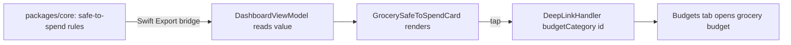

# Grocery Safe-to-Spend Card (iOS)

> **Status:** Design draft (design-only — no native build in this PR)
> **Issue:** [#2610](../../issues/2610) · **Parent:** [#2199](../../issues/2199)
> **Platform:** iOS (SwiftUI) · **Audience:** iOS engineers, design, KMP, QA
> **Distribution blocker:** [#1239](../../issues/1239) (Apple Developer enrollment — _distribution only_, see [Implementation readiness](#implementation-readiness))

This document specifies a supportive **grocery safe-to-spend** card for the iOS
Dashboard: a calm, glanceable quick-check that combines the pinned grocery
budget, the remaining **safe-to-spend** amount, payday/bill context, and a
**one-tap drill-in** to the full budget.

It is a **design specification only**. No Swift, shared `packages/`, or
cross-platform code changes here. The safe-to-spend **math stays in KMP
`packages/core`** (boundary described below — not implemented in this PR). All
numbers are **design estimates** to confirm on-device.

---

## Table of Contents

- [Intent & tone](#intent--tone)
- [Where it lives](#where-it-lives)
- [Anatomy](#anatomy)
- [Safe-to-spend concept (KMP boundary)](#safe-to-spend-concept-kmp-boundary)
- [Interaction & drill-in](#interaction--drill-in)
- [Compact layout & reflow](#compact-layout--reflow)
- [Accessibility](#accessibility)
- [Privacy & balance hiding](#privacy--balance-hiding)
- [Empty, stale & error states](#empty-stale--error-states)
- [Test plan (smallest viable)](#test-plan-smallest-viable)
- [Implementation readiness](#implementation-readiness)
- [Related documents](#related-documents)

---

## Intent & tone

The card answers one anxious, frequent question — _"Can I afford groceries right
now?"_ — without making the user open a spreadsheet. It is **supportive, not
punitive**:

- Lead with the **remaining safe-to-spend** figure, framed positively.
- Add lightweight **context** ("after upcoming bills, until payday Fri") so the
  number is trustworthy, not mysterious.
- Never shame. Over-budget is shown as a calm, factual state with a constructive
  next step — consistent with
  [content-language-guidelines.md](./content-language-guidelines.md) and
  [cognitive-accessibility.md](./cognitive-accessibility.md).
- One clear action: tap to see the full grocery budget.

## Where it lives

A pinned card near the top of the Dashboard, above the existing budget-health
strip. It does not replace any current section; it is additive.

Read-only references (do **not** edit in this PR):

- [`apps/ios/Finance/Screens/DashboardView.swift`](../../apps/ios/Finance/Screens/DashboardView.swift)
  — host screen; the card sits in the main `VStack` after `spendingSummaryCard`.
- [`apps/ios/Finance/ViewModels/DashboardViewModel.swift`](../../apps/ios/Finance/ViewModels/DashboardViewModel.swift)
  — would expose a read-only, already-computed safe-to-spend value from the
  bridge (no math in the view model).
- [`apps/ios/Finance/Models/BudgetItem.swift`](../../apps/ios/Finance/Models/BudgetItem.swift)
  — the grocery budget's `progress`, `remainingMinorUnits`, `progressColor`.
- [`apps/ios/Finance/Navigation/DeepLinkHandler.swift`](../../apps/ios/Finance/Navigation/DeepLinkHandler.swift)
  — `budgetCategory(id:)` route powers the one-tap drill-in.

## Anatomy

```text
┌───────────────────────────────────────────────┐
│  🛒  Groceries                      On track ● │  ← title + status chip (text + color)
│                                                │
│  Safe to spend                                 │  ← label (secondary)
│  $128.40                                       │  ← hero amount (large, rounded)
│  ▓▓▓▓▓▓▓▓░░░░  64% of $200                      │  ← progress ring/bar + budget context
│                                                │
│  After 2 upcoming bills · until payday Fri     │  ← context line (caption)
│                                          ›      │  ← drill-in affordance
└───────────────────────────────────────────────┘
```

| Region       | Content                                          | Source                                                |
| ------------ | ------------------------------------------------ | ----------------------------------------------------- |
| Title        | Grocery category name + icon                     | `BudgetItem.name` / `IconView`                        |
| Status chip  | "On track" / "Tight" / "Over" + paired color     | Derived from safe-to-spend state (text **and** color) |
| Hero amount  | Remaining safe-to-spend (currency, rounded font) | `safeToSpend` from bridge (see boundary)              |
| Progress     | Ring or bar with "X% of $limit"                  | `BudgetItem.progress` (presentation only)             |
| Context line | Upcoming-bill count + relative payday            | `safeToSpend` context fields from bridge              |
| Affordance   | Trailing chevron, whole card tappable            | Drill-in via `budgetCategory(id:)`                    |

## Safe-to-spend concept (KMP boundary)

> **Hard rule:** the safe-to-spend computation is **business logic** and lives in
> shared **`packages/core`** (with shapes in `packages/models`). iOS only
> **renders** a value the shared layer already computed and exposed across the
> Swift Export bridge. This document describes the boundary; it **does not
> implement** the math, and any change to shared packages requires the normal
> ADR / `@architect` consultation.

Conceptually, safe-to-spend for groceries is (illustrative — **estimate**, owned
by `packages/core`, not final):

```text
safeToSpend = groceryBudgetRemaining
            − pendingGroceryAuthorizations
            − knownBillsDueBeforePayday (allocable portion)
            (clamped at 0 for display; raw sign retained for "over" state)
```

- **Inputs** (already modeled in shared layer): the grocery `BudgetItem`,
  pending/cleared transactions, upcoming bills, and the payday/period anchor.
- **Output contract** (estimate of a new shared bridge surface, e.g. a
  `SwiftExportAggregatorModule.safeToSpend(...)` returning a small value type):
  - `amountMinorUnits: Int64` — remaining safe-to-spend (may be negative)
  - `limitMinorUnits: Int64` — grocery budget limit (for "of $X")
  - `state` — `onTrack` / `tight` / `over` (drives chip text + color)
  - `upcomingBillCount: Int32`
  - `paydayRelativeText` — localized relative date string source
- **iOS responsibility:** map that value type to SwiftUI; format currency via the
  existing `SwiftExportFormatterModule`; choose colors/typography; nothing more.



> The bridge method shown is an **estimate** of the contract iOS needs; its final
> shape is decided by `@native-app-engineer` / `@architect`. iOS must not inline the
> formula even temporarily.

## Interaction & drill-in

- **Whole card is one tap target.** Tapping routes to the grocery budget detail
  using the existing `budgetCategory(id:)` deep link, which selects the Budgets
  tab and opens the matching category
  ([`DeepLinkHandler`](../../apps/ios/Finance/Navigation/DeepLinkHandler.swift) →
  `pendingBudgetCategoryId`, consumed by
  [`BudgetsView`](../../apps/ios/Finance/Screens/BudgetsView.swift)).
- **No nested controls** that fight the card's tap (chip and progress are
  decorative); keeps VoiceOver to a single actionable element.
- **Pinned grocery budget:** the card shows the user's pinned grocery category.
  The notion of "pinned" is a shared preference (lives with shared budget
  config, not on iOS); iOS reads it. If none is pinned, see the empty state.

## Compact layout & reflow

The card must follow the SE compact rules in
[ios-iphone-se-compact-layouts.md](./ios-iphone-se-compact-layouts.md).

| Element      | Standard (XS–XXXL)                                | Accessibility (AX1–AX5)                                  |
| ------------ | ------------------------------------------------- | -------------------------------------------------------- |
| Title + chip | One row (title left, chip right)                  | Chip wraps below title at AX2+                           |
| Hero amount  | `.system(.largeTitle, design: .rounded)` currency | `SizeConstrainedCurrencyText` clamps; never below ~17 pt |
| Progress     | Ring (compact) **or** full-width bar              | Prefer **bar** at AX sizes (ring labels get cramped)     |
| Context line | Single caption line                               | Wraps to 2–3 lines; never truncates                      |
| Affordance   | Trailing chevron                                  | Becomes a full-width "View grocery budget" row at AX3+   |

- Width budget on iPhone SE: ~343 pt of content (375 pt − 2 × 16 pt). Estimate;
  verify on device.
- Use `AdaptiveFinanceStack` / `ViewThatFits` (see the compact-layouts doc) so
  the hero amount and "of $limit" never share a row they cannot fit.

## Accessibility

- **VoiceOver:** the card is **one** combined, actionable element. Suggested
  reading: _"Groceries, safe to spend $128.40, 64% of $200 used, on track, after
  2 upcoming bills, until payday Friday. Button. Opens grocery budget."_ Build
  with `.accessibilityElement(children: .combine)`, an explicit
  `.accessibilityLabel`, `.accessibilityValue`, `.accessibilityHint`, and the
  `.isButton` trait.
- **Dynamic Type up to AX5 at 375 pt:** all text via token Dynamic Type styles
  ([`FinanceTypography`](../../apps/ios/Finance/Theme/FinanceTypography.swift));
  currency via `SizeConstrainedCurrencyText` /
  [`ClampedScaledMetric`](../../apps/ios/Finance/Accessibility/DynamicTypeSupport.swift).
  No hardcoded sizes.
- **Reflow:** no truncated amounts at any size; context line wraps, never clips.
- **Color is never the only signal:** the status uses **text + color** ("Tight",
  "Over"), so CVD and grayscale users get the state. Progress fill uses the
  CVD-safe palette from [data-visualization.md](./data-visualization.md).
- **Reduced Motion:** any progress-fill or value-change animation is replaced by
  an instant update when `@Environment(\.accessibilityReduceMotion)` is on
  (see [animation-library.md](./animation-library.md)).
- **Touch target:** the whole card is ≥ 44 pt tall; the AX3+ explicit drill-in
  row is a full-width ≥ 44 pt target.

## Privacy & balance hiding

- The card sits behind the app's local auth gate; the amount is sensitive.
- Honor the same **bucketed/hidden** presentation used for widgets
  ([`WidgetPrivacyPrompt`](../../apps/ios/Finance/Services/WidgetPrivacyPrompt.swift) /
  `WidgetPrivacySettings`). When hiding is on, render a masked hero ("•••") and a
  **state-only** status ("On track") without the exact figure; layout must not
  shift when toggled.
- **Lock-screen / widget reachability:** if this card is ever surfaced via a
  widget or a lock-screen deep link, it must render the **masked** form first,
  matching the bucketed-by-default widget policy.
- **Logging:** never log the amount; `os.Logger` amount interpolation stays
  `privacy: .private`. Only non-sensitive routing/layout facts may be `.public`.

## Empty, stale & error states

| State                 | Presentation                                                                                          |
| --------------------- | ----------------------------------------------------------------------------------------------------- |
| **No grocery budget** | Friendly `EmptyStateView`-style prompt: "Pin a grocery budget to see safe-to-spend" + CTA to create   |
| **No payday set**     | Card still shows safe-to-spend, **omits** the "until payday" clause (no fabricated date)              |
| **Stale / offline**   | Show value with `OfflineBanner` context and a "Last updated …" relative time; never imply real-time   |
| **Error**             | Inline, recoverable message with Retry (reuse the Dashboard alert pattern); card collapses gracefully |
| **Over budget**       | Calm "Over by $X" state with constructive copy + drill-in; color paired with text, no alarm styling   |
| **Loading**           | Skeleton/placeholder with `accessibilityLabel("Loading")`; no layout jump when the value arrives      |

- States must reflow at AX5 exactly like the happy path (wrap, not truncate).
- The empty/no-payday states must not invent data; missing context is **omitted**,
  not faked.

## Test plan (smallest viable)

Shared math is tested in `packages/core`; iOS tests cover **presentation,
reflow, privacy, and drill-in only**. Full regression matrix lives in
[ios-iphone-se-ui-regression.md](./ios-iphone-se-ui-regression.md)
([#2609](../../issues/2609)).

**Shared (`packages/core`) — owned by KMP, referenced here:**

1. Unit tests for the safe-to-spend rule: remaining math, bill/payday
   allocation, clamping, and `state` thresholds. These run on CI without Apple
   tooling and are the **source of truth** for correctness.

**Native (`apps/ios`) — smallest set:**

2. **Snapshot tests at 375 × 667 pt** of `GrocerySafeToSpendCard` at
   `{ .large, .xxxLarge, .accessibility1, .accessibility3, .accessibility5 }`
   for the **on-track, tight, over, empty, masked** states — assert no clipped
   currency and correct reflow.
3. **View-model test** asserting the card maps the bridge value type to display
   fields correctly and **does no math** (inject a stub
   `SwiftExportAggregatorModule`; verify pass-through formatting only).
4. **XCUITest drill-in** extending
   [`FinanceUITests.swift`](../../apps/ios/Tests/UITests/FinanceUITests.swift):
   tap the card → assert the Budgets tab opens the grocery category (via the
   `budgetCategory` deep-link path).
5. **Privacy test:** snapshot masked vs. visible; assert identical layout frames.

**Acceptance gate:** shared math tests green; card snapshots green at all five
sizes for every state; drill-in lands on the grocery budget; masked and visible
layouts match.

## Implementation readiness

Per [`docs/ops/human-gated-prerequisites.md`](../ops/human-gated-prerequisites.md),
implementation and distribution are **decoupled**. The card (and its shared math)
are **buildable and testable now**; only store distribution is gated by
[#1239](../../issues/1239).

| Phase            | Work                                                                                              | Gated by #1239?                                                        |
| ---------------- | ------------------------------------------------------------------------------------------------- | ---------------------------------------------------------------------- |
| **Design**       | This document                                                                                     | No                                                                     |
| **Shared impl**  | Safe-to-spend rule in `packages/core` + tests (KMP, via ADR)                                      | No                                                                     |
| **iOS impl**     | `GrocerySafeToSpendCard` SwiftUI, view-model wiring, snapshots, XCUITest, simulator + device runs | **No** — simulator needs no signing; device via free **Personal Team** |
| **Distribution** | Shipping via TestFlight / App Store                                                               | **Yes** — enrollment + signing material + CI secrets                   |

> **Buildable now:** shared math (cross-platform CI), the SwiftUI card on the
> Simulator, and on-device verification with a **free Apple ID (Personal Team)**.
>
> **Needs human action (later):** none for building/testing. Only the eventual
> store/TestFlight release uses the
> [§3.2 Apple Developer checklist](../ops/human-gated-prerequisites.md#32-ios-distribution--apple-developer-1239).
> Agents must **not** perform enrollment, signing, or secret configuration, and
> must **not** modify shared `packages/` without `@architect` / an ADR.

## Related documents

- [ios-iphone-se-compact-layouts.md](./ios-iphone-se-compact-layouts.md) — compact layout rules ([#2607](../../issues/2607))
- [ios-iphone-se-ui-regression.md](./ios-iphone-se-ui-regression.md) — regression matrix ([#2609](../../issues/2609))
- [accessibility-patterns.md](./accessibility-patterns.md) — a11y patterns
- [cognitive-accessibility.md](./cognitive-accessibility.md) — supportive, low-load design
- [content-language-guidelines.md](./content-language-guidelines.md) — microcopy & tone
- [data-visualization.md](./data-visualization.md) — CVD-safe progress/ring palette
- [responsive-breakpoints.md](./responsive-breakpoints.md) — breakpoint tiers
- [animation-library.md](./animation-library.md) — motion & Reduce Motion
- [`docs/ops/human-gated-prerequisites.md`](../ops/human-gated-prerequisites.md) — build vs. distribution gating
