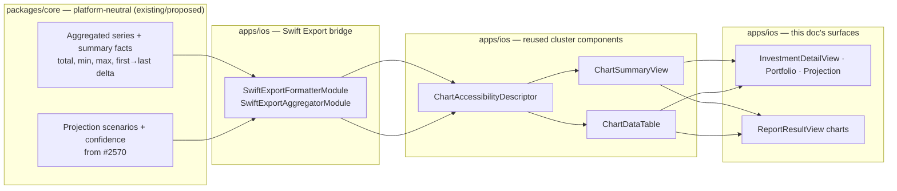

# iOS Investment & Report Chart Text Alternatives

> Design specification that **applies the existing chart text-alternative
> pattern** to `InvestmentDetailView`, the portfolio performance / projection
> charts, and the `ReportResultView` charts — adding a spoken summary (date
> range, extrema, totals, forecast confidence) and a browsable table to each.
> This doc **reuses**, and does not redefine, the cluster pattern.

**Status:** PROPOSED — design only (native implementation gated, see
[Implementation readiness](#implementation-readiness))
**Issue:** [#2537](https://github.com/jrmoulckers/finance/issues/2537) — _Part of
[#2113](https://github.com/jrmoulckers/finance/issues/2113)_
**Platform:** iOS (SwiftUI · Swift Charts)
**Last updated:** 2026-06-22
**Reused pattern (do not re-specify here):**
[ios-chart-summaries-data-tables.md](./ios-chart-summaries-data-tables.md) ·
[ios-chart-voiceover-navigation.md](./ios-chart-voiceover-navigation.md) ·
[ios-chart-descriptor-adapters.md](./ios-chart-descriptor-adapters.md)
**Related design docs:** [data-visualization.md](./data-visualization.md) ·
[accessibility-patterns.md](./accessibility-patterns.md)
**Sibling investment designs:**
[ios-investment-data-kmp-design.md](./ios-investment-data-kmp-design.md) ·
[ios-portfolio-metrics-projections.md](./ios-portfolio-metrics-projections.md)

---

## Table of Contents

1. [Problem & Goal](#1-problem--goal)
2. [Affected iOS Surfaces](#2-affected-ios-surfaces)
3. [Shared Dependencies & the iOS / KMP Boundary](#3-shared-dependencies--the-ios--kmp-boundary)
4. [Applying the Pattern (per surface)](#4-applying-the-pattern-per-surface)
5. [Summary Content: Date Range, Extrema, Totals, Forecast Confidence](#5-summary-content-date-range-extrema-totals-forecast-confidence)
6. [Accessibility](#6-accessibility)
7. [Dynamic Type](#7-dynamic-type)
8. [Privacy & Balance Hiding](#8-privacy--balance-hiding)
9. [Empty, Stale & Error States](#9-empty-stale--error-states)
10. [Test Plan](#10-test-plan)
11. [Implementation readiness](#implementation-readiness)

---

## 1. Problem & Goal

A VoiceOver-first user with severe central vision loss
([#2113](https://github.com/jrmoulckers/finance/issues/2113)) experiences an
unlabelled chart as blank space. Two of this app's chart surfaces are still
chart-only or chart-plus-generic-label:

- [`InvestmentDetailView.swift`](../../apps/ios/Finance/Screens/InvestmentDetailView.swift)
  (≈ lines 158–187) renders price history as a `Chart { LineMark … }` whose only
  accessibility affordance is
  `.accessibilityLabel("Price history line chart for {symbol}")` — no summary, no
  data list.
- [`InvestmentPortfolioView.swift`](../../apps/ios/Finance/Screens/InvestmentPortfolioView.swift)
  (≈ lines 132–189) exposes the performance line + area chart with only
  `.accessibilityLabel("Portfolio performance line chart")`. (Its allocation
  section is already a row list — good; the chart is not.)
- [`ReportResultView.swift`](../../apps/ios/Finance/Screens/ReportResultView.swift)
  already ships `reportDataTable` (≈ line 256) — a category / monthly / net-worth
  row list — but its **charts have no spoken summary**, and the table is a
  bespoke implementation rather than the shared component.

The reusable solution already exists: the chart-accessibility cluster defines
`ChartAccessibilityDescriptor`, `ChartSummaryView`, and `ChartDataTable`
([ios-chart-summaries-data-tables.md](./ios-chart-summaries-data-tables.md)), the
gesture-free inspection model
([ios-chart-voiceover-navigation.md](./ios-chart-voiceover-navigation.md)), and
the `AXChartDescriptor` mapping
([ios-chart-descriptor-adapters.md](./ios-chart-descriptor-adapters.md)).

**Goal:** **apply** that pattern to the investment and report charts so each gets
the cluster's standard **summary → chart → table** swipe order, with summaries
that carry the facts #2537 calls out: **date range, extrema (high/low), totals,
and forecast confidence text**. This doc specifies the per-surface wiring and the
investment/report-specific summary content — it does **not** restate the pattern.

**Non-goals:** redefining the summary/table/descriptor components (owned by the
cluster docs); the projection math (owned by
[ios-portfolio-metrics-projections.md](./ios-portfolio-metrics-projections.md));
the underlying data persistence (owned by
[ios-investment-data-kmp-design.md](./ios-investment-data-kmp-design.md)).

---

## 2. Affected iOS Surfaces

| Surface                                                                                            | Chart today                      | Add summary (facts)                                                 | Add / adopt table                                                        |
| -------------------------------------------------------------------------------------------------- | -------------------------------- | ------------------------------------------------------------------- | ------------------------------------------------------------------------ |
| [`InvestmentDetailView.swift`](../../apps/ios/Finance/Screens/InvestmentDetailView.swift)          | Price-history line (chart-only)  | First→last value, % change, **high/low**, **date range**            | New `ChartDataTable`: per-date price rows                                |
| [`InvestmentPortfolioView.swift`](../../apps/ios/Finance/Screens/InvestmentPortfolioView.swift)    | Performance line + area          | Start→end value, **total return**, high/low, date range             | New `ChartDataTable`: per-date value rows                                |
| Portfolio **projection** chart (from [#2570](https://github.com/jrmoulckers/finance/issues/2570))  | Multi-series scenario line (new) | Horizon, **moderate ending value + range**, **forecast confidence** | New `ChartDataTable`: per-year, per-scenario rows                        |
| [`ReportResultView.swift`](../../apps/ios/Finance/Screens/ReportResultView.swift) — spending donut | `SectorMark` donut               | Total + **biggest category** + slice count                          | **Adopt** shared `ChartDataTable` (replaces bespoke `categoryDataTable`) |
| `ReportResultView` — income vs expense bars                                                        | Grouped `BarMark`                | Per-period totals, highest/lowest month, net                        | Adopt shared `ChartDataTable` (from `monthlyDataTable`)                  |
| `ReportResultView` — net-worth line                                                                | Area + line                      | Start→end, **high/low**, date range                                 | Adopt shared `ChartDataTable` (from `netWorthDataTable`)                 |

> **Reuse, don't fork.** `ReportResultView` already proves the row-list idea; this
> work **migrates** its three bespoke tables onto the shared `ChartDataTable`
> component and **adds the missing spoken summary** above each chart — so the app
> ends with one text-alternative implementation, as the cluster intends
> ([ios-chart-summaries-data-tables.md §2](./ios-chart-summaries-data-tables.md#2-affected-ios-surfaces)).

---

## 3. Shared Dependencies & the iOS / KMP Boundary

This doc consumes the **same boundary** the cluster already drew — it adds no new
boundary, only new call sites.



| Concern                                                              | Lives in                           | Status                                                                                    |
| -------------------------------------------------------------------- | ---------------------------------- | ----------------------------------------------------------------------------------------- |
| `ChartAccessibilityDescriptor`, `ChartSummaryView`, `ChartDataTable` | `apps/ios`                         | **Reused** — defined in the cluster docs, not here                                        |
| Summary facts (min, max, first→last delta, biggest contributor)      | `packages/core` (proposed via ADR) | **From cluster** — same proposed helper; investment/report just call it                   |
| Projection scenarios + `ProjectionConfidence`                        | `packages/core` (proposed via ADR) | **From** [ios-portfolio-metrics-projections.md](./ios-portfolio-metrics-projections.md)   |
| Price/value series + freshness                                       | `packages/core` (proposed via ADR) | **From** [ios-investment-data-kmp-design.md](./ios-investment-data-kmp-design.md)         |
| Currency → display string                                            | `packages/core` (bridged)          | **Exists** — `SwiftExportFormatterModule.format(amountMinorUnits:currencyCode:showSign:)` |
| Building descriptors for these specific charts; summary phrasing     | `apps/ios`                         | **This doc**                                                                              |

> **Boundary rule (inherited):** amounts cross as **`Int64` minor units** and are
> formatted on device; the iOS layer never re-implements currency or return math.
> See [ios-chart-summaries-data-tables.md §3](./ios-chart-summaries-data-tables.md#3-shared-dependencies--the-ios--kmp-boundary).

> **KMP changes are out of scope for this PR.** The proposed summary-facts and
> projection helpers are @kmp-engineer / @architect changes via **ADR**
> ([AGENTS.md](../../AGENTS.md)); this doc only wires existing/planned bridged
> facts into the reused components.

---

## 4. Applying the Pattern (per surface)

Every surface adopts the cluster's deliberate **summary → chart → table** swipe
order ([ios-chart-summaries-data-tables.md §4](./ios-chart-summaries-data-tables.md#4-pattern-design)).
The chart keeps its visual rendering and gains
`.accessibilityChartDescriptor(…)` from
[ios-chart-descriptor-adapters.md](./ios-chart-descriptor-adapters.md); the
gesture-free point inspection comes from
[ios-chart-voiceover-navigation.md](./ios-chart-voiceover-navigation.md).

### 4.1 `InvestmentDetailView` — price history

```
[ChartSummaryView]  #1  "AAPL price history. 12 points, Jul 2025 to Jun 2026.
                         $150.00 rising to $175.00, 16.7 percent. High $182.40,
                         low $148.10."
[Chart { LineMark }] #2  (visual; + .accessibilityChartDescriptor)
[ChartDataTable]    #3  "Jul 2025 … $150.00" · "Aug 2025 … $153.20" · …
```

- The chart's current `.accessibilityElement(children: .combine)` +
  single-label is replaced by the three-element pattern; the existing CVD-safe
  colour and `holdingInfoSection` are unaffected.

### 4.2 `InvestmentPortfolioView` — performance

- Same shape; summary leads with **total return** and **date range**, e.g.
  "Portfolio performance. 12 months, Jul 2025 to Jun 2026. $35,000 rising to
  $42,200, total return +20.6 percent. High $43,100, low $34,200." Table rows are
  per-date portfolio value.

### 4.3 Portfolio **projection** chart (forecast confidence)

- Multi-series (conservative / moderate / optimistic) line; the summary carries
  the **forecast confidence text** #2537 calls for, sourced from
  `ProjectionConfidence` ([metrics doc §7](./ios-portfolio-metrics-projections.md#7-confidence-states)):
  "Projection, 30-year horizon. Moderate estimate $1.20M, range $720K to $2.10M.
  **Medium confidence — based on limited history. Estimate, not advice.**"
- Rows: per-year, per-scenario ("2046 · Moderate … $1.20M"). The estimate
  disclaimer ([metrics doc §8](./ios-portfolio-metrics-projections.md#8-estimate-labelling--assumptions))
  precedes the summary in swipe order.

### 4.4 `ReportResultView` — donut / bars / net-worth

- The three existing charts (`spendingByCategoryChart`, `incomeVsExpenseChart`,
  `netWorthChart`) each gain a `ChartSummaryView`; the existing per-mark
  `.accessibilityLabel`/`.accessibilityValue` stay.
- `categoryDataTable` / `monthlyDataTable` / `netWorthDataTable` are **refactored
  onto the shared `ChartDataTable`** so behaviour matches Insights/Analytics. The
  data and row content are unchanged; only the component is unified.

---

## 5. Summary Content: Date Range, Extrema, Totals, Forecast Confidence

The cluster defines the **grammar**
([ios-chart-summaries-data-tables.md §5](./ios-chart-summaries-data-tables.md#5-spoken-summary-grammar));
this section pins the **facts** #2537 names, per chart family on these surfaces.

| Surface / family                | Date range                  | Extrema (high/low)             | Totals / headline              | Forecast confidence                     |
| ------------------------------- | --------------------------- | ------------------------------ | ------------------------------ | --------------------------------------- |
| Investment price line           | first→last valuation date   | high & low price + their dates | first→last value + % change    | n/a                                     |
| Portfolio performance line      | first→last month            | high & low portfolio value     | total return % + end value     | n/a                                     |
| Projection (scenarios)          | horizon start→end year      | low/high scenario ending value | moderate ending value          | **`ProjectionConfidence` text + range** |
| Report — spending donut         | report period (`dateRange`) | n/a (share-based)              | total + **biggest category** % | n/a                                     |
| Report — income vs expense bars | report period               | highest/lowest month           | period income/expense/net      | n/a                                     |
| Report — net-worth line         | report period               | high & low net worth + dates   | start→end + delta              | n/a                                     |

- **Date range** always uses the existing `dateRange.displayName` (reports) or the
  series' first/last `Date` (investment), formatted on device.
- **Extrema** name both the value **and** when it occurred, so "low" is actionable
  for a non-visual user.
- **Totals / biggest contributor** reuse the same facts the cluster's bar/donut
  grammar already specifies.
- **Forecast confidence** is **text**, derived from the shared
  `ProjectionConfidence`, and is always accompanied by the estimate disclaimer —
  never a bare number that implies certainty.
- All literals use `String(localized:)`; all amounts format through the shared
  formatter; direction words come from the sign of the shared delta, not colour.

---

## 6. Accessibility

This doc **inherits** the cluster's accessibility contract
([ios-chart-summaries-data-tables.md §6](./ios-chart-summaries-data-tables.md#6-accessibility))
and applies it:

- **Swipe order summary → chart → table** on every listed surface; the summary is
  a single `.accessibilityAddTraits(.isSummaryElement)` element, the table is
  always in the accessibility tree (never behind a VoiceOver-blocking toggle).
- The chart retains `.accessibilityChartDescriptor(…)` (audio graph) per
  [ios-chart-descriptor-adapters.md](./ios-chart-descriptor-adapters.md), and
  point-by-point inspection follows
  [ios-chart-voiceover-navigation.md](./ios-chart-voiceover-navigation.md).
- Per-row labels use `.accessibilityElement(children: .combine)` + label + value,
  matching the existing `reportDataTable` rows.
- Section titles keep `.accessibilityAddTraits(.isHeader)` (already the convention
  in both views).
- On reload, the new summary sentence is announced politely via
  `AccessibilityNotification.Announcement`.
- The projection surface additionally exposes its **estimate disclaimer** and
  **confidence** as text, ordered before the figures.

---

## 7. Dynamic Type

Inherits [ios-chart-summaries-data-tables.md §7](./ios-chart-summaries-data-tables.md#7-dynamic-type):

- Summary + table text use Dynamic Type styles / the `FinanceTextStyle` ramp —
  **never** hardcoded point sizes — and the summary **wraps**
  (`.fixedSize(horizontal: false, vertical: true)`) rather than truncates.
- Table rows reflow `HStack → VStack` at accessibility sizes; the table shows full
  values (no `.minimumScaleFactor` clipping). The existing
  `minimumScaleFactor(0.8)` on the detail metrics grid stays visual-only.

---

## 8. Privacy & Balance Hiding

Inherits [ios-chart-summaries-data-tables.md §8](./ios-chart-summaries-data-tables.md#8-privacy--balance-hiding):

- With balance hiding active, the price/value summaries, the projection figures,
  and every report amount redact to a placeholder in **both** the visible text and
  the VoiceOver label, from the same redacted descriptor — no path hides the
  visual but speaks the number.
- Non-sensitive facts (point counts, category names, date range, confidence level)
  may remain.
- Per [os.Logger guidance](../../AGENTS.md), summary sentences and amounts are
  `.private` and never logged verbatim.

---

## 9. Empty, Stale & Error States

Inherits the cluster's state matrix
([ios-chart-summaries-data-tables.md §9](./ios-chart-summaries-data-tables.md#9-empty-stale--error-states))
and maps it to these surfaces:

| State       | Investment / projection                                                   | Report                                                                 |
| ----------- | ------------------------------------------------------------------------- | ---------------------------------------------------------------------- |
| **Empty**   | Existing "No price history available." becomes the single summary element | Existing `emptyChartPlaceholder` / "No data for this period." retained |
| **Loading** | Polite "Loading price history…"; skeleton rows `.accessibilityHidden`     | Same                                                                   |
| **Stale**   | Summary prefix "Showing data as of {asOf}" (from #2568 freshness)         | Report header already shows generated-at; summary echoes it            |
| **Error**   | Labelled **Retry** (reuses the portfolio view's existing alert path)      | Labelled retry; descriptive rows stay usable                           |

For the **projection** surface, the low-confidence / no-contribution / no-FIRE
states from
[ios-portfolio-metrics-projections.md §12](./ios-portfolio-metrics-projections.md#12-empty-stale--error-states)
flow straight into the summary text (e.g. "Low confidence — add more history").
No state relies on colour alone; all copy uses `String(localized:)`.

---

## 10. Test Plan

Smallest tests that must pass before implementation is accepted. Native tests run
on Simulator with **free Personal Team signing** (see
[Implementation readiness](#implementation-readiness)).

### Shared (KMP) — `packages/core` `commonTest` _(proposed via ADR; not in this PR)_

- Covered by the cluster's `SummaryFactsTest`
  ([ios-chart-summaries-data-tables.md §10](./ios-chart-summaries-data-tables.md#10-test-plan)):
  add fixtures for an **investment price series** (extrema + first→last delta) and
  a **projection scenario set** (moderate value + range + confidence) so the facts
  these surfaces speak are verified once, platform-neutrally.

### Native (iOS) — XCTest / Swift Testing in `apps/ios/Tests`

- `InvestmentDetailSummaryTests`: the descriptor → sentence mapping yields the
  expected price-history string incl. date range, high/low (+ dates), and %
  change; empty and single-point series produce the correct wording.
- `PortfolioPerformanceSummaryTests`: summary leads with total return + date
  range; matches the portfolio's computed return.
- `ProjectionSummaryTests`: the projection summary includes the moderate value,
  the low→high range, **and** the `ProjectionConfidence` text + estimate
  disclaimer; suppresses the FIRE range when confidence is Low without a FI number.
- `ReportChartSummaryTests`: donut (biggest category + total), bars
  (highest/lowest month + net), and net-worth (start→end + extrema) summaries are
  correct.
- `ReportDataTableUnificationTests`: the three report tables render via the shared
  `ChartDataTable` with the same row count + labels as the current bespoke tables
  (no regression).
- `ChartAlternativeOrderTests` (XCUITest): VoiceOver swipe order is
  summary → chart → table on `InvestmentDetailView`, the portfolio performance
  chart, the projection chart, and all three report charts.
- `ChartAlternativePrivacyTests`: with balance hiding on, no raw amount appears in
  visible text **or** accessibility labels on any listed surface.

---

## Implementation readiness

**Design: ready now. Native code: buildable now, distribution gated.**

Per the
[Human-Gated Prerequisites runbook](../ops/human-gated-prerequisites.md#2-implementation-vs-distribution--the-decoupling),
implementation and distribution are decoupled. The "blocked by
[#1239](https://github.com/jrmoulckers/finance/issues/1239)" note on
[#2537](https://github.com/jrmoulckers/finance/issues/2537) is a **distribution**
gate only.

| Phase              | What                                                                                               | Gated by #1239?                         |
| ------------------ | -------------------------------------------------------------------------------------------------- | --------------------------------------- |
| **Design**         | This document — per-surface wiring, summary facts, reuse of the cluster components, test plan      | No — deliverable now                    |
| **Implementation** | Add `ChartSummaryView`/`ChartDataTable` to the listed charts; unify report tables; unit + XCUITest | **No** — free Personal Team signing     |
| **Distribution**   | TestFlight / App Store build carrying the accessible charts                                        | **Yes** — Apple Developer Program enrol |

- **Buildable now:** wiring the reused components into these charts, the VoiceOver
  semantics, Dynamic Type behaviour, and the listed tests all run on Simulator /
  device via free Personal Team signing. No paid entitlements are required.
- **Gated tail (#1239):** only shipping through TestFlight / the App Store needs
  the paid Apple Developer enrollment + signing in
  [human-gated-prerequisites.md §3.2](../ops/human-gated-prerequisites.md#32-ios-distribution--apple-developer-1239).
  An SME agent must **not** perform enrollment, certificate, or secret steps.
- **Dependency ordering:** this work lands cleanest **after** the cluster
  components ([ios-chart-summaries-data-tables.md](./ios-chart-summaries-data-tables.md))
  exist; the report-table unification and investment-price summary can proceed
  against the cluster's stub facts, and the projection summary follows
  [ios-portfolio-metrics-projections.md](./ios-portfolio-metrics-projections.md).
  The proposed shared summary-facts helper is an @kmp-engineer change via ADR.

_Part of [#2113](https://github.com/jrmoulckers/finance/issues/2113). Reuses the
chart-accessibility cluster
([summaries & tables](./ios-chart-summaries-data-tables.md) ·
[VoiceOver navigation](./ios-chart-voiceover-navigation.md) ·
[descriptor adapters](./ios-chart-descriptor-adapters.md)); paired with
[KMP-backed investment data](./ios-investment-data-kmp-design.md) and
[portfolio metrics & projections](./ios-portfolio-metrics-projections.md)._
