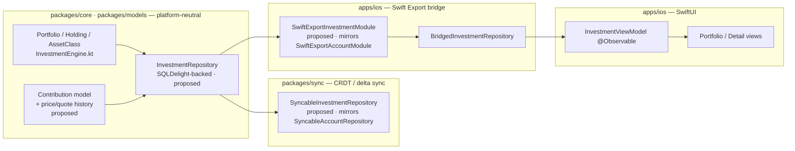
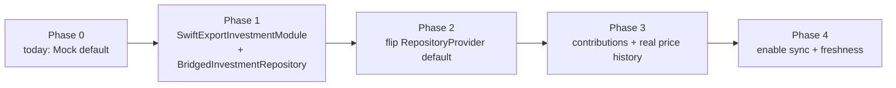

# iOS KMP-Backed Investment Data (Replacing the Mock)

> Design specification for the **repository / view-model boundary** that replaces
> `MockInvestmentRepository` with **persisted, synced** portfolio, holding,
> price, and contribution data — reusing the Swift Export bridge + persistence
> pattern the rest of the app already uses.

**Status:** PROPOSED — design only (native implementation gated, see
[Implementation readiness](#implementation-readiness))
**Issue:** [#2568](https://github.com/jrmoulckers/finance/issues/2568) — _Part of
[#2118](https://github.com/jrmoulckers/finance/issues/2118)_
**Platform:** iOS (SwiftUI · Swift Concurrency · Swift Export / KMP)
**Last updated:** 2026-06-22
**Related design docs:** [data-model.md](./data-model.md) ·
[features.md](./features.md) · [accessibility-patterns.md](./accessibility-patterns.md)
**Sibling designs (this cluster):**
[ios-portfolio-metrics-projections.md](./ios-portfolio-metrics-projections.md) ·
[ios-investment-chart-text-alternatives.md](./ios-investment-chart-text-alternatives.md)

---

## Table of Contents

1. [Problem & Goal](#1-problem--goal)
2. [Affected iOS Surfaces](#2-affected-ios-surfaces)
3. [Shared Dependencies & the iOS / KMP Boundary](#3-shared-dependencies--the-ios--kmp-boundary)
4. [The Repository Contract](#4-the-repository-contract)
5. [Data Model & Persistence](#5-data-model--persistence)
6. [Sync Expectations](#6-sync-expectations)
7. [Migration: Mock → Real](#7-migration-mock--real)
8. [Accessibility](#8-accessibility)
9. [Dynamic Type](#9-dynamic-type)
10. [Privacy & Balance Hiding](#10-privacy--balance-hiding)
11. [Empty, Stale & Error States](#11-empty-stale--error-states)
12. [Test Plan](#12-test-plan)
13. [Implementation readiness](#implementation-readiness)

---

## 1. Problem & Goal

An index-fund investor ([#2118](https://github.com/jrmoulckers/finance/issues/2118))
cannot trust a screen that is mock-backed. Today the investment feature is wired
to hard-coded sample data:

- [`RepositoryProvider.swift`](../../apps/ios/Finance/Repositories/RepositoryProvider.swift)
  (≈ lines 94–101) defaults `investments` to `MockInvestmentRepository()`, while
  every other domain (`accounts`, `transactions`, `budgets`, `goals`,
  `categories`) already defaults to a `Bridged*Repository` backed by the Swift
  Export bridge.
- [`MockInvestmentRepository.swift`](../../apps/ios/Finance/Repositories/Mocks/MockInvestmentRepository.swift)
  serves fixed holdings (AAPL, MSFT, BND, VNQ, GLD, USDC) and **randomly
  generated** performance history (`Int64.random(...)` ≈ line 93), and carries an
  explicit `TODO: Replace MockInvestmentRepository with KMP-backed repository`.
- [`InvestmentViewModel.swift`](../../apps/ios/Finance/ViewModels/InvestmentViewModel.swift)
  and the two screens already depend only on the
  [`InvestmentRepository`](../../apps/ios/Finance/Repositories/InvestmentRepository.swift)
  protocol, so the swap is a **dependency change, not a UI rewrite**.

**Goal:** define the repository contract, the shared data model + persistence,
and the sync expectations needed to back the investment feature with **real,
durable, synced** data — including the **contribution** dimension that
[ios-portfolio-metrics-projections.md](./ios-portfolio-metrics-projections.md)
depends on — and the phased migration that flips the default from mock to real
without changing a single `View` or `ViewModel` call site.

**Non-goals:** brokerage / market-data ingestion (live quotes are a separate,
provider-gated concern — see [§6](#6-sync-expectations)); the projection and
text-alternative work (sibling docs). This doc draws the **data boundary** only;
it does not implement KMP code.

---

## 2. Affected iOS Surfaces

| Surface                                                                                                      | Role                                                 | Change                                                                                                                                     |
| ------------------------------------------------------------------------------------------------------------ | ---------------------------------------------------- | ------------------------------------------------------------------------------------------------------------------------------------------ |
| [`RepositoryProvider.swift`](../../apps/ios/Finance/Repositories/RepositoryProvider.swift)                   | DI container                                         | Flip `investments` default `MockInvestmentRepository()` → `BridgedInvestmentRepository()`                                                  |
| [`InvestmentRepository.swift`](../../apps/ios/Finance/Repositories/InvestmentRepository.swift)               | Data-access protocol                                 | Extend with contribution + freshness accessors (see [§4](#4-the-repository-contract))                                                      |
| `BridgedInvestmentRepository` (new)                                                                          | Adapter → Swift Export `SwiftExportInvestmentModule` | New, mirrors `BridgedAccountRepository` in [`SwiftExportBridgeProvider.swift`](../../apps/ios/Finance/KMP/SwiftExportBridgeProvider.swift) |
| [`InvestmentModels.swift`](../../apps/ios/Finance/Models/InvestmentModels.swift)                             | SwiftUI value types                                  | Add `ContributionItem`, `dataAsOf`/freshness, keep money in `Int64` minor units                                                            |
| [`InvestmentViewModel.swift`](../../apps/ios/Finance/ViewModels/InvestmentViewModel.swift)                   | `@Observable` view model                             | Surface freshness + load contributions; **no math moves here** (stays in KMP)                                                              |
| [`InvestmentPortfolioView.swift`](../../apps/ios/Finance/Screens/InvestmentPortfolioView.swift)              | List + summary + perf chart                          | Unchanged structurally; gains stale/empty/error fidelity from real data                                                                    |
| [`InvestmentDetailView.swift`](../../apps/ios/Finance/Screens/InvestmentDetailView.swift)                    | Single-holding detail                                | Unchanged structurally; price history becomes real, not random                                                                             |
| [`MockInvestmentRepository.swift`](../../apps/ios/Finance/Repositories/Mocks/MockInvestmentRepository.swift) | Preview / test fixture                               | **Retained** for previews/tests; demoted from production default                                                                           |

> **The point of the protocol:** because `InvestmentRepository` is already the
> only thing the view models import, "replace the mock" is one DI edit plus the
> bridge adapter. The mock stays as the preview/test double, exactly like
> `MockAccountRepository` does today.

---

## 3. Shared Dependencies & the iOS / KMP Boundary

Business rules (portfolio math, allocation, contribution accounting) are
platform-neutral and already partly exist in
[`InvestmentEngine.kt`](../../packages/core/src/commonMain/kotlin/com/finance/core/investment/InvestmentEngine.kt).
Apple-specific concerns (SwiftUI, Keychain, VoiceOver) stay in `apps/ios`.



| Concern                                                              | Lives in                            | Status                                                                                                                                             |
| -------------------------------------------------------------------- | ----------------------------------- | -------------------------------------------------------------------------------------------------------------------------------------------------- |
| `Portfolio`, `Holding`, `AssetClass`, summary/return/allocation math | `packages/core`                     | **Exists** — [`InvestmentEngine.kt`](../../packages/core/src/commonMain/kotlin/com/finance/core/investment/InvestmentEngine.kt)                    |
| `Contribution` model (deposits/buys by date & amount)                | `packages/core` / `packages/models` | **Proposed via ADR** — needed by [metrics doc](./ios-portfolio-metrics-projections.md)                                                             |
| Price / quote history persistence (vs. today's random series)        | `packages/core`                     | **Proposed via ADR** — replaces `getPerformanceHistory` randomness                                                                                 |
| `InvestmentRepository` (SQLDelight read/write, soft-delete)          | `packages/core` (`packages/db`)     | **Proposed via ADR** — mirrors existing account/transaction repos                                                                                  |
| Sync (delta apply, `observeUnsyncedCount`)                           | `packages/sync`                     | **Proposed via ADR** — mirrors [`SyncableRepository`](../../packages/sync/src/commonMain/kotlin/com/finance/sync/repository/SyncableRepository.kt) |
| Encrypted on-device store (SQLCipher, Keychain-held key)             | `apps/ios`                          | **Exists** — `LiveSwiftExportBridge` + `PersistentDataStore`                                                                                       |
| `SwiftExportInvestmentModule` + `BridgedInvestmentRepository`        | `apps/ios`                          | **This doc** (new, mirrors account module/adapter)                                                                                                 |
| Currency → display string (`Int64` minor units → locale string)      | `packages/core` (bridged)           | **Exists** — `SwiftExportFormatterModule.format(amountMinorUnits:currencyCode:showSign:)`                                                          |

> **Boundary rule:** money crosses the bridge as **`Int64` minor units**
> (`Cents` in KMP). The iOS layer never re-implements return, gain/loss, or
> allocation math — those already live in `InvestmentEngine` and stay there.
> Kotlin → Swift type mapping is the standard one (`Long` → `Int64`, `List` →
> `Array`, sealed/enum → enum).

> **KMP changes are out of scope for this PR.** Every "proposed" row above is an
> @kmp-engineer / @architect change introduced via ADR per
> [AGENTS.md](../../AGENTS.md). This design names the contracts; it does not edit
> `packages/`.

---

## 4. The Repository Contract

### 4.1 Today

[`InvestmentRepository`](../../apps/ios/Finance/Repositories/InvestmentRepository.swift)
is already `Sendable` and fully `async throws`:

```swift
protocol InvestmentRepository: Sendable {
    func getPortfolios() async throws -> [PortfolioItem]
    func getPortfolio(id: String) async throws -> PortfolioItem?
    func getHoldings(portfolioId: String) async throws -> [HoldingItem]
    func getHolding(id: String) async throws -> HoldingItem?
    func getPerformanceHistory(portfolioId: String, months: Int) async throws -> [PerformanceDataPoint]
    func deleteAllInvestments() async throws    // GDPR "Delete Everything"
}
```

The shape is correct; what is missing is (a) real data behind it, (b)
contributions, and (c) a way to tell the UI **how fresh** the data is.

### 4.2 Target

Extend the protocol additively (defaulted, so existing call sites stay valid):

```swift
protocol InvestmentRepository: Sendable {
    // existing six methods, unchanged signatures …

    /// Cash contributions (deposits / buys) for a portfolio, ascending by date.
    /// Required by the contribution-aware metrics in #2570.
    func getContributions(portfolioId: String) async throws -> [ContributionItem]

    /// Real price/quote history for a single holding (replaces random series).
    func getPriceHistory(holdingId: String, months: Int) async throws -> [PerformanceDataPoint]

    /// Freshness signal: when the underlying snapshot was last synced/valued.
    func dataFreshness(portfolioId: String) async throws -> DataFreshness
}

struct DataFreshness: Sendable, Hashable {
    let asOf: Date          // valuation timestamp
    let isStale: Bool       // older than the freshness budget (e.g. > 24h)
    let source: Source      // .synced, .localOnly, .placeholder
    enum Source: Sendable { case synced, localOnly, placeholder }
}
```

Contract rules:

- **Idempotent reads, no surprises:** repositories return whatever is persisted;
  they never fabricate data. The random walk in the mock is exactly the behaviour
  we are removing.
- **Soft delete:** the shared `Portfolio` already carries `deletedAt`; reads
  exclude soft-deleted rows. `deleteAllInvestments()` maps to the existing
  "Delete Everything" GDPR flow (same as `deleteAllAccounts()`), routed through
  the Swift Export sync module so the deletion propagates.
- **Currency:** all amounts remain `Int64` minor units; `currencyCode` per
  portfolio/holding is preserved end-to-end.
- **Errors** surface as thrown Swift errors; the bridge wraps KMP failures
  (`KMPRepositoryError.bridgeCallFailed`) exactly like the existing
  `KMP*Repository` types so the view model's existing `catch` keeps working.

---

## 5. Data Model & Persistence

### 5.1 Entities

| Entity       | Shared source of truth                                            | iOS value type                                                          | Notes                                                               |
| ------------ | ----------------------------------------------------------------- | ----------------------------------------------------------------------- | ------------------------------------------------------------------- |
| Portfolio    | `Portfolio` (`InvestmentEngine.kt`)                               | [`PortfolioItem`](../../apps/ios/Finance/Models/InvestmentModels.swift) | Adds `ownerId`/`householdId` for sync scoping (already in KMP type) |
| Holding      | `Holding` (`InvestmentEngine.kt`)                                 | `HoldingItem`                                                           | `quantity`, `costBasis`, `currentValue`, `previousClose`            |
| Price point  | **proposed** `PriceQuote(holdingId, date, valueCents)`            | `PerformanceDataPoint`                                                  | Replaces `Int64.random(...)`; one row per valuation date            |
| Contribution | **proposed** `Contribution(portfolioId, date, amountCents, kind)` | **new** `ContributionItem`                                              | `kind ∈ {deposit, dividendReinvest, withdrawal}`; drives #2570      |
| Allocation   | derived (`InvestmentEngine.assetAllocation`)                      | `AllocationSlice`                                                       | Computed, never stored                                              |

`ContributionItem` (new iOS value type, mirrors a proposed KMP `Contribution`):

```swift
struct ContributionItem: Identifiable, Hashable, Sendable {
    let id: String
    let portfolioId: String
    let date: Date
    let amountMinorUnits: Int64       // positive = in, negative = withdrawal
    let kind: Kind
    let currencyCode: String
    enum Kind: String, Sendable { case deposit, dividendReinvest, withdrawal }
}
```

### 5.2 Persistence

- **Store:** the same encrypted on-device database every other domain uses —
  `LiveSwiftExportBridge` over `PersistentDataStore` (SQLCipher), with the
  database key held in the **Keychain**
  (`kSecAttrAccessibleWhenUnlockedThisDeviceOnly`). No investment data lands in
  `UserDefaults`.
- **Tables:** `portfolio`, `holding`, `price_quote`, `contribution`, following
  the existing SQLDelight schema conventions in `packages/db` (sync columns:
  `updatedAt`, `deletedAt`, `syncVersion`).
- **Widgets / App Group:** if a portfolio-value widget is later added, only a
  **redacted, already-formatted** summary string crosses into the App Group;
  raw rows and keys never leave the app sandbox (consistent with the balance
  widget pattern).

---

## 6. Sync Expectations

- **Mechanism:** investments sync through the same delta pipeline as accounts.
  A proposed `SyncableInvestmentRepository` implements the existing
  [`SyncableRepository`](../../packages/sync/src/commonMain/kotlin/com/finance/sync/repository/SyncableRepository.kt)
  contract (`tableName`, `applySyncChange`, `toRowData`,
  `observeUnsyncedCount`), mirroring `SyncableAccountRepository`.
- **Scope:** rows are scoped by `ownerId` / `householdId` (already on the
  `Portfolio` type) so a household can share a portfolio view under existing
  sharing rules.
- **Offline-first:** reads always come from the local encrypted store; sync
  reconciles in the background. The UI's `DataFreshness.asOf` tells the user when
  the snapshot was valued, and `isStale` drives the stale banner
  ([§11](#11-empty-stale--error-states)).
- **Valuation vs. market data — explicit boundary:** this design syncs
  **user-entered / persisted valuations and contributions**. Live brokerage
  quotes and near-real-time market data are a **separate, provider-credential-
  gated** concern (see the market-data entry in
  [human-gated-prerequisites.md §3.5](../ops/human-gated-prerequisites.md#35-windows-market-data--provider-credentials-2702));
  until a provider is wired, `currentValue` / `previousClose` come from the last
  synced valuation, and the UI labels the as-of time rather than implying a live
  price.
- **Conflict resolution:** last-writer-wins per row at the field granularity the
  shared sync engine already provides; contributions are append-only (a corrected
  contribution is a new row + soft-deleted old row), which keeps the
  money-weighted return history auditable.

---

## 7. Migration: Mock → Real

A phased switch so the app is never broken and previews keep working.



| Phase | Change                                                                                                                                   | Risk control                                                                                       |
| ----- | ---------------------------------------------------------------------------------------------------------------------------------------- | -------------------------------------------------------------------------------------------------- |
| **1** | Add `SwiftExportInvestmentModule` to the bridge protocol + a `BridgedInvestmentRepository` adapter (mirrors `BridgedAccountRepository`). | Default still `MockInvestmentRepository`; nothing changes for users until Phase 2.                 |
| **2** | Flip the `RepositoryProvider` default to `BridgedInvestmentRepository()`. Stub bridge returns seeded data; live bridge reads the store.  | One-line DI change; mock stays for `#Preview` + tests. Reversible by reverting the default.        |
| **3** | Replace `getPerformanceHistory` randomness with persisted `PriceQuote` rows; add `getContributions`.                                     | Empty-history portfolios render the existing "No price history" empty state — no random fallback.  |
| **4** | Wire `SyncableInvestmentRepository` + `dataFreshness`; surface stale/synced states.                                                      | Sync failures degrade to `localOnly`; the UI still shows last-known valuation with an as-of label. |

- **No call-site churn:** because the view models depend on the protocol, Phases
  1–4 touch DI + the adapter only. `InvestmentPortfolioView` /
  `InvestmentDetailView` / `InvestmentViewModel` need **no** structural edits.
- **Stub parity:** when the `FinanceSync` XCFramework is absent (e.g. building on
  Windows CI), the bridge falls back to `PersistentDataStore`/stub exactly as it
  does for accounts today, so the iOS target still builds and tests green.
- **Mock retained on purpose:** `MockInvestmentRepository` keeps SwiftUI previews
  deterministic and is the injected double in unit tests.

---

## 8. Accessibility

This is a data/boundary design, but the data it introduces directly feeds
accessible UI, so the contract carries a11y obligations:

- **Freshness is announced, not coloured.** `DataFreshness.isStale` / `.source`
  produce a **text** label ("Updated 2 days ago", "Offline — last synced…"), so a
  VoiceOver user learns staleness without relying on a colour badge
  ([accessibility-patterns.md](./accessibility-patterns.md)).
- **Real data → honest VoiceOver values.** The existing per-row
  `.accessibilityLabel`/`.accessibilityValue` on holdings and the portfolio
  summary now read **true** returns and values instead of mock numbers.
- **Contributions are first-class text.** Contribution rows expose
  `.accessibilityElement(children: .combine)` with label (date + kind) and value
  (formatted amount), matching the existing holding-row convention.
- The chart text-alternative obligations for these surfaces are specified
  separately in
  [ios-investment-chart-text-alternatives.md](./ios-investment-chart-text-alternatives.md).

---

## 9. Dynamic Type

- All new labels (freshness caption, contribution rows) use Dynamic Type system
  styles / the `FinanceTextStyle` ramp — **never** hardcoded point sizes.
- Real data can be larger than the mock's tidy values (e.g. seven-figure
  balances); currency labels keep `.minimumScaleFactor` only on dense visual rows
  and **wrap** rather than truncate in detail/summary text at the largest
  accessibility sizes.
- Contribution and holding rows adopt the adaptive stack convention so a
  label + amount row reflows `HStack → VStack` at accessibility sizes.

---

## 10. Privacy & Balance Hiding

- **Keychain-only secrets.** The SQLCipher key and any sync tokens live in the
  Keychain (`…WhenUnlockedThisDeviceOnly`); no investment value, key, or token is
  written to `UserDefaults`.
- **Balance hiding.** When privacy mode is active, the view model redacts every
  monetary field (portfolio total, holding value, gain/loss, contribution amount)
  to a placeholder in **both** the visible text **and** the VoiceOver string,
  derived from the same redacted model — there is no path that hides the number
  visually but speaks it.
- **Logging.** Per [os.Logger guidance](../../AGENTS.md), amounts, symbols+
  quantities, and balances are `.private`; only non-sensitive lifecycle events
  (`"investment sync started"`, error `.localizedDescription` marked `.public`)
  are logged. The existing `InvestmentViewModel` logger already follows this.
- **Deletion.** `deleteAllInvestments()` participates in the GDPR
  "Delete Everything" path and tombstones rows through sync so a wiped device
  does not resurrect data on next sync.

---

## 11. Empty, Stale & Error States

| State                  | Trigger                                | Behaviour                                                                                                                                  |
| ---------------------- | -------------------------------------- | ------------------------------------------------------------------------------------------------------------------------------------------ |
| **Empty (no data)**    | No portfolios persisted                | Existing `EmptyStateView` ("No Investments — Add investment accounts…") in `InvestmentPortfolioView`; single focusable element.            |
| **Empty (no history)** | Portfolio exists, no `PriceQuote` rows | Existing "No price history available." caption (no random fallback); summary states "no history yet".                                      |
| **Stale**              | `DataFreshness.isStale == true`        | Banner/caption "Showing data as of {asOf}"; numbers still render; staleness announced in text, reuses offline signal.                      |
| **Local-only**         | `source == .localOnly` (sync offline)  | "Offline — last synced {asOf}"; reuses the app's `OfflineBanner` pattern.                                                                  |
| **Error**              | Repository throws                      | Existing alert in `InvestmentPortfolioView` with **Retry** + **Dismiss**; non-judgemental copy per [ux-principles.md](./ux-principles.md). |

All states use `String(localized:)`; none rely on colour alone.

---

## 12. Test Plan

Smallest tests that must pass before implementation is accepted. Native tests run
on Simulator with **free Personal Team signing** — no paid enrollment (see
[Implementation readiness](#implementation-readiness)).

### Shared (KMP) — `packages/core` / `packages/sync` `commonTest` _(proposed via ADR; not in this PR)_

- `InvestmentRepositoryTest`: round-trip persist → read for portfolios, holdings,
  price quotes, contributions; soft-deleted rows are excluded.
- `ContributionTest`: deposit / dividend-reinvest / withdrawal kinds sum and
  order correctly (ascending by date), incl. empty and single-entry cases.
- `SyncableInvestmentRepositoryTest`: `toRowData` ⇄ `applySyncChange` round-trips
  a portfolio + holding; `observeUnsyncedCount` reflects pending writes;
  last-writer-wins on a conflicting valuation.
- Extend `InvestmentEngineTest` only if new derived helpers are added (existing
  summary/return/allocation tests already cover the math).

### Native (iOS) — XCTest / Swift Testing in `apps/ios/Tests`

- `BridgedInvestmentRepositoryTests`: the adapter forwards each protocol method to
  the `SwiftExportInvestmentModule` and surfaces thrown errors unchanged (mirror
  `SwiftExportWireUpTests`).
- `RepositoryProviderTests`: the production default is `BridgedInvestmentRepository`
  after the flip; previews/tests can still inject `MockInvestmentRepository`.
- `InvestmentViewModelTests`: with a stub repository, `loadPortfolios()` populates
  portfolios/allocation/history; a thrown error sets `errorMessage` and empties
  the list; `DataFreshness.isStale` drives a stale flag (no UI regression).
- `InvestmentFreshnessTests`: `.synced` / `.localOnly` / `.placeholder` produce
  the expected **text** label (asserted as accessibility string, not colour).
- `InvestmentPrivacyRedactionTests`: with balance-hiding on, neither visible text
  nor accessibility label exposes a raw amount on portfolio, holding, or
  contribution rows.

---

## Implementation readiness

**Design: ready now. Native code: buildable now, distribution gated.**

Per the
[Human-Gated Prerequisites runbook](../ops/human-gated-prerequisites.md#2-implementation-vs-distribution--the-decoupling),
implementation and distribution are decoupled. The "blocked by
[#1239](https://github.com/jrmoulckers/finance/issues/1239)" note on
[#2568](https://github.com/jrmoulckers/finance/issues/2568) is a **distribution**
gate only.

| Phase              | What                                                                                           | Gated by #1239?                         |
| ------------------ | ---------------------------------------------------------------------------------------------- | --------------------------------------- |
| **Design**         | This document — contract, model, persistence, sync, migration, test plan                       | No — deliverable now                    |
| **Implementation** | `SwiftExportInvestmentModule`, `BridgedInvestmentRepository`, DI flip, view-model + unit tests | **No** — free Personal Team signing     |
| **Distribution**   | TestFlight / App Store build carrying real investment data                                     | **Yes** — Apple Developer Program enrol |

- **Buildable now:** the bridge adapter, DI flip, freshness plumbing, and all
  listed iOS tests run on Simulator / device via free Personal Team signing. No
  paid entitlements are required.
- **Gated tail (#1239):** only shipping through TestFlight / the App Store needs
  the paid Apple Developer enrollment + signing material in
  [human-gated-prerequisites.md §3.2](../ops/human-gated-prerequisites.md#32-ios-distribution--apple-developer-1239).
  An SME agent must **not** perform enrollment, certificate, or secret steps.
- **Shared-logic tail:** the `Contribution` model, `PriceQuote` persistence, the
  SQLDelight-backed `InvestmentRepository`, and `SyncableInvestmentRepository` are
  @kmp-engineer / @architect changes via **ADR**. Until they land, the iOS bridge
  can persist via `PersistentDataStore` against the proposed schema and the mock
  remains the preview/test double — so iOS work is unblocked in parallel.

_Part of [#2118](https://github.com/jrmoulckers/finance/issues/2118). Sibling
designs:
[contribution-aware metrics & projections](./ios-portfolio-metrics-projections.md)
· [investment chart text alternatives](./ios-investment-chart-text-alternatives.md)._
