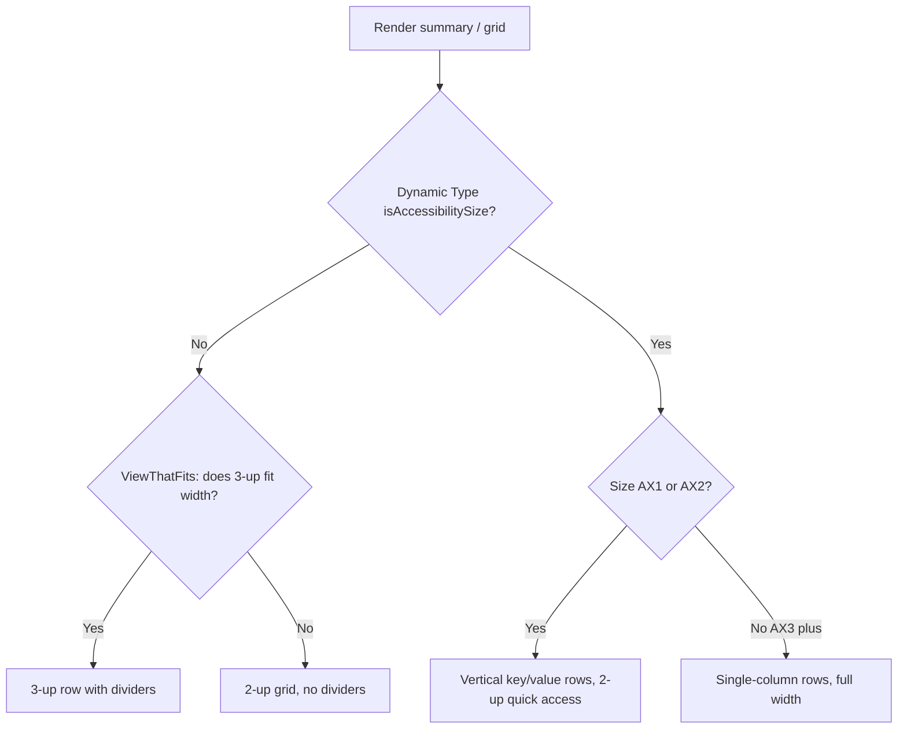

# iPhone SE Compact Dashboard & Bills Layouts (iOS)

> **Status:** Design draft (design-only — no native build in this PR)
> **Issue:** [#2607](../../issues/2607) · **Parent:** [#2190](../../issues/2190)
> **Platform:** iOS (SwiftUI) · **Audience:** iOS engineers, design, QA
> **Distribution blocker:** [#1239](../../issues/1239) (Apple Developer enrollment — _distribution only_, see [Implementation readiness](#implementation-readiness))

This document specifies compact-width layout alternatives for the iOS
**Dashboard** and **Bills** screens so they remain legible, reflow-safe, and
fully accessible on the smallest supported iPhone — the iPhone SE — across the
whole Dynamic Type range up to AX5.

It is a **design specification only**. It does not change Swift code, shared
`packages/`, or any other platform. All numeric thresholds are **design
estimates** to be confirmed on-device during implementation (no simulator or
device build is performed here).

---

## Table of Contents

- [Problem statement](#problem-statement)
- [Reference device & viewport](#reference-device--viewport)
- [Affected iOS surfaces](#affected-ios-surfaces)
- [Shared / KMP boundary](#shared--kmp-boundary)
- [Layout strategy](#layout-strategy)
  - [Dashboard](#dashboard)
  - [Bills](#bills)
- [Reflow decision flow](#reflow-decision-flow)
- [Accessibility](#accessibility)
- [Privacy & balance hiding](#privacy--balance-hiding)
- [Empty, stale & error states](#empty-stale--error-states)
- [Test plan (smallest viable)](#test-plan-smallest-viable)
- [Implementation readiness](#implementation-readiness)
- [Related documents](#related-documents)

---

## Problem statement

Several Dashboard and Bills surfaces use **fixed multi-column rows** built from
an `HStack` with vertical `Divider`s, plus a fixed **three-column** quick-access
grid. These were tuned for 390–430 pt-wide devices. On a 375 pt-wide iPhone SE,
and especially once Dynamic Type reaches the accessibility sizes (AX1–AX5),
currency values truncate, dividers crush columns, and tap targets collide.

The fixed three-up patterns that need compact alternatives are:

| Surface       | Element                       | Source (read-only reference)                                                                      | Risk on SE                                       |
| ------------- | ----------------------------- | ------------------------------------------------------------------------------------------------- | ------------------------------------------------ |
| Dashboard     | "This Month" summary (3 cols) | [`DashboardView.swift`](../../apps/ios/Finance/Screens/DashboardView.swift) `spendingSummaryCard` | Income / Expenses / Net truncate at AX sizes     |
| Dashboard     | Quick access grid (3 cols)    | [`DashboardView.swift`](../../apps/ios/Finance/Screens/DashboardView.swift) `quickAccessSection`  | 3 × `GridItem(.flexible())` too narrow at 375 pt |
| Dashboard     | Budget health strip           | [`DashboardView.swift`](../../apps/ios/Finance/Screens/DashboardView.swift) `budgetHealthSection` | Horizontal scroll OK; label clipping at AX sizes |
| Bills         | Summary card (3 cols)         | [`BillsListView.swift`](../../apps/ios/Finance/Screens/BillsListView.swift) `summaryCard`         | Due / Monthly Total / Bills crush at AX sizes    |
| Bills         | Bill row (icon + 2 columns)   | [`BillsListView.swift`](../../apps/ios/Finance/Screens/BillsListView.swift) `billRow`             | Trailing amount + due date overflow              |
| Budgets (adj) | Overall summary (3 cols)      | [`BudgetsView.swift`](../../apps/ios/Finance/Screens/BudgetsView.swift) `overallSummary`          | Spent / Ring / Budgeted touched by same pattern  |

> The Budgets overall-summary row shares the same three-up idiom and is included
> for consistency, but the primary scope of [#2607](../../issues/2607) is
> Dashboard and Bills.

## Reference device & viewport

| Property                  | iPhone SE (2nd / 3rd gen)               | Notes                                                           |
| ------------------------- | --------------------------------------- | --------------------------------------------------------------- |
| Display                   | 4.7-inch                                | Smallest device supported at deployment target iOS 17.0         |
| Logical size (portrait)   | **375 × 667 pt** _(estimate, standard)_ | The compact-width floor we design against                       |
| Safe content width        | ~343 pt _(estimate)_                    | 375 pt − 2 × 16 pt horizontal padding (`.padding(.horizontal)`) |
| Scale                     | @2x                                     |                                                                 |
| Dynamic Type range tested | XS → XXXL → **AX1 → AX5**               | AX5 is the largest accessibility text size                      |

> iPhone SE (1st gen) / iPhone 5s (320 pt) are **not** supported at iOS 17, so
> **375 pt is the design floor**. Where a layout survives 320 pt cleanly we note
> it as a bonus, but it is not a target.

## Affected iOS surfaces

Read-only references (do **not** edit in this PR):

- [`apps/ios/Finance/Screens/DashboardView.swift`](../../apps/ios/Finance/Screens/DashboardView.swift)
- [`apps/ios/Finance/Screens/BillsListView.swift`](../../apps/ios/Finance/Screens/BillsListView.swift)
- [`apps/ios/Finance/Screens/BudgetsView.swift`](../../apps/ios/Finance/Screens/BudgetsView.swift)
- [`apps/ios/Finance/Accessibility/DynamicTypeSupport.swift`](../../apps/ios/Finance/Accessibility/DynamicTypeSupport.swift)
  — already provides `AdaptiveFinanceStack`, `ClampedScaledMetric`, and
  `SizeConstrainedCurrencyText`, which this spec reuses.
- [`apps/ios/Finance/Theme/FinanceTypography.swift`](../../apps/ios/Finance/Theme/FinanceTypography.swift)
  — token-backed Dynamic Type styles. No hardcoded sizes.

## Shared / KMP boundary

This work is **presentation-only**. No business rules change.

- **Stays in `packages/core` / `packages/models`** (do not implement here):
  monetary aggregation (net worth, monthly income/expenses, budget progress,
  bill totals). The iOS view models already consume these via the Swift Export
  aggregator/formatter modules
  ([`DashboardViewModel`](../../apps/ios/Finance/ViewModels/DashboardViewModel.swift),
  [`BudgetsViewModel`](../../apps/ios/Finance/ViewModels/BudgetsViewModel.swift)).
- **Stays in `apps/ios`** (this spec): SwiftUI layout containers, reflow
  thresholds, accessibility semantics, and currency-label sizing.

No new bridge methods are required for [#2607](../../issues/2607).

## Layout strategy

The strategy is **reflow, not shrink**. We never reduce currency text below the
readable minimum to force a layout; instead we change the container axis when
width or Dynamic Type demands it. Three composable techniques:

1. **Axis switch by Dynamic Type** — reuse `AdaptiveFinanceStack`
   (`@Environment(\.dynamicTypeSize)` → `isAccessibilitySize`) to turn
   horizontal three-up rows into vertical stacks at AX1+.
2. **`ViewThatFits`** — let SwiftUI pick the first child that fits the available
   width, falling back from a 3-up row → 2-up grid → single column.
3. **Adaptive grid columns** — replace fixed `GridItem(.flexible())` counts with
   `GridItem(.adaptive(minimum:))` so column count derives from width.

### Dashboard

```text
Standard (≥ 375 pt, ≤ XXXL)            Accessibility (AX1+)
┌─────────────────────────────┐       ┌─────────────────────────────┐
│ Net Worth (hero)            │       │ Net Worth (hero)            │
├─────────────────────────────┤       ├─────────────────────────────┤
│ This Month                  │       │ This Month                  │
│ Income │ Expenses │  Net    │  -->  │ Income                      │
│        │          │         │       │ Expenses                    │
│                             │       │ Net                         │
├─────────────────────────────┤       ├─────────────────────────────┤
│ Budget Health  → → (scroll) │       │ Budget Health → → (scroll)  │
├─────────────────────────────┤       ├─────────────────────────────┤
│ More: [Invest][Bills][Rpts] │  -->  │ More: 2-up, then 1-up at AX3 │
└─────────────────────────────┘       └─────────────────────────────┘
```

Recommended rules (design estimates — verify on device):

| Element              | Standard (XS–XXXL)                           | Accessibility (AX1–AX5)                                  |
| -------------------- | -------------------------------------------- | -------------------------------------------------------- |
| "This Month" summary | 3-up `HStack` with `Divider`s (current)      | Vertical stack; drop dividers; label-over-value rows     |
| Quick access "More"  | `GridItem(.adaptive(minimum: 104))` → 3 cols | 2 cols at AX1–AX2; 1 col at AX3–AX5 (full-width rows)    |
| Budget health strip  | Horizontal scroll (current)                  | Keep scroll; allow label `lineLimit(2)`; widen ring tile |
| Net worth hero       | `.largeTitle.bold()` currency                | `minimumScaleFactor(0.8)` floor, never below ~17 pt      |

- The "This Month" reflow is the single highest-value change: at AX3+ the three
  inline `CurrencyLabel`s cannot coexist on one 343 pt row.
- Quick-access tiles must keep a **44 × 44 pt** minimum tap target (already met
  by the icon container); when reflowed to one column, render as full-width rows
  with leading icon + trailing chevron affordance.

### Bills

```text
Standard summary row                  Accessibility (AX1+)
┌─────────────────────────────┐       ┌─────────────────────────────┐
│  Due │ Monthly Total │ Bills │  -->  │ Due:            $X          │
│      │               │       │       │ Monthly Total:  $Y          │
│                             │       │ Bills:          N           │
└─────────────────────────────┘       └─────────────────────────────┘
```

| Element         | Standard (XS–XXXL)                       | Accessibility (AX1–AX5)                              |
| --------------- | ---------------------------------------- | ---------------------------------------------------- |
| Summary card    | 3-up `HStack` with `Divider`s (current)  | Vertical key/value rows; remove dividers             |
| Bill row        | Icon + name/payee + trailing amount/date | At AX2+, move amount + due date below the name block |
| Section headers | Color dot + title + count (current)      | Keep; ensure `.isHeader` trait + count stays inline  |
| Auto-pay badge  | Inline `Label` after payee               | Wraps to its own line at AX sizes                    |

- The bill row's trailing `VStack` (amount over due date) competes with a long
  payee name on a 343 pt row. At AX2+, prefer a single vertical flow:
  name → payee/auto-pay → amount → due date.
- Due-date color (`bill.dueDateColor`) must never be the **only** signal — pair
  with text ("Overdue", "Due in 3 days") so it survives grayscale / CVD. This
  matches [accessibility-patterns.md](./accessibility-patterns.md) §Color & Contrast.

## Reflow decision flow



## Accessibility

All requirements below are **mandatory** and align with
[accessibility-patterns.md](./accessibility-patterns.md) and
[cognitive-accessibility.md](./cognitive-accessibility.md).

- **VoiceOver:** existing `.accessibilityElement(children: .combine)` groupings
  on each card are preserved. When a row reflows to a vertical stack, keep the
  **combined** element so the value reads as one phrase
  (e.g. _"This month, expenses, $842"_), not three fragments. Verify reading
  order top-to-bottom after reflow.
- **Dynamic Type up to AX5 at 375 pt:** every label uses token Dynamic Type
  styles from [`FinanceTypography`](../../apps/ios/Finance/Theme/FinanceTypography.swift)
  / `FinanceTextStyle`. No `.font(.system(size:))` literals. Currency values use
  `SizeConstrainedCurrencyText` / `ClampedScaledMetric` so they scale but never
  drop below ~14 pt or overflow.
- **Reflow:** no horizontal clipping or truncation of monetary values at any
  size on a 375 pt width. Tables above define the axis switch points. Horizontal
  scroll is acceptable **only** for the budget-health strip (a browse affordance),
  never for primary balances.
- **Reduced Motion:** honor `@Environment(\.accessibilityReduceMotion)`. The
  layout axis switch must be a **non-animated** swap when Reduce Motion is on
  (no cross-fade/slide). See [animation-library.md](./animation-library.md).
- **Touch targets:** maintain ≥ 44 × 44 pt for all interactive tiles/rows after
  reflow (Apple HIG; see [accessibility-patterns.md](./accessibility-patterns.md)
  §Touch Target Sizing).
- **Contrast & CVD:** status colors are paired with text/labels, never used
  alone. Charts/rings keep the IBM CVD-safe palette
  ([data-visualization.md](./data-visualization.md)).

## Privacy & balance hiding

- The Dashboard and Bills screens render only after the local auth gate; the
  hero net-worth value is sensitive. When the app exposes a balance-hiding /
  bucketed mode (the same concept used for widgets in
  [`WidgetPrivacyPrompt`](../../apps/ios/Finance/Services/WidgetPrivacyPrompt.swift)),
  the reflowed currency labels must respect it — masked amounts (e.g. "•••")
  reflow with the same rules as real values so layout does not "jump" when the
  user toggles visibility.
- Never log financial values during layout debugging. Any `os.Logger` use stays
  `privacy: .private` for amounts (`.public` only for non-sensitive layout
  metrics like measured width).

## Empty, stale & error states

These reuse existing components; the compact rules apply to them too.

| State       | Dashboard                                                                     | Bills                                                        |
| ----------- | ----------------------------------------------------------------------------- | ------------------------------------------------------------ |
| **Empty**   | `EmptyStateView` for "No Recent Transactions"; summary shows zeros            | `EmptyStateView` "No Bills" with "Add Bill" action           |
| **Stale**   | `OfflineBanner` pinned above cards when `NetworkMonitor.isConnected == false` | Same offline banner pattern; last-synced amounts shown as-is |
| **Error**   | Alert with Retry/Dismiss (`viewModel.showError`)                              | Alert with Retry/Dismiss (`viewModel.showError`)             |
| **Loading** | `ProgressView` centered with `accessibilityLabel("Loading")`                  | `ProgressView` centered with `accessibilityLabel("Loading")` |

- The **offline banner** and **empty state** illustrations must also reflow:
  at AX sizes the banner text wraps to multiple lines rather than truncating.
- Stale data should carry a "Last updated …" affordance where available so users
  understand a balance may be behind real-time (privacy-safe relative time, not
  an exact balance in the banner).

## Test plan (smallest viable)

Goal: prove reflow correctness at the SE width across the Dynamic Type range
with the **fewest** new tests. Detailed regression matrix lives in
[ios-iphone-se-ui-regression.md](./ios-iphone-se-ui-regression.md)
([#2609](../../issues/2609)); this section names only what gates **this** change.

**Native (apps/ios) — smallest set:**

1. **Snapshot tests at 375 × 667 pt** for `DashboardView` and `BillsListView`
   at content sizes `{ .large, .xxxLarge, .accessibility1, .accessibility3,
.accessibility5 }`. Assert no clipped currency labels and correct axis at
   each size. (Requires a snapshot harness — tracked in the regression doc; do
   not add the dependency in this design PR.)
2. **XCUITest reflow assertion** extending
   [`FinanceUITests.swift`](../../apps/ios/Tests/UITests/FinanceUITests.swift):
   launch with an AX content-size launch argument, navigate to Dashboard/Bills,
   assert the summary value elements exist and are hittable (proxy for
   "not clipped / reachable").
3. **No new view-model tests** — aggregation is unchanged and already covered by
   [`DashboardViewModelTests`](../../apps/ios/Tests/DashboardViewModelTests.swift)
   and `BudgetsViewModelTests`.

**Shared (packages):** none — no business-rule change.

**Acceptance gate:** snapshots green at all five sizes for both screens; no
truncated monetary text; VoiceOver reads each summary as one combined phrase.

## Implementation readiness

Per [`docs/ops/human-gated-prerequisites.md`](../ops/human-gated-prerequisites.md),
implementation and distribution are **decoupled**. This layout work is
**buildable and testable now**; only store distribution is gated by
[#1239](../../issues/1239).

| Phase              | Work                                                                                  | Gated by #1239?                                                      |
| ------------------ | ------------------------------------------------------------------------------------- | -------------------------------------------------------------------- |
| **Design**         | This document                                                                         | No                                                                   |
| **Implementation** | SwiftUI reflow in Dashboard/Bills, snapshot + XCUITest at SE width, local device runs | **No** — free **Personal Team** signing on a device, plus simulator  |
| **Distribution**   | TestFlight / App Store build with the new layouts                                     | **Yes** — Apple Developer enrollment + signing material + CI secrets |

> **Buildable now:** all reflow code, simulator snapshots, and on-device
> verification using a **free Apple ID (Personal Team)** in Xcode (7-day app
> expiry, max 3 apps/device — fine for layout QA).
>
> **Needs human action (later):** nothing in this layout change requires it. Only
> shipping it through TestFlight/App Store requires the
> [§3.2 Apple Developer checklist](../ops/human-gated-prerequisites.md#32-ios-distribution--apple-developer-1239).
> Agents must **not** perform enrollment, signing, or secret configuration.

## Related documents

- [ios-iphone-se-ui-regression.md](./ios-iphone-se-ui-regression.md) — regression matrix ([#2609](../../issues/2609))
- [ios-grocery-safe-to-spend-card.md](./ios-grocery-safe-to-spend-card.md) — grocery card ([#2610](../../issues/2610))
- [responsive-breakpoints.md](./responsive-breakpoints.md) — token breakpoint tiers
- [accessibility-patterns.md](./accessibility-patterns.md) — cross-platform a11y patterns
- [cognitive-accessibility.md](./cognitive-accessibility.md) — clarity & load
- [content-language-guidelines.md](./content-language-guidelines.md) — labels & microcopy
- [data-visualization.md](./data-visualization.md) — CVD-safe chart/ring palette
- [animation-library.md](./animation-library.md) — motion & Reduce Motion
- [`docs/ops/human-gated-prerequisites.md`](../ops/human-gated-prerequisites.md) — build vs. distribution gating
