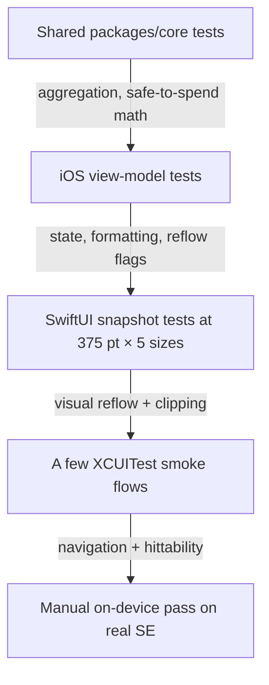

# iPhone SE iOS UI Regression Coverage (iOS)

> **Status:** Design draft (design-only — no native build in this PR)
> **Issue:** [#2609](../../issues/2609) · **Parent:** [#2190](../../issues/2190)
> **Platform:** iOS (SwiftUI) · **Audience:** iOS engineers, QA
> **Distribution blocker:** [#1239](../../issues/1239) (Apple Developer enrollment — _distribution only_, see [Implementation readiness](#implementation-readiness))

This document defines the **regression coverage plan** that protects the
iPhone SE compact layouts from regressing as features evolve. It enumerates the
SE-sized destinations to guard, the Dynamic Type sizes to assert, and the
**smallest** set of native and shared tests required before the layout work in
[#2607](../../issues/2607) and the grocery card in [#2610](../../issues/2610) are
accepted.

It is a **test-plan specification only** — it adds no Swift code, no
dependencies, and touches no other platform. Numbers are **design estimates**
pending on-device confirmation.

---

## Table of Contents

- [Goal & scope](#goal--scope)
- [Destinations under coverage](#destinations-under-coverage)
- [Dynamic Type matrix](#dynamic-type-matrix)
- [Test pyramid for SE](#test-pyramid-for-se)
- [Coverage matrix (smallest viable)](#coverage-matrix-smallest-viable)
- [Snapshot harness approach](#snapshot-harness-approach)
- [Accessibility assertions](#accessibility-assertions)
- [Privacy & balance-hiding cases](#privacy--balance-hiding-cases)
- [Empty, stale & error coverage](#empty-stale--error-coverage)
- [Shared / KMP boundary](#shared--kmp-boundary)
- [CI integration](#ci-integration)
- [Implementation readiness](#implementation-readiness)
- [Related documents](#related-documents)

---

## Goal & scope

Provide a **repeatable, low-maintenance** safety net that fails fast when a
change clips currency text, breaks reflow, or drops an accessibility trait on a
375 pt-wide screen. The plan favors a **small number of high-signal snapshot and
view-model tests** over an exhaustive XCUITest sweep.

In scope:

- Dashboard, Bills, grocery transaction entry, Budget detail, and the Dynamic
  Type behavior of each on SE-sized destinations.

Out of scope (covered elsewhere):

- The layout rules themselves — see
  [ios-iphone-se-compact-layouts.md](./ios-iphone-se-compact-layouts.md).
- The grocery card visual/interaction spec — see
  [ios-grocery-safe-to-spend-card.md](./ios-grocery-safe-to-spend-card.md).

## Destinations under coverage

Read-only references (do **not** edit in this PR):

| Destination                  | Primary surface                                                                             | Why it matters on SE                                 |
| ---------------------------- | ------------------------------------------------------------------------------------------- | ---------------------------------------------------- |
| Dashboard                    | [`DashboardView.swift`](../../apps/ios/Finance/Screens/DashboardView.swift)                 | 3-up summary + 3-up quick-access grid reflow         |
| Bills                        | [`BillsListView.swift`](../../apps/ios/Finance/Screens/BillsListView.swift)                 | 3-up summary card + dense bill rows                  |
| Grocery transaction entry    | [`TransactionCreateView.swift`](../../apps/ios/Finance/Screens/TransactionCreateView.swift) | Forms must scroll, keyboard avoidance at AX sizes    |
| Budget detail                | [`BudgetsView.swift`](../../apps/ios/Finance/Screens/BudgetsView.swift) (cards + sheet)     | Ring + amounts + status text on one row              |
| Grocery safe-to-spend card   | [#2610](../../issues/2610) (planned)                                                        | New Dashboard card; reflow + privacy + drill-in      |
| Dynamic Type (cross-cutting) | [`DynamicTypeSupport.swift`](../../apps/ios/Finance/Accessibility/DynamicTypeSupport.swift) | Shared scaling primitives that all screens depend on |

## Dynamic Type matrix

We do **not** snapshot all 12 content sizes — that is high cost, low marginal
signal. We assert at **five representative sizes** that bracket the reflow
breakpoints from [#2607](../../issues/2607):

| Symbol           | `DynamicTypeSize` | Why this size                                        |
| ---------------- | ----------------- | ---------------------------------------------------- |
| Default          | `.large`          | Baseline most users see                              |
| Largest standard | `.xxxLarge`       | Last non-accessibility size; densest "normal" layout |
| AX entry         | `.accessibility1` | First size that triggers the axis switch             |
| AX mid           | `.accessibility3` | Single-column threshold for quick access             |
| AX max           | `.accessibility5` | Worst case — proves nothing clips or overflows       |

All snapshots fix the **device width at 375 pt** (iPhone SE portrait, _estimate_)
and let height grow with content.

## Test pyramid for SE



- **Widest, cheapest layer:** shared math tests in `packages/` (run on CI without
  Apple tooling).
- **Next:** iOS view-model unit tests (fast, no UI).
- **Targeted:** SwiftUI snapshot tests — the core of SE protection.
- **Thin top:** a handful of XCUITest flows for navigation/hittability.
- **Manual:** one human pass on a physical SE before release (free Personal Team
  build).

## Coverage matrix (smallest viable)

| Destination               | View-model unit | Snapshot @375 × 5 sizes | XCUITest smoke | Notes                                                  |
| ------------------------- | --------------- | ----------------------- | -------------- | ------------------------------------------------------ |
| Dashboard                 | ✅ (existing)   | ✅ **new**              | ✅ extend      | Summary + quick access reflow are the priority asserts |
| Bills                     | ✅ (existing)   | ✅ **new**              | ✅ extend      | Summary card + bill row reflow                         |
| Grocery transaction entry | ✅ (existing)   | ✅ **new** (form)       | ✅ extend      | Assert scrollable form + Save reachable at AX5         |
| Budget detail             | ✅ (existing)   | ✅ **new**              | optional       | Ring + amounts + status on one row                     |
| Grocery card ([#2610])    | ⛔ until built  | ✅ **new** when built   | ⛔ until built | Add with the feature; not before                       |
| Dynamic Type primitives   | ✅ **new** unit | n/a                     | n/a            | `ClampedScaledMetric` clamps at AX5; pure logic test   |

> ✅ existing = covered today by files such as
> [`DashboardViewModelTests`](../../apps/ios/Tests/DashboardViewModelTests.swift),
> `BudgetsViewModelTests`, `TransactionCreateViewModelTests`, and the XCUITest
> suite [`FinanceUITests`](../../apps/ios/Tests/UITests/FinanceUITests.swift).
> **new** = added with the implementation PR, not this design PR.

### Smallest acceptance set per screen

- **Dashboard:** 5 snapshots + 1 XCUITest (navigate, assert summary values
  hittable at `.accessibility5`).
- **Bills:** 5 snapshots + 1 XCUITest (navigate, assert bill row amount + due
  date present, not clipped).
- **Grocery entry:** 5 snapshots of the form + 1 XCUITest (open entry, type
  amount, assert Save button hittable at AX5 above the keyboard).
- **Budget detail:** 5 snapshots; XCUITest optional (reuses Budgets navigation).
- **Dynamic Type primitives:** 1 unit test asserting `ClampedScaledMetric`
  respects min/max bounds.

## Snapshot harness approach

iOS currently has **no snapshot-testing library** wired in (see the Tests
directory — only XCTest unit + XCUITest). The implementation PR should add a
single, well-maintained Swift-package snapshot dependency.

- **Constraint:** the framework must be a **Swift Package** (no third-party UI
  frameworks — SwiftUI + Swift concurrency only). Snapshot testing is a **test
  dependency**, not a UI framework, so it is permitted; adding it is an
  implementation decision to record via the normal review, not in this design PR.
- **Configuration:** snapshots run on a **simulator only** (no signing, no
  device), so they execute under free tooling and on CI runners that have Xcode.
- **Fixture data:** drive views with the existing mock repositories
  ([`MockBillRepository`](../../apps/ios/Finance/Repositories/Mocks/MockBillRepository.swift),
  `MockBudgetRepository`, `MockTransactionRepository`) so snapshots are
  deterministic and offline.
- **Stable rendering:** pin locale to `en_US`, fix the date via injected `Date`,
  and disable animations so diffs are pixel-stable.

```text
Snapshot test naming (estimate):
  test_Dashboard_SE_large
  test_Dashboard_SE_axLarge1
  test_Dashboard_SE_axLarge5
  test_Bills_SE_axLarge3
  ...
```

## Accessibility assertions

Each snapshot/UITest pairs with at least one **semantic** assertion (visual
parity is not enough):

- **VoiceOver grouping:** combined elements (`accessibilityElement(children:
.combine)`) still read as a single phrase after reflow — assert the
  `accessibilityLabel`/`accessibilityValue` exists on the grouped element.
- **Header traits:** section headers keep `.isHeader` (Bills sections, "More",
  budget detail headers).
- **Tap targets:** XCUITest asserts interactive elements are `isHittable` at AX5
  (a practical proxy for the 44 × 44 pt minimum).
- **No truncation contract:** snapshots are the guard for clipped currency text;
  reviewers reject any diff showing "…"-truncated amounts.
- **Reduce Motion:** a smoke test launches with Reduce Motion on and asserts the
  destination still renders (no motion-dependent content gating).

These mirror [accessibility-patterns.md](./accessibility-patterns.md) and
[cognitive-accessibility.md](./cognitive-accessibility.md).

## Privacy & balance-hiding cases

Add explicit cases so privacy modes are regression-protected:

- **Masked vs. visible amounts:** snapshot Dashboard/Bills/grocery card in both
  the "exact" and "bucketed/hidden" presentation (the same concept as
  [`WidgetPrivacyPrompt`](../../apps/ios/Finance/Services/WidgetPrivacyPrompt.swift)).
  Assert layout **does not shift** between modes at any Dynamic Type size.
- **No value leakage in test logs:** tests must not print real amounts; treat
  fixture amounts as opaque strings in assertions where possible.
- **Locked-state safety:** any surface reachable from a lock-screen widget
  deep link must render its masked form first (covered with the grocery card in
  [#2610](../../issues/2610)).

## Empty, stale & error coverage

For each destination, snapshot the three non-happy states at **at least** the
default and AX5 sizes:

| State   | What to assert                                                             |
| ------- | -------------------------------------------------------------------------- |
| Empty   | `EmptyStateView` renders, CTA reachable, text wraps (not truncates) at AX5 |
| Stale   | `OfflineBanner` visible, wraps at AX5, primary content still legible       |
| Error   | Retry/Dismiss alert path reachable (XCUITest), copy not truncated          |
| Loading | `ProgressView` present with `accessibilityLabel("Loading")`                |

## Shared / KMP boundary

- **`packages/core` / `packages/models` (do not implement here):** the
  aggregation and safe-to-spend math under test belong to shared logic. Shared
  unit tests for those rules run on CI **without** Apple tooling and are the
  base of the pyramid. This plan only **references** them; it does not add them.
- **`apps/ios` (this plan):** snapshot + XCUITest + view-model tests for
  presentation and reflow.

The split keeps math regressions catchable on every PR (cross-platform) while UI
regressions are caught by the iOS-only snapshot layer.

## CI integration

- **Runs where Xcode exists:** snapshot + XCUITest jobs require a macOS runner
  with Xcode; they need **no signing** (simulator only) and therefore no Apple
  enrollment.
- **Shared math** runs on standard Linux CI via the existing `packages/` test
  tasks.
- **Failure artifacts:** snapshot jobs upload the failing reference/diff images
  so reviewers can see exactly what clipped.
- **Determinism:** fixed locale, fixed clock, animations disabled, fixed device
  width (375 pt). Flaky snapshots are treated as bugs, not retried away.

## Implementation readiness

Per [`docs/ops/human-gated-prerequisites.md`](../ops/human-gated-prerequisites.md),
test authoring and execution are **buildable now**; only store distribution is
gated by [#1239](../../issues/1239).

| Phase              | Work                                                                   | Gated by #1239?                                                             |
| ------------------ | ---------------------------------------------------------------------- | --------------------------------------------------------------------------- |
| **Design**         | This regression plan                                                   | No                                                                          |
| **Implementation** | Snapshot harness, snapshot/XCUITest/unit tests, simulator + device run | **No** — simulator needs no signing; device runs use free **Personal Team** |
| **Distribution**   | Shipping a tested build via TestFlight / App Store                     | **Yes** — enrollment + signing + CI release secrets                         |

> **Buildable now:** the entire test suite runs on the iOS Simulator (no
> signing) and on a physical SE via free Personal Team signing.
>
> **Needs human action (later):** none for testing. Only the eventual
> store/TestFlight release uses the
> [§3.2 Apple Developer checklist](../ops/human-gated-prerequisites.md#32-ios-distribution--apple-developer-1239).
> Agents must **not** perform enrollment, signing, or secret configuration.

## Related documents

- [ios-iphone-se-compact-layouts.md](./ios-iphone-se-compact-layouts.md) — layout spec ([#2607](../../issues/2607))
- [ios-grocery-safe-to-spend-card.md](./ios-grocery-safe-to-spend-card.md) — grocery card ([#2610](../../issues/2610))
- [accessibility-patterns.md](./accessibility-patterns.md) — a11y patterns & assertions
- [cognitive-accessibility.md](./cognitive-accessibility.md) — clarity & load
- [responsive-breakpoints.md](./responsive-breakpoints.md) — breakpoint tiers
- [content-language-guidelines.md](./content-language-guidelines.md) — microcopy under test
- [`docs/ops/human-gated-prerequisites.md`](../ops/human-gated-prerequisites.md) — build vs. distribution gating
