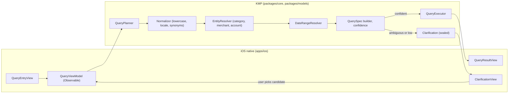
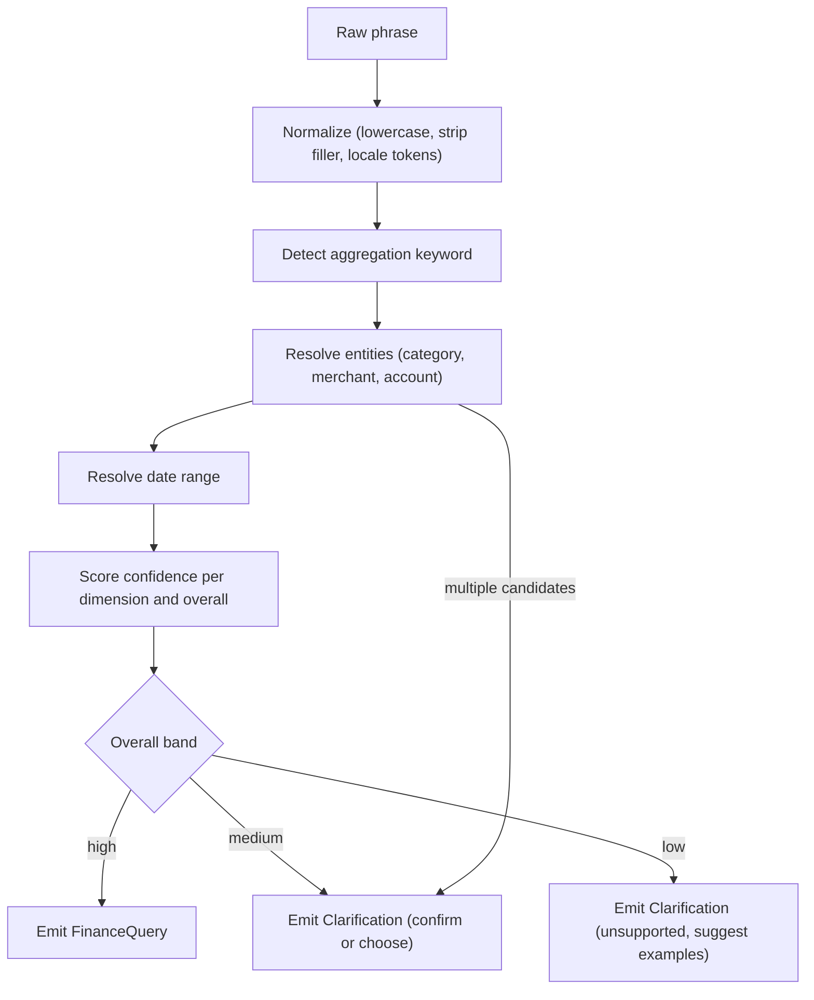

# Constrained Local Finance Query Planner and Clarification UX

> Design specification for the **shared, on-device query planner** that turns a
> short finance phrase into a structured, bounded `FinanceQuery` over category,
> merchant, account, and date-range dimensions — and for the **clarification
> UX** iOS shows when a phrase is ambiguous or low-confidence. The planner is
> deliberately _constrained_: it recognizes a small grammar, never invents
> answers, and asks rather than guesses.

**Status:** PROPOSED — design only (native implementation gated, see
[Implementation readiness](#implementation-readiness))
**Issue:** [#2618](https://github.com/jrmoulckers/finance/issues/2618) — _Part of
[#2386](https://github.com/jrmoulckers/finance/issues/2386)_
**Platform:** Shared KMP (`packages/core`) + iOS 17 presentation (`apps/ios`)
**Last updated:** 2026-06-22
**Related design docs:**
[data-model.md](./data-model.md) ·
[ux-principles.md](./ux-principles.md) ·
[cognitive-accessibility.md](./cognitive-accessibility.md) ·
[content-language-guidelines.md](./content-language-guidelines.md) ·
[accessibility-patterns.md](./accessibility-patterns.md)
**Sibling docs (this cluster):**
[ios-app-intents-siri-query.md](./ios-app-intents-siri-query.md) ·
[ios-nl-query-fixtures.md](./ios-nl-query-fixtures.md)

---

## Table of Contents

1. [Problem and Goal](#1-problem-and-goal)
2. [Affected iOS Surfaces](#2-affected-ios-surfaces)
3. [Shared Dependencies and the KMP Boundary](#3-shared-dependencies-and-the-kmp-boundary)
4. [Query Grammar and Supported Dimensions](#4-query-grammar-and-supported-dimensions)
5. [Planner Pipeline](#5-planner-pipeline)
6. [Confidence Scoring and Thresholds](#6-confidence-scoring-and-thresholds)
7. [Clarification UX](#7-clarification-ux)
8. [Accessibility](#8-accessibility)
9. [Privacy and Data Minimization](#9-privacy-and-data-minimization)
10. [Empty, Stale, Error, and Low-Confidence States](#10-empty-stale-error-and-low-confidence-states)
11. [Test Plan](#11-test-plan)
12. [Implementation readiness](#implementation-readiness)

---

## 1. Problem and Goal

The [Siri/App Intents surface](./ios-app-intents-siri-query.md) needs a single,
predictable component that converts a short phrase into something the app can
execute. We want a planner that is:

- **Constrained** — recognizes a finite grammar of dimensions
  (category, merchant, account, date range) and a small set of aggregations
  (balance, sum, ranked list, count). It is not an open-ended assistant.
- **Deterministic** — the same phrase, dataset, locale, and clock always yield
  the same `FinanceQuery` (so it can be pinned by golden fixtures, see
  [ios-nl-query-fixtures.md](./ios-nl-query-fixtures.md)).
- **Honest** — when a phrase is ambiguous or weakly matched, it returns a
  `Clarification` instead of guessing. Asking is cheaper than a wrong number.
- **Shared** — implemented once in KMP `packages/core` so every platform parses
  identically; iOS only renders the prompts and results.

## 2. Affected iOS Surfaces

| Surface                       | Role                                                         |
| ----------------------------- | ------------------------------------------------------------ |
| `QueryEntryView` (SwiftUI)    | Typed entry; submits raw text to the KMP planner             |
| `ClarificationView` (SwiftUI) | Renders a `Clarification` as a bounded disambiguation prompt |
| App Intents `IntentDialog`    | Spoken/visual clarification when invoked via Siri            |
| `QueryResultView` (SwiftUI)   | Renders the executed `QueryResult`                           |
| `@Observable QueryViewModel`  | Holds entry text, planner state, clarification turns, result |

The view model is `@Observable` (Observation framework), not `ObservableObject`.
All planner calls are `async` and update `@MainActor` UI state.

## 3. Shared Dependencies and the KMP Boundary

- **KMP owns** `QueryPlanner`, `Normalizer`, `EntityResolver`,
  `DateRangeResolver`, the `FinanceQuery` (a.k.a. `QuerySpec`) builder,
  `QueryExecutor`, and the `Clarification` sealed hierarchy. Entity resolution
  reads `Account` / `Category` / `Transaction` per
  [data-model.md](./data-model.md).
- **iOS owns** only presentation: text input, rendering `Clarification`
  candidates, capturing the chosen candidate, and rendering `QueryResult`.
- **Bridge mapping:** `Clarification` (Kotlin `sealed`) → Swift `enum` the UI
  switches over exhaustively; `FinanceQuery` fields map by the standard contract
  (`Int` → `Int32`, `String` → `String`, `List` → `Array`).

> Grammar/threshold changes are **KMP changes**: propose via ADR to
> @native-app-engineer / @architect. This doc specifies behavior, not Kotlin code.

## 4. Query Grammar and Supported Dimensions

A `FinanceQuery` is a small, closed struct. v1 dimensions:

| Dimension   | Examples (input)                             | Resolution source                          |
| ----------- | -------------------------------------------- | ------------------------------------------ |
| Aggregation | "balance", "how much", "top", "how many"     | Verb/keyword → `Aggregation` enum          |
| Category    | "groceries", "dining", "transport"           | `Category` names + curated synonym table   |
| Merchant    | "at Trader Joe's", "Amazon"                  | Distinct merchant strings in `Transaction` |
| Account     | "Checking", "my Visa", "savings"             | `Account` names + type aliases             |
| Date range  | "this month", "last week", "in May", "today" | `DateRangeResolver` (locale + clock)       |

Rules:

- **At most one** value per dimension in v1; multiple values of the same
  dimension ("groceries and dining") trigger clarification rather than a guess.
- **Synonyms** are a curated, localized table (`String(localized:)` keys on the
  iOS side for any display text; matching itself is in KMP). No fuzzy ML
  matching — matching is normalized exact + a bounded edit-distance for typos.
- **Unbounded date** defaults to a sensible window (current month) only when the
  aggregation requires one and none is stated; this default is surfaced in the
  answer ("this month") so it is never silent.

## 5. Planner Pipeline

Each stage is pure and side-effect-free over its inputs (text + a snapshot of
entity names + a fixed clock), which is what makes the planner fixture-testable.

## 6. Confidence Scoring and Thresholds

Confidence is a bounded `Double` in `0.0...1.0`, combining per-dimension match
quality (exact = high, synonym = medium, edit-distance = lower) and coverage
(did we find an aggregation and at least one filter?).

| Band   | Range       | Behavior                                                  |
| ------ | ----------- | --------------------------------------------------------- |
| High   | ≥ 0.85      | Auto-build `FinanceQuery` and execute                     |
| Medium | 0.50 – 0.85 | Build best-guess but **confirm** ("Did you mean dining?") |
| Low    | < 0.50      | Decline; return `Clarification.unsupported` with examples |

Thresholds are constants in KMP and are pinned by fixtures so behavior cannot
drift silently. They are not user-configurable in v1.

## 7. Clarification UX

A `Clarification` is one of a small sealed set; iOS renders each as a bounded,
non-conversational prompt:

| `Clarification` case | When                               | iOS rendering                                            |
| -------------------- | ---------------------------------- | -------------------------------------------------------- |
| `.chooseEntity`      | 2–3 candidates for one dimension   | List of ≤3 tappable candidates + "None of these"         |
| `.confirmGuess`      | Single medium-confidence guess     | "Did you mean <X>?" Yes / No (rephrase)                  |
| `.missingDimension`  | Aggregation found, no filter/range | Prompt for the missing piece with example chips          |
| `.unsupported`       | Low confidence / outside catalog   | "I can answer balance and spending questions" + examples |

UX rules (aligned with [cognitive-accessibility.md](./cognitive-accessibility.md)
and [ux-principles.md](./ux-principles.md)):

- **Bounded turns:** at most **two** clarification turns, then the surface offers
  typed entry / open-in-app and stops. No infinite loops.
- **Always show ≤3 candidates** to limit cognitive load; if more match, narrow
  by recency rather than listing all.
- **Plain, non-judgmental language** per
  [content-language-guidelines.md](./content-language-guidelines.md); never blame
  the user ("I didn't catch that", not "Invalid query").
- **Escape hatch always present:** "None of these" / "Type it instead" on every
  prompt — so voice is never a trap.

## 8. Accessibility

- **VoiceOver:** each candidate in `ClarificationView` is its own element with a
  descriptive `.accessibilityLabel()` (e.g. _"Dining category, choose"_); the
  prompt is announced via `AccessibilityNotification.Announcement` when it
  appears. Patterns from [accessibility-patterns.md](./accessibility-patterns.md).
- **Voice as alternative, not sole path:** clarification is fully operable by
  tap and by VoiceOver — a user who cannot or will not speak resolves ambiguity
  the same way. The "Type it instead" affordance is mandatory.
- **Dynamic Type:** candidate rows and prompts use text styles and reflow to
  multi-line at large sizes; chips wrap, never truncate. Verified at
  `accessibility5`.
- **Focus order:** prompt → candidates → escape hatch, a logical reading order;
  focus moves to the prompt when it appears.
- **Switch Control / keyboard:** all candidates are focusable controls with ≥44pt
  targets.

## 9. Privacy and Data Minimization

- **On-device only:** normalization, entity resolution, scoring, and execution
  all run locally. Phrases and candidates never leave the device; there is no
  cloud NLP.
- **Data minimization:** the planner reads only entity _names_ and the minimal
  transaction fields needed to aggregate; raw phrases are not persisted.
- **No verbatim logging:** `os.Logger` records the abstract path (band, case
  taken) but never the phrase, candidate names, or amounts (`.private`).
- **GDPR / CCPA:** introduces no new data collection or sharing — all processing
  is local and ephemeral. Clearing app data clears any cached synonym/entity
  snapshots; no new consent surface is required.

## 10. Empty, Stale, Error, and Low-Confidence States

| State          | Trigger                                     | Behavior                                                      |
| -------------- | ------------------------------------------- | ------------------------------------------------------------- |
| Empty          | Valid `FinanceQuery`, zero matches          | "No spending found for <filter> <range>" + adjust/typed entry |
| Stale          | Entity snapshot older than freshness window | Resolve against last-known; qualify result "as of <time>"     |
| Error          | Resolver/executor failure or bridge error   | `Clarification.unsupported` fallback + non-sensitive log      |
| Ambiguous      | Multiple candidates for a dimension         | `.chooseEntity` (≤3)                                          |
| Low confidence | Overall < 0.50                              | `.unsupported` with examples; no auto-execute                 |
| Over-specified | Two values for one dimension                | `.chooseEntity` to pick one (v1 single-value rule)            |

Every state resolves to a next action; none dead-ends.

## 11. Test Plan

Smallest set, fixture-anchored on
[ios-nl-query-fixtures.md](./ios-nl-query-fixtures.md):

**Shared (KMP, `packages/core`) — JVM, no device:**

1. `NormalizerTest` — filler stripping, locale tokens, synonym mapping are
   deterministic for each fixture.
2. `EntityResolverTest` — exact / synonym / typo (edit-distance) cases resolve
   to expected candidates; over-specified input yields multiple candidates.
3. `DateRangeResolverTest` — "this month", "last week", "in May", "today" resolve
   to exact ranges under a **fixed clock**.
4. `QueryPlannerTest` — full phrase → expected `FinanceQuery` **or** expected
   `Clarification` case (golden).
5. `ConfidenceThresholdTest` — boundary phrases land in the expected band.

**Native (iOS, Simulator — free signing):**

6. `ClarificationViewTests` (XCTest/snapshot) — each `Clarification` case renders
   the correct controls, ≤3 candidates, and an escape hatch.
7. `ClarificationA11yUITests` (XCUITest) — VoiceOver labels/announcement,
   Dynamic Type at `accessibility5`, two-turn bound enforced, "Type it instead"
   reachable without speech.

CI: shared in `ci-shared.yml`, native in `ci-ios.yml` (Simulator). No signing.

## Implementation readiness

**Design: ready now. Native code: buildable now, distribution gated.**

Per the
[Human-Gated Prerequisites runbook](../ops/human-gated-prerequisites.md#2-implementation-vs-distribution--the-decoupling),
implementation and distribution are decoupled. The "blocked by
[#1239](https://github.com/jrmoulckers/finance/issues/1239)" note on
[#2618](https://github.com/jrmoulckers/finance/issues/2618) is a **distribution**
gate only.

| Phase              | What                                                                  | Gated by #1239?                     |
| ------------------ | --------------------------------------------------------------------- | ----------------------------------- |
| **Design**         | This document, grammar, pipeline, thresholds, clarification UX, tests | No — deliverable now                |
| **Implementation** | KMP planner/executor/clarification + SwiftUI prompt and result views  | **No** — free Personal Team signing |
| **Distribution**   | TestFlight / App Store build carrying the planner-backed surface      | **Yes** — Apple Developer Program   |

- **Buildable now:** the KMP planner builds and unit-tests on the JVM with no
  Apple account; the SwiftUI `ClarificationView` / `QueryResultView` and the
  `@Observable` view model run on Simulator and on-device via free Personal Team
  signing.
- **Gated tail (#1239):** only store/TestFlight distribution needs the paid
  enrollment + signing material in
  [human-gated-prerequisites.md §3.2](../ops/human-gated-prerequisites.md#32-ios-distribution--apple-developer-1239).
  An SME agent must **not** perform enrollment, certificate, or secret steps.

_Part of [#2386](https://github.com/jrmoulckers/finance/issues/2386). Sibling
designs: [App Intents and Siri surface](./ios-app-intents-siri-query.md) ·
[deterministic NL fixtures](./ios-nl-query-fixtures.md)._
