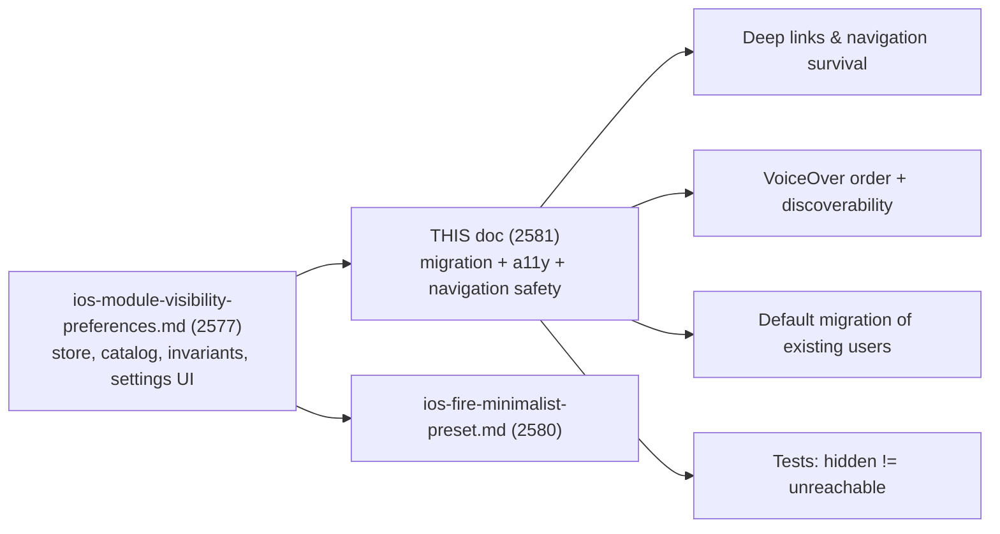
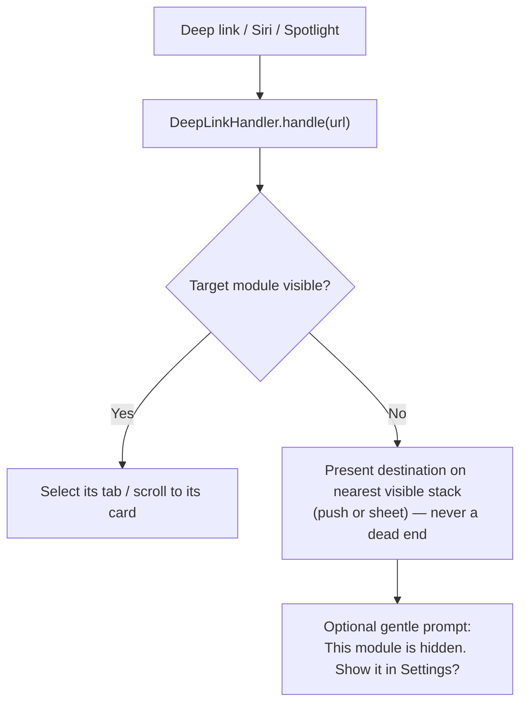

# Accessibility & Migration Plan for iOS Low-Noise Customization — Design

> **Status:** PROPOSED — design only (no native build performed)
> **Issue:** [#2581](https://github.com/jrmoulckers/finance/issues/2581) · Part of [#2122](https://github.com/jrmoulckers/finance/issues/2122)
> **Platform:** iOS / iPadOS · WidgetKit · watchOS (SwiftUI, iOS 17+)
> **Owner:** @native-app-engineer
> **Last updated:** 2026-06-22

This document is the **accessibility and migration plan** that makes the
already-designed module-visibility (low-noise) customization safe to ship:
VoiceOver reading order, discoverability of the controls, how existing users are
**migrated** to the new defaults, and the tests that prove **hiding a module
never breaks navigation, deep links, Siri intents, widgets, or the watch**.

It builds directly on — and does **not** re-specify — the foundational design in
[ios-module-visibility-preferences.md](./ios-module-visibility-preferences.md)
([#2577](https://github.com/jrmoulckers/finance/issues/2577)), which owns the
preference store, the module catalog, the safe invariants, and the settings UI.
**Read that first.** Where they overlap, that doc owns the model; this doc owns
the migration rollout and the accessibility/navigation safety net. The named
preset built on the same store is
[ios-fire-minimalist-preset.md](./ios-fire-minimalist-preset.md), and the
allocation surface that benefits from quieting is
[ios-low-noise-etf-allocation.md](./ios-low-noise-etf-allocation.md).

---

## Table of Contents

1. [Why this matters](#1-why-this-matters)
2. [Scope & relationship to the visibility design](#2-scope--relationship-to-the-visibility-design)
3. [The "hiding never breaks reachability" invariant](#3-the-hiding-never-breaks-reachability-invariant)
4. [Navigation & deep-link survival](#4-navigation--deep-link-survival)
5. [Siri intents, widgets, and the watch](#5-siri-intents-widgets-and-the-watch)
6. [VoiceOver ordering & focus](#6-voiceover-ordering--focus)
7. [Discoverability](#7-discoverability)
8. [Default migration plan](#8-default-migration-plan)
9. [Accessibility — Dynamic Type, Switch Control, Reduce Motion](#9-accessibility--dynamic-type-switch-control-reduce-motion)
10. [Privacy](#10-privacy)
11. [Empty, stale, error & reset states](#11-empty-stale-error--reset-states)
12. [Smallest tests plan](#12-smallest-tests-plan)
13. [Implementation readiness](#13-implementation-readiness)
14. [Open questions](#14-open-questions)
15. [References](#15-references)

---

## 1. Why this matters

Letting people hide tabs, cards, and optional modules is a real
cognitive-accessibility win — less noise, fewer numbers competing for attention
(per [cognitive-accessibility.md](./cognitive-accessibility.md)). But hiding is
**dangerous if it can strand a user**: a hidden tab must not break a deep link to
that screen, a Siri "show my budget" must not dead-end, and VoiceOver must read
the quieter layout in a sensible order. This plan specifies the guardrails and
the migration so the feature quiets the UI **without ever removing access**.

---

## 2. Scope & relationship to the visibility design



**In scope here:** VoiceOver ordering and focus in the quieted UI;
discoverability of the low-noise controls; the migration of existing installs to
the new defaults; and the test matrix proving hidden modules stay reachable.

**Out of scope (owned by [#2577](./ios-module-visibility-preferences.md)):** the
`ModuleVisibilityStore` actor, the `ModuleVisibilityViewModel`, the catalog,
non-hideable invariants, App-Group persistence, and the settings screen
structure. **Also out of scope:** reordering modules, per-household preferences,
and any shared backend schema.

---

## 3. The "hiding never breaks reachability" invariant

The single rule that governs every section below:

> **Hiding quiets _chrome_, never _capability_.** A hidden module's screens stay
> in the navigation graph and remain reachable by deep link, Siri, search, and
> Settings. Hiding changes what is _shown by default_, not what _exists_.

This restates and operationalizes the
[#2577 safe invariants](./ios-module-visibility-preferences.md#3-the-module-catalog--safe-invariants):
Dashboard / Accounts / Transactions tabs always remain, Settings is always
reachable, you cannot hide every dashboard card, and **hiding never deletes
data**. This doc adds the navigation-layer corollaries (§4–§5) and the
accessibility/migration work to uphold them.

---

## 4. Navigation & deep-link survival

The deep-link surface is
[`DeepLinkHandler.swift`](../../apps/ios/Finance/Navigation/DeepLinkHandler.swift),
whose `AppDeepLink` enum already routes `account(id:)`, `transaction(id:)`,
`budgetCategory(id:)`, `quickEntry`, `clipExpense`, and `invite`. A hidden module
must not change resolution:

| Link / entry                              | If the target module is hidden                                                                                  |
| ----------------------------------------- | --------------------------------------------------------------------------------------------------------------- |
| `…/budget/{id}` → `budgetCategory(id:)`   | Resolves and presents the budget detail **even if the Budgets tab is hidden** — push onto a present-able stack. |
| `…/transaction/{id}` → `transaction(id:)` | Always resolves (Transactions is a non-hideable core tab).                                                      |
| `…/account/{id}` → `account(id:)`         | Always resolves (Accounts is a non-hideable core tab).                                                          |
| Quick-entry / clip-expense                | Resolves regardless of dashboard quick-action visibility — the action is a route, not a card.                   |
| Spotlight / Handoff into a hidden module  | Resolves; the destination is presented even though its tab/card is hidden.                                      |

**Mechanism:** because tabs are filtered from `Tab.allCases` at render time
([#2577 §6](./ios-module-visibility-preferences.md#6-applying-visibility-across-surfaces)),
the destination views still exist in the navigation graph. A deep link to a
hidden tab resolves by **presenting the destination on the nearest visible
stack** (e.g., push the budget detail onto the Dashboard's `NavigationStack`, or
present it as a sheet) rather than selecting a non-existent tab.



**Edge rule:** if a deep link is the _only_ way a user reached a hidden module,
offer a non-blocking, dismissible prompt ("This area is hidden — show it again in
Settings?") that links to the visibility screen. The content is **never** blocked
behind that prompt.

---

## 5. Siri intents, widgets, and the watch

Capability extends beyond on-screen chrome:

- **App Intents / Siri** ([`Finance/Intents`](../../apps/ios/Finance/Intents/)):
  `BudgetStatusIntent`, `ShowBalanceIntent`, `GoalProgressIntent`,
  `SpendingSummaryIntent`, etc. continue to answer **even when their module is
  hidden** — "what's my budget?" works with a hidden Budgets tab. Hiding affects
  the app's visual surface, not the Shortcuts/Siri vocabulary. (If a future
  preference should _also_ trim Siri suggestions, that is an explicit, separate
  toggle — never an implicit side effect of hiding a tab.)
- **Widgets** ([`apps/ios/FinanceWidget`](../../apps/ios/FinanceWidget/)): the
  App-Group visibility flags are mirrored by
  [`WidgetDataWriter`](../../apps/ios/Finance/Services/WidgetDataWriter.swift) so a
  widget for a hidden module shows a neutral "Hidden in app" placeholder rather
  than stale data, per
  [#2577 §6](./ios-module-visibility-preferences.md#6-applying-visibility-across-surfaces).
  A user who explicitly adds such a widget keeps it (their choice overrides the
  quiet default).
- **watchOS** ([`apps/ios/FinanceWatch`](../../apps/ios/FinanceWatch/)): the same
  flags reach the watch via
  [`WatchDataSender`](../../apps/ios/Finance/Services/WatchDataSender.swift);
  complications for a hidden module degrade gracefully (placeholder), never crash
  or show stale figures.

---

## 6. VoiceOver ordering & focus

Quieting the UI changes the element tree, so reading order must stay coherent:

- **Reading order matches visual order.** After cards/tabs are filtered, the
  remaining elements must read top-to-bottom, left-to-right with no gaps or
  phantom stops for hidden views. Hidden views are removed from the hierarchy
  (`if visible { … }`), not merely `.opacity(0)` — so VoiceOver never lands on an
  invisible element.
- **No empty headers.** When a section's only content is hidden, its header is
  removed too (e.g., an empty "More" grid hides its label), so VoiceOver does not
  announce an empty group.
- **Focus preservation on toggle.** Toggling visibility in Settings keeps focus
  on the toggle just changed; returning to the Dashboard places focus on the
  first visible heading, not on a now-removed card's old position.
- **Section headers carry `.isHeader`** and the rotor's Headings list reflects
  only visible sections, so rotor navigation stays useful in the quieted layout.
- **Announce material change.** When a module is hidden/shown, post a concise
  live-region announcement ("Reports hidden") via
  [`announceForAccessibility`](../../apps/ios/Finance/Accessibility/AccessibilityModifiers.swift)
  so a VoiceOver user knows the layout changed.
- **The minimised-dashboard prompt is focusable.** If every optional card is
  hidden, the "Your dashboard is minimised — adjust in Settings" prompt
  ([#2577 §3](./ios-module-visibility-preferences.md#3-the-module-catalog--safe-invariants))
  is a real, focusable control linking back to the visibility screen.

---

## 7. Discoverability

A quieting feature is only safe if the user can always find their way back:

- **One stable entry point.** A single "Low-Noise / Modules" `NavigationLink` in
  [`SettingsView`](../../apps/ios/Finance/Screens/SettingsView.swift)'s
  appearance/general area, mirroring the existing `@AppStorage`-backed
  [`AppearanceSettingsView`](../../apps/ios/Finance/Screens/AppearanceSettingsView.swift)
  pattern — no new top-level surface.
- **Settings is non-hideable** (a §3 invariant), so the path back is always
  present.
- **Re-entry from the minimised state.** The minimised-dashboard prompt and the
  optional deep-link prompt (§4) both link straight to the visibility screen.
- **Calm, non-judgemental copy** per
  [content-language-guidelines.md](./content-language-guidelines.md): "Show /
  Hide", "Hidden", never "Disable / Removed".
- **Searchable.** The Settings row label is localized so it surfaces in Settings
  search, and (optionally) an App Shortcut phrase like "show hidden modules" can
  route to it — a discoverability aid, not a requirement.

---

## 8. Default migration plan

How existing installs move onto the feature without surprise:

```mermaid
flowchart TD
    A["App update installed"] --> B{"Stored visibility prefs exist?"}
    B -->|No (existing or new user)| C["Seed defaults = ALL VISIBLE<br/>(safe default, zero behaviour change)"]
    B -->|Yes (re-launch)| D["Load stored flags"]
    C --> E["No screen changes; feature is opt-in via Settings"]
    D --> E
    E --> F{"User opens Low-Noise settings?"}
    F -->|Yes| G["They hide modules; choices persist + mirror to App Group"]
    F -->|No| H["Nothing changes — silent, safe"]
```

Principles:

- **Safe default = everything visible.** First launch after the update seeds the
  store with all modules visible, so **no existing user sees anything disappear**.
  The feature is strictly opt-in.
- **Idempotent, versioned seed.** The seed runs once, keyed by a stored schema
  version, so a re-launch never re-seeds over a user's choices. A future catalog
  addition (a new hideable module) defaults the **new** key to visible while
  preserving existing choices — additive, never destructive.
- **Forward-compatible flags.** Unknown module ids in the persisted map are
  ignored (per the
  [#2577 bridge test](./ios-module-visibility-preferences.md#11-test-plan--smallest-tests-first)),
  so a downgrade/upgrade never corrupts state.
- **Fail safe = show.** Any read/write failure resolves to "visible" so a bug can
  never make a module unreachable (mirrors
  [#2577 §10](./ios-module-visibility-preferences.md#10-empty-stale-error--reset-states)).
- **Reset is reversible.** "Reset to defaults" rewrites flags to all-visible and
  touches **no data**.
- **Cross-surface consistency.** On migration, the App-Group mirror is written so
  widgets/watch agree with the app from first launch — no transient "hidden on
  phone, shown on watch" mismatch.

---

## 9. Accessibility — Dynamic Type, Switch Control, Reduce Motion

- **Dynamic Type:** the settings `Form` and all quieted surfaces scale through
  AX1–AX5; toggle rows and module descriptions **wrap, never truncate**
  ([#2577 §8](./ios-module-visibility-preferences.md#8-dynamic-type)). This reuses
  the AX-size harness from
  [ios-dynamic-type-layout-tests.md](./ios-dynamic-type-layout-tests.md) — the
  minimised dashboard and the settings screen are added to that snapshot set.
- **Switch Control / Full Keyboard Access:** every toggle, the reset button, the
  Settings entry row, and the minimised-dashboard prompt are real focusable
  controls — nothing is gesture-only.
- **Reduce Motion:** hiding/showing a module cross-fades or swaps statically; no
  card "slides away" sweep when `accessibilityReduceMotion` is on.
- **No surprise removal:** hiding a module never silently removes an
  accessibility-relied-upon control elsewhere without the user's explicit action
  on the visibility screen.

---

## 10. Privacy

- **Preferences are non-sensitive UI state** — module on/off flags only, no
  balances, no PII. They live in App-Group `UserDefaults`, **never Keychain**
  (Keychain is reserved for secrets), per
  [#2577 §9](./ios-module-visibility-preferences.md#9-privacy).
- **Privacy-aware logging:** log only `.public` events via `os.Logger` —
  "module hidden", "module shown", "visibility reset", "migration seeded" — by
  module id, never any financial value. Never `print()`.
- **Hiding is not a privacy control.** Hiding a module does not redact its data
  to onlookers; balance hiding remains the separate privacy-mode feature. The
  visibility copy avoids implying otherwise.

---

## 11. Empty, stale, error & reset states

| State                   | Trigger                                  | Behaviour                                                                                                              |
| ----------------------- | ---------------------------------------- | ---------------------------------------------------------------------------------------------------------------------- |
| **First run / migrate** | No stored prefs after update             | Seed all-visible; zero UI change; feature opt-in.                                                                      |
| **All hidden**          | User hides every optional dashboard card | Net-worth hero stays, or the focusable "minimised — adjust in Settings" prompt; never a blank screen.                  |
| **Deep link to hidden** | Link/Siri targets a hidden module        | Destination presented on nearest visible stack; optional non-blocking "show it again?" prompt; content never withheld. |
| **Stale / widget**      | Widget reads cached flags                | Honours last-known visibility; hidden module's widget shows neutral "Hidden in app" placeholder, not stale data.       |
| **Store error**         | App-Group read/write fails               | Fall back to **all visible** (fail safe); log `.public` error; everything stays reachable.                             |
| **Reset**               | "Reset to defaults" confirmed            | All modules visible again; brief non-judgemental confirmation; **no data touched**.                                    |

---

## 12. Smallest tests plan

Smallest/shared first; the navigation-survival tests are the heart of this doc.

### 12.1 Shared (KMP) — verify parity, not re-implemented here

- Reuse the `ModuleVisibilityRulesTest` parity tests from
  [#2577 §11.1](./ios-module-visibility-preferences.md#11-test-plan--smallest-tests-first)
  (catalog, invariants, default-visible). No new shared logic is introduced here;
  any addition would go via **ADR to @native-app-engineer**.

### 12.2 iOS unit (XCTest, `apps/ios/Tests/`)

1. **`MigrationSeedTests`** — first run with no stored prefs seeds all-visible;
   the seed is idempotent (a re-run does not overwrite user choices); a corrupt /
   missing value falls back to defaults; a newly added catalog key defaults
   visible while preserving existing flags.
2. **`DeepLinkVisibilityTests`** — `DeepLinkHandler.handle` resolves
   `budgetCategory(id:)`, `transaction(id:)`, `account(id:)`, and quick-entry to
   the same destination **regardless of visibility flags**; a hidden-tab target
   still yields a presentable route (never `.unknown`, never nil).
3. **`IntentVisibilityTests`** — `BudgetStatusIntent` / `ShowBalanceIntent` /
   `GoalProgressIntent` return their answer with the corresponding module hidden.
4. **`VoiceOrderTests`** (pure where possible) — given a visibility map, the
   computed ordered list of dashboard sections has no gaps and no empty headers;
   the all-hidden case yields the net-worth hero / minimised prompt element.

### 12.3 iOS UI / a11y (`apps/ios/Tests/UITests/`)

5. **`HiddenModuleReachabilityUITests`** — hide "Budgets"; launch a
   `…/budget/{id}` deep link; assert the budget detail is presented and
   focusable; **VoiceOver** reads the quieted Dashboard in visual order with no
   phantom stops; the optional "show again" prompt is reachable; **Reset**
   restores all modules and the hidden module's data is intact.
6. **AX-size snapshot** — the minimised Dashboard and the Low-Noise settings
   screen render at `Large` and `AX5` without truncation, via the
   [layout-test harness](./ios-dynamic-type-layout-tests.md#6-snapshot-harness-at-ax-sizes).

### 12.4 Gate

`node tools/agent-scripts/pre-push-check.js --fix` (lint + strict concurrency)
plus the suites above. `SWIFT_STRICT_CONCURRENCY = complete`: the store is an
`actor`, DTOs `Sendable`, UI state `@MainActor` (per the #2577 model). The
minimum gate: `MigrationSeedTests` + `DeepLinkVisibilityTests` green (migration
is safe **and** hidden modules stay reachable).

---

## 13. Implementation readiness

See [`docs/ops/human-gated-prerequisites.md`](../ops/human-gated-prerequisites.md)
(§2 — implementation vs. distribution decoupling).

**Buildable now (no human gate):**

- The migration seed, deep-link/intent survival, VoiceOver ordering, and all
  unit/UI tests are implementable today on the iOS Simulator and a personal
  device using **free Personal Team** signing. The feature is local preferences +
  navigation routing — no paid enrollment, no entitlements required.

**Gated by [#1239](https://github.com/jrmoulckers/finance/issues/1239):**

- Only TestFlight / App Store distribution of the migrated build and any paid
  physical-device matrix sit behind enrollment. Migration and accessibility work
  need none of these. (Universal Links via Associated Domains is a separate
  entitlement noted in the prerequisites runbook; in-app `AppDeepLink` routing —
  what this plan tests — works locally without it.)

No human-gated operation is required to implement or verify this plan.

---

## 14. Open questions

- **Should hiding optionally trim Siri suggestions?** Default: **no** — hiding is
  visual only. A separate explicit toggle could trim suggestions later; tracked,
  not assumed.
- **Preference sync across devices?** v1 is local + App Group; a "sync my layout"
  capability is a separate shared-schema decision via ADR, not assumed here.
- **Onboarding nudge?** Whether to surface the low-noise option during onboarding
  vs. discovery-only in Settings — deferred to UX, default is discovery-only to
  avoid adding onboarding noise.

---

## 15. References

- Foundation: [iOS Module Visibility Preferences / Low-Noise Mode (#2577)](./ios-module-visibility-preferences.md)
  — the store, catalog, invariants, and settings UI this plan migrates and hardens.
- Built on the same store: [iOS FIRE Minimalist Preset (#2580)](./ios-fire-minimalist-preset.md)
  · [iOS Low-Noise ETF Allocation Views](./ios-low-noise-etf-allocation.md)
- Accessibility companions: [AX-Size Layout Tests (#2550)](./ios-dynamic-type-layout-tests.md)
  · [Dynamic Type Reflow Audit (#2548)](./ios-dynamic-type-reflow-audit.md)
- Cross-platform: [Accessibility Patterns Library](./accessibility-patterns.md)
  · [Cognitive Accessibility Mode](./cognitive-accessibility.md)
  · [Information Architecture](./information-architecture.md)
  · [UX Principles](./ux-principles.md) · [Content & Language Guidelines](./content-language-guidelines.md)
- Repo surfaces: [`DeepLinkHandler.swift`](../../apps/ios/Finance/Navigation/DeepLinkHandler.swift)
  · [`MainTabView.swift`](../../apps/ios/Finance/Navigation/MainTabView.swift)
  · [`SettingsView.swift`](../../apps/ios/Finance/Screens/SettingsView.swift)
  · [`WidgetDataWriter.swift`](../../apps/ios/Finance/Services/WidgetDataWriter.swift)
  · [`WatchDataSender.swift`](../../apps/ios/Finance/Services/WatchDataSender.swift)
  · [`Finance/Intents`](../../apps/ios/Finance/Intents/)
- Standards: Apple HIG — Navigation, Accessibility · WCAG 2.2 — 2.4.3 Focus Order, 3.2.3 Consistent Navigation
