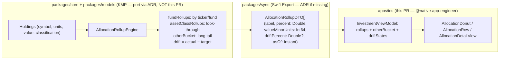

# iOS Low-Noise ETF Allocation Views

> Design specification for **ETF-level rollups**, **calm allocation summaries**, and
> **chart + text-alternative parity** tuned for the passive index-fund investor who
> wants "am I still diversified the way I intended?" answered at a glance — without
> ticker noise, day-trader colour, or false precision.

**Status:** PROPOSED — design only (native implementation gated, see
[Implementation readiness](#12-implementation-readiness))
**Issue:** [#2572](https://github.com/jrmoulckers/finance/issues/2572) — _Part of
[#2118](https://github.com/jrmoulckers/finance/issues/2118)_
**Platform:** iOS / iPadOS (SwiftUI · Swift Charts · Swift Concurrency, iOS 17+)
**Owner:** @native-app-engineer
**Last updated:** 2026-06-22
**Related design docs:** [data-visualization.md](./data-visualization.md) ·
[chart-component-specs.md](./chart-component-specs.md) ·
[accessibility-patterns.md](./accessibility-patterns.md) ·
[cognitive-accessibility.md](./cognitive-accessibility.md) ·
[ux-principles.md](./ux-principles.md) ·
[content-language-guidelines.md](./content-language-guidelines.md)
**Sibling design docs:**
[ios-investment-chart-text-alternatives.md](./ios-investment-chart-text-alternatives.md) ·
[ios-chart-summaries-data-tables.md](./ios-chart-summaries-data-tables.md) ·
[ios-noncolor-financial-state-cues.md](./ios-noncolor-financial-state-cues.md) ·
[ios-portfolio-metrics-projections.md](./ios-portfolio-metrics-projections.md)
**Depends on (shared data):**
[ios-investment-data-kmp-design.md](./ios-investment-data-kmp-design.md)

---

## Table of Contents

1. [Problem & Goal](#1-problem--goal)
2. [Affected iOS Surfaces](#2-affected-ios-surfaces)
3. [Shared Dependencies & the iOS / KMP Boundary](#3-shared-dependencies--the-ios--kmp-boundary)
4. [The Low-Noise Allocation Surface](#4-the-low-noise-allocation-surface)
5. [Chart & Text-Alternative Parity](#5-chart--text-alternative-parity)
6. [Accuracy & Estimate Labelling](#6-accuracy--estimate-labelling)
7. [Accessibility](#7-accessibility)
8. [Dynamic Type](#8-dynamic-type)
9. [Privacy & Balance Hiding](#9-privacy--balance-hiding)
10. [Empty, Stale & Error States](#10-empty-stale--error-states)
11. [Test Plan](#11-test-plan)
12. [Implementation readiness](#12-implementation-readiness)
13. [Open Questions](#13-open-questions)

---

## 1. Problem & Goal

The persona of [#2118](https://github.com/jrmoulckers/finance/issues/2118) holds a
handful of broad ETFs (e.g. VTI, VXUS, BND) and checks in **rarely and calmly**.
Today, [`InvestmentPortfolioView.swift`](../../apps/ios/Finance/Screens/InvestmentPortfolioView.swift)
already renders an asset-class allocation list (using `AssetClassUI` from
[`InvestmentModels.swift`](../../apps/ios/Finance/Models/InvestmentModels.swift)) and a
holdings list, but it is **holding-centric**: each row is one position, and there is no
**fund-level rollup** ("how much is in VTI vs everything else?") nor a **calm summary**
of whether the mix still matches the investor's intent.

**Goal:** specify a **low-noise allocation surface** that:

1. **Rolls holdings up to ETFs/funds**, then to **asset classes** (look-through),
   collapsing the long tail into an explicit **"Other"** bucket so the screen never
   shows more than ~5–7 items — the density limit from
   [ux-principles.md §1](./ux-principles.md).
2. Shows an optional, **non-judgemental drift readout** — _actual vs. the investor's
   target mix_ — framed as information, never as "you are doing it wrong".
3. Provides a **chart and an equivalent text/table alternative** so the meaning is
   identical for VoiceOver, Dynamic Type, and reduced-motion users.

**Non-goals:** trade execution, rebalancing actions/orders, real-time quotes, advice or
recommendations, and any new shared schema (look-through math is described, not
implemented, and lands in `packages/core` via ADR).

---

## 2. Affected iOS Surfaces

All under `apps/ios/` (owned by @native-app-engineer).

| Surface                                                                                                 | Change                                                                                                              |
| ------------------------------------------------------------------------------------------------------- | ------------------------------------------------------------------------------------------------------------------- |
| [`Screens/InvestmentPortfolioView.swift`](../../apps/ios/Finance/Screens/InvestmentPortfolioView.swift) | **Modify (light):** replace the flat allocation list with the new low-noise section; keep summary/perf/holdings.    |
| `Screens/AllocationDetailView.swift` **(new)**                                                          | "Details on demand" screen: full breakdown, target-vs-actual table, the chart's data table, and "as of" provenance. |
| `Components/AllocationDonut.swift` **(new)**                                                            | Calm donut/ring chart (Swift Charts) with center label, top-N + "Other", CVD-safe palette, reduced-motion static.   |
| `Components/AllocationRow.swift` **(new)**                                                              | One rollup row: label + percent + thin bar + non-colour drift glyph; combined VoiceOver label.                      |
| [`ViewModels/InvestmentViewModel.swift`](../../apps/ios/Finance/ViewModels/InvestmentViewModel.swift)   | **Modify:** expose `rollups`, `otherBucket`, and `driftStates` derived from shared DTOs (render-only, no math).     |
| [`Models/InvestmentModels.swift`](../../apps/ios/Finance/Models/InvestmentModels.swift)                 | **Modify:** add UI rollup view-types (`AllocationRollupUI`) mirroring shared DTOs; reuse `AssetClassUI` palette.    |
| `Resources/*.lproj/Localizable.strings`                                                                 | **Modify:** new localized strings (titles, "Other", drift copy, estimate/disclaimer, masks). No hardcoded strings.  |

Existing building blocks reused as-is:
[`CurrencyLabel`](../../apps/ios/Finance/Components/CurrencyLabel.swift),
[`EmptyStateView`](../../apps/ios/Finance/Components/EmptyStateView.swift),
[`ErrorStateView`](../../apps/ios/Finance/Components/ErrorStateView.swift),
[`OfflineBanner`](../../apps/ios/Finance/Components/OfflineBanner.swift),
[`ProgressRing`](../../apps/ios/Finance/Components/ProgressRing.swift), and the
`ChartColorPalette` already used by the portfolio chart.

---

## 3. Shared Dependencies & the iOS / KMP Boundary

Per the repo rule, **allocation math is platform-neutral and lives in KMP**; iOS only
renders. This design **describes** the boundary and does **not** implement shared code.

**Responsibilities**

| Concern                                                                            | Layer                                 |
| ---------------------------------------------------------------------------------- | ------------------------------------- |
| Roll holdings → funds → asset classes (look-through), long-tail "Other" threshold  | `packages/core` (shared)              |
| Target mix storage and `drift = actual − target`                                   | `packages/core` / `packages/models`   |
| Type mapping (`Cents`→`Int64`, %→`Double`, `Instant`→`Date`)                       | Swift Export bridge (`packages/sync`) |
| Donut/ring layout, palette, top-N selection, "Other" grouping for display          | iOS                                   |
| Drift glyph + non-colour cue, estimate copy, VoiceOver text, Dynamic Type, privacy | iOS                                   |

- **iOS renders, it does not compute.** Percentages, the "Other" bucket contents, and
  drift values arrive as DTOs; iOS chooses how many slices to show before grouping, but
  never re-derives the numbers.
- **No shared schema change here.** Target-mix persistence and look-through are described
  for `@native-app-engineer` to land via ADR; the canonical reference data shape is documented
  in [ios-investment-data-kmp-design.md](./ios-investment-data-kmp-design.md). Until then
  iOS binds to the existing `StubSwiftExportBridge` so the surface is buildable now.

---

## 4. The Low-Noise Allocation Surface

Two-level disclosure (simple → details on demand), per
[information-architecture.md](./information-architecture.md):

**Level 1 — the calm summary (in `InvestmentPortfolioView`):**

- A **donut/ring** with a **center label** = "N funds" or the largest slice's name, and
  **top 5 slices + "Other"** beneath it as `AllocationRow`s (label · percent · thin bar).
- A single **"In line with your plan"** / **"Drifting from your plan"** status line when a
  target mix exists — plain language, never red-on-failure. If no target is set, the drift
  line is simply absent (no nagging).
- A **"View allocation details"** row → `AllocationDetailView`.

**Level 2 — `AllocationDetailView` (details on demand):**

- The **full rollup** (every fund + every asset class), the **target-vs-actual table**
  (Holding/Class · Target % · Actual % · Drift), and the **chart's data table** (§5).
- An **"as of {relative time}"** provenance line and the estimate/disclaimer block (§6).

Defaults are deliberately quiet: **whole-percent figures** by default, no flashing,
no per-second updates, no green/red profit framing — allocation is about _shape_, not
_score_. This matches the "one hero number per screen, density is the enemy" guidance of
[ux-principles.md](./ux-principles.md).

---

## 5. Chart & Text-Alternative Parity

The donut is **decorative-plus**: every fact it conveys must be available without it,
mirroring [ios-investment-chart-text-alternatives.md](./ios-investment-chart-text-alternatives.md)
and [ios-chart-summaries-data-tables.md](./ios-chart-summaries-data-tables.md).

- **Colour is never the only encoding.** Each slice/row carries an **SF Symbol + text
  label + percent**; the palette is the existing **CVD-safe `ChartColorPalette`**
  (IBM-derived) from [data-visualization.md §2](./data-visualization.md). Drift direction
  uses a **glyph** (`arrow.up`/`arrow.down`/`checkmark`) + text, per
  [ios-noncolor-financial-state-cues.md](./ios-noncolor-financial-state-cues.md) — not hue.
- **The donut is one combined accessibility element** with a summary label (§7); the
  **`AllocationRow` list IS the per-slice text alternative**, so VoiceOver users navigate
  the same data the chart shows.
- **A data table** (`Target % · Actual % · Drift`) lives in `AllocationDetailView` for
  exact figures, sortable, fully VoiceOver-navigable.
- **Reduce Motion:** the donut renders in its final state with **no sweep/spin animation**;
  it uses `.drawingGroup()` like the existing performance chart but gates any transition on
  `@Environment(\.accessibilityReduceMotion)`, per [animation-library.md](./animation-library.md).
- **Contrast:** labels and figures meet **≥ 4.5:1** in light, dark
  ([oled-dark-mode.md](./oled-dark-mode.md)), and high-contrast modes.

---

## 6. Accuracy & Estimate Labelling

Allocation views can quietly imply precision they don't have; this surface is explicit:

- **Percentages are derived, mark provenance, not promises.** Show **"as of {relative
  time}"** wherever a percentage or drift appears; when values are stale/offline, say so
  (§10) rather than implying live accuracy.
- **Drift is information, not a verdict.** Copy is "3% above your bond target", never
  "you failed to rebalance" — non-judgemental framing per
  [content-language-guidelines.md](./content-language-guidelines.md) and
  [ux-principles.md §3](./ux-principles.md).
- **No advice, no actions.** The surface never says "you should buy/sell"; there are no
  order buttons. A persistent, selectable caption reads: _"Allocation percentages are
  estimates based on your latest holdings data, not financial advice."_
- **Look-through is labelled.** Where a fund is decomposed into asset classes via shared
  reference data, the detail view notes "based on fund composition data" so the investor
  knows the class split is **modelled**, not a direct holding.

---

## 7. Accessibility

Patterns follow [accessibility-patterns.md](./accessibility-patterns.md) and the existing
allocation rows in `InvestmentPortfolioView`.

- **Combined, meaningful labels.** Each `AllocationRow` is
  `.accessibilityElement(children: .combine)` →
  _"US Total Market, 62 percent of portfolio, 2 percent above target."_ The donut exposes a
  single summary value: _"Allocation: 5 holdings shown, largest US Total Market at 62
  percent, remainder grouped as Other."_
- **Headers & order.** "Allocation" is `.accessibilityAddTraits(.isHeader)`; reading order
  is summary → rows → "View details", matching visual order.
- **Switch Control / Full Keyboard Access / VoiceOver rotor.** The "View allocation
  details" row, each rollup row, and table cells are **real focusable controls** with
  labels and hints; nothing is gesture-only. Detail-view chart navigation follows
  [ios-chart-voiceover-navigation.md](./ios-chart-voiceover-navigation.md).
- **Estimate words are spoken.** "estimate", "as of", "above/below target" are part of the
  label text, so the not-advice framing is never visual-only.

---

## 8. Dynamic Type

- **No hardcoded font sizes.** Row labels `.subheadline`, percentages reuse `.subheadline`
  / `CurrencyLabel`, captions `.caption`. All scale through AX1–AX5.
- **Reflow over truncation.** At `accessibility1`+ the donut shrinks and the rows stack as
  full-width label-over-value; the target-vs-actual **table becomes a stacked list** rather
  than a horizontally-scrolling grid. Verified at AX5 in [§11](#11-test-plan).
- **"Other" stays meaningful at large sizes** — its row always shows count and combined
  percent so collapsing the tail never hides scale.

---

## 9. Privacy & Balance Hiding

- **Percentages are not balances.** When balance-hiding is active, **monetary values**
  (per-slice dollar amounts in the detail view) are masked ("•••••"); **percentages, drift,
  and labels remain visible** because they reveal no balance — consistent with
  [ios-portfolio-metrics-projections.md §11](./ios-portfolio-metrics-projections.md).
- **Accessibility parity:** masked amounts read as "hidden" to VoiceOver; never speak a
  hidden balance. App-switcher snapshot redaction is inherited (no exemption).
- **Logging is privacy-aware.** Holdings, tickers, and amounts are `.private` and never
  logged. Log only `.public` events via `os.Logger` — "allocation viewed",
  "allocation details opened" — counts/flags, never a holding or amount. Never `print()`.

---

## 10. Empty, Stale & Error States

| State         | Trigger                              | Presentation                                                                                                                                          |
| ------------- | ------------------------------------ | ----------------------------------------------------------------------------------------------------------------------------------------------------- |
| **Loading**   | Rollups not yet derived              | Donut + rows show skeletons with titles visible; static under Reduce Motion. `.accessibilityLabel("Loading allocation")`.                             |
| **Empty**     | No investment holdings               | Reuse `EmptyStateView` ("Add investment accounts to see your allocation") — same as today's portfolio empty state. No fabricated slices.              |
| **No target** | Holdings exist, no target mix set    | Show actual allocation only; **omit** the drift line; offer a calm "Set a target mix" affordance (optional, never required).                          |
| **Stale**     | Derived from cached/offline holdings | Render with an "as of {relative time}" caption; show [`OfflineBanner`](../../apps/ios/Finance/Components/OfflineBanner.swift) when offline.           |
| **Error**     | Rollup/bridge failure                | Section-scoped [`ErrorStateView`](../../apps/ios/Finance/Components/ErrorStateView.swift) + Retry; summary/perf/holdings stay usable. Logs `.public`. |

- **Stale is first-class, not an error** (local-first) — old percentages with an "as of"
  stamp are correct, not broken.
- **Errors are section-scoped** — a failed rollup never blanks the whole investments screen.
- **Empty is a prompt, not a blank** — it points to the one missing thing (an account).

---

## 11. Test Plan — Smallest Tests First

### 11.1 Shared (KMP) — verify/port parity, not re-implemented here

- `AllocationRollupEngineTest` (KMP, **@native-app-engineer via ADR**): fund rollup sums to 100%,
  long tail collapses into "Other" at the threshold, look-through class split is correct,
  `drift = actual − target` (incl. no-target → null), and empty holdings → empty result.

### 11.2 Bridge

- `SwiftExportBridgeTests`: `AllocationRollupDTO` round-trips `label`, `percent`,
  `valueMinorUnits` (Int64), optional `driftPercent`, and `asOf`; ordering is stable.

### 11.3 iOS unit (XCTest, `apps/ios/Tests/`)

1. **`AllocationViewModelTests`** — DTOs → `rollups` map 1:1; top-N + "Other" grouping is
   correct and `Other.percent` equals the sum of the tail; `driftStates` classify
   above/at/below target; no-target hides the drift line.
2. **`AllocationRowA11yTests`** — combined labels include label + percent + drift words;
   masked (privacy) labels contain no amount; drift uses glyph + text (no colour-only).

### 11.4 iOS UI / a11y (`apps/ios/Tests/UITests/`)

3. **`AllocationUITests`** — donut + rows render; "View allocation details" reaches the
   table; **VoiceOver** reads the summary then per-slice rows; **Dynamic Type** at AX5
   reflows (table → stacked list, untruncated); **Privacy** masks amounts but not
   percentages; **Reduce Motion** renders the donut with no sweep animation.

### 11.5 Gate

`node tools/agent-scripts/pre-push-check.js --fix` (lint + strict concurrency) plus the
suites above. `SWIFT_STRICT_CONCURRENCY = complete`: DTOs/rollup view-types `Sendable`, UI
state `@MainActor`.

---

## 12. Implementation readiness

Per the [Human-Gated Prerequisites runbook](../ops/human-gated-prerequisites.md) (§2),
Apple Developer enrollment
[#1239](https://github.com/jrmoulckers/finance/issues/1239) gates **distribution only** —
not implementation. This design and its iOS code are **buildable and testable now**.

### Buildable now (no enrollment, no secrets)

- ✅ **This design doc** — fully unblocked.
- ✅ `AllocationDonut`, `AllocationRow`, `AllocationDetailView`, and the
  `InvestmentViewModel`/`InvestmentModels` additions — SwiftUI + `@Observable` + Swift
  concurrency, reusing `CurrencyLabel` / `EmptyStateView` / `ErrorStateView` /
  `OfflineBanner` / `ChartColorPalette`.
- ✅ All unit + UI/a11y tests in [§11](#11-test-plan) in the iOS Simulator.
- ✅ On-device verification via **free Personal Team signing** (free Apple ID): 7-day
  expiry, ≤ 3 apps/device, no TestFlight/push — sufficient to verify this surface. See
  [ios-setup.md](../guides/ios-setup.md).
- ✅ Against the `StubSwiftExportBridge` allocation fixtures, the entire surface is
  developable **before** the Kotlin rollup engine lands.

### Distribution tail — gated by #1239 (human, not this PR)

- 🔒 App Store / TestFlight builds, release signing, App Store Connect API key, and CI
  release secrets are **human-gated** (runbook
  [§3.2](../ops/human-gated-prerequisites.md#32-ios-distribution--apple-developer-1239))
  and out of scope here.

### Dependency note (process gate, not human-gated)

The `AllocationRollupEngine`, look-through reference data, and target-mix persistence must
land in `packages/core` / `packages/models` and be re-exported via `packages/sync` —
**@native-app-engineer via ADR**, not this iOS PR. Until then the surface binds to the stub bridge.

### Needs Human Action

- None for design **or** iOS implementation up to the distribution boundary. Only
  TestFlight/App Store shipping is human-gated ([#1239](https://github.com/jrmoulckers/finance/issues/1239)).

---

## 13. Open Questions

1. **"Other" threshold:** group below a fixed percent (e.g. < 5%) vs. always show top-5 +
   Other? (Proposed: top-5 + Other, capped at the 5–7 density limit.)
2. **Target mix source:** user-entered per asset class vs. per fund vs. a chosen model
   portfolio template? (Affects the `packages/models` shape — ADR.)
3. **Look-through depth:** classify at fund level only, or decompose multi-asset funds into
   underlying classes in v1? (Proposed: asset-class look-through, clearly labelled as
   modelled.)
4. **Donut vs. stacked bar** as the default Level-1 visual for low-noise users? (Defer to a
   quick a11y/legibility comparison at AX sizes.)
