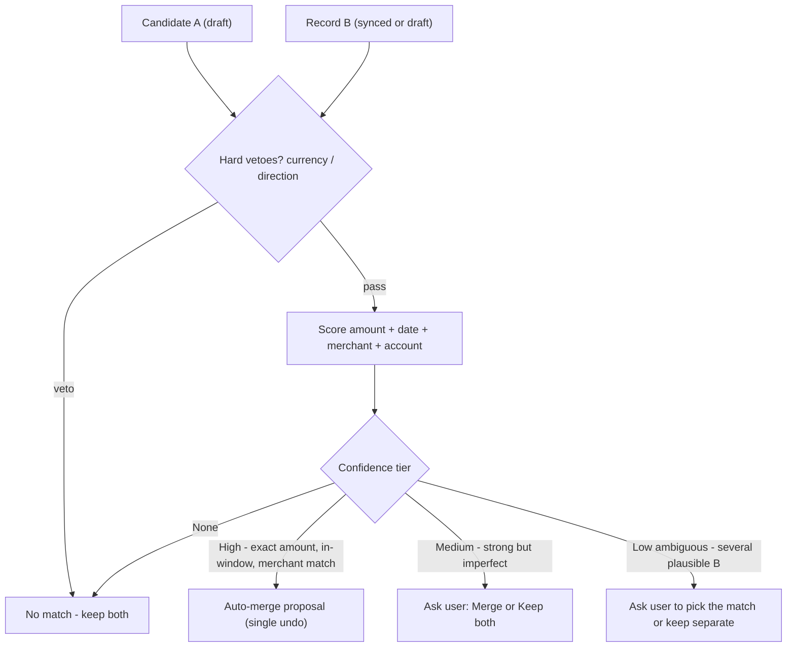
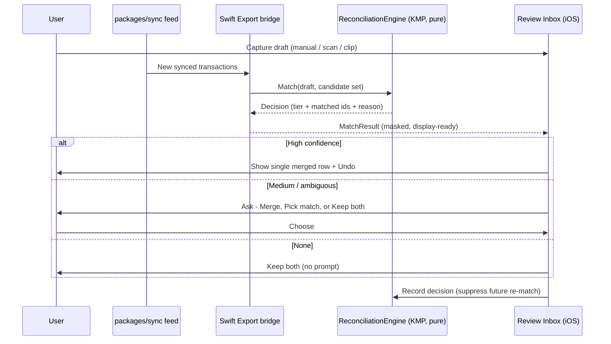
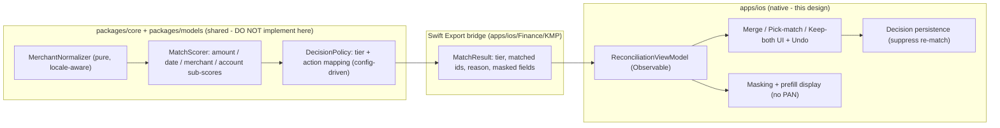

# Merchant Matching & Duplicate Detection — iOS

> Design for the **reconciliation rules** that stop a user-captured,
> "Apple Pay–adjacent" draft from becoming a **duplicate** of the same purchase
> once it arrives through connected-account bank/card sync. The business rules —
> merchant normalization, amount/date matching, confidence scoring, and the
> merge/keep/ask decision — are **deterministic** and conceptually shared in KMP
> `packages/core`; the native layer owns prefill display, masking, the merge UI,
> and accessibility. Everything runs **on-device**; no Apple Pay/Wallet
> transaction stream is read (it is not exposed — see
> [ios-passkit-wallet-constraints.md](./ios-passkit-wallet-constraints.md)).

**Status:** PROPOSED — design only (native implementation buildable now; store distribution gated)
**Issue:** [#2605](https://github.com/jrmoulckers/finance/issues/2605) — Part of [#2171](https://github.com/jrmoulckers/finance/issues/2171)
**Platform:** iOS / iPadOS / macOS (SwiftUI, `@Observable`, iOS 17+)
**Owner:** @native-app-engineer
**Related:** [ios-wallet-adjacent-capture-inbox.md](./ios-wallet-adjacent-capture-inbox.md) · [ios-passkit-wallet-constraints.md](./ios-passkit-wallet-constraints.md) · [ios-one-thumb-quick-add.md](./ios-one-thumb-quick-add.md) · [ios-noncolor-financial-state-cues.md](./ios-noncolor-financial-state-cues.md) · [accessibility-patterns.md](./accessibility-patterns.md) · [cognitive-accessibility.md](./cognitive-accessibility.md) · [content-language-guidelines.md](./content-language-guidelines.md) · [data-model.md](./data-model.md) · [Human-Gated Prerequisites](../ops/human-gated-prerequisites.md)

---

## Table of Contents

1. [Goal & Scope](#1-goal--scope)
2. [The Duplicate Problem](#2-the-duplicate-problem)
3. [Matching Rules](#3-matching-rules)
4. [Merchant Normalization](#4-merchant-normalization)
5. [Confidence Scoring & the Decision](#5-confidence-scoring--the-decision)
6. [Reconciliation Flow](#6-reconciliation-flow)
7. [Native ↔ KMP Boundary](#7-native--kmp-boundary)
8. [Affected iOS Surfaces & Shared Dependencies](#8-affected-ios-surfaces--shared-dependencies)
9. [Accessibility & Dynamic Type](#9-accessibility--dynamic-type)
10. [Privacy & Security](#10-privacy--security)
11. [Duplicate, Ambiguous, Stale, Error & Empty States](#11-duplicate-ambiguous-stale-error--empty-states)
12. [Test Plan (Smallest Tests First)](#12-test-plan-smallest-tests-first)
13. [Implementation Readiness](#13-implementation-readiness)
14. [Open Questions](#14-open-questions)

---

## 1. Goal & Scope

A user taps to pay for coffee, captures it manually (or via a receipt scan / the
App Clip quick-add), and two days later the **same** charge lands through
bank/card sync. Without reconciliation the user now sees **two** coffees and
their budget is wrong. This design defines the rules that recognize the two
records as the **same purchase** and resolve them into one, while never
**silently** merging records that are merely similar.

**In scope**

- The **matching predicate**: when is candidate _C_ "the same purchase" as
  synced transaction _S_ (or another draft)?
- **Merchant normalization** so "SQ \*BLUE BOTTLE 0123" and "Blue Bottle Coffee"
  compare as equal.
- **Confidence scoring** and the **merge / link / keep-both / ask** decision.
- The **ambiguous** case (one candidate, several plausible matches) and how it
  surfaces to the user instead of guessing.

**Out of scope (cross-referenced, not redefined here)**

- The capture sources and the review-inbox surface that consumes these decisions
  — [ios-wallet-adjacent-capture-inbox.md](./ios-wallet-adjacent-capture-inbox.md).
- Why Apple Pay/Wallet history is unavailable and what we may use instead —
  [ios-passkit-wallet-constraints.md](./ios-passkit-wallet-constraints.md).
- Implementing the KMP rule engine (owned by `@native-app-engineer`; this is a design).

---

## 2. The Duplicate Problem

Three record kinds can describe one real-world purchase, and any pair of them can
collide:

| Record kind                | Origin                                                      | Timing             | Fidelity                                       |
| -------------------------- | ----------------------------------------------------------- | ------------------ | ---------------------------------------------- |
| **User draft**             | Manual quick-add, receipt/share capture, App Clip queue     | At purchase time   | Exact amount, fuzzy merchant, user category    |
| **Synced transaction**     | Bank/card aggregation via `packages/sync`                   | Hours to days late | Authoritative amount, processor-noisy merchant |
| **Pending → posted shift** | A synced **pending** auth later **posts** (amount may tilt) | Days               | Amount can change by tax/tip; date can shift   |

Reconciliation must handle: draft↔synced (the headline case), draft↔draft (two
captures of one purchase), and synced-pending↔synced-posted (the same feed
maturing). The same predicate serves all three.

---

## 3. Matching Rules

A pair `(A, B)` is evaluated by independent, deterministic **dimensions**. Each
yields a sub-score in `[0, 1]`; the engine combines them (§5). All thresholds are
**configuration**, not magic numbers in code, so they can be tuned and tested.

| Dimension     | Rule                                                                                                                    | Notes                                                                      |
| ------------- | ----------------------------------------------------------------------------------------------------------------------- | -------------------------------------------------------------------------- |
| **Amount**    | Equal at minor-unit precision → full score. Within a tolerance band (absolute floor **or** small percentage) → partial. | Band covers tip/tax on a pending→posted shift; tolerance is per-currency.  |
| **Date/time** | Within a primary window (hours) → full; within an extended window (a few days) → decaying partial; beyond → zero.       | Settlement lag means a wide-but-decaying window, not a hard equality.      |
| **Merchant**  | Compare **normalized** names (§4) by token-set similarity; exact normalized equality → full.                            | Most signal but also most noise; never the sole basis for an auto-merge.   |
| **Currency**  | Must be equal. Mismatch is a **hard veto** (score → 0 regardless of others).                                            | A 5.00 USD and 5.00 EUR draft are not the same purchase.                   |
| **Account**   | Same account/card → boost; different known accounts → strong penalty; unknown (draft has no account) → neutral.         | Drafts often lack an account until accepted, so unknown must not penalize. |
| **Direction** | Debit vs. credit must match.                                                                                            | A refund is not a duplicate of the purchase.                               |

Two **hard vetoes** (currency mismatch, direction mismatch) short-circuit to "no
match" before scoring — cheap and prevents nonsensical merges.

---

## 4. Merchant Normalization

Raw descriptors are hostile: `"SQ *BLUE BOTTLE 0123 OAKLAND CA"`,
`"TST* Blue Bottle"`, `"BLUEBOTTLE.COM 800-..."`. Normalization is a pure,
ordered pipeline producing a stable **canonical token set**:

1. **Upper-case + Unicode fold** (diacritics, full-width forms).
2. **Strip processor prefixes/suffixes** — `SQ *`, `TST*`, `PAYPAL *`, `POS`,
   trailing store numbers, phone numbers, URLs, city/state tails.
3. **Drop noise tokens** — punctuation, standalone digit runs, common location
   words, generic suffixes (`INC`, `LLC`, `COM`).
4. **Tokenize + sort** into a set; similarity is token-set overlap (e.g.
   Jaccard / weighted token ratio), which is robust to word order and trailing
   junk.

The pipeline is **deterministic and locale-aware** and lives with the matching
rules in KMP so iOS, and later other platforms, normalize identically. It is
**display-neutral**: normalization is only for comparison — the UI always shows
the user-facing masked merchant, never the stripped token set.

---

## 5. Confidence Scoring & the Decision

Sub-scores combine into one **confidence**, mapped to a four-way decision. The
mapping is intentionally conservative: the system **auto-merges only when it is
nearly certain**, and **asks** rather than guesses in the middle.

| Tier                | Meaning                                                      | Default action                                 |
| ------------------- | ------------------------------------------------------------ | ---------------------------------------------- |
| **High**            | Exact amount + in primary window + normalized merchant match | Propose **merge** (still reversible, one undo) |
| **Medium**          | One dimension imperfect (e.g. amount within tip band)        | **Ask**: Merge or Keep both                    |
| **Low / ambiguous** | Multiple candidate matches, or merchant-only similarity      | **Ask** which match (or none)                  |
| **None**            | Below floor or vetoed                                        | **Keep both** (no prompt)                      |

**Merge semantics:** a merge keeps the **authoritative synced** record's amount,
date, and account where they exist, and **preserves the user's draft category /
note** (the human signal), recording a link so the pair never re-matches. The
inbox ([ios-wallet-adjacent-capture-inbox.md](./ios-wallet-adjacent-capture-inbox.md))
renders this as a single **Merge** affordance with a one-tap undo.

---

## 6. Reconciliation Flow

The engine is **stateless and pure** per call; the iOS side holds the candidate
set, persists the user's decision, and feeds it back so an accepted "Keep both"
is not re-proposed.

---

## 7. Native ↔ KMP Boundary

- **Shared (KMP):** normalization, scoring, and the decision policy are
  platform-neutral, deterministic business rules — they belong in
  `packages/core` so every client reconciles identically. **This doc does not
  implement them**; landing them is an ADR conversation with `@native-app-engineer` /
  `@architect`.
- **Native (iOS):** the `@Observable` view model, the merge/ask/undo SwiftUI,
  masking and prefill display, accessibility semantics, and persistence of the
  user's decision.
- **Bridge:** Kotlin types map per the Swift Export contract (`Int` → `Int32`,
  `String` → `String`, sealed `Decision` → enum). The bridge returns
  **display-ready, masked** results; raw descriptors never cross into UI.

---

## 8. Affected iOS Surfaces & Shared Dependencies

**New (native):**

- `apps/ios/Finance/Features/Reconciliation/ReconciliationViewModel.swift` —
  drives match proposals for the review inbox.
- `apps/ios/Finance/Features/Reconciliation/MergeDecisionView.swift` — the
  Merge / Pick-match / Keep-both affordance + undo.

**Touched (additively):**

- The **Review Inbox** rows gain a **Merge** action and an **ambiguous → pick**
  sheet (UI owned by
  [ios-wallet-adjacent-capture-inbox.md](./ios-wallet-adjacent-capture-inbox.md)).
- The one-thumb quick-add flow
  ([ios-one-thumb-quick-add.md](./ios-one-thumb-quick-add.md)) hands new drafts
  to reconciliation before commit.

**Reused unchanged:** `TransactionValidator`, `CategorizationEngine`, the App
Group `ClipTransaction` pending queue, and the `packages/sync` feed.

**Shared dependency:** the proposed `ReconciliationEngine` (normalizer + scorer +
policy) in KMP `packages/core` via the Swift Export bridge ([§7](#7-native--kmp-boundary)).

---

## 9. Accessibility & Dynamic Type

- **Decisions are non-color.** A proposed merge, an ambiguous prompt, and a
  kept-separate pair each carry a **word + SF Symbol + shape** cue, reusing
  [ios-noncolor-financial-state-cues.md](./ios-noncolor-financial-state-cues.md).
  VoiceOver reads "Likely duplicate of Blue Bottle, 4 dollars 50, June 18" — not
  "yellow badge".
- **Plain-language reasons.** Each proposal states _why_ ("same amount and
  merchant within two days") per
  [content-language-guidelines.md](./content-language-guidelines.md) and
  [cognitive-accessibility.md](./cognitive-accessibility.md) — no jargon, no
  confidence percentages shouted at the user.
- **Switch Control / keyboard.** Merge, Pick-match, and Keep-both are
  `.accessibilityAction`s, not swipe-only; focus order is reason → matched record
  → actions.
- **Dynamic Type.** All reason text and the compare rows scale to AX5; the
  side-by-side compare reflows to a stacked layout rather than truncating amount
  or merchant. Targets stay ≥ 44×44 pt.
- **Reduce Motion.** Merge collapses two rows with a cross-fade, not a slide;
  undo restores without a cascade.

---

## 10. Privacy & Security

- **On-device only.** Normalization, scoring, and the decision run locally; no
  candidate, descriptor, or amount is sent anywhere for the purpose of matching.
  This satisfies **data minimization** under GDPR/CCPA — reconciliation needs no
  new collection.
- **Apple Pay/Wallet is never read.** Restated from
  [ios-passkit-wallet-constraints.md](./ios-passkit-wallet-constraints.md): there
  is no public transaction stream and we will not use private APIs. Matching
  operates only on user drafts and connected-account sync the user authorized.
- **No PAN, ever.** Only last-4 display tokens and opaque account ids exist on
  device; the normalizer strips, and never reconstructs, card data.
- **`.private` logging.** Amounts, merchants, and account references are
  `.private` in `os.Logger`; only structural events ("match: high, 1 candidate",
  "user chose keep-both") are `.public`.
- **Reversible & explainable.** Every auto-merge is undoable and every decision
  records a human-readable reason, supporting a user's right to understand and
  correct automated handling of their data.
- **Decision data is minimal.** Suppression of a re-match stores a stable hash of
  the pair, not the raw descriptors.

---

## 11. Duplicate, Ambiguous, Stale, Error & Empty States

- **Duplicate detected (High).** Present one merged row with an inline "Likely
  duplicate — merged" note and a single **Undo**; never double-count silently.
- **Ambiguous (multiple candidates).** When one draft plausibly matches several
  synced records, **do not pick** — show a short pick-list ("Which of these is
  it?") with a **None of these** escape. This is the explicit ambiguous state the
  acceptance criteria require.
- **No match.** Keep both with no prompt; the draft proceeds through the normal
  accept path.
- **Stale feed.** If sync is older than a threshold, a draft may have **no**
  counterpart yet; mark the row "No match yet — last synced <relative time>" and
  offer **Refresh** rather than implying it is unique forever.
- **Sync/normalization error.** A descriptor that fails to normalize falls back
  to amount+date+currency matching and is flagged "merchant unreadable", never
  dropped; a partial sync failure keeps already-fetched candidates with an inline
  Retry.
- **Empty.** No drafts to reconcile shows the inbox's positive empty state
  (owned by the inbox doc), not a dead screen.

---

## 12. Test Plan (Smallest Tests First)

Determinism is the contract, so every test uses **fixed fixtures** — no
wall-clock reads, no network.

### 12.1 Shared (Kotlin · `packages/core` · `commonTest`, owned by @native-app-engineer)

1. **Normalizer golden tests:** `"SQ *BLUE BOTTLE 0123 OAKLAND CA"`,
   `"TST* Blue Bottle"`, and `"BLUEBOTTLE.COM"` all normalize to the same token
   set; unrelated merchants do not.
2. **Amount tolerance:** equal amounts → full; within the tip/tax band → partial;
   beyond → zero (per-currency floors asserted).
3. **Date window:** in primary window → full; extended window → decayed partial;
   beyond → zero, against a **fixed reference date**.
4. **Hard vetoes:** currency mismatch and direction mismatch → "None" regardless
   of other dimensions.
5. **Decision mapping:** known sub-score combinations map to
   High/Medium/Ambiguous/None deterministically (golden fixture).
6. **Ambiguity:** one draft + two near-equal synced records → "ambiguous", not an
   auto-merge.

### 12.2 Native (Swift · iOS Simulator · XCTest)

- `ReconciliationViewModelTests` (new):
  - High confidence yields one merged row + working **Undo** (restores both).
  - Ambiguous yields a pick-list including a **None** option; choosing None keeps
    both and suppresses re-prompt.
  - Merge preserves the user's draft **category/note** and the synced **amount**.
  - Result exposes **only masked fields** (assert no PAN-shaped strings; account
    token ≤ last-4).
- `MergeDecisionView` snapshot/accessibility test: each state renders word +
  symbol + shape, reads correctly to VoiceOver, and at AX5 Dynamic Type.

### 12.3 Manual / QA gate (every UI PR)

- Grayscale + Increase Contrast: merge / ambiguous / keep-both remain
  distinguishable.
- VoiceOver: reasons and action equivalents reachable; undo announced.
- Ambiguous and stale-feed states render their intended copy and recovery action.

---

## 13. Implementation Readiness

See [Human-Gated Prerequisites](../ops/human-gated-prerequisites.md) §2 for the
implementation-vs-distribution decoupling.

### ✅ Buildable now — no enrollment required

The reconciliation view model, the Merge / Pick-match / Keep-both UI, masking and
prefill display, decision persistence, and **all native tests** build and run
today under **free Personal Team signing**, driven by **fixtures** and a mock
match provider. The normalization/scoring/policy can be prototyped behind a Swift
protocol so the UI is verifiable before the shared engine lands. No `packages/`
changes are required to demonstrate the iOS contract against mocks.

### 🔒 Distribution & shared-engine tail — gated

- **Distribution** (TestFlight/App Store, release signing, CI release) is gated by
  [#1239](https://github.com/jrmoulckers/finance/issues/1239) — a **human** action
  per the prerequisites runbook. Feature implementation is **not** blocked by it.
- **Shared engine:** moving normalization/scoring/policy into `packages/core` is a
  KMP change requiring an ADR with `@native-app-engineer` / `@architect`; until then iOS
  builds against the protocol + fixtures.
- **Live connected-account data** depends on the bank/market-data provider
  credentials tracked separately (its own human-gated task) — not created here.

No provisioning, certificates, secrets, or account registrations are performed as
part of this design.

---

## 14. Open Questions

1. Exact home for the engine — `packages/core` vs. `packages/sync` — and the
   candidate-draft + `MatchResult` schema (ADR with `@native-app-engineer`).
2. Default tolerance bands per currency (tip/tax %, absolute floor) and the
   primary vs. extended date windows — start conservative, tune with fixtures.
3. Should a confirmed pending→posted maturation auto-merge silently (same feed,
   same auth id) while draft↔synced always at least notifies? Proposal: yes,
   same-source maturation is a system fact, not a user-facing duplicate.
4. Retention of suppression hashes for "Keep both" decisions — proposal: stable
   pair hash, no raw descriptors, cleared on account disconnect.
