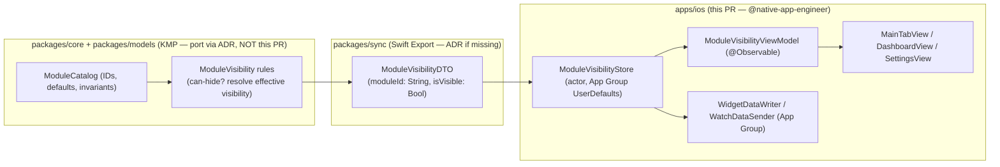

# iOS Module Visibility Preferences (Low-Noise Mode)

> Design specification for **persisted, opt-in preferences** that let a user hide tabs,
> dashboard cards, quick actions, and optional modules (bills, reports, mood tags, and
> similar) — so the app can be quietened to a low-noise surface that shows only what each
> person actually uses, with **safe defaults** and a **one-tap reset**.

**Status:** PROPOSED — design only (native implementation gated, see
[Implementation readiness](#11-implementation-readiness))
**Issue:** [#2577](https://github.com/jrmoulckers/finance/issues/2577) — _Part of
[#2122](https://github.com/jrmoulckers/finance/issues/2122)_
**Platform:** iOS / iPadOS (SwiftUI · Swift Concurrency, iOS 17+)
**Owner:** @native-app-engineer
**Last updated:** 2026-06-22
**Related design docs:** [information-architecture.md](./information-architecture.md) ·
[ux-principles.md](./ux-principles.md) ·
[cognitive-accessibility.md](./cognitive-accessibility.md) ·
[accessibility-patterns.md](./accessibility-patterns.md) ·
[content-language-guidelines.md](./content-language-guidelines.md)
**Sibling design docs:**
[ios-fire-minimalist-preset.md](./ios-fire-minimalist-preset.md) (a named preset built on
this preference store)

---

## Table of Contents

1. [Problem & Goal](#1-problem--goal)
2. [Affected iOS Surfaces](#2-affected-ios-surfaces)
3. [The Module Catalog & Safe Invariants](#3-the-module-catalog--safe-invariants)
4. [Preference Model, Persistence & the iOS / KMP Boundary](#4-preference-model-persistence--the-ios--kmp-boundary)
5. [The Preferences UI](#5-the-preferences-ui)
6. [Applying Visibility Across Surfaces](#6-applying-visibility-across-surfaces)
7. [Accessibility](#7-accessibility)
8. [Dynamic Type](#8-dynamic-type)
9. [Privacy](#9-privacy)
10. [Empty, Stale, Error & Reset States](#10-empty-stale-error--reset-states)
11. [Test Plan](#11-test-plan)
12. [Implementation readiness](#12-implementation-readiness)
13. [Open Questions](#13-open-questions)

---

## 1. Problem & Goal

The app surfaces many optional modules. The root
[`MainTabView.swift`](../../apps/ios/Finance/Navigation/MainTabView.swift) has five tabs
(Dashboard, Accounts, Transactions, Budgets, Goals); the
[`DashboardView.swift`](../../apps/ios/Finance/Screens/DashboardView.swift) stacks a
net-worth card, a monthly spending summary, budget-health rings, a "More" quick-access
grid (Investments / Bills / Reports), and recent transactions; and
[`SettingsView.swift`](../../apps/ios/Finance/Screens/SettingsView.swift) exposes many
feature sections. Not every user wants every module — for some, mood tags, reports, or
bills are noise that competes with the numbers they care about.

**Goal:** specify a **module-visibility preference store** and the UI to manage it, so a
user can hide optional modules and the relevant surfaces (tabs, dashboard cards, quick
actions) **honour those choices on next render**, with:

1. A **catalog of toggleable modules** with **safe defaults** (everything visible) and
   **non-hideable invariants** (you can never hide your way into a broken app).
2. **Durable, private, local persistence** that also reaches **widgets and the watch** via
   the existing App Group.
3. A **clear, non-destructive reset** ("Reset to defaults") and a calm, discoverable
   Settings surface — the foundation the [FIRE minimalist preset](./ios-fire-minimalist-preset.md)
   ([#2580](https://github.com/jrmoulckers/finance/issues/2580)) builds on.

**Non-goals:** deleting data (hiding ≠ deleting), reordering modules (tracked separately),
per-household/shared preferences, and any new shared backend schema.

---

## 2. Affected iOS Surfaces

All under `apps/ios/` (owned by @native-app-engineer).

| Surface                                                                                                                                                                        | Change                                                                                                             |
| ------------------------------------------------------------------------------------------------------------------------------------------------------------------------------ | ------------------------------------------------------------------------------------------------------------------ |
| `Screens/ModuleVisibilitySettingsView.swift` **(new)**                                                                                                                         | The preferences screen: grouped toggles per module + "Reset to defaults".                                          |
| `ViewModels/ModuleVisibilityViewModel.swift` **(new)**                                                                                                                         | `@Observable` VM wrapping the preference store; exposes per-module `isVisible` bindings + reset.                   |
| `Models/ModulePreferences.swift` **(new)**                                                                                                                                     | iOS view-model of the shared catalog/defaults; `ModuleID` enum + `ModuleVisibility` map (mirrors shared contract). |
| `Services/ModuleVisibilityStore.swift` **(new)**                                                                                                                               | Persistence actor over the App Group `UserDefaults`; publishes changes; writes mirror for widgets/watch.           |
| [`Navigation/MainTabView.swift`](../../apps/ios/Finance/Navigation/MainTabView.swift)                                                                                          | **Modify:** filter optional tabs through visibility (core tabs are invariant — see §3).                            |
| [`Screens/DashboardView.swift`](../../apps/ios/Finance/Screens/DashboardView.swift)                                                                                            | **Modify:** gate optional cards/quick-access entries on visibility; keep the hero net-worth card always.           |
| [`Screens/SettingsView.swift`](../../apps/ios/Finance/Screens/SettingsView.swift)                                                                                              | **Modify (light):** add a "Low-Noise / Modules" row linking to the new settings screen.                            |
| [`Services/WidgetDataWriter.swift`](../../apps/ios/Finance/Services/WidgetDataWriter.swift) / [`WatchDataSender.swift`](../../apps/ios/Finance/Services/WatchDataSender.swift) | **Modify (light):** include visibility flags so widgets/complications can respect hidden modules.                  |
| `Resources/*.lproj/Localizable.strings`                                                                                                                                        | **Modify:** localized module names, descriptions, reset copy, confirmations. No hardcoded strings.                 |

This follows the existing `@AppStorage`-backed preferences pattern already used by
[`AppearanceSettingsView.swift`](../../apps/ios/Finance/Screens/AppearanceSettingsView.swift)
(`IconPackPreference.key`).

---

## 3. The Module Catalog & Safe Invariants

The **catalog** (which modules exist and may be hidden) is the platform-neutral part and
is described here for the shared layer; iOS renders and persists choices.

**Toggleable modules (proposed v1):**

| Module                        | Default | Surface affected                            |
| ----------------------------- | ------- | ------------------------------------------- |
| Budgets tab                   | Visible | `MainTabView` tab                           |
| Goals tab                     | Visible | `MainTabView` tab                           |
| Investments quick action      | Visible | Dashboard "More" grid                       |
| Bills quick action / module   | Visible | Dashboard "More" grid + Bills screens       |
| Reports quick action / module | Visible | Dashboard "More" grid + Reports screens     |
| Net-worth card                | Visible | Dashboard hero card _(see invariant below)_ |
| Spending summary card         | Visible | Dashboard card                              |
| Budget-health strip           | Visible | Dashboard card                              |
| Recent transactions card      | Visible | Dashboard card                              |
| Mood / mood-tag entry         | Visible | Transaction entry + tags                    |

**Non-hideable invariants (safe defaults — the app can never be bricked by hiding):**

- **At least the Dashboard, Accounts, and Transactions tabs always remain** — the user can
  never hide all navigation. These are **not** in the toggleable catalog.
- **Settings is always reachable** (so visibility can always be changed back).
- **A user cannot hide every dashboard card.** If all optional cards are hidden, the
  Dashboard still shows the **net-worth hero** (or, if that too is hidden, a calm "Your
  dashboard is minimised — adjust in Settings" prompt that links back).
- **Hiding never deletes data.** Hidden modules retain their data; re-showing restores the
  full view. This is framed per [content-language-guidelines.md](./content-language-guidelines.md):
  "Hidden" not "Removed".

These invariants are validated by shared tests (§11.1) so every platform agrees on what is
hideable, keeping iOS/Android/Web/Windows consistent.

---

## 4. Preference Model, Persistence & the iOS / KMP Boundary

**Responsibilities**

| Concern                                                             | Layer                                 |
| ------------------------------------------------------------------- | ------------------------------------- |
| The module catalog, defaults, and non-hideable invariants           | `packages/core` / `packages/models`   |
| "Is this module allowed to be hidden? resolve effective visibility" | `packages/core` (rules)               |
| Type mapping (`String` id, `Bool`)                                  | Swift Export bridge (`packages/sync`) |
| **Local persistence**, change publishing, App-Group mirroring       | iOS (`ModuleVisibilityStore`)         |
| Settings UI, tab/card gating, accessibility, Dynamic Type, reset UX | iOS                                   |

**Persistence (iOS-owned):**

- Stored in the **App Group** `UserDefaults(suiteName: "group.com.finance.app")` (the same
  suite already used by [`WidgetDataWriter`](../../apps/ios/Finance/Services/WidgetDataWriter.swift)
  and the watch), so widgets and complications read the same flags. **Not Keychain** —
  these are **non-sensitive UI preferences**, not secrets. (Keychain remains reserved for
  tokens/keys per the security rules; see [§9](#9-privacy).)
- `ModuleVisibilityStore` is an **`actor`** to serialise reads/writes;
  cross-boundary types are `Sendable`; UI state updates are `@MainActor`. No `DispatchQueue`.
- **iOS does not invent the catalog.** The list of hideable modules and the invariants come
  from the shared contract; iOS binds the existing `StubSwiftExportBridge` until the Kotlin
  port lands, so the screen is buildable now.

---

## 5. The Preferences UI

`ModuleVisibilitySettingsView` is a standard SwiftUI `Form`, mirroring the structure of
[`AppearanceSettingsView`](../../apps/ios/Finance/Screens/AppearanceSettingsView.swift) and
the grouped sections in [`SettingsView`](../../apps/ios/Finance/Screens/SettingsView.swift):

- **Grouped sections** ("Tabs", "Dashboard cards", "Quick actions", "Other modules"), each
  a `Section` of `Toggle`s — one per module, with a short footer explaining what hiding does
  ("Hidden modules keep their data; you can show them again anytime.").
- A trailing **"Reset to defaults"** button (`role: .destructive`-styled but **non-data
  destructive**) with a confirmation that clarifies it only restores visibility, never data.
- **Non-hideable items are not shown as broken toggles** — they're simply absent from the
  catalog, so the user never sees a disabled/forbidden control.
- Calm, non-judgemental copy throughout per
  [content-language-guidelines.md](./content-language-guidelines.md) — "Show / Hide", never
  "Enable real features / Disable".

Discoverability: a single **"Low-Noise / Modules"** `NavigationLink` is added to
`SettingsView`'s general/appearance area (one row, no new top-level surface).

---

## 6. Applying Visibility Across Surfaces

- **Tabs (`MainTabView`):** the `Tab` enum keeps core tabs always; optional tabs (Budgets,
  Goals) are included only when `isVisible(.budgets)` / `isVisible(.goals)`. Because tabs
  are built from `Tab.allCases`, gating is a single `filter`. Deep links to a hidden tab
  still resolve (the destination remains in the navigation graph) so functionality is never
  lost — only chrome is quietened.
- **Dashboard cards (`DashboardView`):** each optional section (`spendingSummaryCard`,
  `budgetHealthSection`, `quickAccessSection` entries, `recentTransactionsSection`) is wrapped
  in `if viewModel.isVisible(.x)`. The **net-worth hero stays** unless explicitly hidden,
  and the all-hidden invariant (§3) provides the minimised prompt.
- **Quick actions:** the "More" grid renders only visible entries; an empty grid hides its
  header entirely (no empty "More" label).
- **Widgets/watch:** flags are mirrored through the App Group so a hidden module's widget can
  show a neutral "Hidden in app" placeholder rather than stale data.
- **Live updates:** the `@Observable` VM observes the store; toggling a preference updates
  the affected surface on next render without an app restart.

---

## 7. Accessibility

Per [accessibility-patterns.md](./accessibility-patterns.md) and
[cognitive-accessibility.md](./cognitive-accessibility.md) (reducing noise is itself a
cognitive-accessibility win):

- **Every toggle is labelled and hinted.** `Toggle` rows have
  `.accessibilityLabel(moduleName)` and `.accessibilityHint("Hides {module} from your
dashboard")`; state is announced as on/off by VoiceOver natively. Each carries a stable
  `.accessibilityIdentifier("module_toggle_<id>")`.
- **Reset is explained.** The reset control reads _"Reset module visibility to defaults.
  Shows all modules again. Does not delete any data."_
- **Section headers** use `.accessibilityAddTraits(.isHeader)`; reading order matches visual
  order.
- **Switch Control / Full Keyboard Access:** all toggles, the reset button, and the Settings
  entry row are real focusable controls; nothing is gesture-only.
- **No surprise.** Hiding a module never silently removes an accessibility-relied-upon
  control elsewhere without the user's explicit action in this screen.

---

## 8. Dynamic Type

- **No hardcoded font sizes** — `Form`/`Section`/`Toggle` and `.footnote` footers scale
  through AX1–AX5 by default.
- **Toggle rows wrap, never truncate** module names/descriptions at large sizes; the toggle
  control stays right-aligned and reachable.
- Verified at AX5 in [§11](#11-test-plan).

---

## 9. Privacy

- **Preferences are non-sensitive UI state**, stored in App-Group `UserDefaults` — **never
  Keychain** (Keychain is reserved for secrets per the security rules). They contain no
  balances, no PII, only module on/off flags.
- **Logging is privacy-aware.** Log only `.public` events via `os.Logger` — "module hidden",
  "module shown", "visibility reset" — by module id, never any financial value. Never
  `print()`.
- **No new sync surface.** v1 preferences are local + App Group only; a future "sync my
  preferences" capability would be a separate shared-schema decision via ADR, not assumed
  here.

---

## 10. Empty, Stale, Error & Reset States

| State            | Trigger                                  | Presentation                                                                                                                  |
| ---------------- | ---------------------------------------- | ----------------------------------------------------------------------------------------------------------------------------- |
| **First run**    | No stored preferences yet                | Catalog renders with **all toggles on** (safe default); no error, no empty screen.                                            |
| **All hidden**   | User hides every optional dashboard card | Dashboard shows the net-worth hero (or the "Your dashboard is minimised — adjust in Settings" prompt), per the §3 invariant.  |
| **Stale/widget** | Widget reads cached flags                | Widget honours last-known visibility; a hidden module's widget shows a neutral "Hidden in app" placeholder, never stale data. |
| **Store error**  | App-Group read/write fails               | Fall back to **defaults (all visible)** — fail safe, never hide content on error; log `.public` error; surface stays usable.  |
| **Reset**        | "Reset to defaults" confirmed            | All modules return to visible; a brief, non-judgemental confirmation; **no data is touched**.                                 |

- **Fail safe = show, not hide.** Any persistence failure resolves to "visible" so a bug can
  never make a user's data unreachable.
- **Reset is reversible work, not destruction** — it only rewrites flags.

---

## 11. Test Plan — Smallest Tests First

### 11.1 Shared (KMP) — verify/port parity, not re-implemented here

- `ModuleVisibilityRulesTest` (KMP, **@native-app-engineer via ADR**): the catalog lists exactly
  the hideable modules; non-hideable invariants (Dashboard/Accounts/Transactions tabs,
  Settings reachable, "not all dashboard cards hideable") hold; default resolves to all
  visible; effective-visibility resolution is deterministic.

### 11.2 Bridge

- `SwiftExportBridgeTests`: `ModuleVisibilityDTO` round-trips `moduleId` + `isVisible`;
  unknown ids are ignored (forward-compatible).

### 11.3 iOS unit (XCTest, `apps/ios/Tests/`)

1. **`ModuleVisibilityStoreTests`** — writes/reads round-trip through the App-Group suite;
   first-run returns all-visible; a corrupt/missing value falls back to defaults; the actor
   serialises concurrent writes.
2. **`ModuleVisibilityViewModelTests`** — toggling updates the published map; "Reset"
   restores defaults; invariant modules never appear in the toggle list.
3. **`DashboardVisibilityTests`** (pure where possible) — given a visibility map, the
   computed list of dashboard sections matches expectation; the all-hidden case still
   yields the net-worth hero / minimised prompt.

### 11.4 iOS UI / a11y (`apps/ios/Tests/UITests/`)

4. **`ModuleVisibilityUITests`** — toggling "Reports" off removes it from the dashboard
   "More" grid and (if applicable) its tab; **VoiceOver** announces each toggle's
   label/state and the reset hint; **Dynamic Type** at AX5 wraps rows untruncated; **Reset**
   restores all modules; data for a hidden module is intact when re-shown.

### 11.5 Gate

`node tools/agent-scripts/pre-push-check.js --fix` (lint + strict concurrency) plus the
suites above. `SWIFT_STRICT_CONCURRENCY = complete`: store is an `actor`, DTOs `Sendable`,
UI state `@MainActor`.

---

## 12. Implementation readiness

Per the [Human-Gated Prerequisites runbook](../ops/human-gated-prerequisites.md) (§2),
Apple Developer enrollment
[#1239](https://github.com/jrmoulckers/finance/issues/1239) gates **distribution only** —
not implementation. This design and its iOS code are **buildable and testable now**.

### Buildable now (no enrollment, no secrets)

- ✅ **This design doc** — fully unblocked.
- ✅ `ModuleVisibilitySettingsView`, `ModuleVisibilityViewModel`, `ModuleVisibilityStore`,
  and the `MainTabView` / `DashboardView` / `SettingsView` gating — SwiftUI + `@Observable`
  - an `actor` store over App-Group `UserDefaults`, reusing the existing `AppearanceSettings`
    preference pattern.
- ✅ All unit + UI/a11y tests in [§11](#11-test-plan) in the iOS Simulator.
- ✅ On-device verification via **free Personal Team signing** (free Apple ID) — see
  [ios-setup.md](../guides/ios-setup.md). App-Group entitlements work under a Personal Team
  for local testing.
- ✅ Against the `StubSwiftExportBridge` catalog fixture, the settings + gating are
  developable **before** the Kotlin rules port lands.

### Distribution tail — gated by #1239 (human, not this PR)

- 🔒 App Store / TestFlight builds, release signing, and CI release secrets are
  **human-gated** (runbook
  [§3.2](../ops/human-gated-prerequisites.md#32-ios-distribution--apple-developer-1239)) and
  out of scope here.

### Dependency note (process gate, not human-gated)

The module catalog, defaults, and invariants belong in `packages/core` / `packages/models`
re-exported via `packages/sync` — **@native-app-engineer via ADR**, not this iOS PR. Until then iOS
binds the stub bridge. The App-Group identifier `group.com.finance.app` already exists.

### Needs Human Action

- None for design **or** iOS implementation up to the distribution boundary. Only
  TestFlight/App Store shipping is human-gated ([#1239](https://github.com/jrmoulckers/finance/issues/1239)).

---

## 13. Open Questions

1. **Reorder vs. hide:** v1 is hide-only; module **reordering** is deferred. Confirm split.
2. **Per-device vs. synced preferences:** local + App Group in v1; a synced option would be a
   separate shared-schema ADR.
3. **Mood-tag granularity:** hide the mood-tag entry only, or the whole tagging affordance?
4. **Tab minimum:** is a 3-tab floor (Dashboard/Accounts/Transactions) the right invariant,
   or should Accounts also be optional for a pure budgeting user? (Proposed: keep the
   3-tab floor.)
