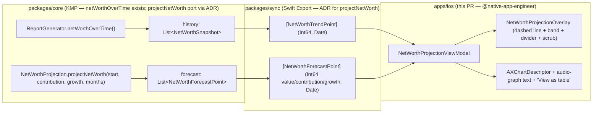

# iOS Net-Worth Projection Overlay — Surface Design

> A forward-looking, **contribution-paced projection** overlay that extends the
> existing net-worth trend chart into the future on iPhone and iPad: a dashed
> projection line + soft band, explicit **confidence copy** ("projection, not a
> prediction"), tap/scrub **point inspection**, and full **non-gesture
> alternatives** so every future value is reachable without a trackpad or drag.
> Visualizes the path toward the FI targets from
> [ios-fire-results-goal-integration.md](./ios-fire-results-goal-integration.md).

**Status:** PROPOSED — design only (implementation gated where noted)
**Issue:** [#2564](https://github.com/jrmoulckers/finance/issues/2564) — Part of [#2116](https://github.com/jrmoulckers/finance/issues/2116)
**Platform:** iOS / iPadOS (SwiftUI, iOS 17+)
**Owner:** @native-app-engineer
**Related design:** [ios-net-worth-trend-chart.md](./ios-net-worth-trend-chart.md) · [ios-fi-calculator-flow.md](./ios-fi-calculator-flow.md) · [ios-fire-results-goal-integration.md](./ios-fire-results-goal-integration.md) · [data-visualization.md](./data-visualization.md) · [chart-component-specs.md](./chart-component-specs.md) · [accessibility-patterns.md](./accessibility-patterns.md) · [content-language-guidelines.md](./content-language-guidelines.md) · [Human-Gated Prerequisites](../ops/human-gated-prerequisites.md)

---

## Table of Contents

1. [Goal & Scope](#1-goal--scope)
2. [Placement: Extending the Trend Chart](#2-placement-extending-the-trend-chart)
3. [The Contribution-Paced Projection](#3-the-contribution-paced-projection)
4. [Confidence Copy & Financial-Advice Safety](#4-confidence-copy--financial-advice-safety)
5. [Point Inspection (Scrub) & Non-Gesture Alternatives](#5-point-inspection-scrub--non-gesture-alternatives)
6. [Accessibility — VoiceOver for Future Values](#6-accessibility--voiceover-for-future-values)
7. [Dynamic Type](#7-dynamic-type)
8. [Privacy: Balance Hiding](#8-privacy-balance-hiding)
9. [States: Empty, Loading, Stale & Error](#9-states-empty-loading-stale--error)
10. [Affected Surfaces & Shared Dependencies](#10-affected-surfaces--shared-dependencies)
11. [Native ↔ Shared Boundary](#11-native--shared-boundary)
12. [Test Plan](#12-test-plan)
13. [Implementation Readiness](#13-implementation-readiness)
14. [Open Questions](#14-open-questions)

---

## 1. Goal & Scope

Answer **"If I keep saving like this, where could my net worth be?"** by extending
the historical net-worth line into the future with a clearly-differentiated,
clearly-labeled **projection** — and to show the path toward the
[FI number / projected FI date](./ios-fire-results-goal-integration.md) instead of
leaving those as abstract figures.

This overlay **builds on, and does not replace,** the historical
[net-worth trend chart](./ios-net-worth-trend-chart.md): same card, same range
controls, same accessibility scaffolding — extended forward. It reuses the
confidence-band visual language already established by
[`PredictionChart`](../../apps/ios/Finance/Charts/PredictionChart.swift).

**In scope (this design):**

- A **projection overlay** on the existing `NetWorthTrendChart`: a dashed future
  line + a soft "range" band, paced by the user's **monthly contribution** and an
  assumed growth rate.
- A horizon control (e.g., **1Y / 5Y / 10Y / to FI**) for how far ahead to
  project.
- **Confidence copy** that frames the overlay as an assumption-driven projection,
  not a prediction, with an always-visible disclaimer.
- **Point inspection**: tap/scrub a future month to read its projected value, with
  full **non-gesture** alternatives (stepper, "View as table", VoiceOver
  per-point).
- Optional **FI-target rule line** + projected FI date marker, linking the
  projection to the FIRE results.
- Privacy, Dynamic Type, and empty/loading/stale/error states.

**Out of scope (deliberately deferred):**

- The historical series, range controls, decimation, and the base chart — owned by
  [ios-net-worth-trend-chart.md](./ios-net-worth-trend-chart.md); this design
  **extends** it.
- Monte-Carlo / probabilistic fan charts and sequence-of-returns risk (the "band"
  here is a simple assumption range, **not** a statistical confidence interval —
  see [§3](#3-the-contribution-paced-projection)). Probabilistic modeling is a
  labeled follow-on under #2116.
- watchOS, widgets, and App Clip variants.

> **Why an overlay, not a new screen:** the projection is most meaningful sitting
> directly on the history it extends, so the eye reads "where I've been → where
> this pace leads." Per [data-visualization](./data-visualization.md), the future
> is _detail on demand_ layered onto the existing card, not a separate
> destination.

---

## 2. Placement: Extending the Trend Chart

- The overlay is a **mode of the existing `NetWorthTrendCard`** (dashboard +
  accounts), enabled by a "Show projection" toggle / segment, not a new card. When
  off, the card is exactly the historical trend from
  [ios-net-worth-trend-chart.md](./ios-net-worth-trend-chart.md).
- It also appears **inline in the FIRE calculator flow**, beneath the result cards
  ([ios-fire-results-goal-integration.md §4](./ios-fire-results-goal-integration.md)),
  where the projection's contribution + growth come from the FIRE inputs and the
  **FI-target rule line** is shown by default.
- A **vertical "today" divider** separates solid history (left) from the dashed
  projection (right), so past vs. future is unmistakable even before reading any
  label.

```
┌──────────────────────────────────────────────────────────┐
│  Net Worth — Projection (estimate)                         │
│  $48,250 today  →  ~$612,000 in 10 yrs (est.)              │
│                                       ┌╌╌ band ╌╌╌╌╌╌╌╮    │
│                              ╭╌╌╌╌╌╌╌╌┤ projection    │    │  ← dashed + band
│   solid history     ╭───────╯         └╌╌╌╌╌╌╌╌╌╌╌╌╌╌╌╯    │
│  ───────────────────╯        ┊today                        │  ← "today" divider
│  2019      2022      2025     ┊  2030      2035            │
│  [1Y] [5Y] [10Y] [to FI]      Contribution $1,500/mo ›     │  ← horizon + pace
│  Projection assumes $1,500/mo and 5% growth — not advice.  │  ← confidence copy
└──────────────────────────────────────────────────────────┘
```

- Reuses the base card's **range controls** for the _historical_ window and adds a
  separate **horizon control** for the _future_ window, so the two axes of "how
  far back" and "how far forward" are independent and clearly labeled.

---

## 3. The Contribution-Paced Projection

The projection is **deterministic and transparent**: starting from today's net
worth, each month adds the user's contribution and a simple growth increment —
the shared `projectNetWorth` model.

### 3.1 Model (shared)

Mirrors the canonical reference
[`projectNetWorth`](../../apps/web/src/lib/investment/net-worth-projection.ts):

```
netWorth(0)      = current net worth
growth(m)        = max(0, netWorth(m-1)) × (annualGrowth% / 100 / 12)
netWorth(m)      = netWorth(m-1) + monthlyContribution + growth(m)
```

- **Contribution-paced:** the line's slope is driven primarily by the user's
  **monthly contribution** (savings), with compounding layered on — so the user
  sees the lever they actually control. The contribution defaults to the
  trailing income − expenses figure (same source as the FIRE inputs) and is
  editable inline ("Contribution $1,500/mo ›").
- **Growth assumption:** the same assumed **real return** used by the FIRE
  calculator (default 5%), surfaced and editable; changing it re-paces the line
  live (debounced), consistent with the sensitivity controls in
  [ios-fi-calculator-flow.md §5](./ios-fi-calculator-flow.md).
- **Output:** an array of `NetWorthForecastPoint`-equivalent values
  (`month`, `netWorthCents`, `contributionCents`, `projectedGrowthCents`) so each
  inspected point can attribute how much came from contributions vs. growth.

### 3.2 Visual language (reusing `PredictionChart` conventions)

| Element             | Treatment                                                                                                                  |
| ------------------- | -------------------------------------------------------------------------------------------------------------------------- |
| **History line**    | Solid `ChartColorPalette.blue`, `.monotone` — unchanged from the trend chart.                                              |
| **Projection line** | **Dashed** line (`StrokeStyle(dash: [6, 4])`) in `ChartColorPalette.purple`, matching `PredictionChart`'s prediction line. |
| **Range band**      | Soft `AreaMark` (purple, ~0.15 opacity) between an optimistic/conservative pace — **decorative**, `.accessibilityHidden`.  |
| **Today divider**   | A `RuleMark` at today, labeled "Today" for VoiceOver.                                                                      |
| **FI-target line**  | Optional horizontal `RuleMark` at the FI number, labeled "FI target {amount}"; intersection marks the projected FI date.   |

- **The band is an assumption range, not statistics.** It is drawn from a
  conservative vs. optimistic growth pace (e.g., return ± a fixed spread), and the
  copy says so. It is explicitly **not** a Monte-Carlo confidence interval; we do
  not imply statistical probability (see [§4](#4-confidence-copy--financial-advice-safety)).
- **Dashed + band + divider** give three independent, non-color signals that the
  right side is the future, satisfying "never rely on color alone".
- **Reduce Motion:** the projection draws in instantly (no sweep animation) when
  `accessibilityReduceMotion` is set; horizon changes crossfade or swap instantly
  per the setting, consistent with
  [data-visualization §8](./data-visualization.md).

---

## 4. Confidence Copy & Financial-Advice Safety

Projecting the future is the highest-risk surface for over-promising, so the copy
is deliberate and always present.

- **Always-visible confidence line** under the chart: _"Projection assumes
  ${contribution}/mo and {growth}% annual growth. This is an estimate, not a
  prediction or financial advice — real results will differ."_ Real, selectable
  text; in the VoiceOver reading order.
- **"Projection," never "prediction."** Headlines and labels use "projected",
  "estimated", "could be", "at this pace" — never "will be". The headline figure
  reads "~$612,000 in 10 years (est.)", never a bare future number.
- **Assumptions are co-present and editable.** The contribution and growth are on
  the card; the user can never see the future line without seeing what produced
  it, and adjusting them is the intended interaction.
- **The band is labeled an assumption range**, not a probability. Its inspection
  copy says "range reflects more/less optimistic growth assumptions", explicitly
  disclaiming statistical confidence — distinct from the spending-forecast
  confidence interval in `PredictionChart` (which is a different, bounded
  short-horizon model).
- **Non-judgmental framing.** If contributions are low or the FI target is far
  out, copy stays factual ("at this pace, your FI target is beyond the {N}-year
  horizon") per [content-language-guidelines](./content-language-guidelines.md) —
  never implying the user is doing something wrong.
- **Long-horizon humility.** For 10Y/"to FI" horizons a one-line note reminds that
  longer projections are less certain; we cap the default horizon and require an
  explicit tap to extend further out.

---

## 5. Point Inspection (Scrub) & Non-Gesture Alternatives

Users must be able to read **any future month's projected value** — and crucially,
**without** a drag gesture.

### 5.1 Pointer scrubbing (sugar, not the only path)

- Tap/drag reuses the `chartOverlay` + `RuleMark` scrub pattern from
  [`PredictionChart`](../../apps/ios/Finance/Charts/PredictionChart.swift) and
  `TrendChart`: a rule + single `PointMark` + a callout showing the month, the
  projected value, and the contribution-vs-growth split for that point.
- Scrubbing is **pointer-only convenience**; every value it reveals is reachable
  by the non-gesture paths below.

### 5.2 Non-gesture alternatives (first-class, required)

| Alternative                | Behavior                                                                                                                                                                                                            |
| -------------------------- | ------------------------------------------------------------------------------------------------------------------------------------------------------------------------------------------------------------------- |
| **Horizon stepper**        | A discrete stepper / segmented control ("1Y · 5Y · 10Y · to FI") moves the inspected point and the headline to that horizon — no drag needed.                                                                       |
| **"Inspect month" picker** | A `Picker`/stepper to select a specific future month; the callout updates and is announced. Fully operable via Switch Control / keyboard.                                                                           |
| **"View as table"**        | A disclosure reveals a `Grid`/`List` of `Month → Projected net worth (contribution / growth)` rows — the same contract as the trend chart and `ReportResultView`. Non-gestural access to **every** projected value. |
| **VoiceOver per-point**    | `AXChartDescriptor` exposes each projected month (see [§6](#6-accessibility--voiceover-for-future-values)).                                                                                                         |

- **Parity guarantee:** any value obtainable by scrubbing is obtainable by the
  table, the picker, and VoiceOver — no future value is gesture-locked. This
  satisfies the issue's "non-gesture alternatives for future net-worth values"
  requirement and the
  [chart-component-specs](./chart-component-specs.md) "Data table alternative on
  every chart" contract.
- **Touch targets** for the stepper/picker/toggle meet 44×44 pt.

---

## 6. Accessibility — VoiceOver for Future Values

Projections must be **fully understandable without sight**, and the spoken output
must make clear these are estimates. Follows
[accessibility-patterns](./accessibility-patterns.md), the trend chart's a11y
contract, and `PredictionChart`'s audio-graph support.

### 6.1 Container / audio-graph summary

The chart container exposes a generated, data-bearing, **estimate-framed**
description built from the full projection series, e.g.:

> _"Net worth projection. Today about $48,250. At a pace of $1,500 per month and
> 5 percent assumed annual growth, projected to about $612,000 in 10 years. This
> is an estimate, not a prediction. Your FI target of about $1,050,000 is reached
> around 2038."_

- Built by a pure `NetWorthProjectionDescription` helper (testable without a view)
  taking the forecast points + assumptions + currency, returning a localized
  string. Numbers use the shared currency formatter (no hardcoded symbols).

### 6.2 Per-point navigation (`AXChartDescriptor`)

- Adopt Swift Charts' `AXChartDescriptor` so VoiceOver users swipe through each
  projected month and hear, e.g., _"March 2030, projected, fifty-eight thousand
  dollars."_ The word **"projected"** is part of each value so future points are
  never confused with historical actuals.
- History points and projection points are **distinct data series** in the
  descriptor (e.g., "Net worth" vs. "Projected net worth"), and the Audio Graph
  rotor sonifies both, with the projection clearly named.
- Decorative marks (band, divider, scrub rule) are `.accessibilityHidden(true)`;
  only the lines/points carry data.

### 6.3 Other a11y requirements

- **Horizon & contribution controls:** real focusable controls with
  `.accessibilityLabel` + `.accessibilityValue` (e.g., horizon "10 years",
  contribution "$1,500 per month") and hints describing effect.
- **Confidence copy is spoken**: the "estimate, not a prediction" disclaimer is in
  the reading order — the projection's uncertainty is never visual-only.
- **Switch Control / Full Keyboard Access:** the toggle, horizon stepper, inspect
  picker, "View as table", and contribution/growth editors are all reachable and
  operable without gestures.
- **Contrast:** the dashed purple projection line meets ≥ 3:1 as a UI stroke; all
  captions/headline/disclaimer meet ≥ 4.5:1 across light, dark, and high-contrast
  ([data-visualization §2.5](./data-visualization.md)).

---

## 7. Dynamic Type

- **No hardcoded font sizes.** Headline reuses `CurrencyLabel`; the confidence copy
  uses `.footnote`/`.caption`; axis annotations `.caption2`; the horizon control
  labels scale. All scale through AX1–AX5.
- **Layout reflow.** At `accessibility1`+ the horizon control wraps or becomes a
  scrollable segment row (never truncates "to FI"); the contribution editor moves
  to its own row via `ViewThatFits`. The "View as table" rows wrap value + split.
- **Confidence copy never clips** — it wraps to as many lines as needed and is
  verified visible at AX5 in [§12](#12-test-plan). Chart height is fixed (card),
  but surrounding text grows the card vertically.

---

## 8. Privacy: Balance Hiding

- When balance-hiding is active, the **headline future figure, today's figure,
  callout values, table values, FI-target amount, and the audio-graph text** are
  masked ("•••••"). The **projection shape** may remain (it reveals no absolute
  amount) — default: keep the silhouette, mask all numbers — with the same
  optional "blur the line" setting offered by the trend chart.
- **The contribution and growth assumptions** (e.g., "$1,500/mo", "5%") are
  treated as balances for masking purposes where they reveal cash position; the
  growth **percentage** may remain. Default: mask the dollar contribution, keep the
  percentage. (Confirm with privacy owners — [§14](#14-open-questions).)
- **Accessibility parity:** masked numbers are masked in the VoiceOver description
  and `AXChartDescriptor` too ("Net worth hidden") — never speak a hidden balance.
  "View as table" shows the same mask.
- **App-switcher redaction:** participates in the existing privacy-screen snapshot
  behavior.
- **Logging:** never log series or projected values. Per `os.Logger` rules,
  balances are `.private`; log only `.public` events ("projection shown,
  horizon=10Y, points=120") — counts/horizons, never an amount.

---

## 9. States: Empty, Loading, Stale & Error

| State       | Trigger                                                       | Presentation                                                                                                                                                              |
| ----------- | ------------------------------------------------------------- | ------------------------------------------------------------------------------------------------------------------------------------------------------------------------- |
| **Loading** | History or projection inputs not yet resolved                 | History renders if ready; projection area shows a shimmer (static under Reduce Motion). `.accessibilityLabel("Calculating projection")`.                                  |
| **Empty**   | No current net worth / no contribution basis (brand-new user) | Projection hidden; show a prompt "Add accounts and a monthly contribution to see a projection." The historical card (if any) still shows. No fabricated contribution.     |
| **Stale**   | Starting point derived from a cached/offline snapshot         | Project from the cached "today" + a caption "Projection from data as of {relative time}"; reuse [`OfflineBanner`](../../apps/ios/Finance/Components/OfflineBanner.swift). |
| **Error**   | Projection computation/load fails                             | Inline, card-scoped "Couldn't build projection" + Retry; history and the rest of the surface stay usable. Logs `error.localizedDescription` `.public` only.               |

- **Empty asks, never assumes a contribution.** The projection requires a savings
  pace; if none is known, the surface prompts for it rather than inventing one
  (financial-advice safety).
- **Stale is informational** (local-first), consistent with
  [ios-net-worth-trend-chart.md §8](./ios-net-worth-trend-chart.md).
- **Errors are card-scoped** — a failed projection never hides the historical
  trend or the rest of the dashboard/FIRE screen.

---

## 10. Affected Surfaces & Shared Dependencies

### 10.1 iOS surfaces (all in `apps/ios/`, owned by @native-app-engineer)

| Surface                                                          | Change                                                                                                                           |
| ---------------------------------------------------------------- | -------------------------------------------------------------------------------------------------------------------------------- |
| `Finance/Charts/NetWorthProjectionOverlay.swift` **(new)**       | The dashed projection line + band + today divider + FI-target rule + scrub callout, layered on `NetWorthTrendChart`.             |
| `Finance/ViewModels/NetWorthProjectionViewModel.swift` **(new)** | `@Observable` VM: holds contribution/growth/horizon, derives forecast points via the bridge, owns inspection + states.           |
| `Finance/Charts/NetWorthProjectionDescription.swift` **(new)**   | Pure helper building the estimate-framed audio-graph text + `AXChartDescriptor` (history + projection series).                   |
| `Finance/Charts/NetWorthTrendCard.swift` **(modify)**            | Add a "Show projection" toggle + horizon/contribution controls + "View as table" for future rows (extends the trend-chart card). |
| `Finance/Screens/FIResultsSection.swift` **(modify)**            | Embed the overlay beneath the FIRE result cards with the FI-target line on (links to #2558).                                     |
| `Finance/KMP/SwiftExportBridge.swift` + protocols **(modify)**   | Expose `projectNetWorth(...)` returning Swift-native forecast points (see [§11](#11-native--shared-boundary)).                   |
| `Finance/KMP/StubSwiftExportBridge.swift` **(modify)**           | Stub `projectNetWorth` for previews/tests.                                                                                       |
| `Finance/Resources/*.lproj/Localizable.strings` **(modify)**     | New localized strings (headline, horizon labels, confidence copy, table headers, masks).                                         |

### 10.2 Shared dependencies (KMP — **not edited by this design**)

- **Historical series** — `ReportGenerator.netWorthOverTime(...)` and
  [`NetWorthSnapshot`](../../packages/core/src/commonMain/kotlin/com/finance/core/analytics/NetWorthSnapshot.kt)
  **already exist** in `packages/core` (consumed by the trend chart) and provide
  the starting point + history.
- **Projection math** — `projectNetWorth(starting, monthlyContribution, growth,
months, startMonth)` (contribution + compounding), canonical TypeScript
  reference today in
  [`apps/web/src/lib/investment/net-worth-projection.ts`](../../apps/web/src/lib/investment/net-worth-projection.ts).
  Its **platform-neutral home is `packages/core`**, re-exported via the Swift
  Export bridge.
- **Money/locale formatting** — the shared currency formatter module.

> **The forward `projectNetWorth` model is not yet in `packages/core` (KMP)** (the
> historical `netWorthOverTime` is). Porting it from the web reference (parity with
> `net-worth-projection.test.ts`) and re-exporting via `packages/sync` is a
> `packages/` change **owned by @native-app-engineer and proposed via ADR** — iOS must
> not implement the math or edit `packages/`. The overlay binds to a Swift-native
> `NetWorthProjectionBridge` stub, so it is buildable/testable now (see
> [§11](#11-native--shared-boundary), [§13](#13-implementation-readiness)).

---

## 11. Native ↔ Shared Boundary



**Responsibilities**

| Concern                                                               | Layer                                 |
| --------------------------------------------------------------------- | ------------------------------------- |
| Historical net-worth series + starting "today" value                  | `packages/core` (exists)              |
| Contribution-paced compounding projection (`projectNetWorth`)         | `packages/core` (port via ADR)        |
| Optimistic/conservative band pace (return ± spread)                   | `packages/core` (two projection runs) |
| Type mapping (`Cents`→`Int64`, `LocalDate`/month→`Date`)              | Swift Export bridge                   |
| Horizon windowing, contribution/growth editing, debounce              | iOS (`NetWorthProjectionViewModel`)   |
| Dashed/band/divider visuals, scrub, Reduce Motion, Dynamic Type       | iOS                                   |
| Estimate-framed audio-graph text + `AXChartDescriptor` + table        | iOS (a11y semantics)                  |
| Confidence copy, "projection not prediction", non-judgmental phrasing | iOS (content semantics)               |

- **iOS does not compute the projection.** It supplies starting value,
  contribution, growth, and horizon, and renders the returned forecast points. The
  band is two shared runs (conservative/optimistic), not an iOS-side formula.
- **Shared approximation caveat carried verbatim.** The historical series'
  back-cast approximation (documented for the trend chart) and the projection's
  simple-growth assumption are **shared behavior**, surfaced honestly in the
  confidence copy — iOS must not "correct" them locally.

---

## 12. Test Plan

### 12.1 Shared (KMP) — verify/port parity, not re-implement here

- Ported `NetWorthProjectionTest` (KMP) mirrors the web
  `net-worth-projection.test.ts`: monotonic growth with positive contribution;
  `max(0, …)` growth guard (no growth on negative net worth); correct
  month stepping and contribution/growth attribution per point; zero-growth →
  pure contribution accumulation. **@native-app-engineer via ADR**, not this PR.
- `netWorthOverTime` history coverage already exists (per the trend-chart design)
  — verify, don't duplicate.

### 12.2 Bridge

- `SwiftExportBridgeTests`: `projectNetWorth` maps `Cents → Int64` value /
  contribution / growth and month → `Date`; returns oldest-first; round-trips a
  zero-horizon (empty) request.

### 12.3 iOS unit (XCTest, `apps/ios/Tests/`)

1. **`NetWorthProjectionViewModelTests`**
   - Horizon: 1Y/5Y/10Y produce the correct point counts; "to FI" extends until the
     FI target is crossed (or caps at the max horizon with a "beyond horizon"
     flag); changing horizon performs no extra bridge call beyond the needed window
     (spy bridge).
   - Inspection: selecting a month (via picker, **not** drag) yields the right
     projected value + contribution/growth split.
   - States: no contribution basis → `.empty`; bridge throw → `.error`; cached
     start → `.stale` with an "as of" timestamp.
   - Live re-pacing: changing contribution/growth re-derives the forecast
     (debounced; assert coalesced call count).
2. **`NetWorthProjectionDescriptionTests`** (pure, no UI)
   - Description includes today, horizon value, the **estimate/"not a prediction"**
     framing, and (when present) the FI target + projected FI date; declines/low
     pace phrased non-judgmentally; **privacy mode → masked** with no amounts.
   - `AXChartDescriptor` exposes both series; projection points are labeled
     "projected".

### 12.4 iOS UI / a11y (`apps/ios/Tests/UITests/`)

3. **`NetWorthProjectionUITests`**
   - Toggling "Show projection" reveals the dashed line, band, and today divider;
     the confidence copy is present.
   - **Non-gesture:** the horizon stepper and "Inspect month" picker change the
     read-out value **without any drag**; "View as table" lists every projected
     month.
   - **VoiceOver:** the container label is estimate-framed; per-point values say
     "projected"; the disclaimer is in the reading order.
   - **Dynamic Type:** at AX5 the confidence copy and "to FI" label are
     untruncated and controls remain operable (reflowed).
   - **Privacy mode:** headline, callouts, table, and FI-target amounts masked;
     percentages handled per [§8](#8-privacy-balance-hiding).
   - **Reduce Motion:** projection appears without sweep; horizon change does not
     animate.

### 12.5 Gate

`node tools/agent-scripts/pre-push-check.js --fix` (lint + strict-concurrency)
plus the suites above. `SWIFT_STRICT_CONCURRENCY = complete`: forecast DTOs
`Sendable`, UI state `@MainActor`.

---

## 13. Implementation Readiness

Per the [Human-Gated Prerequisites runbook](../ops/human-gated-prerequisites.md)
(§2, _Implementation vs. Distribution decoupling_), the Apple Developer enrollment
blocker [#1239](https://github.com/jrmoulckers/finance/issues/1239) gates
**distribution only** — not implementation. This design and its implementation are
**buildable and testable now**.

### Buildable now (no enrollment, no secrets)

- ✅ **This design doc** — fully unblocked.
- ✅ The projection overlay, `@Observable` view model, dashed/band/divider Swift
  Charts visuals, scrub + non-gesture inspection, `AXChartDescriptor`,
  estimate-framed audio-graph text, and "View as table" — all SwiftUI + Swift
  concurrency, reusing `PredictionChart` conventions and the existing trend-chart
  scaffolding.
- ✅ All unit + UI/a11y tests in [§12](#12-test-plan) in the iOS Simulator.
- ✅ On-device verification via **free Personal Team signing** (free Apple ID):
  7-day expiry, ≤ 3 apps/device, no TestFlight/push — fine for verifying this
  feature.
- ✅ Against the `StubSwiftExportBridge` `projectNetWorth`, the entire overlay is
  developable **before** the Kotlin port lands; the historical
  `netWorthOverTime` it extends already exists in `packages/core`.

### Distribution tail — gated by #1239 (human, not this PR)

- 🔒 App Store / TestFlight builds, release signing, App Store Connect API key,
  and CI release secrets are **human-gated** (runbook §3.2) and out of scope.

### Dependency note (process gate, not human-gated)

The forward **`projectNetWorth` model must be ported to `packages/core`** from the
web reference (parity with `net-worth-projection.test.ts`) and **re-exported** via
the `packages/sync` Swift Export bridge — **@native-app-engineer via ADR**, not this iOS
PR. The historical series it extends already exists. Until the forward port lands,
the overlay binds to the stub bridge, so the iOS surface is independently
developable; only the live projected numbers depend on the shared port.

### Needs Human Action

- None for design **or** iOS implementation up to the distribution boundary. Only
  TestFlight/App Store shipping is human-gated, tracked by
  [#1239](https://github.com/jrmoulckers/finance/issues/1239); see
  [runbook §3.2](../ops/human-gated-prerequisites.md#32-ios-distribution--apple-developer-1239).

---

## 14. Open Questions

1. **Bridge surface:** does `packages/sync` re-export only `netWorthOverTime`, or
   should the ADR add `projectNetWorth` alongside it (proposed)? Affects whether
   iOS consumes the shared call or temporarily derives a simple projection locally
   behind the same protocol.
2. **Band semantics:** fixed conservative/optimistic spread around the growth rate
   (proposed) vs. omit the band entirely for v1 to avoid any "confidence interval"
   misread? Confirm with design/privacy.
3. **"To FI" horizon cap:** hard-cap at, e.g., 40 years with a "beyond horizon"
   note (proposed) vs. show the raw crossing even if far out.
4. **Contribution masking default:** mask the dollar contribution but keep the
   growth percentage (proposed) — confirm with privacy owners.
5. **Default visibility:** projection **off** by default on the dashboard card
   (proposed, history-first) and **on** in the FIRE flow — confirm.
