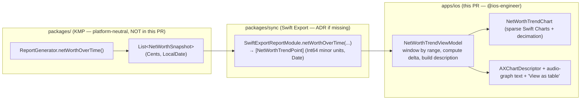

# iOS Net-Worth Trend Chart — Surface Design

> Minimal native SwiftUI surface for visualizing net-worth trends over time on
> iPhone and iPad, with range controls (3M / 6M / 1Y / All), a sparse Swift
> Charts presentation, and a full chart text alternative for VoiceOver.

**Status:** PROPOSED — design only (implementation gated where noted)
**Issue:** [#2562](https://github.com/jrmoulckers/finance/issues/2562) — Part of [#2116](https://github.com/jrmoulckers/finance/issues/2116)
**Platform:** iOS / iPadOS (SwiftUI, iOS 17+)
**Owner:** @ios-engineer
**Related:** [data-visualization.md](./data-visualization.md) · [chart-component-specs.md](./chart-component-specs.md) · [accessibility-patterns.md](./accessibility-patterns.md) · [Human-Gated Prerequisites](../ops/human-gated-prerequisites.md)

---

## Table of Contents

1. [Goal & Scope](#1-goal--scope)
2. [Placement: Dashboard & Accounts](#2-placement-dashboard--accounts)
3. [Range Controls (3M / 6M / 1Y / All)](#3-range-controls-3m--6m--1y--all)
4. [Sparse Swift Charts Presentation](#4-sparse-swift-charts-presentation)
5. [Chart Text Alternatives & Accessibility](#5-chart-text-alternatives--accessibility)
6. [Dynamic Type](#6-dynamic-type)
7. [Privacy: Balance Hiding](#7-privacy-balance-hiding)
8. [States: Empty, Loading, Stale & Error](#8-states-empty-loading-stale--error)
9. [Affected Surfaces & Shared Dependencies](#9-affected-surfaces--shared-dependencies)
10. [Native ↔ Shared Boundary](#10-native--shared-boundary)
11. [Test Plan](#11-test-plan)
12. [Implementation Readiness](#12-implementation-readiness)
13. [Open Questions](#13-open-questions)

---

## 1. Goal & Scope

Give users an at-a-glance answer to **"How has my net worth changed over time?"**
on the surfaces where they already look at totals — the **Dashboard** net-worth
card and the **Accounts** tab header — without adding a new tab or navigation
destination.

**In scope (this design):**

- A reusable `NetWorthTrendCard` SwiftUI surface embedding a single-series line
  chart of month-end net-worth snapshots.
- A segmented **range control** offering 3M / 6M / 1Y / All.
- A **sparse** Swift Charts presentation (per [§4](#4-sparse-swift-charts-presentation))
  tuned for a small card, not a full-screen report.
- A complete **chart text alternative** for VoiceOver (audio-graph-style summary
  plus per-point navigation), mirroring the existing
  [`TrendChart`](../../apps/ios/Finance/Charts/TrendChart.swift) and
  [`PredictionChart`](../../apps/ios/Finance/Charts/PredictionChart.swift)
  accessibility conventions.
- Empty / loading / **stale** / error states and a privacy (balance-hiding) mode.

**Out of scope (deliberately deferred):**

- The full custom **Report Builder** net-worth report already exists in
  [`ReportResultView`](../../apps/ios/Finance/Screens/ReportResultView.swift); this
  design does **not** replace it. The new card is the lightweight, always-visible
  entry point; "See full report" deep-links into the existing report surface.
- Per-account historical balances (the shared series uses a cash-flow back-cast
  approximation — see [§10](#10-native--shared-boundary)).
- watchOS, widgets, and macОS Catalyst variants (follow-on issues under #2116).
- Multi-series overlays (assets vs. liabilities). Net worth is a single series;
  assets/liabilities remain available in the full report.

> **Why a card, not a screen:** per the
> [data-visualization](./data-visualization.md) principle _"Clarity Over
> Completeness — show the most important information first, details on demand,"_
> the trend belongs inline next to the number it explains. Detail-on-demand lives
> in the existing report.

---

## 2. Placement: Dashboard & Accounts

### 2.1 Dashboard

The [`DashboardView`](../../apps/ios/Finance/Screens/DashboardView.swift) currently
renders a static `netWorthCard` (a label + `CurrencyLabel`). This design **expands
that card in place** into a `NetWorthTrendCard` that keeps the headline figure and
adds the sparse trend below it.

```
┌──────────────────────────────────────────────┐
│  Net Worth                                     │  ← existing subheadline
│  $48,250                          ↑ 4.1% / 6M  │  ← headline + delta chip
│                                                │
│        ╭───╮       ╭──────╮                    │
│   ╭────╯   ╰───────╯      ╰────────╮           │  ← sparse line + soft area
│  ─╯                                ╰────       │
│  Jan        Mar        May        Jul          │
│                                                │
│  [ 3M ] [ 6M ] [ 1Y ] [ All ]   View report ›  │  ← range control + deep link
└──────────────────────────────────────────────┘
```

- The card stays at the top of the dashboard `ScrollView`, above
  `spendingSummaryCard`.
- The headline net-worth value continues to come from
  `DashboardViewModel.netWorth` (Swift Export aggregator) — unchanged. The trend
  series is an **additive** load (see [§9](#9-affected-surfaces--shared-dependencies)).
- A **delta chip** ("↑ 4.1% over 6M") summarizes the selected range. It uses the
  financial semantic colors from [data-visualization §2.3](./data-visualization.md)
  — **always paired with an arrow glyph and text**, never color alone, and uses
  amber (not red) for declines per the non-judgmental rule.
- "View report ›" is a `NavigationLink` into the existing net-worth report in the
  Report Builder, preserving the selected range as the report's initial window.

### 2.2 Accounts

[`AccountsView`](../../apps/ios/Finance/Screens/AccountsView.swift) lists accounts
grouped by type under a large `Accounts` navigation title. We add the same
`NetWorthTrendCard` as a **collapsible header row** above the grouped list, so the
trend of the _aggregate_ of those accounts is visible where users manage balances.

- On Accounts the card defaults to **collapsed to the headline + delta chip**;
  tapping the chevron expands the chart. This keeps the list-first information
  architecture intact and avoids pushing the first account group below the fold on
  small devices.
- The collapsed/expanded preference persists via `@AppStorage`
  (`netWorthTrendExpanded.accounts`) — a non-secret UI preference, so
  `UserDefaults` is appropriate (no financial data is stored).

### 2.3 Shared component

Both placements embed **one** view, `NetWorthTrendCard`, parameterized by a
`NetWorthTrendViewModel`. Differences (default expansion state, whether the
headline is owned by the card or by the host) are passed as init options, not
forked code. This matches the existing pattern of reusing
[`TrendChart`](../../apps/ios/Finance/Charts/TrendChart.swift) across screens.

---

## 3. Range Controls (3M / 6M / 1Y / All)

A single `Picker` with `.pickerStyle(.segmented)` drives the visible window.

| Token   | Window         | `months` passed to shared series | Notes                                              |
| ------- | -------------- | -------------------------------- | -------------------------------------------------- |
| **3M**  | Last 3 months  | `3`                              | Minimum useful trend; below 3 points → empty state |
| **6M**  | Last 6 months  | `6`                              | **Default selection**                              |
| **1Y**  | Last 12 months | `12`                             | —                                                  |
| **All** | Full history   | `max(availableMonths, 3)`        | Capped by the oldest transaction/account month     |

**Behavioral rules**

- **Default:** `6M`, persisted per-surface in `@AppStorage`
  (`netWorthTrendRange.dashboard` / `.accounts`).
- **Localized, accessible labels.** Segment titles use
  `String(localized:)` ("3M", "6M", "1Y", "All") with an explicit
  `.accessibilityLabel` spelling them out ("Three months", "Six months",
  "One year", "All time") because the abbreviations are not self-describing to
  VoiceOver. The `Picker` carries `.accessibilityValue` reflecting the active
  range.
- **No data churn across the bridge.** Changing range is a **windowing**
  operation on an already-fetched series, not a refetch: the view model requests
  the largest needed window once (`All`) and slices locally for 3M/6M/1Y. This
  keeps range switching instant and bridge-call-free (consistent with the cached
  aggregation pattern in
  [`DashboardViewModel`](../../apps/ios/Finance/ViewModels/DashboardViewModel.swift)).
- **Reduce Motion.** Range change crossfades the data over 250 ms; when
  `accessibilityReduceMotion` is on, the swap is instant (per
  [data-visualization §8](./data-visualization.md) and
  [chart-component-specs](./chart-component-specs.md) "Reduced motion: instant").
- **Touch targets.** Each segment meets the 44×44 pt minimum (iOS HIG); the
  segmented control spans the card width.

---

## 4. Sparse Swift Charts Presentation

The card chart is intentionally **sparser** than the full-screen report chart in
`ReportResultView`. "Sparse" means: one series, minimal chrome, decimated points,
and de-emphasized axes so the _shape_ reads instantly at card size.

### 4.1 Marks

```swift
Chart(points) { point in
    AreaMark(
        x: .value("Date", point.date),
        y: .value("Net Worth", point.value)
    )
    .foregroundStyle(.linearGradient(
        colors: [ChartColorPalette.blue.opacity(0.18), .clear],
        startPoint: .top, endPoint: .bottom
    ))
    .accessibilityHidden(true) // area is decorative; line carries the data

    LineMark(
        x: .value("Date", point.date),
        y: .value("Net Worth", point.value)
    )
    .foregroundStyle(ChartColorPalette.blue) // IBM CVD-safe series 1
    .interpolationMethod(.monotone)           // monotone avoids overshoot artifacts
    .lineStyle(StrokeStyle(lineWidth: 2))
}
```

- **Color:** single series → `ChartColorPalette.blue` (IBM CVD-safe series 1),
  matching the existing net-worth chart in `ReportResultView`. A single series
  needs no pattern differentiation, but the delta chip still carries an arrow +
  text so meaning never rests on color (see
  [data-visualization §2.4 "Never Color Alone"](./data-visualization.md)).
- **Interpolation:** `.monotone` (not `.catmullRom`) for a single financial
  series — it never overshoots between month-end points, so the line cannot imply
  a higher/lower value than any real snapshot.

### 4.2 Sparseness rules

| Aspect             | Card (sparse)                                                       | Full report (`ReportResultView`)        |
| ------------------ | ------------------------------------------------------------------- | --------------------------------------- |
| Y-axis             | `.chartYAxis(.hidden)`; min/max annotated as small leading captions | Visible leading `AxisMarks` with labels |
| X-axis             | 3–4 sparse ticks via `.chartXAxis { AxisMarks(values: .stride …) }` | Monthly ticks                           |
| Grid lines         | None (or one faint zero baseline if any value < 0)                  | Grid lines on                           |
| Point symbols      | None by default; single symbol only on the active/selected point    | Optional dots                           |
| Data point density | **Decimated** to ≤ ~16 visible points (see below)                   | All snapshots                           |
| Height             | `minHeight: 120` (card); collapses with the card                    | `minHeight: 250`                        |
| Legend             | None (single series, titled card)                                   | N/A                                     |

- **Decimation:** "All" can return many month-end snapshots. To keep the sparse
  card legible and 60 fps, the **presentation layer** (iOS) decimates to a target
  bucket count (~12–16) using min/max-preserving downsampling (e.g., a
  Largest-Triangle-Three-Buckets pass) so peaks/troughs survive. Decimation is a
  _display_ concern and stays in `apps/ios`; the **underlying series and the text
  alternative use the full, undecimated data** so no real month-end value is lost
  to assistive tech (see [§5](#5-chart-text-alternatives--accessibility)).
- **Baseline:** if net worth dips below zero within the window, draw a single
  faint `RuleMark` at `y = 0` (labeled "Zero" for VoiceOver) so the sign is
  unambiguous; otherwise omit it.
- **Performance:** rasterize with `.drawingGroup()` for smooth scrolling, as the
  existing `TrendChart`/`PredictionChart` do.

### 4.3 Selection (scrubbing)

Optional tap/drag scrubbing reuses the `chartOverlay` + `RuleMark` pattern from
`TrendChart`: dragging shows a rule + a single `PointMark` and a small callout
with the month-end date and value. Scrubbing is **pointer-only sugar** — all the
same values are reachable via the VoiceOver per-point navigation in [§5](#5-chart-text-alternatives--accessibility),
so nothing is gated behind a gesture.

---

## 5. Chart Text Alternatives & Accessibility

Charts must be fully usable without sight. We provide **two** complementary text
alternatives, consistent with the app's existing Audio Graph support and the
[accessibility-patterns](./accessibility-patterns.md) and
[chart-component-specs §Accessibility Contract](./chart-component-specs.md) docs.

### 5.1 Audio-graph-style summary (container description)

The chart container is one accessibility element with a generated description —
the audio-graph-style alternative — built from the **full** (undecimated) series:

> _"Net worth trend, last 6 months. Line chart. Started at $44,100 in January,
> ended at $48,250 in June. Up $4,150, or 4.1 percent. Lowest $43,200 in
> February, highest $48,250 in June."_

Implementation notes:

- Built by a pure `NetWorthTrendDescription` helper (testable without a view) that
  takes `[NetWorthTrendPoint]` + range + currency and returns a localized string.
- Numbers are formatted via the Swift Export **currency formatter** module (the
  same module `DashboardViewModel` uses), so locale/currency are correct and no
  symbols are hardcoded.
- Applied as `.accessibilityLabel(description)` on an
  `.accessibilityElement(children: .contain)` container, matching
  `TrendChart`'s `accessibilityLabel(String(localized: "Financial trend line chart"))`
  but data-bearing.

### 5.2 Per-point navigation (`accessibilityChartDescriptor`)

Adopt Swift Charts' **`AXChartDescriptor`** via
`.accessibilityChartDescriptor(self)` so VoiceOver users can swipe through every
month-end point and hear "March, forty-six thousand eight hundred dollars," and
so the **Audio Graph** rotor action ("Describe Chart" → "Play Audio Graph")
sonifies the trend. This is the same capability advertised in the App Store
description ("VoiceOver users can navigate data points with Audio Graphs") and is
the native equivalent of the web "View as table" requirement.

- `AXDataSeriesDescriptor` = the full month-end series (undecimated).
- X axis = dates (`AXCategoricalDataAxisDescriptor` of localized month labels or
  `AXNumericDataAxisDescriptor` over time); Y axis = currency with a localized
  number formatter on `value(_:)`.

### 5.3 Data-table alternative

A **"View as table"** disclosure under the card reveals a plain
`Grid`/`List` of `Date → Net Worth` rows (mirroring `netWorthDataTable` in
`ReportResultView`). This satisfies the cross-platform
[chart-component-specs](./chart-component-specs.md) "Data table alternative —
'View as table' toggle on every chart" contract and gives Switch Control / Full
Keyboard Access users a non-gestural path to every value.

### 5.4 Other a11y requirements

- **Range control:** segmented `Picker` with spelled-out
  `.accessibilityLabel`s and an `.accessibilityValue` for the active window
  ([§3](#3-range-controls-3m--6m--1y--all)).
- **Delta chip:** `.accessibilityElement(children: .combine)` →
  "Up 4.1 percent over six months"; never color-only.
- **Decorative marks:** `AreaMark`, gradient, and the scrubbing rule are
  `.accessibilityHidden(true)`; only the line/points carry data.
- **Reduce Motion:** entrance line-draw and range crossfade disabled when
  `accessibilityReduceMotion` is set.
- **Switch Control / Full Keyboard Access:** every interactive element (segments,
  "View report", "View as table", expand chevron) is a real focusable control with
  a label and, where useful, a hint.
- **Contrast:** series blue meets ≥ 3:1 as a UI fill; all text labels (captions,
  delta chip, axis annotations) meet ≥ 4.5:1 in light, dark, and high-contrast
  themes ([data-visualization §2.5](./data-visualization.md)).

---

## 6. Dynamic Type

- **No hardcoded font sizes.** Card title uses `.headline`, the headline figure
  reuses `CurrencyLabel` (already Dynamic-Type aware), axis annotations use
  `.caption2`, the delta chip uses `.caption`. All scale with the user's
  preferred content size, including the accessibility (AX1–AX5) sizes.
- **Layout reflow at large sizes.** At `accessibility1`+ the range segments may be
  too wide for a single row; the control falls back to a wrapping `Menu`-style
  picker or a horizontally scrollable segment row rather than truncating labels.
  Use `@Environment(\.dynamicTypeSize)` to switch presentation.
- **Chart height** is fixed by design (sparse card), but **all surrounding text**
  must remain fully legible at AX5 without clipping; the card grows vertically as
  text scales. Verified with the Dynamic Type test in [§11](#11-test-plan).
- **Min/max captions** (the y-axis substitute) wrap rather than truncate.

---

## 7. Privacy: Balance Hiding

The app already ships a privacy posture (web `PrivacyModeContext`, iOS
`PrivacySettingsView`). This card must honor a **balance-hiding / privacy mode**:

- When privacy mode is active, the **headline figure, delta percentage/amount,
  min/max captions, table values, and the audio-graph text** are all masked
  (e.g., "•••••"). The **shape** of the line may remain (it reveals no absolute
  amount) **or** be blurred — default: keep the shape, mask all numbers. This is a
  per-surface design choice; default to masking numbers while preserving the
  trend silhouette, with a settings toggle to also blur the line for shoulder-surf
  protection.
- **Accessibility parity:** when masked, the VoiceOver description and
  `AXChartDescriptor` values must **also** be masked ("Net worth hidden") — never
  read out a balance that is visually hidden. The "View as table" rows show
  the same mask.
- **Privacy-screen on backgrounding:** the card participates in the existing
  app-wide privacy screen / app-switcher snapshot redaction; no special handling
  beyond not exempting the chart from it.
- **Logging:** never log series values. Per the os.Logger rules, balances are
  `.private`; log only non-sensitive events ("net-worth trend loaded, range=6M,
  points=6") at `.public`, counts and ranges only — never an amount.

---

## 8. States: Empty, Loading, Stale & Error

| State       | Trigger                                                               | Presentation                                                                                                                                                                                                                                                                                                                              |
| ----------- | --------------------------------------------------------------------- | ----------------------------------------------------------------------------------------------------------------------------------------------------------------------------------------------------------------------------------------------------------------------------------------------------------------------------------------- |
| **Loading** | First load before the series resolves                                 | Headline shown if available; chart area shows a shimmer skeleton (respects Reduce Motion → static placeholder). `.accessibilityLabel("Loading net worth trend")`.                                                                                                                                                                         |
| **Empty**   | Fewer than 3 month-end points (new user, sparse history)              | Replace chart with an `EmptyStateView`: icon `chart.line.uptrend.xyaxis`, "Not enough history yet", "Your net-worth trend appears after a few months of activity." Range control hidden.                                                                                                                                                  |
| **Stale**   | Series rendered from a cache/snapshot while a sync is pending/offline | Render the chart **plus** a subtle caption "As of {relative time}" and, when offline, reuse the existing `OfflineBanner`. The data is still shown (local-first) — staleness is informational, not blocking. VoiceOver appends "as of {time}" to the description.                                                                          |
| **Error**   | Series computation/load fails                                         | Inline, non-modal: a compact card-level message "Couldn't load trend" + a "Retry" button (does not block the rest of the dashboard). Mirrors `DashboardView`'s retry affordance but **scoped to the card**, not an app-wide alert, so one failing trend doesn't break the dashboard. Logs `error.localizedDescription` at `.public` only. |

Design rationale:

- **Stale is a first-class state, not an error.** The app is local-first and
  syncs in the background; showing slightly old data with an "as of" stamp is
  correct and non-alarming. Only a genuine compute/load failure is an error.
- **Errors are card-scoped.** The dashboard already surfaces fatal load failures
  via its alert; the trend card degrades **independently** so its failure never
  hides accounts, budgets, or transactions.
- **Empty uses a factual, non-judgmental message** per
  [ux-principles](./ux-principles.md) / data-visualization empty-state guidance.

---

## 9. Affected Surfaces & Shared Dependencies

### 9.1 iOS surfaces (all in `apps/ios/`, owned by @ios-engineer)

| Surface                                                        | Change                                                                                                               |
| -------------------------------------------------------------- | -------------------------------------------------------------------------------------------------------------------- |
| `Finance/Charts/NetWorthTrendCard.swift` **(new)**             | The reusable card: sparse chart + range control + delta chip + states + a11y.                                        |
| `Finance/Charts/NetWorthTrendChart.swift` **(new)**            | The pure sparse `Chart` view (marks, axes, decimation, selection) — analogous to `TrendChart.swift`.                 |
| `Finance/ViewModels/NetWorthTrendViewModel.swift` **(new)**    | `@Observable` VM: loads the full series once, windows by range, exposes delta + description + states.                |
| `Finance/Charts/NetWorthTrendDescription.swift` **(new)**      | Pure helper that builds the localized audio-graph-style text + `AXChartDescriptor`.                                  |
| `Finance/Screens/DashboardView.swift` **(modify)**             | Replace static `netWorthCard` with `NetWorthTrendCard` (headline preserved).                                         |
| `Finance/ViewModels/DashboardViewModel.swift` **(modify)**     | Add an **additive** trend-series load (does not change existing aggregations).                                       |
| `Finance/Screens/AccountsView.swift` **(modify)**              | Add collapsible `NetWorthTrendCard` header above the grouped list.                                                   |
| `Finance/KMP/SwiftExportBridge.swift` + protocols **(modify)** | Expose a `netWorthOverTime(...)` bridge call returning Swift-native points (see [§10](#10-native--shared-boundary)). |
| `Finance/KMP/StubSwiftExportBridge.swift` **(modify)**         | Stub implementation for previews/tests.                                                                              |
| `Finance/Resources/*.lproj/Localizable.strings` **(modify)**   | New localized strings (titles, range labels, states, masks).                                                         |

### 9.2 Shared dependencies (KMP — **not edited by this design**)

- **`packages/core` — `ReportGenerator.netWorthOverTime(accounts, transactions, months, referenceDate)`** already
  exists and returns `List<NetWorthSnapshot>` (oldest-first), and a liability-aware
  overload also exists. This is the platform-neutral computation the card needs.
- **`packages/core` — `NetWorthSnapshot`** (`date`, `totalAssets`,
  `totalLiabilities`, `netWorth` as `Cents`) is the series element.
- **`packages/sync`** re-exports these via the FinanceSync XCFramework / Swift
  Export bridge.

> Because the shared series computation **already exists**, this feature should
> require **no Kotlin changes**. If the Swift Export surface does not yet
> re-export `netWorthOverTime`, that is a `packages/sync` bridge addition to be
> proposed to **@kmp-engineer via ADR** (per ownership rules) — not implemented
> here. iOS must not edit `packages/` directly.

---

## 10. Native ↔ Shared Boundary

The boundary follows the issue's "Native/KMP boundary" note and the existing
`DashboardViewModel` pattern (ViewModels talk to Swift-native bridge protocols,
never to KMP types directly).



**Responsibilities**

| Concern                                                            | Layer                                                                  |
| ------------------------------------------------------------------ | ---------------------------------------------------------------------- |
| Net-worth math, asset/liability split, cash-flow back-cast         | `packages/core` (shared)                                               |
| Month-end snapshot series + currency/locale formatting module      | `packages/core` / `sync`                                               |
| Type mapping (`Cents`→`Int64`, `LocalDate`→`Date`, `List`→`Array`) | Swift Export bridge                                                    |
| Range **windowing** (slice 3M/6M/1Y from the full series)          | iOS (`NetWorthTrendViewModel`)                                         |
| **Decimation / sparseness** for display                            | iOS (presentation only)                                                |
| Delta %/amount for the chip                                        | iOS (from endpoints; trivial — or reuse a shared helper if one exists) |
| Audio-graph text + `AXChartDescriptor` + table                     | iOS (a11y semantics)                                                   |
| Swift Charts layout, colors, Reduce Motion, Dynamic Type           | iOS                                                                    |

**Approximation caveat (carried from shared):** `netWorthOverTime` back-casts
earlier months from current balances by subtracting later months' net cash flow,
and estimates the asset/liability split by scaling the current ratio (no
per-account history). The card therefore plots an **approximate** historical
trend; the most recent point is exact (live balances). This caveat is **shared
behavior**, surfaced verbatim — iOS must not "correct" it locally. If precise
historical balances become a requirement, that is a shared-package change via ADR.

---

## 11. Test Plan

The smallest set of tests that must pass before implementation is accepted. Names
are illustrative targets in existing test locations.

### 11.1 Shared (KMP) — likely already covered; verify, don't re-implement

- `ReportGeneratorTest` (in
  `packages/core/.../analytics/ReportGeneratorTest.kt`) already exercises
  `netWorthOverTime`. **Verify** it covers: ordering (oldest-first), the
  `months > 0` precondition, the current-month-exact / earlier-month-approximate
  split, and zero/negative net worth. Add cases **only** if a gap is found —
  via @kmp-engineer, not here.

### 11.2 Bridge

- `SwiftExportBridgeTests` / `SwiftExportWireUpTests`: a `netWorthOverTime` bridge
  call maps `Cents → Int64` minor units and `LocalDate → Date` correctly, returns
  oldest-first, and round-trips an empty list.

### 11.3 iOS unit (XCTest, `apps/ios/Tests/`)

1. **`NetWorthTrendViewModelTests`**
   - Windowing: given a 12-point series, `3M`/`6M`/`1Y` return the correct
     trailing counts; `All` returns everything; switching range performs **no**
     additional bridge call (assert call count on a spy bridge).
   - States: `< 3` points → `.empty`; load throw → `.error`; cache+pending sync →
     `.stale` with an "as of" timestamp.
   - Delta: sign, percentage, and amount computed from first/last visible points;
     zero-start handled without divide-by-zero.
2. **`NetWorthTrendDescriptionTests`** (pure, no UI)
   - Description includes start, end, delta, min, max, range, currency-formatted
     and localized; declines phrased non-judgmentally; **privacy mode → masked**
     description with no amounts.
   - `AXChartDescriptor` exposes **all** undecimated points with localized axis
     values.
3. **`NetWorthDecimationTests`**
   - Min/max-preserving downsampling keeps global peak and trough; output length
     ≤ target; idempotent when input ≤ target; **decimation never touches the
     series handed to the descriptor**.

### 11.4 iOS UI / a11y (`apps/ios/Tests/UITests/`)

4. **`NetWorthTrendUITests`**
   - Dashboard shows `net_worth_trend_card`; tapping each range segment updates
     the delta chip; "View report" deep-links to the net-worth report.
   - **VoiceOver:** the chart container exposes a non-empty data-bearing label;
     "View as table" reveals one row per snapshot.
   - **Dynamic Type:** at AX5 no label is truncated and the range control remains
     operable (reflowed).
   - **Privacy mode:** enabling balance-hiding masks headline, delta, captions,
     and table values.
   - **Reduce Motion:** with the setting on, range change does not animate
     (snapshot/identity assertion).

### 11.5 Gate

`node tools/agent-scripts/pre-push-check.js --fix` (lint + strict-concurrency)
plus the suites above. Strict concurrency (`SWIFT_STRICT_CONCURRENCY = complete`)
must pass: all new types crossing async boundaries are `Sendable`, UI state is
`@MainActor`.

---

## 12. Implementation Readiness

Per the [Human-Gated Prerequisites runbook](../ops/human-gated-prerequisites.md)
(§2, _Implementation vs. Distribution decoupling_), the Apple Developer enrollment
blocker [#1239](https://github.com/jrmoulckers/finance/issues/1239) gates
**distribution only** — not implementation. This design and its implementation are
**buildable and testable now**.

### Buildable now (no enrollment, no secrets)

- ✅ **This design doc** — fully unblocked, no Apple account required.
- ✅ All SwiftUI views, the `@Observable` view model, Swift Charts presentation,
  decimation, `AXChartDescriptor`, audio-graph text, and "View as table".
- ✅ All unit + UI/a11y tests in [§11](#11-test-plan), run in the iOS Simulator.
- ✅ On-device verification via **free Personal Team signing** (a free Apple ID in
  Xcode): 7-day app expiry, max 3 apps/device, no TestFlight/push — all acceptable
  for verifying this feature.
- ✅ The shared `netWorthOverTime` computation already exists in `packages/core`;
  no paid platform access is needed to consume it.

### Distribution tail — gated by #1239 (human, not this PR)

- 🔒 App Store / TestFlight builds, release signing, and CI release
  (`release-ios.yml`) require Apple Developer Program enrollment ($99/yr),
  signing certificates/profiles, an App Store Connect API key, and GitHub secrets.
  These are **human-gated** (see runbook §3.2) and **out of scope** here.

### Needs Human Action

- None for design **or** implementation up to the distribution boundary. The only
  human-gated step is shipping to TestFlight/App Store, tracked by
  [#1239](https://github.com/jrmoulckers/finance/issues/1239); see the
  [runbook §3.2](../ops/human-gated-prerequisites.md#32-ios-distribution--apple-developer-1239).

### Dependency note (process gate, not human-gated)

If the Swift Export bridge in `packages/sync` does **not** already re-export
`netWorthOverTime`, adding it is a `packages/` change owned by @kmp-engineer and
must be proposed via **ADR** — iOS implementation should not edit shared packages
directly. The card design degrades gracefully: until the bridge call exists, the
view model can derive the series from already-bridged accounts/transactions behind
the same protocol, so the iOS surface is independently developable.

---

## 13. Open Questions

1. **Bridge surface:** does `packages/sync` already re-export
   `netWorthOverTime`, or is an ADR + @kmp-engineer change needed? (Affects whether
   iOS consumes the shared call or temporarily derives the series locally.)
2. **Privacy default:** mask numbers but keep the line silhouette (proposed
   default), or also blur the line? Confirm with design/privacy owners.
3. **Delta basis:** first-vs-last visible point (proposed) vs. a shared
   "period change" helper if one is added to `packages/core`.
4. **"All" lower bound:** when total history `< 3` months, hide the range control
   entirely (proposed) vs. disable individual segments.
5. **Accounts card default:** collapsed (proposed, list-first) vs. expanded.
