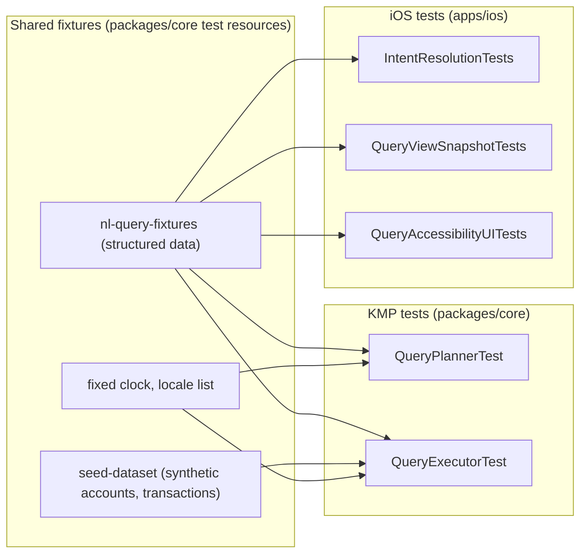

# Deterministic iOS Natural-Language Query Fixtures

> Design specification for a **deterministic, speech-independent fixture corpus**
> that pins the behavior of the on-device finance query planner and its three
> output variants — typed result, spoken (Siri) response, and VoiceOver output.
> The fixtures are the shared contract that lets KMP and iOS tests agree on
> exactly what each phrase should produce, with no reliance on a microphone,
> network, or wall-clock time.

**Status:** PROPOSED — design only (native implementation gated, see
[Implementation readiness](#implementation-readiness))
**Issue:** [#2619](https://github.com/jrmoulckers/finance/issues/2619) — _Part of
[#2386](https://github.com/jrmoulckers/finance/issues/2386)_
**Platform:** Shared KMP test resources (`packages/core`) + iOS test consumers
(`apps/ios`)
**Last updated:** 2026-06-22
**Related design docs:**
[data-model.md](./data-model.md) ·
[content-language-guidelines.md](./content-language-guidelines.md) ·
[accessibility-patterns.md](./accessibility-patterns.md) ·
[cognitive-accessibility.md](./cognitive-accessibility.md)
**Sibling docs (this cluster):**
[ios-app-intents-siri-query.md](./ios-app-intents-siri-query.md) ·
[ios-local-query-planner-clarification.md](./ios-local-query-planner-clarification.md)

---

## Table of Contents

1. [Problem and Goal](#1-problem-and-goal)
2. [Affected iOS Surfaces and Consumers](#2-affected-ios-surfaces-and-consumers)
3. [Shared Dependencies and the KMP Boundary](#3-shared-dependencies-and-the-kmp-boundary)
4. [Fixture Schema](#4-fixture-schema)
5. [Determinism Rules](#5-determinism-rules)
6. [Fixture Categories](#6-fixture-categories)
7. [Result Variants: Typed, Spoken, VoiceOver](#7-result-variants-typed-spoken-voiceover)
8. [Accessibility Fixtures](#8-accessibility-fixtures)
9. [Privacy and Synthetic Data](#9-privacy-and-synthetic-data)
10. [Empty, Stale, Error, and Low-Confidence Fixtures](#10-empty-stale-error-and-low-confidence-fixtures)
11. [Test Plan](#11-test-plan)
12. [Implementation readiness](#implementation-readiness)

---

## 1. Problem and Goal

The [planner](./ios-local-query-planner-clarification.md) and the
[Siri surface](./ios-app-intents-siri-query.md) only stay trustworthy if their
behavior is pinned. Speech recognition is non-deterministic and unavailable in
CI, so tests must never depend on it. The goal is a **single fixture corpus**
that:

- Maps each input **phrase (text)** to its expected parse and outputs — so the
  same corpus drives both KMP planner tests and iOS rendering tests.
- Is **fully deterministic**: fixed clock, fixed locale set, seeded synthetic
  dataset, no randomness, no network, no microphone.
- Covers all three **output variants** (typed, spoken, VoiceOver) plus every
  edge state (empty / error / ambiguous / low-confidence / clarification).
- Acts as the **regression anchor**: a planner or copy change that alters any
  expected value must update a fixture, making behavior changes reviewable.

## 2. Affected iOS Surfaces and Consumers

| Consumer                                 | Uses the fixtures for                                             |
| ---------------------------------------- | ----------------------------------------------------------------- |
| KMP `QueryPlannerTest` (`packages/core`) | phrase → `FinanceQuery` / `Clarification` golden assertions       |
| KMP `QueryExecutorTest`                  | `FinanceQuery` over seeded data → `QueryResult` golden assertions |
| iOS `IntentResolutionTests`              | per-intent rendering of one fixture's snippet + spoken dialog     |
| iOS `QueryViewSnapshotTests`             | typed `QueryResultView` / `ClarificationView` snapshots           |
| iOS `QueryAccessibilityUITests`          | expected VoiceOver label/value/announcement strings per fixture   |

Speech is **out of scope** for fixtures: transcription is assumed already done;
the input is always text.

## 3. Shared Dependencies and the KMP Boundary

- **KMP owns** the canonical fixture format, the seed dataset, the fixed clock,
  and the planner/executor that the fixtures assert against. Fixtures live with
  the shared tests so there is one source of truth. Synthetic data follows the
  [data-model.md](./data-model.md) shapes.
- **iOS owns** how it reads the shared fixture corpus into XCTest/XCUITest and
  asserts on rendered typed/spoken/VoiceOver output. iOS does **not** maintain a
  divergent copy of the phrases.
- **Bridge note:** the corpus is plain structured data (language-neutral), so it
  crosses to Swift without bespoke type mapping; only the expected `Aggregation`
  / `Clarification` enum tags must stay in sync with the KMP sealed types.

> Adding/altering the fixture _format_ touches shared test resources — coordinate
> with @kmp-engineer via ADR. Adding new _rows_ in the agreed format is routine.

## 4. Fixture Schema

Each fixture is one record. Conceptual shape (serialized as language-neutral
structured data, e.g. one object per case):

| Field               | Meaning                                                               |
| ------------------- | --------------------------------------------------------------------- |
| `id`                | Stable identifier (e.g. `spend.groceries.thisMonth`)                  |
| `locale`            | BCP-47 tag the phrase is written for (e.g. `en-US`, `en-GB`)          |
| `phrase`            | The input text (already transcribed; never audio)                     |
| `expectedKind`      | `query` \| `clarification` \| `unsupported`                           |
| `expectedQuery`     | For `query`: aggregation + resolved category/merchant/account/range   |
| `expectedClarify`   | For `clarification`: case + ordered candidate ids                     |
| `expectedResult`    | For `query`: the `QueryResult` over the seed dataset                  |
| `expectedTyped`     | Rendered typed answer string (template-resolved)                      |
| `expectedSpoken`    | Spoken `IntentDialog` string (may differ from typed; redaction-aware) |
| `expectedVoiceOver` | VoiceOver label/value/announcement string                             |
| `confidenceBand`    | Expected `high` \| `medium` \| `low`                                  |
| `tags`              | Category labels for filtering (see §6)                                |

Strings that are user-facing reference the same localized keys defined for the
UI (`String(localized:)`), so a copy change updates both the app and the fixture
expectation in one place — consistent with
[content-language-guidelines.md](./content-language-guidelines.md).

## 5. Determinism Rules

Non-negotiable for every fixture run:

- **Fixed clock:** a single pinned "now" (e.g. `2026-05-15T12:00:00Z`) so
  "this month", "last week", "today" resolve to byte-stable ranges. No
  `Date()` / `Clock.System` in tested paths.
- **Fixed locale set:** fixtures declare their `locale`; tests run each fixture
  under its declared locale only. No reliance on the host locale.
- **Seeded synthetic dataset:** a small, committed set of accounts,
  transactions, categories, and merchants with fixed ids/amounts/dates. No
  randomness, no generated faker data at run time.
- **No I/O:** no network, no microphone, no file access beyond reading the
  committed corpus. Speech is assumed complete; input is text.
- **Stable ordering:** ranked lists and candidate lists have a defined,
  deterministic tiebreak (amount desc, then name asc) so golden comparisons are
  exact.
- **Currency/number formatting** is pinned to the fixture locale so
  `expectedTyped` / `expectedSpoken` are exact.

## 6. Fixture Categories

The corpus is tagged so suites can select subsets:

| Tag             | Purpose                                                         | Example phrase                              |
| --------------- | --------------------------------------------------------------- | ------------------------------------------- |
| `happy.balance` | Confident balance queries                                       | "What's my balance?"                        |
| `happy.spend`   | Confident category/merchant/range spend sums                    | "How much did I spend on groceries in May?" |
| `happy.rank`    | Top-N ranked lists                                              | "Top merchants this month"                  |
| `ambiguous`     | 2–3 candidate entities → `.chooseEntity`                        | "How much on transport?" (two categories)   |
| `confirm`       | Single medium-confidence guess → `.confirmGuess`                | "Spending on dinning" (typo)                |
| `missing`       | Aggregation but no filter/range → `.missingDimension`           | "How much did I spend?"                     |
| `unsupported`   | Outside the v1 catalog → `.unsupported`                         | "Transfer 50 to savings"                    |
| `empty`         | Valid query, zero matches                                       | "Spending on travel last week" (none)       |
| `locale`        | Same intent across `en-US` / `en-GB` date and currency variance | "in May", "£" vs "$"                        |
| `sensitive`     | Triggers redaction on a locked device                           | "Balance on Checking"                       |

Every `ambiguous` / `confirm` / `missing` / `unsupported` / `empty` fixture is
paired with the expected next-step copy so the clarification UX is pinned too.

## 7. Result Variants: Typed, Spoken, VoiceOver

A single fixture pins **three** outputs because the surface presents the answer
three ways and they legitimately differ:

| Variant       | Source field        | Notes                                                                |
| ------------- | ------------------- | -------------------------------------------------------------------- |
| Typed         | `expectedTyped`     | What `QueryResultView` shows on screen; full figure when unlocked    |
| Spoken (Siri) | `expectedSpoken`    | `IntentDialog`; may omit/round a figure and redacts when locked      |
| VoiceOver     | `expectedVoiceOver` | Label/value/announcement; spells out currency and ranges for clarity |

Rules:

- **Spoken ≠ typed by design:** spoken responses are shorter and redaction-aware
  (see [Siri surface §7](./ios-app-intents-siri-query.md)); the fixture records
  both so neither drifts.
- **VoiceOver strings are explicit:** currency is read in full ("twelve dollars
  and forty cents", per locale) and ranges are read unambiguously
  ("May first to May thirty-first").
- A fixture with `confidenceBand = low` has no `expectedResult`; only
  `expectedClarify` and the three variants of the decline copy.

## 8. Accessibility Fixtures

- **Every fixture carries `expectedVoiceOver`** so VoiceOver output is a tested
  contract, not an afterthought — labels/values follow
  [accessibility-patterns.md](./accessibility-patterns.md).
- **Speech-independent by construction:** because input is text, the suite runs
  identically whether or not Siri/dictation is available — voice is an entry
  method, never a test dependency.
- **Dynamic Type fixtures:** snapshot fixtures include an `accessibility5`
  variant assertion that the figure is not truncated and the layout reflows.
- **Plain-language assertions:** clarification fixtures assert non-judgmental
  copy per [cognitive-accessibility.md](./cognitive-accessibility.md) (e.g. the
  decline string must not contain blaming language).

## 9. Privacy and Synthetic Data

- **Synthetic only:** the seed dataset is invented — no real accounts, balances,
  merchants, or amounts. Safe to commit and review.
- **On-device parity:** fixtures exercise only the on-device path; there is no
  fixture that asserts a network call, because none exists.
- **No secrets:** the corpus contains no tokens, keys, or credentials; it is
  ordinary test data and never touches Keychain.
- **GDPR / CCPA:** synthetic fixtures hold no personal data, so they create no
  subject-rights or retention obligations; they document the privacy posture
  (on-device, data-minimized) rather than weaken it.

## 10. Empty, Stale, Error, and Low-Confidence Fixtures

| State          | Fixture tag(s)      | Pinned expectation                                                 |
| -------------- | ------------------- | ------------------------------------------------------------------ |
| Empty          | `empty`             | `expectedResult` = zero; `expectedTyped/Spoken/VoiceOver` = "none" |
| Stale          | `happy.*` + `stale` | result carries an "as of <fixed time>" qualifier string            |
| Error          | `error`             | bridge/executor failure path → `unsupported` decline copy          |
| Ambiguous      | `ambiguous`         | `.chooseEntity` with ordered candidate ids (≤3)                    |
| Confirm        | `confirm`           | `.confirmGuess` with the single guessed entity id                  |
| Low confidence | `unsupported`       | `confidenceBand = low`, no result, decline copy in all 3 variants  |

Each edge fixture asserts the **next-step affordance** copy as well, so the
no-dead-end rule from the sibling docs is regression-protected.

## 11. Test Plan

The fixtures _are_ the test plan's backbone; this section names the smallest
suites that consume them.

**Shared (KMP, `packages/core`) — JVM, no device:**

1. `FixtureLoaderTest` — corpus parses, ids are unique, every fixture has the
   fields its `expectedKind` requires.
2. `QueryPlannerTest` — for each fixture, `phrase` → `expectedKind` and the
   matching `expectedQuery` / `expectedClarify` (golden).
3. `QueryExecutorTest` — for each `query` fixture, `expectedResult` over the seed
   dataset under the fixed clock.

**Native (iOS, Simulator — free signing):**

4. `IntentResolutionTests` — one fixture per intent renders `expectedSpoken`
   and the snippet matching `expectedTyped`.
5. `QueryViewSnapshotTests` — `expectedTyped` and clarification rendering match
   reference snapshots, including the `accessibility5` variant.
6. `QueryAccessibilityUITests` — VoiceOver output equals `expectedVoiceOver`;
   the suite runs with speech disabled to prove independence.

A planner/copy change that alters any expected value must update the
corresponding fixture in the same PR — making behavior changes explicit and
reviewable. CI: shared in `ci-shared.yml`, native in `ci-ios.yml` (Simulator);
no signing or device farm required.

## Implementation readiness

**Design: ready now. Native code: buildable now, distribution gated.**

Per the
[Human-Gated Prerequisites runbook](../ops/human-gated-prerequisites.md#2-implementation-vs-distribution--the-decoupling),
implementation and distribution are decoupled. The "blocked by
[#1239](https://github.com/jrmoulckers/finance/issues/1239)" note on
[#2619](https://github.com/jrmoulckers/finance/issues/2619) is a **distribution**
gate only.

| Phase              | What                                                                   | Gated by #1239?                     |
| ------------------ | ---------------------------------------------------------------------- | ----------------------------------- |
| **Design**         | This document, fixture schema, determinism rules, categories, variants | No — deliverable now                |
| **Implementation** | Committed corpus + KMP golden tests + iOS XCTest/XCUITest consumers    | **No** — free Personal Team signing |
| **Distribution**   | TestFlight / App Store build carrying the fixture-backed feature       | **Yes** — Apple Developer Program   |

- **Buildable now:** the fixture corpus is plain data; KMP golden tests run on
  the JVM with no Apple account; iOS XCTest/XCUITest consumers run on Simulator
  and on-device via free Personal Team signing. None of it needs speech, network,
  or paid entitlements.
- **Gated tail (#1239):** only store/TestFlight distribution needs the paid
  enrollment + signing material in
  [human-gated-prerequisites.md §3.2](../ops/human-gated-prerequisites.md#32-ios-distribution--apple-developer-1239).
  An SME agent must **not** perform enrollment, certificate, or secret steps.

_Part of [#2386](https://github.com/jrmoulckers/finance/issues/2386). Sibling
designs: [App Intents and Siri surface](./ios-app-intents-siri-query.md) ·
[local query planner and clarification](./ios-local-query-planner-clarification.md)._
