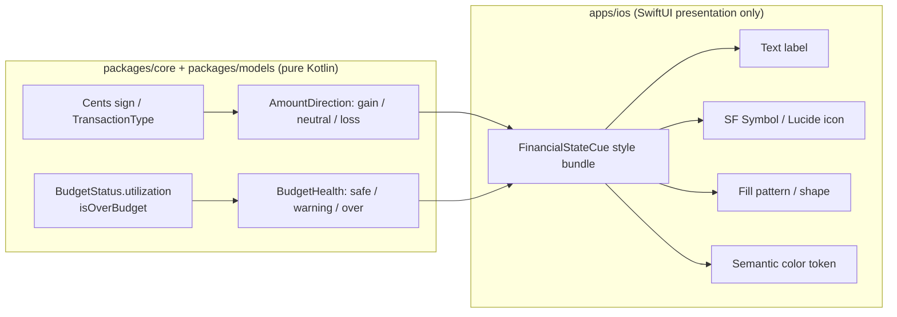

# Semantic Non-Color Financial State Cues — iOS

> Design specification for communicating financial state — **gain, loss,
> over-budget, safe, warning** — on Apple platforms without relying on color
> alone. Every state is recoverable from text, SF Symbols / icons, and shape /
> pattern, with color-vision-deficiency (CVD) safe design tokens as a
> redundant, never primary, channel.

**Status:** Design (implementation-ready) · pre-implementation
**Issue:** [#2552](https://github.com/jrmoulckers/finance/issues/2552) — Semantic non-color financial state cues for iOS
**Part of:** [#2121](https://github.com/jrmoulckers/finance/issues/2121)
**Platforms:** iOS · iPadOS · macOS (Catalyst-free SwiftUI) · watchOS · WidgetKit · App Clip
**WCAG target:** 2.2 Level AA (AAA where practical) — SC 1.4.1 Use of Color, SC 1.4.11 Non-text Contrast
**Related:** [accessibility-patterns.md](./accessibility-patterns.md) · [cognitive-accessibility.md](./cognitive-accessibility.md) · [data-visualization.md](./data-visualization.md) · [icon-system-ios.md](./icon-system-ios.md) · [token-preview.md](./token-preview.md) · [Human-Gated Prerequisites](../ops/human-gated-prerequisites.md)

---

## Table of Contents

1. [Problem & Goals](#1-problem--goals)
2. [Semantic State Model](#2-semantic-state-model)
3. [Cue Vocabulary (text + symbol + pattern + token)](#3-cue-vocabulary-text--symbol--pattern--token)
4. [Design Tokens & CVD Safety](#4-design-tokens--cvd-safety)
5. [Affected iOS Surfaces](#5-affected-ios-surfaces)
6. [Shared Dependencies & the Classification Boundary](#6-shared-dependencies--the-classification-boundary)
7. [Accessibility & Dynamic Type](#7-accessibility--dynamic-type)
8. [Privacy](#8-privacy)
9. [Stale, Error & Empty States](#9-stale-error--empty-states)
10. [Test Plan](#10-test-plan)
11. [Implementation Readiness](#11-implementation-readiness)
12. [Open Questions](#12-open-questions)

---

## 1. Problem & Goals

Finance currently signals positive vs. negative money primarily by color: green
for income/gains, red for expenses/losses, amber for budget warnings. This
fails [`accessibility-patterns.md` §5.3 — Never Convey Information by Color
Alone](./accessibility-patterns.md#53-never-convey-information-by-color-alone)
for the ~8% of users with a color-vision deficiency, for grayscale / e-ink /
Always-On Lock Screen rendering, and for high-glare outdoor use. Red/green is
the single worst pairing for the most common CVD types (protanopia,
deuteranopia).

**Goals**

- Make every financial-state distinction (gain / loss / over-budget / safe /
  warning) **fully recoverable without color** — from text, SF Symbol shape,
  and fill pattern.
- Keep color as a **redundant** reinforcement, sourced only from contrast-tuned
  **semantic design tokens**, never literal `Color.red` / `Color.green`.
- Reuse the existing iOS accessibility, icon, and token infrastructure rather
  than inventing parallel systems.
- Keep the _state classification_ platform-neutral (shared Kotlin) and only the
  _presentation_ on the SwiftUI side — a clean, testable boundary.

**Non-goals**

- No new color palette is introduced; this doc governs _how_ existing tokens are
  paired with non-color cues.
- No native store build, signing, or distribution work (see
  [§11](#11-implementation-readiness)).
- Changing the shared classification thresholds is out of scope — they are
  reused as-is from `packages/core`.

### The grayscale acceptance bar

> **Rule of thumb:** Print any state-bearing screen in grayscale. If a user can
> still tell gain from loss, and safe from warning from over-budget, the cue
> passes. If two states collapse into the same gray, the cue fails.

---

## 2. Semantic State Model

Five semantic states cover the financial surfaces in scope. They split into two
independent axes so they compose (e.g., a transaction is a _loss_; a budget can
be _over_):

| Axis              | States                    | Source of truth (shared)                                 |
| ----------------- | ------------------------- | -------------------------------------------------------- |
| **Amount sign**   | `gain`, `neutral`, `loss` | Sign of `Cents` / `TransactionType` in `packages/models` |
| **Budget health** | `safe`, `warning`, `over` | `BudgetHealth` in `packages/core`                        |

These map onto the design-token semantic status layer already present in
[`FinanceColors`](../../apps/ios/Finance/Theme/FinanceColors.swift)
(`amountPositive`, `amountNegative`, `statusPositive`, `statusWarning`,
`statusNegative`, `statusInfo`).

The thresholds are **not** redefined on iOS. `BudgetHealth` is computed in
[`BudgetCalculator.kt`](../../packages/core/src/commonMain/kotlin/com/finance/core/budget/BudgetCalculator.kt):
`OVER` when utilization `> 1.0` (100%), `WARNING` at `> 0.75` (75%), else
`HEALTHY`. iOS consumes the enum; it never reimplements the math.

---

## 3. Cue Vocabulary (text + symbol + pattern + token)

Each state binds **four redundant channels**. Channels 1–3 are color-independent;
channel 4 is reinforcement only. SF Symbol names below already exist in the
shared icon vocabulary ([`IconToken`](../../apps/ios/Finance/Components/IconToken.swift),
rendered via `SFSymbolsMapping.swift` per [icon-system-ios.md](./icon-system-ios.md)).

### 3.1 Amount direction (transactions, balances, net worth, trends)

| State     | 1 · Text label          | 2 · SF Symbol (shape)            | 3 · Sign / pattern   | 4 · Token (reinforce) |
| --------- | ----------------------- | -------------------------------- | -------------------- | --------------------- |
| `gain`    | "Income" / "Up 4.2%"    | `arrow.up.right` (`trending-up`) | leading `+`          | `amountPositive`      |
| `neutral` | "No change" / "Zero"    | `minus` / `equal`                | no sign              | `textSecondary`       |
| `loss`    | "Expense" / "Down 2.1%" | `arrow.down.right`               | leading `−` (U+2212) | `amountNegative`      |

The **arrow direction** (up-right vs. down-right) and the **explicit ± sign** are
the primary distinguishers. Both survive grayscale and all CVD types. For Swift
Charts trend lines, follow [data-visualization.md](./data-visualization.md) and
the IBM CVD-safe series palette in
[`ChartColorPalette`](../../apps/ios/Finance/Charts/ChartColorPalette.swift); a
gain/loss delta annotation always carries the arrow + signed value, not a bare
colored line.

### 3.2 Budget health (budget cards, progress bars/rings, goals)

Budget health uses **three shape-distinct symbols** so the trio is separable in
grayscale and for monochromatic vision — a circle, a circle-with-bang, and a
triangle are unmistakable by silhouette:

| State     | 1 · Text label                 | 2 · SF Symbol (silhouette)                          | 3 · Progress fill pattern        | 4 · Token        |
| --------- | ------------------------------ | --------------------------------------------------- | -------------------------------- | ---------------- |
| `safe`    | "On track · $120 left"         | `checkmark.circle.fill` (`circle-check`) — ◯✓       | solid fill                       | `statusPositive` |
| `warning` | "Approaching limit · 82% used" | `exclamationmark.circle.fill` (`circle-alert`) — ◯! | diagonal-hatch fill (45°)        | `statusWarning`  |
| `over`    | "Over by $35 · 112% used"      | `exclamationmark.triangle.fill` (`triangle-alert`)  | dense cross-hatch + end-cap flag | `statusNegative` |

Key non-color reinforcements for progress bars/rings (per
[data-visualization.md](./data-visualization.md) progress tokens):

- **Fill pattern** escalates with severity (solid → 45° hatch → cross-hatch).
  Implement with a SwiftUI `Canvas`/`Shape` overlay so the pattern is part of the
  geometry, not a texture image (scales with Dynamic Type, stays crisp).
- **Over-budget end-cap flag** (`flag` icon at the 100% mark) shows the overshoot
  segment beyond the track, so "over" reads even when the whole bar is one color.
- **Numeric redundancy:** always print `% used` and the signed remaining amount;
  never rely on bar length alone.

### 3.3 Composition rule

A surface may show both axes at once (e.g., a Goals card: a _loss_ contribution
that pushes the goal into _warning_). Compose by **stacking labels** and placing
the budget-health symbol as the leading status glyph and the amount sign inline
with the value. Never let two cues fight for the same color region; the token of
the **more severe** state wins the accent, the other is expressed in text +
symbol only.

---

## 4. Design Tokens & CVD Safety

- **Source of color:** semantic tokens only. iOS reads
  [`FinanceColors`](../../apps/ios/Finance/Theme/FinanceColors.swift)
  (`amountPositive`, `amountNegative`, `statusPositive`, `statusWarning`,
  `statusNegative`, `statusInfo`) which are derived from
  `packages/design-tokens` and already light/dark adaptive. **Banned:** literal
  `Color.red`, `Color.green`, `.orange`, or raw hex in state cues. A lint/unit
  check enforces this (see [§10](#10-test-plan)).
- **High contrast:** when `colorSchemeContrast == .increased`, prefer the darker
  token variant and thicken pattern strokes; cue legibility must not depend on
  the increased-contrast color shift.
- **CVD safety:** because the gain/loss/safe/warning/over distinctions are
  carried by **shape and text**, they are CVD-safe by construction. The token
  colors are a redundant layer. For multi-series charts that accompany state
  cues, use the IBM CVD-safe palette already shipped in
  [`ChartColorPalette`](../../apps/ios/Finance/Charts/ChartColorPalette.swift)
  (blue `#648FFF`, purple `#785EF0`, magenta `#DC267F`, orange `#FE6100`, gold
  `#FFB000`, teal `#009E73`).
- **Contrast budget:** every token/background pairing used for a cue meets WCAG
  AA non-text contrast (≥3:1) for the symbol and ≥4.5:1 for the label text, per
  [`accessibility-patterns.md` §5.1](./accessibility-patterns.md#51-wcag-aa-contrast-requirements).

---

## 5. Affected iOS Surfaces

State cues are a cross-cutting concern. The following surfaces in `apps/ios`
present financial state and must adopt the vocabulary in [§3](#3-cue-vocabulary-text--symbol--pattern--token):

| Surface                             | Where (`apps/ios`)                       | States shown                          |
| ----------------------------------- | ---------------------------------------- | ------------------------------------- |
| Dashboard / Home (net worth, trend) | `Finance/Screens` · `Finance/ViewModels` | gain / loss / neutral; budget summary |
| Accounts list & detail              | `Finance/Screens` (Accounts)             | balance sign; credit utilization      |
| Transactions list & detail          | `Finance/Screens` (Transactions)         | gain (income) / loss (expense)        |
| Budgets (cards, bars, rings)        | `Finance/Screens` (Budgets)              | safe / warning / over                 |
| Goals / progress                    | `Finance/Screens` (Goals)                | on-track vs. behind (safe/warning)    |
| Reports / Insights (Swift Charts)   | `Finance/Charts` · `Finance/Screens`     | gain / loss deltas, budget bands      |
| Home / Lock Screen widgets          | `apps/ios/FinanceWidget`                 | balance sign; budget remaining        |
| watchOS app + complications         | `apps/ios/FinanceWatch`                  | balance sign; budget remaining        |
| App Clip (bill splitting)           | `apps/ios/FinanceClip`                   | per-person owed (loss) / owed-to-you  |
| Siri / App Intents responses        | `Finance/Intents`                        | spoken state ("you are over budget")  |

**Shared iOS plumbing to reuse (do not duplicate):**

- VoiceOver: [`AccessibilityModifiers.swift`](../../apps/ios/Finance/Accessibility/AccessibilityModifiers.swift)
  (`financeLabel`, `financeHint`, `financeCurrencyLabel`, `financeHeading`,
  `financeLiveRegion`, `financeLiveBalance`, `announceForAccessibility`).
- Dynamic Type: `FinanceTextStyle` + `financeFont`, `@ScaledMetric` /
  `@ClampedScaledMetric`, and `AdaptiveFinanceStack` in
  `Finance/Accessibility/DynamicTypeSupport.swift`.
- Icons: `IconToken` + `SFSymbolsMapping.swift` / `LucideMapping.swift`
  ([icon-system-ios.md](./icon-system-ios.md)).
- Haptics (optional severity cue): `HapticManager` — a _warning_/_error_
  haptic on a budget crossing reinforces the visual change for low-vision users
  but is never the sole channel.

A small new presentation type (e.g., `FinancialStateCue` + a
`stateCue(_:)` view modifier) is proposed to centralize the mapping from a
neutral shared state to the (label, symbol, pattern, token) bundle. This is
**iOS-owned** and lives under `Finance/Components` — described here, **not**
implemented in this PR.

---

## 6. Shared Dependencies & the Classification Boundary

The line between "what state is this?" (shared) and "how do we show it?" (iOS)
is deliberate and testable.

| Concern                                     | Owner                              | Artifact                                                            |
| ------------------------------------------- | ---------------------------------- | ------------------------------------------------------------------- |
| Budget health thresholds (75%/100%)         | `packages/core` (KMP, pure Kotlin) | `BudgetCalculator.calculateStatus` → `BudgetStatus`, `BudgetHealth` |
| Over-budget flag, utilization               | `packages/core`                    | `BudgetStatus.isOverBudget`, `BudgetStatus.utilization`             |
| Amount sign / income vs. expense            | `packages/models`                  | `Cents` sign, `TransactionType.EXPENSE` / `INCOME`                  |
| Currency formatting                         | `packages/core`                    | `MoneyFormatter` / `MoneyOperations`                                |
| Neutral state → (text/symbol/pattern/token) | **`apps/ios`**                     | proposed `FinancialStateCue` mapping (SwiftUI)                      |
| VoiceOver phrasing, Dynamic Type            | **`apps/ios`**                     | `AccessibilityModifiers.swift`, `DynamicTypeSupport.swift`          |

**Boundary rules**

1. iOS must **never** hard-code the 75% / 100% thresholds, the over-budget
   comparison, or income/expense sign logic. It consumes `BudgetHealth` and the
   `Cents` sign as opaque, pre-classified inputs.
2. If a _new_ platform-neutral enum is desirable (e.g., a unified
   `AmountDirection { GAIN, NEUTRAL, LOSS }` so Android/Web/Windows can share the
   exact same semantics), that addition belongs in `packages/core` /
   `packages/models` and must be proposed via **ADR to @architect / @native-app-engineer**
   — per [AGENTS.md](../../AGENTS.md) the iOS engineer does not edit `packages/`
   directly. Until then, iOS derives direction from the existing `Cents` sign /
   `TransactionType` at the bridge.
3. The KMP→Swift bridge maps Kotlin `enum`/`sealed` → Swift `enum` (see
   [FinanceSync XCFramework conventions](../architecture/) and the project's KMP
   export notes). The iOS cue layer switches over that Swift enum **exhaustively**
   (no `default:`), so adding a future state is a compile error until iOS handles
   it.

This keeps the four platforms semantically aligned while letting each render
natively.

---

## 7. Accessibility & Dynamic Type

State cues must satisfy the
[Accessibility Checklist](./accessibility-patterns.md#appendix-a-accessibility-checklist-for-new-components)
and [cognitive-accessibility.md](./cognitive-accessibility.md) plain-language
rules.

**VoiceOver**

- Every cue carries a state word in its label — "gain", "loss", "over budget",
  "on track", "approaching limit" — **never** a color word ("red", "green").
  Build labels with `financeCurrencyLabel` / `financeLabel`; e.g.
  _"Expense, $45.00"_, _"Budget Groceries, over budget by $35, 112 percent used"_.
- Negative amounts announce "expense" / "negative" explicitly (the minus glyph is
  unreliable for AT), per
  [`accessibility-patterns.md` §7.1](./accessibility-patterns.md#71-currency-formatting-for-screen-readers).
- Live balance and sync-status changes use `financeLiveRegion` /
  `announceForAccessibility` so a state transition (e.g., crossing into
  over-budget) is spoken without focus.
- The status symbol and the value should form **one** accessibility element
  (`.accessibilityElement(children: .combine)`) so VoiceOver reads
  "over budget, $35 over" as a single, coherent utterance.

**Dynamic Type**

- All labels use `FinanceTextStyle` / `.financeFont(...)`; never hard-coded point
  sizes (per [iOS deployment rules](../../AGENTS.md)).
- Status symbols size with `@ScaledMetric` so the glyph grows with text and never
  becomes a sub-minimum tap/read target.
- At accessibility text sizes (AX1–AX5), inline `[symbol][amount][label]` rows
  reflow to vertical via `AdaptiveFinanceStack` (HStack → VStack). Pattern fills
  on progress bars keep a **minimum 2pt stroke spacing** at the largest size so
  hatching stays distinguishable rather than smearing to solid.
- Touch targets for any tappable cue (e.g., a budget card) stay ≥44pt
  ([§8 Touch Target Sizing](./accessibility-patterns.md#8-touch-target-sizing)).

**Reduce Motion / Differentiate Without Color**

- Honor `accessibilityReduceMotion`: a state transition animates as a cross-fade
  or static swap, not a sweep.
- Honor `accessibilityDifferentiateWithoutColor`: when **on**, increase pattern
  prominence and always show the text label even in compact widget layouts.

---

## 8. Privacy

Financial values are sensitive; state cues must not leak them.

- **Logging:** use `os.Logger` with the **state category only** at
  `.public` and amounts at `.private`. Log `"budget.health=over"` —
  **never** `"over by $35"`. Per project rule, financial data is `.private`.
- **Widgets / Lock Screen / Always-On:** wrap monetary values in
  `.privacySensitive()` and `.redacted(reason: .privacy)` when the device is
  locked or the user enabled "Hide sensitive content". The **shape cue may
  remain** (an arrow or a triangle reveals direction/severity but not an amount),
  while the number is masked — a deliberate, useful degradation.
- **Screenshots / share sheets:** the share/export path must redact amounts the
  same way the on-screen privacy mode does.
- **Siri / App Intents:** spoken state responses respect the device-locked
  state; on the Lock Screen, Siri confirms the _category_ ("You're over your
  Groceries budget") and defers the figure until unlocked, mirroring Apple's
  banking-app guidance.
- **No secrets in cue plumbing:** the cue layer reads already-decrypted view
  state; it never touches Keychain or tokens. (Secrets remain in Apple Keychain
  with `kSecAttrAccessibleWhenUnlockedThisDeviceOnly`, unchanged by this work.)

---

## 9. Stale, Error & Empty States

State cues must not assert a financial conclusion the data can't support.

**Stale data (last sync is old)**

- Show a sync-age annotation with a neutral symbol: `clock` + "Updated 2h ago".
  Gain/loss and budget-health cues remain visible but are **timestamp-qualified**
  ("as of 2h ago") so a user doesn't read a stale "on track" as live truth.
- When stale beyond a threshold, dim the accent token one step and keep full text
  - symbol (color de-emphasis only; never remove the non-color cue).

**Error (refresh failed / offline)**

- Offline: `wifi.slash` (`wifi-off`) + "Offline — showing last synced". Use
  `statusInfo`/`textSecondary`, **not** `statusNegative` — being offline is not a
  financial loss, and reusing the loss color would be a false cue.
- Sync error: `arrow.triangle.2.circlepath` + "Couldn't refresh" with a Retry
  button (≥44pt). Announce via `announceForAccessibility`.
- A refresh failure must **never** flip a cached `safe` budget to `over`; the
  last known good classification is shown with the error annotation.

**Empty (no data yet)**

- No budget set: neutral placeholder — `target`/`piggy-bank` symbol + "No budget
  yet" + a CTA. **Do not** render `safe` (green check) or `over` (red triangle)
  for the absence of data; an unset budget is neither.
- No transactions: "No activity this period", neutral token, no gain/loss arrow.
- Zero values: a `$0.00` balance is `neutral` ("equal"/"no change"), distinct
  from both gain and loss. `BudgetCalculator` already guards zero-budget
  utilization (returns `0.0`), so iOS renders `safe`/neutral, never a divide
  artifact.

---

## 10. Test Plan

The smallest set of tests that must be **green before implementation is accepted**.
Tests are split by where they run; all of them run **without** Apple Developer
enrollment (KMP `commonTest` on the JVM; Swift unit/snapshot tests in the iOS
Simulator).

### 10.1 Shared (Kotlin · `packages/core` · `commonTest`)

These guard the classification boundary. Most extend existing suites
([`BudgetCalculatorTest`](../../packages/core/src/commonTest/kotlin/com/finance/core/budget/BudgetCalculatorTest.kt),
`BudgetUtilizationTrackingTest`) — **owned by @native-app-engineer**; this doc only
specifies the cases iOS depends on:

- `BudgetHealth` boundary classification: 74.9% → `HEALTHY`, exactly 75.0% →
  `HEALTHY`, 75.01% → `WARNING`, exactly 100.0% → `WARNING`, 100.01% → `OVER`.
- `isOverBudget` true iff `spent > amount` (not `>=`).
- Zero-budget guard: `amount == 0` → `utilization == 0.0`, never NaN/∞.
- Amount sign classification (positive → gain, zero → neutral, negative → loss)
  for `Cents` / `TransactionType`.

### 10.2 Native (Swift · iOS Simulator · XCTest)

Owned by @native-app-engineer:

| Test                              | Asserts                                                                                           |
| --------------------------------- | ------------------------------------------------------------------------------------------------- |
| `FinancialStateCueMappingTests`   | Exhaustive enum → (label, SF Symbol, pattern, token) mapping; **no** missing case / `fatalError`. |
| `StateCueAccessibilityLabelTests` | Each state's VoiceOver label contains its state word + currency context; never a color word.      |
| `StateCueColorTokenTests`         | Cue colors come from `FinanceColors` tokens; **no** literal `Color.red`/`.green`/raw hex used.    |
| `StateCueContrastTests`           | Token/background pairs meet WCAG AA (reuse the contrast helper); symbols ≥3:1.                    |
| `StateCueDynamicTypeTests`        | Layout reflows HStack→VStack at AX sizes; pattern stroke spacing ≥2pt at AX5.                     |
| `StateCueGrayscaleSnapshotTests`  | Reference snapshots in grayscale + simulated CVD remain pairwise distinguishable (the §1 bar).    |
| `WidgetPrivacyRedactionTests`     | Locked/"hide sensitive" → amount redacted, shape cue retained.                                    |
| `StaleErrorEmptyStateTests`       | Offline uses info (not loss) token; refresh failure never flips `safe`→`over`; empty ≠ safe/over. |

### 10.3 Manual / QA gate (every UI PR)

Per [`accessibility-patterns.md` Appendix B](./accessibility-patterns.md#appendix-b-testing-strategy):
VoiceOver walkthrough (iOS + watchOS), Dynamic Type at largest size, grayscale +
Color Filters (Settings → Accessibility → Display & Text Size → Color Filters),
Reduce Motion, and Increase Contrast.

---

## 11. Implementation Readiness

Per the [Human-Gated Prerequisites runbook §2 — Implementation vs.
Distribution](../ops/human-gated-prerequisites.md#2-implementation-vs-distribution--the-decoupling),
this feature splits cleanly. **The design and the entire native implementation
are buildable now;** only the distribution tail is gated by Apple Developer
enrollment [#1239](https://github.com/jrmoulckers/finance/issues/1239).

### ✅ Buildable now — no enrollment required

- This design document (no platform gating at all).
- Shared classification in `packages/core` / `packages/models` and its
  `commonTest` suite (JVM — no Apple account).
- SwiftUI cue components, the `FinancialStateCue` mapping, and all
  [§10.2](#102-native-swift--ios-simulator--xctest) Swift unit/snapshot tests in
  the **iOS Simulator** (no signing needed for unit tests).
- On-device verification (VoiceOver, Dynamic Type, grayscale, watch + widget) via
  **free Personal Team signing** (a free Apple ID in Xcode). Limits — 7-day app
  expiry, max 3 apps/device, no push/paid entitlements — are all acceptable for
  verifying these cues.

### 🔒 Distribution tail — gated by #1239 (human action)

These are **out of scope for this issue** and must not be attempted by an agent:

- TestFlight / App Store builds of the cue work and release signing.
- Production widget timeline distribution requiring paid entitlements.
- Any store submission.

When implementation reaches that boundary, follow the human checklist in
[Human-Gated Prerequisites §3.2 — iOS distribution (Apple Developer #1239)](../ops/human-gated-prerequisites.md#32-ios-distribution--apple-developer-1239)
and stop with a `## Needs Human Action` note. **Do not** perform payment,
enrollment, certificate/profile creation, or GitHub secret configuration.

---

## 12. Open Questions

1. **Shared `AmountDirection` enum?** Should `GAIN / NEUTRAL / LOSS` be promoted
   into `packages/core` so all four platforms share one classification, or stay
   derived per-platform from `Cents` sign? → ADR to @architect / @native-app-engineer.
2. **Pattern fidelity on watchOS / complications:** hatch fills may be too dense
   on small complications; fall back to symbol + sign only there? Validate during
   implementation on-device.
3. **Haptic severity mapping:** confirm a `warning`/`error` haptic on budget
   crossings is desirable by default or opt-in via existing
   `HapticFeedbackPreferences`.
