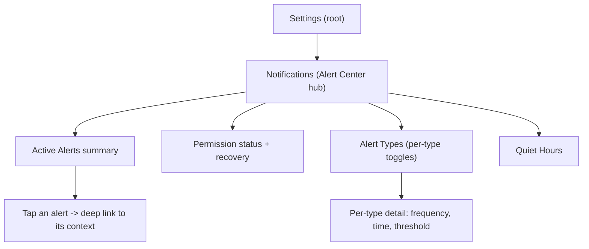
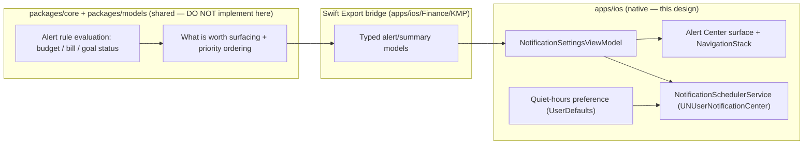

# iOS Notification Center — Navigation & Summary Design

> A design for the **alert center**: the Settings entry point, the at-a-glance
> active-alert summary, the permission and quiet-hours states, and the
> information architecture that turns today's buried notification toggles into a
> coherent surface. Native scheduling stays in iOS; the rules that decide _what_
> is worth surfacing stay shared.

**Status:** PROPOSED — design only (native implementation buildable now; store distribution gated)
**Issue:** [#2595](https://github.com/jrmoulckers/finance/issues/2595) — Part of [#2163](https://github.com/jrmoulckers/finance/issues/2163)
**Platform:** iOS / iPadOS (SwiftUI, `@Observable`, iOS 17+)
**Owner:** @native-app-engineer
**Related:** [ios-finance-alert-rules-deeplinks.md](./ios-finance-alert-rules-deeplinks.md) · [ios-smart-notification-timing.md](./ios-smart-notification-timing.md) · [information-architecture.md](./information-architecture.md) · [accessibility-patterns.md](./accessibility-patterns.md) · [content-language-guidelines.md](./content-language-guidelines.md) · [Human-Gated Prerequisites](../ops/human-gated-prerequisites.md)

---

## Table of Contents

1. [Goal & Scope](#1-goal--scope)
2. [Current State](#2-current-state)
3. [Information Architecture](#3-information-architecture)
4. [Navigation Model](#4-navigation-model)
5. [Active-Alert Summary](#5-active-alert-summary)
6. [Permission States](#6-permission-states)
7. [Quiet Hours](#7-quiet-hours)
8. [Empty, Stale & Error States](#8-empty-stale--error-states)
9. [Privacy & Balance Hiding](#9-privacy--balance-hiding)
10. [Accessibility](#10-accessibility)
11. [Native ↔ KMP Boundary](#11-native--kmp-boundary)
12. [Affected Surfaces & Shared Dependencies](#12-affected-surfaces--shared-dependencies)
13. [Test Plan (Smallest Tests First)](#13-test-plan-smallest-tests-first)
14. [Implementation Readiness](#14-implementation-readiness)
15. [Open Questions](#15-open-questions)

---

## 1. Goal & Scope

Today a user who wants to understand "what is the app telling me, and what will
it tell me next?" has to open **Settings → Notifications** and read a flat list
of toggles. There is no single place that answers _what is active right now_,
_did I grant permission_, and _when am I muted_. This design specifies a
**Notification (Alert) Center**: a humans-first summary surface plus the
information architecture and navigation around it.

**In scope:**

- The Settings **entry point** and the route into a dedicated alert center.
- An **active-alert summary** built from the existing `SmartAlert` model.
- A clear **permission state** model (not-determined / authorized / denied /
  provisional) with a recovery path to system Settings.
- A **quiet-hours** summary and its place in the IA (the timing _policy_ lives
  in [ios-smart-notification-timing.md](./ios-smart-notification-timing.md)).
- Empty / stale / error states, privacy in previews, and accessibility.

**Out of scope:**

- The _actionable_ notification categories and deep-link destinations — see
  [ios-finance-alert-rules-deeplinks.md](./ios-finance-alert-rules-deeplinks.md).
- The on-device _timing_ heuristics — see
  [ios-smart-notification-timing.md](./ios-smart-notification-timing.md).
- The alert-rule **math** itself, which is shared KMP work ([§11](#11-native--kmp-boundary)).

---

## 2. Current State

Grounded in the repository as it stands:

- [`NotificationSettingsView`](../../apps/ios/Finance/Screens/NotificationSettingsView.swift)
  is a flat `List` with three sections — a permission section, a per-type
  toggle section (`Alert Types`), and a conditional `Smart Alerts` section.
- [`NotificationSettingsViewModel`](../../apps/ios/Finance/ViewModels/NotificationSettingsViewModel.swift)
  is `@Observable`, owns `schedules`, `smartAlerts`, `permissionGranted`, and
  `permissionStatus`, and already loads alerts via the scheduler.
- [`NotificationSchedulerService`](../../apps/ios/Finance/Services/NotificationSchedulerService.swift)
  is an `actor` that wraps `UNUserNotificationCenter` (permission, scheduling,
  cancellation) and generates `SmartAlert`s on-device.
- [`NotificationModels`](../../apps/ios/Finance/Models/NotificationModels.swift)
  defines `NotificationType`, `NotificationSchedule`, `SmartAlert`, and
  `AlertPriority` — the vocabulary this center renders.
- There is **no** dedicated summary surface and **no** quiet-hours concept yet.

**Conclusion:** the data and the scheduler exist; this design supplies the
missing _surface_ and _structure_, reusing the models unchanged.

---

## 3. Information Architecture

The center is a hub reached from Settings, not a sixth tab. It groups four
concerns that are currently flattened: _status_, _what's active_, _what types_,
and _when muted_.



The hub keeps the existing `Alert Types` list intact (it already works) and adds
two siblings — a **summary** at the top and **Quiet Hours** below — plus a
hardened **permission** block. This mirrors the cross-platform
[information-architecture.md](./information-architecture.md) principle of one
predictable home per concern.

---

## 4. Navigation Model

The center uses a `NavigationStack` driven by a type-safe route enum so that a
notification tap (from the alert-rules design) and an in-app tap converge on the
same destinations.

```swift
// New, additive — does not modify existing files in this design.
enum NotificationRoute: Hashable, Sendable {
    case alertTypes
    case typeDetail(NotificationType)
    case quietHours
    case permission
}
```

- The hub is pushed from `SettingsView`'s existing Notifications row; it owns a
  `NavigationPath` and renders destinations via `.navigationDestination(for:)`.
- The **summary rows** do not navigate within the center — they emit the same
  `AppDeepLink` values defined in
  [ios-finance-alert-rules-deeplinks.md](./ios-finance-alert-rules-deeplinks.md),
  so tapping a "Groceries over budget" summary lands on the budget, identical to
  tapping the system notification.
- All view models stay `@Observable`; no `ObservableObject`. State updates that
  touch UI run on `@MainActor`; `UNUserNotificationCenter` access stays inside
  the `NotificationSchedulerService` actor.

---

## 5. Active-Alert Summary

The summary answers "what is the app flagging right now?" using the existing
`SmartAlert` array, already sorted by `AlertPriority`.

- **Header** shows a count ("3 active") and is announced as a single VoiceOver
  element, matching the current `smartAlertsSection` header pattern.
- **Rows** show title, a one-line body, and a priority chip. Priority must
  **not** be conveyed by color alone (see
  [§10](#10-accessibility)); the chip carries its text label
  (`Urgent` / `High` / `Normal` / `Low`) and a non-color glyph.
- **Tone** follows
  [content-language-guidelines.md](./content-language-guidelines.md#notification-and-push-alert-guidelines):
  no shaming language, action-oriented, plain.
- The summary is a **projection** of repository data through the scheduler; it
  holds no money of its own and stores nothing new.

---

## 6. Permission States

Authorization is a first-class state, not a single boolean. The center renders
each `UNAuthorizationStatus` distinctly and always offers a forward path.

| Status                       | What the user sees                                       | Primary action                            |
| ---------------------------- | -------------------------------------------------------- | ----------------------------------------- |
| `.notDetermined`             | Value explainer + **Enable** button                      | Request authorization                     |
| `.authorized` / `.ephemeral` | "Notifications on" confirmation                          | None (manage types below)                 |
| `.provisional`               | "Delivering quietly" note + **Promote** affordance       | Request full authorization                |
| `.denied`                    | Calm explainer that the choice lives in **iOS Settings** | Deep link to `UIApplication.openSettings` |

- The request path reuses
  [`requestPermission()`](../../apps/ios/Finance/ViewModels/NotificationSettingsViewModel.swift);
  on grant, default schedules apply exactly as today.
- The denied state never nags. It states the fact once and provides the system
  Settings link — convenience, never coercion.
- Status is re-read on `.task` and on `scenePhase` return-to-foreground, because
  the user may have changed it in iOS Settings while away.

---

## 7. Quiet Hours

Quiet hours is the user-facing control surface; the _policy_ that consumes it
(and the Focus-aware fallbacks) is specified in
[ios-smart-notification-timing.md](./ios-smart-notification-timing.md).

- A simple **start/end time** pair plus an on/off toggle, persisted in
  `UserDefaults` (a preference, **not** a secret — secrets stay in Keychain).
- The summary line reads, e.g., "Muted 10:00 PM – 7:00 AM". During quiet hours
  the center shows a small "Quiet hours active" banner so a missing alert is
  explained, never mysterious.
- Quiet hours shifts _delivery time_ only; it never suppresses an alert's
  existence in the in-app summary, so nothing is silently lost.

---

## 8. Empty, Stale & Error States

| Condition   | Behavior                                                                                                                                                                                                 |
| ----------- | -------------------------------------------------------------------------------------------------------------------------------------------------------------------------------------------------------- |
| **Empty**   | No active alerts → a reassuring empty state ("You're all caught up"), not a blank section. The `Alert Types` list still renders so the user can configure.                                               |
| **Stale**   | Alerts carry the moment they were generated; past a threshold the summary shows "Updated {relative}" so a stale list is labeled, not trusted blindly.                                                    |
| **Offline** | Generation runs against the **local** repositories, so the summary is always available offline; a small "Offline — based on local data" note sets expectations.                                          |
| **Error**   | A generation failure surfaces the existing inline error alert and keeps the previously rendered list (a known-good list beats a blank one). Logged via `os.Logger`, `.public` keys only — never amounts. |

---

## 9. Privacy & Balance Hiding

- **No sensitive amounts in notification previews by default.** Summary _rows_
  inside the app may show detail because the device is unlocked and the user
  opened the screen, but the **delivered notification** body that mirrors a
  summary item must default to amount-free copy (e.g. "Groceries is over budget"
  not "Groceries is $84 over"). This follows
  [content-language-guidelines.md](./content-language-guidelines.md#account-balance-notifications).
- Where a number genuinely helps in-app, route it through the existing
  [`WidgetMoneyFormatter`](../../apps/ios/Shared/WidgetPrivacy.swift) masking
  modes (Bucketed by default) rather than printing raw currency, so the same
  privacy posture used by widgets applies here.
- **Logging:** only the `RefreshReason`/type counts are logged `.public`; payee,
  amount, and balance are never logged, matching the repo `os.Logger` convention.

---

## 10. Accessibility

- **VoiceOver:** every row is a single combined element with a label (title), a
  value (priority + body), and a hint, mirroring today's `smartAlertRow`. The
  summary header keeps `.isHeader`. The permission button keeps an explicit
  label + hint.
- **Dynamic Type:** all text uses semantic fonts (`.body`, `.caption`,
  `.subheadline`) — never hardcoded sizes — and rows reflow vertically at the
  largest accessibility sizes instead of truncating, per
  [accessibility-patterns.md](./accessibility-patterns.md#92-ios-swiftui).
- **Color independence:** priority chips pair color with text and a glyph so
  meaning survives without color, per
  [accessibility-patterns.md](./accessibility-patterns.md#53-never-convey-information-by-color-alone)
  and [ios-noncolor-financial-state-cues.md](./ios-noncolor-financial-state-cues.md).
- **Reduce Motion:** the center is a static list; any expand/collapse honors
  [Reduced Motion](./accessibility-patterns.md#61-reduced-motion-support) with a
  cross-fade fallback.
- **Touch targets:** all controls meet the 44×44 pt minimum
  ([accessibility-patterns.md](./accessibility-patterns.md#8-touch-target-sizing)).
- **Plain language:** copy follows
  [cognitive-accessibility.md](./cognitive-accessibility.md#plain-language-guidelines).

---

## 11. Native ↔ KMP Boundary



- The **decision** of what counts as an alert and how alerts are ranked is a
  platform-neutral business rule and belongs in KMP `packages/core` /
  `packages/models`. Today `generateSmartAlerts` lives natively; consolidating
  that logic into shared code (so Android/Web agree) is proposed to
  @native-app-engineer via ADR — **not** implemented in this iOS work.
- **iOS owns** the surface, the `NavigationStack`/route enum, accessibility
  semantics, quiet-hours preference storage, and all `UNUserNotificationCenter`
  scheduling. No shared package is modified by this design.

---

## 12. Affected Surfaces & Shared Dependencies

**New (this design):**

- `apps/ios/Finance/Screens/NotificationCenterView.swift` — the hub + summary.
- `apps/ios/Finance/Navigation/NotificationRoute.swift` — the route enum.
- A quiet-hours preference type (iOS-local).

**Touched (additively, in implementation PRs — not in this doc):**

- The Settings Notifications row pushes the new hub.
- `NotificationSettingsViewModel` gains a summary projection + quiet-hours
  read/write (no model changes).

**Reused unchanged:** `NotificationModels`, `NotificationSchedulerService`,
`WidgetMoneyFormatter` (privacy masking), `DeepLinkHandler` (for summary taps).

**Shared dependency:** alert-rule evaluation in KMP `packages/core` via the
Swift Export bridge ([§11](#11-native--kmp-boundary)).

---

## 13. Test Plan (Smallest Tests First)

1. **Permission state mapping (Swift unit):** for each `UNAuthorizationStatus`,
   assert the view model exposes the expected banner state and primary action —
   using a stub scheduler that returns a fixed status (no system prompt).
2. **Summary projection (Swift unit):** feed a fixed `[SmartAlert]` and assert
   ordering (priority-descending) and count match; assert empty input yields the
   empty-state flag.
3. **Quiet-hours formatting (Swift unit):** given a start/end pair, assert the
   summary string and the "active now" boolean against a **fixed reference
   `Date`** (deterministic — inject the clock, never read wall time).
4. **Privacy default (Swift unit):** assert the notification-mirroring copy for a
   summary item contains no currency substring by default.
5. **Stale labeling (Swift unit):** with an old generation timestamp and a fixed
   clock, assert the "Updated {relative}" caption appears past threshold.
6. **Navigation (XCUITest, smallest):** Settings → Notifications shows the hub;
   tapping `Alert Types` pushes the existing list; tapping a summary row routes
   to the deep-link destination.
7. **Shared (KMP, owned by @native-app-engineer):** alert-evaluation correctness is
   tested in `packages/core`, not iOS.

---

## 14. Implementation Readiness

See [Human-Gated Prerequisites](../ops/human-gated-prerequisites.md).

**Buildable now (no paid enrollment) — free Personal Team signing:**

- The whole surface — `NavigationStack`, the summary, permission requests,
  quiet-hours preferences, and local scheduling — runs on a device under a
  **free Apple ID** (Personal Team). `UNUserNotificationCenter` authorization and
  local-notification scheduling require **no** paid entitlement.
- Every test in [§13](#13-test-plan-smallest-tests-first) runs without
  enrollment.

**Distribution tail — gated by [#1239](https://github.com/jrmoulckers/finance/issues/1239):**

- Only App Store / TestFlight distribution of the app is gated. The center
  itself uses no paid capability.
- On the implementation PR, add a `## Needs Human Action` note pointing at
  [§3.2 of the prerequisites runbook](../ops/human-gated-prerequisites.md#32-ios-distribution--apple-developer-1239)
  for the distribution criterion only.

---

## 15. Open Questions

1. **Summary entry beyond Settings:** should the Dashboard show a compact
   "active alerts" affordance that deep-links into the center, or is Settings the
   only home? Default: Settings-only for v1 to avoid IA sprawl.
2. **Provisional authorization:** do we opt into `.provisional` (quiet delivery
   without a prompt) for first-run, then promote? Tracked with the timing design.
3. **Quiet-hours storage location:** plain `UserDefaults` vs the App Group suite
   (so a future widget can reflect "muted")? Default: standard defaults until a
   widget needs it.
4. **Shared alert model:** confirm with @native-app-engineer whether `SmartAlert`
   moves to `packages/models` (cross-platform parity) or stays iOS-native.
