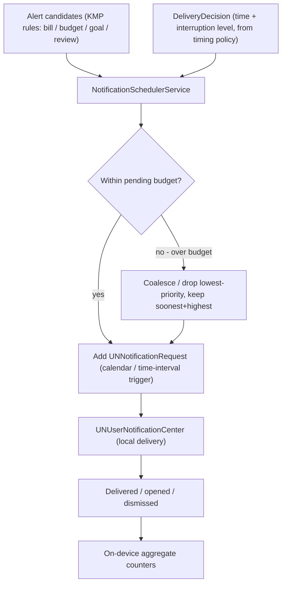
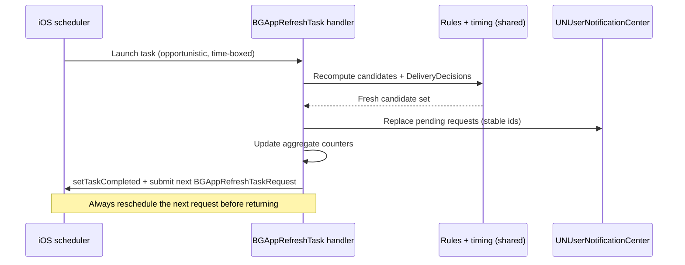
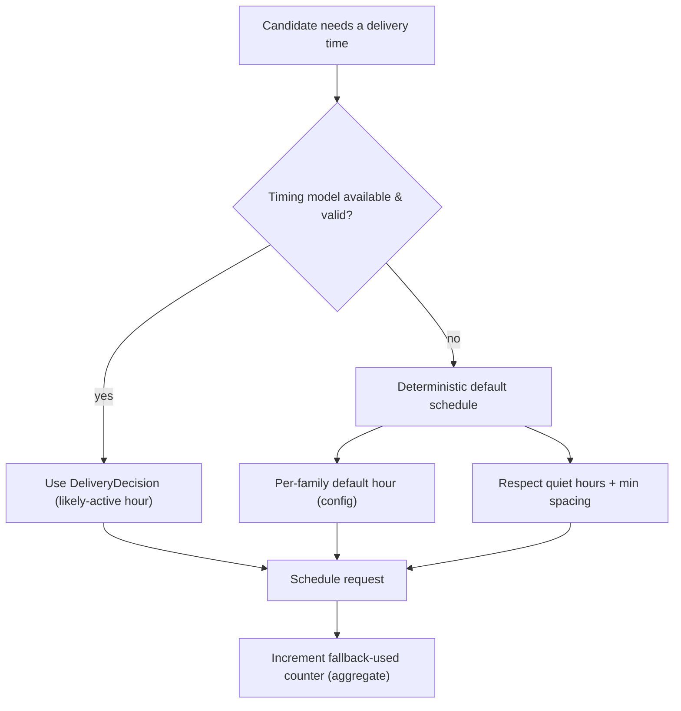
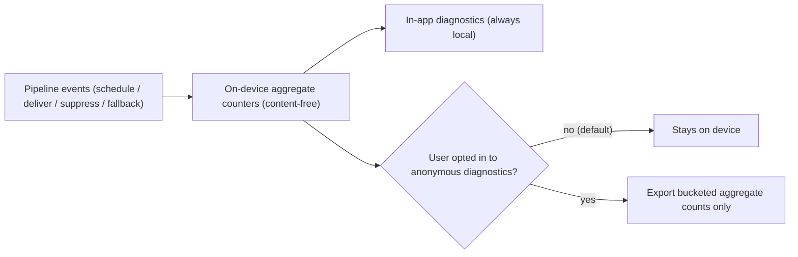
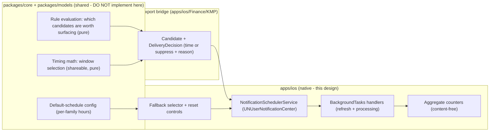

# iOS Notification Scheduling, Fallback & Telemetry

> Design for the **plumbing** beneath finance reminders: how `UNUserNotificationCenter`
> and `BackgroundTasks` cooperate to **schedule and refresh** local notifications,
> what happens when the on-device timing model is **unavailable** (deterministic
> fallback), how a user **resets** learned behavior, and how we gather
> **aggregate, privacy-preserving "no-content" metrics** to know the system is
> healthy — without ever sending an amount, payee, or balance off the device. The
> _what-to-say_ and _when-ideally_ live in their own docs; this is the **delivery
> engine** that runs them. Everything is **on-device** and privacy-first.

**Status:** PROPOSED — design only (native implementation buildable now; store distribution gated)
**Issue:** [#2622](https://github.com/jrmoulckers/finance/issues/2622) — Part of [#2391](https://github.com/jrmoulckers/finance/issues/2391)
**Platform:** iOS / iPadOS (SwiftUI, `UserNotifications`, `BackgroundTasks`, iOS 17+)
**Owner:** @ios-engineer
**Related:** [ios-smart-notification-timing.md](./ios-smart-notification-timing.md) · [ios-finance-alert-rules-deeplinks.md](./ios-finance-alert-rules-deeplinks.md) · [ios-notification-center-navigation.md](./ios-notification-center-navigation.md) · [content-language-guidelines.md](./content-language-guidelines.md) · [accessibility-patterns.md](./accessibility-patterns.md) · [cognitive-accessibility.md](./cognitive-accessibility.md) · [Human-Gated Prerequisites](../ops/human-gated-prerequisites.md)

---

## Table of Contents

1. [Goal & Scope](#1-goal--scope)
2. [Current State](#2-current-state)
3. [Scheduling Architecture](#3-scheduling-architecture)
4. [BackgroundTasks Refresh & Rescheduling](#4-backgroundtasks-refresh--rescheduling)
5. [Model-Unavailable Fallback](#5-model-unavailable-fallback)
6. [Reset Controls](#6-reset-controls)
7. [Aggregate No-Content Telemetry](#7-aggregate-no-content-telemetry)
8. [Native ↔ KMP Boundary](#8-native--kmp-boundary)
9. [Affected Surfaces & Shared Dependencies](#9-affected-surfaces--shared-dependencies)
10. [Accessibility & Dynamic Type](#10-accessibility--dynamic-type)
11. [Privacy & Security](#11-privacy--security)
12. [Empty, Stale & Error States](#12-empty-stale--error-states)
13. [Test Plan (Smallest Tests First)](#13-test-plan-smallest-tests-first)
14. [Implementation Readiness](#14-implementation-readiness)
15. [Open Questions](#15-open-questions)

---

## 1. Goal & Scope

The smart-timing policy ([ios-smart-notification-timing.md](./ios-smart-notification-timing.md))
decides _when_, and the alert-rules design
([ios-finance-alert-rules-deeplinks.md](./ios-finance-alert-rules-deeplinks.md))
decides _what_ and _where it lands_. Neither is useful without a robust engine to
**enqueue, refresh, and recover** delivery. This design specifies that engine.

**In scope**

- `UNUserNotificationCenter` scheduling with calendar/time-interval triggers and
  the pending-request budget.
- `BackgroundTasks` (`BGAppRefreshTask` / `BGProcessingTask`) to refresh content
  and re-schedule ahead of time.
- **Fallback** when the timing model (or any on-device ML input) is unavailable:
  a deterministic default schedule so reminders still fire.
- **Reset controls** so a user can clear learned timing and re-baseline.
- **Aggregate no-content metrics** — on-device counters that detect a sick
  pipeline (scheduled-but-empty, suppressed, fired-no-open) without collecting any
  financial content.

**Out of scope (cross-referenced):** the timing math (timing doc), the alert
families/actions/deep links (rules doc), and the alert-center UI
([ios-notification-center-navigation.md](./ios-notification-center-navigation.md)).

---

## 2. Current State

- The product uses **local notifications only** — there is **no remote push
  server**, so scheduling is entirely on-device via `UNUserNotificationCenter`.
- A `NotificationSchedulerService` already builds requests from
  `BillReminderEngine` output; the timing doc adds a `DeliveryDecision` (chosen
  time + interruption level) it consumes.
- iOS caps **pending** notification requests (currently 64), and background
  execution is **opportunistic** — the OS, not the app, decides when a
  `BGAppRefreshTask` runs. The engine must be correct under both limits.
- There is no formal **fallback** when an input model is missing, no **reset**
  control, and no health signal when the pipeline silently produces nothing.

---

## 3. Scheduling Architecture

- **Trigger choice:** date-anchored reminders use `UNCalendarNotificationTrigger`;
  short relative nudges use `UNTimeIntervalNotificationTrigger`. No repeating
  triggers for content that can change — we re-schedule from fresh data instead.
- **Pending budget:** the scheduler keeps a prioritized horizon (e.g. the next N
  days) so it never exceeds the OS pending cap; when over budget it **coalesces**
  and keeps the soonest, highest-`AlertPriority` items, deferring the rest to the
  next refresh.
- **Idempotent identifiers:** each request uses a **stable identifier** derived
  from its source (e.g. bill id + due date) so re-scheduling **replaces** rather
  than **duplicates** — critical because background refresh runs repeatedly.
- **Content built late:** notification body/category/deep link come from the rules
  doc; the scheduler only places them in time.

---

## 4. BackgroundTasks Refresh & Rescheduling

Because content (balances, due dates, budget state) changes after a notification
is scheduled, the engine refreshes opportunistically:

- **Two task types:** a frequent, light **`BGAppRefreshTask`** to re-evaluate and
  top up the pending horizon; an occasional **`BGProcessingTask`** for heavier
  maintenance (pruning stale ids, recomputing histograms) when on power/idle.
- **Always reschedule:** the handler **re-submits** the next
  `BGAppRefreshTaskRequest` before completing, or background refresh silently
  stops after one run.
- **Time-boxed & safe:** each handler sets an expiration handler that flushes a
  consistent state and calls `setTaskCompleted(success:)`; no partial writes.
- **No background ≠ no reminders.** If the OS rarely grants background time (Low
  Power Mode, user toggled Background App Refresh off), already-scheduled requests
  still fire; we additionally **top up on foreground launch** so the horizon never
  goes empty.

---

## 5. Model-Unavailable Fallback

The timing model is a _preference_, not a _dependency_. Any of: cold start with no
history, the on-device model/feature flag off, a decode error, or
background-budget starvation must still produce reminders.

- **Deterministic defaults:** each alert family has a sensible default hour (e.g.
  bills in the morning, review prompts early evening) defined in **config**, not
  code — so fallback is testable and tunable.
- **Still bounded:** fallback honors **quiet hours**, **min spacing**, and the
  **pending budget** — it degrades the _smartness_, never the _safety_.
- **Observable, not silent:** every fallback increments an aggregate
  `fallbackUsed` counter (§7) so we can see if the model is chronically
  unavailable.
- **No user-facing failure:** the user simply gets a reasonable reminder; the
  "why this time" reason (owned by the alert center) reads "default schedule"
  rather than "based on your activity".

---

## 6. Reset Controls

Users must be able to start over without reinstalling:

- **Reset learned timing.** Clears the local engagement buckets the timing policy
  uses; the next schedule falls back to defaults (§5) and re-learns from scratch.
- **Reset telemetry counters.** Clears the aggregate counters (§7) — they are
  diagnostic, never identity, but the user owns them.
- **Clear & reschedule.** Removes all pending requests and rebuilds the horizon
  from current data — a clean recovery if scheduling ever looks wrong.
- **Placement & confirmation.** These live in the alert center
  ([ios-notification-center-navigation.md](./ios-notification-center-navigation.md));
  each destructive reset uses a confirmation with plain-language consequences per
  [content-language-guidelines.md](./content-language-guidelines.md). Resets are
  **local and immediate** and need no network.

---

## 7. Aggregate No-Content Telemetry

The goal: detect a **sick pipeline** (the app stops surfacing useful reminders)
**without** collecting financial content. Telemetry is **aggregate counters
only**, computed and (by default) **kept on-device**.

| Counter            | Increments when                                                    | Why it matters                                  |
| ------------------ | ------------------------------------------------------------------ | ----------------------------------------------- |
| `scheduledTotal`   | A request is enqueued                                              | Baseline volume                                 |
| `noContent`        | A refresh produced **zero** candidates when some were expected     | The "no-content" health signal the issue names  |
| `suppressed`       | Timing policy suppressed a candidate (quiet hours / rate limit)    | Distinguishes "nothing to say" from "held back" |
| `fallbackUsed`     | A default schedule was used because the model was unavailable (§5) | Detects chronic model unavailability            |
| `delivered`        | The system delivered a request                                     | Delivery health                                 |
| `openedNoAction`   | Delivered + opened but no follow-through                           | Relevance signal (no content captured)          |
| `backgroundDenied` | A `BGAppRefreshTask` was not granted within the expected window    | Explains an empty horizon                       |

**Privacy rules baked into the design:**

- **No content, ever.** Counters carry **no** amounts, payees, merchants,
  balances, categories, or notification text — only structural integers and the
  alert **family** (bill/budget/goal/review) at most.
- **On-device by default.** Counters live locally for in-app diagnostics. **No**
  export happens unless the user has **opted in** to anonymous diagnostics; if so,
  only **bucketed aggregate counts** (e.g. "noContent: 3 this week") leave the
  device — never per-event records, never identifiers. This is **data
  minimization** (GDPR Art. 5 / CCPA) by construction.
- **`os.Logger` privacy.** Structural events are `.public`; anything derived from
  user finance stays `.private`. Counters are intentionally content-free so they
  are safe to read in diagnostics.
- **User-clearable** via reset (§6).

---

## 8. Native ↔ KMP Boundary

- **Shared (KMP):** what is worth surfacing, the timing window math, and the
  default-schedule config are platform-neutral rules in `packages/core`. **Not
  implemented here** — ADR with `@kmp-engineer` / `@architect`.
- **Native (iOS):** all Apple-framework plumbing — `UNUserNotificationCenter`,
  `BackgroundTasks`, the fallback selector, reset controls, and the content-free
  counters. These are inherently platform APIs and stay in `apps/ios`.
- **Bridge:** returns `Candidate` + `DeliveryDecision`; the scheduler never sees
  raw finance internals beyond what the rules already expose.

---

## 9. Affected Surfaces & Shared Dependencies

**New (native):**

- `apps/ios/Finance/Services/BackgroundRefreshCoordinator.swift` — registers and
  handles the `BGAppRefreshTask` / `BGProcessingTask` identifiers.
- `apps/ios/Finance/Services/NotificationTelemetryStore.swift` — content-free
  aggregate counters with reset.
- `apps/ios/Finance/Services/FallbackScheduleProvider.swift` — deterministic
  default schedule when the model is unavailable.

**Touched (additively):**

- `NotificationSchedulerService` gains idempotent ids, budget-aware coalescing,
  and a fallback path.
- The alert center gains **reset controls** and a diagnostics row (UI owned by
  [ios-notification-center-navigation.md](./ios-notification-center-navigation.md)).

**Reused unchanged:** `UNCalendarNotificationTrigger` plumbing, `AlertPriority`,
the timing policy's quiet-hours/spacing guards, the alert families/categories from
the rules doc.

**Shared dependency:** rule evaluation + timing math + default config in KMP
`packages/core` via the Swift Export bridge ([§8](#8-native--kmp-boundary)).

---

## 10. Accessibility & Dynamic Type

- **Reset controls** are standard, fully-labeled SwiftUI controls with confirming
  alerts; VoiceOver reads the action and its consequence ("Reset learned timing —
  reminders return to default times"), per
  [accessibility-patterns.md](./accessibility-patterns.md).
- **Plain language** for the diagnostics row and "why this time" reason follows
  [content-language-guidelines.md](./content-language-guidelines.md) and
  [cognitive-accessibility.md](./cognitive-accessibility.md) — "default schedule"
  vs. "based on your activity", never opaque codes.
- **Dynamic Type to AX5:** reset rows and any diagnostics counts reflow; no
  truncation of consequence text.
- **Switch Control / keyboard:** all controls reachable without gestures; the
  destructive resets require explicit confirmation focus.
- **Delivered notifications** inherit accessible titles/bodies and actions from
  the rules doc; this engine does not alter their semantics.

---

## 11. Privacy & Security

- **Local-only by default.** Scheduling, fallback, resets, and counters run on
  device; nothing about a reminder's content leaves the phone.
- **Content-free telemetry** (§7): counters never carry amounts, payees,
  balances, categories, or notification text — only structural integers and at
  most the alert family. Export is **opt-in, bucketed aggregate** only.
- **No remote push.** There is no push token, no server delivery, so no payload
  ever transits Apple's push infrastructure with finance data.
- **`.private` logging.** Any finance-derived value is `.private` in `os.Logger`;
  scheduling/telemetry structural events are `.public`.
- **Keychain for secrets.** No tokens are introduced by this engine; any existing
  secrets remain in the Keychain with
  `kSecAttrAccessibleWhenUnlockedThisDeviceOnly`.
- **User control.** Reset controls (§6) let the user clear learned timing and
  counters at any time — supporting correction/erasure expectations under
  GDPR/CCPA.

---

## 12. Empty, Stale & Error States

- **Notifications not authorized.** If the user denied permission, scheduling is a
  no-op; the alert center explains and deep-links to Settings — never silently
  failing.
- **Nothing to schedule (good empty).** Zero candidates is normal ("You're all
  caught up"); the `noContent` counter increments only when candidates were
  **expected** but produced none, distinguishing health from quiet.
- **Background refresh denied/unavailable.** Increment `backgroundDenied`; rely on
  foreground top-up so the horizon recovers on next launch.
- **Model unavailable.** Fall back to the default schedule (§5); surface "default
  schedule" in the reason, not an error.
- **Scheduling error / over budget.** Coalesce per §3 and log a `.public`
  structural warning; never throw away the soonest, highest-priority reminder.
- **Stale horizon.** If the last refresh is older than a threshold, top up on
  foreground and mark the diagnostics row "last refreshed <relative time>".

---

## 13. Test Plan (Smallest Tests First)

Determinism is the contract: every test uses **fixed fixtures and an injected
clock** — no wall-clock reads, no real background scheduling.

### 13.1 Native (Swift · iOS Simulator · XCTest)

1. **Idempotent scheduling:** scheduling the same source twice yields **one**
   pending request (stable id replaces, not duplicates).
2. **Pending-budget coalescing:** with more candidates than the cap, assert the
   soonest, highest-`AlertPriority` survive and the rest defer.
3. **Fallback selection:** with the timing model marked unavailable, assert the
   **per-family default hour** is used and quiet hours/min-spacing still apply
   (assert exact time vs. a **fixed reference `Date`**).
4. **Reschedule-on-complete:** the background handler **re-submits** the next
   `BGAppRefreshTaskRequest` before completing (mock task scheduler).
5. **Expiration safety:** an expiring task flushes consistent state and calls
   `setTaskCompleted` without partial writes.
6. **Reset controls:** reset-timing clears buckets (next schedule uses fallback);
   clear-and-reschedule empties then rebuilds pending; reset-counters zeroes them.
7. **Telemetry is content-free:** assert counter records contain **no** amount /
   payee / merchant / text fields — only integers and family enum; `noContent`
   increments only when candidates were expected.
8. **Foreground top-up:** with background denied, a foreground launch refills an
   empty horizon.

### 13.2 Shared (Kotlin · `packages/core` · `commonTest`, owned by @kmp-engineer)

- Rule evaluation and window-selection boundary cases (if the math lands in
  `packages/core`) tested there with golden fixtures; default-schedule config
  values asserted.

### 13.3 Manual / QA gate (every UI PR)

- VoiceOver on reset controls and confirmations; Dynamic Type AX5 on the
  diagnostics row.
- Simulate Background App Refresh off + Low Power Mode → reminders still fire from
  the foreground top-up.
- Toggle the model-unavailable flag → reminders arrive on the default schedule.

---

## 14. Implementation Readiness

See [Human-Gated Prerequisites](../ops/human-gated-prerequisites.md) §2 for the
implementation-vs-distribution decoupling.

### ✅ Buildable now — no enrollment required

`UNUserNotificationCenter` scheduling, `BGAppRefreshTask` / `BGProcessingTask`
registration and handling, the fallback selector, reset controls, and the
content-free counters all build and run today under **free Personal Team
signing** — local notifications and the BackgroundTasks framework need **no** paid
entitlement for local testing. Every test in
[§13](#13-test-plan-smallest-tests-first) — pure scheduling logic with fixtures
and an injected clock/task-scheduler — runs without a device or enrollment.

### 🔒 Distribution tail — gated

- **Distribution** (TestFlight/App Store, release signing, CI release) is gated by
  [#1239](https://github.com/jrmoulckers/finance/issues/1239) — a **human** action
  per the prerequisites runbook. Feature implementation is **not** blocked.
- **Remote push is explicitly not used**, so the Push Notifications paid
  capability is **not** required by this design; if a future remote path is ever
  added, that is a separate entitlement + design.
- **Optional anonymous-diagnostics export** (§7), if ever enabled, would need a
  privacy-reviewed backend endpoint and consent UX — a separate track, not built
  here.

No provisioning, certificates, secrets, or account registrations are performed as
part of this design.

---

## 15. Open Questions

1. Pending-horizon length and the exact pending-budget reserve per family —
   start conservative, tune with the `noContent` / `scheduledTotal` ratio.
2. `BGProcessingTask` cadence and what maintenance belongs there vs. the light
   refresh — proposal: histogram recompute + stale-id pruning on power/idle only.
3. Should anonymous-diagnostics export ever ship, what is the minimum bucketed
   schema and consent flow? Default remains **on-device only**.
4. Where do rule evaluation and timing math finally live — `packages/core` vs.
   native — given the timing doc proposes shared math? ADR with `@kmp-engineer`.
