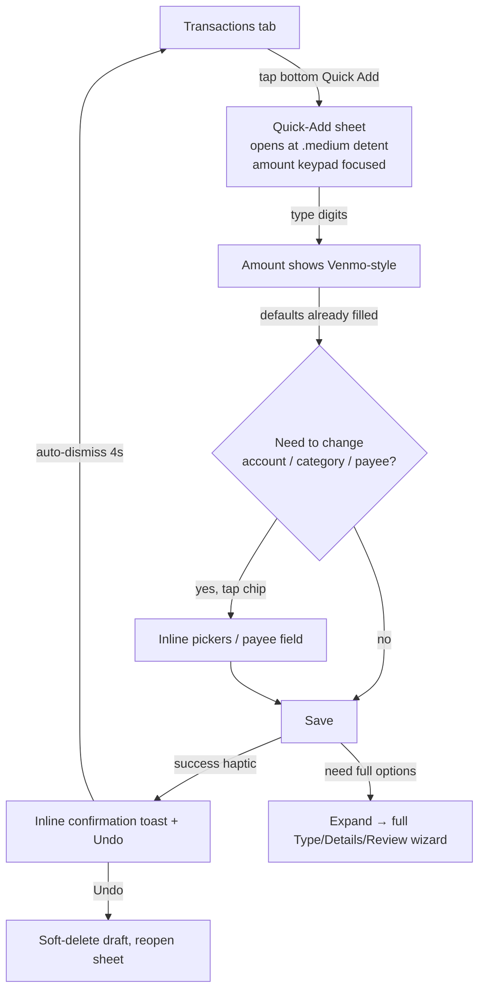

# One-Thumb Quick-Add Transaction Entry — iOS

> Design specification for a fast, one-handed "quick-add" transaction entry on
> the **Transactions** tab: a thumb-reachable capture affordance, a
> bottom-anchored sheet that opens straight to the amount keypad, remembered
> defaults (account, type, category), optional payee skipping, and a low-effort
> save confirmation with undo. The goal is _amount → save_ in a single thumb
> arc, without sacrificing accessibility, privacy, or the shared validation
> contract.

**Status:** Design (implementation-ready) · pre-implementation
**Issue:** [#2599](https://github.com/jrmoulckers/finance/issues/2599) — In-app one-thumb quick-add entry design for iOS
**Part of:** [#2167](https://github.com/jrmoulckers/finance/issues/2167)
**Platforms:** iOS · iPadOS · macOS (SwiftUI) — with hooks for App Clip and Lock Screen widget quick entry
**WCAG target:** 2.2 Level AA — SC 2.5.5 Target Size, SC 2.5.1 Pointer Gestures, SC 1.4.4 Resize Text
**Related:** [accessibility-patterns.md](./accessibility-patterns.md) · [cognitive-accessibility.md](./cognitive-accessibility.md) · [ux-principles.md](./ux-principles.md) · [responsive-breakpoints.md](./responsive-breakpoints.md) · [ios-compact-transaction-stepper.md](./ios-compact-transaction-stepper.md) · [ios-wallet-adjacent-capture-inbox.md](./ios-wallet-adjacent-capture-inbox.md) · [Human-Gated Prerequisites](../ops/human-gated-prerequisites.md)

---

## Table of Contents

1. [Problem & Goals](#1-problem--goals)
2. [The One-Thumb Flow](#2-the-one-thumb-flow)
3. [Transactions Tab Affordance](#3-transactions-tab-affordance)
4. [The Quick-Add Bottom Sheet](#4-the-quick-add-bottom-sheet)
5. [Remembered Defaults & Optional Payee](#5-remembered-defaults--optional-payee)
6. [Save Confirmation & Undo](#6-save-confirmation--undo)
7. [Affected iOS Surfaces](#7-affected-ios-surfaces)
8. [Shared Dependencies & the Validation Boundary](#8-shared-dependencies--the-validation-boundary)
9. [Accessibility, Dynamic Type & Reachability](#9-accessibility-dynamic-type--reachability)
10. [Privacy](#10-privacy)
11. [Stale, Error & Empty States](#11-stale-error--empty-states)
12. [Test Plan](#12-test-plan)
13. [Implementation Readiness](#13-implementation-readiness)
14. [Open Questions](#14-open-questions)

---

## 1. Problem & Goals

Today the only way to add a transaction from the **Transactions** tab is the
`Add transaction` menu anchored in the **top-trailing toolbar** of
`apps/ios/Finance/Screens/TransactionsView.swift`. On a 6.1"+ phone held in one
hand, that target sits outside the comfortable thumb arc, and the resulting
`TransactionCreateView` is a three-step `Type → Details → Review` wizard
(`apps/ios/Finance/Screens/TransactionCreateView.swift`) that requires several
deliberate taps before a value is even entered. For the dominant use case —
"I just spent $4.50 on coffee, log it before I forget" — this is too much
ceremony.

The infrastructure for fast entry already exists but is fragmented:

- A Venmo-style cents-first digit pad lives in `TransactionCreateViewModel`
  (`amountCents`, `appendAmountDigit`, `formattedAmount`).
- `applyQuickEntry(action:)` can pre-seed payee/category for a named shortcut
  (`lunch`, `coffee`, `groceries`, `gas`).
- The Lock Screen `QuickEntryWidget` and `DeepLinkHandler` already route into a
  biometric-gated create sheet.
- The App Clip `QuickTransactionView` already proves a single-screen
  amount-first capture pattern.

**Goals**

1. **One thumb, one screen, two seconds.** Put a capture affordance in the
   bottom thumb arc and open straight to the amount keypad.
2. **Remember the boring parts.** Default the account, type, and category to the
   user's recent behavior so only the amount changes between captures.
3. **Make payee optional.** Allow save without a payee, deriving a sensible
   label from the category (mirroring `AddExpenseIntent`'s
   `resolvedPayee = payee ?? category.categoryName`).
4. **Confirm without blocking.** A haptic + inline confirmation with **Undo**,
   not a modal that interrupts the next capture.

**Non-goals.** This design does not replace the full `Type → Details → Review`
wizard (kept for complex entries — transfers, BNPL, tags, mood) and does not
change shared business rules. It is an _express lane_ that composes the same
view model and the same KMP validator.

---

## 2. The One-Thumb Flow

Every primary control in the flow (keypad, default chips, Save, Undo) sits in
the lower half of the screen. "Expand to full form" is the documented escape
hatch to the existing wizard and to the compact-stepper behavior specified in
[ios-compact-transaction-stepper.md](./ios-compact-transaction-stepper.md).

---

## 3. Transactions Tab Affordance

**Decision: a bottom-trailing floating capture button**, layered above the list
within `TransactionsView`, in addition to (not replacing) the existing toolbar
menu.

- **Placement.** Bottom-trailing, inset 16pt from the trailing and bottom safe
  areas, so it rests inside the right-hand thumb arc for the majority of users
  while staying clear of the home indicator and the tab bar. A left-handed
  accommodation is covered in §9.
- **Form.** A 56×56pt circular button using the shared `IconView(.add)` token
  (consistent with the toolbar `add` icon already used in `TransactionsView`),
  with a subtle shadow and `.fill` material background so it reads on both light
  and OLED dark backgrounds.
- **Single tap** opens the Quick-Add sheet (§4). **Long-press / context menu**
  exposes the named shortcuts already modeled by `QuickEntryShortcut`
  (`Log coffee`, `Log lunch`, `Log groceries`, `Log gas`) and a "Full form…"
  item that opens the existing wizard.
- **Coexistence.** The top-trailing `Add transaction` menu stays for
  discoverability, pointer/keyboard users, and the `Quick Add (NLP)` entry into
  `NlpInputView`. The floating button is purely a reachability addition.
- **iPad / Mac.** On regular width the floating button is suppressed in favor of
  the toolbar affordance and a keyboard shortcut (`⌘N`), because thumb
  reachability is not the constraint there.

The button must not obscure the last row of the list; the `List` gains a
bottom content inset equal to the button height + inset so pull-to-refresh and
the final transaction stay tappable.

---

## 4. The Quick-Add Bottom Sheet

A dedicated `QuickAddView` presented with `.sheet`, distinct from
`TransactionCreateView` but driven by the **same** `TransactionCreateViewModel`
seeded into a new "quick" mode (so validation, persistence, and the
categorization engine are shared, not duplicated).

- **Detents.** `.presentationDetents([.medium, .large])` with
  `.presentationDragIndicator(.visible)`. It opens at `.medium`; dragging to
  `.large` reveals the optional fields. `.presentationBackgroundInteraction` is
  disabled so the list underneath cannot steal focus.
- **Layout, top to bottom (essentials only at `.medium`):**
  1. **Amount display** — large monospaced-digit currency, reusing
     `formattedAmount` + the currency symbol logic already in
     `TransactionCreateView`.
  2. **Default chips row** — Account · Category · Type, each a tappable chip
     pre-filled from remembered defaults (§5). Tapping a chip reveals an inline
     `Menu`/`Picker`, never a full push navigation.
  3. **Venmo-style digit pad** — the existing 3-column `LazyVGrid` keypad
     (`1–9`, `0`, `⌫`) bound to `appendAmountDigit` / `removeLastAmountDigit`,
     anchored at the bottom so all keys are thumb-reachable.
  4. **Save** — full-width `borderedProminent` button pinned to the bottom,
     above the home indicator.
- **Optional payee** is a single collapsed field directly under the chips;
  empty is allowed (§5).
- **Expand affordance.** Dragging to `.large` (or a "More options" disclosure)
  surfaces date, note, status, tags, BNPL, and mood — the same `Form` sections
  as the wizard's Details step — without navigating away.
- **Keypad ≠ system keyboard.** The cents-first pad means no decimal point and
  no system keyboard for the amount, keeping the whole interaction in the thumb
  zone. The payee field still uses the system keyboard when tapped.

---

## 5. Remembered Defaults & Optional Payee

**Remembered defaults** make repeat capture near-instant:

| Default              | Source of "remembered" value                                                                 | Storage                                                  |
| -------------------- | -------------------------------------------------------------------------------------------- | -------------------------------------------------------- |
| Transaction **type** | Last saved type, falling back to `.expense`                                                  | `UserDefaults` (App Group) — non-sensitive preference    |
| **Account**          | Most-recently-used account id; else the first account from `AccountRepository.getAccounts()` | `UserDefaults` (App Group) — id only, not balances       |
| **Category**         | `CategorizationEngine.suggest(payee:)` once a payee is typed; else last-used category id     | Suggestion is shared (KMP); last-used id in UserDefaults |
| **Currency**         | Account's currency, else `USD`                                                               | Derived, not stored separately                           |

Rules:

- Remembered values are **preferences, not secrets** — account/category **ids**
  and an enum, never amounts, payees, balances, or tokens. They therefore live
  in App Group `UserDefaults` (shared with the widget/clip), **never** the
  Keychain (the Keychain remains reserved for credentials per project policy).
- Defaults are applied at sheet construction so the user lands on a fully valid
  draft that needs only an amount.
- Editing a default chip updates the remembered value for next time.

**Optional payee skipping:**

- The current iOS form over-constrains entry: `canAdvance` for the Details step
  requires `!payee.isEmpty`. The **shared** contract is more permissive —
  `KMPTransaction.payee` is nullable and `TransactionValidator` does not require
  a payee. Quick-Add aligns the iOS rule with the shared rule.
- When payee is empty on save, derive a display label from the chosen category
  (e.g. "Dining Out") exactly as `AddExpenseIntent` already does, so the saved
  record is never blank in the list. This derivation is an **iOS presentation
  concern** and stays in the view model.
- Save remains gated on the genuinely required fields: `amountCents > 0` and a
  selected account — both already enforced by `TransactionValidator`
  (`ZeroAmount`, `AccountNotFound`).

---

## 6. Save Confirmation & Undo

Confirmation must reassure without blocking the next capture.

- **On success:** fire `HapticManager.shared.transactionSaved()` (already wired
  in the wizard), dismiss the sheet, and present a **non-modal inline
  confirmation** anchored at the bottom of the Transactions tab: a checkmark +
  "Saved" + an **Undo** action, auto-dismissing after ~4 seconds.
- **Undo** soft-deletes the just-saved transaction through
  `TransactionRepository` and reopens the Quick-Add sheet pre-filled with the
  prior values, so a misfire costs one tap to recover.
- **On validation failure:** fire `HapticManager.shared.validationWarning()` and
  show the message **inline within the sheet** (not the wizard's separate
  `.alert`), keeping the user in the keypad context.
- The confirmation deliberately avoids announcing the **amount** in a persistent
  on-screen banner (see §10) — it confirms _that_ a save happened, while
  VoiceOver users get the amount through the focused element, not a broadcast.

---

## 7. Affected iOS Surfaces

| Surface                                                        | Change                                                                                            |
| -------------------------------------------------------------- | ------------------------------------------------------------------------------------------------- |
| `apps/ios/Finance/Screens/TransactionsView.swift`              | Add bottom-trailing floating capture button (compact width only), bottom content inset, new sheet |
| `apps/ios/Finance/Screens/TransactionCreateView.swift`         | Extract shared step components; add an "Expand to full form" entry path from Quick-Add            |
| **New** `apps/ios/Finance/Screens/QuickAddView.swift`          | Bottom-sheet express entry: amount, default chips, keypad, optional payee, Save                   |
| `apps/ios/Finance/ViewModels/TransactionCreateViewModel.swift` | Add quick mode, remembered-defaults load/persist, payee-derivation, `canSaveQuick` gate           |
| `apps/ios/Finance/Components/` (Haptics, IconView, chips)      | Reuse existing `HapticManager`, `IconView`, tag/chip components                                   |
| `apps/ios/FinanceWidget/QuickEntryWidget.swift`                | No change to the widget; Quick-Add becomes the destination for its deep link                      |
| `apps/ios/FinanceClip/QuickTransactionView.swift`              | Aligns conceptually; no code change — the clip remains the reduced standalone capture             |
| `apps/ios/Tests/TransactionCreateViewModelTests.swift`         | Extend for quick mode, defaults, optional payee, undo                                             |

---

## 8. Shared Dependencies & the Validation Boundary

The boundary is deliberate and **unchanged** by this design:

- **Shared (Kotlin, `packages/core` / `packages/models`) owns the rules.**
  - `packages/core/src/.../validation/TransactionValidator.kt` is the single
    source of truth for what makes a transaction savable (non-zero amount,
    existing account, optional category, future-date bounds). Quick-Add calls it
    through `KMPTransactionValidatorProtocol` exactly as the wizard does.
  - `packages/core/src/.../categorization/CategorizationEngine.kt` provides
    `suggest(payee:)` and `learnFromHistory(payee:categoryId:)` — the source of
    the remembered/suggested category.
  - `packages/models/.../models/Transaction.kt` defines the draft shape; payee
    nullability there is what _permits_ optional-payee entry.
- **iOS owns presentation only:** sheet layout, detents, the floating affordance,
  thumb-reachability, default-chip UI, payee-from-category display derivation,
  haptics, and the confirmation/undo UX.

This design requires **no change to `packages/`**. If a future iteration wants
"remembered defaults" computed from shared history (rather than an iOS-local
preference), that would be a shared-logic change proposed to `@kmp-engineer` via
ADR — out of scope here. The boundary stays: **rules in KMP, pixels in SwiftUI.**

---

## 9. Accessibility, Dynamic Type & Reachability

- **VoiceOver.** Every interactive element gets an explicit label/hint following
  the patterns already in `TransactionCreateView`:
  - Floating button: `accessibilityLabel("Quick add transaction")`,
    `accessibilityHint("Opens the quick entry sheet")`.
  - Each keypad key keeps its existing per-digit label and `⌫` "Delete" label.
  - Default chips combine into `"Account: Checking, double-tap to change"`.
  - The confirmation exposes an Undo action via `.accessibilityAction`.
- **One-handed reachability beyond placement.** The bottom-trailing position
  helps right thumbs; we additionally:
  - Respect the system **Reachability** gesture (no custom interception).
  - Keep _all_ required controls within the `.medium` detent so a user never has
    to stretch to the top of the screen to complete a save.
  - Offer a setting (or honor layout direction) so the button mirrors to
    bottom-_leading_ for left-handed/RTL users.
- **Dynamic Type.** No hardcoded font sizes for text; amount uses
  `.monospacedDigit()` title styles that scale. At accessibility sizes the
  keypad keys grow and the chips wrap (defer detailed thresholds to
  [ios-compact-transaction-stepper.md](./ios-compact-transaction-stepper.md)).
  Tap targets stay ≥ 44×44pt.
- **Reduce Motion.** The sheet present/expand and the confirmation toast use
  the system sheet transition; when Reduce Motion is on, the toast cross-fades
  instead of sliding, and Undo does not animate the reopen.
- **Switch Control / keyboard.** Focus order is amount → chips → payee → Save;
  `⌘N` opens Quick-Add and `Return` saves when the draft is valid.

---

## 10. Privacy

- **No secrets outside the Keychain.** Remembered defaults are non-sensitive
  ids/enums in App Group `UserDefaults`; nothing in this flow writes tokens,
  credentials, or balances to `UserDefaults`.
- **Financial values are `.private`.** Per project logging policy, the amount,
  payee, and any balance are `.private` in `os.Logger`; only coarse events
  ("quick add opened", "quick add saved") are logged, never the value.
- **Lock Screen & widget path stays biometric-gated.** Quick-Add reached via the
  Lock Screen `QuickEntryWidget` / `DeepLinkHandler` continues through the
  existing `BiometricAuthManager` gate before any amount field is shown — the
  widget itself never renders money.
- **Confirmation restraint.** The success toast confirms the action without
  persistently displaying the amount on screen, reducing shoulder-surfing risk
  while still being fully available to VoiceOver on the focused element.

---

## 11. Stale, Error & Empty States

- **Empty — no accounts yet.** If `AccountRepository.getAccounts()` returns
  empty, Quick-Add cannot satisfy the shared `AccountNotFound` rule. Show an
  inline empty state ("Add an account to start logging") with a button to the
  account-creation flow, rather than presenting a dead keypad.
- **Empty — no categories.** Category is optional per shared rules; the chip
  shows "Uncategorized" and save still succeeds.
- **Stale defaults.** If a remembered account/category id no longer exists
  (deleted/merged), silently fall back to the first available account / clear the
  category, and refresh the remembered value — never block on a stale id.
- **Save error (offline / repository failure).** The app is local-first;
  persistence is optimistic. If `createTransaction` throws, show the message
  inline in the sheet with **Retry**, keep the keypad state intact, and do not
  fire the success haptic.
- **Validation error.** Surfaced inline (not a blocking alert) with the message
  returned by `TransactionValidator`, so the user can correct without losing the
  amount.

---

## 12. Test Plan

Smallest meaningful tests first; UI snapshot tests gate every visual PR.

### 12.1 Shared (Kotlin · `packages/core` · `commonTest`)

- `TransactionValidatorTest`: a transaction with **null/empty payee** but valid
  amount + account is **valid** (proves optional-payee is a shared guarantee,
  not just an iOS choice).
- `TransactionValidatorTest`: zero amount → `ZeroAmount`; missing account →
  `AccountNotFound` (the two gates Quick-Add relies on).
- `CategorizationEngineTest`: `suggest(payee:)` returns the learned category
  after `learnFromHistory`, validating the default-category source.

### 12.2 Native (Swift · iOS Simulator · XCTest)

- `TransactionCreateViewModelTests` (extend existing
  `apps/ios/Tests/TransactionCreateViewModelTests.swift`):
  - Quick mode seeds remembered type/account/category from preferences.
  - `appendAmountDigit` / `removeLastAmountDigit` produce the expected
    `amountCents` and `formattedAmount` (cents-first behavior).
  - Save with empty payee derives the category-based label and succeeds.
  - `canSaveQuick` is false with zero amount or no account, true otherwise.
  - Undo path soft-deletes and restores prior field values.
- A `QuickAddView` snapshot test at default and AX3 Dynamic Type, light + OLED
  dark, verifying keypad + Save remain within the `.medium` detent.
- Accessibility test asserting the floating button and keypad keys expose
  non-empty labels (mirrors existing `accessibilityIdentifier` usage).

### 12.3 Manual / QA gate (every UI PR)

- iPhone SE (smallest) and a Pro Max: confirm Save + keypad are thumb-reachable
  one-handed; left-handed mirror works.
- VoiceOver walkthrough: open → enter amount → save → Undo.
- Reduce Motion on: confirmation cross-fades, no slide.

---

## 13. Implementation Readiness

### ✅ Buildable now — no enrollment required

The entire Quick-Add flow — `QuickAddView`, view-model quick mode, remembered
defaults, optional-payee derivation, confirmation/undo, and all unit/UI tests —
builds and runs today on a device or simulator using **free Personal Team
signing** (Xcode + a free Apple ID). It depends only on already-shipping shared
logic (`TransactionValidator`, `CategorizationEngine`) reached through the
existing `KMPBridge`, plus existing iOS components (`HapticManager`, `IconView`,
the Venmo-style keypad). No paid entitlements are required: the App Group used
for remembered defaults already backs the widget/clip.

### 🔒 Distribution tail — gated by [#1239](https://github.com/jrmoulckers/finance/issues/1239) (human action)

Only the **distribution** step is human-gated: TestFlight/App Store builds,
release signing, and CI release workflows require Apple Developer Program
enrollment and signing secrets. Per
[Human-Gated Prerequisites](../ops/human-gated-prerequisites.md) §2, feature
implementation is decoupled from distribution and is **not** blocked. No
provisioning, certificates, or secrets are created as part of this work.

---

## 14. Open Questions

1. Should "remembered defaults" eventually move to shared history scoring (KMP)
   so they sync across devices? If so, that is an ADR to `@kmp-engineer`.
2. Left-handed mirroring: explicit setting vs. inferred from interaction
   heatmap vs. RTL-only? Default proposal is an explicit accessibility setting.
3. Undo window length (4s) and whether it should pause while VoiceOver focus is
   on the toast — likely yes, to avoid timing out assistive users.
