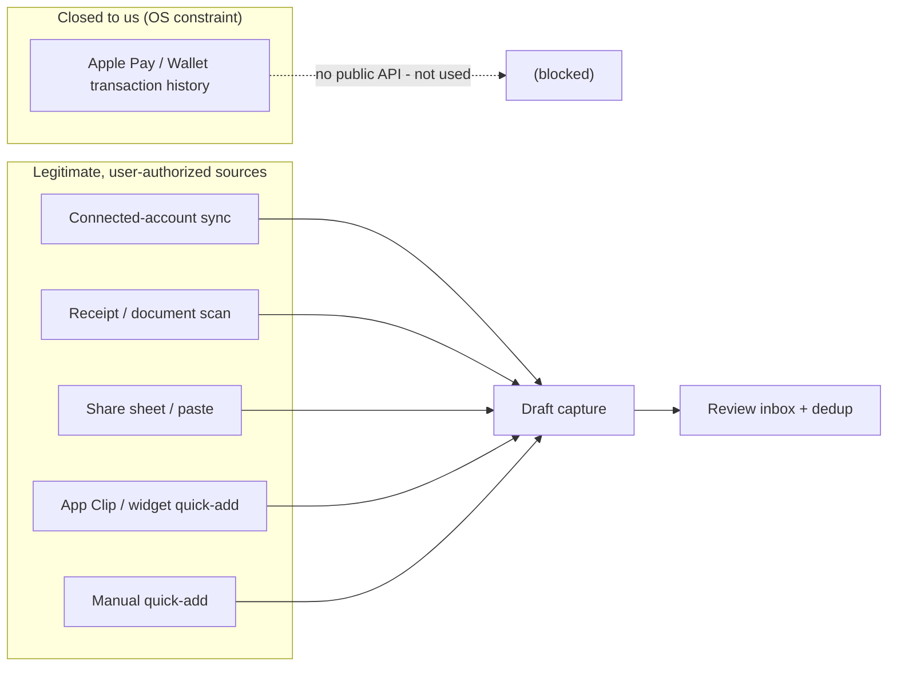
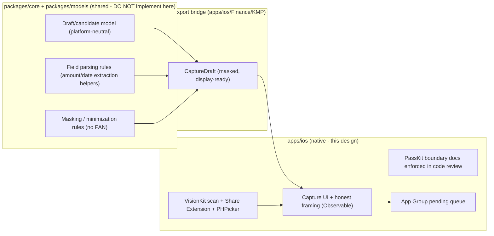

# iOS PassKit & Wallet Capture Constraints

> A **constraints reference**: what PassKit and Wallet do — and, more importantly,
> do **not** — let a third-party finance app do, the entitlements involved, and
> the **fallback capture UX** that works _within_ the platform rules. The headline
> fact, stated plainly so no implementer "optimizes" past it: **Apple does not
> expose Apple Pay / Wallet transaction data to third-party apps.** There is no
> public API for a user's tap-to-pay history, the merchant of a payment, or a
> card's transaction feed, and we will **not** use private APIs. Our
> "wallet-adjacent" experience is therefore built from **user-initiated /
> user-authorized** sources only. All capture is **on-device** and privacy-first.

**Status:** PROPOSED — design / constraints reference (informs implementation; store distribution gated)
**Issue:** [#2606](https://github.com/jrmoulckers/finance/issues/2606) — Part of [#2171](https://github.com/jrmoulckers/finance/issues/2171)
**Platform:** iOS / iPadOS (PassKit, Wallet, VisionKit; SwiftUI, iOS 17+)
**Owner:** @native-app-engineer
**Related:** [ios-wallet-adjacent-capture-inbox.md](./ios-wallet-adjacent-capture-inbox.md) · [ios-merchant-matching-duplicate-detection.md](./ios-merchant-matching-duplicate-detection.md) · [ios-one-thumb-quick-add.md](./ios-one-thumb-quick-add.md) · [accessibility-patterns.md](./accessibility-patterns.md) · [cognitive-accessibility.md](./cognitive-accessibility.md) · [content-language-guidelines.md](./content-language-guidelines.md) · [Human-Gated Prerequisites](../ops/human-gated-prerequisites.md)

---

## Table of Contents

1. [Purpose & Scope](#1-purpose--scope)
2. [The Hard Constraint: No Apple Pay Transaction Access](#2-the-hard-constraint-no-apple-pay-transaction-access)
3. [What PassKit Actually Exposes](#3-what-passkit-actually-exposes)
4. [Entitlements & Capabilities](#4-entitlements--capabilities)
5. [Legitimate Capture Sources (Design Within the Rules)](#5-legitimate-capture-sources-design-within-the-rules)
6. [Fallback Capture UX](#6-fallback-capture-ux)
7. [Native ↔ KMP Boundary](#7-native--kmp-boundary)
8. [Affected iOS Surfaces & Shared Dependencies](#8-affected-ios-surfaces--shared-dependencies)
9. [Accessibility & Dynamic Type](#9-accessibility--dynamic-type)
10. [Privacy & Security](#10-privacy--security)
11. [Stale, Error & Empty States](#11-stale-error--empty-states)
12. [Test Plan (Smallest Tests First)](#12-test-plan-smallest-tests-first)
13. [Implementation Readiness](#13-implementation-readiness)
14. [Open Questions](#14-open-questions)

---

## 1. Purpose & Scope

Before any "see what I tapped to pay" feature is built, the team needs one
authoritative document that records the **platform limitations**, the
**entitlement needs**, and the **fallback UX** so that design happens _within_
the rules from day one. This doc is that reference; the capture experience it
enables is specified in
[ios-wallet-adjacent-capture-inbox.md](./ios-wallet-adjacent-capture-inbox.md)
and the dedup that keeps it clean in
[ios-merchant-matching-duplicate-detection.md](./ios-merchant-matching-duplicate-detection.md).

**In scope**

- The exact boundary of PassKit/Wallet access for a third-party app.
- Which capabilities are free for local development vs. paid/entitlement-gated.
- The fallback capture model (manual entry / user-initiated capture) and its UX
  states.

**Explicitly out of scope (and prohibited)**

- Reading arbitrary Apple Pay/Wallet purchase history — **no public API exists.**
- Any private/undocumented Wallet or PassKit call, UI scraping, or screenshot
  parsing of system surfaces — an App Store rejection and a privacy violation.
- Requesting, storing, logging, or reconstructing a full card number (PAN).

---

## 2. The Hard Constraint: No Apple Pay Transaction Access

This is the load-bearing constraint of the entire wallet cluster:

- **No third-party access to Apple Pay/Wallet transactions.** iOS does not
  provide any API that returns the user's general Apple Pay purchases, the
  merchant of a tap-to-pay, the amount, or a card's transaction feed. Transaction
  history lives with the card issuer and the Secure Element, not in an app-visible
  store.
- **No private APIs.** We will not call undocumented Wallet/PassKit internals,
  observe system notifications for payments, or scrape the system Wallet UI. This
  is explicitly forbidden and out of scope.
- **No PAN, ever.** The Primary Account Number is never available to the app and
  must never be requested, stored, logged, or reconstructed. The system only ever
  surfaces a **device-specific masked suffix** for passes the app itself
  provisioned — not for arbitrary cards.
- **The merchant case is different.** A PassKit access an app _does_ have is as a
  **merchant accepting Apple Pay for its own charges** (`PKPaymentAuthorization…`)
  — i.e. money the app itself collects. A personal-finance tracker is not the
  merchant for the user's coffee, so this path does **not** yield third-party
  spending data either.

**Consequence:** the product cannot be "a window into Apple Pay." It is, by
necessity, a **capture-and-reconcile** tool fed by sources we may legitimately
use (§5), with honest UX that never implies it can see card taps it cannot.

---

## 3. What PassKit Actually Exposes

| API surface                                             | What it gives a third-party app                                                      | What it does NOT give                                |
| ------------------------------------------------------- | ------------------------------------------------------------------------------------ | ---------------------------------------------------- |
| `PKPassLibrary`                                         | Passes (boarding/loyalty/coupons) this app added or is authorized for                | Any payment-card transaction history                 |
| `PKPaymentPass` / `PKSecureElementPass`                 | Metadata for cards **this app provisioned** (e.g. issuer apps): masked suffix, state | Other cards, balances, or purchase history           |
| `PKPaymentAuthorizationController` / `PKPaymentRequest` | The Apple Pay sheet for charges **the app itself** initiates as a merchant           | Visibility into purchases at _other_ merchants       |
| `PKAddPaymentPassViewController`                        | Provisioning a card into Wallet (issuer-app flow), entitlement-gated                 | Reading existing third-party cards or their activity |
| `PKPassLibraryDidChange` notifications                  | That the pass library changed (passes added/removed)                                 | Payment/transaction events                           |

Net: PassKit is for **passes** and for being a **merchant** or a **card issuer**.
None of these is a consumer-spending feed. A personal-finance app that is neither
the issuer nor the merchant gets effectively **no transaction signal** from
Wallet.

---

## 4. Entitlements & Capabilities

The relevant capabilities and whether they require paid Apple Developer Program
enrollment (human-gated, [#1239](https://github.com/jrmoulckers/finance/issues/1239)):

| Capability                           | Needed for                                             | Free Personal Team?           | Notes                                                           |
| ------------------------------------ | ------------------------------------------------------ | ----------------------------- | --------------------------------------------------------------- |
| **Wallet (passes)**                  | Reading/adding passes the app owns                     | No (entitlement)              | Not needed for our capture model; we read no Apple Pay activity |
| **In-App Provisioning / Apple Pay**  | Adding cards to Wallet as an issuer/merchant           | No (entitlement + agreements) | Out of scope — we are neither issuer nor merchant               |
| **App Groups**                       | Sharing the pending-capture queue with App Clip/widget | **Yes**                       | Used today for `ClipTransaction`; works under free signing      |
| **Camera (VisionKit / DataScanner)** | User-initiated receipt scan                            | **Yes**                       | `NSCameraUsageDescription`; no enrollment needed                |
| **Photos (read, user-picked)**       | Scanning a saved receipt image                         | **Yes**                       | Prefer `PHPicker` (no full-library permission)                  |
| **Share Extension target**           | "Share this receipt to Finance"                        | **Yes** to build              | Buildable locally; distributed under the enrollment gate        |

**Takeaway:** every capability our capture model actually relies on (App Groups,
Camera, Photos picker, Share Extension to build) is available under **free
Personal Team signing**. The Wallet/Apple Pay entitlements we deliberately do
**not** request, because they would not give us spending data anyway.

---

## 5. Legitimate Capture Sources (Design Within the Rules)

Since Wallet is closed to us, capture is **user-initiated or user-authorized**.
These mirror [ios-wallet-adjacent-capture-inbox.md](./ios-wallet-adjacent-capture-inbox.md)
and are the only sources this design endorses:

| Source                          | Mechanism (legitimate)                                                            | Produces                                   |
| ------------------------------- | --------------------------------------------------------------------------------- | ------------------------------------------ |
| **Connected-account activity**  | Bank/card aggregation via the sync backend (`packages/sync`) — explicit consent   | High/medium-confidence draft candidates    |
| **Receipt / document scan**     | User-initiated `VisionKit` `DataScannerViewController` / `VNRecognizeTextRequest` | Medium/low-confidence drafts (amount/date) |
| **Share-sheet / pasteboard**    | User shares an order email/SMS/receipt or pastes text; on-device parsing          | Medium/low-confidence drafts               |
| **App Clip / widget quick-add** | Existing `ClipTransaction` pending queue (App Group), Lock Screen quick entry     | User-authored drafts to merge/dedup        |
| **Manual quick-add**            | The one-thumb flow ([ios-one-thumb-quick-add.md](./ios-one-thumb-quick-add.md))   | User-authored, high confidence             |

Every source is consent-based; **none reads Apple Pay state**. Each yields a
**draft** that flows through dedup
([ios-merchant-matching-duplicate-detection.md](./ios-merchant-matching-duplicate-detection.md))
into the review inbox — never a silently-committed transaction.

---

## 6. Fallback Capture UX

Because the "automatic" path is impossible, the UX must make the **available**
paths feel fast and trustworthy, and must **set honest expectations**:

- **Honest framing.** Onboarding and empty states say what the app _can_ do
  ("Snap a receipt, paste an order, or connect your bank") and never imply it can
  read Apple Pay. Copy follows
  [content-language-guidelines.md](./content-language-guidelines.md).
- **One-thumb manual entry** as the always-available floor
  ([ios-one-thumb-quick-add.md](./ios-one-thumb-quick-add.md)) — no permissions,
  no network.
- **Receipt scan** front-and-center: a single tap to `DataScannerViewController`,
  on-device text recognition, prefilled amount/date for confirmation.
- **Share-to-Finance** so a confirmation email/SMS becomes a draft without
  retyping.
- **Connect an account** as the higher-fidelity option, clearly labeled as the
  source of automatic candidates (subject to its own provider setup).
- Every captured item lands as a **draft** in the review inbox; the user is always
  the commit gate.

---

## 7. Native ↔ KMP Boundary

- **Native (iOS):** all Apple-framework integration — VisionKit, the Share
  Extension, `PHPicker`, the App Group queue, and the SwiftUI capture surfaces —
  plus the **review-gate discipline** that keeps any PassKit usage strictly within
  §3. There is intentionally **no** PassKit transaction integration to build.
- **Shared (KMP):** the platform-neutral draft/candidate model and field-parsing
  and masking/minimization rules in `packages/core`. **Not implemented here** —
  ADR with `@native-app-engineer` / `@architect`.
- **Bridge:** returns **masked, display-ready** drafts; raw scanned text and any
  card-like tokens never cross into persistent state.

---

## 8. Affected iOS Surfaces & Shared Dependencies

**Documented constraints affecting (no new transaction-access code):**

- The capture inbox and its sources
  ([ios-wallet-adjacent-capture-inbox.md](./ios-wallet-adjacent-capture-inbox.md)).
- Quick-add ([ios-one-thumb-quick-add.md](./ios-one-thumb-quick-add.md)).

**Capabilities relied on (all free-signing buildable):** App Groups, Camera
(VisionKit), Photos picker (`PHPicker`), a Share Extension target.

**Reused unchanged:** the App Group `ClipTransaction` pending queue, the
`packages/sync` feed, `TransactionValidator`.

**Shared dependency:** the platform-neutral draft model + masking rules in KMP
`packages/core` via the Swift Export bridge ([§7](#7-native--kmp-boundary)).

---

## 9. Accessibility & Dynamic Type

- **Capture actions** (Scan, Paste, Connect, Add manually) each have a clear
  `.accessibilityLabel` and hint; the scan camera surface exposes a labeled
  capture control and an accessible "couldn't read" recovery, per
  [accessibility-patterns.md](./accessibility-patterns.md).
- **Honest, plain language.** The "we can't see Apple Pay automatically" framing
  is written for clarity and reassurance, not apology, following
  [cognitive-accessibility.md](./cognitive-accessibility.md).
- **Dynamic Type to AX5:** capture cards and the scan-confirm sheet reflow rather
  than truncate; masked amount/date never clip.
- **Switch Control / keyboard:** every capture entry point is reachable without
  gestures; the scan flow has a non-camera fallback (manual entry).
- **Reduce Motion:** the scan-to-draft transition is a cross-fade, not a zoom.

---

## 10. Privacy & Security

- **Apple Pay/Wallet data is never read** (the core constraint, §2). Design
  correctness depends on this being explicit so no one drifts toward private APIs.
- **No PAN/card data** is stored, logged, or transmitted; only user-visible last-4
  display tokens and opaque account ids exist on device.
- **On-device parsing only.** Raw receipt/email text is transient and discarded
  after field extraction; it is never uploaded for parsing. This is **data
  minimization** by construction (GDPR Art. 5(1)(c) / CCPA).
- **Least-privilege permissions.** Prefer `PHPicker` (no full-library access);
  request Camera only when the user taps Scan; no background access.
- **Secrets in the Keychain.** Any connected-account session/refresh tokens live
  in the Keychain with `kSecAttrAccessibleWhenUnlockedThisDeviceOnly`, never
  `UserDefaults`. The App Group queue holds only masked, non-secret draft fields.
- **`.private` logging.** Amounts, merchants, and scanned text are `.private` in
  `os.Logger`; only structural events ("scan started", "draft queued") are
  `.public`.
- **Biometric gate.** Viewing captured financial detail honors the app-lock /
  `BiometricAuthManager` policy.

---

## 11. Stale, Error & Empty States

- **Empty (no captures yet).** A positive, instructive empty state via
  `ContentUnavailableView`: "Snap a receipt, paste an order, or connect an
  account" — explicitly _not_ "we'll watch your Apple Pay".
- **Permission denied (Camera/Photos).** Explain the value, offer the manual-entry
  fallback, and deep-link to Settings; never dead-end.
- **Scan/parse failure.** A receipt that can't be read marks its draft **low
  confidence** with "couldn't read amount" and opens manual edit — never silently
  dropped.
- **No connected accounts.** Automatic candidates are unavailable; the inbox
  points to manual capture so the feature still has offline value.
- **Stale feed.** Show "last synced <relative time>"; if older than a threshold,
  badge as stale and offer Refresh rather than presenting old data as fresh.
- **Misconception guardrail.** If telemetry/support shows users expect Apple Pay
  auto-import, surface a one-time explainer — an honesty state, not an error.

---

## 12. Test Plan (Smallest Tests First)

This is a constraints/UX design, so tests guard the **boundary** and the
**fallbacks** rather than a transaction integration that (correctly) does not
exist.

### 12.1 Shared (Kotlin · `packages/core` · `commonTest`, owned by @native-app-engineer)

1. **Masking unit:** parsed output never contains more than last-4; PAN-shaped
   inputs are rejected/redacted.
2. **Field-parse unit:** representative receipt/email strings extract the expected
   amount/date deterministically; unparseable input yields a low-confidence draft,
   not a crash.

### 12.2 Native (Swift · iOS Simulator · XCTest)

- `CaptureBoundaryTests` (new): asserts the app exposes **no** PassKit
  transaction-history call sites (a guard/lint-style test over the capture module)
  and that the only PassKit imports, if any, are pass/merchant scoped.
- `ReceiptScanViewModelTests`: a fixture image/text yields a prefilled draft; an
  unreadable fixture yields the "couldn't read" recovery, not a committed record.
- `CaptureEmptyStateTests`: empty/permission-denied/no-account states render their
  intended honest copy and a working fallback action.
- Accessibility snapshot of capture entry points at AX5 Dynamic Type; VoiceOver
  labels present on Scan/Paste/Connect/Add.

### 12.3 Manual / QA gate (every UI PR)

- VoiceOver walkthrough of all capture entry points and the scan-confirm sheet.
- Permission-denied and unreadable-receipt paths reach manual entry.
- Copy review: no screen implies automatic Apple Pay/Wallet import.

---

## 13. Implementation Readiness

See [Human-Gated Prerequisites](../ops/human-gated-prerequisites.md) §2 for the
implementation-vs-distribution decoupling.

### ✅ Buildable now — no enrollment required

The capture surfaces, VisionKit receipt scan, `PHPicker` import, the App Group
pending queue, honest empty/permission states, the boundary guard test, and the
fallback manual-entry flow all build and run today under **free Personal Team
signing**. None of this needs the Wallet or Apple Pay entitlements — and
deliberately so, since those would not yield spending data. A **Share Extension**
target is buildable locally for verification.

### 🔒 Distribution & entitlement tail — gated

- **Distribution** (TestFlight/App Store, release signing, CI release) and
  shipping the **Share Extension** to users are gated by
  [#1239](https://github.com/jrmoulckers/finance/issues/1239) — a **human** action
  per the prerequisites runbook. Feature implementation is **not** blocked.
- **Wallet / Apple Pay / In-App Provisioning entitlements** are intentionally
  **not** requested; if a future, genuinely issuer/merchant-scoped feature needs
  them, that is a separate human-gated entitlement + agreements track and a new
  design.
- **Live connected-account data** depends on the bank/market-data provider
  credentials tracked separately — its own human-gated task, not created here.

No provisioning, certificates, secrets, account registrations, or entitlement
requests are performed as part of this design.

---

## 14. Open Questions

1. Should the app ship a short, persistent "How capture works" explainer to
   pre-empt the Apple Pay misconception? Proposal: yes, one-time + a help link.
2. Where do field-parsing helpers live — `packages/core` vs. a thin native
   parser — given they touch locale and currency formatting? ADR with
   `@native-app-engineer`.
3. Do we add a **Share Extension** in the first native milestone or defer it
   behind the distribution gate? Proposal: build it behind a flag for local QA,
   ship post-enrollment.
4. Retention of scanned-text intermediates — proposal: in-memory only, discarded
   immediately after extraction, never persisted.
