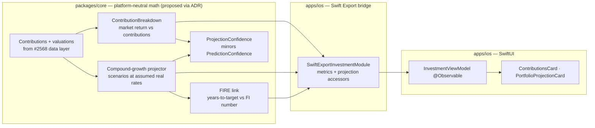

# iOS Contribution-Aware Portfolio Metrics & Projections

> Design specification for **market-return-vs-contribution** metrics,
> **compound-growth scenarios**, **FIRE-linked projection summaries**, and the
> **confidence states** that make those numbers honest — tuned for the passive
> index-fund investor.

**Status:** PROPOSED — design only (native implementation gated, see
[Implementation readiness](#implementation-readiness))
**Issue:** [#2570](https://github.com/jrmoulckers/finance/issues/2570) — _Part of
[#2118](https://github.com/jrmoulckers/finance/issues/2118)_
**Platform:** iOS (SwiftUI · Swift Charts · Swift Concurrency)
**Last updated:** 2026-06-22
**Related design docs:** [data-visualization.md](./data-visualization.md) ·
[accessibility-patterns.md](./accessibility-patterns.md) ·
[ux-principles.md](./ux-principles.md) ·
[cognitive-accessibility.md](./cognitive-accessibility.md)
**Depends on:**
[ios-investment-data-kmp-design.md](./ios-investment-data-kmp-design.md)
(contribution + price data)
**Sibling design:**
[ios-investment-chart-text-alternatives.md](./ios-investment-chart-text-alternatives.md)
(text alternative for the projection chart)

---

## Table of Contents

1. [Problem & Goal](#1-problem--goal)
2. [Affected iOS Surfaces](#2-affected-ios-surfaces)
3. [Shared Dependencies & the iOS / KMP Boundary](#3-shared-dependencies--the-ios--kmp-boundary)
4. [Metric 1 — Market Return vs Contributions](#4-metric-1--market-return-vs-contributions)
5. [Metric 2 — Compound-Growth Scenarios](#5-metric-2--compound-growth-scenarios)
6. [Metric 3 — FIRE-Linked Projection Summary](#6-metric-3--fire-linked-projection-summary)
7. [Confidence States](#7-confidence-states)
8. [Estimate Labelling & Assumptions](#8-estimate-labelling--assumptions)
9. [Accessibility](#9-accessibility)
10. [Dynamic Type](#10-dynamic-type)
11. [Privacy & Balance Hiding](#11-privacy--balance-hiding)
12. [Empty, Stale & Error States](#12-empty-stale--error-states)
13. [Test Plan](#13-test-plan)
14. [Implementation readiness](#implementation-readiness)

---

## 1. Problem & Goal

The persona ([#2118](https://github.com/jrmoulckers/finance/issues/2118)) invests
almost exclusively in broad index funds (VTI, VXUS, BND) and wants to connect
**today's balance + contributions** to a **long-term FI timeline** — without
hype. Today the investment screens are purely descriptive:

- [`InvestmentPortfolioView.swift`](../../apps/ios/Finance/Screens/InvestmentPortfolioView.swift)
  shows current value, total gain/loss, return %, allocation, and a historical
  performance line — but **no contribution context** and **no forward view**.
- [`InvestmentEngine.kt`](../../packages/core/src/commonMain/kotlin/com/finance/core/investment/InvestmentEngine.kt)
  computes `portfolioReturnPercent` as a simple `(value − cost) / cost` figure,
  which **conflates market gains with money you added** — misleading for someone
  who dollar-cost-averages monthly.

**Goal:** specify three platform-neutral metric families and their iOS
presentation:

1. **Market return vs contributions** — separate "money I added" from "money the
   market made".
2. **Compound-growth scenarios** — simple, clearly-labelled projections from
   current balance + monthly contribution at a small set of assumed real return
   rates.
3. **FIRE-linked projection summary** — translate those scenarios into "years to
   your FI number", reusing the household's FIRE target.

…all wrapped in **confidence states** so a thin data history never masquerades as
precision.

**Non-goals:** the data persistence that feeds these metrics (owned by
[ios-investment-data-kmp-design.md](./ios-investment-data-kmp-design.md)); the
chart's text alternative (owned by the
[sibling doc](./ios-investment-chart-text-alternatives.md)); tax-, fee-, or
sequence-of-returns modelling (explicitly out of scope — see
[§8](#8-estimate-labelling--assumptions)).

---

## 2. Affected iOS Surfaces

| Surface                                                                                         | Change                                                                                                  |
| ----------------------------------------------------------------------------------------------- | ------------------------------------------------------------------------------------------------------- |
| [`InvestmentPortfolioView.swift`](../../apps/ios/Finance/Screens/InvestmentPortfolioView.swift) | New **Contributions vs Market** card; new **Projection** section (scenario chart + summary)             |
| [`InvestmentDetailView.swift`](../../apps/ios/Finance/Screens/InvestmentDetailView.swift)       | Per-holding contribution split in the metrics grid (where contribution data exists)                     |
| [`InvestmentViewModel.swift`](../../apps/ios/Finance/ViewModels/InvestmentViewModel.swift)      | Expose bridged metric/projection structs (`@Observable`); **no math added here** — it calls the bridge  |
| `PortfolioProjectionCard` (new SwiftUI view)                                                    | Renders scenarios + FIRE summary + confidence chip; consumes the descriptor in the text-alternative doc |
| [`InvestmentModels.swift`](../../apps/ios/Finance/Models/InvestmentModels.swift)                | Add `ContributionBreakdown`, `ProjectionScenario`, `FireProjectionSummary`, `ProjectionConfidence`      |

> **Math stays shared.** Every figure below is computed in `packages/core` and
> bridged as already-rounded values; the view models hold the result, format it
> via `SwiftExportFormatterModule`, and lay it out. No projection arithmetic runs
> in Swift.

---

## 3. Shared Dependencies & the iOS / KMP Boundary



| Concern                                                             | Lives in                        | Status                                                                                                                                                                                                            |
| ------------------------------------------------------------------- | ------------------------------- | ----------------------------------------------------------------------------------------------------------------------------------------------------------------------------------------------------------------- |
| Contributions + valuations source data                              | `packages/core` (+ persistence) | **From** [ios-investment-data-kmp-design.md](./ios-investment-data-kmp-design.md)                                                                                                                                 |
| Market-return-vs-contribution math (money-weighted + simple deltas) | `packages/core`                 | **Proposed via ADR** — extends `InvestmentEngine`                                                                                                                                                                 |
| Compound-growth projection (future value of annuity + lump sum)     | `packages/core`                 | **Proposed via ADR** — pure function, deterministic, unit-tested                                                                                                                                                  |
| FIRE target (FI number, years-to-target)                            | `packages/core`                 | **Proposed via ADR** — reuses household FIRE inputs / savings logic ([`SavingsEngine.kt`](../../packages/core/src/commonMain/kotlin/com/finance/core/savings/SavingsEngine.kt))                                   |
| Confidence model                                                    | `packages/core`                 | **Proposed via ADR** — mirror of `PredictionConfidence { LOW, MEDIUM, HIGH }` in [`BalancePredictionEngine.kt`](../../packages/core/src/commonMain/kotlin/com/finance/core/prediction/BalancePredictionEngine.kt) |
| Currency formatting (`Int64` → locale string)                       | `packages/core` (bridged)       | **Exists** — `SwiftExportFormatterModule.format(...)`                                                                                                                                                             |
| SwiftUI cards, VoiceOver semantics, Dynamic Type                    | `apps/ios`                      | **This doc**                                                                                                                                                                                                      |

> **Boundary rule:** amounts cross as **`Int64` minor units**; rates and
> percentages cross as `Double`; projection horizons as `Int` years/months. The
> projector is a **pure, deterministic function of (balance, monthlyContribution,
> realRate, years)** so it is trivially testable in `commonTest` and identical
> across platforms.

> **KMP changes are out of scope for this PR.** Every "proposed" row is an
> @native-app-engineer / @architect change via **ADR** per [AGENTS.md](../../AGENTS.md).
> This doc names the contracts and the iOS presentation; it does not edit
> `packages/`.

---

## 4. Metric 1 — Market Return vs Contributions

**Why:** `(value − cost) / cost` rewards someone for simply adding cash. The
persona needs to see how much of their growth is **the market** vs **their own
deposits**.

Bridged result type (iOS mirror of a proposed KMP `ContributionBreakdown`):

```swift
struct ContributionBreakdown: Sendable, Hashable {
    let totalContributedMinorUnits: Int64   // sum of deposits − withdrawals
    let currentValueMinorUnits: Int64
    let marketGainMinorUnits: Int64         // currentValue − totalContributed
    let simpleReturnPercent: Double?        // (value − cost)/cost  (existing)
    let moneyWeightedReturnPercent: Double? // time-aware return on contributions
    let currencyCode: String
}
```

- **Decomposition shown to the user:** "You've put in **$48,000**. The market
  added **$11,200**. Total **$59,200**." A simple two-segment bar (contributions
  vs market gain) makes the split glanceable; the
  [text-alternative doc](./ios-investment-chart-text-alternatives.md) gives it a
  spoken summary + rows.
- **Money-weighted return** (a time-aware IRR-style figure on the contribution
  schedule) is the honest "how did my investing do" number and is computed in
  KMP; the existing simple return stays available and clearly labelled as
  "Total return (incl. contributions)".
- **Withdrawals** reduce `totalContributed`; the breakdown stays correct for
  someone drawing down.
- All three numbers are **derived in `packages/core`**; iOS only formats.

---

## 5. Metric 2 — Compound-Growth Scenarios

A small, opinionated set of **clearly-labelled estimates** — never a single
false-precision number.

```swift
struct ProjectionScenario: Identifiable, Sendable, Hashable {
    let id: String                  // "conservative" | "moderate" | "optimistic"
    let label: String               // String(localized:)
    let realRatePercent: Double     // assumed annualised REAL return
    let endingBalanceMinorUnits: Int64
    let points: [PerformanceDataPoint]  // year-by-year, for the projection chart
}
```

- **Inputs:** current balance + average monthly contribution (from #2568
  contribution history; if no contribution history, contribution defaults to 0
  and the UI says so) + a horizon (default to the FIRE timeline, with a
  picker: 10 / 20 / 30 years).
- **Scenarios:** three fixed **real** (inflation-adjusted) rates — e.g.
  **conservative 3%**, **moderate 5%**, **optimistic 7%** — chosen to bracket a
  broadly diversified index portfolio. Rates are constants in shared code, not
  user-tuned magic, and every scenario is captioned with its rate.
- **Math:** future value of current balance (lump sum) **plus** future value of a
  monthly contribution annuity, compounded monthly, in **real** terms so the
  number is in today's dollars. Deterministic; no Monte Carlo in v1.
- **Presentation:** a single Swift Charts line chart with three series
  (one per scenario) using the CVD-safe `ChartColorPalette`, plus a compact
  "In {years} years: **{moderate}** (range {conservative}–{optimistic})" caption.
  The chart's non-visual equivalent is specified in the
  [text-alternative doc](./ios-investment-chart-text-alternatives.md).

---

## 6. Metric 3 — FIRE-Linked Projection Summary

Translate the scenarios into the question the persona actually asks: **"when?"**

```swift
struct FireProjectionSummary: Sendable, Hashable {
    let fiNumberMinorUnits: Int64        // FI target (e.g. annualExpenses × 25)
    let currentBalanceMinorUnits: Int64
    let progressFraction: Double         // current / fiNumber, clamped 0…1
    let yearsToTargetModerate: Double?   // nil if not reachable in horizon
    let yearsRangeLow: Double?           // optimistic-rate years
    let yearsRangeHigh: Double?          // conservative-rate years
    let confidence: ProjectionConfidence
}
```

- **FI number** comes from the household's FIRE inputs (annual expenses × the
  configured safe-withdrawal multiple, default 25× ≈ the 4% rule). This reuses
  shared savings/FIRE logic
  ([`SavingsEngine.kt`](../../packages/core/src/commonMain/kotlin/com/finance/core/savings/SavingsEngine.kt))
  rather than re-deriving it; if a dedicated FIRE engine lands, this summary
  binds to it.
- **Years-to-target** is reported as a **range** ("about **18–26 years**, ~22 at
  a moderate 5% real return"), never a single hero number, and is `nil` /
  "beyond {horizon}" when the target isn't reachable in the chosen horizon.
- **Progress** is shown as a labelled `ProgressView` ("**31%** of your FI number")
  with a text value for VoiceOver — colour is never the only cue.
- If FIRE inputs are missing, the summary degrades to a prompt ("Set your annual
  expenses to see your FI timeline") instead of guessing.

---

## 7. Confidence States

Projections are only as trustworthy as their inputs. Mirror the existing
`PredictionConfidence { LOW, MEDIUM, HIGH }` enum from
[`BalancePredictionEngine.kt`](../../packages/core/src/commonMain/kotlin/com/finance/core/prediction/BalancePredictionEngine.kt)
so the app speaks one confidence language.

```swift
enum ProjectionConfidence: Sendable { case low, medium, high }
```

| Confidence | Trigger (computed in KMP)                                                           | UI treatment                                                                                              |
| ---------- | ----------------------------------------------------------------------------------- | --------------------------------------------------------------------------------------------------------- |
| **High**   | ≥ 24 months of contribution history **and** ≥ 12 valuations **and** FIRE inputs set | Full scenarios + FIRE range; chip "High confidence"                                                       |
| **Medium** | ≥ 6 months history, some gaps, FIRE inputs set                                      | Scenarios shown; range widened; chip "Medium — based on limited history"                                  |
| **Low**    | < 6 months history **or** no contribution data **or** no FIRE inputs                | Scenarios shown as "rough estimate"; FIRE range suppressed if no FI number; chip "Low — add more history" |

- Confidence is **text + icon**, never colour alone; the chip's
  `.accessibilityValue` states the level and the reason.
- Lower confidence **widens** the displayed range and softens copy
  ("rough estimate") rather than hiding the feature — transparency over silence.
- Confidence is derived in shared code from data availability, so iOS and any
  future platform agree.

---

## 8. Estimate Labelling & Assumptions

**Projections are estimates, and the UI says so — prominently and in text.**

- Every projection surface carries a persistent, VoiceOver-readable disclaimer:
  **"Estimate. Not financial advice. Markets vary and past performance doesn't
  guarantee future results."** (`String(localized:)`).
- **Stated assumptions** (shown in an expandable "How this is calculated" /
  `DisclosureGroup`, always reachable by VoiceOver):
  - Returns are **real (inflation-adjusted)**, so amounts are in **today's
    dollars**.
  - Assumed real rates are **fixed constants** (3% / 5% / 7%), **not** a forecast
    of any specific fund.
  - Contributions are assumed **constant** at the recent monthly average and
    invested monthly.
  - **Excluded:** taxes, fees/expense ratios, sequence-of-returns risk, currency
    effects, and one-off events. v1 is deterministic compounding, **not** a
    probabilistic simulation.
- Per [ux-principles.md](./ux-principles.md) and
  [cognitive-accessibility.md](./cognitive-accessibility.md), copy is plain,
  non-hype, and avoids implying certainty ("could grow to", not "will be").
- Numbers are **rounded** for display (no false precision); the rounding happens
  in shared code so all platforms match.

---

## 9. Accessibility

- **Every metric is text-first.** The contributions split, each scenario's
  ending balance, the FIRE range, and the confidence level are all real text with
  `.accessibilityLabel` / `.accessibilityValue` — a VoiceOver user gets the full
  story without the charts. The projection **chart's** spoken summary + data
  table are specified in
  [ios-investment-chart-text-alternatives.md](./ios-investment-chart-text-alternatives.md).
- **Confidence and progress never rely on colour** — chip text + SF Symbol, and a
  spoken progress value ("31 percent of your FI number").
- **Disclaimer is in the accessibility tree**, not a visual-only footnote, and is
  swipe-reachable before the numbers it qualifies.
- **Direction words** ("market added", "market lost") come from the sign of the
  shared delta, not from red/green.
- Reduce Motion: the scenario chart's draw-in animation respects the
  `accessibilityReduceMotion` environment value.

---

## 10. Dynamic Type

- All metric labels, scenario captions, the FIRE range, and the disclaimer use
  Dynamic Type system styles / the `FinanceTextStyle` ramp — **never** hardcoded
  point sizes — and **wrap** (`.fixedSize(horizontal: false, vertical: true)`)
  rather than truncate at the largest accessibility sizes.
- The contributions-vs-market bar and scenario captions reflow `HStack → VStack`
  via the adaptive-stack convention at accessibility sizes.
- Multi-figure rows (range "$x–$y") keep `.minimumScaleFactor` only on dense
  visual chips, never on the primary numbers in the summary text.

---

## 11. Privacy & Balance Hiding

- When balance hiding is active, **every** projected amount, the FI number, the
  contributions split, and the ending balances redact to a placeholder in **both**
  the visible text **and** the VoiceOver string, from the same redacted model.
  Non-sensitive values (years-to-target, confidence level, progress %) may remain.
- Per [os.Logger guidance](../../AGENTS.md), projected balances, contributions,
  and the FI number are `.private`; only confidence level and lifecycle events are
  loggable. Projections are **derived** on device from already-local data — no
  new secret is introduced, and nothing is sent to a third party.
- No projection inputs/outputs are written to `UserDefaults`; any future widget
  receives only a pre-redacted, formatted string via the App Group.

---

## 12. Empty, Stale & Error States

| State                | Trigger                                 | Behaviour                                                                                                     |
| -------------------- | --------------------------------------- | ------------------------------------------------------------------------------------------------------------- |
| **Empty**            | No holdings / no balance                | Projection section hidden; reuse `EmptyStateView` ("Add investments to see projections").                     |
| **No contributions** | Holdings exist, no contribution history | Scenarios use balance-only growth; caption "Add contributions for a personalised projection"; confidence Low. |
| **No FIRE inputs**   | No annual-expenses / FI number          | FIRE summary replaced by a prompt ("Set annual expenses for your FI timeline"); scenarios still shown.        |
| **Stale**            | Underlying valuation stale (from #2568) | "Based on data as of {asOf}" prefix on the projection summary; numbers still render; staleness announced.     |
| **Error**            | Bridge/metric computation throws        | Projection section shows a labelled **Retry**; the descriptive cards (value, allocation) stay usable.         |

All copy uses `String(localized:)`; no state relies on colour alone; error copy
is non-judgemental per [ux-principles.md](./ux-principles.md).

---

## 13. Test Plan

Smallest tests that must pass before implementation is accepted. Native tests run
on Simulator with **free Personal Team signing** (see
[Implementation readiness](#implementation-readiness)).

### Shared (KMP) — `packages/core` `commonTest` _(proposed via ADR; not in this PR)_

- `ContributionBreakdownTest`: given a contribution schedule + current value,
  `totalContributed`, `marketGain`, and `moneyWeightedReturnPercent` are correct;
  covers withdrawals, zero contributions, and a loss (market gain negative).
- `CompoundGrowthProjectorTest`: future value of (lump sum + monthly annuity) at
  3/5/7% real matches closed-form expectations within rounding; horizon 0 returns
  the current balance; negative contribution (drawdown) decreases the balance.
- `FireProjectionTest`: years-to-target is monotonic in rate (optimistic ≤
  moderate ≤ conservative years); unreachable-in-horizon yields `nil`; missing FI
  number yields the prompt state.
- `ProjectionConfidenceTest`: history length × FIRE-inputs presence map to
  Low/Medium/High exactly per the [§7](#7-confidence-states) thresholds.

### Native (iOS) — XCTest / Swift Testing in `apps/ios/Tests`

- `InvestmentViewModelProjectionTests`: with a stub bridge, the view model exposes
  the bridged breakdown/scenarios/FIRE summary unchanged and **performs no math**.
- `ProjectionCardA11yTests`: the disclaimer is a focusable element ordered before
  the numbers; confidence chip's `.accessibilityValue` states level + reason.
- `ProjectionPrivacyRedactionTests`: with balance hiding on, no projected amount
  or FI number appears in visible text **or** accessibility labels.
- `ProjectionDynamicTypeTests` (snapshot/XCUITest): at the largest accessibility
  size the scenario caption and FIRE range wrap and remain fully readable.
- `ProjectionStateTests`: empty / no-contributions / no-FIRE / stale / error each
  expose exactly one labelled focusable element (or labelled retry) and the
  estimate disclaimer where projections are shown.

---

## Implementation readiness

**Design: ready now. Native code: buildable now, distribution gated.**

Per the
[Human-Gated Prerequisites runbook](../ops/human-gated-prerequisites.md#2-implementation-vs-distribution--the-decoupling),
implementation and distribution are decoupled. The "blocked by
[#1239](https://github.com/jrmoulckers/finance/issues/1239)" note on
[#2570](https://github.com/jrmoulckers/finance/issues/2570) is a **distribution**
gate only.

| Phase              | What                                                                                              | Gated by #1239?                         |
| ------------------ | ------------------------------------------------------------------------------------------------- | --------------------------------------- |
| **Design**         | This document — metrics, scenarios, FIRE link, confidence, assumptions, test plan                 | No — deliverable now                    |
| **Implementation** | `ContributionsCard`, `PortfolioProjectionCard`, view-model wiring, unit + a11y tests on Simulator | **No** — free Personal Team signing     |
| **Distribution**   | TestFlight / App Store build carrying projections                                                 | **Yes** — Apple Developer Program enrol |

- **Buildable now:** all cards, the projection chart, VoiceOver semantics,
  Dynamic Type behaviour, and the listed iOS tests run on Simulator / device via
  free Personal Team signing. No paid entitlements are required.
- **Gated tail (#1239):** only shipping through TestFlight / the App Store needs
  the paid Apple Developer enrollment + signing in
  [human-gated-prerequisites.md §3.2](../ops/human-gated-prerequisites.md#32-ios-distribution--apple-developer-1239).
  An SME agent must **not** perform enrollment, certificate, or secret steps.
- **Shared-logic tail:** the contribution-breakdown, compound-growth projector,
  FIRE link, and confidence model are @native-app-engineer / @architect changes via
  **ADR**, and they depend on the contribution/price data from
  [ios-investment-data-kmp-design.md](./ios-investment-data-kmp-design.md). Until
  those land, the iOS cards can bind to the stub bridge with seeded scenarios so
  the SwiftUI + a11y work proceeds in parallel.

_Part of [#2118](https://github.com/jrmoulckers/finance/issues/2118). Depends on
[KMP-backed investment data](./ios-investment-data-kmp-design.md); paired with
[investment chart text alternatives](./ios-investment-chart-text-alternatives.md)._
