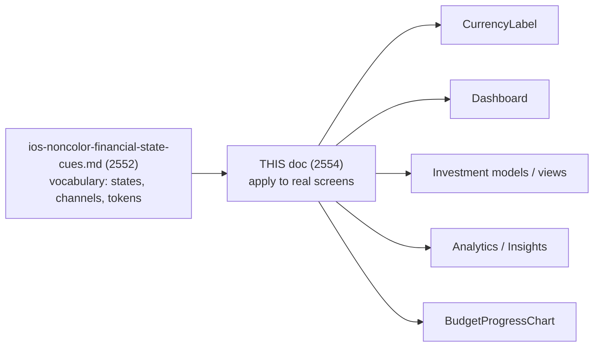
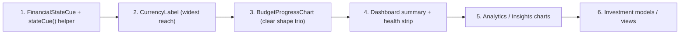

# Apply Redundant Financial State Cues Across iOS Screens — Design

> **Status:** PROPOSED — design only (no native build performed)
> **Issue:** [#2554](https://github.com/jrmoulckers/finance/issues/2554) · Part of [#2121](https://github.com/jrmoulckers/finance/issues/2121)
> **Platform:** iOS · iPadOS · watchOS · WidgetKit · App Clip (SwiftUI, iOS 17+)
> **Owner:** @ios-engineer
> **Last updated:** 2026-06-22

This document is the **rollout plan** for redundant, non-color financial state
cues — the work of actually applying them to
[`CurrencyLabel`](../../apps/ios/Finance/Components/CurrencyLabel.swift), the
Dashboard, investment models/views, Analytics, and
[`BudgetProgressChart`](../../apps/ios/Finance/Charts/BudgetProgressChart.swift)
so every state is **visible and spoken without relying on color**.

It does **not** redefine the cue vocabulary — the semantic model (states,
text + symbol + shape + token channels, the grayscale acceptance bar) is fully
specified in
[ios-noncolor-financial-state-cues.md](./ios-noncolor-financial-state-cues.md)
([#2552](https://github.com/jrmoulckers/finance/issues/2552)). **Read that first;
this doc applies it.** Where the two could drift, the spec wins and this doc is
the per-screen adoption checklist.

---

## Table of Contents

1. [Why this matters](#1-why-this-matters)
2. [Relationship to the cue spec](#2-relationship-to-the-cue-spec)
3. [Current state — where color is the only signal](#3-current-state--where-color-is-the-only-signal)
4. [The shared application pattern](#4-the-shared-application-pattern)
5. [Per-screen rollout](#5-per-screen-rollout)
   - [5.1 CurrencyLabel](#51-currencylabel)
   - [5.2 Dashboard](#52-dashboard)
   - [5.3 Investment models & views](#53-investment-models--views)
   - [5.4 Analytics & Insights](#54-analytics--insights)
   - [5.5 BudgetProgressChart](#55-budgetprogresschart)
6. [Accessibility — VoiceOver, Dynamic Type, Reduce Motion](#6-accessibility--voiceover-dynamic-type-reduce-motion)
7. [Privacy & balance hiding](#7-privacy--balance-hiding)
8. [Stale, error, and empty states](#8-stale-error-and-empty-states)
9. [Shared dependencies and the KMP boundary](#9-shared-dependencies-and-the-kmp-boundary)
10. [Rollout sequencing](#10-rollout-sequencing)
11. [Smallest tests plan](#11-smallest-tests-plan)
12. [Implementation readiness](#12-implementation-readiness)
13. [References](#13-references)

---

## 1. Why this matters

The app today signals positive vs. negative money mostly by **color** — green
gain, red loss, red over-budget. That fails
[accessibility-patterns.md §5.3 — Never Convey Information by Color
Alone](./accessibility-patterns.md#53-never-convey-information-by-color-alone)
for the ~8% of users with a color-vision deficiency (red/green is the worst
pairing), for grayscale / Always-On / e-ink rendering, and for high-glare
outdoor use. The fix is to make **every** state recoverable from **text + icon +
shape**, with color as a redundant reinforcement only. This doc carries that fix
into the concrete screens called out in
[#2554](https://github.com/jrmoulckers/finance/issues/2554).

---

## 2. Relationship to the cue spec

The spec defines the **what**; this doc owns the **where and in what order**. The
single new presentation type it proposes — a `FinancialStateCue` value plus a
`stateCue(_:)` view modifier living under
[`Finance/Components`](../../apps/ios/Finance/Components/) — is described in the
spec ([§5](./ios-noncolor-financial-state-cues.md#5-affected-ios-surfaces)) and
is **the** vehicle each screen below adopts. It is not re-specified here.

---

## 3. Current state — where color is the only signal

Concrete, color-only signalling confirmed by reading the code today:

| File                                                                                   | Color-only signal                                                                                        | Target state                                                            |
| -------------------------------------------------------------------------------------- | -------------------------------------------------------------------------------------------------------- | ----------------------------------------------------------------------- |
| [`CurrencyLabel.swift`](../../apps/ios/Finance/Components/CurrencyLabel.swift)         | `amountColor` returns literal `.green` / `.red` by sign; no on-screen sign glyph or icon                 | sign glyph + direction symbol + semantic token; spoken "income/expense" |
| [`BudgetProgressChart.swift`](../../apps/ios/Finance/Charts/BudgetProgressChart.swift) | over-budget ring uses literal `AnyShapeStyle(Color.red)`; safe uses a palette color — only color differs | shape-distinct status symbol + fill pattern + numeric % + token         |
| [`InvestmentModels.swift`](../../apps/ios/Finance/Models/InvestmentModels.swift)       | `AssetClassUI.color` carries class identity by hue; gain/loss deltas rely on red/green                   | direction arrow + signed value; legend pairs swatch with label/symbol   |
| `AnalyticsView` / `InsightsView`                                                       | trend up/down and over/under bands distinguished by color                                                | arrow direction + signed delta text + non-color band hatch              |
| `DashboardView`                                                                        | net-worth and summary columns colored by sign; budget-health strip by color                              | sign glyph + status symbol on each summary value and the health strip   |

> **The acceptance bar (from the spec):** print any of these screens in
> grayscale. If gain still reads from loss, and safe from warning from
> over-budget, the cue passes. Today, several of these collapse to one gray.

The literal `.green` / `.red` / `Color.red` usages above are exactly the
banned-token cases the spec's lint/unit check
([spec §10](./ios-noncolor-financial-state-cues.md#10-test-plan)) is meant to
catch; replacing them is the measurable goal of this rollout.

---

## 4. The shared application pattern

Every screen adopts the same three moves, so the rollout is uniform and review
is mechanical:

1. **Replace literal colors with semantic tokens.** Swap `.green` / `.red` /
   `Color.red` for
   [`FinanceColors`](../../apps/ios/Finance/Theme/FinanceColors.swift) tokens
   (`amountPositive`, `amountNegative`, `statusPositive`, `statusWarning`,
   `statusNegative`). Tokens are light/dark + increased-contrast adaptive; literal
   colors are not.
2. **Add the non-color channels.** Pair each colored value with (a) a **text
   label** or sign glyph (`+` / U+2212 `−`), (b) an **SF Symbol** whose
   _silhouette_ encodes the state (`arrow.up.right` / `arrow.down.right`;
   `checkmark.circle.fill` / `exclamationmark.circle.fill` /
   `exclamationmark.triangle.fill`), and (c) where a bar/ring is involved, a
   **fill pattern** that escalates with severity.
3. **Speak the state.** Compose the VoiceOver label with the state word
   ("income", "expense", "over budget", "on track") via
   [`financeCurrencyLabel` / `financeLabel`](../../apps/ios/Finance/Accessibility/AccessibilityModifiers.swift)
   — never a color word.

The state itself is **consumed**, never computed, on iOS: budget health comes
from the shared `BudgetHealth` enum and amount direction from the `Cents` sign /
`TransactionType` (see [§9](#9-shared-dependencies-and-the-kmp-boundary)).

---

## 5. Per-screen rollout

### 5.1 CurrencyLabel

The most leveraged change — `CurrencyLabel` renders in transaction rows,
account balances, dashboard summaries, and detail screens, so fixing it once
propagates widely.

- **Today:** `amountColor` returns `.green` for positive, `.red` for negative;
  the displayed text has no on-screen sign or icon, only color.
- **Apply:** route `amountColor` through `FinanceColors.amountPositive /
amountNegative` (token, not literal). When `showSign` is true, prefix the
  formatted string with `+` / `−` and place an optional leading direction symbol
  (`arrow.up.right` / `arrow.down.right`) controlled by a `showDirectionGlyph`
  parameter for compact rows. Keep the existing `.accessibilityLabel`
  ("Income of …" / "Expense of …") — it already speaks the state, which is the
  contract; do not regress it.
- **Note:** `CurrencyLabel` already has the right VoiceOver phrasing in
  `accessibilityDescription`; this change adds the **visible** non-color channel
  to match the spoken one, and swaps literal colors for tokens.

### 5.2 Dashboard

[`DashboardView.swift`](../../apps/ios/Finance/Screens/DashboardView.swift)
shows the net-worth hero, an Income/Expenses/Net summary, and a budget-health
strip.

- **Net-worth & summary:** each value carries a sign glyph + direction symbol
  via the shared cue, not just color. At accessibility sizes the trio reflows
  vertically (see [§6](#6-accessibility--voiceover-dynamic-type-reduce-motion)
  and the
  [reflow audit](./ios-dynamic-type-reflow-audit.md#5-surface-by-surface-audit)).
- **Budget-health strip:** each segment shows the status **symbol**
  (circle-check / circle-bang / triangle) and `% used` text, so safe/warning/over
  is readable in grayscale, not by band color alone.
- **Recent rows:** rendered through the consolidated `TransactionRowView`, which
  already carries the income/expense cue per [#2544](./ios-transaction-row-voiceover-labels.md#7-redundant-non-color-cues).

### 5.3 Investment models & views

[`InvestmentModels.swift`](../../apps/ios/Finance/Models/InvestmentModels.swift),
[`InvestmentDetailView.swift`](../../apps/ios/Finance/Screens/InvestmentDetailView.swift),
[`InvestmentPortfolioView.swift`](../../apps/ios/Finance/Screens/InvestmentPortfolioView.swift).

- **Gain/loss deltas** (day change, total return) get the direction arrow +
  explicit signed value + token — never a bare red/green number.
- **Allocation legend:** `AssetClassUI` already pairs each class with a
  `systemImage` (`chart.line.uptrend.xyaxis`, `dollarsign.circle`, …) and a
  CVD-safe `ChartColorPalette` color. The rollout ensures every legend entry
  **shows the symbol + class name next to its swatch** so allocation is readable
  without distinguishing hues — color stays a redundant layer.
- **Holding rows:** value sign and direction cue accompany the amount; security
  name wraps (no `lineLimit(1)`), consistent with the reflow audit.

### 5.4 Analytics & Insights

[`AnalyticsView.swift`](../../apps/ios/Finance/Screens/AnalyticsView.swift),
[`InsightsView.swift`](../../apps/ios/Finance/Screens/InsightsView.swift), and
their Swift Charts.

- **Trend annotations** carry an arrow + signed delta, not a colored line alone,
  per [data-visualization.md](./data-visualization.md) and the IBM CVD-safe
  series palette in
  [`ChartColorPalette`](../../apps/ios/Finance/Charts/ChartColorPalette.swift).
- **Over/under-budget bands** use a non-color hatch in addition to the token
  color; the band's role is also in its per-mark `.accessibilityLabel`.
- **Metric cards** show the state symbol next to the value, and the insight
  sentence states direction in words ("Spending up 12% vs. last month").
- **Legends** wrap as whole chips via
  [`FlowLayout`](../../apps/ios/Finance/Components/FlowLayout.swift); each entry
  pairs the series name + symbol with its swatch.

### 5.5 BudgetProgressChart

[`BudgetProgressChart.swift`](../../apps/ios/Finance/Charts/BudgetProgressChart.swift)
renders accessory-circular gauges per budget.

- **Today:** `ringGradient` returns literal `Color.red` when `isOverBudget`,
  otherwise a palette color — the _only_ difference between safe and over is hue.
- **Apply:** drive the ring from the shared `BudgetHealth` (safe / warning /
  over) and render, in addition to the token tint: a **status symbol** at the
  ring center or label (circle-check / circle-bang / triangle), an **escalating
  fill pattern** (solid → 45° hatch → cross-hatch) drawn as a `Shape`/`Canvas`
  overlay so it scales with Dynamic Type, and an **over-budget end-cap flag** at
  the 100% mark. The gauge's existing `.accessibilityValue` ("… % spent, $x of
  $y") gains the state word ("over budget", "on track").
- **Three shapes, not three reds:** the trio must be separable by silhouette in
  grayscale, per the spec's
  [§3.2](./ios-noncolor-financial-state-cues.md#3-cue-vocabulary-text--symbol--pattern--token).

---

## 6. Accessibility — VoiceOver, Dynamic Type, Reduce Motion

Per [accessibility-patterns.md](./accessibility-patterns.md) and
[cognitive-accessibility.md](./cognitive-accessibility.md):

**VoiceOver**

- Every cue speaks a **state word** — "income", "expense", "over budget", "on
  track", "approaching limit" — and **never** a color word. Built via
  [`financeCurrencyLabel` / `financeLabel`](../../apps/ios/Finance/Accessibility/AccessibilityModifiers.swift).
- Negative amounts announce "expense" / "negative" explicitly (the minus glyph is
  unreliable for AT) per
  [accessibility-patterns.md §7.1](./accessibility-patterns.md#71-currency-formatting-for-screen-readers).
- The status symbol and its value form **one** element
  (`.accessibilityElement(children: .combine)`) so VoiceOver reads "over budget,
  $35 over" as one coherent utterance.
- A state crossing (e.g. into over-budget) announces via
  [`financeLiveRegion` / `announceForAccessibility`](../../apps/ios/Finance/Accessibility/AccessibilityModifiers.swift)
  without stealing focus.

**Dynamic Type**

- All labels use `FinanceTextStyle` / `.financeFont(...)`; status symbols scale
  with `@ScaledMetric`. At AX1–AX5, inline `[symbol][amount][label]` rows reflow
  vertically via
  [`AdaptiveFinanceStack`](../../apps/ios/Finance/Accessibility/DynamicTypeSupport.swift).
  Pattern fills keep ≥2pt stroke spacing at AX5 so hatching does not smear to
  solid. This dovetails with the
  [reflow audit](./ios-dynamic-type-reflow-audit.md) and the
  [AX-size layout tests](./ios-dynamic-type-layout-tests.md).

**Reduce Motion / Differentiate Without Color**

- Honor `accessibilityReduceMotion`: a state transition cross-fades or swaps
  statically, never sweeps.
- Honor `accessibilityDifferentiateWithoutColor`: when **on**, increase pattern
  prominence and always show the text label, even in compact widget/watch
  layouts.

---

## 7. Privacy & balance hiding

- State cues must not leak hidden values. When an amount is redacted (privacy
  mode / `.privacySensitive()`), the **direction/state symbol may remain** (it
  reveals no figure) but the **numeric** part stays hidden, and VoiceOver says
  "Amount hidden" rather than reading a balance — consistent with
  [#2544 §9](./ios-transaction-row-voiceover-labels.md#9-privacy--balance-hiding).
- Widgets/complications inherit the same rule via the App Group privacy flag
  ([`WidgetPrivacy.swift`](../../apps/ios/Shared/WidgetPrivacy.swift)): a cue's
  color/symbol can show "over budget" without printing the over-amount on a Lock
  Screen.
- Logging stays `.public` metadata only — never a value — per the `os.Logger`
  rules.

---

## 8. Stale, error, and empty states

| State       | Cue behaviour                                                                                                                                                                                                                               |
| ----------- | ------------------------------------------------------------------------------------------------------------------------------------------------------------------------------------------------------------------------------------------- |
| **Stale**   | When data is stale/offline, cues render from last-known state but are visibly marked stale (the [`OfflineBanner`](../../apps/ios/Finance/Components/OfflineBanner.swift) + a muted token); never imply a fresh "on track" on stale numbers. |
| **Error**   | If state cannot be classified (load failed), show a **neutral** cue (no false gain/loss/over), surface the error via [`ErrorStateView`](../../apps/ios/Finance/Components/ErrorStateView.swift), and speak "status unavailable".            |
| **Empty**   | No transactions/holdings ⇒ no state cue at all; [`EmptyStateView`](../../apps/ios/Finance/Components/EmptyStateView.swift) guidance instead — never a default green "all good".                                                             |
| **Loading** | Skeleton placeholders carry no state color/symbol; cues appear only once real state resolves.                                                                                                                                               |

Fail-safe principle: **absence of data is never rendered as a positive state.**

---

## 9. Shared dependencies and the KMP boundary

The "what state is this?" / "how do we show it?" split (from the spec
[§6](./ios-noncolor-financial-state-cues.md#6-shared-dependencies--the-classification-boundary))
holds for every screen here:

| Concern                                           | Owner                                                |
| ------------------------------------------------- | ---------------------------------------------------- |
| Budget health thresholds (75% / 100%)             | `packages/core` (`BudgetCalculator`, `BudgetHealth`) |
| Over-budget flag, utilization                     | `packages/core` (`BudgetStatus`)                     |
| Amount sign / income vs. expense                  | `packages/models` (`Cents`, `TransactionType`)       |
| Currency formatting                               | `packages/core` (`MoneyFormatter`)                   |
| State → (text / symbol / pattern / token) mapping | **`apps/ios`** (`FinancialStateCue`)                 |
| VoiceOver phrasing, Dynamic Type                  | **`apps/ios`**                                       |

- iOS **never** hard-codes the 75% / 100% thresholds or the income/expense
  comparison; it consumes the pre-classified `BudgetHealth` and `Cents` sign.
- If a unified shared `AmountDirection { GAIN, NEUTRAL, LOSS }` enum is wanted so
  Android/Web/Windows share identical semantics, that addition belongs in
  `packages/` via **ADR to @architect / @kmp-engineer** — the iOS engineer does
  not edit `packages/` directly. Until then, iOS derives direction from the
  existing `Cents` sign at the bridge.
- The cue layer switches the Swift state enum **exhaustively** (no `default:`),
  so a future state is a compile error until iOS handles it.

---

## 10. Rollout sequencing

Ordered so the most-shared component lands first and each step is independently
shippable:

1. Land the `FinancialStateCue` helper (spec-defined) with its unit tests.
2. `CurrencyLabel` — biggest blast radius; token swap + sign/direction glyph.
3. `BudgetProgressChart` — shape-distinct trio + pattern.
4. Dashboard summary + budget-health strip.
5. Analytics / Insights chart annotations, bands, legends.
6. Investment deltas, legend, holding rows.

Each step replaces literal colors with tokens, so the banned-color lint
([§11](#11-smallest-tests-plan)) goes green incrementally.

---

## 11. Smallest tests plan

Smallest/most-leveraged first:

- **Unit — cue mapping (`FinancialStateCueTests`):** each shared state maps to
  the expected (label, symbol, pattern, token); the switch is exhaustive.
- **Unit — banned-color guard:** a source check (or unit test) asserts no
  `Color.red` / `.green` / `.orange` / raw hex remains in the touched state-cue
  paths (`CurrencyLabel`, `BudgetProgressChart`, investment deltas), enforcing the
  spec's token-only rule.
- **Unit — CurrencyLabel:** positive/negative/zero produce the correct sign
  glyph, token, and the existing "Income/Expense of …" VoiceOver label
  (regression-protect the spoken contract).
- **Snapshot — grayscale acceptance:** render Dashboard, BudgetProgressChart,
  and an investment delta in **grayscale** (and under Smart Invert / Increase
  Contrast); assert each state is distinguishable — the spec's acceptance bar as
  a test. Reuse the AX-size snapshot harness from
  [ios-dynamic-type-layout-tests.md §6](./ios-dynamic-type-layout-tests.md#6-snapshot-harness-at-ax-sizes).
- **XCUITest a11y audit:** `performAccessibilityAudit()` on Dashboard,
  Budgets, Investments, Analytics reports zero `.contrast` / `.elementDetection`
  issues; VoiceOver labels contain a state word and no color word.

The minimum gate: cue-mapping unit tests + the banned-color guard pass, and the
grayscale snapshot distinguishes safe/warning/over for `BudgetProgressChart`.

---

## 12. Implementation readiness

See [`docs/ops/human-gated-prerequisites.md`](../ops/human-gated-prerequisites.md)
(§2 — implementation vs. distribution decoupling).

**Buildable now (no human gate):**

- The `FinancialStateCue` helper, every per-screen adoption, the token swaps, and
  all unit/snapshot/audit tests are implementable today on the iOS Simulator and
  a personal device using **free Personal Team** signing. Adding non-color cues
  and replacing literal colors with tokens needs no paid enrollment.

**Gated by [#1239](https://github.com/jrmoulckers/finance/issues/1239):**

- Only TestFlight / App Store distribution of the updated build and any paid
  physical-device matrix sit behind enrollment. The cue work itself needs none.

No human-gated operation is required to implement or verify this rollout.

---

## 13. References

- Cue specification: [Semantic Non-Color Financial State Cues (#2552)](./ios-noncolor-financial-state-cues.md)
  — the vocabulary this doc applies.
- Layout companions: [Dynamic Type Reflow Audit (#2548)](./ios-dynamic-type-reflow-audit.md)
  · [AX-Size Layout Tests (#2550)](./ios-dynamic-type-layout-tests.md)
- VoiceOver: [Transaction Row VoiceOver Labels (#2544)](./ios-transaction-row-voiceover-labels.md)
  · [Transaction Accessibility Regression (#2546)](./ios-transaction-accessibility-regression.md)
- Cross-platform: [Accessibility Patterns Library](./accessibility-patterns.md) — §5 Color & Contrast, §7 Financial Data
  · [Cognitive Accessibility Mode](./cognitive-accessibility.md)
  · [Data Visualization](./data-visualization.md) · [iOS Icon System](./icon-system-ios.md)
- Repo files touched: [`CurrencyLabel.swift`](../../apps/ios/Finance/Components/CurrencyLabel.swift)
  · [`BudgetProgressChart.swift`](../../apps/ios/Finance/Charts/BudgetProgressChart.swift)
  · [`InvestmentModels.swift`](../../apps/ios/Finance/Models/InvestmentModels.swift)
  · [`FinanceColors.swift`](../../apps/ios/Finance/Theme/FinanceColors.swift)
  · [`AccessibilityModifiers.swift`](../../apps/ios/Finance/Accessibility/AccessibilityModifiers.swift)
- Standards: Apple HIG — Color, SF Symbols · WCAG 2.2 — 1.4.1 Use of Color, 1.4.11 Non-text Contrast
