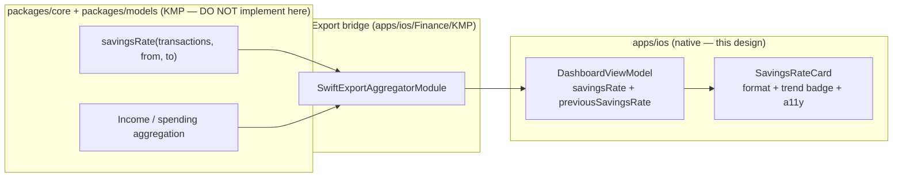

# Promote Savings-Rate Card to the iOS Dashboard

> The dashboard already _computes_ savings rate but never shows it. This design
> promotes it to a first-class, low-noise card — a headline percentage, a
> non-color trend badge versus last month, compact copy, and a single tap target
> into the deeper view — without adding clutter to the existing Dashboard.

**Status:** PROPOSED — design only (native implementation buildable now; store distribution gated)
**Issue:** [#2589](https://github.com/jrmoulckers/finance/issues/2589) — Part of [#2162](https://github.com/jrmoulckers/finance/issues/2162)
**Platform:** iOS / iPadOS (SwiftUI, iOS 17+)
**Owner:** @ios-engineer
**Related:** [ios-net-worth-trend-chart.md](./ios-net-worth-trend-chart.md) · [ios-noncolor-financial-state-cues.md](./ios-noncolor-financial-state-cues.md) · [accessibility-patterns.md](./accessibility-patterns.md) · [data-visualization.md](./data-visualization.md) · [content-language-guidelines.md](./content-language-guidelines.md) · [information-architecture.md](./information-architecture.md) · [Human-Gated Prerequisites](../ops/human-gated-prerequisites.md)

---

## Table of Contents

1. [Goal & Scope](#1-goal--scope)
2. [Current State](#2-current-state)
3. [Placement & Card Hierarchy](#3-placement--card-hierarchy)
4. [Trend Badge (vs Last Month)](#4-trend-badge-vs-last-month)
5. [Compact Copy](#5-compact-copy)
6. [Tap Target & Navigation](#6-tap-target--navigation)
7. [Accessibility](#7-accessibility)
8. [Privacy & Balance Hiding](#8-privacy--balance-hiding)
9. [States: Empty, Loading, Stale, Error & Edge Cases](#9-states-empty-loading-stale-error--edge-cases)
10. [Native ↔ KMP Boundary](#10-native--kmp-boundary)
11. [Affected Surfaces & Shared Dependencies](#11-affected-surfaces--shared-dependencies)
12. [Test Plan (Smallest Tests First)](#12-test-plan-smallest-tests-first)
13. [Implementation Readiness](#13-implementation-readiness)
14. [Open Questions](#14-open-questions)

---

## 1. Goal & Scope

Savings rate — the share of income you keep — is the single most motivating
number for the budgeting personas, yet the
[`DashboardView`](../../apps/ios/Finance/Screens/DashboardView.swift) renders net
worth, a monthly income/expense summary, budget rings, quick access, and recent
transactions, but **not** savings rate, even though
[`DashboardViewModel`](../../apps/ios/Finance/ViewModels/DashboardViewModel.swift)
already calculates it. This design closes that gap.

**In scope:**

- A `SavingsRateCard` SwiftUI surface placed in the existing Dashboard scroll
  stack with a clear visual hierarchy.
- A **trend badge** comparing this month to last month, using a non-color cue
  (arrow + sign) per the iOS state-cue guidance.
- **Compact copy**, a **44 pt tap target** into the existing detail surface, and
  full accessibility / privacy / state coverage.

**Out of scope:**

- A full savings-rate _history chart_ — the card deep-links into the existing
  analytics/insights surface; the trend over time is a follow-on under #2162.
- Changing the **calculation** — savings-rate math stays in KMP `packages/core`
  via the bridge ([§10](#10-native--kmp-boundary)).
- New tabs or navigation destinations — the goal is "first-class **without**
  adding noise," so the card slots into the existing Dashboard, no new IA
  (see [information-architecture.md](./information-architecture.md)).

> **Why a card, not a screen:** consistent with
> [ios-net-worth-trend-chart.md](./ios-net-worth-trend-chart.md), the headline
> figure belongs inline on the Dashboard next to the income/expense summary that
> explains it; detail-on-demand lives one tap away.

---

## 2. Current State

- [`DashboardViewModel`](../../apps/ios/Finance/ViewModels/DashboardViewModel.swift)
  exposes `savingsRate: Double` (a 0–100 percentage) plus `monthlyIncome` and
  `monthlyExpenses`, all recomputed in `recomputeAggregations()` via the bridge
  `aggregator.savingsRate(...)`. **The value exists but is never rendered.**
- The view model computes for the **current month** window only; a
  **previous-month** value is needed for the trend badge ([§4](#4-trend-badge-vs-last-month)).
- The Dashboard's cards use a consistent style: `.regularMaterial` background,
  `RoundedRectangle(cornerRadius: 16)`, `CurrencyLabel`, and
  `.accessibilityElement(children: .combine)` — the new card matches this.
- `savingsRate` is a percentage, so it is computed and formatted **without**
  the privacy `CurrencyLabel` path — relevant to [§8](#8-privacy--balance-hiding).

---

## 3. Placement & Card Hierarchy

Insert `SavingsRateCard` **directly under** the existing `spendingSummaryCard`
(which shows Income / Expenses / Net), because savings rate is the natural
synthesis of those two numbers:

```text
ScrollView
  ├─ OfflineBanner (conditional)
  ├─ netWorthCard
  ├─ spendingSummaryCard        ← Income / Expenses / Net
  ├─ SavingsRateCard            ← NEW (this design)
  ├─ budgetHealthSection
  ├─ quickAccessSection
  └─ recentTransactionsSection
```

Visual hierarchy inside the card (top → bottom, leading-aligned):

1. **Eyebrow label:** "Savings Rate" — `.subheadline`, `.secondary`,
   `.isHeader` trait.
2. **Headline:** the percentage — large, rounded, `.monospacedDigit()`
   (e.g. `.system(.largeTitle, design: .rounded, weight: .bold)`), with the
   **trend badge** trailing on the same baseline.
3. **Caption:** one compact, plain-language line ([§5](#5-compact-copy)).

The card is a `NavigationLink` (single tap target) styled to match the other
material cards; it adds exactly one row to the stack — no nested controls, no
chart — honoring "without adding noise."

---

## 4. Trend Badge (vs Last Month)

The badge answers "is this getting better?" at a glance.

- **Delta in percentage points:** `current − previous` savings rate, rendered as
  `+4 pts` / `−3 pts` / `even`. Points (not "%") avoids the percent-of-a-percent
  ambiguity.
- **Non-color cue first:** an SF Symbol (`arrow.up.right` / `arrow.down.right` /
  `arrow.right`) **plus** an explicit sign — color is secondary, per
  [ios-noncolor-financial-state-cues.md](./ios-noncolor-financial-state-cues.md)
  and [data-visualization §2.4](./data-visualization.md#24-never-color-alone).
- **Semantics:** higher savings rate is positive (use `statusPositive`); lower is
  cautionary (`statusWarning`/`statusNegative`). Crucially, the **direction is
  carried by the arrow and sign**, not by hue alone.
- **Requires a previous-month value:** add `previousSavingsRate` to the view
  model, computed via the same bridge call over the **prior** month window. This
  is presentation wiring; the arithmetic stays in KMP core ([§10](#10-native--kmp-boundary)).

The badge reflows below the headline under large Dynamic Type rather than
truncating (see [§7](#7-accessibility)).

---

## 5. Compact Copy

All `String(localized:)` with translator comments, plain and non-judgmental per
the [content language guidelines](./content-language-guidelines.md):

| Element            | Copy (en)                                    | Notes                                      |
| ------------------ | -------------------------------------------- | ------------------------------------------ |
| Eyebrow            | "Savings Rate"                               | Card title                                 |
| Headline           | "{n}%"                                       | Integer percent; `NumberFormatter` percent |
| Badge (up)         | "+{d} pts vs last month"                     | `d` = absolute point delta                 |
| Badge (down)       | "−{d} pts vs last month"                     | Minus sign, not hyphen                     |
| Badge (flat)       | "Even with last month"                       |                                            |
| Caption (positive) | "You're keeping {n}% of income."             | Reinforces meaning, no praise/shame        |
| Caption (zero/neg) | "Spending matched or passed income."         | Neutral framing for ≤ 0 savings rate       |
| Empty              | "Add transactions to see your savings rate." |                                            |

Copy stays to one caption line; numbers are locale-formatted.

---

## 6. Tap Target & Navigation

- The entire card is **one** `NavigationLink` (≥ 44 pt height by construction —
  the material card padding already exceeds it), routing to the existing
  detail surface — **[`InsightsView`](../../apps/ios/Finance/Screens/InsightsView.swift)**
  (or `AnalyticsView`) — reusing the pattern from the Dashboard's existing
  `quickAccessSection` `NavigationLink`s. No new screen is introduced.
- `.accessibilityHint` describes the destination ("Opens savings insights"); the
  link has a clear `.accessibilityLabel` + `.accessibilityValue` ([§7](#7-accessibility)).
- Pull-to-refresh and `.task { loadDashboard() }` already drive the value; the
  card needs no independent loading path.

---

## 7. Accessibility

Per the [accessibility patterns library](./accessibility-patterns.md):

- **VoiceOver:** the card is one combined element.
  - `.accessibilityLabel`: "Savings rate"
  - `.accessibilityValue`: "{n} percent, up {d} points versus last month"
    (direction spoken as words, never relying on the arrow glyph or color).
  - `.accessibilityHint`: "Opens savings insights".
  - Decorative arrow symbol is `.accessibilityHidden(true)` since its meaning is
    already in the spoken value.
- **Dynamic Type:** no hardcoded sizes — semantic fonts only; the headline uses
  `.minimumScaleFactor` only as a last resort, and the trend badge **wraps to a
  second line** at large accessibility sizes instead of clipping (validate
  against [ios-dynamic-type-reflow-audit.md](./ios-dynamic-type-reflow-audit.md)).
- **Reduce Motion:** if a count-up or badge animation is ever added, gate it on
  `accessibilityReduceMotion` and fall back to an instant value
  ([accessibility-patterns §6.1](./accessibility-patterns.md#61-reduced-motion-support)).
- **Never color alone:** trend direction is conveyed by arrow + sign + words, so
  the card is fully legible to color-blind users and in grayscale
  ([data-visualization §2.4](./data-visualization.md#24-never-color-alone)).
- **Contrast:** reuse the CVD-safe status palette from the widget/app tokens,
  meeting WCAG AA in light/dark ([data-visualization §2.1](./data-visualization.md#21-cvd-safe-palette)).

---

## 8. Privacy & Balance Hiding

Savings rate is a **percentage**, not a balance, so it is inherently
privacy-friendlier than dollar figures — but the design still respects the app's
balance-hiding posture:

- The **percentage and the trend badge remain visible** even when amount-hiding
  is active: a percent reveals no absolute balance, mirroring how the widget
  `.percent` masking mode ([`WidgetMoneyFormatter`](../../apps/ios/Shared/WidgetPrivacy.swift))
  is the privacy-safe representation.
- Any **absolute amounts** that might appear in the caption (none in the default
  copy) must route through the existing privacy-aware formatting; the default
  copy deliberately avoids dollar amounts so the card needs no unmasking.
- When the deeper [`InsightsView`](../../apps/ios/Finance/Screens/InsightsView.swift)
  shows underlying income/expense figures, those follow the app's existing
  masking — out of scope here, but the tap target must not leak amounts in its
  accessibility value (it speaks the percent only).

> Rule of thumb: **percentages pass; dollars get masked.** The savings-rate card
> is percent-first by design, so it stays informative under balance hiding.

---

## 9. States: Empty, Loading, Stale, Error & Edge Cases

| State           | Trigger                                                 | Rendering                                                                                                                  |
| --------------- | ------------------------------------------------------- | -------------------------------------------------------------------------------------------------------------------------- |
| **Loading**     | `isLoading && accounts.isEmpty`                         | Inherits the Dashboard's existing `ProgressView`; the card simply isn't built yet                                          |
| **Empty**       | No transactions in the current month                    | "Add transactions to see your savings rate." with a neutral icon; no badge                                                 |
| **Zero income** | `monthlyIncome == 0` (rate undefined; bridge returns 0) | Show "—" headline + empty-style caption, not a misleading "0%"                                                             |
| **Negative**    | Expenses ≥ income (rate ≤ 0)                            | Render the actual value (e.g. "0%") with the neutral "Spending matched or passed income." caption; trend badge still valid |
| **Stale**       | Data older than the app's refresh (offline)             | Render last-known value; the Dashboard's `OfflineBanner` already signals connectivity                                      |
| **Error**       | `loadDashboard()` sets `errorMessage`                   | The Dashboard's existing error `alert` handles it; the card shows last-known or hides until retry                          |

The card must **distinguish "0% saved" from "no data"** — the zero-income case
renders "—", never a falsely precise "0%".

---

## 10. Native ↔ KMP Boundary



- The **savings-rate formula** (and the income/spending it derives from) lives in
  KMP `packages/core`, already surfaced through
  [`SwiftExportAggregatorModule.savingsRate`](../../apps/ios/Finance/KMP/SwiftExportBridge.swift).
  The card and view model **call** it for the current and prior month windows;
  they do not reimplement the math.
- The only new view-model value, `previousSavingsRate`, is computed by invoking
  the **same** bridge method over the previous-month date range — wiring, not new
  arithmetic.
- iOS owns layout, the trend-badge presentation, formatting, accessibility, and
  privacy rendering only.

---

## 11. Affected Surfaces & Shared Dependencies

**New (this design):**

- `apps/ios/Finance/Components/SavingsRateCard.swift` (or an inline `private var`
  in `DashboardView`, matching the existing card style).

**Touched:**

- [`DashboardView`](../../apps/ios/Finance/Screens/DashboardView.swift) — add the
  card to the scroll stack between `spendingSummaryCard` and `budgetHealthSection`.
- [`DashboardViewModel`](../../apps/ios/Finance/ViewModels/DashboardViewModel.swift)
  — add `previousSavingsRate` (and a `savingsRateTrend` convenience) computed via
  the bridge over the prior month.

**Reused unchanged:**

- The bridge `SwiftExportAggregatorModule`, the existing
  [`InsightsView`](../../apps/ios/Finance/Screens/InsightsView.swift) navigation
  target, the status color tokens, and the Dashboard's error/refresh plumbing.

**Shared dependency:** KMP `packages/core` savings-rate aggregation
([§10](#10-native--kmp-boundary)).

---

## 12. Test Plan (Smallest Tests First)

1. **Trend computation (Swift unit):** given `savingsRate` and
   `previousSavingsRate`, assert the badge delta + direction (`up` / `down` /
   `even`), including the equal case → "Even with last month".
2. **Zero-income guard (Swift unit):** `monthlyIncome == 0` ⇒ headline "—" and the
   empty-style caption, **not** "0%".
3. **Negative savings (Swift unit):** expenses ≥ income ⇒ value renders with the
   neutral caption; trend still computed.
4. **VoiceOver value (XCUITest, smallest):** assert the card's combined
   `accessibilityValue` speaks the percent and direction in words and exposes no
   dollar amount.
5. **Dynamic Type reflow (snapshot):** render at default and `.accessibility5`;
   assert the trend badge wraps and nothing clips.
6. **Privacy (Swift unit/snapshot):** with amount-hiding on, assert the percent
   and badge remain visible and no masked dollar value leaks into the card.
7. **Empty state (snapshot):** no current-month transactions ⇒ empty copy, no badge.
8. **Shared (KMP, owned by @kmp-engineer):** savings-rate correctness (including
   rounding and the income = 0 boundary) is tested in `packages/core`, not iOS.

---

## 13. Implementation Readiness

See [Human-Gated Prerequisites](../ops/human-gated-prerequisites.md).

**Buildable now (no paid enrollment) — free Personal Team signing:**

- This is **pure SwiftUI** on an existing screen with an existing bridge value —
  no entitlements, App Groups, push, or Associated Domains. It builds and runs on
  a device under a **free Apple ID** (Personal Team) and in the simulator with no
  Apple Developer Program membership.
- All tests in [§12](#12-test-plan-smallest-tests-first) run locally without
  enrollment.

**Distribution tail — gated by [#1239](https://github.com/jrmoulckers/finance/issues/1239):**

- Only App Store / TestFlight distribution of the build is gated; the feature
  itself has **no** distribution-dependent capability. Add a `## Needs Human
Action` note on the PR pointing at
  [§3.2 of the prerequisites runbook](../ops/human-gated-prerequisites.md#32-ios-distribution--apple-developer-1239)
  for the distribution criterion only.

---

## 14. Open Questions

1. **Deep-link target:** `InsightsView` vs `AnalyticsView` vs `HealthScoreView` —
   confirm which best hosts "savings over time" so the tap is satisfying.
2. **Point vs percent delta:** confirm "pts" is clearer than "%" for the trend
   badge with the target personas (copy review with @content/design).
3. **Window definition:** does "last month" mean calendar month or trailing 30
   days? Must match the KMP-core window used by `savingsRate` to keep the badge
   honest.
4. **Threshold framing:** should the caption flag a target savings rate (e.g.
   20%) once goals exist (#2162), or stay descriptive for now? Default: descriptive.
