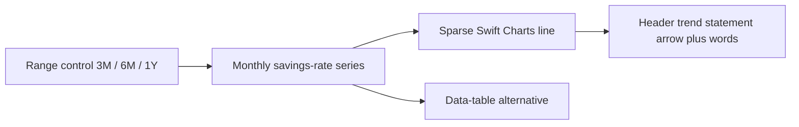
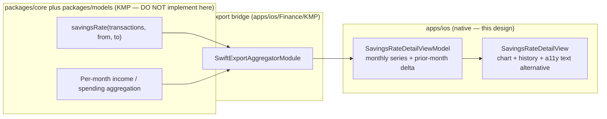

# Savings-Rate Trend & History Detail — iOS

> The Dashboard now shows a single headline savings-rate percentage and a
> "vs last month" badge, but tapping it lands on a generic insights surface.
> This design specifies the **detail destination** behind that tap: a trailing
> multi-month **trend** (a sparse Swift Charts line), an explicit **prior-month
> comparison**, and an optional **history list** for month-by-month context —
> all rendering values the shared layer already computes.

**Status:** PROPOSED — design only (native implementation buildable now; store distribution gated)
**Issue:** [#2591](https://github.com/jrmoulckers/finance/issues/2591) — Part of [#2162](https://github.com/jrmoulckers/finance/issues/2162)
**Platform:** iOS / iPadOS (SwiftUI + Swift Charts, iOS 17+)
**Owner:** @ios-engineer
**Related:** [ios-savings-rate-dashboard-card.md](./ios-savings-rate-dashboard-card.md) · [ios-net-worth-trend-chart.md](./ios-net-worth-trend-chart.md) · [ios-chart-voiceover-navigation.md](./ios-chart-voiceover-navigation.md) · [ios-chart-summaries-data-tables.md](./ios-chart-summaries-data-tables.md) · [ios-noncolor-financial-state-cues.md](./ios-noncolor-financial-state-cues.md) · [data-visualization.md](./data-visualization.md) · [chart-component-specs.md](./chart-component-specs.md) · [accessibility-patterns.md](./accessibility-patterns.md) · [content-language-guidelines.md](./content-language-guidelines.md) · [Human-Gated Prerequisites](../ops/human-gated-prerequisites.md)

---

## Table of Contents

1. [Goal & Scope](#1-goal--scope)
2. [Current State](#2-current-state)
3. [Where It Lives (Navigation)](#3-where-it-lives-navigation)
4. [Trend Chart (Trailing Months)](#4-trend-chart-trailing-months)
5. [Prior-Month Comparison](#5-prior-month-comparison)
6. [History List](#6-history-list)
7. [Accessibility](#7-accessibility)
8. [Privacy & Balance Hiding](#8-privacy--balance-hiding)
9. [States: Empty, Loading, Stale & Error](#9-states-empty-loading-stale--error)
10. [Native ↔ KMP Boundary](#10-native--kmp-boundary)
11. [Affected Surfaces & Shared Dependencies](#11-affected-surfaces--shared-dependencies)
12. [Test Plan (Smallest Tests First)](#12-test-plan-smallest-tests-first)
13. [Implementation Readiness](#13-implementation-readiness)
14. [Open Questions](#14-open-questions)

---

## 1. Goal & Scope

The savings-rate **card** ([ios-savings-rate-dashboard-card.md](./ios-savings-rate-dashboard-card.md),
[#2589](https://github.com/jrmoulckers/finance/issues/2589)) deliberately keeps the
Dashboard quiet: one headline percentage plus a non-color trend badge, with the
"history over time" explicitly deferred to a follow-on under
[#2162](https://github.com/jrmoulckers/finance/issues/2162). **This is that
follow-on.** It specifies the detail surface the card deep-links into, so the
single tap finally lands somewhere that answers "is my savings rate trending the
right way, and what did it do the past few months?"

**In scope:**

- A **trailing trend** of month-end savings rates (default **3 months**, with a
  6M / 1Y range control) drawn as a sparse Swift Charts line, mirroring the
  shape and range pattern of [ios-net-worth-trend-chart.md](./ios-net-worth-trend-chart.md).
- An explicit **prior-month comparison** (this month vs last month, in
  percentage points) consistent with the card's badge so the two surfaces agree.
- An optional **history list** — one row per month — for users who prefer the
  numbers over the chart, and as the chart's text alternative anchor.
- Full accessibility (chart text alternative + data table), privacy, and
  empty/loading/stale/error coverage.

**Out of scope:**

- The **math.** Savings-rate computation (and the income/spending it derives
  from) stays in KMP `packages/core`; iOS only renders values returned over the
  Swift Export bridge ([§10](#10-native--kmp-boundary)). This design does **not**
  implement or change that math.
- A **new tab.** The detail is a pushed `NavigationStack` destination, not a new
  IA node — consistent with "first-class without adding noise."
- **Goal/target framing** (e.g. "you're below a 20% target"). Targets arrive
  with goals under #2162; until then the surface stays descriptive.

> **Why a pushed detail, not an expanded card:** the card's job is one glanceable
> number. The trend, the per-month history, and the chart text alternatives need
> vertical room and their own VoiceOver order, which belongs on a dedicated
> screen one tap away — not inflated into the Dashboard scroll stack.

---

## 2. Current State

- [`DashboardViewModel`](../../apps/ios/Finance/ViewModels/DashboardViewModel.swift)
  exposes `savingsRate: Double` (a 0–100 percentage) for the **current month**,
  computed via the bridge `aggregator.savingsRate(...)`. The card design adds a
  `previousSavingsRate` for its badge. **Neither a multi-month series nor a
  detail screen exists yet.**
- The card deep-links to a generic destination (`InsightsView` / `AnalyticsView`)
  that does **not** show savings-rate-over-time — the gap this doc closes.
- The app already owns a **sparse trend pattern** worth reusing wholesale:
  [ios-net-worth-trend-chart.md](./ios-net-worth-trend-chart.md) defines the
  range control (3M / 6M / 1Y / All), the sparse Swift Charts presentation, and
  the chart text-alternative contract — this design follows it rather than
  inventing a parallel chart style.
- Chart accessibility primitives already exist as patterns:
  [ios-chart-voiceover-navigation.md](./ios-chart-voiceover-navigation.md)
  (no-drag point inspection) and
  [ios-chart-summaries-data-tables.md](./ios-chart-summaries-data-tables.md)
  (spoken summary + table alternative). The detail reuses both.

---

## 3. Where It Lives (Navigation)

The detail is a **pushed destination** reached from the savings-rate card's
existing single tap target — no new tab, no new modal:

```text
Dashboard (Home tab)
  └─ SavingsRateCard  ── tap ──▶  SavingsRateDetailView   ← NEW (this design)
                                    ├─ Header: current % + prior-month delta
                                    ├─ Trend chart (3M default, range control)
                                    ├─ "Show data table" disclosure (a11y)
                                    └─ History list (month-by-month)
```

- `SavingsRateDetailView` is appended to the Home tab's `NavigationStack`
  (`NavigationPath`), replacing the card's current generic destination. The card
  keeps its single 44 pt tap target and its `.accessibilityHint` ("Opens savings
  trend").
- The screen is driven by a dedicated `@Observable` `SavingsRateDetailViewModel`
  so the Dashboard view model stays lean; it loads on `.task` and supports
  pull-to-refresh, reusing the Dashboard's refresh/error plumbing.
- Deep-link reachability: a future `finance://insights/savings` route can target
  this screen, but the route is **out of scope** here (the card's in-app push is
  the only entry point this design requires).

---

## 4. Trend Chart (Trailing Months)

A **sparse** line of month-end savings rates, following
[ios-net-worth-trend-chart.md §4](./ios-net-worth-trend-chart.md) and the
[chart component specs](./chart-component-specs.md):

- **Series:** one point per calendar month, value = that month's savings rate
  (percentage). Y axis is a **percentage** scale (e.g. 0–60%, clamped sensibly),
  not currency — reinforcing the privacy posture in [§8](#8-privacy--balance-hiding).
- **Default range: trailing 3 months**, with a segmented control offering
  **3M / 6M / 1Y**. The acceptance scope ("trailing 3-month and prior-month
  comparisons") makes 3M the landing default; longer ranges are progressive.
- **Sparse presentation:** thin line, single accent stroke, minimal gridlines,
  endpoint label only — no point markers at every month unless the range is 3M
  (where labeling all three is legible). Use the CVD-safe accent from
  [data-visualization §2.1](./data-visualization.md#21-cvd-safe-palette).
- **Direction is never color-only:** the header carries an arrow + sign + words
  for the latest move (per [ios-noncolor-financial-state-cues.md](./ios-noncolor-financial-state-cues.md)),
  so a glance at the chart is backed by a textual trend statement.
- **Missing months** (no data / undefined rate) render as a **gap**, never as a
  0% point — a fabricated zero would mislead the trend ([§9](#9-states-empty-loading-stale--error)).



---

## 5. Prior-Month Comparison

The header restates, in full, the comparison the card shows compactly — so the
two surfaces never disagree:

- **This month vs last month**, in **percentage points** (`current − previous`),
  rendered `+4 pts` / `−3 pts` / `Even with last month` (minus sign, not hyphen).
  Points avoid the percent-of-a-percent ambiguity, matching the card's copy.
- The same bridge call that powers the card's `previousSavingsRate` powers this
  line — it is **presentation wiring**, not new arithmetic ([§10](#10-native--kmp-boundary)).
- Copy is `String(localized:)` with translator comments, plain and
  non-judgmental per [content-language-guidelines.md](./content-language-guidelines.md):

| Element              | Copy (en)                                | Notes                               |
| -------------------- | ---------------------------------------- | ----------------------------------- |
| Current headline     | "{n}% saved this month"                  | Integer percent, `.monospacedDigit` |
| Delta (up)           | "+{d} pts vs last month"                 | `d` = absolute point delta          |
| Delta (down)         | "−{d} pts vs last month"                 | Minus sign, not hyphen              |
| Delta (flat)         | "Even with last month"                   |                                     |
| Trend statement (3M) | "Up over the last 3 months"              | Direction in words, not hue         |
| Empty history        | "Not enough history yet to show a trend" | Neutral, no blame                   |

---

## 6. History List

Below the chart, a compact month-by-month list gives the numbers directly and
doubles as part of the chart's text alternative:

- One row per month in range: **month label** (leading) + **savings rate**
  (trailing, `.monospacedDigit`) + a **non-color delta chip** vs the prior month
  (arrow + sign).
- Rows are **read-only** here (this is context, not editing); tapping a row is an
  optional future hook into that month's transactions — **out of scope** now.
- The list is the natural home for the **"Show data table"** disclosure required
  by [ios-chart-summaries-data-tables.md](./ios-chart-summaries-data-tables.md):
  the same monthly data, in the same VoiceOver order as the chart.
- Months with an **undefined rate** (zero income) render "—" with an
  explanatory caption, never "0%" ([§9](#9-states-empty-loading-stale--error)).

---

## 7. Accessibility

Per the [accessibility patterns library](./accessibility-patterns.md) and the
chart accessibility docs:

- **Chart text alternative (required):** the chart is paired with a spoken
  summary and a data-table/list alternative per
  [ios-chart-summaries-data-tables.md](./ios-chart-summaries-data-tables.md),
  kept in the same swipe order as the chart. Example summary: _"Savings rate,
  trailing 3 months: April 18 percent, May 22 percent, June 26 percent. Up 8
  points over the period."_
- **No-drag inspection:** point-by-point inspection uses adjustable actions /
  a stepper, **not** a drag gesture, per
  [ios-chart-voiceover-navigation.md](./ios-chart-voiceover-navigation.md).
- **Header element:** current %, prior-month delta, and trend statement combine
  into one VoiceOver element whose value speaks direction in **words**
  ("up 4 points versus last month"), never relying on the arrow glyph or color.
- **Dynamic Type:** semantic fonts only; the header percentage uses
  `.minimumScaleFactor` only as a last resort and the delta wraps to a second
  line at accessibility sizes rather than clipping — validate against
  [ios-dynamic-type-reflow-audit.md](./ios-dynamic-type-reflow-audit.md). The
  history rows reflow (label above value) at AX sizes.
- **Reduce Motion:** any line-draw or count-up animation is gated on
  `accessibilityReduceMotion` and falls back to an instant render
  ([accessibility-patterns §6.1](./accessibility-patterns.md#61-reduced-motion-support)).
- **Never color alone:** trend direction is carried by arrow + sign + words and
  the chart is legible in grayscale
  ([data-visualization §2.4](./data-visualization.md#24-never-color-alone)).
- **Touch targets:** the range control segments and any disclosure controls are
  ≥ 44 pt.

---

## 8. Privacy & Balance Hiding

Savings rate is a **percentage**, not a balance — inherently privacy-friendlier
than dollar figures — and this detail leans into that:

- **The chart and history are percentage-only.** No absolute income or expense
  dollars appear, so the surface stays fully informative even when amount-hiding
  is active — mirroring the widget `.percent` masking mode
  ([`WidgetMoneyFormatter`](../../apps/ios/Shared/WidgetPrivacy.swift)) which is
  the privacy-safe representation.
- If a future iteration surfaces the **underlying income/expense** behind a
  month (e.g. on row tap), those amounts must route through the app's existing
  masking; the default design avoids them so nothing needs unmasking.
- **VoiceOver values speak percentages only** — never a dollar amount — so the
  spoken trend leaks no balance.
- **Logging:** `os.Logger` may record range changes and load timing as
  `.public`, but any amount (should one ever be added) stays `.private`. Never
  log a savings-rate-derived balance.

> Rule of thumb, consistent with the card: **percentages pass; dollars get
> masked.** This detail is percent-first by design.

---

## 9. States: Empty, Loading, Stale & Error

| State                 | Trigger                                   | Rendering                                                                                       |
| --------------------- | ----------------------------------------- | ----------------------------------------------------------------------------------------------- |
| **Loading**           | First `.task` before the series returns   | Skeleton chart + skeleton rows with `accessibilityLabel("Loading")`; no layout jump on arrival  |
| **Empty (no data)**   | Fewer than 2 months of usable history     | Friendly "Not enough history yet to show a trend" + the single available month, no line         |
| **Single month**      | Exactly 1 usable month                    | Show the headline % and that one history row; hide the line, show "Check back next month"       |
| **Zero-income month** | A month where income = 0 (rate undefined) | That month renders "—" in the list and a **gap** in the chart, never "0%"                       |
| **Stale / offline**   | Cache older than the app refresh window   | Render last-known series with the Dashboard's `OfflineBanner` + a "Last updated …" caption      |
| **Error**             | Bridge/load failure sets `errorMessage`   | Inline recoverable message with Retry (reuse the Dashboard alert pattern); keep last-known data |

- The surface must **distinguish "0% saved" from "no data"**: a real 0% month
  (expenses ≥ income) renders an actual value with neutral copy; an undefined
  month renders "—" and a gap.
- Empty/stale/error states reflow at AX5 exactly like the happy path — wrap,
  never truncate.

---

## 10. Native ↔ KMP Boundary



- The **savings-rate formula** lives in KMP `packages/core`, already surfaced via
  [`SwiftExportAggregatorModule.savingsRate`](../../apps/ios/Finance/KMP/SwiftExportBridge.swift).
  The detail builds its **monthly series** by invoking that same method once per
  month window — wiring, not arithmetic.
- **Estimate (label):** a thin shared convenience returning a ready-made
  `[MonthlySavingsRate]` (month anchor + rate + an `isDefined` flag for the
  zero-income case) would be cleaner than N per-month calls and keeps the
  zero-income decision in shared code. Its exact shape is decided by
  `@kmp-engineer` / `@architect` via the normal ADR path — **not** implemented
  here, and iOS must not inline the per-month loop's business rules even
  temporarily.
- iOS owns layout, the chart, the range control, formatting, accessibility text
  alternatives, and privacy rendering only.

---

## 11. Affected Surfaces & Shared Dependencies

**New (this design):**

- `apps/ios/Finance/Screens/SavingsRateDetailView.swift`
- `apps/ios/Finance/ViewModels/SavingsRateDetailViewModel.swift`
- A small `MonthlySavingsRate` view model type (presentation shape mapped from
  the bridge value).

**Touched:**

- The savings-rate card's `NavigationLink` destination (defined by
  [ios-savings-rate-dashboard-card.md](./ios-savings-rate-dashboard-card.md))
  re-points from the generic insights screen to `SavingsRateDetailView`.

**Reused unchanged:**

- The bridge `SwiftExportAggregatorModule`, the net-worth trend's range-control
  and sparse-chart patterns, the chart text-alternative components, the status
  color tokens, and the Dashboard's error/refresh plumbing.

**Shared dependency:** KMP `packages/core` savings-rate aggregation
([§10](#10-native--kmp-boundary)).

---

## 12. Test Plan (Smallest Tests First)

1. **Series mapping (Swift unit):** given a stub bridge returning per-month
   rates, assert `SavingsRateDetailViewModel` builds the ordered series, the
   prior-month delta, and the trend statement — and does **no** math itself.
2. **Zero-income month (Swift unit):** a month with income = 0 maps to `isDefined
== false` ⇒ "—" in the list and a chart **gap**, never "0%".
3. **Empty / single-month (Swift unit):** < 2 usable months ⇒ empty/"check back"
   copy and no line; exactly 1 month ⇒ headline + one row.
4. **Range switching (Swift unit):** changing 3M → 6M → 1Y re-derives the series
   window without refetching the math contract more than once per range.
5. **Chart text alternative (XCUITest, smallest):** assert the spoken summary and
   the data-table disclosure expose the same months/values in chart order, with
   no dollar amounts in any accessibility value.
6. **Dynamic Type reflow (snapshot):** render header + chart + 3 rows at
   `.large` and `.accessibility5`; assert the delta wraps and nothing clips.
7. **Privacy (snapshot/unit):** with amount-hiding on, assert the chart, header,
   and rows remain visible (percent-only) and no masked dollar value appears.
8. **Shared (KMP, owned by @kmp-engineer):** savings-rate correctness per month,
   rounding, and the income = 0 boundary are tested in `packages/core`, not iOS.

---

## 13. Implementation Readiness

See [Human-Gated Prerequisites](../ops/human-gated-prerequisites.md).

**Buildable now (no paid enrollment) — free Personal Team signing:**

- This is **pure SwiftUI + Swift Charts** on a pushed screen backed by an
  existing bridge value computed over additional month windows — no
  entitlements, App Groups, push, or Associated Domains. It builds and runs in
  the Simulator (no signing) and on a device under a **free Apple ID (Personal
  Team)** with no Apple Developer Program membership.
- Every test in [§12](#12-test-plan-smallest-tests-first) runs locally without
  enrollment; the shared math tests run on cross-platform CI.

**Distribution tail — gated by [#1239](https://github.com/jrmoulckers/finance/issues/1239):**

- Only App Store / TestFlight **distribution** of the build is gated; the feature
  has **no** distribution-dependent capability. The PR should carry a
  `## Needs Human Action` note pointing at the
  [§3.2 Apple Developer checklist](../ops/human-gated-prerequisites.md#32-ios-distribution--apple-developer-1239)
  for the distribution criterion only. Agents must **not** perform enrollment,
  signing, or secret configuration, and must **not** modify shared `packages/`
  without `@architect` / an ADR.

---

## 14. Open Questions

1. **Range default:** the acceptance scope names 3M and prior-month; confirm 3M
   is the landing default with 6M / 1Y as progressive (vs. defaulting to 6M).
2. **Window definition:** "month" = calendar month vs. trailing 30-day windows —
   must match the KMP-core window used by `savingsRate` so the chart and the
   card's badge stay consistent.
3. **Row tap target:** should a history row drill into that month's
   transactions, or stay read-only context for now? Default: read-only.
4. **Shared series surface:** adopt the estimated `[MonthlySavingsRate]` bridge
   convenience ([§10](#10-native--kmp-boundary)) or keep N per-month calls on
   iOS? Decision owned by `@kmp-engineer` / `@architect`.
5. **Target framing:** once goals land (#2162), should the chart show a target
   band (e.g. 20%)? Deferred until goals exist.
