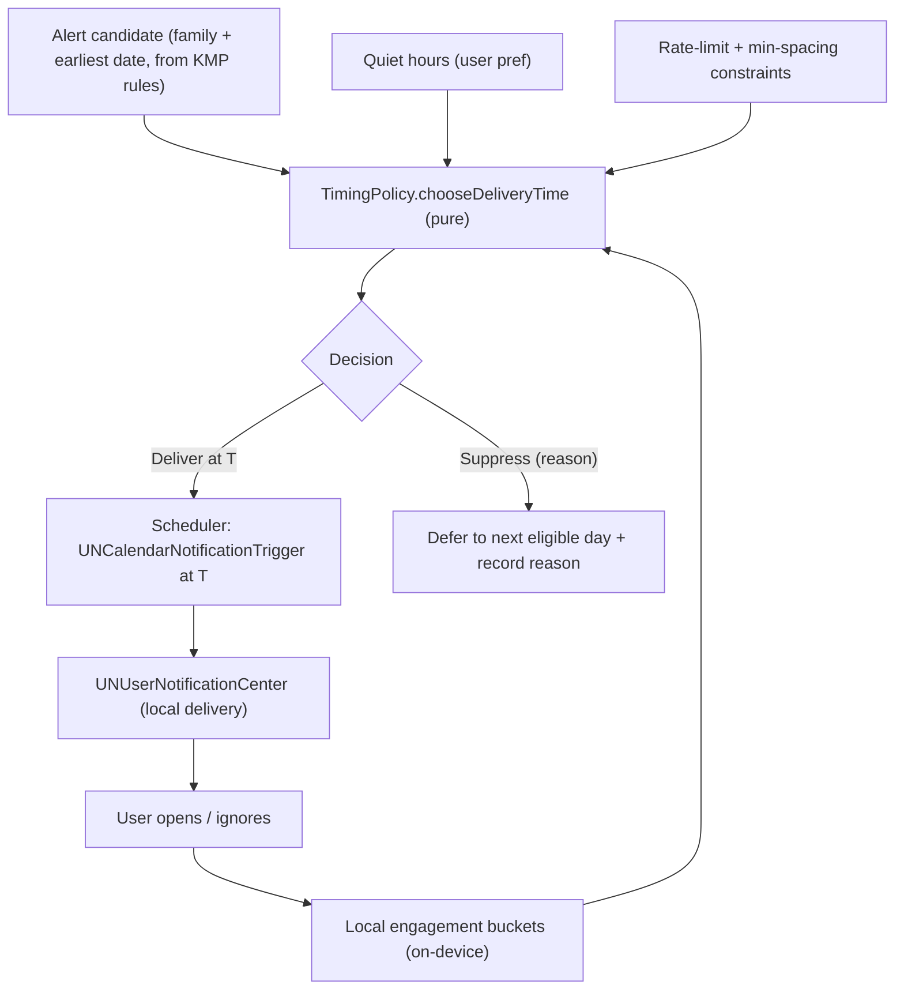
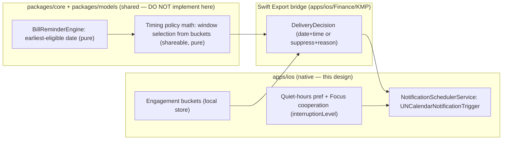

# Local Smart Notification Timing Policy — iOS

> A privacy-preserving policy for **when** finance reminders fire. Bill reminders,
> budget nudges, and review prompts should arrive when a user is likely to act —
> computed **entirely on-device** from local interaction history, bounded by
> quiet hours, and respectful of Focus. No server decides timing; no sensitive
> amount leaves the device.

**Status:** PROPOSED — design only (native implementation buildable now; store distribution gated)
**Issue:** [#2621](https://github.com/jrmoulckers/finance/issues/2621) — Part of [#2391](https://github.com/jrmoulckers/finance/issues/2391)
**Platform:** iOS / iPadOS (SwiftUI, `UserNotifications`, iOS 17+)
**Owner:** @native-app-engineer
**Related:** [ios-notification-center-navigation.md](./ios-notification-center-navigation.md) · [ios-finance-alert-rules-deeplinks.md](./ios-finance-alert-rules-deeplinks.md) · [content-language-guidelines.md](./content-language-guidelines.md) · [accessibility-patterns.md](./accessibility-patterns.md) · [cognitive-accessibility.md](./cognitive-accessibility.md) · [Human-Gated Prerequisites](../ops/human-gated-prerequisites.md)

---

## Table of Contents

1. [Goal & Scope](#1-goal--scope)
2. [Current State](#2-current-state)
3. [Timing Policy Model](#3-timing-policy-model)
4. [Local Interaction History](#4-local-interaction-history)
5. [Quiet Hours & Focus-Aware Fallbacks](#5-quiet-hours--focus-aware-fallbacks)
6. [Rate Limiting & Coalescing](#6-rate-limiting--coalescing)
7. [Scheduling Flow](#7-scheduling-flow)
8. [Privacy & Balance Hiding](#8-privacy--balance-hiding)
9. [Empty, Stale & Error States](#9-empty-stale--error-states)
10. [Accessibility](#10-accessibility)
11. [Native ↔ KMP Boundary](#11-native--kmp-boundary)
12. [Affected Surfaces & Shared Dependencies](#12-affected-surfaces--shared-dependencies)
13. [Test Plan (Smallest Tests First)](#13-test-plan-smallest-tests-first)
14. [Implementation Readiness](#14-implementation-readiness)
15. [Open Questions](#15-open-questions)

---

## 1. Goal & Scope

A reminder that arrives at 3 AM, or three reminders in five minutes, trains the
user to ignore the app. The parent story ([#2391](https://github.com/jrmoulckers/finance/issues/2391))
asks for "smart push-notification timing." Because this product uses **local
notifications only** (no remote push server), we deliver that intent as an
**on-device timing policy**: a deterministic function that, given a candidate
alert and the user's local signals, chooses a delivery time the user is likely
to act on — then schedules it with `UNCalendarNotificationTrigger`.

**In scope:**

- A timing model for the three reminder kinds — **bill reminders**, **budget
  nudges**, **review prompts** — expressed as pure inputs/outputs.
- A privacy-preserving **local interaction history** (engagement signals) that
  never leaves the device.
- **Quiet hours** and **Focus-aware fallbacks** (interruption level, relevance).
- Rate limiting / coalescing so the app stays welcome.

**Out of scope:**

- The notification _content_, categories, and deep links — see
  [ios-finance-alert-rules-deeplinks.md](./ios-finance-alert-rules-deeplinks.md).
- The settings surface that exposes quiet hours — see
  [ios-notification-center-navigation.md](./ios-notification-center-navigation.md).
- Remote/server-side timing — explicitly excluded; everything is local.

---

## 2. Current State

Grounded in the repository:

- [`NotificationSchedulerService`](../../apps/ios/Finance/Services/NotificationSchedulerService.swift)
  schedules with a `UNCalendarNotificationTrigger` from a fixed
  `scheduledHour`/`scheduledMinute` on `NotificationSchedule` — a **static** time
  with no awareness of when the user actually engages.
- [`NotificationSchedule`](../../apps/ios/Finance/Models/NotificationModels.swift)
  already carries `scheduledHour`, `scheduledMinute`, and `frequency`, so the
  data shape needed for a chosen time exists; only the _choice_ is missing.
- KMP [`BillReminderEngine`](../../packages/core/src/commonMain/kotlin/com/finance/core/recurring/BillReminderEngine.kt)
  already computes deterministic `ScheduledNotification`s
  (`notificationDate` = `dueDate − offsetDays`, plus a `reminderTime`) and
  documents that OS-level scheduling is the caller's job — the perfect seam for a
  timing _refinement_ step.
- There is **no** interaction-history store and **no** quiet-hours/Focus logic
  yet.

**Conclusion:** the scheduler and the deterministic due-date math exist; this
design adds the **time-of-day selection policy**, the **local signal store**, and
the **quiet-hours/Focus** guardrails.

---

## 3. Timing Policy Model

The policy is a **pure function** of explicit inputs, so it is testable with
fixtures and identical to reason about on any platform:

```text
chooseDeliveryTime(
    candidate,           // family + earliest-eligible date (from rules)
    history,             // local engagement summary (buckets, not events)
    quietHours,          // user start/end
    constraints          // max-per-day, min-spacing, locale calendar
) -> DeliveryDecision    // concrete date+time OR "suppress" + reason
```

Per-family defaults, refined by history:

| Kind              | Default window                | Refinement signal                                 |
| ----------------- | ----------------------------- | ------------------------------------------------- |
| **Bill reminder** | Morning of `dueDate − offset` | Shift toward the hour the user most opens the app |
| **Budget nudge**  | Early evening (review time)   | Shift toward the user's typical "review" hour     |
| **Review prompt** | Within a day of the event     | Bias to a recently-active hour, never overnight   |

Properties the model must hold:

- **Deterministic:** same inputs → same output (no wall-clock reads inside; the
  clock is injected). This makes the [§13](#13-test-plan-smallest-tests-first)
  fixtures exact.
- **Bounded:** the output is always inside an allowed window and outside quiet
  hours; if no slot fits, it returns a **suppress** decision with a reason rather
  than firing at a bad time.
- **Explainable:** every decision carries a reason code surfaced (in plain
  language) in the alert center's "why this time" affordance.

---

## 4. Local Interaction History

To choose a good hour we need to know when the user tends to engage — without
profiling them off-device.

- **What we store:** coarse, on-device **engagement buckets** only — e.g. counts
  of app-open and notification-open events per hour-of-day and per weekday. No
  per-event timestamps, no amounts, no payees, no locations.
- **Where:** local storage on the device (standard `UserDefaults`/local store —
  a **preference**, not a secret; secrets stay in Keychain). Nothing syncs to a
  server; this is consistent with the "all local notifications, timing computed
  on-device" constraint.
- **How it informs timing:** the policy reads the bucket histogram to find a
  likely-active hour, falling back to the per-family default when history is thin
  (cold start). A small **decay** keeps recent behavior weighted over stale.
- **User control & transparency:** a single toggle ("Use my activity to time
  reminders") defaults to on but is fully reversible; turning it off reverts to
  static per-family defaults. This mirrors the consent posture in
  [content-language-guidelines.md](./content-language-guidelines.md#notification-and-push-alert-guidelines).

---

## 5. Quiet Hours & Focus-Aware Fallbacks

Timing must defer to the user's stated and system-level boundaries.

- **Quiet hours (user-set):** the policy never schedules inside the quiet window
  (from [ios-notification-center-navigation.md](./ios-notification-center-navigation.md)).
  A slot that would land inside is moved to the next eligible edge (e.g. just
  after the quiet window ends), never silently dropped.
- **Focus / Do Not Disturb (system):** we do not read the user's Focus state
  (private); instead we cooperate with the system using
  `UNNotificationInterruptionLevel`:
  - `.passive` for low-value budget nudges (won't break Focus),
  - `.active` (default) for normal reminders,
  - `.timeSensitive` **only** for genuinely time-critical bills (e.g. due today)
    and only if the user has allowed Time Sensitive notifications.
- **Relevance:** set `relevanceScore` so the most actionable alert sorts to the
  top of a stacked Notification Center, improving the odds the user acts on the
  right one.
- **Fallback ladder:** if Time Sensitive is disallowed, a due-today bill degrades
  gracefully to `.active` at the best in-window hour rather than escalating.

---

## 6. Rate Limiting & Coalescing

A welcome app is a quiet app.

- **Max per day:** a hard cap (default small, e.g. 2–3) across all families; once
  spent, lower-priority candidates roll to the next day.
- **Min spacing:** enforce a minimum gap between any two delivered reminders so
  they never cluster.
- **Coalescing:** multiple budget nudges on the same day collapse into one "a few
  budgets need a look" reminder rather than several pings (content owned by the
  alert-rules design; the _decision to coalesce_ is timing policy).
- **Priority wins ties:** when the cap forces a choice, higher `AlertPriority`
  (from [`NotificationModels`](../../apps/ios/Finance/Models/NotificationModels.swift))
  is delivered first; the rest defer, never drop silently — they reappear next
  eligible day.

---

## 7. Scheduling Flow



The loop is closed and entirely on-device: delivery outcomes update the local
engagement buckets, which sharpen the next decision — no telemetry leaves the
phone.

---

## 8. Privacy & Balance Hiding

- **Computed on-device, stays on-device.** Timing inputs are coarse engagement
  buckets, never financial values; nothing about timing is sent anywhere.
- **No sensitive amounts in previews by default.** The delivered body follows
  the amount-free default from
  [ios-finance-alert-rules-deeplinks.md](./ios-finance-alert-rules-deeplinks.md)
  and [content-language-guidelines.md](./content-language-guidelines.md#account-balance-notifications);
  timing never introduces a number into a preview.
- **Buckets are not secrets but are still minimized.** They are coarse
  (hour-of-day counts), stored locally, and clearable from settings; turning off
  the activity toggle deletes them.
- **Logging:** `os.Logger` records only the chosen hour bucket and a reason code
  (`privacy: .public`); it never logs the candidate's amount, payee, or the raw
  history, matching the repo convention.

---

## 9. Empty, Stale & Error States

| Condition         | Behavior                                                                                                                                                           |
| ----------------- | ------------------------------------------------------------------------------------------------------------------------------------------------------------------ |
| **Cold start**    | No history yet → use the per-family default window; the policy degrades to today's static behavior, so the feature is never worse than now.                        |
| **Stale history** | Decay down-weights old buckets; if all data is stale, defaults take over. A user returning after a long absence is treated like cold start.                        |
| **Suppressed**    | A candidate with no valid in-window slot returns a **suppress** decision with a reason; it is deferred and explained in the center, never silently lost.           |
| **Offline**       | Timing needs no network; it runs fully offline. Local delivery is unaffected.                                                                                      |
| **Error**         | A scheduling failure is logged (`.public` reason) and the candidate retries next cycle; a corrupt history store resets to empty (cold start) rather than crashing. |

---

## 10. Accessibility

- **Predictability over surprise:** smart timing must never feel random. The
  alert center exposes a plain-language "why this time" reason, supporting the
  consistent-navigation and plain-language guidance in
  [cognitive-accessibility.md](./cognitive-accessibility.md#consistent-navigation-patterns).
- **VoiceOver:** the quiet-hours and activity-toggle controls (in the center)
  carry labels, values, and hints; the "why this time" detail is a readable text
  element, not an icon-only cue.
- **Dynamic Type:** all timing-related copy uses semantic fonts and reflows at
  accessibility sizes
  ([accessibility-patterns.md](./accessibility-patterns.md#92-ios-swiftui)).
- **Reduce Motion:** timing has no animation of its own; any settings transitions
  honor [Reduced Motion](./accessibility-patterns.md#61-reduced-motion-support).
- **No color-only meaning:** any "active/snoozed/suppressed" status pairs color
  with text, per
  [accessibility-patterns.md](./accessibility-patterns.md#53-never-convey-information-by-color-alone).
- **Time Sensitive respects the user:** escalation only when the user has allowed
  it — the policy never assumes urgency on the user's behalf.

---

## 11. Native ↔ KMP Boundary



- **The timing math is shareable and pure**, so it should live in KMP
  `packages/core` next to
  [`BillReminderEngine`](../../packages/core/src/commonMain/kotlin/com/finance/core/recurring/BillReminderEngine.kt)
  (Android/Web get the same fairness). Introducing or extending that shared
  policy is proposed to @native-app-engineer via ADR — **not** implemented in this iOS
  work.
- **iOS owns** the local engagement-bucket store, reading quiet-hours
  preferences, Focus cooperation via `UNNotificationInterruptionLevel` /
  `relevanceScore`, and the `UNCalendarNotificationTrigger` scheduling. No shared
  package is modified by this design.

---

## 12. Affected Surfaces & Shared Dependencies

**New (this design, implemented in follow-up iOS PRs):**

- `apps/ios/Finance/Services/EngagementHistoryStore.swift` — on-device buckets.
- `apps/ios/Finance/Services/NotificationTimingPolicy.swift` — the iOS adapter
  that calls the shared decision and applies interruption level / relevance.

**Touched (additively):**

- `NotificationSchedulerService.scheduleNotification` consumes a
  `DeliveryDecision` (chosen time + interruption level) instead of a fixed hour.
- The alert center gains the "Use my activity" toggle and a "why this time"
  reason (UI owned by [ios-notification-center-navigation.md](./ios-notification-center-navigation.md)).

**Reused unchanged:** `NotificationSchedule` time fields, `AlertPriority`,
`UNCalendarNotificationTrigger` plumbing.

**Shared dependency:** `BillReminderEngine` + (proposed) shared timing math in
KMP `packages/core` via the Swift Export bridge ([§11](#11-native--kmp-boundary)).

---

## 13. Test Plan (Smallest Tests First)

Determinism is the whole point, so every test uses **fixed fixtures and an
injected clock** — no wall-clock reads.

1. **Window selection (Swift/KMP unit):** given a bucket histogram and per-family
   default, assert the chosen hour is the expected likely-active hour; with empty
   history assert the default.
2. **Quiet-hours guard (Swift unit):** a candidate whose ideal hour is inside
   quiet hours moves to the next eligible edge; assert exact time against a
   **fixed reference `Date`**.
3. **Suppress decision (Swift unit):** when no in-window slot exists, assert a
   `suppress` decision with the expected reason and a next-day deferral.
4. **Rate limit (Swift unit):** with the daily cap reached, assert lower-priority
   candidates defer and the highest `AlertPriority` is delivered first.
5. **Min spacing (Swift unit):** two candidates closer than the gap → the second
   shifts; assert the resulting spacing.
6. **Interruption level (Swift unit):** a due-today bill maps to `.timeSensitive`
   only when allowed, else degrades to `.active`; budget nudge → `.passive`.
7. **History privacy (Swift unit):** assert the store holds only coarse buckets
   (no amounts/payees) and that the activity-off path clears it.
8. **Determinism (Swift/KMP unit):** identical inputs → identical
   `DeliveryDecision` across repeated runs (golden fixture).
9. **Shared (KMP, owned by @native-app-engineer):** if the policy math lands in
   `packages/core`, its window-selection and boundary cases are tested there.

---

## 14. Implementation Readiness

See [Human-Gated Prerequisites](../ops/human-gated-prerequisites.md).

**Buildable now (no paid enrollment) — free Personal Team signing:**

- The engagement-bucket store, the timing policy, quiet-hours guards, interruption
  levels, relevance scoring, and `UNCalendarNotificationTrigger` scheduling all
  run on a device under a **free Apple ID** (Personal Team). Local notifications
  and Time Sensitive interruption levels need **no** paid entitlement for local
  testing.
- Every test in [§13](#13-test-plan-smallest-tests-first) — pure-function timing
  with fixtures — runs without any device or enrollment.

**Distribution tail — gated by [#1239](https://github.com/jrmoulckers/finance/issues/1239):**

- Only App Store / TestFlight distribution is gated. The timing policy uses no
  paid capability; the `Time Sensitive` notification _entitlement string_ is a
  capability available under free signing for local runs.
- On the implementation PR, add a `## Needs Human Action` note pointing at
  [§3.2 of the prerequisites runbook](../ops/human-gated-prerequisites.md#32-ios-distribution--apple-developer-1239)
  for the distribution criterion only.

---

## 15. Open Questions

1. **Where the math lives:** confirm with @native-app-engineer whether window-selection
   moves to `packages/core` (cross-platform fairness) or stays an iOS adapter for
   v1, with an ADR to follow.
2. **Bucket granularity:** hour-of-day only, or hour × weekday? Default:
   hour-of-day for v1 (smaller, less identifying), upgrade if accuracy is poor.
3. **Daily cap default:** is 2–3 right for finance reminders, or should bills be
   exempt from the cap (always deliver)? Likely: due-today bills bypass the cap.
4. **Cold-start window defaults:** validate the per-family default hours
   (morning bills, evening budget review) against
   [content-language-guidelines.md](./content-language-guidelines.md#notification-and-push-alert-guidelines).
5. **Decay rate:** how fast should old engagement buckets fade so the policy
   adapts without over-reacting to a single unusual day?
