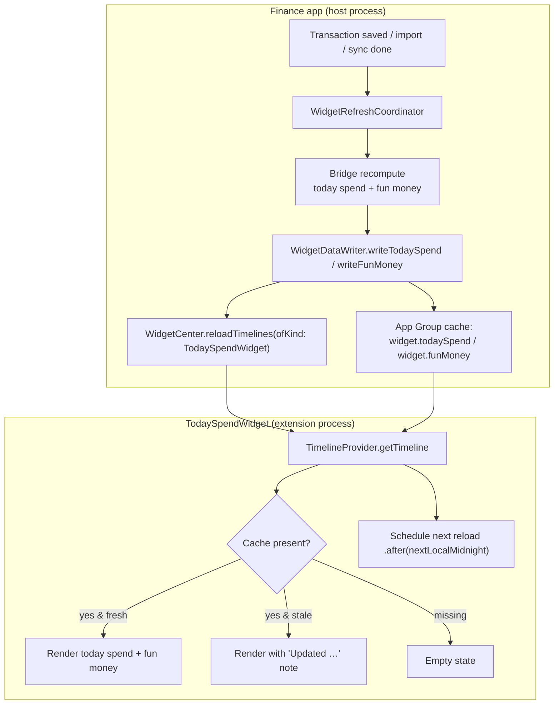
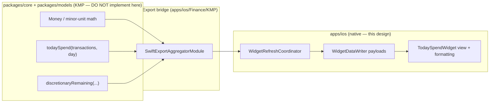

# Today Spend & Fun Money — WidgetKit Surface Design

> A small/medium home-screen widget that answers two everyday questions at a
> glance — **"How much have I spent today?"** and **"How much fun money is
> left?"** — reading only from the App Group cache, never the network, and
> respecting the same privacy masking as the existing Balance and Budget widgets.

**Status:** PROPOSED — design only (native implementation buildable now; store distribution gated)
**Issue:** [#2583](https://github.com/jrmoulckers/finance/issues/2583) — Part of [#2159](https://github.com/jrmoulckers/finance/issues/2159)
**Platform:** iOS / iPadOS (WidgetKit + SwiftUI, iOS 17+)
**Owner:** @ios-engineer
**Related:** [ios-widget-freshness-pipeline.md](./ios-widget-freshness-pipeline.md) · [ios-savings-rate-dashboard-card.md](./ios-savings-rate-dashboard-card.md) · [data-visualization.md](./data-visualization.md) · [accessibility-patterns.md](./accessibility-patterns.md) · [ios-noncolor-financial-state-cues.md](./ios-noncolor-financial-state-cues.md) · [content-language-guidelines.md](./content-language-guidelines.md) · [Human-Gated Prerequisites](../ops/human-gated-prerequisites.md)

---

## Table of Contents

1. [Goal & Scope](#1-goal--scope)
2. [Widget Families & Layout](#2-widget-families--layout)
3. [Timeline Payloads & App Group Cache](#3-timeline-payloads--app-group-cache)
4. [Timeline Refresh Flow](#4-timeline-refresh-flow)
5. [Copy & Localization](#5-copy--localization)
6. [Privacy & Balance Hiding](#6-privacy--balance-hiding)
7. [Accessibility](#7-accessibility)
8. [States: Empty, Stale, Error & Placeholder](#8-states-empty-stale-error--placeholder)
9. [Native ↔ KMP Boundary](#9-native--kmp-boundary)
10. [Affected Surfaces & Shared Dependencies](#10-affected-surfaces--shared-dependencies)
11. [Test Plan (Smallest Tests First)](#11-test-plan-smallest-tests-first)
12. [Implementation Readiness](#12-implementation-readiness)
13. [Open Questions](#13-open-questions)

---

## 1. Goal & Scope

Today's spend and discretionary ("fun money") headroom are the two numbers a
budget-conscious user wants between opening the app — exactly the
glanceable, zero-interaction job WidgetKit is built for. This design adds a
**new `TodaySpendWidget`** to the existing
[`FinanceWidgetBundle`](../../apps/ios/FinanceWidget/FinanceWidgetBundle.swift),
alongside the shipped `BalanceWidget`, `BudgetProgressWidget`,
`RecentTransactionsWidget`, and `QuickEntryWidget`.

**In scope (this design):**

- `systemSmall` and `systemMedium` widget entries for **today spend** and
  **fun-money status**.
- Codable **timeline payloads** and the App Group cache keys that feed them.
- **Privacy masking** reusing the canonical
  [`WidgetMoneyFormatter` / `WidgetMaskingMode`](../../apps/ios/Shared/WidgetPrivacy.swift).
- **Copy** (all `String(localized:)`), empty / stale / error / placeholder
  states, and full **VoiceOver / Dynamic Type / Reduce Motion** behavior.
- The **timeline refresh contract** this widget needs from the app
  (the write side is specified in [ios-widget-freshness-pipeline.md](./ios-widget-freshness-pipeline.md)).

**Out of scope (deliberately deferred):**

- Lock Screen `accessory*` families and watchOS complications (follow-on under
  #2159 — the data model below is forward-compatible with them).
- Interactive App Intents inside the widget (e.g. "log a coffee"); tap routes to
  the app via a deep link only.
- The **business math** for today spend and discretionary headroom — that lives
  in KMP `packages/core` (see [§9](#9-native--kmp-boundary)). This document
  specifies the _surface_ and the _bridge contract_, not the calculation.

> **Why cache-only:** like every shipped widget, the timeline provider reads the
> App Group cache and **never** performs network or database I/O — an empty
> cache renders an empty state (mirroring
> [`WidgetDataProvider.readBudgets`](../../apps/ios/FinanceWidget/WidgetDataProvider.swift)).

---

## 2. Widget Families & Layout

| Family         | Today Spend                                                                  | Fun Money                                                              |
| -------------- | ---------------------------------------------------------------------------- | ---------------------------------------------------------------------- |
| `systemSmall`  | Headline "spent today" amount + count of transactions + "vs typical" caption | Circular `Gauge` of discretionary used + remaining label               |
| `systemMedium` | Left: today spend headline + sparkline-free caption; Right: fun-money gauge  | Combined: both metrics side by side with a single tap target each side |

Layout rules (consistent with
[`BudgetProgressWidget`](../../apps/ios/FinanceWidget/BudgetProgressWidget.swift)):

- Use `Gauge(.accessoryCircular)` for fun-money progress; tint via
  [`FinanceWidgetColors`](../../apps/ios/FinanceWidget/FinanceWidgetDesignTokens.swift)
  status palette (`statusPositive` / `statusWarning` / `statusNegative`).
- Money uses `.monospacedDigit()` with `.minimumScaleFactor(0.6)` and
  `lineLimit(1)` so values never truncate under large Dynamic Type.
- `.containerBackground(.fill.tertiary, for: .widget)` and
  `.contentMarginsDisabled()` to match the shipped widgets.
- The whole widget is a single `Link` to a deep link (identifiers only, never
  money — see [§6](#6-privacy--balance-hiding)); medium splits into two `Link`s.

Proposed deep links (extend
[`FinanceWidgetDeepLinks`](../../apps/ios/Shared/WidgetPrivacy.swift) — identifiers only):

- Today spend → `finance://spending/today`
- Fun money → `finance://budget/discretionary`

---

## 3. Timeline Payloads & App Group Cache

Two new Codable, `Sendable` payloads are written to the shared App Group
(`group.com.finance.app`, via
[`SharedConstants.sharedDefaults`](../../apps/ios/Shared/SharedConstants.swift))
and read by the timeline provider. They carry **integer minor units only** plus
an `updatedAt` stamp for staleness — exactly the convention used by
`WidgetBalanceData` / `WidgetBudgetData` in
[`WidgetDataWriter`](../../apps/ios/Finance/Services/WidgetDataWriter.swift).

```text
WidgetDaySpendData
  spentTodayMinorUnits: Int64       // sum of today's expense transactions (positive)
  typicalDayMinorUnits: Int64       // trailing average for "vs typical" caption (0 if unknown)
  transactionCount: Int32
  currencyCode: String
  updatedAt: Date

WidgetFunMoneyData
  remainingMinorUnits: Int64        // discretionary headroom (may be negative)
  limitMinorUnits: Int64            // discretionary envelope for the period
  spentMinorUnits: Int64
  periodEnd: Date                   // when the envelope resets (e.g. month end)
  currencyCode: String
  updatedAt: Date
```

Proposed cache keys (namespaced like the existing `widget.balance` /
`widget.budgets`):

| Key                 | Producer (app side)                          | Consumer (widget side)                |
| ------------------- | -------------------------------------------- | ------------------------------------- |
| `widget.todaySpend` | `WidgetDataWriter.writeTodaySpend(_:)` (new) | `WidgetDataProvider.readTodaySpend()` |
| `widget.funMoney`   | `WidgetDataWriter.writeFunMoney(_:)` (new)   | `WidgetDataProvider.readFunMoney()`   |

> The **producer** call sites and invalidation are owned by
> [ios-widget-freshness-pipeline.md](./ios-widget-freshness-pipeline.md). This
> doc only defines the payload shape and read path so the two designs compose.

`derived` view-model values (computed in the widget, no money stored): masking
mode via `WidgetDataProvider.maskingMode(for: "TodaySpendWidget")`,
`funMoneyProgress = spent / limit` clamped to `0...1`, and a `status` enum
(`onTrack` / `watch` / `over`) derived from progress thresholds (75% / 100%).

---

## 4. Timeline Refresh Flow

The widget reload contract has two triggers: **data writes** from the app
(push) and a **scheduled midnight rollover** (pull) so "Today" resets even if
the app never opens.



Policy details:

- **Reload kind:** target `ofKind: "TodaySpendWidget"` (not
  `reloadAllTimelines`) to stay well under WidgetKit's daily reload budget.
- **Scheduled rollover:** the timeline returns a single entry with
  `policy: .after(nextLocalMidnight)` computed via `Calendar.current` so the
  "Today" window flips at the user's local midnight. (Balance uses a 30-minute
  `.after`; today spend is event-driven plus a daily boundary.)
- **No network:** the provider only reads the cache; freshness is the host
  app's responsibility ([ios-widget-freshness-pipeline.md](./ios-widget-freshness-pipeline.md)).

---

## 5. Copy & Localization

All strings use `String(localized:)` with a `comment:` for translators, per the
[content language guidelines](./content-language-guidelines.md). No hardcoded
currency — formatting flows through `WidgetMoneyFormatter`.

| Element                 | Copy (en)            | Notes                                                 |
| ----------------------- | -------------------- | ----------------------------------------------------- |
| Today header            | "Today"              | Reuses `WidgetDateFormatter` "Today" string           |
| Today spend label       | "Spent today"        |                                                       |
| Today vs typical (low)  | "Below your usual"   | Only when `typicalDayMinorUnits > 0`                  |
| Today vs typical (high) | "Above your usual"   | Non-color cue pairs with `arrow.up` symbol            |
| Fun money header        | "Fun money"          | Discretionary envelope                                |
| Fun money remaining     | "{amount} left"      | `amount` masked per mode                              |
| Fun money over          | "Over by {amount}"   | `status == .over`                                     |
| Empty                   | "No cached spending" | + "Open Finance to sync." (matches budget empty copy) |
| Stale                   | "Updated {relative}" | e.g. "Updated 3 h ago"                                |

Tone: plain, non-judgmental ("Above your usual", not "You overspent") per the
content guidelines. Numbers stay locale-formatted by `NumberFormatter`.

---

## 6. Privacy & Balance Hiding

Widgets can be visible on a locked device, so this surface inherits the existing
privacy model verbatim:

- **Default masking is `.bucketed`** via
  [`WidgetPrivacySettings.defaultMode`](../../apps/ios/Shared/WidgetPrivacy.swift);
  the first time exact amounts could appear, the app raises the existing
  first-add consent prompt
  ([`WidgetPrivacyPrompt`](../../apps/ios/Finance/Services/WidgetPrivacyPrompt.swift))
  before any precise figure is shown.
- All money renders through
  `WidgetCurrencyFormatter.format(…, mode:)` so `.bucketed`, `.percent`, and
  `.dots` modes are honored. **Fun-money is ideal for `.percent`** — the gauge
  and "% used" carry the meaning without revealing dollars.
- **Deep links never carry money** — only identifiers
  (`finance://spending/today`), matching the existing
  `FinanceWidgetDeepLinks` contract ("They contain identifiers only, never money").
- VoiceOver values are produced by `formatForVoiceOver(…, mode:)`, which keeps
  masking consistent between the visual and spoken representations.

---

## 7. Accessibility

Follows the [accessibility patterns library](./accessibility-patterns.md) and
the iOS [non-color financial state cues](./ios-noncolor-financial-state-cues.md)
guidance.

- **VoiceOver:** each metric is one `.accessibilityElement(children: .combine)`
  with an `.accessibilityLabel` (what) and `.accessibilityValue` (the masked
  amount/percent). Example — Today: label "Spent today", value
  "{masked amount}, {count} transactions, above your usual". Decorative SF
  Symbols use `.accessibilityHidden(true)`; the gauge gets an explicit
  `.accessibilityLabel`/`.accessibilityValue` ("{n} percent of fun money used").
- **Dynamic Type:** no hardcoded point sizes — `.font(.system(.title2, …))`,
  `.minimumScaleFactor(0.6)`, `lineLimit(1)` for money; captions may wrap. The
  medium layout reflows to keep both metrics legible at the largest accessibility
  sizes (see [ios-dynamic-type-reflow-audit.md](./ios-dynamic-type-reflow-audit.md)).
- **Reduce Motion:** widgets do not animate timeline transitions, but the gauge
  must not imply motion; render a static fill. No count-up animation.
- **Never color alone:** over-budget is signaled by an SF Symbol (e.g.
  `exclamationmark.triangle`) and text ("Over by …"), not red fill only —
  consistent with [data-visualization §2.4](./data-visualization.md#24-never-color-alone)
  and the budget widget's color + percent pairing.
- **Contrast:** the CVD-safe status palette in `FinanceWidgetColors` already
  meets contrast in light/dark; verify against
  [data-visualization §2.1](./data-visualization.md#21-cvd-safe-palette).

---

## 8. States: Empty, Stale, Error & Placeholder

| State           | Trigger                                            | Rendering                                                                          |
| --------------- | -------------------------------------------------- | ---------------------------------------------------------------------------------- |
| **Placeholder** | `context.isPreview` / gallery                      | Static sample (e.g. "$24 spent today", 60% fun money) like widget previews         |
| **Empty**       | No cache or decode returns nil                     | Icon + "No cached spending" + "Open Finance to sync." (no stale figure)            |
| **Stale**       | `now - updatedAt` exceeds a threshold (e.g. > 6 h) | Render last values + caption "Updated {relative}" so the user isn't misled         |
| **Error**       | Decode/encode failure                              | Fall back to empty state; host logs via `os.Logger` (`privacy: .public` keys only) |
| **Over-budget** | `funMoney.status == .over`                         | Symbol + "Over by {amount}" + `statusNegative` tint                                |

Staleness is computed from the payload's `updatedAt`; the freshness pipeline
keeps it current, but the widget must **degrade gracefully** when the app hasn't
refreshed (e.g. low-power mode throttling reloads).

---

## 9. Native ↔ KMP Boundary



- The **calculation** of today's spend window and the discretionary envelope is
  platform-neutral and belongs in KMP `packages/core` (alongside the existing
  `totalSpending` / `savingsRate` aggregations exposed through
  [`SwiftExportAggregatorModule`](../../apps/ios/Finance/KMP/SwiftExportBridge.swift)).
- Two new shared methods are implied — a day-windowed spend and a discretionary
  headroom — which should be **proposed to @kmp-engineer via an ADR**, not added
  in this iOS work. Until they exist, the coordinator can compose them from the
  current `totalSpending` plus a discretionary-category filter as a temporary
  Swift-side adapter, clearly marked for migration.
- iOS owns **only** WidgetKit plumbing, SwiftUI layout, masking/formatting, and
  accessibility semantics — never the arithmetic.

---

## 10. Affected Surfaces & Shared Dependencies

**New (this design):**

- `apps/ios/FinanceWidget/TodaySpendWidget.swift` — widget + `TimelineProvider` + views.
- `WidgetDaySpendData` / `WidgetFunMoneyData` payloads + read helpers in
  `WidgetDataProvider`.

**Touched by the companion freshness design (not here):**

- [`WidgetDataWriter`](../../apps/ios/Finance/Services/WidgetDataWriter.swift) —
  `writeTodaySpend` / `writeFunMoney` + `reloadTimelines(ofKind: "TodaySpendWidget")`.
- [`FinanceWidgetBundle`](../../apps/ios/FinanceWidget/FinanceWidgetBundle.swift) —
  register the new widget.

**Reused unchanged:**

- [`WidgetPrivacy.swift`](../../apps/ios/Shared/WidgetPrivacy.swift) (masking,
  formatter, deep links), `FinanceWidgetDesignTokens` (palette/spacing),
  `SharedConstants` (App Group), `WidgetPrivacyPrompt` (consent).

**Shared dependency:** KMP `packages/core` day-spend / discretionary math
(see [§9](#9-native--kmp-boundary)) — ADR required before native code lands.

---

## 11. Test Plan (Smallest Tests First)

Smallest, fastest tests that must pass before implementation is accepted:

1. **Payload round-trip (Swift unit):** encode/decode `WidgetDaySpendData` and
   `WidgetFunMoneyData` via the App Group `UserDefaults` keys; assert minor
   units and `updatedAt` survive ISO-8601.
2. **Masking parity (Swift unit):** `WidgetCurrencyFormatter` under `.visible` /
   `.bucketed` / `.percent` / `.dots` for representative amounts (incl. negative
   fun money) — assert the spoken (`formatForVoiceOver`) and visual strings agree.
3. **Status thresholds (Swift unit):** `funMoneyProgress` → `status`
   (`onTrack` < 0.75 ≤ `watch` < 1.0 ≤ `over`), including the over-by case.
4. **Timeline policy (Swift unit):** `getTimeline` returns `.after(nextLocalMidnight)`
   and a present-cache entry; missing cache yields the empty entry.
5. **State snapshots (SwiftUI preview/snapshot):** placeholder, empty, stale, and
   over-budget renders at default and `.accessibility3` Dynamic Type.
6. **VoiceOver labels (XCUITest, smallest):** assert `accessibilityLabel` /
   `accessibilityValue` strings exist and are non-empty for both metrics.
7. **Shared (KMP, owned by @kmp-engineer):** unit tests for the day-spend and
   discretionary-headroom functions live in `packages/core` test sources, not iOS.

---

## 12. Implementation Readiness

See [Human-Gated Prerequisites](../ops/human-gated-prerequisites.md) for the full
implementation-vs-distribution decoupling.

**Buildable now (no paid enrollment) — free Personal Team signing:**

- The entire WidgetKit surface, App Group timeline plumbing, masking, and
  accessibility can be built and run on a device with a **free Apple ID**
  (Personal Team), exactly as the shipped widgets are. App Groups work under
  Personal Team signing for local verification.
- All unit/snapshot/XCUITests in [§11](#11-test-plan-smallest-tests-first) run
  locally without enrollment.

**Distribution tail — gated by [#1239](https://github.com/jrmoulckers/finance/issues/1239):**

- App Store / TestFlight distribution of the widget, and any **paid
  entitlements** (push, Associated Domains for universal links) require Apple
  Developer Program enrollment. Universal-link deep linking in production needs
  Associated Domains; the in-app `finance://` scheme works under free signing.
- Leave a `## Needs Human Action` note on the implementing PR pointing at
  [§3.2 of the prerequisites runbook](../ops/human-gated-prerequisites.md#32-ios-distribution--apple-developer-1239)
  only for the distribution criteria — not the feature work.

---

## 13. Open Questions

1. **Discretionary definition:** is "fun money" a dedicated envelope/goal or a
   filtered set of categories? Resolution drives the KMP method signature
   (ADR with @kmp-engineer).
2. **"Typical day" baseline:** trailing 30-day mean vs same-weekday mean — a
   KMP-core concern; the widget only renders the result.
3. **Stale threshold:** is 6 h the right cutoff, or should it follow the app's
   sync cadence? Coordinate with [ios-widget-freshness-pipeline.md](./ios-widget-freshness-pipeline.md).
4. **Accessory families:** confirm Lock Screen / watch variants are a separate
   issue under #2159 so the payload can stay forward-compatible.
