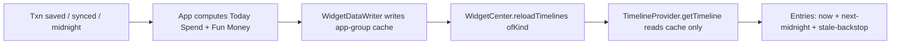

# iOS Today Spend / Fun Money widget — surfaces, freshness & redaction

> **Status:** Design spec (v1.0 milestone). **Native implementation BLOCKED** by Apple
> Developer Program enrollment — see #1239. This document is the design deliverable for
> epic #2159 and closes #2583 (widget surfaces + timeline design) and #2585 (data
> freshness + privacy/redaction design). **No Swift/WidgetKit code is written here.**
> It is grounded in real shipped code (cited as `path:line`) and mirrors the structure of
> the chart-accessibility / non-color-state-cue design pilots so the eventual WidgetKit
> build is a faithful translation, not a fresh invention.
>
> **Companion specs (cross-referenced, authored in parallel under #2159):**
> `docs/design/ios-chart-accessibility.md` (the "#2834 pilot": status-blockquote +
> application-map + state-coverage + commonTest/native-deferred test-plan structure this
> doc mirrors, and its **decision #2** — _trend/relative visible, absolutes masked_) and
> `docs/design/ios-noncolor-state-cues.md` (shape/glyph/text state cues reused for the
> widget gauges). Both are still in-flight at time of writing; the human reviewer should
> confirm anchor names once they land.

## Table of contents

1. [Goals & scope](#1-goals--scope)
2. [Glossary: what "Today Spend" and "Fun Money" mean](#2-glossary-what-today-spend-and-fun-money-mean)
3. [Grounding in real code](#3-grounding-in-real-code)
4. [Widget families & per-surface application map](#4-widget-families--per-surface-application-map)
5. [Glanceable layout specs](#5-glanceable-layout-specs)
6. [Accessibility: VoiceOver, Dynamic Type, non-color cues](#6-accessibility-voiceover-dynamic-type-non-color-cues)
7. [Timeline provider: entries & refresh cadence](#7-timeline-provider-entries--refresh-cadence)
8. [Data freshness: the app-group container contract](#8-data-freshness-the-app-group-container-contract)
9. [Privacy & redaction (#2585)](#9-privacy--redaction-2585)
10. [State coverage matrix](#10-state-coverage-matrix)
11. [Test plan: runnable-today vs native-deferred](#11-test-plan-runnable-today-vs-native-deferred)
12. [Open questions](#12-open-questions)
13. [Cross-references & resolved decisions](#13-cross-references--resolved-decisions)

---

## 1. Goals & scope

Two glanceable WidgetKit surfaces, designed but **not built** (blocked on #1239):

- **Today Spend** — how much has been spent _so far today_ against a daily allowance, with a
  glanceable "on track / over" cue.
- **Fun Money** — how much _discretionary_ money is left to spend right now without touching
  bills or planned savings.

Across four families: **Lock Screen** `accessoryCircular` + `accessoryRectangular`, and
**Home Screen** `systemSmall` + `systemMedium`. This doc covers (1) the surfaces + timeline
(#2583) and (2) freshness + privacy/redaction (#2585).

**Out of scope:** `systemLarge` (deferred — the two metrics do not justify the area),
`accessoryInline`/StandBy (follow-up), Apple Watch complications (already shipped separately —
see `apps/ios/FinanceWatch/`), and any networking from the widget process.

---

## 2. Glossary: what "Today Spend" and "Fun Money" mean

These are **not** new invented metrics — they are the iOS rendering of a contract that already
exists cross-platform in the web app, so the widget shows the same numbers as the web
dashboard.

### Today Spend

The sum of today's **expense** transactions, compared to a daily allowance. The "spent today"
figure maps directly to `FinancialAggregator.dailySpending(...)` keyed on today's `LocalDate`
(`packages/core/src/commonMain/kotlin/com/finance/core/aggregation/FinancialAggregator.kt:126`),
and the daily allowance maps to `BudgetCalculator.dailyBudgetRate(budget, spent, daysRemaining)`
(`packages/core/src/commonMain/kotlin/com/finance/core/budget/BudgetCalculator.kt:94`) — the
amount you can spend per remaining day to stay within budget.

### Fun Money

The discretionary money left to spend right now. This is **already a first-class concept** in
the shared web contract:

```ts
// apps/web/src/lib/dashboard/today-spend.ts:28
funMoneyCents = nonNegative(expectedIncomeCents) - reservedCents - todaySpendCents;
// reservedCents = remainingBills + plannedSavings + Σ pinnedCategoryBudgets  (lines 24–27)
// canSpendToday = funMoneyCents > 0                                          (line 34)
```

`TodaySpendSummary { todaySpendCents, reservedCents, funMoneyCents, canSpendToday }`
(`apps/web/src/lib/dashboard/today-spend.ts:11`) is exactly the payload the widget renders.
Fun Money is therefore **income minus everything already committed**, _not_ a single category
budget. The richer `calculateSharedSafeToSpend(...)`
(`apps/web/src/lib/dashboard/safe-to-spend-shared.ts:49`) provides the same idea plus
`dailyAllowanceUntilPaydayCents`, `staleData`, and `warnings: ['overspent','stale-data']`
(lines 76–88) — the freshness + over-budget signals this widget reuses.

**Decision (resolved by the existing contract):** "Fun Money with no discretionary budget
configured" is well-defined. If `expectedIncomeCents == 0` (income never set up), Fun Money
is not computable → the widget renders the **no-budget-configured** state (§10), _not_ `$0`.
This avoids implying "you have nothing to spend" when the truth is "we don't know yet."

---

## 3. Grounding in real code

Everything below translates existing, shipped logic. The widget invents no new math.

| Concern                     | Source of truth (cited)                                                                                                                                                                                         |
| --------------------------- | --------------------------------------------------------------------------------------------------------------------------------------------------------------------------------------------------------------- |
| Money type / arithmetic     | `Cents` value class, overflow-checked `+ - *`, `fromDollars` for input only — `packages/models/src/commonMain/kotlin/com/finance/models/types/Cents.kt:15`                                                      |
| Safe division (allowance)   | `MoneyOperations.divide(amount, divisor)` — `packages/core/src/commonMain/kotlin/com/finance/core/money/MoneyOperations.kt:27`                                                                                  |
| Spent today                 | `FinancialAggregator.dailySpending(txns, from, to)` filters `EXPENSE`, non-deleted, non-`VOID` — `…/aggregation/FinancialAggregator.kt:126`                                                                     |
| Daily allowance             | `BudgetCalculator.dailyBudgetRate(budget, spent, daysRemaining)` (returns `Cents.ZERO` when over) — `…/budget/BudgetCalculator.kt:94`                                                                           |
| Budget status / over-budget | `BudgetCalculator.calculateStatus(...)` → `spent / remaining / utilization / isOverBudget`; `healthLevel` HEALTHY `<0.75`, WARNING `0.75–1.0`, OVER `>1.0` — `…/budget/BudgetCalculator.kt:22,128`              |
| Fun Money / Today Spend     | `calculateTodaySpendSummary(...)` — `apps/web/src/lib/dashboard/today-spend.ts:22`                                                                                                                              |
| Staleness + warnings        | `calculateSharedSafeToSpend(...)` `staleData = daysBetween(lastUpdatedAt, today) > 3` — `apps/web/src/lib/dashboard/safe-to-spend-shared.ts:76`                                                                 |
| Discretionary definition    | 50/30/20: "30% wants (discretionary)" — `…/recommendation/BudgetRecommendationEngine.kt:255`                                                                                                                    |
| Budget model                | `Budget { categoryId, amount: Cents, period, isRollover }` — `packages/models/src/commonMain/kotlin/com/finance/models/Budget.kt:16`                                                                            |
| Sync → refresh trigger      | `SyncEngine.sync(): Flow<SyncStatus>`; `DefaultSyncEngine.syncNow()` pull→resolve→push; `SyncResult.Success(changesApplied,…)` — `packages/sync/src/commonMain/kotlin/com/finance/sync/SyncEngine.kt:56,286,80` |
| App-group container         | `SharedConstants.appGroupIdentifier = "group.com.finance.app"`, `sharedDefaults` — `apps/ios/Shared/SharedConstants.swift:5`                                                                                    |
| App → widget write/reload   | `actor WidgetDataWriter` → `WidgetCenter.shared.reloadTimelines(ofKind:)` — `apps/ios/Finance/Services/WidgetDataWriter.swift:9,58`                                                                             |
| Widget read (cache-only)    | `WidgetDataProvider` "Timeline providers must never fetch from the network; an empty cache renders an empty state" — `apps/ios/FinanceWidget/WidgetDataProvider.swift:99`                                       |
| Privacy masking             | `WidgetMaskingMode {visible,bucketed,percent,dots}`, default `.bucketed`; `WidgetMoneyFormatter` — `apps/ios/Shared/WidgetPrivacy.swift:6,233`                                                                  |
| Lock-screen exposure note   | First-add prompt: "Widgets can be visible when your device is locked." — `apps/ios/Finance/Services/WidgetPrivacyPrompt.swift:33`                                                                               |
| Deep links carry no money   | `FinanceWidgetDeepLinks` "They contain identifiers only, never money." — `apps/ios/Shared/WidgetPrivacy.swift:287`                                                                                              |
| Existing family precedent   | `BalanceWidget` supports `systemSmall + accessory{Circular,Rectangular,Inline}` — `apps/ios/FinanceWidget/BalanceWidget.swift:13`                                                                               |
| Bundle registration         | `FinanceWidgetBundle` (4 widgets today) — `apps/ios/FinanceWidget/FinanceWidgetBundle.swift:8`                                                                                                                  |

> **Note for the build phase:** the web `today-spend.ts` / `safe-to-spend-shared.ts` math is
> TypeScript. The iOS widget must read precomputed values from the app-group cache (§8) — it
> must **not** re-derive them in the widget process. To keep parity exact and testable today,
> §11 **proposes (for `@kmp-engineer`)** a KMP `TodaySpendCalculator` in `packages/core`
> mirroring `today-spend.ts`, so all platforms share one tested implementation. That KMP work
> is a **separate, non-blocked task** (it is not WidgetKit) and is **not** done in this
> design PR — this PR adds only this one doc and edits no `packages/*` code.

---

## 4. Widget families & per-surface application map

Two widgets (`TodaySpendWidget`, `FunMoneyWidget`) added to the existing `WidgetBundle`
(`apps/ios/FinanceWidget/FinanceWidgetBundle.swift:8`). Per-family rendering intent:

| Widget          | Family                 | Primary glyph/metric                                                 | Absolute amount shown?                 | Relative/“safe” cue                       | Tap target (deep link, identifiers only) |
| --------------- | ---------------------- | -------------------------------------------------------------------- | -------------------------------------- | ----------------------------------------- | ---------------------------------------- |
| **Today Spend** | `accessoryCircular`    | `Gauge .accessoryCircular`, value = spent ÷ allowance                | **No** (Lock Screen — progress % only) | Ring fill + over-ring tick at 100%        | `finance://budget/today`                 |
| **Today Spend** | `accessoryRectangular` | Title "Today" + progress bar + short status word                     | **No** (Lock Screen)                   | "On track" / "Over" text + bar            | `finance://budget/today`                 |
| **Today Spend** | `systemSmall`          | Big spent-today amount + allowance + ring                            | **Yes if** Home + hide-balances off    | Ring color/shape + "left today" line      | `finance://budget/today`                 |
| **Today Spend** | `systemMedium`         | Spent vs allowance + sparkline of last 7 days’ daily spend           | **Yes if** Home + hide-balances off    | Trend arrow vs 7-day average              | `finance://budget/today`                 |
| **Fun Money**   | `accessoryCircular`    | `Gauge .accessoryCircular`, value = funMoney ÷ income-after-reserves | **No** (Lock Screen)                   | Ring + "✓/!" glyph for `canSpendToday`    | `finance://budget/fun-money`             |
| **Fun Money**   | `accessoryRectangular` | "Fun Money" + remaining bar + status word                            | **No** (Lock Screen)                   | "Free to spend" / "Tapped out" text       | `finance://budget/fun-money`             |
| **Fun Money**   | `systemSmall`          | Big Fun Money amount + "free to spend"                               | **Yes if** Home + hide-balances off    | Color/shape of badge + caption            | `finance://budget/fun-money`             |
| **Fun Money**   | `systemMedium`         | Fun Money + reserved breakdown (bills / savings / pinned)            | **Yes if** Home + hide-balances off    | Stacked bar segments (non-color labelled) | `finance://budget/fun-money`             |

Family precedent is real: `BalanceWidget` already mixes `systemSmall` with the three Lock
Screen accessory families (`apps/ios/FinanceWidget/BalanceWidget.swift:13`); `QuickEntryWidget`
already ships `accessoryCircular` + `accessoryRectangular`
(`apps/ios/FinanceWidget/QuickEntryWidget.swift:103`). Deep-link destinations follow the
existing "identifiers only, never money" rule
(`apps/ios/Shared/WidgetPrivacy.swift:287`); a `today` / `fun-money` route is added alongside
the existing `budgetCategoryURL(categoryId:)` (line 299).

---

## 5. Glanceable layout specs

Design rules (all translate existing widget conventions):

- **One number, one verdict.** Each surface answers a single question. Today Spend → "Am I over
  today's pace?" Fun Money → "Can I spend right now?" (`canSpendToday`, `today-spend.ts:34`).
- **Gauge over text on Lock Screen.** Reuse the `Gauge(...).gaugeStyle(.accessoryCircular)`
  pattern already used in `BudgetProgressWidget` (`…/BudgetProgressWidget.swift:94`). The ring
  encodes progress so the amount itself can be redacted (§9) without losing glanceability.
- **Status thresholds mirror `BudgetStatus.healthLevel`** (`…/BudgetCalculator.kt:128`):
  `< 0.75` healthy, `0.75–1.0` warning, `> 1.0` over. Color mapping mirrors
  `BudgetProgressWidget` (`>=1.0` → `statusNegative`, `>=0.75` → `statusWarning`, else
  `statusPositive`, lines 280–284) — but color is **never** the sole signal (§6).
- **Compact currency on small canvases.** Use `WidgetMoneyFormatter.formatAmount(…, compact:
true, showCents: false)` (`apps/ios/Shared/WidgetPrivacy.swift:113`) so `$1,234` → `$1.2K`
  fits the `systemSmall` and accessory widths.
- **`containerBackground(.fill.tertiary, for: .widget)`** and `.contentMarginsDisabled()` per
  the existing widget setup (`…/BudgetProgressWidget.swift:57,62`).

### Today Spend `systemMedium` sketch

```
┌─────────────────────────────────────────────┐
│ TODAY                                  ◔ 62% │   ← header + ring (spent ÷ allowance)
│ $31 spent · $19 left today                   │   ← absolutes (Home + hide-balances off)
│ ▁▂▅▃▇▂▄  ↑ slightly above your 7-day avg     │   ← 7-day daily-spend sparkline + trend word
└─────────────────────────────────────────────┘
```

### Fun Money `accessoryRectangular` (Lock Screen) sketch

```
┌───────────────────────────────┐
│ Fun Money            ✓ Free    │   ← status word, NOT an amount
│ ▓▓▓▓▓▓▓░░░  most of it left    │   ← progress bar + relative phrase
└───────────────────────────────┘
```

Absolutes are intentionally absent on the Lock Screen rectangular surface; the relative phrase
("most of it left" / "about half" / "almost gone") is derived from the `percent` masking mode
(`WidgetMaskingMode.percent`, `apps/ios/Shared/WidgetPrivacy.swift:8`).

---

## 6. Accessibility: VoiceOver, Dynamic Type, non-color cues

- **VoiceOver labels** combine element + status, matching the existing
  `accessibilityElement(children: .combine)` pattern in `BudgetProgressWidget`
  (`…/BudgetProgressWidget.swift:109,286`). Example:
  - Today Spend circular — label "Today's spending", value
    `"62 percent of today's allowance used, on track"`.
  - Fun Money — label "Fun Money", value `"Free to spend"` (Lock Screen) or
    `"42 dollars free to spend"` (Home, balances visible).
- **Money is spoken via `WidgetCurrencyFormatter.formatForVoiceOver(...)`**
  (`apps/ios/FinanceWidget/WidgetDataProvider.swift:228`), which expands to currency-plural
  ("forty-two dollars") in `.visible` mode and respects masking otherwise — so VoiceOver
  **never reads an exact amount the visual surface is redacting**. This is a privacy
  requirement, not just polish (§9).
- **Dynamic Type within widget constraints:** widget text scales with the system size but
  WidgetKit caps growth; pair `.minimumScaleFactor(0.7)` + `.lineLimit(1)` on amount lines as
  `BudgetProgressWidget` does (`…/BudgetProgressWidget.swift:99,103`). Never truncate the
  status word — drop the absolute first, keep the verdict.
- **Non-color cues (per `docs/design/ios-noncolor-state-cues.md`):** every status is encoded by
  **shape + glyph + text**, not color alone — gauge fill level, an over-budget tick mark past
  100%, an SF Symbol (`checkmark.circle` / `exclamationmark.triangle`), and a status word.
  A red ring is reinforced by the word "Over" and the tick, satisfying WCAG 2.2 AA
  (no information by color alone).
- **Decorative glyphs are hidden** from VoiceOver (`.accessibilityHidden(true)` on header icons,
  `…/BudgetProgressWidget.swift:182`).

---

## 7. Timeline provider: entries & refresh cadence

Each widget uses a `TimelineProvider` modeled on `BudgetWidgetProvider`
(`apps/ios/FinanceWidget/BudgetProgressWidget.swift:15`): `placeholder` → redacted sample,
`getSnapshot` → preview vs live, `getTimeline` → entries read **only** from the app-group
cache.

**Entry shape (design):**

```
TodaySpendEntry {
  date: Date
  spentTodayMinor: Int64
  dailyAllowanceMinor: Int64
  funMoneyMinor: Int64
  canSpendToday: Bool
  reservedMinor: Int64
  last7DayDailySpendMinor: [Int64]      // systemMedium sparkline only
  currencyCode: String
  updatedAt: Date                        // for staleness (§8)
  maskingMode: WidgetMaskingMode
  hideBalances: Bool                     // global flag (§9)
}
```

**Cadence — generate a short timeline, do not poll:**

1. **Primary refresh is push, not pull.** The app calls
   `WidgetCenter.shared.reloadTimelines(ofKind:)` whenever the cache changes
   (`apps/ios/Finance/Services/WidgetDataWriter.swift:58`). The timeline itself is mostly
   static between pushes.
2. **Build entries to the next day boundary.** Emit one entry for "now" plus one entry dated at
   the next **local midnight** so the widget visibly resets Today Spend to `$0` and recomputes
   the allowance at day rollover even if the app never launches. Use `policy: .after(nextMidnight)`
   rather than the `.atEnd` used by the always-cached budget widget
   (`…/BudgetProgressWidget.swift:36`), because Today Spend is inherently time-bounded.
3. **A staleness backstop entry.** Add an entry at `updatedAt + 24h` flipping the surface into
   the **stale** treatment (§8/§10) so a widget whose host app has not run for a day stops
   implying the numbers are current.
4. **No timers, no network.** WidgetKit budgets refreshes; the cache-only contract
   (`…/WidgetDataProvider.swift:99`) means the provider never blocks on I/O.



---

## 8. Data freshness: the app-group container contract

### 8.1 What triggers a refresh

The app (never the widget) recomputes and writes the cache, then reloads the timeline. Three
triggers:

| Trigger                        | Mechanism                                                                                                                                                                                                                                                                                                                                                               |
| ------------------------------ | ----------------------------------------------------------------------------------------------------------------------------------------------------------------------------------------------------------------------------------------------------------------------------------------------------------------------------------------------------------------------- |
| **On transaction save**        | The same write path that already feeds `writeTransactions` / `writeBudgets` (`apps/ios/Finance/Services/WidgetDataWriter.swift:40,48`) gains a `writeTodaySpend(...)`; each `write` ends in `reloadTimelines(ofKind:)` (line 58).                                                                                                                                       |
| **On sync (PowerSync)**        | When `DefaultSyncEngine.syncNow()` returns `SyncResult.Success(changesApplied > 0, …)` (`packages/sync/src/commonMain/kotlin/com/finance/sync/SyncEngine.kt:80,369`) — i.e. remote transactions/budgets landed — the app re-derives and writes. Observers can also key off the `SyncStatus` flow reaching `Connected` after a `Syncing` cycle (`SyncEngine.kt:56,362`). |
| **At day rollover (midnight)** | Belt-and-braces with the timeline’s next-midnight entry (§7): a background-refresh / `BGAppRefreshTask` (or the next foreground) recomputes so "spent today" resets and the allowance is recalculated from `BudgetCalculator.getCurrentPeriod(...).daysRemaining(from:)` (`…/BudgetCalculator.kt:53,111`).                                                              |

### 8.2 The container contract

- **Transport:** `UserDefaults(suiteName: SharedConstants.appGroupIdentifier)` —
  `"group.com.finance.app"` (`apps/ios/Shared/SharedConstants.swift:5`), the exact mechanism
  `WidgetDataWriter` / `WidgetDataProvider` already use. New keys follow the `widget.*`
  namespace (`apps/ios/FinanceWidget/WidgetDataProvider.swift:7`): `widget.todaySpend`,
  `widget.funMoney` (or a single `widget.todaySummary` blob).
- **Encoding:** `JSONEncoder` with `.iso8601` dates (`…/WidgetDataWriter.swift:18`), decoded
  with the matching `.iso8601` strategy (`…/WidgetDataProvider.swift:71`).
- **All money is integer minor units (`Int64`)** end-to-end — never `Double` for storage — to
  preserve `Cents` precision (`packages/models/.../types/Cents.kt:15`). Conversion to display
  happens only in the formatter.
- **`updatedAt` is mandatory** in the payload (as `WidgetBalanceData.updatedAt` already is,
  `…/WidgetDataWriter.swift:36`). It is the single source for staleness.

### 8.3 Staleness handling

- **Threshold:** reuse the shared rule `staleData = daysBetween(lastUpdatedAt, today) > 3`
  (`apps/web/src/lib/dashboard/safe-to-spend-shared.ts:76`) as the **hard** stale flag; the
  widget additionally applies a **soft** "needs refresh" badge after 24h via the §7 backstop
  entry, because a Home Screen money widget that is a day old should visibly say so.
- **Empty cache ≠ zero.** If the key is missing/un-decodable, render the **no-data / empty**
  state ("Open Finance to sync"), exactly as `WidgetDataProvider` returns `[]` / `.placeholder`
  on a miss (`…/WidgetDataProvider.swift:101,83`) — never a misleading `$0`.
- **Stale presentation:** dim the surface, append a relative-time caption ("Updated 2 days
  ago"), and **suppress `canSpendToday = true`** affirmations when stale (don’t green-light
  spending against day-old data). This mirrors the web `warnings: ['stale-data']` signal
  (`safe-to-spend-shared.ts:79`).

---

## 9. Privacy & redaction (#2585)

Widgets render on the **Home Screen and Lock Screen**, where anyone glancing at the device sees
them. The privacy posture follows _minimum data + redaction_: show the **least** that is still
useful, and make exact balances opt-in. This reuses the shipped masking system rather than
inventing one.

### 9.1 Existing masking system (reused as-is)

`WidgetMaskingMode` — `visible`, `bucketed`, `percent`, `dots`
(`apps/ios/Shared/WidgetPrivacy.swift:6`) — with `WidgetMoneyFormatter` producing, for the same
`$42.00`:

| Mode       | Renders                 | Use                                               |
| ---------- | ----------------------- | ------------------------------------------------- |
| `visible`  | `$42.00`                | Home Screen, explicit opt-in only                 |
| `bucketed` | `$10–$50`               | **Default** (`defaultMode = .bucketed`, line 233) |
| `percent`  | `62%` / "Progress only" | Trend/relative without absolutes                  |
| `dots`     | `•••`                   | Full redaction placeholder                        |

The default is already privacy-preserving (`.bucketed`), and the first-add prompt already warns
"Widgets can be visible when your device is locked. New … widgets use bucketed amounts unless
you opt in to exact values." (`apps/ios/Finance/Services/WidgetPrivacyPrompt.swift:33`). Today
Spend / Fun Money inherit this prompt.

### 9.2 Lock-Screen redaction (the core #2585 decision)

**Design decision D1 — Lock Screen is always more conservative than Home Screen.**
**Maintainer-confirmed (2026-06-20).** On the Lock Screen accessory families, **exact absolutes
are never shown**, regardless of the per-widget `WidgetMaskingMode`. The Lock Screen renders
only:

- the **progress ring / bar** (an unavoidable relative cue — it is the glanceable value), and
- a **status word / "on track" relative cue** ("On track" / "Over" / "Free" / "Tapped out"), and
- a **`dots` placeholder** for amounts (via `.privacySensitive()`), or `percent` for a
  progress-only figure — **never `visible`**.

Exact amounts are reachable **only** on Home Screen families, **and only** when the proposed
global "Hide balances on widgets" flag is **OFF** (§9.3).

Rationale: this is the strictest reading consistent with the existing system — it generalizes
`#2834` decision #2 (_trend/relative visible, absolutes masked_), and is reinforced by two
existing facts in code: the default masking mode is already privacy-preserving
(`WidgetPrivacySettings.defaultMode = .bucketed`, `apps/ios/Shared/WidgetPrivacy.swift:233`) and
the first-add prompt already warns that "Widgets can be visible when your device is locked"
(`apps/ios/Finance/Services/WidgetPrivacyPrompt.swift:33`). Always-redacting on the Lock Screen
means a redaction bug can never leak a dollar figure onto a locked device.

> Open Question Q-A is **CONFIRMED** by the maintainer (2026-06-20) as this default — see §12.

Implementation hooks (design intent for the build phase): mark amount views
`.privacySensitive()` so the system redacts them when the device is locked, and read
`@Environment(\.isLuminanceReduced)` / `redactionReasons` to drop to `dots`/`percent` under
always-on-display dimming. (No such call exists in the codebase yet — grep confirms
`privacySensitive` / `isLuminanceReduced` are unused today — so this is net-new.)

### 9.3 "Hide balances on widgets" setting (PROPOSED — default OFF)

There is **no** hide-balances toggle in the app today (grep of `apps/ios/Finance` for
`hideBalance` / `redact` / `privacyMode` returns nothing). This spec **proposes** a single
global **"Hide balances on widgets"** preference, **default OFF**. It is a proposed iOS /
app-group setting — **not built or edited in this design PR**; this doc only specifies it.

**It must live in the shared app-group container**, not the app's standard `UserDefaults`,
because both the **app** (which writes/toggles it) and the **widget extension** (which reads it
at render time) need it. Store it next to the existing privacy keys in
`WidgetPrivacySettings` (`apps/ios/Shared/WidgetPrivacy.swift:228`), which already uses
`SharedConstants.sharedDefaults` (the `group.com.finance.app` suite,
`apps/ios/Shared/SharedConstants.swift:5`) — suggested key `finance:widget-hide-balances`.

When the flag is **ON**:

- all families (Home included) drop to `percent`/`dots` — no absolutes anywhere;
- VoiceOver values follow suit (the formatter is the same path, `…/WidgetDataProvider.swift:228`);
- the timeline reloads on toggle via `WidgetCenter.shared.reloadTimelines(...)`.

When **OFF** (default), Home Screen families may show exact amounts (subject to the per-widget
masking mode); the Lock Screen still always redacts per D1. The toggle belongs in
`PrivacySettingsView` (`apps/ios/Finance/Screens/PrivacySettingsView.swift`) — to be wired in
the build phase; not edited here.

### 9.4 Resolution order (single decision point)

The effective mode for a given render is the **most private** of these inputs:

```
effectiveMode =
  if family is Lock Screen accessory      -> max-privacy( percent | dots )      // D1, always
  else if hideBalances == true            -> max-privacy( percent | dots )
  else                                    -> WidgetPrivacySettings.maskingMode(for: kind)   // line 236
```

"max-privacy" picks the stronger of two modes (`dots` > `percent` > `bucketed` > `visible`).
Deep links remain identifier-only regardless of mode (`…/WidgetPrivacy.swift:287`), so tapping a
redacted widget never carries an amount into the URL.

### 9.5 Data minimization

The cache stores only the four scalars the surfaces need (`spentTodayMinor`, `dailyAllowanceMinor`,
`funMoneyMinor`, `reservedMinor`) plus the 7-day daily-spend array for the medium sparkline — **no
payees, no account names, no category-level transactions**. Nothing that is not rendered is
written to the shared container.

---

## 10. State coverage matrix

Every surface must define all of these. "Lock" = accessory families, "Home" = system families.

| State                                                     | Trigger                                                                                                                   | Today Spend rendering                                                                              | Fun Money rendering                             | Absolutes?            |
| --------------------------------------------------------- | ------------------------------------------------------------------------------------------------------------------------- | -------------------------------------------------------------------------------------------------- | ----------------------------------------------- | --------------------- |
| **Normal — under**                                        | `spentToday < allowance`; `funMoney > 0` (`canSpendToday`)                                                                | Ring < 75%, "On track", N left today                                                               | Badge ✓ "Free to spend", amount                 | Home+visible only     |
| **Warning**                                               | `0.75 ≤ utilization ≤ 1.0` (`healthLevel == WARNING`, `BudgetCalculator.kt:128`)                                          | Amber ring + tick approaching, "Close to limit"                                                    | "Running low" + reduced bar                     | Home+visible only     |
| **Over-budget**                                           | `spentToday > allowance` / `funMoney ≤ 0` / `warnings:['overspent']` (`safe-to-spend-shared.ts:78`)                       | Ring pinned 100% + over-tick, "Over by N"                                                          | Badge ! "Tapped out", "$0 free"                 | Home+visible only     |
| **Redacted (Lock Screen) — maintainer-confirmed, always** | Any Lock Screen accessory family (D1, §9.2; #2834 decision #2; `WidgetPrivacy.swift:233`, `WidgetPrivacyPrompt.swift:33`) | Ring + "On track/Over" relative cue + `dots` placeholder, **no $** (regardless of per-widget mode) | Ring + "Free/Tapped out" + `dots`, **no $**     | **Never**             |
| **Balances hidden (proposed flag, default OFF)**          | `hideBalances == true` (§9.3, app-group key `finance:widget-hide-balances`)                                               | Ring + status word + `percent`, no $ (all families)                                                | Same                                            | **Never**             |
| **Stale**                                                 | `daysBetween(updatedAt, today) > 3` or > 24h backstop (`safe-to-spend-shared.ts:76`, §8.3)                                | Dimmed + "Updated N days ago"; suppress green-light                                                | Dimmed + "Updated N days ago"; no ✓ affirmation | As normal, but dimmed |
| **No budget configured**                                  | `expectedIncomeCents == 0` / no daily budget for the period (§2)                                                          | "Set a daily budget" CTA, no ring                                                                  | "Set up Fun Money" CTA, no badge                | n/a                   |
| **No data / empty cache**                                 | Key missing/undecodable (`WidgetDataProvider.kt-equivalent:101`)                                                          | "Open Finance to sync" (mirrors `…/BudgetProgressWidget.swift:191`)                                | Same                                            | n/a                   |
| **Placeholder (gallery)**                                 | `placeholder(in:)` / preview (`…/BudgetProgressWidget.swift:16`)                                                          | Sample ring @ 62%, redacted/bucketed sample                                                        | Sample badge, bucketed sample                   | Bucketed sample       |

---

## 11. Test plan: runnable-today vs native-deferred

Split by what can be verified **now in CI** (pure KMP/shared logic) vs what needs the
**blocked** WidgetKit runtime (#1239).

### 11.1 Runnable today — KMP `commonTest` (pure math, no WidgetKit)

The Today Spend / Fun Money arithmetic is platform-agnostic and must be covered by shared tests
so all platforms share one verified implementation. The web equivalents already exist and pass —
`apps/web/src/lib/dashboard/today-spend.test.ts` and
`apps/web/src/lib/dashboard/safe-to-spend-shared.test.ts` — and serve as the parity oracle.

Proposed `commonTest` cases for a `TodaySpendCalculator` in `packages/core` (mirrors
`today-spend.ts`). **The calculator + tests are proposed for `@kmp-engineer` as a separate,
non-blocked task — they are not part of this design PR, which adds no `packages/*` code:**

| #   | Case                                                                                 | Asserts                                                  |
| --- | ------------------------------------------------------------------------------------ | -------------------------------------------------------- |
| 1   | `funMoney = income − (bills + savings + Σ pinned) − spentToday`                      | matches `today-spend.ts:28`                              |
| 2   | `canSpendToday == funMoney > 0`                                                      | boundary at exactly `0` → `false` (`:34`)                |
| 3   | Negative / non-finite inputs clamp to ≥ 0                                            | `nonNegative` semantics (`:18`)                          |
| 4   | Spent-today = sum of today's `EXPENSE`, excludes deleted/`VOID`                      | parity with `FinancialAggregator.dailySpending` (`:126`) |
| 5   | Daily allowance = `dailyBudgetRate`, returns `ZERO` when over budget                 | `BudgetCalculator.kt:94`                                 |
| 6   | `healthLevel` thresholds `<0.75 / 0.75–1.0 / >1.0`                                   | `BudgetCalculator.kt:128`                                |
| 7   | `Cents` overflow paths (very large income/spend) throw, not wrap                     | `Cents.kt:16,25,34`                                      |
| 8   | Staleness: `daysBetween(updatedAt, today) > 3` → stale; `==3` not stale              | `safe-to-spend-shared.ts:76`                             |
| 9   | No income configured (`income == 0`) → "no-budget-configured", not `funMoney = 0`    | §2 decision                                              |
| 10  | Day-rollover: allowance recomputed from `getCurrentPeriod(...).daysRemaining(today)` | `BudgetCalculator.kt:53,111`                             |

These run in the existing `packages/core` / `packages/models` `commonTest` suites alongside
`BudgetCalculatorTest.kt`, `CentsTest.kt`, etc. — green in CI today, no device required.

### 11.2 Native-deferred — needs WidgetKit runtime (blocked on #1239)

Captured now as a checklist so the build phase is mechanical. Extends the existing
`apps/ios/Tests/WidgetRenderingTests.swift` and `apps/ios/Tests/WidgetPrivacyTests.swift`
(both already exercise widget views/masking):

- **Timeline:** `getTimeline` emits now + next-midnight + 24h-stale entries; reset at midnight.
- **Refresh:** `reloadTimelines(ofKind:)` fires on txn save, on `SyncResult.Success(changesApplied>0)`, on toggle.
- **Redaction (D1):** every Lock Screen family renders **zero** exact absolutes across all masking modes (snapshot test all families × all states from §10).
- **`.privacySensitive()`** redacts amounts when locked; `isLuminanceReduced` drops to `dots`/`percent`.
- **Hide-balances:** toggling on removes absolutes from all families incl. Home; VoiceOver values match.
- **VoiceOver:** label+value never speak an amount the surface redacts (`formatForVoiceOver`, `…/WidgetDataProvider.swift:228`).
- **Dynamic Type:** at AX sizes the status word is never truncated; absolute drops first.
- **Empty/stale/no-budget** states render the correct copy and never show `$0` for missing data.
- **Deep links** carry identifiers only (`finance://budget/today`, `…/fun-money`), no amounts.

---

## 12. Open questions

| ID  | Question                                                                                        | Recommended default (baked into this spec)                                                                                | Status                                   |
| --- | ----------------------------------------------------------------------------------------------- | ------------------------------------------------------------------------------------------------------------------------- | ---------------------------------------- |
| Q-A | Lock-Screen default: **always** redact absolutes, or follow per-widget mode / hide-balances?    | **Always redact absolutes on Lock Screen** (D1, §9.2) — strictest reading, generalizes #2834 decision #2.                 | **Confirmed by maintainer (2026-06-20)** |
| Q-B | "Fun Money" when no discretionary budget exists?                                                | **Resolved** by the web contract: Fun Money = income − reserved − spentToday; unconfigured income → no-budget-configured. | Resolved (§2)                            |
| Q-C | Should Fun Money use `safe-to-spend` (bills/payday-aware) or the simpler `today-spend` summary? | Start with `calculateTodaySpendSummary` (`today-spend.ts`); the `safe-to-spend-shared` variant is a richer follow-up.     | Recommendation; revisit post-beta        |

---

## 13. Cross-references & resolved decisions

**Resolved decisions captured by this spec:**

- **D1 — Lock Screen never shows exact absolutes** (§9.2). Generalizes the chart-accessibility
  pilot's decision #2 (_trend/relative visible, absolutes masked_) to widgets, reinforced by the
  privacy-preserving default mode (`WidgetPrivacy.swift:233`) and the lock-visibility warning
  (`WidgetPrivacyPrompt.swift:33`). **Confirmed by the maintainer (2026-06-20)** as the resolution
  of Q-A.
- **D2 — Fun Money is income-minus-committed, not a category** (§2). Grounded in the shipped web
  contract `apps/web/src/lib/dashboard/today-spend.ts:11,28`. Resolves Q-B.
- **D3 — Empty cache renders empty state, never `$0`** (§8.3). Inherits the cache-only contract
  of `apps/ios/FinanceWidget/WidgetDataProvider.swift:99`.
- **D4 — Widget process never computes or networks** (§7/§8). The app computes; the widget reads.
  Refresh is push via `WidgetDataWriter` → `WidgetCenter.reloadTimelines`
  (`apps/ios/Finance/Services/WidgetDataWriter.swift:58`).
- **D5 — Money stays in `Int64` minor units across the app-group boundary** (§8.2), preserving
  `Cents` precision (`packages/models/.../types/Cents.kt:15`).
- **D6 — "Hide balances on widgets" is a proposed app-group flag, default OFF** (§9.3). Must live
  in the shared `group.com.finance.app` container (`SharedConstants.swift:5`) alongside
  `WidgetPrivacySettings` (`WidgetPrivacy.swift:228`) so both the app and the widget extension
  read it. Proposed iOS/app-group setting — **not built or edited in this PR**.

**Cross-references:**

- `docs/design/ios-chart-accessibility.md` — pilot structure + decision #2 (absolutes masked).
- `docs/design/ios-noncolor-state-cues.md` — shape/glyph/text state cues reused in §6.
- `packages/core` budget engine — `BudgetCalculator.kt`, `FinancialAggregator.kt`,
  `MoneyOperations.kt`, `BudgetRecommendationEngine.kt`.
- `packages/models` — `Budget.kt`, `types/Cents.kt`.
- `packages/sync` — `SyncEngine.kt` (refresh trigger).
- `apps/web/src/lib/dashboard/` — `today-spend.ts`, `safe-to-spend-shared.ts` (cross-platform
  contract + parity oracle for tests).
- `apps/ios/Shared/` + `apps/ios/FinanceWidget/` + `apps/ios/Finance/Services/` — existing
  widget data, masking, writer, and privacy-prompt code this design extends.

**Blocked-by:** #1239 (Apple Developer Program enrollment) — gates all native WidgetKit work in
§11.2. **Closes:** #2583, #2585. **Refs:** #2159 (epic), #1239.
