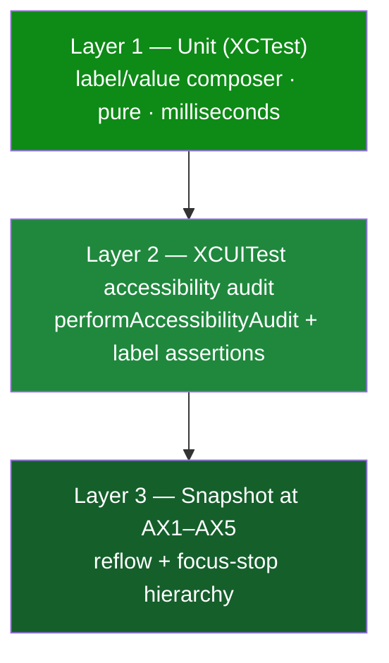

# iOS Transaction Accessibility Regression Coverage — Design

> **Status:** PROPOSED — pending human review
> **Issue:** [#2546](https://github.com/jrmoulckers/finance/issues/2546) · Part of [#2117](https://github.com/jrmoulckers/finance/issues/2117)
> **Platform:** iOS / iPadOS (SwiftUI) · Deployment target iOS 17.0
> **Labels:** `platform:ios` · `accessibility` · `priority:medium` · `effort:s`
> **Author:** iOS engineer (design only — no native build performed)

This document defines the **smallest durable test suite** that prevents the
transaction-row VoiceOver regressions described in
[#2544](./ios-transaction-row-voiceover-labels.md) and the Dynamic Type reflow
regressions in [#2548](./ios-dynamic-type-reflow-audit.md) from recurring. It
is design-only; the distribution tail is gated by Apple Developer enrollment
([#1239](https://github.com/jrmoulckers/finance/issues/1239)).

---

## Table of Contents

1. [Goal and non-goals](#1-goal-and-non-goals)
2. [What regressed and why tests missed it](#2-what-regressed-and-why-tests-missed-it)
3. [Test pyramid for accessibility](#3-test-pyramid-for-accessibility)
4. [Layer 1 — unit tests (label composition)](#4-layer-1--unit-tests-label-composition)
5. [Layer 2 — XCUITest accessibility audits](#5-layer-2--xcuitest-accessibility-audits)
6. [Layer 3 — snapshot at AX text sizes](#6-layer-3--snapshot-at-ax-text-sizes)
7. [Coverage matrix](#7-coverage-matrix)
8. [Privacy, stale, error, and empty-state cases](#8-privacy-stale-error-and-empty-state-cases)
9. [Test data and fixtures](#9-test-data-and-fixtures)
10. [CI integration](#10-ci-integration)
11. [Shared dependencies and the KMP boundary](#11-shared-dependencies-and-the-kmp-boundary)
12. [Implementation readiness](#12-implementation-readiness)
13. [References](#13-references)

## 1. Goal and non-goals

**Goal:** lock the accessibility contract of a transaction row — label, value,
trait, focus-stop count, rotor headings, swipe-action parity, redaction, and
reflow — so a future refactor that drops the amount (exactly the #2544 bug)
fails CI loudly.

**Non-goals:** re-testing SwiftUI itself, pixel-perfect visual snapshots,
or duplicating business-rule tests that belong in `packages/`.

## 2. What regressed and why tests missed it

The amount and status disappeared from the row announcement because an explicit
`.accessibilityLabel` on a `.combine` element overrode the merged children (see
[#2544 §3](./ios-transaction-row-voiceover-labels.md#3-root-cause)). The existing
suite never caught it because:

- The current tests under [`apps/ios/Tests`](../../apps/ios/Tests) are
  **view-model** tests ([`TransactionsViewModelTests`](../../apps/ios/Tests/TransactionsViewModelTests.swift),
  [`DashboardViewModelTests`](../../apps/ios/Tests/DashboardViewModelTests.swift)) — they assert
  data, never the **accessibility tree**.
- The one UI suite
  ([`apps/ios/Tests/UITests/FinanceUITests.swift`](../../apps/ios/Tests/UITests/FinanceUITests.swift))
  checks navigation and `staticTexts`, never a row's `.label`/`.value`.
- The label string is **embedded inside the view body**, so there is no pure
  function a unit test can call.

The fix is therefore structural (extract a pure composer — see
[#2544 §12](./ios-transaction-row-voiceover-labels.md#12-proposed-implementation))
**and** test-shaped, as below.

## 3. Test pyramid for accessibility



Bias toward Layer 1 (cheapest, runs without a host app or device) and add the
minimum Layer 2/3 needed to cover what unit tests cannot see.

## 4. Layer 1 — unit tests (label composition)

New file: `apps/ios/Tests/TransactionAccessibilityTests.swift`. These call the
pure composer extracted in #2544 — no `XCUIApplication`, no simulator UI.

```swift
import XCTest
@testable import Finance

final class TransactionAccessibilityTests: XCTestCase {
    func testExpenseRowAnnouncesSignedAmount() {
        let t = TransactionItem.fixture(payee: "Blue Bottle", amountMinorUnits: -450,
                                        category: "Coffee", accountName: "Checking")
        let label = transactionRowLabel(t, balancesHidden: false)
        XCTAssertTrue(label.contains("Blue Bottle"))
        XCTAssertTrue(label.contains("Expense of"))   // amount NOT dropped
        XCTAssertTrue(label.contains("Coffee"))
        XCTAssertTrue(label.contains("Checking"))
    }

    func testPendingAndRecurringSurfaceInValue() {
        let t = TransactionItem.fixture(status: .pending, isRecurring: true)
        XCTAssertEqual(transactionRowValue(t), "Pending, Recurring")
    }

    func testClearedNonRecurringHasNoValue() {
        XCTAssertNil(transactionRowValue(.fixture(status: .cleared, isRecurring: false)))
    }

    func testBalancesHiddenRedactsAmount() {
        let label = transactionRowLabel(.fixture(amountMinorUnits: -450), balancesHidden: true)
        XCTAssertTrue(label.contains("Amount hidden"))
        XCTAssertFalse(label.contains("4.50"))        // never leak the figure
    }

    func testIncomeUsesIncomePhrasing() {
        let label = transactionRowLabel(.fixture(amountMinorUnits: 250_000, type: .income),
                                        balancesHidden: false)
        XCTAssertTrue(label.contains("Income of"))
    }
}
```

These five tests alone would have failed against the buggy code, because the
composer would not have contained "Expense of …".

## 5. Layer 2 — XCUITest accessibility audits

Extend `FinanceUITests` (or a new `AccessibilityUITests.swift`) with the iOS 17+
automated audit plus targeted assertions the audit cannot make:

```swift
func testTransactionsScreenPassesAccessibilityAudit() throws {
    launchAppSkippingOnboarding()
    navigateToTab("Transactions", expectedNavTitle: "Transactions")
    // Catches: missing labels, clipped text at large sizes, low contrast,
    // elements not reachable by VoiceOver, hit-region/trait problems.
    try app.performAccessibilityAudit()
}

func testDashboardRecentRowAnnouncesAmount() throws {
    launchAppSkippingOnboarding()
    let row = app.buttons.matching(NSPredicate(format: "label CONTAINS %@", "Blue Bottle")).firstMatch
    XCTAssertTrue(row.waitForExistence(timeout: defaultTimeout))
    XCTAssertTrue(row.label.contains("Expense of") || row.label.contains("Income of"))
}

func testRowExposesEditAndDeleteAsCustomActions() throws {
    // Switch Control / VoiceOver users reach swipe actions via the Actions rotor;
    // assert the custom actions exist without performing a physical swipe.
    // (Asserted through the accessibility audit + element action availability.)
}
```

Notes:

- `performAccessibilityAudit()` (XCUITest, iOS 17) is the backstop for "every
  interactive element has a label" and "text is not clipped at the current
  size"; run it for Transactions, Dashboard, and (for #2548) Analytics and
  Investments.
- Use `--uitesting` launch argument (already wired) plus a deterministic
  seed so the same fixture transactions appear every run.

## 6. Layer 3 — snapshot at AX text sizes

Snapshot the **accessibility hierarchy** (not just pixels) of a single row at
the default size and at the five accessibility sizes (AX1–AX5) to lock:

1. focus-stop **count** (one row = one stop),
2. label/value text,
3. reflow from horizontal to vertical (ties to
   [#2548](./ios-dynamic-type-reflow-audit.md)).

Drive the size with the launch environment so no third-party snapshot library
is required:

```swift
app.launchEnvironment["UIPreferredContentSizeCategory"] = "UICTContentSizeCategoryAccessibilityExtraExtraExtraLarge" // AX5
```

If a snapshot library is later approved, prefer the system-native
`XCTAttachment` of the element tree over image diffs to avoid brittleness. No
third-party UI framework is introduced (per platform boundary).

## 7. Coverage matrix

| Case                                   | L1 unit | L2 audit | L3 snapshot |
| -------------------------------------- | :-----: | :------: | :---------: |
| Expense announces signed amount        |   ✅    |    ✅    |      —      |
| Income announces signed amount         |   ✅    |    ✅    |      —      |
| Transfer announces neutral amount      |   ✅    |    —     |      —      |
| Pending surfaces in value              |   ✅    |    ✅    |      —      |
| Recurring surfaces in value            |   ✅    |    —     |      —      |
| Cleared/non-recurring → no value       |   ✅    |    —     |      —      |
| Multi-tag rows                         |   ✅    |    —     |      —      |
| Date present in row (not just header)  |   ✅    |    ✅    |      —      |
| One focus stop per row                 |    —    |    ✅    |     ✅      |
| Section header is a heading (rotor)    |    —    |    ✅    |      —      |
| Swipe actions reachable via rotor      |    —    |    ✅    |      —      |
| Balances hidden → amount redacted      |   ✅    |    ✅    |      —      |
| AX5 reflow keeps amount + label intact |    —    |    ✅    |     ✅      |
| Empty / search-empty state             |    —    |    ✅    |      —      |
| Error alert focus + labeled buttons    |    —    |    ✅    |      —      |

## 8. Privacy, stale, error, and empty-state cases

- **Privacy:** the `testBalancesHiddenRedactsAmount` unit test plus an audit run
  with the hide-balances launch flag set; assert no spoken amount leaks.
- **Stale / offline:** drive `--offline` (or mocked `NetworkMonitor`) so
  [`OfflineBanner`](../../apps/ios/Finance/Components/OfflineBanner.swift)
  appears; assert it is announced and the list still passes the audit.
- **Error:** force the repository mock to throw; assert the error alert receives
  focus and Retry/Dismiss are labeled buttons.
- **Empty:** assert `EmptyStateView` title is a heading and the CTA is a labeled
  button; assert no phantom row elements exist in the accessibility tree.

## 9. Test data and fixtures

- Add a `TransactionItem.fixture(...)` factory in
  [`apps/ios/Tests/TestHelpers.swift`](../../apps/ios/Tests/TestHelpers.swift) with
  sensible defaults so each test overrides only the field under test.
- Reuse the existing mock repositories
  ([`apps/ios/Finance/Repositories/Mocks`](../../apps/ios/Finance/Repositories/Mocks)) for
  deterministic UI runs; seed a fixed set including one pending, one recurring,
  one income, one transfer, and one multi-tag transaction.
- Keep fixtures free of real PII; amounts are synthetic.

## 10. CI integration

- Unit tests (Layer 1) run in the existing iOS unit job in
  [`.github/workflows/ci-ios.yml`](../../.github/workflows/ci-ios.yml) — fast,
  no device.
- XCUITest audits (Layer 2/3) run on a simulator runner; gate them behind the
  same job that already builds the app so no new required check is added without
  a green baseline first.
- The accessibility audit assertion is **blocking** once green: a dropped label
  fails the build, which is the entire point of #2546.

## 11. Shared dependencies and the KMP boundary

- The composer under test lives in `apps/ios` (Apple accessibility semantics) —
  so do its tests. Nothing here touches `packages/`.
- Business-rule correctness (what _pending_ means, sign of an amount) is tested
  in `packages/core` / `packages/models` and is **not** re-tested here; these
  tests assert only the **presentation/announcement** contract.
- Any need to change a shared package is an ADR with `@architect`, not a direct
  edit.

## 12. Implementation readiness

See [`docs/ops/human-gated-prerequisites.md`](../ops/human-gated-prerequisites.md).

**Buildable now (no human gate):**

- Every layer here runs with **free Personal Team** signing or no signing at
  all: Layer 1 unit tests need no Apple account; Layer 2/3 run on the iOS
  Simulator. `performAccessibilityAudit()` is available on the iOS 17 SDK used
  by CI. All of #2546 is implementable and verifiable today.

**Gated by [#1239](https://github.com/jrmoulckers/finance/issues/1239):**

- Running these tests on a **physical** device under a paid team, and shipping
  the verified build to TestFlight / App Store. The tests themselves do not
  require enrollment.

No human-gated operation is required to implement or run this suite.

## 13. References

- Sibling designs: [transaction-row VoiceOver labels (#2544)](./ios-transaction-row-voiceover-labels.md) ·
  [Dynamic Type reflow audit (#2548)](./ios-dynamic-type-reflow-audit.md)
- [Accessibility Patterns Library](./accessibility-patterns.md) — §3 Screen Reader Support
- [Cognitive Accessibility Mode](./cognitive-accessibility.md) — testing checklist precedent
- Existing tests: [`apps/ios/Tests`](../../apps/ios/Tests) ·
  [`apps/ios/Tests/UITests/FinanceUITests.swift`](../../apps/ios/Tests/UITests/FinanceUITests.swift)
- Apple — XCTest `performAccessibilityAudit()`, Dynamic Type, VoiceOver
