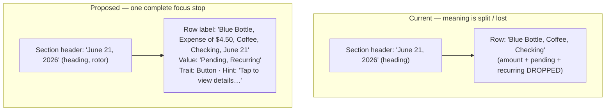
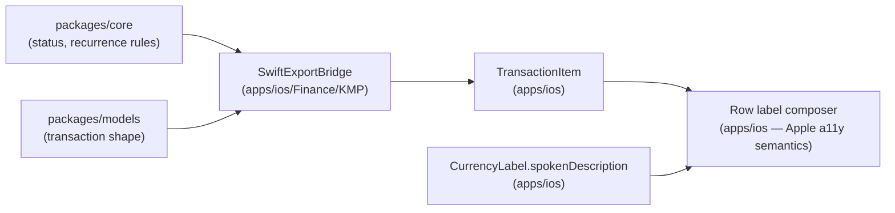

# iOS Transaction Row VoiceOver Labels — Design

> **Status:** PROPOSED — pending human review
> **Issue:** [#2544](https://github.com/jrmoulckers/finance/issues/2544) · Part of [#2117](https://github.com/jrmoulckers/finance/issues/2117)
> **Platform:** iOS / iPadOS (SwiftUI) · Deployment target iOS 17.0
> **Labels:** `platform:ios` · `accessibility` · `priority:high` · `effort:s`
> **Author:** iOS engineer (design only — no native build performed)

This document specifies how a single transaction row should be announced by
VoiceOver as **one focus stop** that carries payee, signed amount, category,
account, date, and status (pending / recurring). It is a design-only
deliverable: native Swift/SwiftUI changes are tracked separately and the
distribution tail is gated by Apple Developer enrollment
([#1239](https://github.com/jrmoulckers/finance/issues/1239)).

---

## Table of Contents

1. [Problem statement](#1-problem-statement)
2. [Affected iOS surfaces](#2-affected-ios-surfaces)
3. [Root cause](#3-root-cause)
4. [Focus-stop model (current vs proposed)](#4-focus-stop-model-current-vs-proposed)
5. [VoiceOver label / value / trait composition](#5-voiceover-label--value--trait-composition)
6. [Rotor and date-section context](#6-rotor-and-date-section-context)
7. [Redundant non-color cues](#7-redundant-non-color-cues)
8. [Dynamic Type interplay](#8-dynamic-type-interplay)
9. [Privacy — balance hiding](#9-privacy--balance-hiding)
10. [Stale, error, and empty states](#10-stale-error-and-empty-states)
11. [Shared dependencies and the KMP boundary](#11-shared-dependencies-and-the-kmp-boundary)
12. [Proposed implementation](#12-proposed-implementation)
13. [Smallest tests plan](#13-smallest-tests-plan)
14. [Implementation readiness](#14-implementation-readiness)
15. [References](#15-references)

---

## 1. Problem statement

A transaction row contains four to six pieces of meaning: **who** (payee),
**how much** (signed amount), **what** (category), **where** (account),
**when** (date), and **state** (pending / recurring). Sighted users absorb all
of this in a single glance. A VoiceOver user must receive the same information
in a single focus stop, in a deliberate reading order, without losing the
amount or the status.

Today the amount and status are silently dropped from the announcement on every
transaction surface (see [§3](#3-root-cause)), and the date lives only in the
date-section header — a separate focus stop a user may not have visited. The
goal of #2544 is to standardise one correct, localized, privacy-aware label
across all transaction rows.

## 2. Affected iOS surfaces

| Surface                  | File                                                                                                                 | Row builder                     | Currently announced             | Missing                              |
| ------------------------ | -------------------------------------------------------------------------------------------------------------------- | ------------------------------- | ------------------------------- | ------------------------------------ |
| Reusable row component   | [`apps/ios/Finance/Components/TransactionRowView.swift`](../../apps/ios/Finance/Components/TransactionRowView.swift) | `accessibilityLabelText`        | payee, category, account, tags  | amount, date, **pending**, recurring |
| Transactions list        | [`apps/ios/Finance/Screens/TransactionsView.swift`](../../apps/ios/Finance/Screens/TransactionsView.swift)           | `transactionAccessibilityLabel` | payee, category, account, tags  | amount, date, pending, recurring     |
| Dashboard recent rows    | [`apps/ios/Finance/Screens/DashboardView.swift`](../../apps/ios/Finance/Screens/DashboardView.swift)                 | `transactionRow` inline         | payee, category                 | amount, date, status, account        |
| Swipe actions (edit/del) | [`apps/ios/Finance/Screens/TransactionsView.swift`](../../apps/ios/Finance/Screens/TransactionsView.swift)           | `.swipeActions` buttons         | "Edit transaction" / "Delete …" | which transaction; custom-action map |

Supporting components referenced by every row:

- [`CurrencyLabel`](../../apps/ios/Finance/Components/CurrencyLabel.swift) — already produces a
  sign-aware spoken description (`"Income of $X"` / `"Expense of $X"`), but that
  description is discarded when the parent overrides the combined label.
- [`TransactionItem`](../../apps/ios/Finance/Models/TransactionItem.swift) — the model carrying
  `amountMinorUnits`, `currencyCode`, `date`, `status`, `isRecurring`, `tags`.

> **Note:** three independent row builders exist with three different label
> strings. Consolidating on the reusable `TransactionRowView` (see
> [§12](#12-proposed-implementation)) removes the divergence at its source.

## 3. Root cause

Every row uses `.accessibilityElement(children: .combine)` **and then** sets an
explicit `.accessibilityLabel(...)`. An explicit label on a combined element
**replaces** the auto-merged child labels — so the amount rendered by
`CurrencyLabel` and the "Pending" / "Recurring" badges never reach VoiceOver.

```swift
// TransactionRowView.swift (today)
HStack { /* icon, payee, pending badge, recurring icon, CurrencyLabel */ }
    .accessibilityElement(children: .combine)          // would merge children…
    .accessibilityLabel(accessibilityLabelText)        // …but this OVERRIDES the merge

private var accessibilityLabelText: String {
    // payee, category, accountName, tags — no amount, no date, no status
}
```

The fix is not "remove the explicit label" (the auto-merge order is
unpredictable and reads the orange "Pending" capsule and decorative icon in
visual order). The fix is to **compose one deterministic label/value/trait set
by hand** that includes every meaningful field, and to mark decorative views
`.accessibilityHidden(true)` so they never leak into the merge.

## 4. Focus-stop model (current vs proposed)



## 5. VoiceOver label / value / trait composition

A row is a **button** (it pushes a detail / edit screen). Compose the focus
stop as follows. All strings use `String(localized:)`; the order below is the
spoken order.

| Element        | Source                                                    | Spoken order | Rule                                                                                            |
| -------------- | --------------------------------------------------------- | ------------ | ----------------------------------------------------------------------------------------------- |
| **Label**      | payee → amount → category → account → date                | 1            | Identity first, money second; join with `", "`. Amount uses `CurrencyLabel` spoken description. |
| **Value**      | status descriptors (`Pending`, `Recurring`)               | 2            | Omit when the row is the default `cleared` / non-recurring — silence reduces verbosity.         |
| **Trait**      | `.isButton`                                               | 3            | Tells VoiceOver an activation is available; do not add `.isStaticText`.                         |
| **Hint**       | "Tap to view details. Swipe to edit or delete."           | 4            | Honour Settings → VoiceOver → "Speak hints"; never put critical info only in the hint.          |
| **Decorative** | type icon, color swatch, divider, inline tag chips visual | hidden       | `.accessibilityHidden(true)` so the merge cannot read them in visual order.                     |

### Canonical composition (pseudocode)

```swift
// Pure, testable — see §13. Lives in apps/ios (Apple a11y semantics).
func transactionRowLabel(_ t: TransactionItem, balancesHidden: Bool) -> String {
    let amount = balancesHidden
        ? String(localized: "Amount hidden")
        : CurrencyLabel.spokenDescription(t.amountMinorUnits, t.currencyCode) // "Expense of $4.50"
    var parts = [t.payee, amount, t.category]
    if !t.accountName.isEmpty { parts.append(t.accountName) }
    parts.append(t.date.formatted(.dateTime.month().day())) // "June 21"
    return parts.joined(separator: ", ")
}

func transactionRowValue(_ t: TransactionItem) -> String? {
    var s: [String] = []
    if t.status == .pending { s.append(String(localized: "Pending")) }
    if t.isRecurring { s.append(String(localized: "Recurring")) }
    return s.isEmpty ? nil : s.joined(separator: ", ")
}
```

### Worked examples

| Transaction                                               | Label (spoken)                                             | Value                |
| --------------------------------------------------------- | ---------------------------------------------------------- | -------------------- |
| Blue Bottle, −$4.50, Coffee, Checking, pending, recurring | "Blue Bottle, Expense of $4.50, Coffee, Checking, June 21" | "Pending, Recurring" |
| Payroll, +$2,500.00, Income, Checking, cleared            | "Payroll, Income of $2,500.00, Income, Checking, June 20"  | _(none)_             |
| Transfer, $300.00, Transfer, Savings, cleared             | "Transfer, $300.00, Transfer, Savings, June 19"            | _(none)_             |

## 6. Rotor and date-section context

- The date-section header (`Text(group.date, style: .date)`) **stays** a
  VoiceOver **heading** (`.accessibilityAddTraits(.isHeader)`) so the **Headings
  rotor** lets users jump between days. Each row additionally repeats the short
  date so a user who lands mid-list still gets the "when" without back-tracking.
- Add an **Actions rotor** entry for the swipe actions via
  `.accessibilityAction(named:)` so "Edit" and "Delete" are reachable without
  performing a physical swipe (swipe gestures are hard for Switch Control and
  some motor profiles):

  ```swift
  .accessibilityAction(named: Text("Edit transaction")) { edit(t) }
  .accessibilityAction(named: Text("Delete transaction")) { confirmDelete(t.id) }
  ```

- Swipe-action buttons must name the **subject** ("Delete transaction") and the
  destructive one keeps `role: .destructive` so the trait is announced.

## 7. Redundant non-color cues

Financial direction and status must never depend on color alone (WCAG 1.4.1):

| Signal    | Color (visual)      | Redundant non-color cue (required)                                      |
| --------- | ------------------- | ----------------------------------------------------------------------- |
| Income    | green               | leading `+`/down-left arrow icon **and** spoken "Income of …"           |
| Expense   | red                 | leading `−`/up-right arrow icon **and** spoken "Expense of …"           |
| Transfer  | blue                | transfer arrow icon **and** spoken "Transfer"                           |
| Pending   | orange capsule      | the **word** "Pending" in the capsule **and** in the VoiceOver value    |
| Recurring | secondary-tint icon | the **word** "Recurring" in the VoiceOver value (icon stays decorative) |

The amount color in `CurrencyLabel` is therefore a _reinforcement_, not the
sole carrier of meaning. Verify against Increase Contrast and Smart Invert.

## 8. Dynamic Type interplay

This work composes the **string**; the **layout** that must wrap that string at
accessibility sizes (AX1–AX5) is covered by the Dynamic Type reflow audit
([#2548](./ios-dynamic-type-reflow-audit.md)). Two contracts connect them:

1. The composed label is identical regardless of type size — VoiceOver content
   must not change when the row reflows from horizontal to vertical.
2. The amount must remain a **separate visual element** (so it can move below
   payee at AX sizes) while still feeding the single combined label.

## 9. Privacy — balance hiding

When a future "Hide balances" privacy mode (or `.privacySensitive()` redaction
while the app is backgrounded / in the app switcher) hides amounts on screen,
the **accessibility label and value must also redact the amount** — otherwise
VoiceOver leaks exactly the figure the user asked to hide.

- Thread a `balancesHidden` flag into the label composer; substitute
  `String(localized: "Amount hidden")` for the spoken amount.
- Never place the real amount in `accessibilityValue` "for convenience".
- The redaction state itself is not sensitive; announcing "Amount hidden" is
  expected and reassuring.

See [Financial Data Accessibility](./accessibility-patterns.md#7-financial-data-accessibility)
for the cross-platform rule and the widget-side precedent in
[`WidgetPrivacyPrompt`](../../apps/ios/Finance/Services/WidgetPrivacyPrompt.swift).

## 10. Stale, error, and empty states

| State           | Surface                                                                    | VoiceOver behaviour                                                                                |
| --------------- | -------------------------------------------------------------------------- | -------------------------------------------------------------------------------------------------- |
| Loading         | `ProgressView` with `.accessibilityLabel("Loading")`                       | Already labeled; keep as a single focus stop, no row labels yet.                                   |
| Empty           | [`EmptyStateView`](../../apps/ios/Finance/Components/EmptyStateView.swift) | Title is a heading; CTA "Add Transaction" is a labeled button. No phantom rows announced.          |
| Search-empty    | `ContentUnavailableView.search(text:)`                                     | System component is already accessible; verify the query echoes in the announcement.               |
| Error           | `.alert("Error", …)` with Retry / Dismiss                                  | VoiceOver focus moves to the alert; both buttons labeled; message is the spoken body.              |
| Stale / offline | [`OfflineBanner`](../../apps/ios/Finance/Components/OfflineBanner.swift)   | Announce as a live region (`.accessibilityAddTraits(.updatesFrequently)`) when connectivity flips. |

Per-row staleness (e.g. a transaction edited locally but not yet synced) is not
currently surfaced; if added later, expose it in the row **value** ("Not
synced"), never via color only.

## 11. Shared dependencies and the KMP boundary



- **Stays in `packages/`** (no change required for #2544): what _pending_ /
  _recurring_ mean, sign of an amount, currency minor-unit math.
- **Stays in `apps/ios`** (this work): label/value/trait composition, spoken
  ordering, localization, redaction, rotor and swipe-action semantics.

No shared-package edits are needed; if a future need arises, it goes through an
ADR per the KMP boundary, not a direct `packages/` change.

## 12. Proposed implementation

1. **Consolidate** the three row builders onto the reusable
   `TransactionRowView`; delete the inline copies in `TransactionsView` and
   `DashboardView` (Dashboard passes a "compact" flag if it wants fewer visible
   fields, but the _label_ stays complete).
2. **Extract** `transactionRowLabel(_:balancesHidden:)` and
   `transactionRowValue(_:)` as pure functions (file-private or a small
   `TransactionAccessibility` enum) so they are unit-testable without a host app.
3. **Mark decorative** views hidden: type icon, color circle, divider, inline
   tag visuals → `.accessibilityHidden(true)`.
4. **Apply** `.accessibilityElement(children: .ignore)` + explicit
   `.accessibilityLabel` + `.accessibilityValue` + `.accessibilityAddTraits(.isButton)`
   - `.accessibilityHint` + `.accessibilityAction(named:)` for swipe parity.
5. **Keep the section header** a heading for the rotor.
6. **Localize** every fragment; verify pseudo-localized and RTL ordering.

## 13. Smallest tests plan

The detailed regression suite is owned by
[#2546](./ios-transaction-accessibility-regression.md). The minimum to accept
**this** change:

- **Unit (XCTest, no host app):** assert `transactionRowLabel`/`Value` output
  for income, expense, transfer, pending, recurring, multi-tag, empty-account,
  and `balancesHidden == true` cases. Pure functions → fast and deterministic.
- **UI (XCUITest):** `app.performAccessibilityAudit()` on the Transactions and
  Dashboard screens (iOS 17+) — zero issues. Assert a row element's
  `.label`/`.value` contains the amount and "Pending".
- **Snapshot (optional):** accessibility-hierarchy snapshot at default size to
  lock the focus-stop order.

## 14. Implementation readiness

See [`docs/ops/human-gated-prerequisites.md`](../ops/human-gated-prerequisites.md)
for the authoritative split.

**Buildable now (no human gate):**

- All VoiceOver label/value/trait/rotor/swipe-action work in this document is
  implementable and testable today on the iOS Simulator and on a personal
  device using a **free Personal Team** signing certificate (no paid enrollment
  required to build, run, and run XCUITest accessibility audits).
- Unit and UI accessibility tests run in CI without any Apple account.

**Gated by [#1239](https://github.com/jrmoulckers/finance/issues/1239) (Apple Developer enrollment):**

- TestFlight / App Store distribution of the build containing these labels.
- Any capability that needs a paid-team entitlement (push, App Groups across a
  signed distribution build, etc.). The a11y work itself needs none of these.

No human-gated operation is required to _implement or verify_ this design.

## 15. References

- Sibling designs: [accessibility regression coverage (#2546)](./ios-transaction-accessibility-regression.md) ·
  [Dynamic Type reflow audit (#2548)](./ios-dynamic-type-reflow-audit.md)
- [Accessibility Patterns Library](./accessibility-patterns.md) — §3 Screen Reader Support, §7 Financial Data Accessibility
- [Cognitive Accessibility Mode](./cognitive-accessibility.md) — content and simplification guidance
- Apple HIG — VoiceOver, Accessibility, Dynamic Type
- WCAG 2.2 — 1.3.1 Info & Relationships, 1.4.1 Use of Color, 4.1.2 Name/Role/Value
