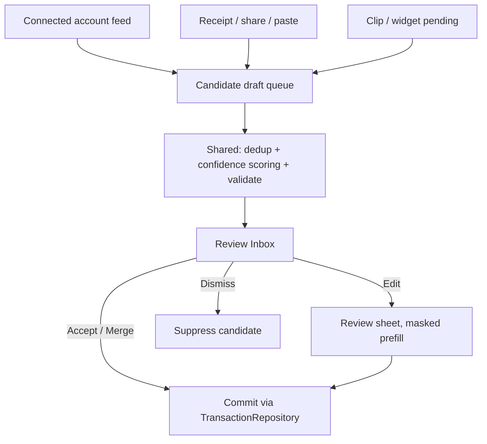

# Wallet-Adjacent Capture & Review Inbox — iOS

> Design specification for the **best-available** "Apple Pay–adjacent" capture
> experience on iOS. **iOS does not expose raw Apple Pay / Wallet transaction
> data to third-party apps** — there is no public API for arbitrary card
> transactions, and we will not attempt to use private ones. This design instead
> builds capture from **connected-account activity** (bank/card feeds via the
> sync backend) and **user-initiated manual capture**, surfacing candidates in a
> **review inbox** with explicit **confidence states** and **privacy-preserving
> prefill** (masked merchant/amount/date, never PAN or full card data).

**Status:** Design (implementation-ready) · pre-implementation
**Issue:** [#2603](https://github.com/jrmoulckers/finance/issues/2603) — Wallet-adjacent iOS transaction capture and review inbox design
**Part of:** [#2171](https://github.com/jrmoulckers/finance/issues/2171)
**Platforms:** iOS · iPadOS · macOS (SwiftUI); notifications/share-extension hooks
**WCAG target:** 2.2 Level AA — SC 1.4.1 Use of Color, SC 1.3.1 Info & Relationships, SC 2.5.5 Target Size
**Related:** [accessibility-patterns.md](./accessibility-patterns.md) · [ios-noncolor-financial-state-cues.md](./ios-noncolor-financial-state-cues.md) · [cognitive-accessibility.md](./cognitive-accessibility.md) · [ios-one-thumb-quick-add.md](./ios-one-thumb-quick-add.md) · [data-model.md](./data-model.md) · [Human-Gated Prerequisites](../ops/human-gated-prerequisites.md)

---

## Table of Contents

1. [Problem & the Apple Pay Reality](#1-problem--the-apple-pay-reality)
2. [Capture Sources (What We Can Actually Use)](#2-capture-sources-what-we-can-actually-use)
3. [The Review Inbox](#3-the-review-inbox)
4. [Confidence States](#4-confidence-states)
5. [Privacy-Preserving Prefill](#5-privacy-preserving-prefill)
6. [Affected iOS Surfaces](#6-affected-ios-surfaces)
7. [Shared Dependencies & the Capture Boundary](#7-shared-dependencies--the-capture-boundary)
8. [Accessibility, Dynamic Type & Reachability](#8-accessibility-dynamic-type--reachability)
9. [Privacy & Security](#9-privacy--security)
10. [Stale, Error & Empty States](#10-stale-error--empty-states)
11. [Test Plan](#11-test-plan)
12. [Implementation Readiness](#12-implementation-readiness)
13. [Open Questions](#13-open-questions)

---

## 1. Problem & the Apple Pay Reality

Users expect "the app sees what I tapped to pay." On iOS that expectation cannot
be met directly, and it is important the design says so plainly:

- **No third-party access to Apple Pay/Wallet transactions.** PassKit
  (`PKPassLibrary`, `PKPaymentPass`) only exposes passes the app itself
  provisioned and the payment sheet for charges the app itself initiates as a
  merchant. There is **no public API** that returns the user's general Apple Pay
  purchase history, the merchant of a tap-to-pay, or the card's transaction
  feed.
- **No private APIs.** We will not call undocumented Wallet/PassKit internals or
  scrape system UI. Doing so is an App Store rejection and a privacy violation,
  and is explicitly out of scope.
- **No PAN, ever.** The full card number / Primary Account Number is never
  available to the app and must never be requested, stored, logged, or
  reconstructed. The system only ever exposes a device-specific masked suffix
  for passes the app provisioned — not arbitrary cards.

**Therefore the "wallet-adjacent" experience is, by necessity, built from
sources we _can_ legitimately use** (§2), feeding a **review inbox** (§3) where
the user confirms machine-suggested drafts. The word "adjacent" is literal: we
sit beside Apple Pay with the best legitimate signal, not inside it.

**Goals**

1. Turn connected-account activity and user-initiated captures into **draft**
   transactions, never silently-committed ones.
2. Give users a single **inbox** to review, accept, edit, or dismiss candidates
   with one thumb.
3. Communicate **confidence** honestly and accessibly (non-color).
4. Prefill only **masked, minimal** fields; keep raw card data out of the app
   entirely.

---

## 2. Capture Sources (What We Can Actually Use)

| Source                               | Mechanism (legitimate)                                                                                   | Produces                                   |
| ------------------------------------ | -------------------------------------------------------------------------------------------------------- | ------------------------------------------ |
| **Connected-account activity**       | Bank/card aggregation through the existing sync backend (`packages/sync`) → normalized transaction feed  | High/medium-confidence draft candidates    |
| **Receipt / document scan**          | User-initiated `VisionKit` `DataScannerViewController` / `VNRecognizeTextRequest` on a receipt photo     | Medium/low-confidence drafts (amount/date) |
| **Share-sheet & pasteboard import**  | User shares an order email/SMS/receipt to the app, or pastes text; on-device parsing                     | Medium/low-confidence drafts               |
| **App Clip / widget quick captures** | Existing `ClipTransaction` pending queue (App Group) and Lock Screen quick entry awaiting reconciliation | User-authored drafts to merge/dedup        |
| **Manual quick-add**                 | The one-thumb flow ([ios-one-thumb-quick-add.md](./ios-one-thumb-quick-add.md))                          | User-authored, high confidence             |

All sources are **user-initiated or user-authorized** (an account connection is
an explicit consent). None reads Apple Pay state. Each yields a **candidate
draft**, never a committed transaction — the inbox is the commit gate.

---

## 3. The Review Inbox

A new **Review Inbox** surface (a list reached from the Transactions tab and/or
a badge on it), modeled closely on the existing date-grouped
`TransactionsView` so interaction patterns transfer:

- **List of candidate drafts**, grouped by confidence then date. Each row shows
  masked merchant, amount, date, the suggested category (from
  `CategorizationEngine`), source, and a **confidence badge** (§4).
- **One-thumb actions via swipe** (mirroring `TransactionsView` swipe actions):
  - Trailing swipe → **Dismiss** (won't ask again for this candidate).
  - Leading swipe → **Accept** (commits the draft as a real transaction).
  - Tap → opens a **review sheet** prefilled with the masked fields for edit
    before accept.
- **Batch accept** for a run of high-confidence candidates ("Accept all
  high-confidence"), with a single undo.
- **Merge/dedup.** When a candidate matches an existing manual entry or a queued
  `ClipTransaction` (same amount window + date + merchant), the row offers
  **Merge** instead of creating a duplicate.
- **Empty inbox** is the success state, not a dead end (§10).

---

## 4. Confidence States

Confidence is computed by **shared logic** (§7) and rendered honestly. Three
tiers drive both the badge and the default action — and, per
[ios-noncolor-financial-state-cues.md](./ios-noncolor-financial-state-cues.md),
confidence is **never color-only**:

| Tier       | Meaning                                          | Badge (text + symbol + shape)                                | Default UX                                     |
| ---------- | ------------------------------------------------ | ------------------------------------------------------------ | ---------------------------------------------- |
| **High**   | Strong field match, recognized merchant, deduped | "High" · `checkmark.seal` · filled capsule                   | One-tap **Accept**; eligible for batch         |
| **Medium** | Plausible but ambiguous category/merchant/amount | "Review" · `questionmark.circle` · tinted capsule            | Opens prefilled **review sheet** before commit |
| **Low**    | Sparse/uncertain (e.g. OCR of a blurry receipt)  | "Needs info" · `exclamationmark.triangle` · outlined capsule | Manual completion required; cannot batch       |

Rules:

- The badge always pairs a **word + SF Symbol + shape**, so color-vision-
  deficient users and grayscale screenshots still convey the tier.
- Confidence is advisory; the user can always downgrade their trust by editing.
  Accepting never bypasses `TransactionValidator`.
- Low-confidence candidates never auto-fill a risky field (e.g. category) as if
  certain — they show the suggestion as a clearly optional hint.

---

## 5. Privacy-Preserving Prefill

Prefill carries the **minimum** needed to review, and only in masked form:

- **Allowed fields:** amount (minor units), date, normalized merchant/payee
  string, a **masked** account reference (e.g. "Card ···· 4242" — last-4 only,
  for connected accounts the user already linked), suggested category, source
  label.
- **Forbidden fields:** full PAN, CVV, expiry, cardholder name from the card,
  raw track data, Apple Pay device account numbers — none of these are available
  and none are ever requested or persisted.
- **Masking is done before the data reaches the view.** The "···· 4242" string
  is a display token, not a stored number; the model carries an opaque account
  id, and only the last-4 (already non-sensitive and user-visible on their own
  statements) is shown.
- **On-device parsing.** Receipt OCR and share/paste parsing run on-device
  (`VisionKit` / `NaturalLanguage`); raw document text is held only long enough
  to extract amount/date/merchant, then discarded — not uploaded for parsing.
- **No prefill without consent.** Connected-account candidates exist only because
  the user linked an account; manual-capture candidates exist only because the
  user shared/scanned/pasted. There is no background harvesting.

---

## 6. Affected iOS Surfaces

| Surface                                                          | Change                                                                                    |
| ---------------------------------------------------------------- | ----------------------------------------------------------------------------------------- |
| **New** `apps/ios/Finance/Screens/ReviewInboxView.swift`         | Candidate list, confidence badges, swipe Accept/Dismiss/Merge, batch accept               |
| **New** `apps/ios/Finance/Screens/CandidateReviewSheet.swift`    | Masked-prefill review/edit sheet built on the Details field set                           |
| **New** `apps/ios/Finance/ViewModels/ReviewInboxViewModel.swift` | `@Observable` VM: load candidates, accept/merge/dismiss, batch, undo                      |
| `apps/ios/Finance/Screens/TransactionsView.swift`                | Entry point + unread-count badge to the inbox                                             |
| **New** `apps/ios/Finance/Components/ConfidenceBadge.swift`      | Non-color badge (word + symbol + shape) reusing `ios-noncolor` cue vocabulary             |
| `apps/ios/Finance/Intents/` & share extension (future)           | A Share Extension target to receive receipts/order emails (separate target; design-noted) |
| `apps/ios/Shared/SharedTransactionModel.swift`                   | Reuse the App Group `ClipTransaction` pending queue as one candidate source (merge/dedup) |
| **New** `apps/ios/Tests/ReviewInboxViewModelTests.swift`         | Accept/merge/dismiss/batch/undo and masking assertions                                    |

The Share Extension and any push notification ("3 transactions to review") are
called out as **future targets**: they are designed for here but their
entitlements live in the gated tail (§12).

---

## 7. Shared Dependencies & the Capture Boundary

This is the most boundary-sensitive of the cluster. The split:

- **Shared (Kotlin, `packages/core` / `packages/models`) owns the rules and the
  intelligence:**
  - **Candidate generation & normalization** from the connected-account feed
    belongs to the sync/aggregation layer (`packages/sync`) and shared models
    (`packages/models/.../models/Transaction.kt`), so every platform reviews the
    same drafts.
  - **Dedup / merge matching** (amount window + date + merchant similarity) is a
    platform-neutral algorithm and should live in `packages/core` so iOS,
    Android, web, and Windows behave identically.
  - **Confidence scoring** is likewise shared business logic in `packages/core`.
  - **Validation** of any accepted draft stays in
    `packages/core/.../validation/TransactionValidator.kt` (via
    `KMPTransactionValidatorProtocol`); **category suggestion** stays in
    `CategorizationEngine`.
- **iOS owns presentation and platform capture mechanics only:**
  - The inbox UI, swipe actions, confidence **badge rendering**, the review
    sheet, accessibility, and notifications.
  - **On-device capture plumbing** that is inherently Apple: `VisionKit` receipt
    scanning, the Share Extension, pasteboard handling — these produce raw
    extracted text/fields that are handed to shared logic for scoring/dedup.

> **Boundary note (do not implement here):** the dedup-matching, confidence-
> scoring, and any new "candidate draft" model are **shared** concerns. If they
> don't already exist in `packages/`, introducing them is a change for
> `@native-app-engineer` via ADR — this document specifies the iOS-side contract and
> the data it expects, not the Kotlin implementation. iOS must not fork these
> rules locally. Boundary: **scoring/dedup/validation in KMP, capture mechanics
> and review UI in SwiftUI.**

---

## 8. Accessibility, Dynamic Type & Reachability

- **Confidence badges are non-color** (word + SF Symbol + shape), so VoiceOver
  reads "High confidence", "Needs review", "Needs info", and grayscale users see
  the tier. This directly reuses
  [ios-noncolor-financial-state-cues.md](./ios-noncolor-financial-state-cues.md).
- **VoiceOver row labels** combine into "Masked merchant, amount, date, suggested
  category, <confidence> confidence" with a hint "Swipe up for Accept, Dismiss,
  Merge", mirroring `TransactionsView`'s accessibility composition.
- **One-thumb review.** Accept/Dismiss live on swipe (thumb-reachable) and the
  batch-accept button is bottom-anchored; the review sheet uses the same
  bottom-anchored Save as the quick-add sheet.
- **Dynamic Type.** All badge/row text scales; badges wrap word + symbol rather
  than truncating; targets stay ≥ 44×44pt.
- **Switch Control / keyboard.** Each row exposes Accept/Dismiss/Merge as
  `.accessibilityAction`s so non-swipe users get the same actions; focus order
  is badge → fields → actions.
- **Reduce Motion.** Accept/merge/dismiss collapse rows with a cross-fade instead
  of a slide; batch accept doesn't cascade-animate.

---

## 9. Privacy & Security

- **Apple Pay/Wallet data is never read** (restated from §1) — design correctness
  depends on this being explicit so no one "optimizes" toward private APIs.
- **No PAN/card data** is stored, logged, or transmitted; only user-visible
  last-4 display tokens and opaque account ids exist on device.
- **Secrets stay in the Keychain.** Connected-account session/refresh tokens (to
  the extent any reach the device) live in the Keychain with
  `kSecAttrAccessibleWhenUnlockedThisDeviceOnly`, never `UserDefaults`. The
  App Group pending-candidate queue holds only masked, non-secret draft fields.
- **`.private` logging.** Amounts, merchants, and account references are
  `.private` in `os.Logger`; only structural events ("inbox loaded: 4
  candidates", "candidate accepted") are `.public`.
- **On-device parsing only;** raw receipt/email text is transient and discarded
  after field extraction, never uploaded for the purpose of parsing.
- **Biometric gate.** Opening the inbox honors the existing app-lock /
  `BiometricAuthManager` policy before masked financial details are shown, just
  like the rest of the app.

---

## 10. Stale, Error & Empty States

- **Empty inbox (the good state).** Show a positive empty state ("You're all
  caught up — no transactions to review") using `ContentUnavailableView`, with a
  secondary action to connect an account or scan a receipt — not a dead screen.
- **No connected accounts.** If aggregation isn't set up, the inbox explains that
  connected-account capture is unavailable and points to manual capture
  (scan/share/quick-add) so the feature still has value offline.
- **Stale feed.** Show "Last updated <relative time>"; if the feed is older than
  a threshold or sync failed, badge the inbox as stale and offer **Refresh**
  rather than presenting possibly-outdated candidates as fresh.
- **Sync/parse error.** Partial failures keep already-fetched candidates and show
  an inline, dismissible error with Retry; OCR/parse failure on a single capture
  marks that candidate **Low** with "couldn't read amount", never silently
  dropping it.
- **Conflict on accept.** If a candidate fails `TransactionValidator` at accept
  time (e.g. its account was deleted), the review sheet opens with the offending
  field flagged instead of committing an invalid record.
- **Duplicate detected.** When dedup finds a match, the row defaults to **Merge**
  and explains why, preventing double-counting.

---

## 11. Test Plan

### 11.1 Shared (Kotlin · `packages/core` · `commonTest`)

- **Dedup/matching test:** two near-identical candidates (same amount, date
  within N minutes, similar merchant) are matched; dissimilar ones are not.
- **Confidence-scoring test:** known field combinations map to High/Medium/Low
  deterministically.
- **`TransactionValidatorTest`:** an accepted candidate with a deleted account →
  `AccountNotFound`; a valid one passes — proving accept can't bypass rules.
- **Masking unit (wherever normalization lives):** output never contains more
  than last-4; full PAN-like inputs are rejected/redacted.

### 11.2 Native (Swift · iOS Simulator · XCTest)

- `ReviewInboxViewModelTests` (new):
  - Loads candidates and sorts by confidence then date.
  - Accept commits via a mock `TransactionRepository`; Dismiss suppresses;
    Merge calls the merge path, not a second create.
  - Batch accept commits only High-confidence rows; single undo restores them.
  - Prefill exposes **only** masked fields (assert no field longer than last-4
    for the account token; assert no PAN-shaped strings).
- `ConfidenceBadge` snapshot/accessibility test: each tier renders word + symbol
  - shape and reads correctly in grayscale and to VoiceOver.
- `CandidateReviewSheet` snapshot at default and AX3 Dynamic Type.

### 11.3 Manual / QA gate (every UI PR)

- Grayscale + Increase Contrast: confidence tiers remain distinguishable.
- VoiceOver: swipe-action equivalents reachable; batch accept announced.
- Empty inbox, no-connected-accounts, and stale-feed states each render their
  intended copy and recovery action.

---

## 12. Implementation Readiness

### ✅ Buildable now — no enrollment required

The inbox UI, confidence badges, review sheet, view models, the masking/prefill
display layer, and all native tests build and run today under **free Personal
Team signing**, driven by **mock candidate sources** and the existing shared
`TransactionValidator` / `CategorizationEngine` via `KMPBridge`. The App Group
`ClipTransaction` queue already exists as one real candidate source for local
verification. Receipt scanning via `VisionKit` and on-device parsing are
free-framework capabilities usable without enrollment. None of this requires
`packages/` changes to demonstrate the iOS contract against mocks.

### 🔒 Distribution & capability tail — gated by [#1239](https://github.com/jrmoulckers/finance/issues/1239) (human action)

Human-gated per [Human-Gated Prerequisites](../ops/human-gated-prerequisites.md)
§2 — implementation is **not** blocked, only the following tail:

- TestFlight/App Store distribution, release signing, CI release workflows
  (Apple Developer Program enrollment + signing secrets).
- **Push notifications** ("transactions to review") require the Push
  Notifications capability — a paid entitlement, so the notification path is
  designed here but ships behind the gate.
- A **Share Extension** target is buildable locally but is distributed with the
  app under the same enrollment gate.

> **Separate (non-Apple) dependency:** _live_ connected-account aggregation needs
> the bank/market data provider credentials tracked outside this issue; until
> then the inbox runs against the local `ClipTransaction` queue and fixtures.
> That provider setup is its own human-gated task and is **not** created here.

No provisioning, certificates, secrets, or account registrations are performed as
part of this design.

---

## 13. Open Questions

1. Where exactly should the dedup-matching and confidence-scoring models live —
   `packages/core` vs. `packages/sync` — and what is the candidate-draft schema?
   This is an ADR conversation with `@native-app-engineer`/`@architect`.
2. Should the inbox be a top-level tab, a Transactions-tab section, or a
   notification-driven sheet? Proposal: a Transactions-tab entry with a badge,
   promotable later.
3. Retention policy for dismissed candidates and extracted receipt text —
   proposal: dismissed candidates suppressed by stable hash, raw text never
   retained past extraction.
4. How aggressively should batch-accept trust "High"? Proposal: conservative —
   only deduped, recognized-merchant candidates qualify.
