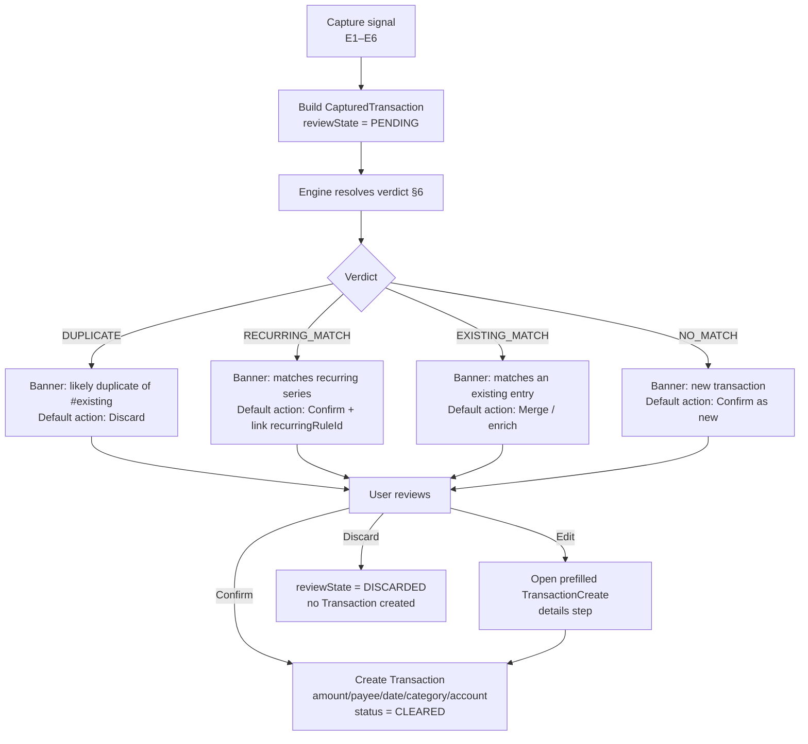

# Wallet-Adjacent iOS Transaction Capture + Merchant Matching / Dedup — Finance

> **Status:** DESIGN SPEC — implementation BLOCKED on Apple Developer enrollment ([#1239](https://github.com/jrmoulckers/finance/issues/1239))
> **Milestone:** v1.0 (design-spec milestone — no native Swift / PassKit code lands yet)
> **Epic:** [#2171](https://github.com/jrmoulckers/finance/issues/2171) — Wallet-aware transaction capture instead of full manual re-entry
> **Closes:** [#2603](https://github.com/jrmoulckers/finance/issues/2603) (capture + review inbox design) · [#2605](https://github.com/jrmoulckers/finance/issues/2605) (merchant matching + duplicate detection)
> **Platforms:** iOS (SwiftUI) primary surface · matching/dedup engine is platform-neutral `packages/core` (KMP `commonMain`)
> **Authoring agent:** `@ios-engineer` · **Engine proposed for:** `@kmp-engineer`

This document specifies a **Wallet-adjacent**, assisted transaction-capture flow for iOS and a
**platform-neutral merchant-matching / duplicate-detection engine** that backs it. It is a
design-only deliverable: no Swift or PassKit code is written here. iOS file paths are cited so a
future implementer knows exactly which surfaces are affected, but **no Swift files are edited**.

The capture experience is deliberately **assisted, not automatic**: every captured item enters a
**review inbox** as a _pending candidate_ and becomes a real
[`Transaction`](../../packages/models/src/commonMain/kotlin/com/finance/models/Transaction.kt) only
after the user confirms it. This preserves the project's manual-first trust philosophy
(see [Trust & Manual-First Entry Guide](../guides/trust-and-manual-entry.md)).

---

## Table of Contents

1. [Overview & scope](#1-overview--scope)
2. [The Apple Pay / Wallet API boundary (read this first)](#2-the-apple-pay--wallet-api-boundary-read-this-first)
3. [Domain grounding — real schema & existing core logic](#3-domain-grounding--real-schema--existing-core-logic)
4. [Capture entry points](#4-capture-entry-points)
5. [The review inbox (#2603)](#5-the-review-inbox-2603)
6. [Merchant matching & duplicate detection engine (#2605)](#6-merchant-matching--duplicate-detection-engine-2605)
7. [Application map (per-surface)](#7-application-map-per-surface)
8. [State coverage](#8-state-coverage)
9. [Accessibility & content](#9-accessibility--content)
10. [Test plan — commonTest runnable-today vs native-deferred](#10-test-plan--commontest-runnable-today-vs-native-deferred)
11. [Cross-references & resolved decisions](#11-cross-references--resolved-decisions)

---

## 1. Overview & scope

Epic [#2171](https://github.com/jrmoulckers/finance/issues/2171) reframes the problem: when a user
makes a purchase, re-entering every field by hand is friction. The naïve answer — "read the user's
Apple Pay / Wallet transactions and import them" — **is not possible** (see §2). So this design
delivers the achievable version of the goal: **reduce capture to a confirm/edit gesture** by
pre-filling a candidate from whatever signal the user _voluntarily hands us_ (a share-sheet payload,
a scanned receipt, a quick-add string, an App Intent), then **matching that candidate against
existing/recurring transactions** so the user isn't asked to re-enter what's already known and isn't
allowed to silently double-count.

In scope:

- **#2603** — the review inbox of pending captured items, the capture entry points that feed it, and
  the confirm / edit / discard flow.
- **#2605** — a platform-neutral algorithm to **normalize merchant names**, **match** a captured item
  to an existing or recurring transaction, and **detect duplicates** so a captured item already
  entered manually is not double-counted.

Out of scope (explicitly): any real PassKit / Apple Pay transaction feed (§2), bank aggregation /
Plaid-style credential linking (forbidden by the trust guide), and the native Swift/PassKit
implementation (blocked on [#1239](https://github.com/jrmoulckers/finance/issues/1239)).

The **matching + dedup logic is specified as shared `packages/core` logic** (Kotlin `commonMain`),
proposed for `@kmp-engineer`, so iOS, Android, Web, and Windows all share one source of truth — the
same pattern already used by
[`DuplicateDetector`](../../packages/core/src/commonMain/kotlin/com/finance/core/dataimport/DuplicateDetector.kt)
and
[`SubscriptionDetector`](../../packages/core/src/commonMain/kotlin/com/finance/core/subscription/SubscriptionDetector.kt).

---

## 2. The Apple Pay / Wallet API boundary (read this first)

**Apple does not expose a third-party app's view of the user's Apple Pay or Wallet transaction
history through any public API.** There is no PassKit, WalletKit, or Apple Pay API that lets Finance
read "the transactions the user made with Apple Pay." Apple Pay payment data is visible only to:

- the **issuing bank** (via their own app / statements), and
- the **merchant** that accepted the payment.

The only Wallet/PassKit surfaces a third-party app can touch are: presenting an in-app **payment
sheet** for purchases _made inside our own app_ (`PKPaymentAuthorizationController`), and adding /
managing **passes we issue** (`PKPass`). Neither yields a feed of the user's outside-app spending.

> **Design consequence:** This feature is **Wallet-_adjacent_**, not Wallet-_integrated_. We never
> read a transaction feed. Instead we capture from signals the user explicitly shares with us:

| Signal source                                       | How the user supplies it                                                                                                      | What we can pre-fill                                                                                                                                      |
| --------------------------------------------------- | ----------------------------------------------------------------------------------------------------------------------------- | --------------------------------------------------------------------------------------------------------------------------------------------------------- |
| **Share sheet** (`UIActivityViewController` target) | User taps Share on a receipt email, order confirmation, bank-app screenshot, or a merchant "thank you" page and picks Finance | merchant text, amount, date (best-effort parse)                                                                                                           |
| **Receipt scan (on-device OCR)**                    | User photographs a paper/PDF receipt                                                                                          | merchant, total, date, line items (see [`ReceiptTextParser`](../../packages/core/src/commonMain/kotlin/com/finance/core/dataimport/ReceiptTextParser.kt)) |
| **Quick-add string**                                | User types `"lunch 14.50 chipotle"`                                                                                           | amount, payee, category guess (see [one-thumb quick-add](#11-cross-references--resolved-decisions))                                                       |
| **App Intent / Shortcut / Siri**                    | User runs "Log Transaction" / "Add Expense"                                                                                   | amount, type, category, payee, account                                                                                                                    |
| **Manual nudge**                                    | User taps "+" and starts typing                                                                                               | nothing pre-filled — the existing manual path                                                                                                             |

Every one of these is **user-initiated** and consent-explicit. We do not, and cannot, run a
background importer. Framing this boundary up front prevents a future reader from believing a
PassKit transaction feed exists.

---

## 3. Domain grounding — real schema & existing core logic

This design builds on code that already exists in the repo. Citations are `file:line` against the
base branch at authoring time.

### 3.1 The real `Transaction` model

[`packages/models/.../Transaction.kt`](../../packages/models/src/commonMain/kotlin/com/finance/models/Transaction.kt):

- `Transaction` data class — `Transaction.kt:19-53`. Key fields a captured item must eventually
  produce: `accountId` (`:23`), `categoryId?` (`:24`), `type: TransactionType` (`:25`),
  `status: TransactionStatus` (`:26`), `amount: Cents` (`:27`), `currency: Currency` (`:28`),
  `payee: String?` (`:29`), `date: LocalDate` (`:31`).
- `TransactionType { EXPENSE, INCOME, TRANSFER }` — `Transaction.kt:13`.
- `TransactionStatus { PENDING, CLEARED, RECONCILED, VOID }` — `Transaction.kt:16`. **A captured,
  unconfirmed item is _not_ a `Transaction` at all** (see §5.1) — it does not borrow `PENDING`,
  which means "posted but not yet cleared by the bank," a different concept.
- Recurring linkage: `isRecurring: Boolean` (`:34`) and `recurringRuleId: SyncId?` (`:35`). The
  matcher (§6.4) uses these to suggest auto-linking a capture to an existing recurring series.
- Transfer linkage: `transferAccountId` (`:32`) and `transferTransactionId` (`:33`) — relevant
  because a captured "payment" that is actually a transfer between the user's own accounts must not
  be matched/deduped as an independent expense.
- `init` invariant: **amount cannot be zero** — `Transaction.kt:45`. The capture parser must reject
  zero-amount candidates before they reach confirm.

### 3.2 `Cents` — money type

[`packages/models/.../types/Cents.kt`](../../packages/models/src/commonMain/kotlin/com/finance/models/types/Cents.kt):
`@JvmInline value class Cents(val amount: Long)` — `Cents.kt:13-15`. All matching/dedup arithmetic
uses `Cents` (Long-backed, exact); never floats. Equality of `Cents` is exact-integer equality,
which is what the duplicate rule (§6.5) relies on for the amount component.

### 3.3 Existing duplicate detection to build on

[`DuplicateDetector`](../../packages/core/src/commonMain/kotlin/com/finance/core/dataimport/DuplicateDetector.kt)
already exists for CSV/file import:

- Composite fingerprint `(date, amount, normalisedDescription)` — `DuplicateDetector.kt:23-27`.
- `detect(...)` / `detectWithIntraBatch(...)` — `:53-111` (cross-set and within-batch dedup).
- `normalise(description)` — `:151-159`: lowercases, trims, collapses whitespace, strips `#\d+`
  reference numbers and long digit runs.

**Gap this design fills:** `DuplicateDetector` matches on an **exact** normalized string and an
**exact** date. Wallet-adjacent capture data is noisier (share-sheet merchant text varies, OCR
introduces drift, the capture timestamp may differ from the posted date by a day or two), so §6
proposes a **fuzzy** extension layered on the same fingerprint idea rather than replacing it.

### 3.4 Existing merchant normalization & recurring detection

[`SubscriptionDetector`](../../packages/core/src/commonMain/kotlin/com/finance/core/subscription/SubscriptionDetector.kt):

- `normalisePayee(payee)` — `SubscriptionDetector.kt:166-171`: trims, lowercases, collapses
  whitespace, strips trailing `[#*]\d+` reference numbers.
- `AMOUNT_TOLERANCE_PERCENT = 10.0` — `:25` (amounts within 10% are "similar").
- `INTERVAL_TOLERANCE_DAYS = 3` — `:31` (date interval tolerance).

These two constants are **reused as defaults** by the matcher (§6) so the codebase keeps one notion
of "close enough" rather than inventing new magic numbers.

### 3.5 Existing import / capture intermediate model

[`ImportModels.kt`](../../packages/core/src/commonMain/kotlin/com/finance/core/dataimport/ImportModels.kt):

- `ParsedTransaction` — `ImportModels.kt:28-40`: the existing "parsed but not yet a domain model"
  shape (`date`, `amount`, `description`, optional `category`/`note`/`type`/`currency`/`account`).
  §5.1's `CapturedTransaction` is a sibling of this — a candidate, not yet a `Transaction`.
- `ImportPreview` — `:66-84` and `ImportPhase.DETECTING_DUPLICATES` — `:140`: the precedent for a
  "preview before commit, with duplicate count" step. The review inbox is the capture analogue.

### 3.6 On-device receipt OCR contract

[`ReceiptTextParser.kt`](../../packages/core/src/commonMain/kotlin/com/finance/core/dataimport/ReceiptTextParser.kt):
`ExtractedReceiptText(merchant?, date?, total?, currency?, lineItems, rawText, confidence)` —
`ReceiptTextParser.kt:19-30`; `isUsable = merchant != null && total != null` — `:29`. The
receipt-scan capture entry (§4) reuses this exact contract — OCR stays on device.

### 3.7 Web review-queue precedent

The Web app already shipped a review-queue concept ([#1571](https://github.com/jrmoulckers/finance/issues/1571))
that the iOS review inbox mirrors at the model level:

- [`review-types.ts`](../../apps/web/src/lib/transactions/review-types.ts): `ReviewStatus { Unreviewed, Reviewed, Flagged }` (`review-types.ts:19-26`), `ReviewableTransaction` (`:33-52`), `ReviewFilter` (`:55-70`), `ReviewProgress` (`:73-84`).
- [`review-queue.ts`](../../apps/web/src/lib/transactions/review-queue.ts): pure `buildReviewQueue` (`review-queue.ts:219-226`), `markAsReviewed` (`:102-118`), `batchMarkAsReviewed` (`:156-173`).

**Note the difference:** the Web review queue reviews **already-real** transactions. The capture
review inbox here reviews **candidates that are not yet real**. The shared idea is the queue +
progress + batch-confirm shape; the lifecycle differs (confirm _creates_ a transaction).

---

## 4. Capture entry points

All entry points produce a `CapturedTransaction` candidate (§5.1) and route it into the review
inbox. None creates a `Transaction` directly — that only happens on user confirm.

| #   | Entry point                      | iOS surface (cited, not edited)                                                                     | Pre-fill source         | Notes                                                                                                                                                                                             |
| --- | -------------------------------- | --------------------------------------------------------------------------------------------------- | ----------------------- | ------------------------------------------------------------------------------------------------------------------------------------------------------------------------------------------------- |
| E1  | **Share-sheet target**           | _New_ Share Extension target (e.g. `apps/ios/Finance/ShareExtension/`) — to be created under #1239  | parsed shared text/URL  | The flagship Wallet-adjacent path: user shares a receipt email / order page into Finance.                                                                                                         |
| E2  | **Receipt scan**                 | _New_ capture sheet using on-device `Vision` OCR → `ExtractedReceiptText`                           | `ReceiptTextParser`     | OCR on device only; reuses `ExtractedReceiptText.isUsable` gate (`ReceiptTextParser.kt:29`).                                                                                                      |
| E3  | **Quick-add string**             | builds on one-thumb quick-add ([#2167](#11-cross-references--resolved-decisions))                   | NL parse → amount/payee | A capture is "confirmed quick" when match confidence is high (§5.4).                                                                                                                              |
| E4  | **App Intent — Log Transaction** | [`LogTransactionIntent.swift`](../../apps/ios/Finance/Intents/LogTransactionIntent.swift)`:31-98`   | intent parameters       | Today it creates a transaction directly (`LogTransactionIntent.swift:90`). Design: route _ambiguous_ intent captures (no account, or a likely duplicate) into the inbox instead of silent create. |
| E5  | **App Intent — Add Expense**     | [`AddExpenseIntent.swift`](../../apps/ios/Finance/Intents/AddExpenseIntent.swift)                   | intent parameters       | Same routing rule as E4.                                                                                                                                                                          |
| E6  | **Manual "+" (no pre-fill)**     | [`TransactionCreateView.swift`](../../apps/ios/Finance/Screens/TransactionCreateView.swift)`:12-46` | none                    | Unchanged manual path. Capture is additive, never a replacement.                                                                                                                                  |

**Routing rule (entry → inbox vs. direct create):** App-Intent captures (E4/E5) that are fully
specified _and_ score no duplicate/recurring match (§6) MAY create directly to preserve today's
one-tap Shortcuts behavior. Everything else — share-sheet, receipt scan, and any capture that the
engine flags as a likely duplicate or recurring match — **always** lands in the review inbox. (This
"always-review except fully-specified no-conflict intents" boundary is decision **D1** in §11.)

`LogTransactionIntent` already mints a candidate-shaped value today: `makeTransaction(...)` builds a
`TransactionItem` with `status: .pending` without persisting
([`LogTransactionIntent.swift:108-133`](../../apps/ios/Finance/Intents/LogTransactionIntent.swift)),
which is exactly the seam where the review-inbox route plugs in.

---

## 5. The review inbox (#2603)

### 5.1 The candidate model — `CapturedTransaction` (proposed `packages/core`)

A captured item is **not** a `Transaction`. It is a candidate with provenance and a resolved match
verdict. Proposed for `@kmp-engineer` in `packages/core` (sibling to `ParsedTransaction`):

```kotlin
// packages/core/src/commonMain/kotlin/com/finance/core/capture/CapturedTransaction.kt  (PROPOSED)
package com.finance.core.capture

@Serializable
enum class CaptureSource { SHARE_SHEET, RECEIPT_SCAN, QUICK_ADD, APP_INTENT, MANUAL }

@Serializable
enum class CaptureReviewState { PENDING, CONFIRMED, DISCARDED }

/**
 * A transaction the user captured (shared/scanned/typed) but has NOT yet confirmed.
 * Becomes a real [com.finance.models.Transaction] only on confirm. Mirrors the
 * "parsed but not yet domain" shape of [ParsedTransaction] (ImportModels.kt:28-40).
 */
@Serializable
data class CapturedTransaction(
    val captureId: SyncId,
    val ownerId: SyncId,
    val source: CaptureSource,
    val capturedAt: Instant,
    // Best-effort pre-fill — any field may be null when the signal was sparse.
    val rawMerchant: String? = null,
    val amount: Cents? = null,
    val currency: Currency? = null,
    val date: LocalDate? = null,
    val suggestedCategoryId: SyncId? = null,
    val note: String? = null,
    val reviewState: CaptureReviewState = CaptureReviewState.PENDING,
    val verdict: CaptureMatchVerdict? = null, // populated by the engine, §6
)
```

> The candidate uses `PENDING` from its **own** `CaptureReviewState`, deliberately **not**
> `TransactionStatus.PENDING` (`Transaction.kt:16`), to avoid conflating "user hasn't confirmed this
> capture" with "bank hasn't cleared this posted transaction." Decision **D2** (§11).

### 5.2 Inbox surface

A new **Review Inbox** screen (proposed `apps/ios/Finance/Screens/CaptureInboxView.swift`, created
under #1239) presented from a badge on the Transactions tab
([`TransactionsView.swift`](../../apps/ios/Finance/Screens/TransactionsView.swift)). Each row shows
the candidate's merchant, amount, date, source icon, and — most importantly — its **match verdict
banner** (§6): "Looks like a duplicate of …", "Matches your Netflix subscription", or "New
transaction." The row's confirm affordance adapts to the verdict (§5.3).

The inbox is modeled on the Web review-queue shape (`review-queue.ts:219-226`) — a filtered list +
progress summary + batch action — but the confirm action **creates** a transaction rather than
flipping a review flag.

### 5.3 Confirm / edit / discard flow



- **Confirm** maps the candidate to a `Transaction` (§3.1 fields). Account is required (a candidate
  often lacks it); if absent, confirm routes through the edit step to pick one.
- **Edit** opens the existing multi-step create sheet pre-filled at the _details_ step
  ([`TransactionCreateView.swift:28-34`](../../apps/ios/Finance/Screens/TransactionCreateView.swift)
  switches `type → details → review`).
- **Discard** sets `reviewState = DISCARDED`; nothing is created. Discarded candidates are retained
  briefly (audit/undo) then purged.
- **No blind auto-post.** A candidate never becomes a `Transaction` without an explicit user
  gesture, except the narrow E4/E5 fully-specified-no-conflict intent fast-path (decision D1).

### 5.4 Confidence-driven defaults

The verdict (§6) sets the **default** action and the prominence of the confirm button, but never
removes the user's ability to choose. High-confidence `NO_MATCH` → confirm is the primary button.
`DUPLICATE` → discard is primary, confirm is secondary and warns "this may double-count."

---

## 6. Merchant matching & duplicate detection engine (#2605)

**Proposed for `@kmp-engineer`** as pure `packages/core` `commonMain` logic — no platform deps, all
money in `Cents`, deterministic and unit-testable. It is the prime "runnable today" deliverable: it
needs no Apple entitlement, so its `commonTest` suite (§10) can land independently of #1239.

### 6.1 Why a new engine vs. reusing `DuplicateDetector`

`DuplicateDetector` (§3.3) requires an **exact** normalized-description + exact-date match. That is
right for bank-CSV import (clean, structured) but too brittle for capture (share-sheet text drift,
OCR noise, capture-date vs. post-date skew). The engine below keeps `DuplicateDetector`'s composite
fingerprint as the **fast exact path** and adds a **fuzzy fallback** for capture.

### 6.2 Merchant normalization — `MerchantNormalizer` (proposed)

Extends `SubscriptionDetector.normalisePayee` (`SubscriptionDetector.kt:166-171`) and
`DuplicateDetector.normalise` (`DuplicateDetector.kt:151-159`) with capture-specific noise removal:

```kotlin
// packages/core/.../capture/MerchantNormalizer.kt  (PROPOSED)
object MerchantNormalizer {
    /** Lowercase, trim, collapse whitespace, strip reference numbers, store-numbers,
     *  payment-processor prefixes (SQ *, TST*, PAYPAL *), and trailing city/state noise. */
    fun normalize(raw: String): String

    /** Tokenize a normalized merchant into a bigram set for similarity scoring. */
    fun bigrams(normalized: String): Set<String>

    /** Sørensen–Dice coefficient over character bigrams, in [0.0, 1.0]. */
    fun similarity(a: String, b: String): Double
}
```

Examples the normalizer must collapse to the same key: `"SQ *BLUE BOTTLE COFFEE"`,
`"Blue Bottle Coffee #1180"`, `"BLUE BOTTLE COFFEE   SAN FRANCISCO CA"` → `"blue bottle coffee"`.

### 6.3 Match candidate fingerprint

Reuse `DuplicateDetector.TransactionFingerprint` (`DuplicateDetector.kt:23-27`) `(date, amount,
normalisedDescription)` for the exact fast path. For the fuzzy path the engine compares the three
components independently (§6.4) rather than hashing them together.

### 6.4 Match scoring — `TransactionMatcher` (proposed)

Given a `CapturedTransaction` and a window of existing `Transaction`s, compute a composite score
per candidate-existing pair:

| Component    | Rule                                                                                                                                           | Weight      |
| ------------ | ---------------------------------------------------------------------------------------------------------------------------------------------- | ----------- | ------------------------------------------------------------------------------------------------------------------------ | ---- |
| **Amount**   | exact `Cents` equality → `1.0`; else within `AMOUNT_TOLERANCE_PERCENT` (10%, `SubscriptionDetector.kt:25`) → linear decay to `0.0`; else `0.0` | 0.50        |
| **Merchant** | `MerchantNormalizer.similarity` (Sørensen–Dice), in `[0,1]`                                                                                    | 0.30        |
| **Date**     | `                                                                                                                                              | daysBetween | `within window (default ±3 days,`INTERVAL_TOLERANCE_DAYS`, `SubscriptionDetector.kt:31`) → linear decay; outside → `0.0` | 0.20 |

`compositeScore = 0.50·amount + 0.30·merchant + 0.20·date`.

```kotlin
// packages/core/.../capture/TransactionMatcher.kt  (PROPOSED)
data class MatchCandidate(val transactionId: SyncId, val score: Double, val isRecurring: Boolean)

object TransactionMatcher {
    const val AUTO_LINK_THRESHOLD = 0.85   // ≥ → suggest existing/recurring match  (decision D3)
    const val DUPLICATE_MERCHANT_MIN = 0.82 // merchant sim floor for a duplicate     (decision D3)

    fun bestMatch(captured: CapturedTransaction, existing: List<Transaction>): MatchCandidate?
}
```

**Recurring linkage:** when the best match's transaction has `isRecurring = true`
(`Transaction.kt:34`), the verdict is `RECURRING_MATCH` and confirming the capture sets the new
transaction's `recurringRuleId` (`Transaction.kt:35`) to the matched series' rule, so the capture
joins the series instead of starting a parallel one.

### 6.5 Duplicate detection — `CaptureDeduplicator` (proposed)

A capture is a **duplicate** (not merely a match) when it almost certainly represents the _same
real-world purchase_ the user already recorded:

> **Duplicate rule (default — decision D3):** exact `Cents` amount equality **AND** date within
> **±3 days** **AND** `MerchantNormalizer.similarity ≥ 0.82`.

This is intentionally stricter than the generic `AUTO_LINK_THRESHOLD` match: a duplicate suppresses
the new transaction by default (to avoid double-counting), so it must clear a higher bar on amount
(exact) and merchant. Transfers are excluded: a candidate that resolves to a `TRANSFER`
(`Transaction.kt:25`, `transferTransactionId` `:33`) is never deduped as an expense.

```kotlin
// packages/core/.../capture/CaptureDeduplicator.kt  (PROPOSED)
enum class CaptureVerdictKind { NO_MATCH, EXISTING_MATCH, RECURRING_MATCH, DUPLICATE }

data class CaptureMatchVerdict(
    val kind: CaptureVerdictKind,
    val matchedTransactionId: SyncId? = null,
    val score: Double = 0.0,
)

object CaptureDeduplicator {
    fun classify(captured: CapturedTransaction, existing: List<Transaction>): CaptureMatchVerdict
}
```

The engine also runs **intra-inbox** dedup (two captures of the same purchase from two entry points,
e.g. share-sheet + receipt scan), mirroring
`DuplicateDetector.detectWithIntraBatch` (`DuplicateDetector.kt:85-111`).

### 6.6 Search window

Matching is bounded for performance: only existing transactions within **±14 days** of the
candidate's date and the same `ownerId` are scored (the ±3-day duplicate window is a subset). This
keeps the comparison list small on device and is a pure-data parameter (no entitlement needed).

---

## 7. Application map (per-surface)

| Surface                          | Platform / file (cited)                                                                                                                                     | Role in this feature                               | Edited now?   |
| -------------------------------- | ----------------------------------------------------------------------------------------------------------------------------------------------------------- | -------------------------------------------------- | ------------- |
| Share Extension                  | _new_ `apps/ios/Finance/ShareExtension/` (under #1239)                                                                                                      | E1 capture entry → inbox                           | No (design)   |
| Receipt capture sheet            | _new_ `apps/ios/Finance/Screens/CaptureScanView.swift` (under #1239)                                                                                        | E2 capture entry; uses on-device OCR               | No (design)   |
| Quick-add field                  | one-thumb quick-add ([#2167](#11-cross-references--resolved-decisions))                                                                                     | E3 capture entry                                   | No (design)   |
| `LogTransactionIntent`           | [`apps/ios/Finance/Intents/LogTransactionIntent.swift`](../../apps/ios/Finance/Intents/LogTransactionIntent.swift)`:31-133`                                 | E4 capture entry; candidate seam at `:108-133`     | No (cited)    |
| `AddExpenseIntent`               | [`apps/ios/Finance/Intents/AddExpenseIntent.swift`](../../apps/ios/Finance/Intents/AddExpenseIntent.swift)                                                  | E5 capture entry                                   | No (cited)    |
| Review Inbox screen              | _new_ `apps/ios/Finance/Screens/CaptureInboxView.swift` (under #1239)                                                                                       | #2603 review surface                               | No (design)   |
| Transactions tab (inbox badge)   | [`apps/ios/Finance/Screens/TransactionsView.swift`](../../apps/ios/Finance/Screens/TransactionsView.swift)                                                  | hosts inbox entry badge                            | No (cited)    |
| Multi-step create (edit path)    | [`apps/ios/Finance/Screens/TransactionCreateView.swift`](../../apps/ios/Finance/Screens/TransactionCreateView.swift)`:12-46`                                | confirm-with-edit destination                      | No (cited)    |
| `TransactionItem` (UI candidate) | [`apps/ios/Finance/Models/TransactionItem.swift`](../../apps/ios/Finance/Models/TransactionItem.swift)`:72-125`                                             | UI shape with `status`/`isRecurring`/`receiptData` | No (cited)    |
| `CapturedTransaction`            | _new_ `packages/core/.../capture/CapturedTransaction.kt`                                                                                                    | candidate model (§5.1)                             | No (proposed) |
| `MerchantNormalizer`             | _new_ `packages/core/.../capture/MerchantNormalizer.kt`                                                                                                     | merchant normalization (§6.2)                      | No (proposed) |
| `TransactionMatcher`             | _new_ `packages/core/.../capture/TransactionMatcher.kt`                                                                                                     | match scoring (§6.4)                               | No (proposed) |
| `CaptureDeduplicator`            | _new_ `packages/core/.../capture/CaptureDeduplicator.kt`                                                                                                    | duplicate classification (§6.5)                    | No (proposed) |
| Existing `DuplicateDetector`     | [`packages/core/.../dataimport/DuplicateDetector.kt`](../../packages/core/src/commonMain/kotlin/com/finance/core/dataimport/DuplicateDetector.kt)           | fast exact path reused by the engine               | No (cited)    |
| Existing `SubscriptionDetector`  | [`packages/core/.../subscription/SubscriptionDetector.kt`](../../packages/core/src/commonMain/kotlin/com/finance/core/subscription/SubscriptionDetector.kt) | tolerance constants + recurring source             | No (cited)    |

---

## 8. State coverage

| State                  | Trigger                                                          | Inbox UI                                                                                                        | Engine verdict (§6)                           | Default action                                    |
| ---------------------- | ---------------------------------------------------------------- | --------------------------------------------------------------------------------------------------------------- | --------------------------------------------- | ------------------------------------------------- |
| **Empty inbox**        | No pending captures                                              | Friendly empty state; explains capture entry points; no badge                                                   | n/a                                           | n/a                                               |
| **Match found**        | Capture scores ≥ `AUTO_LINK_THRESHOLD` (0.85) vs. an existing tx | Row banner "Matches an existing entry"; offer merge/enrich                                                      | `EXISTING_MATCH` / `RECURRING_MATCH`          | Confirm + link (recurring sets `recurringRuleId`) |
| **Duplicate detected** | Exact amount + ±3 days + merchant sim ≥ 0.82                     | Warning banner "Likely duplicate of <merchant, date>"; primary = Discard                                        | `DUPLICATE`                                   | Discard (confirm warns of double-count)           |
| **No match**           | Best score < thresholds                                          | Neutral banner "New transaction"; primary = Confirm as new                                                      | `NO_MATCH`                                    | Confirm as new                                    |
| **Offline**            | Capture made with no connectivity                                | Capture + match/dedup run fully **on device** (engine is pure core, no network); confirmed tx enqueues for sync | computed locally                              | Confirm works offline; sync deferred              |
| **Sparse capture**     | Signal lacked amount or merchant (e.g. share text unparsable)    | Row flagged "Needs detail"; confirm forced through edit step                                                    | engine returns `NO_MATCH` (insufficient data) | Edit then confirm                                 |
| **Ambiguous match**    | Two existing tx tie within a small score delta                   | Banner lists top matches; user picks                                                                            | top-N `MatchCandidate`s                       | User selects target                               |

**Offline note:** because the matching/dedup engine is pure `commonMain` with no I/O, the entire
capture-and-review loop functions offline; only the eventual sync of the _confirmed_ transaction is
deferred to connectivity. This is consistent with the edge-first architecture.

---

## 9. Accessibility & content

- **VoiceOver:** each inbox row composes a single accessibility label combining merchant, amount,
  date, source, and verdict — reusing the transaction-row VoiceOver grammar from
  [#2117](#11-cross-references--resolved-decisions) (status/derived qualifiers). The verdict is part
  of the label, not color-only (e.g. "Likely duplicate" is spoken, not just a red banner).
- **Never color-alone:** duplicate/match/new states carry an icon + text label, satisfying WCAG 2.2
  AA 1.4.1.
- **Confirm/Discard targets:** ≥ 44×44 pt; Discard is destructive-styled and confirmable.
- **Content tone:** banners use plain, non-alarming language ("Looks like you already added this")
  consistent with the [Content & Language Guidelines](./content-language-guidelines.md) and the
  manual-first trust posture — capture _assists_, it never scolds.
- **Reduced motion:** inbox row enter/confirm transitions respect reduced-motion preferences.
- **No sensitive data in logs:** merchant/amount are never written to logs in plain text (matches
  the privacy posture in `LogTransactionIntent.swift:92`, which logs only a generic message).

---

## 10. Test plan — commonTest runnable-today vs native-deferred

The engine (§6) is the **prime runnable-today** target: pure Kotlin, no Apple entitlement, so its
`commonTest` suite lands with the engine independently of #1239. iOS UI tests are **deferred**.

### 10.1 `commonTest` — runnable today (proposed, ships with the engine)

Mirrors the style of
[`SubscriptionDetectorTest`](../../packages/core/src/commonTest/kotlin/com/finance/core/subscription/SubscriptionDetectorTest.kt)
(`TestFixtures`, `kotlin.test`, deterministic dates/amounts).

**`MerchantNormalizerTest`**

- `normalize` collapses processor prefixes, store numbers, city/state noise → same key
  (`"SQ *BLUE BOTTLE #1180"`, `"Blue Bottle Coffee SF CA"` → `"blue bottle coffee"`).
- `similarity` returns `1.0` for identical, `0.0` for disjoint, and a known mid value for a typo
  (`"chipotle"` vs `"chipotie"` ≥ 0.82).
- Unicode / casing / extra-whitespace stability.

**`TransactionMatcherTest`**

- Exact amount + same merchant + same date → score `1.0`, `bestMatch` returns it.
- Amount within 10% (reuses `AMOUNT_TOLERANCE_PERCENT`) but merchant differs → below
  `AUTO_LINK_THRESHOLD`.
- Date decay: same amount+merchant at +1, +3, +4 days → ±3 inside window, +4 outside.
- Recurring: matched tx with `isRecurring = true` surfaces as recurring candidate carrying its
  `recurringRuleId`.
- Empty existing list → `null`.

**`CaptureDeduplicatorTest`**

- Duplicate rule positive: exact amount + 0 days + merchant sim 1.0 → `DUPLICATE`.
- Duplicate rule boundary: exact amount + 3 days + sim 0.82 → `DUPLICATE`; 4 days or sim 0.81 → not
  `DUPLICATE` (becomes `EXISTING_MATCH` or `NO_MATCH`).
- Amount off by 1 cent → never `DUPLICATE` (exact-amount requirement).
- Transfer exclusion: candidate matching a `TRANSFER` tx → not deduped as expense.
- Intra-inbox: two captures of one purchase → second flagged duplicate (mirrors
  `DuplicateDetector.detectWithIntraBatch`).
- `NO_MATCH` when no existing tx in the ±14-day window.

**`CapturedTransactionTest`**

- Candidate with `amount == null` or `rawMerchant == null` resolves to "needs detail" (engine
  `NO_MATCH`, forced-edit on confirm).
- Confirm mapping produces a valid `Transaction` (non-zero amount invariant `Transaction.kt:45`;
  `CLEARED` status; recurring link set when verdict is `RECURRING_MATCH`).

### 10.2 Native-deferred (blocked on #1239)

- iOS Share Extension parse → candidate (XCUITest; needs signed extension target).
- Receipt-scan OCR → `ExtractedReceiptText` on device (needs Vision + camera entitlement).
- App-Intent routing (E4/E5 direct-create vs. inbox) end-to-end via Shortcuts.
- VoiceOver label verification on inbox rows (manual + XCUITest).
- Inbox snapshot tests for all §8 states.

These are listed so the implementer wires them once #1239 unblocks; none gate the engine's
`commonTest`.

---

## 11. Cross-references & resolved decisions

### Companion design docs (cite, don't duplicate)

| Doc                                                                                                    | Issue | Relationship                                                                                                                                                                                          |
| ------------------------------------------------------------------------------------------------------ | ----- | ----------------------------------------------------------------------------------------------------------------------------------------------------------------------------------------------------- |
| [`docs/design/ios-transaction-row-voiceover.md`](./ios-transaction-row-voiceover.md)                   | #2117 | Source of the real Transaction schema mapping + status/derived qualifiers reused by inbox rows (§9). _Wave-1 companion; may not be merged at this doc's authoring time — link is the canonical path._ |
| [`docs/design/ios-one-thumb-quick-add.md`](./ios-one-thumb-quick-add.md)                               | #2167 | The capture/entry + defaults precedent (E3) that the review inbox confirms into. _Wave-2 companion; canonical path._                                                                                  |
| [`docs/guides/trust-and-manual-entry.md`](../guides/trust-and-manual-entry.md)                         | #1687 | The manual-first trust posture that mandates assisted-not-automatic capture (§2, §5.3).                                                                                                               |
| [`apps/web/src/lib/transactions/review-queue.ts`](../../apps/web/src/lib/transactions/review-queue.ts) | #1571 | Web review-queue model the inbox mirrors (§3.7).                                                                                                                                                      |

### Resolved decisions

> Defaults below are the author's **recommended** values, flagged to the orchestrator for
> confirmation at authoring time. They are baked into this spec so implementation is unblocked; if
> the orchestrator overrides, this section is the single place to amend.

| ID  | Decision                                                 | Resolution (recommended default)                                                                                                                                                                                                                                                                                                 |
| --- | -------------------------------------------------------- | -------------------------------------------------------------------------------------------------------------------------------------------------------------------------------------------------------------------------------------------------------------------------------------------------------------------------------- |
| D1  | Do captured items auto-confirm or always require review? | **Always review.** Captures land as `PENDING` candidates; only fully-specified App-Intent captures (E4/E5) with no duplicate/recurring conflict may create directly. No background auto-import. Grounded in the trust guide.                                                                                                     |
| D2  | Does a candidate reuse `TransactionStatus.PENDING`?      | **No.** A candidate uses its own `CaptureReviewState.PENDING`; it is not a `Transaction` until confirmed (§5.1).                                                                                                                                                                                                                 |
| D3  | Dedup window + thresholds                                | Duplicate = exact `Cents` amount **AND** date within **±3 days** (`INTERVAL_TOLERANCE_DAYS`) **AND** merchant Sørensen–Dice **≥ 0.82**. Match auto-link suggested at composite **≥ 0.85** (weights 0.50/0.30/0.20), amount tolerance **±10%** (`AMOUNT_TOLERANCE_PERCENT`) for recurring drift only. Search window **±14 days**. |
| D4  | Where does the matching/dedup engine live?               | **`packages/core` `commonMain`** (proposed for `@kmp-engineer`), reusing `DuplicateDetector` (exact path) + `SubscriptionDetector` tolerances. Shared by all four platforms.                                                                                                                                                     |
| D5  | Implementation status                                    | **Design only.** Native Swift / PassKit / Share-Extension work is blocked on [#1239](https://github.com/jrmoulckers/finance/issues/1239); the engine's `commonTest` is runnable today and not blocked.                                                                                                                           |

### Open questions (for implementation phase)

- Retention window for `DISCARDED` candidates before purge (undo affordance vs. storage).
- Whether sparse share-sheet payloads should attempt a network-free heuristic parse or always force
  the edit step.
- Exact processor-prefix dictionary for `MerchantNormalizer` (extend iteratively from real captures).

---

_This is a design specification. No Swift, PassKit, or `packages/core` code is created or modified by
this document. The matching/dedup engine and `CapturedTransaction` model are **proposed** for
`@kmp-engineer`; the iOS surfaces are **cited** for the future implementer and are not edited._
