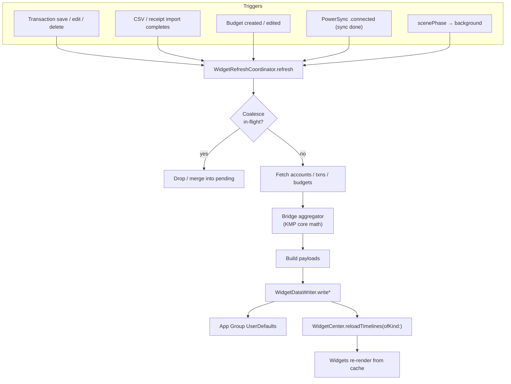
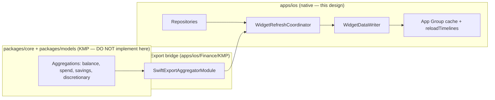

# iOS Widget Freshness Pipeline — Transaction Save & Sync

> A design for **when and how** the App Group widget cache is rebuilt and
> WidgetKit timelines are reloaded — so balance, budget, recent-transaction, and
> the new today-spend / fun-money widgets reflect a transaction the moment it is
> saved, imported, or synced, without thrashing WidgetKit's reload budget.

**Status:** PROPOSED — design only (native implementation buildable now; store distribution gated)
**Issue:** [#2585](https://github.com/jrmoulckers/finance/issues/2585) — Part of [#2159](https://github.com/jrmoulckers/finance/issues/2159)
**Platform:** iOS / iPadOS (Swift concurrency + WidgetKit, iOS 17+)
**Owner:** @ios-engineer
**Related:** [ios-today-spend-funmoney-widget.md](./ios-today-spend-funmoney-widget.md) · [ios-savings-rate-dashboard-card.md](./ios-savings-rate-dashboard-card.md) · [accessibility-patterns.md](./accessibility-patterns.md) · [data-visualization.md](./data-visualization.md) · [Human-Gated Prerequisites](../ops/human-gated-prerequisites.md)

---

## Table of Contents

1. [Goal & Scope](#1-goal--scope)
2. [Current State](#2-current-state)
3. [Architecture: WidgetRefreshCoordinator](#3-architecture-widgetrefreshcoordinator)
4. [Invalidation Flow](#4-invalidation-flow)
5. [Call Sites](#5-call-sites)
6. [Coalescing & Reload Budget](#6-coalescing--reload-budget)
7. [States: Empty, Stale, Offline & Error](#7-states-empty-stale-offline--error)
8. [Privacy & Logging](#8-privacy--logging)
9. [Accessibility Implications](#9-accessibility-implications)
10. [Native ↔ KMP Boundary](#10-native--kmp-boundary)
11. [Affected Surfaces & Shared Dependencies](#11-affected-surfaces--shared-dependencies)
12. [Test Plan (Smallest Tests First)](#12-test-plan-smallest-tests-first)
13. [Implementation Readiness](#13-implementation-readiness)
14. [Open Questions](#14-open-questions)

---

## 1. Goal & Scope

A widget is only as trustworthy as its freshest number. Today the
[`WidgetDataWriter`](../../apps/ios/Finance/Services/WidgetDataWriter.swift)
actor can _write_ the App Group cache and reload a timeline, but **nothing
calls it** on the data-mutating paths — so a user who logs a coffee sees a stale
balance widget until something else happens to trigger a write.

This design specifies the **freshness pipeline**: a single coordinator, the
exact **call sites** that invoke it (transaction save, import, sync completion,
app lifecycle, budget edits), the **cache-invalidation** rules, and the
**coalescing** that keeps reloads within WidgetKit's daily budget.

**In scope:**

- A `WidgetRefreshCoordinator` that recomputes every widget payload from the
  repositories + Swift Export aggregator and writes the App Group cache.
- The triggers/call sites and a debounce/coalescing policy.
- Empty / stale / offline / error behavior at the **data** layer (the visual
  states live in each widget's design).
- The `widget.todaySpend` / `widget.funMoney` keys from
  [ios-today-spend-funmoney-widget.md](./ios-today-spend-funmoney-widget.md).

**Out of scope:**

- Widget _visual_ design (owned per-widget) and the today-spend payload shape
  (defined in the companion doc).
- The aggregation **math** itself — sourced from KMP `packages/core` via the
  bridge ([§10](#10-native--kmp-boundary)).
- Background _network_ sync scheduling internals (PowerSync owns that); this doc
  only hooks the **completion** event.

---

## 2. Current State

Grounded in the repository as it stands:

- [`WidgetDataWriter`](../../apps/ios/Finance/Services/WidgetDataWriter.swift) is
  an `actor` with `writeBalance`, `writeTransactions`, `writeBudgets`, each of
  which encodes to `SharedConstants.sharedDefaults` and calls
  `WidgetCenter.shared.reloadTimelines(ofKind:)`. **It has no callers** outside
  its own file (verified by search).
- [`WidgetDataProvider`](../../apps/ios/FinanceWidget/WidgetDataProvider.swift)
  reads those keys cache-only and renders empty states when absent.
- The only timeline reloads that fire today are from
  [`WidgetPrivacyPrompt`](../../apps/ios/Finance/Services/WidgetPrivacyPrompt.swift)
  (after a masking choice) and the watchOS app — **not** from data mutations.
- [`DashboardViewModel`](../../apps/ios/Finance/ViewModels/DashboardViewModel.swift)
  already recomputes balances, monthly income/expense, and savings rate via the
  bridge aggregator — the same inputs the widget cache needs.
- [`TransactionCreateViewModel.save()`](../../apps/ios/Finance/ViewModels/TransactionCreateViewModel.swift)
  persists via `TransactionRepository` and returns success — the natural hook
  for a post-save refresh.
- [`PowerSyncManager`](../../apps/ios/Finance/Services/PowerSyncManager.swift)
  exposes `observeSyncStatus()` and transitions to `.connected` after
  `syncNow()` / `processOfflineQueue()` — the natural hook for a post-sync
  refresh.

**Conclusion:** the write primitive exists; this design supplies the missing
_orchestration_ and _invalidation_.

---

## 3. Architecture: WidgetRefreshCoordinator

Introduce a small `actor WidgetRefreshCoordinator` (Sendable, `SWIFT_STRICT_CONCURRENCY = complete`)
that owns the rebuild-and-reload cycle. It does **not** duplicate math — it asks
the repositories and the bridge aggregator, then hands plain payloads to
`WidgetDataWriter`.

```text
actor WidgetRefreshCoordinator {
  static let shared
  // Dependencies injected: AccountRepository, TransactionRepository,
  // BudgetRepository, SwiftExportAggregatorModule, WidgetDataWriter

  func refresh(reason: RefreshReason) async   // coalesced entry point
}

enum RefreshReason: String, Sendable {         // for os.Logger (.public)
  case transactionSaved, transactionDeleted, importCompleted,
       syncCompleted, budgetChanged, appBackgrounded, manual
}
```

Responsibilities:

1. **Fetch** the same inputs the dashboard uses (accounts, recent transactions,
   budgets) from the repositories.
2. **Compute** payloads via the bridge: balance/trend, top budgets + rollup,
   recent transactions, and (per the companion doc) today spend + fun money.
3. **Write** each payload through `WidgetDataWriter`, which already reloads the
   matching timeline kind.
4. **Coalesce** rapid successive calls ([§6](#6-coalescing--reload-budget)).

Keeping this in an actor guarantees serialized writes to the shared
`UserDefaults` and a single in-flight rebuild, avoiding interleaved partial
caches.

---

## 4. Invalidation Flow



Invalidation is **write-through**: every refresh rewrites the full set of keys
(or the affected subset) and reloads only the matching kinds. There is no
partial/dirty-flag cache to get out of sync — the cache is always a projection
of current repository state at `updatedAt`.

---

## 5. Call Sites

| #   | Call site                                                                                                         | Trigger                  | Reload kinds                                         |
| --- | ----------------------------------------------------------------------------------------------------------------- | ------------------------ | ---------------------------------------------------- |
| 1   | [`TransactionCreateViewModel.save()`](../../apps/ios/Finance/ViewModels/TransactionCreateViewModel.swift) success | create / update          | balance, transactions, budgets, todaySpend, funMoney |
| 2   | Transaction delete (edit/detail VM)                                                                               | delete                   | same as above                                        |
| 3   | Import completion (CSV / receipt scan)                                                                            | batch insert done        | all                                                  |
| 4   | [`PowerSyncManager.observeSyncStatus()`](../../apps/ios/Finance/Services/PowerSyncManager.swift) → `.connected`   | remote pull/push applied | all                                                  |
| 5   | Budget create/edit (`BudgetCreateViewModel`)                                                                      | budget mutation          | budgets, funMoney                                    |
| 6   | App `scenePhase` → `.background`                                                                                  | leaving foreground       | all (one final coalesced refresh)                    |

Wiring rules:

- View models call `await WidgetRefreshCoordinator.shared.refresh(reason:)`
  **after** the repository write succeeds (so the cache reflects committed
  state), not before. Failures do **not** refresh (avoids writing a half-applied
  cache).
- The sync hook subscribes once at app start to `observeSyncStatus()` and calls
  `refresh(reason: .syncCompleted)` on each transition into `.connected` (and on
  a successful `syncNow()` result), letting remote changes land in widgets.
- The `scenePhase` hook ensures the cache is current before the app is
  suspended, the most common moment a user then glances at a widget.

---

## 6. Coalescing & Reload Budget

WidgetKit budgets timeline reloads (roughly dozens per widget per day); bulk
imports or a sync that touches many rows must **not** issue one reload per row.

- **Single in-flight rebuild:** the actor holds an `isRefreshing` flag; calls
  arriving during a rebuild set a `pendingReason` rather than starting a second
  pass. When the current pass finishes, exactly one follow-up runs if a request
  arrived meanwhile.
- **Debounce window:** coalesce bursts within a short window (e.g. 1–2 s) so a
  multi-step save (transaction + tags + categorization learn) yields one reload.
- **Per-kind targeting:** always `reloadTimelines(ofKind:)`, never
  `reloadAllTimelines()` from the host app, so unaffected widgets keep their
  budget. (The watch app's `reloadAllTimelines()` stays watch-scoped.)
- **Import path:** import calls `refresh(reason: .importCompleted)` **once** at
  the end of the batch, not per inserted row.

> These are policy, not premature optimization: WidgetKit silently drops reloads
> once the budget is spent, which would otherwise present as "my widget is
> stale" bugs.

---

## 7. States: Empty, Stale, Offline & Error

| Condition   | Coordinator behavior                                                                                                                                                                                                |
| ----------- | ------------------------------------------------------------------------------------------------------------------------------------------------------------------------------------------------------------------- |
| **Empty**   | When repositories return no data, write **empty** payloads (e.g. `[]`, zeroed balance) so widgets show their _empty_ state — never leave a stale non-empty cache behind.                                            |
| **Stale**   | Every payload carries `updatedAt`; widgets render an "Updated {relative}" note past a threshold (see companion docs). The coordinator's job is simply to keep `updatedAt` current.                                  |
| **Offline** | Saves still write locally (offline-first), so the coordinator refreshes from the **local** repository immediately; the later `.syncCompleted` hook reconciles when connectivity returns. No spinner, no failure.    |
| **Error**   | Encode failure is logged (`os.Logger`, `.public` keys only) and the prior cache is left intact — a known-good stale value beats a blank one. Repository read failure aborts the refresh without clearing the cache. |

---

## 8. Privacy & Logging

- The cache stores **integer minor units** and identifiers only — the same shape
  `WidgetDataWriter` already persists. Masking is applied at _render_ time by
  `WidgetMoneyFormatter`, never at write time, so the privacy mode can change
  without rewriting the cache.
- **No financial values in logs.** Following the repo's `os.Logger` convention,
  log only the `RefreshReason` (`privacy: .public`) and counts — never payee,
  amount, or balance. Mirror the existing
  [`DashboardViewModel`](../../apps/ios/Finance/ViewModels/DashboardViewModel.swift)
  logging (`error.localizedDescription, privacy: .public`).
- App Group access uses `SharedConstants.appGroupIdentifier`; no secrets are
  written to the App Group — tokens remain in the Keychain, never in widget
  storage.

---

## 9. Accessibility Implications

This pipeline has no UI of its own, but it underpins the accessibility of every
widget it feeds:

- The "Updated {relative}" stale caption that VoiceOver reads is only accurate
  if the coordinator keeps `updatedAt` fresh — so freshness is an accessibility
  concern, not just a visual one.
- By guaranteeing the cache reflects committed state, it prevents VoiceOver from
  announcing an amount that no longer matches the app — a correctness/trust issue
  for non-visual users.
- No animation or motion is introduced, so [Reduce Motion](./accessibility-patterns.md#61-reduced-motion-support)
  is unaffected; widgets render statically from the cache.

---

## 10. Native ↔ KMP Boundary



- All **arithmetic** (totals, savings rate, today spend, discretionary headroom)
  comes from KMP `packages/core` through the existing
  [`SwiftExportAggregatorModule`](../../apps/ios/Finance/KMP/SwiftExportBridge.swift).
  The coordinator **composes** these results into payloads; it does not compute
  money itself.
- The coordinator, `WidgetDataWriter`, App Group plumbing, coalescing, and reload
  scheduling are **iOS-only** concerns.
- Any _new_ shared aggregation (e.g. day-windowed spend) is proposed to
  @kmp-engineer via ADR — not added in this iOS work.

---

## 11. Affected Surfaces & Shared Dependencies

**New (this design):**

- `apps/ios/Finance/Services/WidgetRefreshCoordinator.swift` — the orchestrator.

**Touched (call-site wiring):**

- `TransactionCreateViewModel`, the transaction edit/detail delete path,
  `BudgetCreateViewModel`, the import flow, and the app's `scenePhase`/sync-status
  subscription — each gains a single `await … refresh(reason:)` call.
- [`WidgetDataWriter`](../../apps/ios/Finance/Services/WidgetDataWriter.swift) —
  gains `writeTodaySpend` / `writeFunMoney` (defined in the companion doc).

**Reused unchanged:**

- [`WidgetDataProvider`](../../apps/ios/FinanceWidget/WidgetDataProvider.swift),
  `SharedConstants`, `WidgetPrivacy.swift`, `PowerSyncManager.observeSyncStatus()`.

**Shared dependency:** KMP `packages/core` aggregations via the Swift Export
bridge ([§10](#10-native--kmp-boundary)).

---

## 12. Test Plan (Smallest Tests First)

1. **Coalescing (Swift unit):** fire N rapid `refresh()` calls; assert exactly
   one rebuild runs and at most one follow-up — using a fake `WidgetDataWriter`
   that counts `reloadTimelines` invocations.
2. **Write-through on save (Swift unit):** stub repositories + bridge; after
   `refresh(reason: .transactionSaved)`, assert the App Group keys decode to the
   expected payloads (balance, budgets, transactions) with a current `updatedAt`.
3. **Empty projection (Swift unit):** with empty repositories, assert the cache
   is written as empty (`[]` / zeroed) — not left stale.
4. **Failure does not clobber (Swift unit):** a repository read error leaves the
   previously cached values intact and logs the reason.
5. **Sync hook (Swift unit):** feed a fake `observeSyncStatus()` stream that
   yields `.connected`; assert `refresh(reason: .syncCompleted)` runs once per
   transition.
6. **Per-kind targeting (Swift unit):** assert the writer reloads only the kinds
   whose payloads changed (no `reloadAllTimelines` from the host).
7. **Lifecycle (XCUITest, smallest):** background the app after a save; relaunch
   and assert the cache timestamp advanced (integration smoke).
8. **Shared (KMP, owned by @kmp-engineer):** aggregation correctness is tested in
   `packages/core`, not iOS.

---

## 13. Implementation Readiness

See [Human-Gated Prerequisites](../ops/human-gated-prerequisites.md).

**Buildable now (no paid enrollment) — free Personal Team signing:**

- App Groups, `UserDefaults(suiteName:)`, `WidgetCenter.reloadTimelines`, actor
  concurrency, and all the call-site wiring run on a device under a **free Apple
  ID** (Personal Team). No paid entitlement is required to verify the freshness
  loop end to end locally.
- Every test in [§12](#12-test-plan-smallest-tests-first) runs without enrollment.

**Distribution tail — gated by [#1239](https://github.com/jrmoulckers/finance/issues/1239):**

- Only App Store / TestFlight distribution of the app+widget bundle is gated.
  The pipeline itself uses no paid entitlement (Background App Refresh and
  WidgetKit reloads work under free signing for local testing).
- Add a `## Needs Human Action` note on the PR pointing at
  [§3.2 of the prerequisites runbook](../ops/human-gated-prerequisites.md#32-ios-distribution--apple-developer-1239)
  for the distribution criterion only.

---

## 14. Open Questions

1. **Debounce window:** confirm 1–2 s is right for the busiest path (bulk import)
   vs perceived latency on a single save.
2. **Delete path location:** does delete live in `TransactionEditViewModel`,
   `TransactionsViewModel`, or both? Wire the coordinator wherever the repository
   delete is awaited.
3. **Sync granularity:** should a `.connected` transition with zero applied
   changes still refresh? Default: yes, it's cheap after coalescing, but could be
   gated on `changesApplied > 0` from `KMPSyncResult`.
4. **BGTask refresh:** should a periodic `BGAppRefreshTask` also call the
   coordinator for users who rarely open the app? Tracked separately under #2159.
