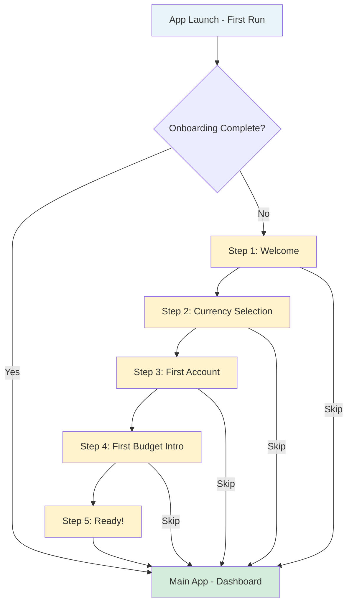
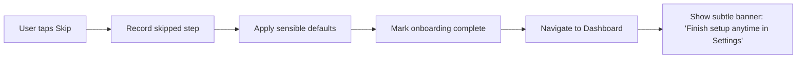
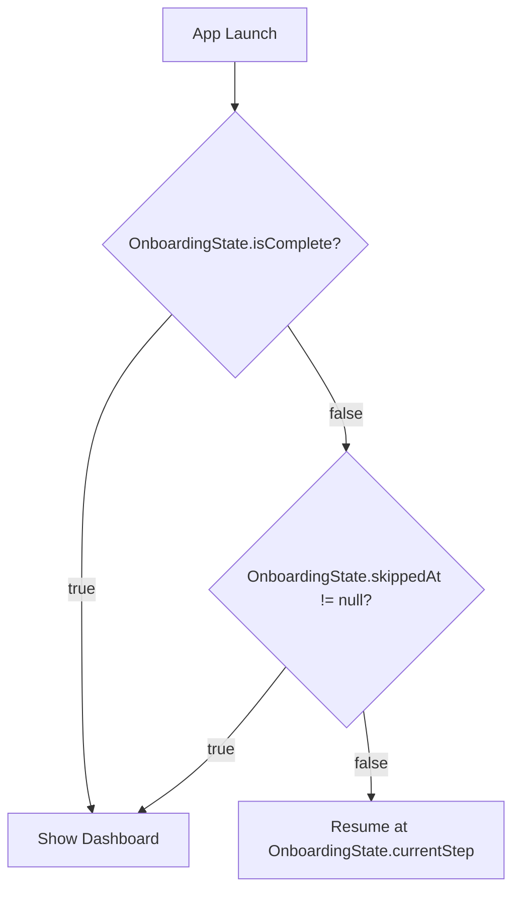

# Onboarding Strategy — Finance

> **Status:** DRAFT — Pending human review
> **Last Updated:** 2025-07-19
> **Purpose:** Per-platform onboarding design covering shared logic, native patterns, skip/resume behavior, and analytics
> **Related Issues:** #81
> **Related Features:** ONB-001 (Welcome Flow), ONB-002 (Guided First Budget), TIER-001 (Expertise Tiers)
> **Related Docs:** [UX Principles](../design/ux-principles.md), [Information Architecture](../design/information-architecture.md), [Personas](../design/personas.md)

---

## Table of Contents

- [Design Philosophy](#design-philosophy)
- [Onboarding Flow Overview](#onboarding-flow-overview)
- [Shared Onboarding Logic (KMP)](#shared-onboarding-logic-kmp)
- [Android: Material 3 Onboarding](#android-material-3-onboarding)
- [iOS: SwiftUI Onboarding](#ios-swiftui-onboarding)
- [Web: Progressive Disclosure](#web-progressive-disclosure)
- [Windows: Desktop Wizard](#windows-desktop-wizard)
- [Skip and Resume Logic](#skip-and-resume-logic)
- [Analytics Events for Funnel Tracking](#analytics-events-for-funnel-tracking)
- [Accessibility Requirements](#accessibility-requirements)
- [Testing Strategy](#testing-strategy)

---

## Design Philosophy

Onboarding in Finance follows three core UX principles:

1. **Clarity Over Completeness** (Principle 1) — Show only what the user needs right now. No "set up everything before you begin" flows.
2. **Non-Judgmental Finance** (Principle 3) — Warm, encouraging language. No pressure. No shame about current financial state.
3. **Accessibility as Foundation** (Principle 4) — Every onboarding screen is fully accessible from day one, not retrofitted later.

**Anti-pattern from UX Principles:** ❌ _"Complex onboarding (no 'enter all your accounts before you can start')"_ — Finance explicitly rejects onboarding that blocks the user from exploring the app.

### Core Constraints

- **Maximum 5 screens** (per ONB-001 acceptance criteria)
- **Skippable at every step** — user can exit onboarding and reach the main app immediately
- **No sign-up required** to start — authentication is deferred until sync is needed
- **Resumable** — if user skips or closes mid-flow, onboarding resumes where they left off
- **Under 60 seconds** — the full onboarding flow should complete in under a minute

---

## Onboarding Flow Overview



### Step Definitions

| Step | Screen             | Purpose                                                | Required Input                                                     | Skippable               |
| ---- | ------------------ | ------------------------------------------------------ | ------------------------------------------------------------------ | ----------------------- |
| 1    | Welcome            | Set tone, explain value proposition                    | None                                                               | ✅                      |
| 2    | Currency Selection | Set default currency for display and accounts          | Currency picker (default: device locale)                           | ✅ (defaults to locale) |
| 3    | First Account      | Create first tracking account                          | Name + initial balance (minimal)                                   | ✅                      |
| 4    | First Budget Intro | Explain envelope budgeting concept, offer guided setup | Goal selection (save more / track spending / budget / reduce debt) | ✅                      |
| 5    | Ready              | Celebrate, show quick tips, transition to dashboard    | None (tap to continue)                                             | Auto-advances           |

---

## Shared Onboarding Logic (KMP)

All onboarding state management and business logic lives in **`packages/core`** as Kotlin Multiplatform (KMP) code, shared across all platforms. Platform UI layers consume this shared logic.

### Onboarding State Model

```kotlin
// packages/core/src/commonMain/kotlin/com/finance/core/onboarding/

/**
 * Represents the current state of the onboarding flow.
 * Persisted via Multiplatform Settings (key-value store).
 */
data class OnboardingState(
    val currentStep: OnboardingStep = OnboardingStep.WELCOME,
    val isComplete: Boolean = false,
    val selectedCurrency: String? = null,       // ISO 4217 code
    val firstAccountCreated: Boolean = false,
    val firstBudgetStarted: Boolean = false,
    val selectedGoals: Set<FinancialGoal> = emptySet(),
    val skippedAt: OnboardingStep? = null,
    val startedAt: Long = 0L,                   // epoch millis
    val completedAt: Long? = null
)

enum class OnboardingStep(val index: Int) {
    WELCOME(0),
    CURRENCY_SELECTION(1),
    FIRST_ACCOUNT(2),
    FIRST_BUDGET(3),
    READY(4);

    fun next(): OnboardingStep? = entries.getOrNull(index + 1)
    fun previous(): OnboardingStep? = entries.getOrNull(index - 1)
}

enum class FinancialGoal {
    SAVE_MORE,
    TRACK_SPENDING,
    BUDGET,
    REDUCE_DEBT
}
```

### Onboarding Manager Interface

```kotlin
/**
 * Manages onboarding flow state. Platform UI layers call these
 * methods; the manager handles persistence and analytics events.
 */
interface OnboardingManager {
    /** Current onboarding state (observable by platform UI) */
    val state: OnboardingState

    /** Check if onboarding should be shown */
    fun shouldShowOnboarding(): Boolean

    /** Advance to the next step */
    fun advanceStep()

    /** Go back to the previous step */
    fun goBack()

    /** Skip onboarding entirely from the current step */
    fun skip()

    /** Complete a specific step's action */
    fun completeStepAction(step: OnboardingStep, data: Map<String, Any> = emptyMap())

    /** Mark onboarding as fully complete */
    fun markComplete()

    /** Reset onboarding (for testing or re-onboarding) */
    fun reset()
}
```

### Currency Selection Logic

```kotlin
/**
 * Determine the default currency based on device locale.
 * Falls back to USD if locale currency is not in our supported list.
 */
fun defaultCurrencyForLocale(localeTag: String): String {
    val localeToCurrency = mapOf(
        "en-US" to "USD", "en-GB" to "GBP", "en-CA" to "CAD",
        "en-AU" to "AUD", "de-DE" to "EUR", "fr-FR" to "EUR",
        "ja-JP" to "JPY", "ko-KR" to "KRW", "zh-CN" to "CNY",
        "pt-BR" to "BRL", "es-MX" to "MXN", "hi-IN" to "INR"
        // ... expanded list in implementation
    )
    return localeToCurrency[localeTag]
        ?: localeToCurrency[localeTag.substringBefore("-")]
        ?: "USD"
}
```

### First Account Creation

The first account is created locally in SQLite via the existing account model. Minimal required fields:

| Field           | Required | Default                               |
| --------------- | -------- | ------------------------------------- |
| Name            | ✅       | "Checking" (suggestion, editable)     |
| Type            | ✅       | `CHECKING` (pre-selected, changeable) |
| Initial balance | ✅       | `0` (user enters amount)              |
| Currency        | Auto     | From Step 2 selection                 |
| Icon            | Auto     | Based on account type                 |

### First Budget Introduction

Step 4 does **not** create a full budget — it introduces the concept and captures the user's financial goals. The full budget setup (ONB-002: Guided First Budget) is triggered later from the Budget tab when the user is ready.

**Goal selection drives personalization:**

| Selected Goal  | Impact on App                                                |
| -------------- | ------------------------------------------------------------ |
| Save more      | Highlight savings rate on dashboard, suggest savings goal    |
| Track spending | Emphasize transaction entry, show category breakdown         |
| Budget         | Prompt for budget setup sooner, show "To Budget" prominently |
| Reduce debt    | Show debt payoff projections, suggest debt account type      |

---

## Android: Material 3 Onboarding

### Pattern: ViewPager2 with Material 3 Components

Android onboarding uses a `ViewPager2` (horizontal paging) styled with Material 3 design language.

```
┌──────────────────────────────────┐
│          [Status Bar]            │
│                                  │
│                                  │
│       🎉 Welcome to Finance     │
│                                  │
│    Take control of your money    │
│    with clarity, not complexity  │
│                                  │
│         [Illustration]           │
│                                  │
│                                  │
│         ● ○ ○ ○ ○               │  ← Page indicators
│                                  │
│    ┌──────────────────────┐      │
│    │     Get Started      │      │  ← Primary button (FilledButton)
│    └──────────────────────┘      │
│          Skip                    │  ← Text button
│                                  │
└──────────────────────────────────┘
```

### Implementation Details

| Component          | Material 3 Element                                                          |
| ------------------ | --------------------------------------------------------------------------- |
| Container          | `ViewPager2` with `FragmentStateAdapter` (or Compose `HorizontalPager`)     |
| Page indicators    | `TabLayout` with dot indicators, or Compose `HorizontalPagerIndicator`      |
| Primary action     | `FilledButton` ("Next" / "Get Started" / "Done")                            |
| Skip action        | `TextButton` ("Skip") — always visible, top-right or bottom                 |
| Currency picker    | `ExposedDropdownMenu` with search/filter                                    |
| Account name input | `OutlinedTextField` with character counter                                  |
| Balance input      | Custom numeric keypad or `OutlinedTextField` with `inputType=numberDecimal` |
| Goal selection     | `FilterChip` group (multi-select)                                           |
| Illustrations      | Vector drawables, respect `reducedMotion` accessibility setting             |

### Compose Implementation (Preferred)

```kotlin
// apps/android/src/main/kotlin/com/finance/android/onboarding/

@OptIn(ExperimentalFoundationApi::class)
@Composable
fun OnboardingScreen(
    state: OnboardingState,
    onAdvance: () -> Unit,
    onSkip: () -> Unit,
    onAction: (OnboardingStep, Map<String, Any>) -> Unit
) {
    val pagerState = rememberPagerState(
        initialPage = state.currentStep.index,
        pageCount = { OnboardingStep.entries.size }
    )

    Column(modifier = Modifier.fillMaxSize()) {
        // Skip button — top right
        Row(
            modifier = Modifier.fillMaxWidth().padding(16.dp),
            horizontalArrangement = Arrangement.End
        ) {
            TextButton(onClick = onSkip) {
                Text("Skip")
            }
        }

        // Pager content
        HorizontalPager(
            state = pagerState,
            modifier = Modifier.weight(1f)
        ) { page ->
            when (OnboardingStep.entries[page]) {
                OnboardingStep.WELCOME -> WelcomePage()
                OnboardingStep.CURRENCY_SELECTION -> CurrencyPage(onAction)
                OnboardingStep.FIRST_ACCOUNT -> AccountPage(onAction)
                OnboardingStep.FIRST_BUDGET -> BudgetIntroPage(onAction)
                OnboardingStep.READY -> ReadyPage()
            }
        }

        // Page indicators
        HorizontalPagerIndicator(
            pagerState = pagerState,
            modifier = Modifier.align(Alignment.CenterHorizontally).padding(16.dp),
            activeColor = MaterialTheme.colorScheme.primary,
            inactiveColor = MaterialTheme.colorScheme.outlineVariant
        )

        // Primary action button
        FilledButton(
            onClick = onAdvance,
            modifier = Modifier.fillMaxWidth().padding(horizontal = 24.dp, vertical = 16.dp)
        ) {
            Text(if (pagerState.currentPage == OnboardingStep.READY.index) "Let's Go!" else "Next")
        }
    }
}
```

### Android-Specific Considerations

- **Dynamic color:** Onboarding inherits the device's Material You dynamic color scheme
- **Back gesture:** System back navigates to previous onboarding step (not exit)
- **Predictive back:** Support the predictive back animation (Android 14+)
- **Landscape:** Onboarding screens adapt to landscape (side-by-side illustration + content)
- **Tablets:** Multi-column layout on tablets (illustration left, content right)
- **Font scaling:** All text respects system font size settings
- **TalkBack:** Every element has content descriptions; page transitions are announced

---

## iOS: SwiftUI Onboarding

### Pattern: TabView with PageTabViewStyle

iOS onboarding uses SwiftUI's `TabView` with `.tabViewStyle(.page)` for native paging behavior with built-in page indicators.

```
┌──────────────────────────────────┐
│ ┌──┐                     Skip   │  ← Navigation bar
│ └──┘                             │
│                                  │
│       🎉 Welcome to Finance     │
│                                  │
│    Take control of your money    │
│    with clarity, not complexity  │
│                                  │
│         [Illustration]           │
│                                  │
│                                  │
│         ● ○ ○ ○ ○               │  ← Native page control
│                                  │
│    ┌──────────────────────┐      │
│    │     Get Started      │      │  ← Prominent button
│    └──────────────────────┘      │
│                                  │
└──────────────────────────────────┘
```

### SwiftUI Implementation

```swift
// apps/ios/Sources/Onboarding/

struct OnboardingView: View {
    @StateObject private var viewModel: OnboardingViewModel
    @State private var currentPage: Int = 0

    var body: some View {
        VStack {
            // Skip button
            HStack {
                Spacer()
                Button("Skip") {
                    viewModel.skip()
                }
                .font(.body)
                .foregroundStyle(.secondary)
                .padding()
            }

            // Paged content
            TabView(selection: $currentPage) {
                WelcomePageView()
                    .tag(0)
                CurrencySelectionView(viewModel: viewModel)
                    .tag(1)
                FirstAccountView(viewModel: viewModel)
                    .tag(2)
                BudgetIntroView(viewModel: viewModel)
                    .tag(3)
                ReadyView()
                    .tag(4)
            }
            .tabViewStyle(.page(indexDisplayMode: .always))
            .indexViewStyle(.page(backgroundDisplayMode: .always))

            // Primary action
            Button(action: {
                withAnimation {
                    viewModel.advanceStep()
                    currentPage = viewModel.state.currentStep.index
                }
            }) {
                Text(currentPage == 4 ? "Let's Go!" : "Next")
                    .frame(maxWidth: .infinity)
            }
            .buttonStyle(.borderedProminent)
            .controlSize(.large)
            .padding(.horizontal, 24)
            .padding(.bottom, 32)
        }
    }
}
```

### iOS-Specific Considerations

- **Dynamic Type:** All text uses semantic font styles (`.title`, `.body`, `.caption`) for automatic scaling
- **SF Symbols:** Icons use SF Symbols (e.g., `dollarsign.circle`, `chart.bar`, `checkmark.circle.fill`)
- **VoiceOver:** Every onboarding screen is tested with VoiceOver; page transitions announce "Page X of 5"
- **Reduced motion:** When `UIAccessibility.isReduceMotionEnabled`, page transitions use dissolve instead of slide
- **iPad layout:** On iPad, onboarding uses a centered card layout (max width 600pt) to avoid stretched content
- **Mac Catalyst / Designed for iPad:** Same onboarding, keyboard shortcuts for "Next" (Return key) and "Skip" (Esc key)
- **Haptics:** Light haptic feedback on step completion (`UIImpactFeedbackGenerator(.light)`)
- **Swipe gestures:** Native `TabView` paging gesture works by default; custom gesture for skip

### ViewModel Bridge (KMP → SwiftUI)

```swift
/// Bridges the KMP OnboardingManager to SwiftUI's ObservableObject pattern.
@MainActor
final class OnboardingViewModel: ObservableObject {
    @Published var state: OnboardingState

    private let manager: OnboardingManager  // KMP shared instance

    init(manager: OnboardingManager) {
        self.manager = manager
        self.state = manager.state
    }

    func advanceStep() {
        manager.advanceStep()
        state = manager.state
    }

    func skip() {
        manager.skip()
        state = manager.state
    }

    func selectCurrency(_ code: String) {
        manager.completeStepAction(
            step: .currencySelection,
            data: ["currency": code]
        )
        state = manager.state
    }
}
```

---

## Web: Progressive Disclosure

### Pattern: Progressive Disclosure with localStorage State

The web onboarding uses a progressive disclosure pattern — steps are revealed one at a time in a focused, centered layout. This avoids the "page swipe" paradigm that feels less natural on desktop browsers.

```
┌──────────────────────────────────────────────────────────────┐
│  Finance                                              Skip →  │
├──────────────────────────────────────────────────────────────┤
│                                                              │
│                    ● ● ○ ○ ○                                │
│                                                              │
│  ┌────────────────────────────────────────────────────────┐  │
│  │                                                        │  │
│  │           💰 What currency do you use?                 │  │
│  │                                                        │  │
│  │    ┌──────────────────────────────────────────┐        │  │
│  │    │  🔍 Search currencies...                 │        │  │
│  │    ├──────────────────────────────────────────┤        │  │
│  │    │  🇺🇸 USD — US Dollar              ✓     │        │  │
│  │    │  🇬🇧 GBP — British Pound                │        │  │
│  │    │  🇪🇺 EUR — Euro                         │        │  │
│  │    │  🇯🇵 JPY — Japanese Yen                 │        │  │
│  │    └──────────────────────────────────────────┘        │  │
│  │                                                        │  │
│  │              [ ← Back ]    [ Next → ]                  │  │
│  │                                                        │  │
│  └────────────────────────────────────────────────────────┘  │
│                                                              │
└──────────────────────────────────────────────────────────────┘
```

### Implementation Details

| Aspect             | Implementation                                                               |
| ------------------ | ---------------------------------------------------------------------------- |
| State storage      | `localStorage` key: `finance_onboarding_state` (JSON)                        |
| Step rendering     | React component per step, conditional rendering based on state               |
| Navigation         | Back/Next buttons + keyboard shortcuts (← → arrows, Enter, Esc)              |
| Progress indicator | Step dots or progress bar at top                                             |
| Animation          | CSS transitions (`opacity`, `transform`) — respects `prefers-reduced-motion` |
| Responsive         | Mobile: full-screen steps; Desktop: centered card (max-width 560px)          |

### React Component Structure

```tsx
// apps/web/src/components/onboarding/

interface OnboardingProps {
  onComplete: () => void;
}

export function Onboarding({ onComplete }: OnboardingProps) {
  const [state, dispatch] = useOnboardingState(); // Custom hook backed by localStorage

  if (state.isComplete) {
    onComplete();
    return null;
  }

  const steps: Record<OnboardingStep, React.ReactNode> = {
    welcome: <WelcomeStep />,
    currency: <CurrencyStep onSelect={(code) => dispatch({ type: 'SET_CURRENCY', code })} />,
    account: <AccountStep onSubmit={(data) => dispatch({ type: 'CREATE_ACCOUNT', data })} />,
    budget: <BudgetIntroStep onSelect={(goals) => dispatch({ type: 'SET_GOALS', goals })} />,
    ready: <ReadyStep />,
  };

  return (
    <div className="onboarding" role="main" aria-label="Welcome setup">
      <div className="onboarding__header">
        <StepIndicator current={state.currentStep} total={5} />
        <button
          className="onboarding__skip"
          onClick={() => dispatch({ type: 'SKIP' })}
          aria-label="Skip onboarding setup"
        >
          Skip
        </button>
      </div>

      <div className="onboarding__content" aria-live="polite">
        {steps[state.currentStep]}
      </div>

      <div className="onboarding__actions">
        {state.currentStep !== 'welcome' && (
          <button onClick={() => dispatch({ type: 'BACK' })}>← Back</button>
        )}
        <button className="onboarding__next" onClick={() => dispatch({ type: 'NEXT' })}>
          {state.currentStep === 'ready' ? "Let's Go!" : 'Next →'}
        </button>
      </div>
    </div>
  );
}
```

### localStorage Onboarding State

```typescript
// apps/web/src/hooks/useOnboardingState.ts

const STORAGE_KEY = 'finance_onboarding_state';

interface WebOnboardingState {
  currentStep: OnboardingStep;
  isComplete: boolean;
  selectedCurrency: string | null;
  firstAccountCreated: boolean;
  selectedGoals: string[];
  skippedAt: OnboardingStep | null;
  startedAt: number;
  completedAt: number | null;
}

function loadState(): WebOnboardingState {
  try {
    const stored = localStorage.getItem(STORAGE_KEY);
    if (stored) return JSON.parse(stored);
  } catch {
    // Corrupted or unavailable — start fresh
  }
  return {
    currentStep: 'welcome',
    isComplete: false,
    selectedCurrency: null,
    firstAccountCreated: false,
    selectedGoals: [],
    skippedAt: null,
    startedAt: Date.now(),
    completedAt: null,
  };
}

function saveState(state: WebOnboardingState): void {
  try {
    localStorage.setItem(STORAGE_KEY, JSON.stringify(state));
  } catch {
    // localStorage full or unavailable — continue without persistence
  }
}
```

### Web-Specific Considerations

- **Keyboard navigation:** Full keyboard support — Tab between elements, Enter to confirm, Escape to skip
- **Focus management:** Focus moves to the step heading when navigating between steps
- **Screen readers:** `aria-live="polite"` on content area announces step changes
- **`prefers-reduced-motion`:** CSS transitions disabled when user prefers reduced motion
- **`prefers-color-scheme`:** Onboarding respects system dark/light preference
- **Mobile web:** Onboarding fills the viewport on narrow screens, no horizontal scrolling
- **No-JS fallback:** If JavaScript fails to load, the app should not show a blank screen — consider a `<noscript>` message
- **Privacy:** Onboarding state in `localStorage` contains no sensitive data (no financial amounts, no PII)

---

## Windows: Desktop Wizard

### Pattern: Sidebar-Step Wizard

Windows onboarding uses a desktop-optimized wizard with a persistent sidebar showing all steps. This pattern leverages the wider screen real estate and matches common Windows setup experiences.

```
┌──────────────────────────────────────────────────────────────────┐
│  Finance — Setup                                           ✕    │
├────────────────┬─────────────────────────────────────────────────┤
│                │                                                 │
│  Steps         │          💰 Select Your Currency                │
│  ─────         │                                                 │
│  ✓ Welcome     │    Choose the currency you use most often.      │
│  ● Currency  ← │    This will be the default for new accounts.   │
│  ○ Account     │                                                 │
│  ○ Budget      │    ┌────────────────────────────────────┐       │
│  ○ Ready       │    │  🔍 Search currencies...           │       │
│                │    ├────────────────────────────────────┤       │
│                │    │  🇺🇸 USD — US Dollar          ✓   │       │
│                │    │  🇬🇧 GBP — British Pound          │       │
│                │    │  🇪🇺 EUR — Euro                   │       │
│                │    │  🇯🇵 JPY — Japanese Yen           │       │
│                │    └────────────────────────────────────┘       │
│                │                                                 │
│                │                    [ ← Back ]  [ Next → ]       │
│                │                                                 │
│  ──────        │                                                 │
│  [Skip Setup]  │                                                 │
│                │                                                 │
├────────────────┴─────────────────────────────────────────────────┤
│  Step 2 of 5                                                     │
└──────────────────────────────────────────────────────────────────┘
```

### Compose Desktop Implementation

```kotlin
// apps/windows/src/main/kotlin/com/finance/windows/onboarding/

@Composable
fun OnboardingWizard(
    state: OnboardingState,
    onAdvance: () -> Unit,
    onGoBack: () -> Unit,
    onSkip: () -> Unit,
    onAction: (OnboardingStep, Map<String, Any>) -> Unit
) {
    Row(modifier = Modifier.fillMaxSize()) {
        // Sidebar — step list
        OnboardingSidebar(
            currentStep = state.currentStep,
            completedSteps = state.completedSteps(),
            onSkip = onSkip,
            modifier = Modifier.width(220.dp).fillMaxHeight()
        )

        Divider(modifier = Modifier.fillMaxHeight().width(1.dp))

        // Main content area
        Column(
            modifier = Modifier.weight(1f).fillMaxHeight().padding(32.dp),
            verticalArrangement = Arrangement.SpaceBetween
        ) {
            // Step content
            Box(modifier = Modifier.weight(1f)) {
                when (state.currentStep) {
                    OnboardingStep.WELCOME -> WelcomeContent()
                    OnboardingStep.CURRENCY_SELECTION -> CurrencyContent(onAction)
                    OnboardingStep.FIRST_ACCOUNT -> AccountContent(onAction)
                    OnboardingStep.FIRST_BUDGET -> BudgetIntroContent(onAction)
                    OnboardingStep.READY -> ReadyContent()
                }
            }

            // Navigation buttons
            Row(
                modifier = Modifier.fillMaxWidth(),
                horizontalArrangement = Arrangement.End,
                verticalAlignment = Alignment.CenterVertically
            ) {
                if (state.currentStep != OnboardingStep.WELCOME) {
                    OutlinedButton(onClick = onGoBack) {
                        Text("← Back")
                    }
                    Spacer(modifier = Modifier.width(12.dp))
                }
                Button(onClick = onAdvance) {
                    Text(
                        if (state.currentStep == OnboardingStep.READY) "Let's Go!"
                        else "Next →"
                    )
                }
            }
        }
    }
}

@Composable
private fun OnboardingSidebar(
    currentStep: OnboardingStep,
    completedSteps: Set<OnboardingStep>,
    onSkip: () -> Unit,
    modifier: Modifier = Modifier
) {
    Column(
        modifier = modifier.background(MaterialTheme.colorScheme.surfaceVariant).padding(16.dp),
        verticalArrangement = Arrangement.SpaceBetween
    ) {
        Column {
            Text("Steps", style = MaterialTheme.typography.titleMedium)
            Spacer(modifier = Modifier.height(16.dp))

            OnboardingStep.entries.forEach { step ->
                StepItem(
                    label = step.displayName(),
                    state = when {
                        step in completedSteps -> StepState.COMPLETED
                        step == currentStep -> StepState.CURRENT
                        else -> StepState.PENDING
                    }
                )
            }
        }

        TextButton(onClick = onSkip) {
            Text("Skip Setup")
        }
    }
}
```

### Windows-Specific Considerations

- **Window size:** Onboarding wizard has a minimum window size of 800 × 600 px
- **Keyboard shortcuts:** Tab navigation, Enter to advance, Esc to skip, Alt+← to go back
- **High contrast:** All elements visible in Windows High Contrast mode
- **Narrator:** Full UI Automation properties on every control; step changes are announced
- **System theme:** Follows Windows light/dark theme via Compose Desktop theme integration
- **DPI scaling:** Layout adapts to 100%, 125%, 150%, 175%, 200% DPI settings
- **Resizing:** Sidebar collapses on narrow window widths (< 700px), showing only icons

---

## Skip and Resume Logic

### Skip Behavior

Skipping is available at every step and follows a consistent pattern:



**Defaults applied on skip:**

| Skipped Step       | Default Applied                                                       |
| ------------------ | --------------------------------------------------------------------- |
| Welcome            | (No default needed)                                                   |
| Currency Selection | Device locale currency (e.g., `USD` for `en-US`)                      |
| First Account      | No account created — "Add your first account" card shown on Dashboard |
| First Budget       | No budget created — "Set up your budget" card shown on Budget tab     |
| Ready              | (No default needed)                                                   |

### Resume Behavior

If the user closes the app mid-onboarding, the flow resumes from the last incomplete step:



**State persistence by platform:**

| Platform | Storage Mechanism                                            | Key                        |
| -------- | ------------------------------------------------------------ | -------------------------- |
| Android  | Multiplatform Settings (SharedPreferences backend)           | `onboarding_state`         |
| iOS      | Multiplatform Settings (UserDefaults backend)                | `onboarding_state`         |
| Web      | `localStorage`                                               | `finance_onboarding_state` |
| Windows  | Multiplatform Settings (Properties file or Registry backend) | `onboarding_state`         |

### Re-Onboarding

Users can re-trigger onboarding from Settings:

- **Settings > Setup > "Run Setup Again"** — calls `OnboardingManager.reset()`
- Clears onboarding state, does NOT delete any existing data (accounts, transactions)
- Useful if user skipped and wants to revisit, or if a new household member is onboarding

---

## Analytics Events for Funnel Tracking

All analytics events follow the project's privacy-respecting analytics approach: **PII-free, consent-gated, opt-in only**.

### Event Schema

Every onboarding analytics event includes these base fields:

| Field             | Type     | Description                                              |
| ----------------- | -------- | -------------------------------------------------------- |
| `event_name`      | string   | Event identifier (see table below)                       |
| `timestamp`       | ISO 8601 | When the event occurred                                  |
| `platform`        | enum     | `android`, `ios`, `web`, `windows`                       |
| `onboarding_step` | enum     | Current step when event fired                            |
| `session_id`      | UUID     | Anonymous session identifier (not tied to user identity) |

**No PII is collected:** No user ID, no email, no financial data, no device identifiers.

### Event Catalog

| Event Name                     | Fired When                                             | Properties                                             |
| ------------------------------ | ------------------------------------------------------ | ------------------------------------------------------ |
| `onboarding_started`           | Onboarding flow begins (first app launch)              | `platform`                                             |
| `onboarding_step_viewed`       | A step screen is displayed                             | `step`, `step_index`                                   |
| `onboarding_step_completed`    | A step's action is completed (e.g., currency selected) | `step`, `step_index`, `duration_ms`                    |
| `onboarding_step_skipped`      | User explicitly skips a step                           | `step`, `step_index`                                   |
| `onboarding_back_pressed`      | User navigates back to a previous step                 | `from_step`, `to_step`                                 |
| `onboarding_skipped`           | User skips entire onboarding ("Skip" button)           | `skipped_at_step`, `steps_completed`                   |
| `onboarding_completed`         | User completes the full onboarding flow                | `total_duration_ms`, `steps_skipped_count`             |
| `onboarding_currency_selected` | Currency chosen in Step 2                              | `currency_code`, `is_default` (whether locale matched) |
| `onboarding_account_created`   | First account created in Step 3                        | `account_type`                                         |
| `onboarding_goals_selected`    | Financial goals chosen in Step 4                       | `goals` (array of goal enums), `goal_count`            |
| `onboarding_resumed`           | Onboarding resumed after app close/reopen              | `resumed_at_step`                                      |

### Funnel Visualization

The events enable a standard funnel analysis:

```
Step 1: Welcome           ████████████████████████████ 100%
Step 2: Currency           █████████████████████████   92%
Step 3: First Account      ███████████████████████     85%
Step 4: Budget Intro       ████████████████████        74%
Step 5: Ready (Complete)   █████████████████           68%
                                                    ↑ Target: ≥ 70%
```

**Key metrics to monitor:**

| Metric                       | Target  | Action if Below                                                       |
| ---------------------------- | ------- | --------------------------------------------------------------------- |
| Completion rate (end-to-end) | ≥ 70%   | Simplify steps, reduce friction                                       |
| Drop-off at Step 3 (Account) | ≤ 15%   | Make balance field optional, improve UX                               |
| Drop-off at Step 4 (Budget)  | ≤ 15%   | Simplify budget intro, defer to later                                 |
| Skip rate                    | ≤ 30%   | Acceptable — skipping is by design                                    |
| Average duration             | ≤ 60s   | If too long, reduce step content                                      |
| Resume rate                  | Monitor | High resume rate indicates users close app mid-flow — investigate why |

### Analytics Implementation

```kotlin
// packages/core/src/commonMain/kotlin/com/finance/core/onboarding/

interface OnboardingAnalytics {
    fun trackEvent(event: OnboardingEvent)
}

sealed class OnboardingEvent(val name: String) {
    data class Started(val platform: String) : OnboardingEvent("onboarding_started")
    data class StepViewed(val step: OnboardingStep) : OnboardingEvent("onboarding_step_viewed")
    data class StepCompleted(val step: OnboardingStep, val durationMs: Long) : OnboardingEvent("onboarding_step_completed")
    data class Skipped(val atStep: OnboardingStep, val stepsCompleted: Int) : OnboardingEvent("onboarding_skipped")
    data class Completed(val totalDurationMs: Long, val stepsSkippedCount: Int) : OnboardingEvent("onboarding_completed")
    // ... additional events
}
```

Platform-specific implementations forward these events to the chosen analytics backend (e.g., privacy-respecting self-hosted analytics). The `OnboardingAnalytics` interface is injected into `OnboardingManager` and only fires events when the user has granted analytics consent.

---

## Accessibility Requirements

Every onboarding screen must meet these requirements on all platforms:

### Screen Reader

- [ ] Every interactive element has an accessible label
- [ ] Step transitions are announced (e.g., "Step 2 of 5: Select your currency")
- [ ] Page indicators communicate current position ("Page 2 of 5")
- [ ] Focus order follows visual layout (top-to-bottom, left-to-right)
- [ ] Custom components expose correct roles (`button`, `heading`, `list`, `listitem`)

### Keyboard Navigation

- [ ] Full flow completable without mouse/touch
- [ ] Tab order is logical and consistent
- [ ] Focus visible on all interactive elements (visible focus ring)
- [ ] Enter/Space activate buttons
- [ ] Escape skips onboarding (with confirmation)
- [ ] Arrow keys navigate within currency list and goal chips

### Visual

- [ ] All text meets WCAG 2.2 AA contrast ratio (4.5:1 for body text, 3:1 for large text)
- [ ] Text scales with system font size settings (up to 200% without content loss)
- [ ] No information conveyed by color alone (icons + labels always paired)
- [ ] Illustrations have descriptive alt text (or are marked decorative)
- [ ] Reduced motion respected — no auto-playing animations

### Cognitive

- [ ] Clear, simple language on every screen (no jargon)
- [ ] One primary action per step (not overwhelming)
- [ ] Progress indicator visible at all times (how far along, how much remains)
- [ ] Error states are gentle and explain what to do (e.g., "Please enter a name for your account")
- [ ] Skip option always visible and clearly labeled

---

## Testing Strategy

### Unit Tests (KMP — packages/core)

| Test Area                    | Test Cases                                                 |
| ---------------------------- | ---------------------------------------------------------- |
| `OnboardingState`            | Default values, step transitions, skip logic, completion   |
| `OnboardingManager`          | Advance, go back, skip, reset, resume from persisted state |
| `defaultCurrencyForLocale()` | Known locales, unknown locales, fallback to USD            |
| `OnboardingEvent`            | Correct event names, property serialization                |

### UI Tests (Per Platform)

| Platform | Tool                       | Scenarios                                                                                                       |
| -------- | -------------------------- | --------------------------------------------------------------------------------------------------------------- |
| Android  | Compose UI Test / Espresso | Full flow, skip at each step, resume after process death, landscape rotation                                    |
| iOS      | XCUITest                   | Full flow, skip, VoiceOver navigation, Dynamic Type extremes, iPad layout                                       |
| Web      | Playwright / Cypress       | Full flow, keyboard-only completion, localStorage persistence, `prefers-reduced-motion`, responsive breakpoints |
| Windows  | Compose Desktop Test       | Full flow, keyboard shortcuts, Narrator, High Contrast mode, DPI scaling                                        |

### Accessibility Tests

| Platform | Tool                                                  | What It Checks                           |
| -------- | ----------------------------------------------------- | ---------------------------------------- |
| Android  | Accessibility Scanner, Espresso `AccessibilityChecks` | Touch targets, labels, contrast          |
| iOS      | Xcode Accessibility Inspector, XCUITest               | VoiceOver, Dynamic Type, contrast        |
| Web      | axe-core, Lighthouse Accessibility                    | ARIA, labels, contrast, focus management |
| Windows  | Accessibility Insights for Windows                    | UI Automation tree, Narrator, contrast   |

### Screenshot Tests

Automated screenshot generation during onboarding flow serves dual purpose: visual regression testing and app store screenshot asset generation. See [App Store Preparation](./app-store-preparation.md) for screenshot specifications.

---

## References

- [ONB-001: Welcome Flow](../design/features.md) — Feature specification
- [ONB-002: Guided First Budget](../design/features.md) — Feature specification
- [UX Principles](../design/ux-principles.md) — Design philosophy guiding onboarding decisions
- [Information Architecture](../design/information-architecture.md) — Screen inventory including onboarding
- [Personas](../design/personas.md) — Alex, Jordan, Casey — target users for onboarding
- [Material 3 Onboarding Patterns](https://m3.material.io/) — Android design guidance
- [Apple HIG — Onboarding](https://developer.apple.com/design/human-interface-guidelines/onboarding) — iOS design guidance
- [Fluent Design — Teaching Tips](https://learn.microsoft.com/en-us/windows/apps/design/controls/dialogs-and-flyouts/teaching-tip) — Windows design guidance
