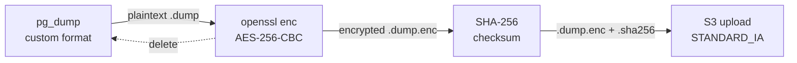

# Backup and Disaster Recovery

**Status:** Alpha baseline
**Date:** 2025-07-18
**Owner:** @devops-engineer
**Related:** [Deployment Runbook](deployment-runbook.md) · [Infrastructure Standards](infrastructure-standards.md) · [Auth & Security (ADR-0004)](../architecture/0004-auth-security-architecture.md) · [Monitoring Setup](monitoring-setup.md)

---

> This document defines the backup strategy, disaster recovery (DR) procedures, and key rotation policies for the Finance application. It is the operational baseline for the alpha release.

## Table of Contents

- [1. Backup Scope](#1-backup-scope)
- [2. Backup Cadence](#2-backup-cadence)
- [3. Encryption](#3-encryption)
- [4. Off-Site Storage (S3)](#4-off-site-storage-s3)
- [5. Restore Procedure](#5-restore-procedure)
- [6. Backup Verification](#6-backup-verification)
- [7. Monitoring](#7-monitoring)
- [8. Key Rotation Procedures](#8-key-rotation-procedures)
- [9. Disaster Recovery Scenarios](#9-disaster-recovery-scenarios)
- [10. Retention Policy](#10-retention-policy)
- [11. Runbook Checklist](#11-runbook-checklist)

---

## 1. Backup Scope

### Web user backup package (issue #2029)

The web app exports a canonical plain JSON backup package for user-initiated backup/restore round-trips. Native iOS/Android/Windows export remains TODO and is out of scope for the current web-focused implementation.

```json
{
  "version": 1,
  "metadata": {
    "generatedAt": "2026-05-26T12:00:00.000Z",
    "appVersion": "0.1.0",
    "source": "web"
  },
  "users": [],
  "households": [],
  "householdMembers": [],
  "accounts": [],
  "transactions": [],
  "categories": [],
  "budgets": [],
  "goals": [],
  "recurringTemplates": [],
  "preferences": [],
  "settings": [],
  "consentRecords": []
}
```

Rules:

- `version` is required; restores reject missing or unsupported versions.
- SQL-backed records are exported with stable primary keys so restore can dedupe by `id`.
- `preferences`, `settings`, `consentRecords`, and local recurring templates are key/value records and dedupe by `key`.
- `users`, `households`, and `householdMembers` are included to keep clean restores valid with local foreign-key checks.
- Duplicate local records are skipped and reported unless the user selects **Wipe local data first**.

### Included

| Data                                               | Source                          | Method                        |
| -------------------------------------------------- | ------------------------------- | ----------------------------- |
| PostgreSQL database (all schemas)                  | Supabase self-hosted PostgreSQL | `pg_dump -Fc` (custom format) |
| Row-level security (RLS) policies                  | Included in schema dump         | Part of `pg_dump`             |
| Auth tables (`auth.*`)                             | Supabase auth schema            | Part of full database dump    |
| User data (transactions, budgets, goals, accounts) | Public schema                   | Part of full database dump    |
| PowerSync sync metadata                            | `powersync` schema (if present) | Part of full database dump    |

### Excluded

| Data                                    | Reason                              | Recovery Method                  |
| --------------------------------------- | ----------------------------------- | -------------------------------- |
| Client-side SQLite databases            | Edge-first — data syncs from server | Re-sync from restored PostgreSQL |
| S3/blob storage (receipts, attachments) | Not yet implemented (alpha)         | N/A                              |
| Application code                        | Stored in Git                       | Re-clone from GitHub             |
| Environment variables / secrets         | Stored in password manager          | Re-configure from secure vault   |
| Docker images                           | Stored in registry                  | Re-pull from container registry  |
| Caddy TLS certificates                  | Auto-renewed by Caddy/Let's Encrypt | Caddy regenerates on startup     |

### Source Files

All backup infrastructure lives in [`deploy/backup/`](../../deploy/backup/):

- [`backup-database.sh`](../../deploy/backup/backup-database.sh) — Main backup/restore script
- [`backup-cron.txt`](../../deploy/backup/backup-cron.txt) — Cron schedule reference
- [`.env.backup.example`](../../deploy/backup/.env.backup.example) — Environment variable template

---

## 2. Backup Cadence

The backup schedule is defined in [`deploy/backup/backup-cron.txt`](../../deploy/backup/backup-cron.txt) and installed via `crontab -e` on the VPS.

| Schedule                | Time (UTC)       | Description                                                       | Retention            |
| ----------------------- | ---------------- | ----------------------------------------------------------------- | -------------------- |
| **Daily**               | 02:00            | Full `pg_dump` → encrypt → upload to S3 → clean old local backups | 30 days (local + S3) |
| **Weekly verification** | Sunday 03:00     | SHA-256 checksum + decryption test on the latest backup           | N/A (verify only)    |
| **Monthly archival**    | 1st Sunday 04:00 | Full backup with 365-day retention for compliance                 | 365 days             |

### Installing the Cron Schedule

```bash
# On the VPS, as the deploy user:
crontab -e

# Paste the contents of deploy/backup/backup-cron.txt
# Save and exit — verify with:
crontab -l
```

### Prerequisites

- `pg_dump` (PostgreSQL client): `apt install postgresql-client-15`
- `openssl` (encryption): pre-installed on most Linux distributions
- `aws` CLI (S3 upload): [Install guide](https://docs.aws.amazon.com/cli/latest/userguide/getting-started-install.html)
- Backup `.env` file configured: `cp deploy/backup/.env.backup.example deploy/backup/.env`

---

## 3. Encryption

All backups are encrypted at rest before leaving the server. The script uses **AES-256-CBC** with **PBKDF2** key derivation.

### How It Works



### Encryption Parameters

| Parameter         | Value                           | Notes                           |
| ----------------- | ------------------------------- | ------------------------------- |
| Algorithm         | AES-256-CBC                     | 256-bit key, CBC mode           |
| Key derivation    | PBKDF2                          | Password-based key derivation   |
| PBKDF2 iterations | 100,000                         | Resistant to brute-force        |
| Salt              | Random (OpenSSL default)        | Unique per encryption operation |
| Passphrase source | `BACKUP_ENCRYPTION_KEY` env var | Never stored alongside backups  |

### Encryption Command (Reference)

```bash
# Encrypt (done automatically by the script)
openssl enc \
    -aes-256-cbc \
    -salt \
    -pbkdf2 \
    -iter 100000 \
    -in backup.dump \
    -out backup.dump.enc \
    -pass env:BACKUP_ENCRYPTION_KEY

# Decrypt (for restore)
openssl enc \
    -d -aes-256-cbc \
    -salt \
    -pbkdf2 \
    -iter 100000 \
    -in backup.dump.enc \
    -out backup.dump \
    -pass env:BACKUP_ENCRYPTION_KEY
```

### Key Management Rules

1. **Never store `BACKUP_ENCRYPTION_KEY` in the same location as the backups** — if S3 is compromised, the attacker must not also have the key.
2. **Store the key in a password manager** (e.g., 1Password, Bitwarden) shared with authorized operators.
3. **Generate strong keys**: `openssl rand -base64 32` produces a 256-bit random key.
4. **If the key is lost, all encrypted backups become permanently unrecoverable.**

---

## 4. Off-Site Storage (S3)

Backups are uploaded to S3-compatible storage when the `--upload` flag is used. The script supports AWS S3, Backblaze B2, DigitalOcean Spaces, MinIO, and any S3-compatible provider.

### Configuration

Set the following in `deploy/backup/.env` (see [`.env.backup.example`](../../deploy/backup/.env.backup.example)):

| Variable                | Description                  | Example                                  |
| ----------------------- | ---------------------------- | ---------------------------------------- |
| `S3_BUCKET`             | Bucket name                  | `finance-backups-prod`                   |
| `S3_PREFIX`             | Key prefix inside the bucket | `finance-backups/`                       |
| `S3_ENDPOINT`           | Endpoint URL (empty for AWS) | `https://s3.us-west-004.backblazeb2.com` |
| `AWS_ACCESS_KEY_ID`     | S3 access key                | _(set in .env, never commit)_            |
| `AWS_SECRET_ACCESS_KEY` | S3 secret key                | _(set in .env, never commit)_            |

### S3 Bucket Hardening

Apply these settings to the backup bucket:

1. **Versioning**: Enable — protects against accidental overwrites.
2. **Server-side encryption**: Enable SSE-S3 or SSE-KMS — encrypts at rest in S3 (defense in depth; backups are already encrypted).
3. **Access policy**: Restrict to the backup IAM user only — no public access.
4. **Lifecycle rules**: Transition to Glacier after 90 days; delete after 365 days (align with retention).
5. **MFA Delete**: Enable on production buckets — prevents bucket deletion without MFA.
6. **Block public access**: Enable all four block-public-access settings.

### Storage Classes

| Backup Type      | S3 Storage Class                        | Rationale                                 |
| ---------------- | --------------------------------------- | ----------------------------------------- |
| Daily backups    | `STANDARD_IA`                           | Infrequent access, low retrieval cost     |
| Monthly archives | `STANDARD_IA` → Glacier (via lifecycle) | Cost optimization for long-term retention |

---

## 5. Restore Procedure

> **⚠️ WARNING:** Restoring a backup replaces the current database contents. This is a destructive operation that requires human authorization.

### Step-by-Step Restore

#### From a Web JSON Backup

1. Open **Settings → Privacy & Data** and select **Download all data (JSON)**.
2. Store the downloaded `finance-backup-YYYY-MM-DD.json` somewhere safe.
3. To restore, open **Import → Import Wizard** and choose the JSON file.
4. Verify the dry-run preview counts for each entity and review duplicate skips.
5. Optional: select **Wipe local data first** for a clean restore.
6. Select **Restore backup** and confirm the completion totals.
7. Re-open Accounts, Transactions, Categories, Budgets, and Goals to spot-check restored counts.

ZIP restore is supported only when the ZIP contains an uncompressed canonical backup JSON member. The default web export uses plain JSON for simplicity.

#### From a Local Backup

```bash
# 1. Navigate to the backup directory
cd ~/finance/deploy/backup

# 2. Source environment variables
source .env

# 3. List available backups (most recent first)
ls -lt ./volumes/db/backups/finance-*.dump.enc

# 4. Verify the backup integrity first
./backup-database.sh --verify ./volumes/db/backups/<backup-file>.dump.enc

# 5. Stop the application (prevent writes during restore)
docker compose -f ~/finance/deploy/docker-compose.yml stop api powersync

# 6. Restore from the encrypted backup
./backup-database.sh --restore ./volumes/db/backups/<backup-file>.dump.enc

# 7. Restart the application
docker compose -f ~/finance/deploy/docker-compose.yml start api powersync

# 8. Verify the restore
psql -h localhost -U supabase_admin -d postgres -c "SELECT count(*) FROM auth.users;"
```

#### From an S3 Backup

```bash
# 1. Source environment variables
cd ~/finance/deploy/backup && source .env

# 2. List available S3 backups
aws s3 ls "s3://${S3_BUCKET}/${S3_PREFIX}" \
    ${S3_ENDPOINT:+--endpoint-url "$S3_ENDPOINT"} \
    | grep '.dump.enc$' | sort -k1,2 | tail -20

# 3. Download the backup and its checksum
aws s3 cp "s3://${S3_BUCKET}/${S3_PREFIX}<backup-file>.dump.enc" ./volumes/db/backups/ \
    ${S3_ENDPOINT:+--endpoint-url "$S3_ENDPOINT"}
aws s3 cp "s3://${S3_BUCKET}/${S3_PREFIX}<backup-file>.dump.enc.sha256" ./volumes/db/backups/ \
    ${S3_ENDPOINT:+--endpoint-url "$S3_ENDPOINT"}

# 4. Verify, stop services, restore, restart (same as steps 4-8 above)
./backup-database.sh --verify ./volumes/db/backups/<backup-file>.dump.enc
docker compose -f ~/finance/deploy/docker-compose.yml stop api powersync
./backup-database.sh --restore ./volumes/db/backups/<backup-file>.dump.enc
docker compose -f ~/finance/deploy/docker-compose.yml start api powersync
```

### Post-Restore Verification

After restoring, verify critical data:

```bash
# Check user count
psql -h localhost -U supabase_admin -d postgres \
    -c "SELECT count(*) AS user_count FROM auth.users;"

# Check recent transactions exist
psql -h localhost -U supabase_admin -d postgres \
    -c "SELECT count(*) AS txn_count FROM public.transactions WHERE created_at > now() - interval '7 days';"

# Verify RLS is active
psql -h localhost -U supabase_admin -d postgres \
    -c "SELECT tablename, rowsecurity FROM pg_tables WHERE schemaname = 'public' AND rowsecurity = true;"
```

---

## 6. Backup Verification

The weekly cron job automatically verifies the most recent backup. You can also verify manually at any time.

### Automatic Verification (Weekly Cron)

The Sunday 03:00 UTC cron job:

1. Finds the most recent `.dump.enc` file.
2. Validates the SHA-256 checksum against the stored `.sha256` file.
3. Attempts a partial decryption to confirm the encryption key is correct.
4. Logs results to `/var/log/finance-backup.log`.

### Manual Verification

```bash
cd ~/finance/deploy/backup && source .env

# Verify a specific backup
./backup-database.sh --verify ./volumes/db/backups/<backup-file>.dump.enc
```

### What Verification Checks

| Check          | Method                                    | Pass Criteria                                    |
| -------------- | ----------------------------------------- | ------------------------------------------------ |
| File integrity | SHA-256 checksum comparison               | Checksum matches stored `.sha256`                |
| Decryption     | OpenSSL decrypt + pg_restore header parse | Decryption succeeds, output is valid dump format |

---

## 7. Monitoring

### Log Location

All backup operations log to `/var/log/finance-backup.log` in structured JSON format:

```json
{
  "timestamp": "2025-07-18T02:00:05Z",
  "level": "INFO",
  "component": "backup",
  "message": "Backup complete: ./volumes/db/backups/finance-postgres-20250718T020003Z.dump.enc"
}
```

### Verifying Backups Are Running

#### Check Cron Is Installed

```bash
crontab -l | grep backup-database
```

Expected: three entries (daily, weekly verification, monthly archival).

#### Check Recent Backup Logs

```bash
# Last 20 lines of the backup log
tail -20 /var/log/finance-backup.log

# Check for errors in the last 7 days
grep '"level":"ERROR"' /var/log/finance-backup.log | tail -10

# Check the timestamp of the most recent backup file
ls -lt ~/finance/deploy/backup/volumes/db/backups/finance-*.dump.enc | head -1
```

#### Check S3 Upload Success

```bash
# List recent uploads
cd ~/finance/deploy/backup && source .env
aws s3 ls "s3://${S3_BUCKET}/${S3_PREFIX}" \
    ${S3_ENDPOINT:+--endpoint-url "$S3_ENDPOINT"} \
    | sort -k1,2 | tail -5
```

### Alerting (Recommended)

Set up monitoring alerts for:

| Condition                                    | Detection Method                        | Severity     |
| -------------------------------------------- | --------------------------------------- | ------------ |
| No backup file created in 48 hours           | Check file mtime or S3 listing          | **Critical** |
| Backup log contains `ERROR`                  | Log monitoring (grep or log aggregator) | **High**     |
| Weekly verification fails                    | Check log for `FAILED` on Sundays       | **High**     |
| Backup file size is zero or abnormally small | Compare against historical average      | **Medium**   |
| S3 upload fails                              | Check for S3 error in logs              | **High**     |

A simple monitoring script for cron:

```bash
# Add to crontab — runs at 06:00 UTC, alerts if no backup in 48h
0 6 * * * LATEST=$(find ~/finance/deploy/backup/volumes/db/backups -name "finance-*.dump.enc" -mtime -2 | head -1) && [ -z "$LATEST" ] && echo "ALERT: No backup in 48 hours" | mail -s "Finance Backup Alert" ops@example.com
```

---

## 8. Key Rotation Procedures

All secrets should be rotated periodically. The table below defines the rotation schedule and the procedure for each secret.

| Secret                  | Rotation Frequency              | Impact of Rotation                                      |
| ----------------------- | ------------------------------- | ------------------------------------------------------- |
| `BACKUP_ENCRYPTION_KEY` | Every 6 months or on compromise | Future backups use new key; old backups require old key |
| `POSTGRES_PASSWORD`     | Every 6 months or on compromise | All services must be updated and restarted              |
| `JWT_SECRET`            | Every 6 months or on compromise | All existing sessions are invalidated                   |
| `SERVICE_ROLE_KEY`      | Every 6 months or on compromise | All services using the service role must be updated     |

### 8.1 Rotating `BACKUP_ENCRYPTION_KEY`

> **Critical:** Old backups remain encrypted with the old key. You must retain old keys to restore old backups.

**Steps:**

1. **Generate a new key:**

   ```bash
   openssl rand -base64 32
   ```

2. **Record the old key** in the team password manager with a label indicating the date range it was active (e.g., `BACKUP_ENCRYPTION_KEY (2025-01 to 2025-07)`).

3. **Create one final backup with the old key** to ensure a clean cutoff:

   ```bash
   cd ~/finance/deploy/backup && source .env
   ./backup-database.sh --upload
   ```

4. **Update the `.env` file** with the new key:

   ```bash
   # Edit deploy/backup/.env
   BACKUP_ENCRYPTION_KEY=<new-key-from-step-1>
   ```

5. **Create the first backup with the new key:**

   ```bash
   ./backup-database.sh --upload
   ```

6. **Verify the new backup** decrypts correctly:

   ```bash
   ./backup-database.sh --verify ./volumes/db/backups/<latest-file>.dump.enc
   ```

7. **Document the rotation** in the ops log / incident tracker.

### 8.2 Rotating `POSTGRES_PASSWORD`

> **Impact:** Requires coordinated restart of all services that connect to PostgreSQL.

**Steps:**

1. **Generate a new password:**

   ```bash
   openssl rand -base64 32
   ```

2. **Update the PostgreSQL password:**

   ```sql
   -- Connect as superuser
   ALTER USER supabase_admin WITH PASSWORD '<new-password>';
   ```

3. **Update all configuration files** that reference the password:
   - `deploy/backup/.env` → `PGPASSWORD`
   - Docker Compose environment / `.env` → `POSTGRES_PASSWORD`
   - Supabase configuration (if self-hosted)

4. **Restart all services:**

   ```bash
   docker compose -f ~/finance/deploy/docker-compose.yml restart
   ```

5. **Verify connectivity:**

   ```bash
   psql -h localhost -U supabase_admin -d postgres -c "SELECT 1;"
   ```

6. **Create a backup** with the updated credentials to confirm backup pipeline works:

   ```bash
   cd ~/finance/deploy/backup && source .env
   ./backup-database.sh --upload
   ```

7. **Store the new password** in the team password manager.

### 8.3 Rotating `JWT_SECRET`

> **Impact:** All active user sessions (JWTs) are immediately invalidated. Users must re-authenticate. Plan this rotation during a maintenance window.

**Steps:**

1. **Announce a maintenance window** to users (if applicable).

2. **Generate a new JWT secret:**

   ```bash
   openssl rand -base64 64
   ```

3. **Update the Supabase configuration:**
   - Docker Compose environment → `JWT_SECRET`
   - Any service that validates JWTs must receive the new secret.

4. **Restart all services:**

   ```bash
   docker compose -f ~/finance/deploy/docker-compose.yml restart
   ```

5. **Verify authentication works** by logging in on each platform (iOS, Android, Web, Windows).

6. **Store the new secret** in the team password manager.

7. **Regenerate `ANON_KEY` and `SERVICE_ROLE_KEY`** — these are derived from the JWT secret. See [Section 8.4](#84-rotating-service_role_key).

### 8.4 Rotating `SERVICE_ROLE_KEY`

> **Impact:** All backend services using the service role key must be updated. The service role key is a JWT signed with `JWT_SECRET`, so it changes whenever `JWT_SECRET` rotates.

**Steps:**

1. **Generate a new service role JWT** using the new `JWT_SECRET`:

   ```bash
   # Use the Supabase JWT generator or a tool like jwt.io
   # Payload: { "role": "service_role", "iss": "supabase", "iat": <now>, "exp": <far-future> }
   ```

2. **Update all configuration files** referencing `SERVICE_ROLE_KEY`:
   - Docker Compose environment
   - Edge Functions configuration
   - Any service-to-service auth configuration

3. **Also regenerate `ANON_KEY`** with the same `JWT_SECRET` and `role: anon`.

4. **Restart all services:**

   ```bash
   docker compose -f ~/finance/deploy/docker-compose.yml restart
   ```

5. **Verify API access:**

   ```bash
   curl -H "apikey: <new-anon-key>" \
        -H "Authorization: Bearer <new-anon-key>" \
        https://api.finance.example.com/rest/v1/
   ```

6. **Store all new keys** in the team password manager.

---

## 9. Disaster Recovery Scenarios

### Scenario 1: Database Corruption

**Symptoms:** Application errors, query failures, PostgreSQL crash-recovery loops.

**Recovery:**

1. Stop the application to prevent further writes.
2. Identify the last known good backup (check logs for successful backups before the corruption).
3. Follow the [Restore Procedure](#5-restore-procedure) using the most recent verified backup.
4. After restore, run post-restore verification queries.
5. Restart the application and monitor for errors.

**Data loss window:** Up to 24 hours (time since last daily backup).

### Scenario 2: VPS Total Loss

**Symptoms:** Server unreachable, disk failure, provider outage.

**Recovery:**

1. Provision a new VPS following the [Deployment Runbook](deployment-runbook.md).
2. Install prerequisites (`postgresql-client-15`, `openssl`, `aws` CLI, Docker).
3. Clone the repository: `git clone <repo-url> ~/finance`
4. Configure secrets: `cp deploy/backup/.env.backup.example deploy/backup/.env` and populate from password manager.
5. Download the latest backup from S3 (see [Restore from S3](#from-an-s3-backup)).
6. Restore the database.
7. Deploy the application stack via Docker Compose.
8. Update DNS records if the IP address changed.
9. Verify all services and re-install the cron schedule.

**RTO (Recovery Time Objective):** ~1-2 hours (alpha target).
**RPO (Recovery Point Objective):** ≤24 hours (daily backup cadence).

### Scenario 3: Encryption Key Compromise

**Symptoms:** Suspected or confirmed leak of `BACKUP_ENCRYPTION_KEY`.

**Response:**

1. **Immediately rotate** the `BACKUP_ENCRYPTION_KEY` (see [Section 8.1](#81-rotating-backup_encryption_key)).
2. Assess whether S3 backups were accessed (check S3 access logs).
3. If S3 access is confirmed, rotate `POSTGRES_PASSWORD`, `JWT_SECRET`, and `SERVICE_ROLE_KEY` as well.
4. Consider re-encrypting recent S3 backups with the new key (download, decrypt with old key, re-encrypt with new key, re-upload).
5. File an incident report.

### Scenario 4: Ransomware / Unauthorized Access

**Response:**

1. **Isolate** the affected server immediately (firewall rules, network disconnect).
2. **Do not pay** any ransom.
3. Provision a clean VPS.
4. Restore from S3 backups (which are encrypted and stored off-site).
5. Rotate **all** secrets (see [Section 8](#8-key-rotation-procedures)).
6. Audit access logs and revoke compromised credentials.
7. File an incident report and notify affected users per [Incident Response Runbook](../architecture/incident-response-runbook.md).

---

## 10. Retention Policy

| Tier                        | Location                            | Retention  | Cleanup Method                                        |
| --------------------------- | ----------------------------------- | ---------- | ----------------------------------------------------- |
| Local daily                 | VPS disk (`volumes/db/backups/`)    | 30 days    | Automatic (`find -mtime +30`, runs after each backup) |
| S3 daily                    | S3 bucket (`STANDARD_IA`)           | 30 days    | S3 lifecycle rule (recommended)                       |
| S3 monthly archive          | S3 bucket → Glacier (via lifecycle) | 365 days   | S3 lifecycle rule                                     |
| Password manager (old keys) | Team password manager               | Indefinite | Manual review annually                                |

---

## 11. Runbook Checklist

Use this checklist when setting up backups on a new environment or verifying an existing setup.

- [ ] PostgreSQL client (`pg_dump`) is installed and can connect to the database
- [ ] `openssl` is installed (verify: `openssl version`)
- [ ] AWS CLI is installed and configured (verify: `aws --version`)
- [ ] `deploy/backup/.env` is configured with all required variables
- [ ] `BACKUP_ENCRYPTION_KEY` is stored in the team password manager
- [ ] Backup directory exists and is writable: `mkdir -p ./volumes/db/backups`
- [ ] Manual backup succeeds: `./backup-database.sh`
- [ ] Manual backup with upload succeeds: `./backup-database.sh --upload`
- [ ] Cron schedule is installed: `crontab -l | grep backup-database`
- [ ] S3 bucket exists with versioning, encryption, and access restrictions
- [ ] S3 lifecycle rules are configured (30-day delete for daily, Glacier transition for monthly)
- [ ] Log file is writable: `touch /var/log/finance-backup.log`
- [ ] Monitoring/alerting is configured for backup failures
- [ ] **Restore test completed** — at least one successful restore from backup has been verified

---

_Last verified: 2025-07-18 — alpha baseline. Update this document when backup infrastructure changes._
