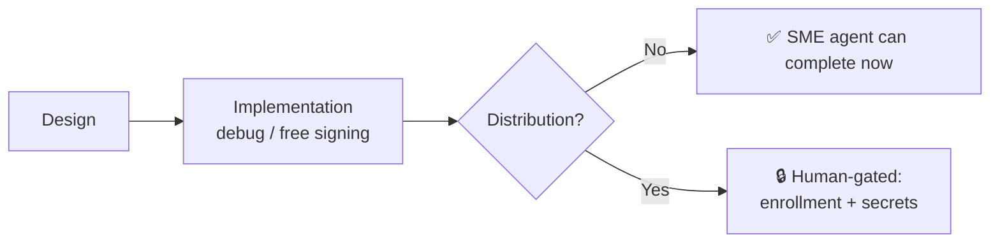

# Human-Gated Prerequisites Runbook

**Status:** Active
**Date:** 2026-06-21
**Ticket:** #2901
**Related:** [Launch Readiness Plan](./launch-readiness-plan.md) · [Environments & Secrets](./environments.md) · [Secrets Inventory](./secrets.md) · [Deployment](./deployment.md)

---

## Purpose

A handful of launch prerequisites can **only** be completed by a human: they require paying money,
registering external accounts, generating signing material, or configuring GitHub secrets. These
operations are explicitly out of bounds for AI/SME agents (see
[`AGENTS.md` → Human-Gated Operations](../../AGENTS.md), Categories 1–8).

This runbook does two things:

1. **For humans** — a single, minimal, copy-paste checklist to clear every human-gated blocker in
   one sitting, consolidating detail that is otherwise scattered across closed issues and other ops docs.
2. **For SME agents** — an authoritative **implementation-vs-distribution decoupling** reference, so
   agents stop treating feature implementation as blocked when only the (later) _distribution_ step is
   actually human-gated.

> **The core insight:** Paid platform enrollment is required only for **distribution**
> (Play Store / TestFlight / App Store / release signing). Native feature code can be **built and
> tested for free** — Android via `assembleDebug` sideload, iOS via free Personal Team signing. Most
> "blocked by #1242/#1239" feature issues are therefore **implementable now**; only their distribution
> tail is gated.

---

## Table of Contents

- [1. Blocker Inventory](#1-blocker-inventory)
- [2. Implementation vs. Distribution — the decoupling](#2-implementation-vs-distribution--the-decoupling)
- [3. Human Checklists (one per blocker)](#3-human-checklists-one-per-blocker)
  - [3.1 Android distribution — Google Play (#1242)](#31-android-distribution--google-play-1242)
  - [3.2 iOS distribution — Apple Developer (#1239)](#32-ios-distribution--apple-developer-1239)
  - [3.3 Staging deploy — Azure VM SSH (#2794)](#33-staging-deploy--azure-vm-ssh-2794)
  - [3.4 Web backend — Supabase Pages secrets (#2797)](#34-web-backend--supabase-pages-secrets-2797)
  - [3.5 Windows market data — provider credentials (#2702)](#35-windows-market-data--provider-credentials-2702)
- [4. Guidance for SME Agents](#4-guidance-for-sme-agents)

---

## 1. Blocker Inventory

| Root           | Blocker                                                                                       | State                                   | Open issues gated | Human action required                                                              |
| -------------- | --------------------------------------------------------------------------------------------- | --------------------------------------- | ----------------- | ---------------------------------------------------------------------------------- |
| #1242          | Google Play Console + Android release keystore + CI secrets                                   | Closed `NOT_PLANNED` (deferred to beta) | ~55               | $25 one-time fee, identity verification, keystore generation, GitHub secret config |
| #1239          | Apple Developer Program + iOS signing certs/profiles + App Store Connect API key + CI secrets | Closed `NOT_PLANNED` (deferred to beta) | ~44               | $99/yr enrollment, certificate/profile creation, GitHub secret config              |
| #2794          | Azure VM staging deploy — SSH unreachable / stale secret                                      | Open                                    | 1 (+ #2797)       | VM/infra access, SSH key/secret rotation                                           |
| #2797 (item 3) | Supabase repo secrets for the GitHub Pages build                                              | Open                                    | —                 | `VITE_SUPABASE_URL` / `VITE_SUPABASE_ANON_KEY` secret config                       |
| #2702          | Windows near-real-time market data — provider credentials                                     | Open                                    | 1                 | Third-party market-data API account + terms acceptance                             |

Minor feature-level external dependencies (not launch blockers, tracked on their own issues):
**#2383** Google Assistant voice entry (Google Actions setup) and **#2164** crypto wallet/exchange
connections (third-party API keys).

> **Why #1242/#1239 are `NOT_PLANNED`, not done:** both were deferred to beta because alpha testing
> uses free signing (debug sideload / Personal Team). They remain genuine, _unfinished_ human tasks —
> not completed work — and must be performed by a human before any store distribution.

---

## 2. Implementation vs. Distribution — the decoupling

Most downstream feature issues conflate two phases. Only the second is human-gated.

| Phase              | Example work                                                                     | Needs paid enrollment / secrets?                                          | Who does it          |
| ------------------ | -------------------------------------------------------------------------------- | ------------------------------------------------------------------------- | -------------------- |
| **Design**         | Surfaces, states, accessibility, test plan                                       | No                                                                        | SME agent            |
| **Implementation** | Compose / SwiftUI code, shared `packages/` logic, local unit/UI tests            | **No** — Android `assembleDebug` sideload; iOS free Personal Team signing | SME agent            |
| **Distribution**   | Release signing, Play Store / TestFlight / App Store upload, CI release workflow | **Yes** — enrollment + signing material + GitHub secrets                  | Human (this runbook) |

**Free local build/test paths (no enrollment required):**

- **Android:** `./gradlew :apps:android:assembleDebug`, then sideload the APK
  (enable "Install unknown apps"). See [`docs/guides/android-setup.md`](../guides/android-setup.md).
- **iOS:** build and run on a connected device using a **free Apple ID** (Personal Team signing) in
  Xcode. Limitations: apps expire after 7 days, max 3 active apps per device, no TestFlight / push /
  paid entitlements — all acceptable for local feature verification.



**Bottom line for triage:** a "blocked by #1242/#1239" feature issue is **implementable now** up to
the distribution boundary. Only tasks whose acceptance criteria _require_ a store build, release
signing, TestFlight/Play distribution, or paid entitlements (push notifications, Associated Domains,
Sign in with Apple production) stay blocked until the matching checklist below is complete.

---

## 3. Human Checklists (one per blocker)

> Secret names below match the actual workflow references audited in
> [`secrets.md`](./secrets.md). Add secrets under **Settings → Secrets and variables → Actions**
> (repo-level) or the relevant **GitHub Environment** (`staging` / `production`) per
> [`environments.md`](./environments.md).

### 3.1 Android distribution — Google Play (#1242)

Scaffolding already merged (`apps/android/fastlane/`, signing config reading `keystore.properties`
with CI env fallback, `release-android.yml`). Remaining **human** steps:

1. **Register** at <https://play.google.com/console/signup> ($25 one-time); complete identity verification.
2. **Create app listing** — name "Finance", default language English (US); confirm package matches
   `com.finance.android` in `apps/android/build.gradle.kts`.
3. **Generate the release keystore** (store the file + passwords in a password manager; **back it up —
   losing it means you can never update the app**):
   ```bash
   keytool -genkey -v -keystore finance-release.keystore \
     -alias finance -keyalg RSA -keysize 2048 -validity 10000
   ```
4. **Create a Play service account** (Google Cloud Console → IAM → Service Accounts), download its JSON
   key, link it in Play Console → Settings → API access, grant **Release manager**.
5. **Configure GitHub secrets:** `ANDROID_KEYSTORE_BASE64` (`base64 -w0 finance-release.keystore`),
   `ANDROID_KEYSTORE_PASSWORD`, `ANDROID_KEY_ALIAS`, `ANDROID_KEY_PASSWORD`,
   `GOOGLE_PLAY_SERVICE_ACCOUNT_JSON`.
6. **Fill scaffolding placeholders:** replace `YOUR_PACKAGE_NAME` in `apps/android/fastlane/Appfile`;
   create local `apps/android/keystore.properties` from the template.

**Done when:** Play Console account active, keystore generated + backed up, all five secrets present,
`release-android.yml` produces a signed AAB on `workflow_dispatch`.

### 3.2 iOS distribution — Apple Developer (#1239)

Scaffolding already merged (`apps/ios/fastlane/`, `Matchfile`, `Signing/README.md`, `release-ios.yml`).
Remaining **human** steps:

1. **Enroll** at <https://developer.apple.com/programs/enroll/> ($99/yr); wait for approval (instant–48h).
2. **Create App ID** with bundle id `com.finance.app` (or chosen id); enable capabilities as needed
   (Sign in with Apple, Push Notifications, Associated Domains).
3. **Create signing material** — distribution certificate + App Store and Development provisioning
   profiles (or manage via `fastlane match` against a private certificates repo).
4. **Create an App Store Connect API key** (Users and Access → Integrations) with App Manager access;
   download the `.p8` **once**; note Key ID + Issuer ID.
5. **Configure GitHub secrets** (names per `release-ios.yml`): `IOS_DISTRIBUTION_CERT_BASE64`,
   `IOS_CERT_PASSWORD`, `IOS_PROVISIONING_PROFILE_BASE64`, `APP_STORE_API_KEY_ID`, `APP_STORE_API_ISSUER`
   (plus `MATCH_GIT_URL` / `MATCH_PASSWORD` / `APPLE_TEAM_ID` if using match-based signing).
6. **Fill scaffolding placeholders:** `YOUR_APPLE_TEAM_ID`, `YOUR_APP_BUNDLE_ID`, `YOUR_MATCH_GIT_URL`
   in `Appfile` / `Matchfile` / export-options plists.

**Done when:** Apple Developer account active, certs/profiles created, API key + secrets present,
`release-ios.yml` produces a signed archive on `workflow_dispatch`.

### 3.3 Staging deploy — Azure VM SSH (#2794)

The `staging` GitHub environment already has `DEPLOY_HOST` / `DEPLOY_SSH_KEY` / `DEPLOY_USER`, but the
`Deploy — Staging` job fast-fails at the SSH step (connection refused / stale host or key). **Human**
steps requiring environment access:

1. Verify the staging Azure VM is **up and reachable** at `DEPLOY_HOST`.
2. Verify `DEPLOY_SSH_KEY` matches an authorized key for `DEPLOY_USER` on the VM and the host fingerprint
   hasn't rotated; rotate the secret per the [SSH key policy](./secrets.md) if needed.
3. Re-run `Deploy — Staging` (`workflow_dispatch`), or push any web change to trigger the auto-deploy gate.

**Done when:** `Deploy — Staging` reaches and completes the remote deploy step (no ~4s SSH fast-fail).

### 3.4 Web backend — Supabase Pages secrets (#2797)

The GitHub Pages build currently uses a `placeholder` Supabase URL (local-first/demo mode) because no
backend secrets exist. To make the Pages deploy backend-connected (sync + real auth), a **human** adds
repo secrets `VITE_SUPABASE_URL` and `VITE_SUPABASE_ANON_KEY`. Until then the Pages site runs in
demo/local-first mode (acceptable, not a blocker).

**Done when:** both secrets are present and a Pages deploy boots against the real backend.

### 3.5 Windows market data — provider credentials (#2702)

Near-real-time Windows market data needs a third-party market-data provider account. **Human** steps:
register with the chosen provider, accept API terms, and supply the API credentials as secrets (names
TBD by the implementing PR). Shared scheduler/rate-limit logic in `packages/` is implementable without
the credentials using a stub/fixture provider.

**Done when:** provider account exists, terms accepted, and credentials are configured as secrets.

---

## 4. Guidance for SME Agents

When you pick up an issue that cites `#1242`, `#1239`, `#2794`, `#2797`, or `#2702` as a blocker:

1. **Re-scope to the decoupling in [§2](#2-implementation-vs-distribution--the-decoupling).** Implement
   and unit/UI-test everything up to the distribution boundary using debug / free-signing / stub-provider
   paths. Do **not** mark the whole issue blocked.
2. **Only the distribution tail is gated.** If — and only if — an acceptance criterion _requires_ a store
   build, release signing, TestFlight/Play distribution, paid entitlement, live staging deploy, or real
   provider credentials, isolate that criterion and leave a `## Needs Human Action` note pointing at the
   matching checklist in [§3](#3-human-checklists-one-per-blocker).
3. **Never perform the human steps yourself** — payment, account registration, keystore/cert generation,
   and GitHub secret configuration are hard-gated (see `AGENTS.md`, Categories 1–8). Stop cleanly and
   document instead of working around them.

This lets the bulk of the ~99 "enrollment-blocked" feature issues proceed now, while keeping the
genuinely human-gated distribution work clearly flagged for a human to clear in one sitting.
