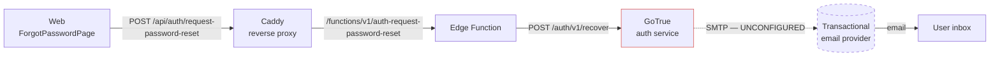

# Password Reset Email — Setup & Troubleshooting Runbook

This runbook explains how the password-reset (and all auth) email is delivered in
the self-hosted stack, why it can silently fail, and exactly what a human
operator must configure to make delivery work.

> **Related:** [Secrets Inventory](secrets.md) | [Human-Gated Prerequisites](human-gated-prerequisites.md) | [Environments](environments.md) | [Deployment Runbook](deployment-runbook.md) | [Monitoring Setup](monitoring-setup.md)
>
> **Issues:** Refs #3179 · privacy copy by design #3107 · provider guidance #1253

---

## Table of Contents

- [Symptom](#symptom)
- [Root cause](#root-cause)
- [Delivery path](#delivery-path)
- [Setup (operator checklist)](#setup-operator-checklist)
  - [1. Choose a transactional email provider](#1-choose-a-transactional-email-provider)
  - [2. Verify the sender domain (SPF / DKIM / DMARC)](#2-verify-the-sender-domain-spf--dkim--dmarc)
  - [3. Set the SMTP environment variables](#3-set-the-smtp-environment-variables)
  - [4. Allowlist the recovery redirect URL](#4-allowlist-the-recovery-redirect-url)
  - [5. Review mailer + rate-limit settings](#5-review-mailer--rate-limit-settings)
  - [6. Run the preflight check](#6-run-the-preflight-check)
  - [7. Deploy / restart auth](#7-deploy--restart-auth)
  - [8. Verify end to end](#8-verify-end-to-end)
- [Troubleshooting](#troubleshooting)
- [What the repo already does vs. what a human must do](#what-the-repo-already-does-vs-what-a-human-must-do)

---

## Symptom

A user requests a password reset on the web app. The UI confirms a reset link
"would have been sent", but **no email ever arrives** — including when tested with
a known-good mailbox and after checking spam.

The success message is **intentional and correct**: PR #3107 made the response
privacy-preserving so the API never reveals whether an account exists
(anti-enumeration). The generic "if an account exists, we've sent a link"
copy is by design and must stay. The bug is **not** the copy — it is that the
**email is never delivered**, and the privacy copy was masking the failure.

## Root cause

Recovery email is sent by the **self-hosted GoTrue (Supabase Auth) service using
its built-in mailer over SMTP**. There is no SendGrid/Resend/Postmark SDK in the
recovery path — GoTrue connects directly to whatever SMTP server it is given.

In a fresh deploy that SMTP server is **unconfigured**. The compose file wires the
GoTrue SMTP variables to environment values that default to empty:

- [`deploy/docker-compose.yml`](../../deploy/docker-compose.yml) lines 159-164 —
  `GOTRUE_SMTP_HOST/PORT/USER/PASS/ADMIN_EMAIL: ${SMTP_*:-}` (empty defaults).
- [`deploy/.env.example`](../../deploy/.env.example) lines 85-90 — ships
  `SMTP_*` placeholders (`YOUR_SMTP_HOST_HERE`, …).

With no SMTP host, GoTrue cannot hand the message off, so the email is dropped.
The failure used to be invisible because:

1. The web client swallows all errors and always shows success
   (`apps/web/src/pages/ForgotPasswordPage.tsx`, the `finally` block — #3107).
2. The Edge Function previously only treated HTTP `>= 500` as a failure.

Both layers now still keep the **user-facing** message generic, but the Edge
Function now **logs** the real upstream outcome for operators (see
[step 8](#8-verify-end-to-end)).

A secondary issue: the recovery link's `redirect_to` is `${SITE_URL}/reset-password`,
which must appear in the GoTrue allow list (`GOTRUE_URI_ALLOW_LIST` ←
`AUTH_REDIRECT_URLS`). If it is missing, even a delivered email links to the app
root instead of the reset form. The env templates now include `/reset-password`
([`deploy/.env.example`](../../deploy/.env.example) line 55).

## Delivery path



The break is the dashed `D -.-> E` hop: GoTrue has no SMTP server to deliver to.
Caddy routing (`deploy/Caddyfile`, the `/api/auth/*` → `/functions/v1/auth-*`
rewrite) is correct and is **not** the problem.

---

## Setup (operator checklist)

> ⚠️ **Steps 1-3 require real provider credentials and DNS changes. Those are
> human-only operations (secrets + infrastructure) — an AI agent cannot perform
> them.** The repo ships everything else (templates, preflight, observability).

### 1. Choose a transactional email provider

Do **not** rely on a personal Gmail/consumer SMTP or any shared/built-in trial
relay for production — they have very low rate limits and poor deliverability and
will land in spam or be blocked. Use a transactional provider, for example:

| Provider           | Notes                                              |
| ------------------ | -------------------------------------------------- |
| Resend             | Simple SMTP + good DX; generous free tier          |
| Postmark           | Excellent transactional deliverability             |
| Amazon SES         | Cheapest at scale; requires production-access ramp |
| Mailgun            | Mature; flexible domains                           |
| Brevo (Sendinblue) | EU-friendly                                        |

Create an account and generate **SMTP credentials** (host, port, username,
password / API key).

### 2. Verify the sender domain (SPF / DKIM / DMARC)

In the provider, add and **verify the sending domain** you control (the same
domain used in `SMTP_ADMIN_EMAIL`, e.g. `noreply@yourdomain.com`). Add the DNS
records the provider gives you:

- **SPF** — a `TXT` record authorizing the provider to send for your domain.
- **DKIM** — the `CNAME`/`TXT` record(s) the provider supplies for signing.
- **DMARC** — a `TXT` record at `_dmarc.yourdomain.com` (start with
  `p=none` for monitoring, tighten later).

Unverified domains are the most common reason a message "sends" but lands in spam
or is rejected outright.

### 3. Set the SMTP environment variables

Set these in the **production** `deploy/.env` (never commit real values — see
[Secrets Inventory](secrets.md)). Variable **names** only:

```bash
SMTP_HOST=          # provider SMTP host
SMTP_PORT=          # 587 (STARTTLS) or 465 (TLS)
SMTP_USER=          # provider SMTP username
SMTP_PASS=          # provider SMTP password / API key
SMTP_ADMIN_EMAIL=   # from-address on the verified domain, e.g. noreply@yourdomain.com
SMTP_SENDER_NAME=   # display name, e.g. "Finance App"
```

These map 1:1 to the GoTrue settings in
[`deploy/docker-compose.yml`](../../deploy/docker-compose.yml) lines 159-164
(`GOTRUE_SMTP_*`). The reference placeholders live in
[`deploy/.env.example`](../../deploy/.env.example) lines 85-90.

### 4. Allowlist the recovery redirect URL

`AUTH_REDIRECT_URLS` feeds `GOTRUE_URI_ALLOW_LIST`
([`deploy/docker-compose.yml`](../../deploy/docker-compose.yml) line 138). It
**must** contain `${SITE_URL}/reset-password`:

```bash
SITE_URL=https://finance.example.com
AUTH_REDIRECT_URLS=https://finance.example.com/auth/callback,https://finance.example.com/reset-password,com.finance.app://auth/callback
```

The templates already include this entry
([`deploy/.env.example`](../../deploy/.env.example) line 55,
[`deploy/.env.staging.example`](../../deploy/.env.staging.example)). Replace
`YOUR_DOMAIN_HERE` with the real domain.

### 5. Review mailer + rate-limit settings

- `MAILER_AUTOCONFIRM` must be **`false`** in production
  ([`deploy/.env.example`](../../deploy/.env.example) line 71). `true` skips
  email confirmation entirely (testing only).
- `AUTH_RATE_LIMIT_EMAIL` (line 61, default `30`) caps auth emails per hour per
  GoTrue's window. Raise only if you have provider headroom; a hit shows up as
  `over_email_send_rate_limit` (see [Troubleshooting](#troubleshooting)).

### 6. Run the preflight check

Before bringing the stack up, run the bundled preflight. It prints variable
**names** and a pass/fail mark only (never values) and exits non-zero if SMTP or
the redirect allowlist is unset/placeholder:

```bash
bash deploy/scripts/preflight-env.sh deploy/.env
```

Fix every `x` line before deploying.

### 7. Deploy / restart auth

Apply the new environment by (re)starting the auth and edge-function services:

```bash
docker compose -f deploy/docker-compose.yml up -d auth edge-functions
```

### 8. Verify end to end

1. Trigger a real reset from the app's **Forgot Password** form, or directly:

   ```bash
   curl -i https://YOUR_DOMAIN/api/auth/request-password-reset \
     -H 'Content-Type: application/json' \
     -d '{"email":"you@yourdomain.com"}'
   ```

   - `202 {"accepted":true}` → request reached GoTrue and was accepted.
   - `502 {"error":"Could not send reset email."}` → infrastructure failure
     (SMTP unset/unreachable, or GoTrue 5xx). Check the logs below.

2. Inspect the **Edge Function** logs — the observability added in #3179 records
   the real upstream outcome without any PII (logger
   `auth-request-password-reset`, fields `upstream_status` and
   `upstream_error_code`):

   ```bash
   docker compose -f deploy/docker-compose.yml logs -f edge-functions
   ```

3. Inspect the **GoTrue** logs for the SMTP send:

   ```bash
   docker compose -f deploy/docker-compose.yml logs -f auth
   ```

4. Confirm the message in the **mailbox** and in the **provider dashboard**
   (delivered/bounced/blocked). Click the link and confirm it lands on
   `/reset-password`, not the app root.

---

## Troubleshooting

Use the Edge Function log fields (`upstream_status`, `upstream_error_code`) to map
the symptom to a cause:

| Observation                                                              | Likely cause                                                                | Fix                                                                                                             |
| ------------------------------------------------------------------------ | --------------------------------------------------------------------------- | --------------------------------------------------------------------------------------------------------------- |
| `502`, `upstream_status: 500`, `upstream_error_code: unexpected_failure` | SMTP not configured or SMTP host unreachable / rejecting auth               | Set `SMTP_*` ([step 3](#3-set-the-smtp-environment-variables)); verify creds & port                             |
| `502`, `upstream_status: 0`                                              | Edge Function could not reach GoTrue (network / `SUPABASE_URL`)             | Check the `auth` service is up and `SUPABASE_URL` resolves inside the compose network                           |
| `202` + warn, `over_email_send_rate_limit`                               | GoTrue per-window email rate limit hit                                      | Wait, or raise `AUTH_RATE_LIMIT_EMAIL` ([step 5](#5-review-mailer--rate-limit-settings)) within provider limits |
| `202` + warn, `validation_failed` (422)                                  | `redirect_to` not on the GoTrue allow list                                  | Add `${SITE_URL}/reset-password` to `AUTH_REDIRECT_URLS` ([step 4](#4-allowlist-the-recovery-redirect-url))     |
| Email sends but lands in spam                                            | Sender domain not aligned (SPF/DKIM/DMARC)                                  | Complete domain verification ([step 2](#2-verify-the-sender-domain-spf--dkim--dmarc))                           |
| Provider rejects the sender / "from address not allowed"                 | `SMTP_ADMIN_EMAIL` is off-domain or domain unverified                       | Use a from-address on the verified domain                                                                       |
| Email arrives but link opens the app root, not the reset form            | `/reset-password` missing from allow list → GoTrue falls back to `SITE_URL` | Add `/reset-password` to `AUTH_REDIRECT_URLS` ([step 4](#4-allowlist-the-recovery-redirect-url))                |

## What the repo already does vs. what a human must do

**Shipped in the repo (no secrets required):**

- Env templates include the `/reset-password` redirect and explicit SMTP warnings
  ([`deploy/.env.example`](../../deploy/.env.example),
  [`deploy/.env.staging.example`](../../deploy/.env.staging.example)).
- `deploy/scripts/preflight-env.sh` fails the deploy when SMTP or the redirect is
  unset/placeholder.
- Edge Function observability surfaces the real upstream failure to operators
  while keeping the user response generic
  ([`services/api/supabase/functions/auth-request-password-reset/index.ts`](../../services/api/supabase/functions/auth-request-password-reset/index.ts),
  [`services/api/supabase/functions/_shared/supabase-auth.ts`](../../services/api/supabase/functions/_shared/supabase-auth.ts)).

**Human-only (cannot be done by an AI agent — secrets + DNS + infrastructure):**

- Create the provider account and generate real SMTP credentials.
- Verify the sender domain and publish SPF/DKIM/DMARC DNS records.
- Place the real `SMTP_*` values and the production `SITE_URL` /
  `AUTH_REDIRECT_URLS` into the deployment `.env` (see [Secrets Inventory](secrets.md)
  and [Human-Gated Prerequisites](human-gated-prerequisites.md)).
- Restart the stack and run the end-to-end verification above.
