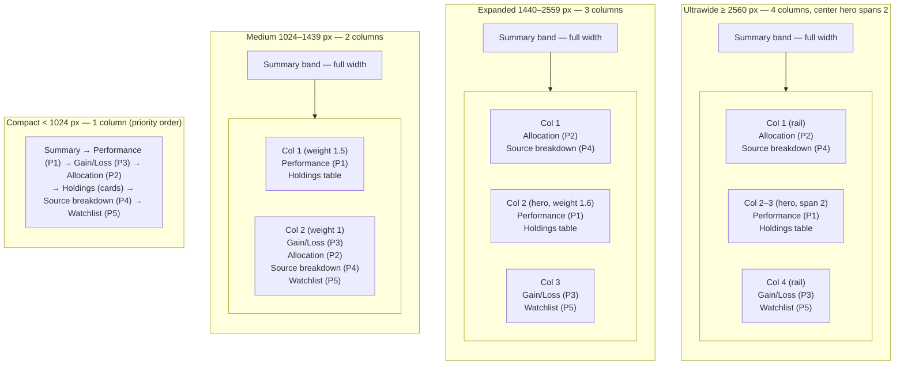

# Windows Ultrawide Portfolio Cockpit Layout

> **Issue:** [#2701](https://github.com/jrmoulckers/finance/issues/2701) — Design Windows ultrawide
> portfolio cockpit layout
> **Parent:** [#2176](https://github.com/jrmoulckers/finance/issues/2176)
> **Status:** Design (no native code in this PR)
> **Owner:** windows-engineer

This document specifies how the Finance Windows desktop client lays out the **investment portfolio
cockpit** on large (≥ 1440 px) and ultrawide (≥ 2560 px) monitors, how it reflows for narrow desktop
windows, and how Narrator / UI Automation and keyboard users navigate the resulting multi-panel
surface. It is a design spec only — it adds no Kotlin and changes no shipping screen. Implementation
will follow in a separate PR that mirrors the Android responsive pattern.

The cockpit composes the five panels called out in the issue — **allocation**, **source
breakdown**, **performance**, **gain/loss**, and **watchlist** — into a single dense workspace that
makes use of the horizontal space wasted by the current single-LazyColumn layout on wide displays.

---

## 1. Current shell — what we build on

The cockpit is an evolution of the existing investment surface, not a rewrite. Today's relevant
pieces:

| Concern               | Where it lives today                                                                                                  |
| --------------------- | --------------------------------------------------------------------------------------------------------------------- |
| App root + auth gate  | [`FinanceApp.kt`](../../apps/windows/src/main/kotlin/com/finance/desktop/FinanceApp.kt)                               |
| Navigation shell      | [`SidebarNavigation.kt`](../../apps/windows/src/main/kotlin/com/finance/desktop/navigation/SidebarNavigation.kt)      |
| Portfolio screen      | [`InvestmentScreen.kt`](../../apps/windows/src/main/kotlin/com/finance/desktop/screens/InvestmentScreen.kt)           |
| Portfolio state       | [`InvestmentViewModel.kt`](../../apps/windows/src/main/kotlin/com/finance/desktop/viewmodel/InvestmentViewModel.kt)   |
| Dashboard (2-col ref) | [`DashboardScreen.kt`](../../apps/windows/src/main/kotlin/com/finance/desktop/screens/DashboardScreen.kt)             |
| Widget board          | [`WidgetBoardScreen.kt`](../../apps/windows/src/main/kotlin/com/finance/desktop/screens/WidgetBoardScreen.kt)         |
| Narrator helpers      | [`NarratorSupport.kt`](../../apps/windows/src/main/kotlin/com/finance/desktop/accessibility/NarratorSupport.kt)       |
| Keyboard helpers      | [`KeyboardNavigation.kt`](../../apps/windows/src/main/kotlin/com/finance/desktop/accessibility/KeyboardNavigation.kt) |
| Accessibility audit   | [`AccessibilityAudit.kt`](../../apps/windows/src/main/kotlin/com/finance/desktop/accessibility/AccessibilityAudit.kt) |
| Theme + spacing       | [`FinanceDesktopTheme.kt`](../../apps/windows/src/main/kotlin/com/finance/desktop/theme/FinanceDesktopTheme.kt)       |
| High contrast         | [`HighContrastTheme.kt`](../../apps/windows/src/main/kotlin/com/finance/desktop/theme/HighContrastTheme.kt)           |

Key facts that constrain the design:

- **`InvestmentScreen`** is a single `LazyColumn` with one `Row` for the charts
  (`PerformanceChartCard` at `Modifier.weight(1.5f)` next to `AllocationChartCard` at
  `Modifier.weight(1f)`), followed by a full-width `PortfolioSummaryCard`, `HoldingsTableHeader`,
  and a stack of `HoldingRow`s. It does **not** measure available width, so on a 3440 px ultrawide
  monitor every panel is stretched edge to edge and most of the screen is whitespace.
- The screen is reachable as `Screen.Investments` in the `Screen` enum but is currently wired to a
  placeholder (`Screen.Investments -> {}`) in `FinanceApp.MainAppContent`. The cockpit work also
  closes that gap by routing `Screen.Investments` to the new layout.
- **`SidebarNavigation`** owns a collapsible rail that animates between `SIDEBAR_EXPANDED_WIDTH =
240.dp` and `SIDEBAR_COLLAPSED_WIDTH = 64.dp`. The portfolio content therefore never gets the full
  window width — the breakpoint logic must measure the **content pane**, not the window.
- State already exists for every metric the cockpit needs: `InvestmentUiState` exposes
  `totalPortfolioValue`, `totalDayChange`/`totalDayChangePercent`, `totalReturn`/
  `totalReturnPercent`, `holdings: List<HoldingUi>`, `performanceData: List<PerformancePoint>`,
  `allocationData: List<AllocationSlice>`, and `selectedRange: PerformanceRange`.
- **Spacing** comes from `FinanceDesktopTheme.spacing` (`xs = 4.dp` … `epic = 80.dp`); the cockpit
  uses these tokens for all gaps and gutters rather than hard-coded dp.

### Goals

1. Use horizontal space on ≥ 1440 px and ultrawide monitors with a deterministic multi-column panel
   grid.
2. Reflow gracefully down to a compact desktop window without horizontal scrolling (WCAG 2.2
   **1.4.10 Reflow**).
3. Keep Narrator, UI Automation, and keyboard parity with sighted users on every panel and chart,
   targeting **WCAG 2.2 AA**.
4. Mirror the Android responsive/`WindowSizeClass` pattern so business logic stays in `packages/` and
   the Windows layer remains a thin, testable UI.

### Non-goals

- No new business logic or repository changes — the cockpit consumes existing `InvestmentViewModel`
  state (and a small additive watchlist/source-breakdown slice noted in §10).
- No drag-to-rearrange / persisted custom layouts in this pass (tracked separately; the grid is
  deterministic per breakpoint).
- No changes to `packages/`, `services/`, `.github/workflows/`, or other apps.

---

## 2. Breakpoint strategy

Compose Desktop has no `WindowSizeClass` out of the box, so the cockpit introduces a small,
self-contained classifier that mirrors Android's `androidx.compose.material3.windowsizeclass`
buckets but is tuned for desktop and **measured on the content pane** (window width minus the live
sidebar width).

### 2.1 Tiers

| Tier          | Content-pane width  | Equivalent window width¹ | Columns | Intent                                                 |
| ------------- | ------------------- | ------------------------ | ------- | ------------------------------------------------------ |
| **Compact**   | `< 840.dp`          | `< 1024 px`              | 1       | Stacked single column, sidebar auto-collapses to rail. |
| **Medium**    | `840.dp – 1279.dp`  | `1024 – 1439 px`         | 2       | Today's 2-pane feel; charts beside a secondary stack.  |
| **Expanded**  | `1280.dp – 2199.dp` | `1440 – 2559 px`         | 3       | The "1440 px+" cockpit: left rail, hero center, right. |
| **Ultrawide** | `≥ 2200.dp`         | `≥ 2560 px`              | 4²      | Full cockpit with width cap + centered gutters.        |

¹ Approximate, assuming the expanded `240.dp` sidebar plus window chrome. The classifier never reads
the OS window size directly; it reads the measured content-pane width so the same code is correct
whether the sidebar is expanded or collapsed.

² The Ultrawide tier keeps **4 logical columns** but the center hero spans 2 of them, so the eye sees
a left rail · wide hero · right rail rhythm rather than four equal slabs.

These boundaries deliberately line up with the issue's `≥ 1440 px` (Expanded) and `≥ 2560 px`
(Ultrawide) callouts while expressing the real decision input in `dp`.

### 2.2 Classifier (proposed)

```kotlin
// apps/windows/src/main/kotlin/com/finance/desktop/screens/investment/PortfolioLayout.kt (new)
enum class PortfolioLayoutClass { Compact, Medium, Expanded, Ultrawide }

object PortfolioBreakpoints {
    val medium = 840.dp
    val expanded = 1280.dp
    val ultrawide = 2200.dp

    /** Cap the cockpit content so line length stays readable on very wide panels. */
    val maxCockpitWidth = 2960.dp
}

fun classify(contentWidth: Dp): PortfolioLayoutClass = when {
    contentWidth < PortfolioBreakpoints.medium -> PortfolioLayoutClass.Compact
    contentWidth < PortfolioBreakpoints.expanded -> PortfolioLayoutClass.Medium
    contentWidth < PortfolioBreakpoints.ultrawide -> PortfolioLayoutClass.Expanded
    else -> PortfolioLayoutClass.Ultrawide
}
```

The root of the cockpit is a `BoxWithConstraints` whose `maxWidth` feeds `classify(...)`. Because the
sidebar lives in a sibling `Row` slot in `SidebarNavigation`, `maxWidth` already excludes the rail —
no manual subtraction needed.

```kotlin
@Composable
fun PortfolioCockpitScreen(modifier: Modifier = Modifier) {
    BoxWithConstraints(modifier.fillMaxSize()) {
        val layoutClass = classify(maxWidth)
        val content = Modifier
            .widthIn(max = PortfolioBreakpoints.maxCockpitWidth)
            .align(Alignment.TopCenter) // centered gutters once capped
        when (layoutClass) {
            PortfolioLayoutClass.Compact -> CompactColumn(content)
            PortfolioLayoutClass.Medium -> MediumGrid(content)
            PortfolioLayoutClass.Expanded -> ExpandedGrid(content)
            PortfolioLayoutClass.Ultrawide -> UltrawideGrid(content)
        }
    }
}
```

### 2.3 Sidebar coupling

To avoid wasting the rail's width on small windows, the cockpit asks `SidebarNavigation` to
auto-collapse below **Medium**. This is additive to the existing manual hamburger toggle
(`onToggleExpanded`): the user can still expand it, but Compact defaults to the `64.dp` rail so the
single content column gets maximum room. The auto-collapse is a _preference nudge_, never a lock —
manual state from `rememberSaveable` always wins for the session.

---

## 3. Cockpit panels

Five panels plus a summary band and a holdings table. Each panel is a self-contained composable that
takes `Modifier` + its slice of `InvestmentUiState`, so it can be placed in any column without
knowing the tier.

| #   | Panel                | Source composable / data                                                            | Primary data                                                           |
| --- | -------------------- | ----------------------------------------------------------------------------------- | ---------------------------------------------------------------------- |
| —   | **Summary band**     | `PortfolioSummaryCard` (existing)                                                   | `totalPortfolioValue`, `totalDayChange…`, `totalReturn…`               |
| P1  | **Performance**      | `PerformanceChartCard` (existing Canvas line chart + `PerformanceRange` chips)      | `performanceData: List<PerformancePoint>`, `selectedRange`             |
| P2  | **Allocation**       | `AllocationChartCard` (existing Canvas donut + legend)                              | `allocationData: List<AllocationSlice>`                                |
| P3  | **Gain / Loss**      | New `GainLossPanel` — reuses `ChangeIndicator` styling + top movers from `holdings` | day & total change, best/worst `HoldingUi` by `dayChangePercent`       |
| P4  | **Source breakdown** | New `SourceBreakdownPanel` — value grouped by custodian/account                     | investment `AccountRepository` rows (additive UI-state field, see §10) |
| P5  | **Watchlist**        | New `WatchlistPanel` — tracked, not-necessarily-held symbols                        | additive `watchlist: List<HoldingUi>` UI-state field (see §10)         |
| —   | **Holdings table**   | `HoldingsTableHeader` + `HoldingRow` (existing); reflows to cards in Compact        | `holdings: List<HoldingUi>`                                            |

Panel sizing rules (apply in every tier):

- **Min panel width:** `360.dp` for chart panels (P1, P2), `320.dp` for list panels (P3–P5). If a
  column cannot host a panel at its min width, the grid drops a column (see §5).
- **Min chart heights:** performance line ≥ `200.dp` (today's value), allocation donut ≥ `160.dp`.
  Charts grow with available height on Expanded/Ultrawide but never shrink below these floors.
- **Holdings table min width:** `720.dp`. Below that the table reflows to stacked `HoldingRow`
  cards (Compact).

---

## 4. Multi-column panel grid

The grid is described as a 12-track conceptual system; each tier maps panels to track spans. In
Compose this is realized with nested `Row`/`Column` + `Modifier.weight`, not a literal CSS grid.



### 4.1 Column assignment matrix

| Panel                 | Compact (1col)   | Medium (2col) | Expanded (3col) | Ultrawide (4col) |
| --------------------- | ---------------- | ------------- | --------------- | ---------------- |
| Summary band          | Row 1 (full)     | Full width    | Full width      | Full width       |
| Performance (P1)      | Row 2            | Col 1 top     | Col 2 top       | Col 2–3 top      |
| Gain/Loss (P3)        | Row 3            | Col 2 top     | Col 3 top       | Col 4 top        |
| Allocation (P2)       | Row 4            | Col 2 mid     | Col 1 top       | Col 1 top        |
| Holdings table        | Row 5 (as cards) | Col 1 bottom  | Col 2 bottom    | Col 2–3 bottom   |
| Source breakdown (P4) | Row 6            | Col 2 lower   | Col 1 bottom    | Col 1 bottom     |
| Watchlist (P5)        | Row 7            | Col 2 bottom  | Col 3 bottom    | Col 4 bottom     |

Rationale:

- **Performance is always the hero.** It is the widest panel in every multi-column tier (the
  existing `weight(1.5f)` bias becomes `weight(1.6f)` in Expanded and a 2-column span in Ultrawide).
- **Allocation + Source breakdown share the left rail** because both answer "what is this portfolio
  made of?" — one by asset class, one by custodian. Keeping them adjacent supports comparison.
- **Gain/Loss + Watchlist share the right rail** because both are "what should I act on?" surfaces —
  movers and tracked candidates.
- **Holdings table sits under Performance** so the detail rows are below the chart they explain, an
  arrangement Narrator users also experience as "chart, then the table behind it" (see §6.4).

### 4.2 Gutters, padding, and the width cap

- Outer screen padding stays at `FinanceDesktopTheme.spacing.xxl` (`24.dp`), matching the current
  `InvestmentScreen`.
- Inter-column gutter: `spacing.xxl` (`24.dp`) on Expanded/Ultrawide, `spacing.lg` (`16.dp`) on
  Medium.
- Inter-row gutter within a column: `spacing.lg` (`16.dp`).
- On **Ultrawide**, total cockpit content is capped at `PortfolioBreakpoints.maxCockpitWidth =
2960.dp` and centered, leaving symmetric gutters. This keeps the performance line chart from
  becoming an unreadably long, low-slope sliver on a 3440–5120 px monitor and keeps reading-line
  lengths within Fluent guidance.

---

## 5. Reflow rules for narrow desktop windows

The cockpit is resize-continuous: dragging the window edge re-classifies on every frame via the
`BoxWithConstraints` recomposition. Rules, in priority order:

1. **Drop a column before shrinking a panel past its min.** When `contentWidth / columns <
panelMinWidth`, step down one tier (Ultrawide → Expanded → Medium → Compact). This guarantees no
   panel is squished below `320.dp`/`360.dp`.
2. **Sidebar auto-collapse below Medium** (see §2.3) to reclaim `176.dp` for the single column.
3. **Holdings table → card list in Compact.** Below the `720.dp` table min, each `HoldingRow`
   becomes a stacked card showing symbol/name on line 1 and value/day/total on line 2, preserving the
   existing merged `contentDescription`. No horizontal scrolling is introduced.
4. **Charts keep their height floors** (`200.dp` / `160.dp`) and go full-column-width; the donut
   legend wraps under the donut (already the case in `AllocationChartCard`).
5. **Performance range chips wrap** to a second line in Compact instead of horizontally scrolling.
6. **No two-axis scrolling, ever.** The cockpit only ever scrolls vertically. WCAG 2.2 **1.4.10
   Reflow** is satisfied down to a 320 CSS-px-equivalent viewport and at up to 400% OS display
   scaling, because every tier resolves to a single vertical scroll with full-width panels at its
   floor.
7. **System font scaling.** Because all type uses the Material 3 scale from `FinanceDesktopTheme`
   (Segoe UI via `FontFamily.Default`) and panels are height-flexible, increasing Windows text size
   grows panels vertically and triggers normal tier step-downs rather than clipping (WCAG **1.4.4
   Resize Text**).

Reflow is deterministic and pure: the same `contentWidth` always yields the same layout, which makes
the tier classifier and per-tier composables unit-testable with a fake `maxWidth`.

---

## 6. Panel focus order and keyboard navigation

The cockpit must be fully operable by keyboard alone (WCAG 2.2 **2.1.1 Keyboard**) with a logical,
predictable order (**2.4.3 Focus Order**) and a visible focus indicator (**2.4.7 Focus Visible**).

### 6.1 Reading and focus order

Focus order follows visual reading order — top-to-bottom, then left-to-right — **independent of the
column the panel physically sits in**. The DOM/semantics order is authored to match, so Narrator's
linear reading and Tab order agree:

```text
Sidebar rail ▸ Summary band ▸ Performance (P1) ▸ Holdings table
   ▸ Allocation (P2) ▸ Source breakdown (P4) ▸ Gain/Loss (P3) ▸ Watchlist (P5)
```

This single canonical order is used to build the grid in every tier — the visual column placement
changes, but the traversal sequence does not, so muscle memory is stable across monitor sizes.

### 6.2 Landing focus

On entering the cockpit, `rememberInitialFocus()`
([`KeyboardNavigation.kt`](../../apps/windows/src/main/kotlin/com/finance/desktop/accessibility/KeyboardNavigation.kt))
places focus on the **Performance panel heading**, not the sidebar — keyboard users land on
meaningful content, consistent with the helper's documented intent.

### 6.3 Panel-level (pane) navigation

Each panel is a **focus group / landmark**. Two complementary mechanisms:

| Keys                | Action                                                                     |
| ------------------- | -------------------------------------------------------------------------- |
| `Tab` / `Shift+Tab` | Move through every focusable control in canonical order (§6.1).            |
| `F6` / `Shift+F6`   | Jump to the next / previous **panel** (Windows-standard pane cycling).     |
| `Arrow keys`        | Move within a panel's list/table/legend via `Modifier.arrowKeyNavigation`. |
| `Enter` / `Space`   | Activate the focused control (`Modifier.activateOnEnterOrSpace`).          |
| `Esc`               | Dismiss any transient popover (`Modifier.dismissOnEscape`).                |

`F6`/`Shift+F6` is implemented with a list of per-panel `FocusRequester`s; pressing it requests focus
on the next panel's heading. This gives a fast "skip between panels" affordance that scales as more
panels appear on Ultrawide, satisfying a sighted-keyboard user's need to traverse a dense grid
quickly. The chosen keys do not collide with the existing global `Ctrl+1…Ctrl+9` navigation or
`Ctrl+Shift+N`/`F1` shortcuts wired in `FinanceApp`/`SidebarNavigation`.

### 6.4 Within-panel order specifics

- **Performance (P1):** heading → range chips (`1W…All`, each focusable, `Tab` between them) → chart
  summary node → (chart is a single non-interactive summary stop, see §7).
- **Holdings table:** header row is a single labelled stop; each `HoldingRow` is one focus stop with
  a merged description; `Up/Down` arrows move row-to-row.
- **Allocation (P2):** heading → donut summary node → legend rows (`Up/Down` between slices).
- **Gain/Loss (P3) & Watchlist (P5):** heading → summary node → item rows (`Up/Down`).

### 6.5 Focus visibility and obscuring

Focused panels and rows render the Material 3 focus indicator at ≥ 3:1 contrast against their
background (WCAG **1.4.11 Non-text Contrast**), and because the cockpit only scrolls vertically with
sticky-free panels, a focused element is never hidden behind a fixed overlay (WCAG 2.2 **2.4.11 Focus
Not Obscured (Minimum)**). The auto-collapsing sidebar never steals focus on resize.

---

## 7. Narrator / UI Automation semantics for chart summaries

Canvas charts have no intrinsic accessibility tree, so each chart is exposed to Narrator and UI
Automation as a **single labelled summary node** plus an optional **data-table alternative**. This
builds on the existing `semantics { contentDescription = … }` already present on the performance and
allocation `Canvas` calls and the helpers in
[`NarratorSupport.kt`](../../apps/windows/src/main/kotlin/com/finance/desktop/accessibility/NarratorSupport.kt).

### 7.1 Heading structure

A single heading hierarchy lets Narrator users jump with `H` / `Shift+H`:

| Level | Element                                                                                                     |
| ----- | ----------------------------------------------------------------------------------------------------------- |
| H1    | "Investment Portfolio" (screen title, `Modifier.narratorHeading()`)                                         |
| H2    | Each panel title: "Performance", "Allocation", "Gain and Loss", "Source breakdown", "Watchlist", "Holdings" |

Every panel root also carries `Modifier.narratorTestTag("cockpit.panel.<name>")` so Accessibility
Insights and UI Automation tests can address panels deterministically.

### 7.2 Chart summary text alternatives (WCAG 1.1.1 Non-text Content)

Each chart's summary node phrases the data as a complete sentence using `Modifier.narratorLabel(...)`
(or `narratorMerged(...)` where child nodes would be noise):

- **Performance:** _"Performance, 1 month. Portfolio rose from $35,000 to $42,112, up 21.2 percent.
  Range: low $34,800 on day 6, high $42,300 on day 27."_ — computed from `performanceData`
  (`minOf`/`maxOf`/first/last) and `selectedRange`. Numbers are spelled with words for symbols
  ("percent", "dollars") per the `NarratorSupport` guidance.
- **Allocation:** the donut already emits _"Asset allocation: US Stocks 56%, International 12%,
  Bonds 20%, …"_; this is retained and each legend row keeps its `"<label>: <percent>%"` description.
- **Gain/Loss:** _"Today plus $280.38, up 0.69 percent. Total return plus $7,112.58, up 21.2
  percent. Best mover MSFT up 1.52 percent, worst VTSAX down 0.44 percent."_

### 7.3 Data-table fallback

Each chart panel offers a **"View as table"** toggle (icon button, `Role.Button`, labelled) that
swaps the `Canvas` for a real focusable table of the same series (date/value for performance,
class/percent/value for allocation). This is the keyboard/Narrator path to per-point detail without
fighting a pixel chart, and it satisfies **1.1.1** beyond the summary sentence. The toggle state is
exposed via `Modifier.narratorState("chart" / "table")`.

### 7.4 Live regions

Dynamic announcements use the existing live-region helpers:

- **Polite** (`Modifier.narratorLiveRegion()`): changing the `PerformanceRange` chip re-announces the
  recomputed performance summary ("Performance, 3 months. Up 9.4 percent."); background price/sync
  refreshes that move totals re-announce the summary band.
- **Assertive** (`Modifier.narratorAssertiveLiveRegion()`): only for threshold/error events (e.g.
  "Portfolio down more than 5 percent today" or a quote-feed failure), reusing the sparing-use policy
  documented in `NarratorSupport`.

The summary band is itself a polite live region so a value change after a sync is announced without
the user navigating to it.

### 7.5 UI Automation name / role / value (WCAG 4.1.2)

- Range chips, the table toggle, and reorder/refresh controls expose `Role.Button`/`Role.Tab`,
  a `contentDescription` name, and a `stateDescription` value ("selected", "table").
- Panels expose names via their H2 headings; the cockpit root keeps a `contentDescription = "Investment
Portfolio cockpit"` so the surface is announceable as a whole.
- Legend swatches and the donut are decorative children under a merged node — Narrator reads the
  panel summary once, not 6 colored boxes.

---

## 8. WCAG 2.2 AA conformance map

| Criterion                             | How the cockpit meets it                                                                       |
| ------------------------------------- | ---------------------------------------------------------------------------------------------- |
| 1.1.1 Non-text Content                | Chart summary sentences (§7.2) + "View as table" fallback (§7.3).                              |
| 1.3.1 Info and Relationships          | H1/H2 heading tree (§7.1); panels as landmarks; table semantics for holdings.                  |
| 1.3.2 Meaningful Sequence             | Canonical reading order authored to match focus order (§6.1).                                  |
| 1.4.4 Resize Text                     | Material 3 scale + height-flexible panels; tiers step down under font scaling (§5).            |
| 1.4.10 Reflow                         | Single vertical scroll at every tier; no 2-axis scroll to 320 px-equiv / 400% (§5).            |
| 1.4.11 Non-text Contrast              | Focus ring + chart series colors meet ≥ 3:1; high-contrast scheme via `HighContrastTheme`.     |
| 2.1.1 Keyboard                        | All controls reachable/operable via Tab/F6/Arrows/Enter/Esc (§6).                              |
| 2.4.3 Focus Order                     | Deterministic canonical order independent of column placement (§6.1).                          |
| 2.4.7 Focus Visible                   | Material 3 focus indicator on panels and rows (§6.5).                                          |
| 2.4.11 Focus Not Obscured (Minimum) ★ | Vertical-only scroll, no fixed overlays cover focused content (§6.5).                          |
| 1.4.13 Content on Hover or Focus      | Any chart tooltip/popover is dismissable with `Esc` and hoverable; not required for core data. |
| 4.1.2 Name, Role, Value               | Semantics roles + names + state on every control (§7.5).                                       |

★ New in WCAG 2.2.

The cockpit reuses the high-contrast path: `FinanceDesktopTheme(highContrast = isHighContrastEnabled())`
resolves a high-contrast `colorScheme` via
[`HighContrastTheme.kt`](../../apps/windows/src/main/kotlin/com/finance/desktop/theme/HighContrastTheme.kt),
and chart series colors switch to the high-contrast-safe palette when that mode is active so the
performance line and donut slices remain distinguishable.

---

## 9. Visual + Fluent design notes

- **Spacing** uses only `FinanceDesktopTheme.spacing` tokens; no magic numbers, matching the rest of
  the Windows app.
- **Cards** stay `ElevatedCard`/`Card` with the existing `MaterialTheme.shapes.medium` rounding, so
  the cockpit reads as the same surface family as Dashboard and Widget Board.
- **Typography** stays Segoe UI via `FontFamily.Default`; panel titles use `titleMedium`
  SemiBold (matching `PerformanceChartCard`/`AllocationChartCard` today), the screen title uses
  `titleLarge`.
- **Density:** Ultrawide raises information density but never below the per-panel min sizes; the
  width cap (§4.2) preserves comfortable line lengths.
- **Gain/loss color** keeps the existing convention (green `0xFF2E7D32` for positive, theme `error`
  for negative) and is **never** the sole signal — every figure carries a `+`/`-` sign and a
  Narrator-readable direction word, so color-blind and Narrator users get the same meaning (supports
  1.4.1 Use of Color).

---

## 10. Implementation outline (next PR)

Files this design implies, all under `apps/windows/` (no shared-package edits):

| File                                                 | Change                                                                                                                                              |
| ---------------------------------------------------- | --------------------------------------------------------------------------------------------------------------------------------------------------- |
| `screens/investment/PortfolioLayout.kt` (new)        | `PortfolioLayoutClass`, `PortfolioBreakpoints`, `classify()` (pure, testable).                                                                      |
| `screens/investment/PortfolioCockpitScreen.kt` (new) | `BoxWithConstraints` root + the four per-tier grid composables.                                                                                     |
| `screens/investment/panels/*.kt` (new)               | `GainLossPanel`, `SourceBreakdownPanel`, `WatchlistPanel`; extract `PerformancePanel`/`AllocationPanel` from `InvestmentScreen`.                    |
| `screens/InvestmentScreen.kt`                        | Delegate to `PortfolioCockpitScreen`; keep existing cards as panel internals.                                                                       |
| `viewmodel/InvestmentViewModel.kt`                   | Additive: `watchlist: List<HoldingUi>` and `sourceBreakdown: List<SourceSlice>` derived from existing `AccountRepository` data (no new repository). |
| `FinanceApp.kt`                                      | Route `Screen.Investments -> PortfolioCockpitScreen()` (replaces placeholder).                                                                      |
| `accessibility/AccessibilityAudit.kt`                | Add a "Portfolio Cockpit" audit checklist section.                                                                                                  |

The classifier and per-tier composables are written as pure functions of `(contentWidth, uiState)`
so they unit-test with a fake width and a fixed `InvestmentUiState`, mirroring how the rest of the
Windows ViewModel/screen split is tested.

### Verification checklist (for the implementation PR)

- [ ] Resize from 800 px to 3440 px shows Compact → Medium → Expanded → Ultrawide with no horizontal
      scrollbar and no panel below its min width.
- [ ] Narrator (`Win+Ctrl+Enter`): `H`/`Shift+H` walks H1 → six H2 panel titles; each chart reads a
      full summary sentence; "View as table" exposes per-point data.
- [ ] Keyboard-only: `Tab` and `F6` traverse panels in canonical order; range chips, table toggles,
      and holding rows are all reachable and operable; `Esc` dismisses popovers.
- [ ] High contrast mode (`HighContrastTheme`) keeps chart series and focus ring distinguishable.
- [ ] 400% Windows display scaling and large text size reflow to Compact without clipping.
- [ ] Accessibility Insights for Windows reports no UI Automation tree errors on the cockpit.

---

## 11. References

- Issue [#2701](https://github.com/jrmoulckers/finance/issues/2701) · Parent
  [#2176](https://github.com/jrmoulckers/finance/issues/2176)
- [`apps/windows/README.md`](../../apps/windows/README.md) — Windows build & packaging
- [`InvestmentScreen.kt`](../../apps/windows/src/main/kotlin/com/finance/desktop/screens/InvestmentScreen.kt)
  · [`InvestmentViewModel.kt`](../../apps/windows/src/main/kotlin/com/finance/desktop/viewmodel/InvestmentViewModel.kt)
- [`SidebarNavigation.kt`](../../apps/windows/src/main/kotlin/com/finance/desktop/navigation/SidebarNavigation.kt)
  · [`FinanceApp.kt`](../../apps/windows/src/main/kotlin/com/finance/desktop/FinanceApp.kt)
- [`NarratorSupport.kt`](../../apps/windows/src/main/kotlin/com/finance/desktop/accessibility/NarratorSupport.kt)
  · [`KeyboardNavigation.kt`](../../apps/windows/src/main/kotlin/com/finance/desktop/accessibility/KeyboardNavigation.kt)
  · [`AccessibilityAudit.kt`](../../apps/windows/src/main/kotlin/com/finance/desktop/accessibility/AccessibilityAudit.kt)
- [`FinanceDesktopTheme.kt`](../../apps/windows/src/main/kotlin/com/finance/desktop/theme/FinanceDesktopTheme.kt)
  · [`HighContrastTheme.kt`](../../apps/windows/src/main/kotlin/com/finance/desktop/theme/HighContrastTheme.kt)
- [W3C WCAG 2.2](https://www.w3.org/TR/WCAG22/) — conformance target (AA)
