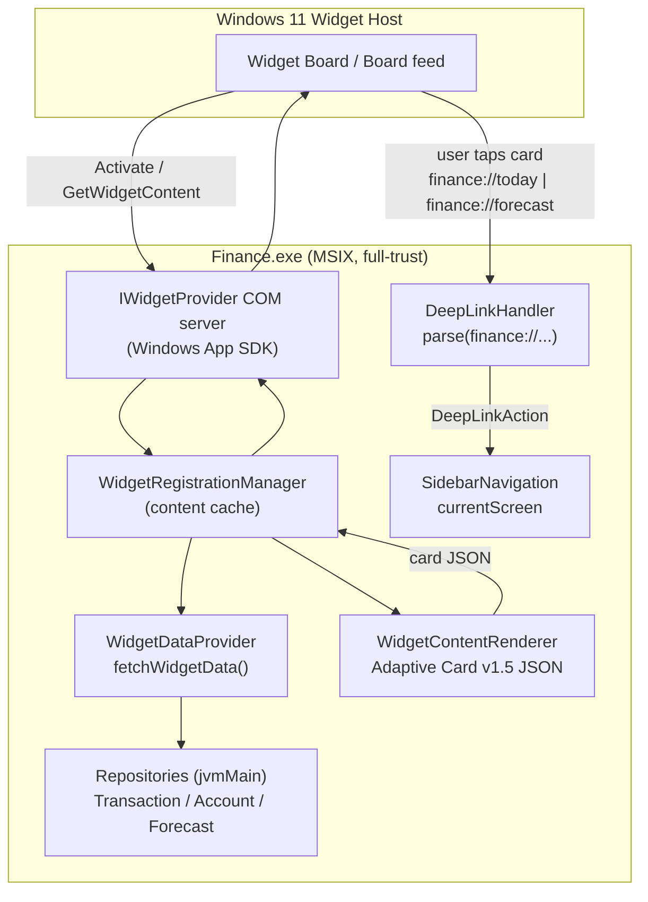
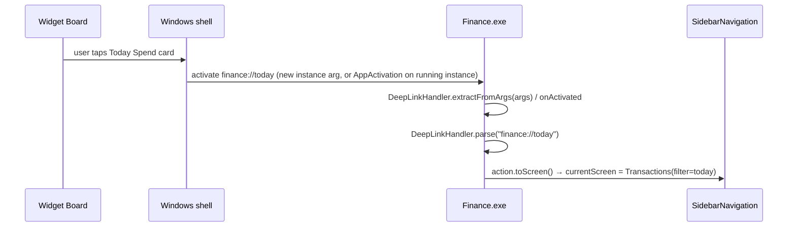
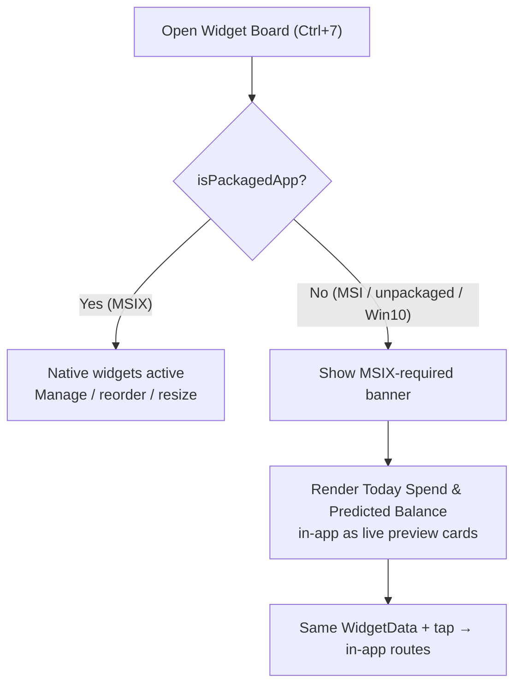
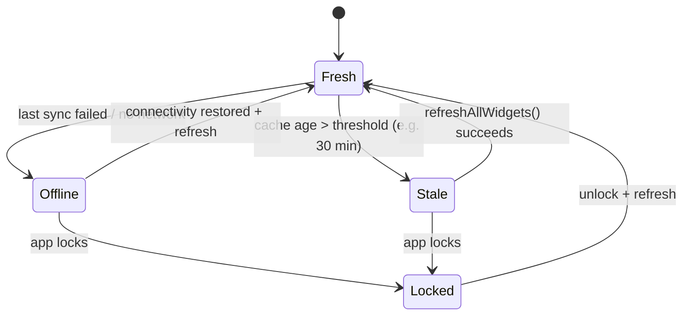

# Windows Widget Board — Native Shell & Packaging Plan

> **Issue:** [#2704](https://github.com/jrmoulckers/finance/issues/2704) — _Build Windows Widget Board native shell and packaging plan_
> **Parent epic:** #2384
> **Status:** Plan / design — no native build performed in this PR.
> **Owner:** windows-engineer

This document is the engineering plan for shipping the two new Windows 11
**Widget Board** surfaces requested by #2704 — a **Today Spend** card and a
**Predicted Balance** card — as native widgets backed by the existing Compose
Desktop app, plus the MSIX packaging and Microsoft Store work that the surface
depends on. It also specifies the deep-link routing into in-app finance views,
the privacy behaviour on the lock screen, the last-updated / stale-offline
state, and the in-app
[`WidgetBoardScreen`](../../apps/windows/src/main/kotlin/com/finance/desktop/screens/WidgetBoardScreen.kt)
fallback that must work when native widgets are unavailable.

Steps that cannot be completed without Visual Studio, the Windows App SDK, the
Windows SDK packaging tools, or a code-signing certificate are flagged inline
with **🔒 TOOLCHAIN-BLOCKED — HUMAN ACTION** so they can be routed to a human
operator with the right environment.

---

## 1. Scope

| In scope                                                                                   | Out of scope                                                          |
| ------------------------------------------------------------------------------------------ | --------------------------------------------------------------------- |
| Native widget surface + deep-link architecture for **Today Spend** & **Predicted Balance** | Forecasting algorithm itself (owned by `packages/` → @kmp-engineer)   |
| Windows App SDK / Widgets (`IWidgetProvider`) integration approach                         | Android/iOS/web widget parity (owned by the respective app engineers) |
| MSIX manifest requirements + Microsoft Store constraints                                   | Backend/API changes (`services/api/` → @backend-engineer)             |
| Deep-link routing into in-app finance views                                                | New CI workflow YAML (`.github/workflows/` → @devops-engineer)        |
| Privacy (hide sensitive amounts on lock), stale/offline state                              |                                                                       |
| In-app `WidgetBoardScreen` fallback path                                                   |                                                                       |

---

## 2. Current state (grounded in code)

The repository already contains a substantial widget scaffold. This plan builds
on it rather than starting from scratch.

| Concern                | Where it lives today                                                                                                                                                                                                                  | Notes                                                                                                                                              |
| ---------------------- | ------------------------------------------------------------------------------------------------------------------------------------------------------------------------------------------------------------------------------------- | -------------------------------------------------------------------------------------------------------------------------------------------------- |
| Widget catalog         | [`WidgetRegistrationManager.kt`](../../apps/windows/src/main/kotlin/com/finance/desktop/widgets/WidgetRegistrationManager.kt) — `FinanceWidgetType` enum                                                                              | Currently `NET_WORTH`, `BUDGET_OVERVIEW`, `RECENT_TRANSACTIONS`, `GOALS_PROGRESS`, `SPENDING_TRENDS`. No Today Spend / Predicted Balance type yet. |
| Data aggregation       | [`WidgetDataProvider.kt`](../../apps/windows/src/main/kotlin/com/finance/desktop/widgets/WidgetDataProvider.kt) — `WidgetData.fetchWidgetData()`                                                                                      | `todaySpendingFormatted` is already computed (but only surfaced inside the Net Worth card). **No predicted-balance field exists.**                 |
| Adaptive Card render   | [`WidgetContentRenderer.kt`](../../apps/windows/src/main/kotlin/com/finance/desktop/widgets/WidgetContentRenderer.kt)                                                                                                                 | Emits Adaptive Cards v1.5 JSON with `fallbackText` for Narrator. One `render*Card` function per widget type.                                       |
| Board management UI    | [`WidgetBoardScreen.kt`](../../apps/windows/src/main/kotlin/com/finance/desktop/screens/WidgetBoardScreen.kt) + [`WidgetBoardViewModel.kt`](../../apps/windows/src/main/kotlin/com/finance/desktop/viewmodel/WidgetBoardViewModel.kt) | In-app `Screen.Widgets` (Ctrl+7). Already renders an MSIX-required banner when `!isPackaged`.                                                      |
| Settings widget status | [`WidgetViewModel.kt`](../../apps/windows/src/main/kotlin/com/finance/desktop/viewmodel/WidgetViewModel.kt)                                                                                                                           | Exposes per-type registration status + refresh.                                                                                                    |
| Deep links             | [`DeepLinkHandler.kt`](../../apps/windows/src/main/kotlin/com/finance/desktop/navigation/DeepLinkHandler.kt)                                                                                                                          | Parses `finance://` → `DeepLinkAction`. Routes for `accounts`/`transactions`/`budgets`/`import`/`settings`/`sync` only.                            |
| App-startup wiring     | [`Main.kt`](../../apps/windows/src/main/kotlin/com/finance/desktop/Main.kt)                                                                                                                                                           | `widgetManager.initialize()` on start, `dispose()` on close.                                                                                       |
| MSIX manifest          | [`AppxManifest.xml`](../../apps/windows/packaging/AppxManifest.xml)                                                                                                                                                                   | Declares `com.microsoft.windows.widgets` extension + a COM server + `finance://` protocol + toast activation.                                      |
| Packaging pipeline     | [`build-msix.ps1`](../../apps/windows/packaging/build-msix.ps1), [`build.gradle.kts`](../../apps/windows/build.gradle.kts)                                                                                                            | Gradle produces **MSI/EXE only**; MSIX is assembled by the PowerShell pipeline via Windows SDK tooling.                                            |

### 2.1 Known gaps this plan must close

1. **No Today Spend or Predicted Balance widget type.** Both must be added to
   `FinanceWidgetType`, the renderer, and the manifest `<Definitions>`.
2. **No predicted-balance data source.** `WidgetData` has no forecast field;
   the projection itself belongs in the shared `packages/` layer (see §4.3).
3. **COM server is a stub.** The manifest references a `ClassId`, but there is
   **no real `IWidgetProvider` COM implementation** — the manager only caches
   Adaptive Card JSON. A genuine provider requires the Windows App SDK (§5).
4. **`DeepLinkAction` is parsed but not routed to a screen.** `DeepLinkHandler`
   is registered in DI ([`PlatformModule.kt`](../../apps/windows/src/main/kotlin/com/finance/desktop/di/PlatformModule.kt))
   and `extractFromArgs` exists, but nothing maps a `DeepLinkAction` onto the
   `Screen` selected in
   [`SidebarNavigation.kt`](../../apps/windows/src/main/kotlin/com/finance/desktop/navigation/SidebarNavigation.kt). §7 closes this.
5. **Manifest widget definitions are incomplete.** Only 3 of the 5 existing
   types are declared; the 2 new cards must be added and the set reconciled.
6. **`isPackagedApp` is a heuristic** (env var / system property), not the real
   Windows package-identity API. §5.4 tracks replacing it.

---

## 3. Target widget surfaces

### 3.1 Today Spend card

| Attribute           | Value                                                                                        |
| ------------------- | -------------------------------------------------------------------------------------------- |
| Widget id           | `com.finance.widget.todayspend`                                                              |
| `FinanceWidgetType` | `TODAY_SPEND`                                                                                |
| Sizes               | `small`, `medium`                                                                            |
| Headline            | Total spend posted **today** (`WidgetData.todaySpendingFormatted`, already computed)         |
| Secondary           | Day-over-day delta vs. yesterday; count of transactions today                                |
| Tap target          | `finance://today` → in-app Dashboard / Transactions filtered to today                        |
| Data source         | `TransactionRepository` via existing `FinancialAggregator.totalSpending(txns, today, today)` |

The data is already available; the work is a dedicated card + render function +
manifest definition + deep-link route. No new aggregation is required.

### 3.2 Predicted Balance card

| Attribute           | Value                                                                                                                    |
| ------------------- | ------------------------------------------------------------------------------------------------------------------------ |
| Widget id           | `com.finance.widget.predictedbalance`                                                                                    |
| `FinanceWidgetType` | `PREDICTED_BALANCE`                                                                                                      |
| Sizes               | `medium`, `large`                                                                                                        |
| Headline            | Projected end-of-period balance (e.g. end-of-month)                                                                      |
| Secondary           | Current balance, projected delta, confidence/period label, "as of" date                                                  |
| Tap target          | `finance://forecast` → in-app forecast / cash-flow view                                                                  |
| Data source         | **New** `WidgetData.predictedBalanceFormatted` (+ period + delta) sourced from the shared forecast engine in `packages/` |

> **Dependency:** the projection model is owned by `packages/` (@kmp-engineer).
> The Windows app must consume it through a repository/use-case exposed to
> `jvmMain`, mirroring how Android consumes the same engine. If no forecast
> use-case is yet exported, this card is **blocked on a shared-package API** and
> should ship behind a feature flag with a graceful "Forecast unavailable"
> Adaptive Card body until the dependency lands.

### 3.3 Adaptive Card layout (both cards)

Both cards reuse the renderer conventions already in
[`WidgetContentRenderer.kt`](../../apps/windows/src/main/kotlin/com/finance/desktop/widgets/WidgetContentRenderer.kt):
schema `1.5`, a top-level `fallbackText` summarising the figures for Narrator,
and `altText` on any graphical element. Amounts are **pre-formatted** in
`WidgetDataProvider` — the renderer never performs currency math.

```text
┌─ Today Spend (medium) ───────┐    ┌─ Predicted Balance (medium) ─────┐
│ Finance · Today              │    │ Finance · Forecast               │
│ $128.40   ▲ $12 vs yesterday │    │ End of month: $2,310.55          │
│ 6 transactions               │    │ Now $2,980.10 · ▼ $669 projected │
│ Updated at 08:41             │    │ As of Jun 22 · Updated 08:41     │
└──────────────────────────────┘    └──────────────────────────────────┘
```

---

## 4. Native widget surface + deep-link architecture

### 4.1 End-to-end flow



### 4.2 Registration model

Windows 11 widgets are **declared in the MSIX manifest**, not registered at
runtime. The OS widget host discovers the provider from the
`com.microsoft.windows.widgets` app-extension and activates the COM server by
`ClassId`. Therefore:

- The provider only exists when the app is **installed as MSIX** (an MSI install
  cannot host widgets — see §6.4). This is precisely why
  [`WidgetBoardScreen`](../../apps/windows/src/main/kotlin/com/finance/desktop/screens/WidgetBoardScreen.kt)
  shows the "requires MSIX" banner when `!isPackaged` (§8).
- `WidgetRegistrationManager.initialize()` (called from
  [`Main.kt`](../../apps/windows/src/main/kotlin/com/finance/desktop/Main.kt)) pre-warms the content cache so the COM
  callback can answer the host synchronously.

### 4.3 Data path

`WidgetDataProvider.fetchWidgetData()` already aggregates accounts,
transactions, budgets and goals into a pre-formatted `WidgetData`. The plan
extends `WidgetData` with:

```kotlin
// Additions to WidgetData (apps/windows/.../widgets/WidgetDataProvider.kt)
val todaySpendDeltaFormatted: String = "",      // Today Spend secondary line
val predictedBalanceFormatted: String = "",     // Predicted Balance headline
val predictedBalanceDeltaFormatted: String = "",
val forecastPeriodLabel: String = "",           // e.g. "End of month"
val forecastAsOf: String = "",                  // "As of Jun 22"
```

The Today Spend fields derive from data already fetched. The Predicted Balance
fields must be populated from the shared forecast engine (§3.2). When the
forecast call fails or is unavailable, fall back to empty strings and render an
"unavailable" body — never crash the provider (the existing `try/catch` in
`fetchWidgetData()` already returns defaults on failure).

---

## 5. Windows App SDK / Widgets integration approach

### 5.1 Provider contract

Native Windows widgets require a COM class implementing **`IWidgetProvider`**
(and `IWidgetProvider2` for customisation) from the **Windows App SDK**. The
host calls into it for `CreateWidget`, `Activate`, `Deactivate`,
`OnWidgetContextChanged`, and `DeleteWidget`. Our provider answers each with the
cached Adaptive Card JSON for the requested widget id.

The manifest already wires a COM server and class id in
[`AppxManifest.xml`](../../apps/windows/packaging/AppxManifest.xml):

```xml
<com:Class Id="2b1d9145-edf5-4f48-923c-bf03c8d715c5" DisplayName="Finance Widget Provider" />
...
<Activation><CreateInstance ClassId="2b1d9145-edf5-4f48-923c-bf03c8d715c5" /></Activation>
```

…but **no Kotlin/JVM code implements that class yet**. There are two viable
implementation strategies; both are toolchain-blocked:

- **Option A — Windows App SDK C#/C++ shim.** A small WinAppSDK stub process
  hosts `IWidgetProvider`, fetches card JSON from `Finance.exe` over a local
  IPC channel (named pipe / local loopback), and returns it to the host. Keeps
  the JVM out of COM.
- **Option B — JNA/JNI COM bridge inside the JVM.** `Finance.exe` registers the
  COM class directly via a JNA/Panama bridge. Avoids a second process but is
  significantly more fragile under jpackage's bundled JRE.

> **🔒 TOOLCHAIN-BLOCKED — HUMAN ACTION.** Implementing either option requires
> **Visual Studio + the Windows App SDK** (NuGet `Microsoft.WindowsAppSDK`) and
> the Windows 11 SDK headers. This cannot be built or validated in the agent
> environment. Recommendation: **Option A** for isolation; track as a follow-up
> issue under epic #2384.

### 5.2 Rendering format

Widgets render **Adaptive Cards v1.5** JSON. We already produce conformant
payloads in
[`WidgetContentRenderer.kt`](../../apps/windows/src/main/kotlin/com/finance/desktop/widgets/WidgetContentRenderer.kt).
Add `renderTodaySpendCard(data)` and `renderPredictedBalanceCard(data)` mirroring
the existing functions (top-level `fallbackText`, `altText` on visuals).

### 5.3 Refresh cadence

- **On app events:** `WidgetRegistrationManager.refreshAllWidgets()` after sync
  completes or a transaction is added (hook into the existing sync coordinator).
- **Host-driven:** answer `GetWidgetContent` from the cache so the host stays
  responsive; trigger a background refresh if the cache is stale (§9).
- **Throttle:** the Widget Board itself rate-limits updates; do not push more
  than the host permits.

### 5.4 Package identity detection

Replace the heuristic `isPackagedApp` (env var / system property) with the
Windows App SDK package-identity API (`GetCurrentPackageId`) once the SDK is
available, so the app reliably knows whether it is running packaged. Until then
the heuristic remains, and the in-app fallback (§8) is the safety net.

---

## 6. MSIX packaging manifest requirements & Microsoft Store constraints

### 6.1 Required manifest elements (already present, to extend)

The manifest at [`AppxManifest.xml`](../../apps/windows/packaging/AppxManifest.xml)
declares the pieces the Widget Board needs:

- `xmlns:uap3`, `xmlns:com`, `xmlns:desktop`, `xmlns:rescap` namespaces.
- `com.microsoft.windows.widgets` app-extension with `<WidgetProvider>` and
  per-widget `<Definition>` blocks (capabilities/sizes + theme icons).
- A `windows.comServer` COM server pointing at `Finance.exe` with the provider
  `ClassId`.
- `windows.protocol` for `finance://` deep links.
- `runFullTrust` (rescap) — required because the JVM runtime + DPAPI need full
  trust — plus `internetClient` for sync.

### 6.2 Manifest work for this issue

1. **Add `<Definition>` entries** for `com.finance.widget.todayspend` and
   `com.finance.widget.predictedbalance` with their supported sizes (§3) and
   light/dark theme icons under `assets/`.
2. **Reconcile** the definition set so every shipped `FinanceWidgetType` that is
   meant to appear in the Board has a matching definition (today only 3 of 5 do).
3. Provide widget gallery preview icons (`assets\widget-*-light.png` /
   `-dark.png`) at the required dimensions.
4. Keep `Version` driven by the `${MSIX_PACKAGE_VERSION}` token the pipeline
   substitutes.

### 6.3 Microsoft Store constraints

| Constraint             | Requirement                                                                                                                                                                                                              |
| ---------------------- | ------------------------------------------------------------------------------------------------------------------------------------------------------------------------------------------------------------------------ |
| Publisher identity     | `Identity/@Name` and `@Publisher` **must exactly match** the Partner Center registration. Current placeholder `Finance.Alpha` / `CN=Finance Dev…` is a dev value.                                                        |
| `runFullTrust`         | A restricted capability — requires Store **manual review / approval justification** at submission.                                                                                                                       |
| Widget provider review | Widgets are reviewed against the [Widget design guidance](https://learn.microsoft.com/windows/apps/design/widgets/); each definition needs gallery art + description.                                                    |
| Min OS                 | Widgets need Windows 11; the manifest `TargetDeviceFamily MinVersion` is `10.0.17763.0` for the app, but **widget surfaces are inert on Windows 10** (fallback applies).                                                 |
| Signing                | Store re-signs on ingestion; sideloaded MSIX must be signed by a trusted cert (see [`docs/windows/code-signing-setup.md`](./code-signing-setup.md)).                                                                     |
| Privacy policy         | A public privacy policy URL is mandatory; see [`packaging/store/PRIVACY_POLICY.md`](../../apps/windows/packaging/store/PRIVACY_POLICY.md) and [`STORE_LISTING.md`](../../apps/windows/packaging/store/STORE_LISTING.md). |

### 6.4 Packaging pipeline gap: MSI vs MSIX

The Gradle config in
[`build.gradle.kts`](../../apps/windows/build.gradle.kts) targets **`Msi` and
`Exe` only** — it does **not** emit MSIX. MSIX is assembled by
[`build-msix.ps1`](../../apps/windows/packaging/build-msix.ps1) using Windows SDK
tooling (`makeappx` / `makemsix`, `signtool`). Consequences:

- The Widget Board surface is available **only** to MSIX/Store installs. MSI
  (sideload / dev) installs always get the in-app fallback (§8).
- The MSIX pipeline currently **documents** rather than executes the build (the
  script body notes "Actual execution should be done in CI").

> **🔒 TOOLCHAIN-BLOCKED — HUMAN ACTION.** Producing and validating a real MSIX
> requires the **Windows SDK packaging tools** (`makeappx`/`makemsix`,
> `signtool`) and a **code-signing certificate** (or Partner Center). These are
> unavailable in the agent environment. The signing secrets and process are
> documented in [`docs/windows/code-signing-setup.md`](./code-signing-setup.md)
> and [`apps/windows/README.md`](../../apps/windows/README.md).

---

## 7. Deep-link routing into in-app finance views

### 7.1 New routes

Extend [`DeepLinkHandler.kt`](../../apps/windows/src/main/kotlin/com/finance/desktop/navigation/DeepLinkHandler.kt)
with widget tap targets:

| URI                  | New `DeepLinkAction` | Lands on                                                 |
| -------------------- | -------------------- | -------------------------------------------------------- |
| `finance://today`    | `OpenTodaySpend`     | Dashboard / Transactions filtered to today               |
| `finance://forecast` | `OpenForecast`       | Forecast / cash-flow view (or Dashboard until it exists) |

These join the existing `accounts` / `transactions` / `budgets` / `import` /
`settings` / `sync` routes. `parse()` already tolerates unknown hosts by
returning `DeepLinkAction.Unknown`, so older clients degrade safely.

### 7.2 Wire actions to navigation (currently missing)

`DeepLinkAction` is parsed and `DeepLinkHandler` is in DI
([`PlatformModule.kt`](../../apps/windows/src/main/kotlin/com/finance/desktop/di/PlatformModule.kt)),
but **no code maps an action onto the selected `Screen`**. Add a mapping
consumed by [`SidebarNavigation.kt`](../../apps/windows/src/main/kotlin/com/finance/desktop/navigation/SidebarNavigation.kt) /
[`FinanceApp.kt`](../../apps/windows/src/main/kotlin/com/finance/desktop/FinanceApp.kt):

```kotlin
fun DeepLinkAction.toScreen(): Screen? = when (this) {
    is DeepLinkAction.OpenTodaySpend -> Screen.Transactions   // + apply "today" filter
    is DeepLinkAction.OpenForecast   -> Screen.Dashboard      // → forecast section
    is DeepLinkAction.NavigateBudget -> Screen.Budgets
    DeepLinkAction.OpenSettings      -> Screen.Settings
    else -> null
}
```

### 7.3 Activation transport



- **Cold start:** the URI arrives as a command-line argument →
  `DeepLinkHandler.extractFromArgs(args)`.
- **Already running:** the MSIX protocol activation reactivates the existing
  instance; handle the activation URI and update `currentScreen` without a
  second window.
- **Auth guard:** if the app is locked, route through the lock screen first,
  then honour the deep link after Windows Hello unlock (consistent with the
  auth flow documented in `FinanceApp.kt`).

---

## 8. In-app `WidgetBoardScreen` fallback path

The native surface is unavailable whenever the app is **unpackaged**, installed
as **MSI**, running on **Windows 10**, or the **COM provider is not yet
implemented**. In all of these,
[`WidgetBoardScreen`](../../apps/windows/src/main/kotlin/com/finance/desktop/screens/WidgetBoardScreen.kt)
(reachable via `Screen.Widgets`, Ctrl+7) is the experience.



Plan for the fallback:

1. **Keep the existing banner.** `WidgetBoardScreen` already renders the
   tertiary-container "requires MSIX" banner when `state.isPackaged == false`
   (driven by `WidgetBoardViewModel` ← `WidgetRegistrationManager.isPackagedApp`).
2. **Render the two new cards in-app** as live previews using the **same**
   `WidgetData` so users see Today Spend / Predicted Balance even without the
   Board. Tapping a preview routes through the in-app navigation, not the OS.
3. **Accessibility parity:** the in-app cards must expose `semantics { }` /
   `contentDescription` matching the Adaptive Card `fallbackText`, so Narrator
   reads identical figures in both surfaces (the screen already annotates every
   control — preserve that on the new cards).
4. **No dead ends:** every state (loading, error, unpackaged) already has a
   Narrator-described branch in `WidgetBoardScreen`; the new cards must follow
   the same pattern.

---

## 9. Privacy, last-updated & stale/offline state

### 9.1 Hide sensitive amounts on the lock screen

Widgets are visible on a surface the user may not have unlocked. Sensitive
figures (balances, spend, forecast) **must be masked** whenever the app/device
is locked.

- Gate rendered amounts on the lock state owned by
  [`AutoLockManager.kt`](../../apps/windows/src/main/kotlin/com/finance/desktop/security/AutoLockManager.kt)
  (`isLocked: StateFlow<Boolean>`) and the session/auth state behind
  [`LockScreen.kt`](../../apps/windows/src/main/kotlin/com/finance/desktop/screens/LockScreen.kt).
- When locked, the renderer emits a **redacted** card: replace every currency
  string with `••••` and set `fallbackText` to a neutral "Unlock Finance to view
  your figures." so Narrator does not read amounts aloud either.
- Never write decrypted figures to the Adaptive Card cache while locked; clear
  the content cache on lock and repopulate on unlock.
- This mirrors the app's existing DPAPI / Windows Hello posture — widget content
  is derived data and must respect the same lock boundary; it is **never**
  persisted to plaintext (consistent with the app's DPAPI-only storage rule).

### 9.2 Last-updated indicator

`WidgetData.lastUpdated` already carries `"Updated at HH:MM"` (or
`"Update failed"`). Both new cards render this in a subtle footer text block, as
the Net Worth card does today.

### 9.3 Stale / offline state



- Add a `stale` flag derived from cache age; when stale, append "· may be out of
  date" to the footer and reflect it in `fallbackText`.
- On offline/refresh failure, keep the **last good** card but show "Offline —
  showing last update HH:MM" rather than blanking the card.
- The provider already returns safe defaults on failure
  (`WidgetData(lastUpdated = "Update failed")`), so no card ever renders empty.

---

## 10. Implementation phases

| Phase | Deliverable                                                                                               | Toolchain-blocked?                     |
| ----- | --------------------------------------------------------------------------------------------------------- | -------------------------------------- |
| P1    | Add `TODAY_SPEND` + `PREDICTED_BALANCE` to `FinanceWidgetType`; extend `WidgetData`; add render functions | No                                     |
| P2    | In-app fallback cards in `WidgetBoardScreen` + Narrator parity                                            | No                                     |
| P3    | New deep-link routes + `DeepLinkAction.toScreen()` wiring into navigation                                 | No                                     |
| P4    | Manifest `<Definition>` blocks + widget gallery icons; reconcile definition set                           | Partly (assets), no SDK needed         |
| P5    | Lock-aware redaction + stale/offline rendering                                                            | No                                     |
| P6    | `IWidgetProvider` COM server (Windows App SDK)                                                            | **🔒 Yes — Visual Studio + WinAppSDK** |
| P7    | MSIX build + signing + Store/Partner Center submission                                                    | **🔒 Yes — Windows SDK tools + cert**  |
| P8    | Predicted-balance forecast API from `packages/`                                                           | Cross-team (@kmp-engineer)             |

Phases **P1–P5** are buildable in this repo with the existing JVM toolchain and
should land first behind a feature flag. **P6–P8** are gated on human-operated
tooling and cross-team APIs and must be tracked as follow-ups under epic #2384.

---

## 11. Testing & accessibility

- **Unit tests** (JVM, no native): render-function golden tests for the two new
  Adaptive Cards (valid JSON, schema `1.5`, non-empty `fallbackText`); lock-state
  redaction tests asserting amounts become `••••`; stale/offline footer logic;
  `DeepLinkHandler.parse("finance://today" | "finance://forecast")` mapping.
- **Narrator / UI Automation:** verify the in-app fallback cards are reachable in
  logical focus order and read identical figures to the card `fallbackText`.
  Validate with Narrator (Win+Ctrl+Enter) and Accessibility Insights for Windows.
- **High contrast:** confirm both cards honour high-contrast theming
  ([`HighContrastTheme.kt`](../../apps/windows/src/main/kotlin/com/finance/desktop/theme/HighContrastTheme.kt))
  and the light/dark widget theme icons.
- **🔒 Manual on packaged build:** widget pinning, host activation, deep-link
  reactivation, and lock-screen masking can only be verified on an installed
  MSIX — owner: human operator (P6/P7).

---

## 12. Open questions

1. Does `packages/` already export a balance-forecast use-case to `jvmMain`, or
   must one be added before the Predicted Balance card can show real data?
2. Confirm the final Partner Center `Identity/@Name` + `@Publisher` to replace
   the `Finance.Alpha` dev placeholder before any Store submission.
3. Preferred COM hosting strategy — WinAppSDK shim (Option A) vs in-JVM bridge
   (Option B) — needs a decision with @devops-engineer for the CI image.
4. Stale threshold value (proposed 30 min) — align with the sync cadence.

---

## 13. References

- Code: [`apps/windows/src/main/kotlin/com/finance/desktop/widgets/`](../../apps/windows/src/main/kotlin/com/finance/desktop/widgets/)
- Manifest: [`apps/windows/packaging/AppxManifest.xml`](../../apps/windows/packaging/AppxManifest.xml)
- Packaging: [`apps/windows/packaging/build-msix.ps1`](../../apps/windows/packaging/build-msix.ps1), [`apps/windows/build.gradle.kts`](../../apps/windows/build.gradle.kts)
- Build flows: [`apps/windows/README.md`](../../apps/windows/README.md)
- Signing: [`docs/windows/code-signing-setup.md`](./code-signing-setup.md)
- Store collateral: [`apps/windows/packaging/store/`](../../apps/windows/packaging/store/)
- Microsoft: [Widgets design](https://learn.microsoft.com/windows/apps/design/widgets/), [MSIX](https://learn.microsoft.com/windows/msix/), [Adaptive Cards](https://adaptivecards.io), [Windows App SDK](https://learn.microsoft.com/windows/apps/windows-app-sdk/)
